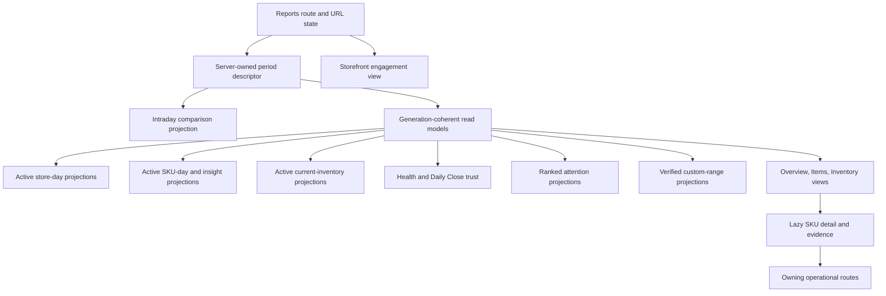
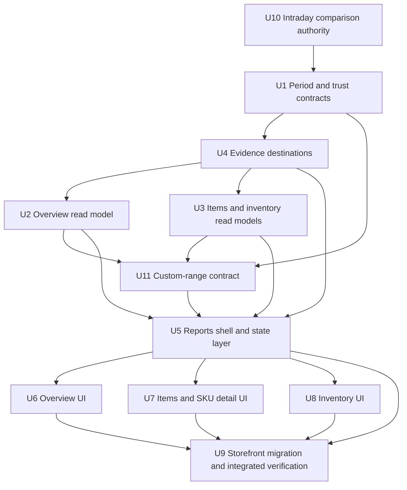
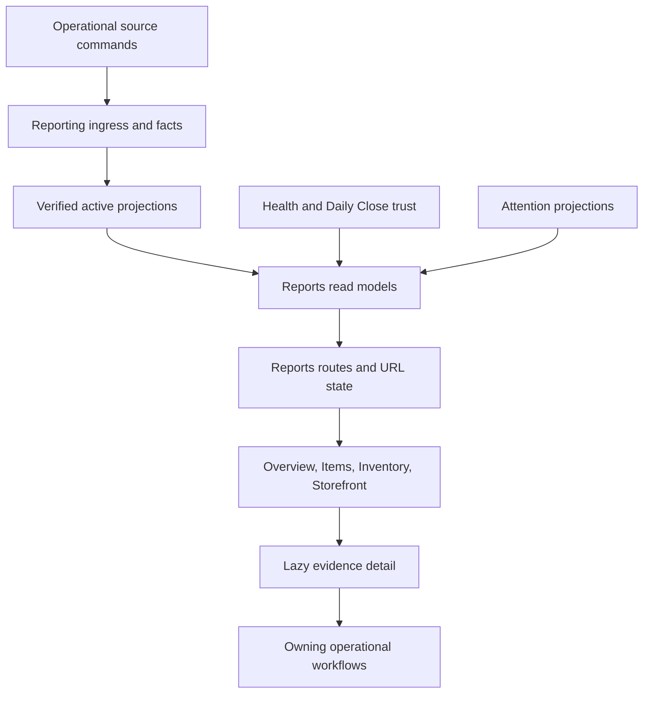

# feat: Build the Reports workspace

## Summary

Build Reports as Athena's canonical full-admin business-reporting workspace by adding generation-coherent, server-shaped read models before the React surfaces that consume them. The delivery replaces the early `/analytics` route with directly addressable Reports views for Overview, Items, SKU detail, Inventory, and Storefront; it preserves active verified projections as the only reporting authority and exposes completeness, freshness, cost coverage, comparison, and source evidence without reconstructing business meaning in the browser.

---

## Problem Frame

The reporting foundation and governed Wigclub dev backfill now provide active store-day and SKU-day generations, but the current public APIs remain projection-oriented rather than workspace-oriented. They return single-day or raw metric rows, separate health and attention reads, minimally hydrated SKU identities, and specialized asynchronous custom-range/evidence protocols. Building directly on those methods would push period semantics, comparison, trust-state reduction, identity hydration, and routing into React, recreating the same fan-out and semantic drift that Athena previously removed from storefront analytics.

The origin requirements define the product shape and metric boundaries (see origin: `docs/brainstorms/2026-07-09-reports-workspace-requirements.md`). This plan defines the implementation path that makes those requirements executable without weakening reporting authority.

---

## Requirements

This plan carries all origin requirements R1-R63. The groupings below are traceability aids, not replacements for the origin definitions.

- **R1-R12 — Workspace, access, period, and currency:** store-scoped, full-admin-only Reports; server-owned WTD and comparison periods; today, prior-week, trailing-30-day, and custom ranges; explicit refresh and partial-day state; shared workspace presentation; stored-currency formatting.
- **R13-R22 — Revenue and profitability:** deduplicated unified revenue with channel and merchandise/service lanes; documented gross/discount/refund/net semantics; immutable merchandise cost; coverage-aware merchandise profit; no unsupported service or combined profit.
- **R23-R30 — SKU-first performance:** SKU authority, exact product/category rollups, movement and inventory metrics, bounded classifications, on-hand versus sellable, and guarded velocity/cover/turnover/age claims.
- **R31-R38 — Highlight and route:** deterministic, ranked integrity/money/inventory/operational signals with one owning destination and no mutation inside Reports.
- **R39-R46 — Evidence and trust:** source-linked aggregates and trusted-SKU evidence, explicit truncation/staleness/omission, unknown-versus-zero cost, continued trade, no current-cost substitution, and Daily Close trust evidence.
- **R47-R52 — Valuation:** existing moving-weighted-average authority and immutable sale basis remain intact; Reports exposes costed/uncosted/deficit state and correction effects without rewriting source history.
- **R53-R58 — Refund and return semantics:** refund-period money and original-sale SKU performance remain separately named; physical disposition determines inventory and COGS effects.
- **R59-R63 — Expense and service boundaries:** inventory consumed is not generalized operating expense; accounting profit and unsupported service costs remain excluded.

**Origin actors:** A1 full administrator, A2 Athena, A3 owning operational workflow.

**Origin flows:** F1 balanced store pulse, F2 SKU investigation, F3 inventory movement and capital exposure, F4 attention routing, F5 cross-period refund reconciliation.

**Origin acceptance examples:** AE1-AE10 are mandatory cross-layer scenarios and are mapped to implementation units below.

---

## Scope Boundaries

- Reports is store-scoped and full-admin-only. Organization rollups, store comparison, manager elevation, and `pos_only` access remain excluded.
- `/reports` replaces `/analytics` as a deliberate breaking change. No redirect or compatibility route is retained; all in-repo callers and generated route artifacts move together.
- Storefront engagement becomes `/reports/storefront` but remains an independently named engagement view, never a financial source.
- Reports remains read-only and routes action to Product edit, Procurement, Transactions, Cash Controls, SKU Activity, or Terminal Health.
- General accounting, bank reconciliation, cash flow, payroll, rent, utilities, tax filing, and accounting net profit remain outside the product.
- Service revenue is included; service delivery cost and service profitability remain deferred.
- True stock age, FIFO/lot analysis, speculative forecasting, and operator-configurable thresholds remain excluded.
- Reporting UI does not mutate operational records, repair historical sources, or activate/rebuild projection generations.

### Deferred to Follow-Up Work

- Organization-level rollups and cross-store comparison: separate product and reporting-contract work after store-scoped Reports is proven.
- Configurable goals and attention thresholds: separate policy-design work after deterministic defaults have operator evidence.
- Export/download workflows: separate delivery after browser drill-down and pagination semantics are stable.

---

## Context & Research

### Relevant Code and Patterns

- `packages/athena-webapp/convex/reporting/public.ts` is the active-generation, store-scoped read boundary. Extend it through focused read-model modules rather than bypassing it.
- `packages/athena-webapp/convex/reporting/customRangeRequests.ts` already owns bounded asynchronous custom-range request, reuse, status, failure, and paginated-result lifecycles.
- `packages/athena-webapp/convex/reporting/evidence.ts` already owns paginated trusted-SKU evidence, cursor scoping, access rechecks, and safe source references.
- `packages/athena-webapp/convex/reporting/projections/skuInsights.ts` already composes velocity, cover, inbound state, cost coverage, inventory value, and corrections. Extend/reuse this authority instead of duplicating calculations in React.
- `packages/athena-webapp/src/components/common/PageLevelHeader.tsx` provides workspace rhythm; `packages/athena-webapp/src/components/operations/OperationsSummaryMetric.tsx` provides shared KPI language.
- `packages/athena-webapp/src/routes/_authed/$orgUrlSlug/store/$storeUrlSlug/operations/sku-activity.tsx` accepts `productSkuId` and is the durable non-sale evidence destination.
- Existing transaction, procurement, product-edit, cash-controls, and terminal routes provide action ownership for typed attention/evidence destinations.
- `packages/athena-webapp/src/components/analytics/AnalyticsView.tsx` remains the storefront-engagement implementation initially, but moves beneath the Reports route and gains explicit loading/empty/error treatment.

### Institutional Learnings

- `docs/solutions/architecture/athena-reporting-fact-projection-boundary-2026-07-09.md`: public reads use only compatible active verified generations; incomplete history and cost remain explicit; projections never become operational command gates.
- `docs/solutions/performance/athena-analytics-workspace-snapshot-2026-05-08.md`: workspaces consume bounded server-shaped snapshots, not raw rows followed by client aggregation or child-query fan-out.
- `docs/solutions/performance/athena-convex-read-amplification-2026-06-29.md`: keep route-default subscriptions bounded and move evidence/history behind explicit detail hydration.
- `docs/solutions/harness/daily-operations-hydration-and-hook-env-2026-06-30.md`: separate page posture from lazy detail hydration and keep overview inputs stable while detail changes.
- `docs/solutions/architecture/athena-store-pulse-daily-operations-reuse-2026-06-22.md`: store-time windows are server-owned; presentation may be shared below feature-owned wrappers, but Reports metrics retain reporting-domain authority.
- `docs/solutions/architecture/athena-workspace-metric-card-alignment-2026-06-21.md`: use the shared metric-card contract for operator-scan totals.
- `docs/solutions/architecture/athena-generic-sku-search-consumer-integration-2026-06-25.md`: hydrate canonical SKU identity at a bounded server boundary while preserving consumer-specific policy.
- `docs/product-copy-tone.md`: translate internal reporting states into calm, factual operator language without hiding limitations.

### External References

- None. Athena already contains current, direct patterns for TanStack Router, Convex projection reads, access control, paginated evidence, custom-range jobs, and workspace presentation. Local contracts are more authoritative than generic framework guidance for this plan.

---

## Key Technical Decisions

| Decision | Resolution | Rationale |
|---|---|---|
| Workspace authority | Server-shaped Reports DTOs read compatible active projections only | Prevents React aggregation, mutable-source recomputation, and semantic drift |
| Period ownership | A server-owned period descriptor resolves store-time presets, elapsed cutoff, comparison range, partial days, and refresh context; a reporting-owned intraday projection supplies exact same-elapsed metrics | Day totals alone cannot satisfy R5/AE1 without including the remainder of the prior comparison day |
| Cross-projection coherence | Every composite captures activation IDs once, then applies an explicit compatibility matrix across contract versions, source lineage, stable watermarks, and as-of semantics | Store-day, SKU-day, inventory, attention, custom range, and health activate independently |
| Preset versus custom range | Presets read bounded active projections synchronously; custom ranges retain an asynchronous lifecycle and materialize range-scoped overview, SKU, rollup, and movement results | Avoids expensive request-time scans while giving every required Reports view an authoritative custom-range result |
| Trust-state presentation | One browser-safe reducer maps generation, health, metric completeness, coverage, and source state into page and section presentation states | Prevents `active`, `partial`, `uncosted`, `stale`, and `empty` from collapsing into a generic banner |
| SKU identity and aggregation | Hydrate SKU/product/category/route identity inside bounded reporting reads; selected-period SKU metrics and rollups remain server-owned | Avoids N+1 subscriptions and guarantees product/category totals equal SKU facts |
| Evidence routing | Convert sanitized source references and attention destinations into typed, authorized application destinations with unavailable fallbacks | Keeps routing declarative without exposing raw source lookup behavior to React |
| Refund display | Separate refund-period money activity from original-sale adjusted SKU performance in contracts and labels | Preserves the dual-basis product requirement without suggesting the sale occurred twice |
| Route migration | Create nested `/reports` routes and remove `/analytics` in the same route/navigation unit | Early development permits a cleaner breaking design; generated route and internal caller changes land atomically |
| Storefront placement | Reuse the existing engagement view under `/reports/storefront`; do not mix its live engagement timeframe into the selected financial period | Preserves useful analytics while making its subordinate, non-financial role explicit |

---

## Open Questions

### Resolved During Planning

- **Canonical recognition/deduplication (origin R13-R16):** the UI consumes the normalized reporting fact/projection result and contribution lanes; it never reconciles POS, service, storefront, or payment source rows. Existing fact identity and source-adapter policy remains authoritative.
- **Legacy/mixed valuation (origin R17-R20, R47-R52):** known cost publishes only its known portion, unknown and legitimate zero remain distinct, sale-time basis is immutable, and explicit historical policy never supplies valuation currency or cost.
- **Long ranges (origin R23-R30):** common presets use bounded materialized reads; arbitrary ranges use the existing resumable generation and paginated result contract with explicit incomplete/failure states.
- **Attention precedence (origin R31-R38):** backend metric-versioned rules own per-SKU reason precedence and deterministic cross-SKU ranking; UI renders one primary destination and subordinate reasons.
- **Trusted-SKU evidence (origin R39-R42):** extend the existing reporting-owned evidence table and cursor-scoped action with UI-safe presentation and destination hydration; do not scan POS/storefront rows from the browser.
- **Partial day versus Daily Close (origin R42, R46):** canonical report projections remain the metric source; Daily Close supplies date-level trust and post-close-delta evidence, never an alternate total to add again.

### Deferred to Implementation

- Exact read-model module split under `convex/reporting/`: choose the smallest boundaries that keep period resolution, composition, and presentation independently testable.
- Exact small-screen table/detail presentation: preserve the URL and accessibility contract while choosing the simplest existing responsive pattern during component implementation.

---

## High-Level Technical Design

> *This illustrates the intended approach and is directional guidance for review, not implementation specification. The implementing agent should treat it as context, not code to reproduce.*

The period descriptor and composite metadata are shared across Overview, Items, and Inventory. Each section may degrade independently when its active generation or coverage differs, while the page retains last-good compatible data where the reporting contract permits it. SKU evidence remains lazy and cursor-scoped. Custom ranges remain request-driven and surface their lifecycle through URL-addressable range state rather than pretending to be synchronous.

---

## Implementation Units

- U10. **Add exact intraday comparison projections**

**Goal:** Create the reporting-owned authority required to compare the current elapsed portion of a partial operating day with the exact equivalent prior-period cutoff, without scanning mutable source rows or substituting full-day totals.

**Requirements:** R4-R7, R13-R22, R42-R46; F1; AE1-AE3, AE9.

**Dependencies:** None.

**Files:**
- Modify: `packages/athena-webapp/convex/schemas/reporting/projections.ts`
- Modify: `packages/athena-webapp/convex/schema.ts`
- Create: `packages/athena-webapp/convex/reporting/projections/storeIntraday.ts`
- Modify: `packages/athena-webapp/convex/reporting/projections/apply.ts`
- Modify: `packages/athena-webapp/convex/reporting/maintenance/rebuild.ts`
- Modify: `packages/athena-webapp/convex/reporting/activation.ts`
- Test: `packages/athena-webapp/convex/reporting/projections/storeIntraday.test.ts`
- Modify: `packages/athena-webapp/convex/reporting/maintenance/rebuild.test.ts`
- Modify: `packages/athena-webapp/convex/reporting/activation.test.ts`
- Modify: `packages/athena-webapp/convex/reporting/schemaIndexes.test.ts`

**Approach:**
- Materialize bounded cumulative store metrics at 15-minute reporting checkpoints within each operating day, keyed by generation, operating date, and checkpoint time in the store schedule lineage.
- Preserve enough event-time precision at the active partial checkpoint to resolve the exact current elapsed cutoff; derive the prior comparison from the corresponding checkpoint plus the bounded remainder to the exact cutoff when the current instant falls between checkpoints.
- Use reporting facts/evidence only for that bounded remainder and require an indexed store/date/recognition-time boundary; never read mutable POS/storefront/service rows. The scale gate permits at most 200 fact/evidence documents in one checkpoint remainder; if a store can exceed that density, implementation must shorten the checkpoint interval before activation rather than truncate.
- Include the same revenue, discounts, refunds, units, known COGS, uncovered revenue, currency, completeness, and lineage semantics as store-day projections.
- Build/reconcile/activate the intraday authority with store-day reporting and include historical backfill/rebuild coverage where event-time evidence exists; explicitly mark unavailable comparison intervals rather than approximating when evidence is insufficient.
- Count the 200-document remainder gate as indexed rows scanned, including rows later excluded as superseded, quarantined, or noncontributing. Exceeding the gate fails verification/activation with explicit `evidence_truncated` health and rebuild-run evidence; maintainers must reduce the checkpoint interval and rebuild before activation.

**Execution note:** Implement projection arithmetic, cutoff boundaries, reconciliation, and rebuild behavior test-first.

**Patterns to follow:**
- `packages/athena-webapp/convex/reporting/projections/storeDay.ts`
- `packages/athena-webapp/convex/reporting/maintenance/rebuild.ts`
- `packages/athena-webapp/convex/reporting/activation.ts`

**Test scenarios:**
- Covers AE1. A Wednesday 14:37 cutoff returns Monday-to-Wednesday-14:37 for both current and prior week, excluding all prior Wednesday events after 14:37.
- Events exactly at, immediately before, and immediately after a checkpoint/cutoff are included once according to the declared bound convention.
- Overnight operating days and Store Schedule changes preserve local elapsed-time equivalence and lineage.
- Late-synchronized facts retain their recognition/operating-period semantics and update rebuild output without silently changing accepted Daily Close evidence.
- Historical intervals without sufficient intraday evidence return comparison unavailable/partial instead of full-day approximation.
- Intraday and store-day totals reconcile at the final checkpoint for complete days across revenue, refund, units, known cost, and uncovered lanes.
- High-volume partial days use the checkpoint plus bounded indexed remainder within the declared read budget.
- A remainder that would scan more than 200 indexed rows blocks verification/activation, records failed health/run evidence, and never returns a truncated comparison as complete.

**Verification:**
- R5/AE1 has a concrete reporting authority and can be implemented without client calculation, full-day approximation, or unbounded fact scans.

- U1. **Define reporting periods, comparison, coherence, and presentation states**

**Goal:** Establish browser-safe contracts for server-owned reporting periods, comparison windows, generation coherence, Daily Close trust, and section-level presentation state before any workspace DTO is built.

**Requirements:** R1-R7, R12, R20, R28-R29, R42-R46; F1, F3; AE1, AE3, AE9.

**Dependencies:** U10.

**Files:**
- Modify: `packages/athena-webapp/shared/reportingContract.ts`
- Create: `packages/athena-webapp/convex/reporting/periods.ts`
- Create: `packages/athena-webapp/convex/reporting/readModels/presentation.ts`
- Test: `packages/athena-webapp/convex/reporting/periods.test.ts`
- Test: `packages/athena-webapp/convex/reporting/readModels/presentation.test.ts`
- Modify: `packages/athena-webapp/convex/reporting/public.test.ts`

**Approach:**
- Resolve today, WTD, prior week, trailing 30 days, and custom ranges from store schedule/timezone evidence and an explicit evaluation instant.
- Return current and comparison ranges, same-elapsed cutoff, partial operating dates, refresh time, and the frozen/source watermark context needed by consumers.
- Define coherence metadata for every participating projection kind rather than implying an atomic activation that does not exist.
- Capture all participating activation IDs at the start of a composite read. Accept sections only when fact, metric, and projection contract versions match their declared dependencies; require derived projections to name the captured source generation IDs; treat current inventory as a separately labeled newer/older as-of snapshot; and reject or limit already-incompatible captured inputs or cross-request pages whose lineage no longer matches the cursor. A single Convex query remains snapshot-consistent.
- Bind paginated continuations to store, period/comparison, filter, sort, contract versions, captured generation IDs, and stable watermarks. Rollback, activation, or auth changes invalidate the cursor rather than mixing pages.
- Define precedence for loading, pre-cutover, last-good processing, complete, cost-partial, source-unsynchronized, stale, failed, mixed-currency, truncated, and valid-empty states at page and section scope.
- Keep metric availability granular: missing cost can withhold profit while preserving trustworthy revenue and units.

**Execution note:** Implement contract and reducer behavior test-first because later UI units depend on stable semantics.

**Patterns to follow:**
- `packages/athena-webapp/convex/operations/storeSchedule.ts`
- `packages/athena-webapp/convex/reporting/health.ts`
- `packages/athena-webapp/convex/reporting/coverage.ts`
- `packages/athena-webapp/shared/reportingContract.ts`

**Test scenarios:**
- Covers F1 / AE1. Wednesday afternoon WTD resolves Monday through the current elapsed instant and compares against the equivalent prior-week slice, marking Wednesday partial.
- Today, prior week, and trailing 30 days resolve in the store timezone across operating-day boundaries rather than browser-local midnight.
- A Store Schedule change inside a range preserves per-day lineage and produces a valid aggregate descriptor.
- A mixed set of store-day, SKU-day, inventory, and attention generations exposes each generation/watermark and limits only incompatible sections.
- Compatibility-matrix cases cover equal contracts/different permissible as-of watermarks, derived attention with matching versus superseded source generations, inventory newer/older than period facts, rollback to a prior generation, captured-generation helper behavior, and activation between separate reads/subscriptions/pages.
- Missing-cost partial coverage leaves net sales and units available while profit and valuation disclose their limitation.
- A prior comparison denominator of zero, negative, or below the metric's meaningful basis never produces infinite/misleading percentage change; return absolute change when meaningful or comparison unavailable with a reason.
- Source-unsynchronized, processing-delayed, failed-with-last-good, failed-without-data, pre-cutover, and zero-activity states reduce to distinct presentation outcomes.
- Closed Monday/Tuesday plus partial Wednesday does not label the entire WTD final; a post-close delta names the affected closed date.
- Store switch or changed period rejects stale cursor/run metadata from the prior store or period.

**Verification:**
- Every workspace consumer can receive one authoritative period/trust contract without calculating dates or interpreting raw reporting statuses in React.

**Compatibility outcomes:**

| Captured inputs | Accepted outcome | Limited/rejected outcome |
|---|---|---|
| Store-day + intraday | Intraday must name the exact captured store-day source generation and compatible contracts; current totals and exact comparison render | Mismatched source generation withholds intraday comparison only; store-day totals retain their own state |
| Store-day + SKU-day | Equal contracts and equal stable watermark permit cross-section reconciliation and deltas | Equal contracts with unequal watermarks may render each section independently with timestamps, but cross-section reconciliation/deltas are withheld; contract mismatch makes Items unavailable |
| Store-day + current inventory | Inventory is independently displayable as current-as-of when contracts are compatible and its health state is complete/partial | Stale inventory may render last-good with a stale timestamp and no period-end implication; failed/unavailable inventory withholds inventory metrics without failing period money |
| SKU-day + SKU insights | Insights must name the exact captured SKU-day and inventory source generations used to derive them | Missing/superseded source lineage makes velocity, cover, margin classification, and related sorting unavailable while base SKU metrics may remain |
| Metrics + attention | Attention must name the captured source generations and compatible rule/contracts | Source-lineage mismatch withholds attention only; it never suppresses otherwise trustworthy positive metrics |
| Custom-range result | A verified result remains a labeled frozen snapshot bound to its request source generations/contracts/watermark | It is never silently refreshed from newer activations; changing range/source context requires a new/reused matching request |
| Activation changes after capture | Reads continue by the activation IDs captured at query start and remain coherent if those generation rows are still readable | Missing/incompatible captured rows limit their owning section; pages using a different activation fail cursor validation and restart |

- U4. **Present SKU evidence and typed operational destinations**

**Goal:** Turn reporting-owned SKU evidence and attention source references into safe, period-correct detail DTOs and application destinations.

**Requirements:** R31-R46, R53-R58; F2, F4, F5; AE5, AE7-AE9.

**Dependencies:** U1.

**Files:**
- Modify: `packages/athena-webapp/shared/reportingContract.ts`
- Modify: `packages/athena-webapp/convex/reporting/evidence.ts`
- Create: `packages/athena-webapp/convex/reporting/readModels/destinations.ts`
- Test: `packages/athena-webapp/convex/reporting/evidence.test.ts`
- Test: `packages/athena-webapp/convex/reporting/evidenceAccess.test.ts`
- Test: `packages/athena-webapp/convex/reporting/readModels/destinations.test.ts`

**Approach:**
- Resolve selected operating-date ranges to store-time timestamp bounds with an explicit end convention; keep evidence cursors scoped to store, SKU, period, and contract version.
- Present transaction/channel/time/quantity/net value/cost/profit/refund/adjustment/disposition fields while preserving the evidence row's completeness and provenance.
- Map supported source types and attention destinations to typed route descriptors only after store/target authorization; return an unavailable descriptor for deleted, unsupported, or historical-only targets.
- Include payment-allocation and service-case destinations where an authorized Athena route exists; otherwise return the same browser-safe unavailable descriptor used for missing, unauthorized, cross-store, and unsupported targets while retaining denial detail only in internal audit evidence.
- Keep ranges beyond the evidence contract's supported window explicit and navigable through narrower period selection rather than silently truncating.
- Preserve separate refund-period and original-sale context so detail labels cannot imply double recognition.

**Execution note:** Preserve existing race-denial and cursor-security tests before expanding returned presentation data.

**Patterns to follow:**
- `packages/athena-webapp/convex/reporting/evidence.ts`
- `packages/athena-webapp/convex/reporting/directAccess.ts`
- `packages/athena-webapp/src/routes/_authed/$orgUrlSlug/store/$storeUrlSlug/operations/sku-activity.tsx`

**Test scenarios:**
- Covers AE5. A trusted SKU returns paginated POS and storefront evidence for the selected period plus a preselected SKU Activity destination.
- Authorized service-case and payment-allocation evidence resolves to its owning detail when supported; missing, unauthorized, cross-store, and unsupported targets are indistinguishable to the browser.
- Exact operating-day boundary, overnight schedule, store-time conversion, and inclusive/exclusive end handling include each event once.
- A later-period refund links to an original sale outside the selected money period without moving the original sale into that period.
- Financial refund, restock, damaged return, exchange, void, and correction expose distinct dispositions and COGS effects.
- Procurement, Cash Controls/session, transaction detail, Product edit, SKU Activity, and Terminal Health route descriptors resolve correctly.
- Cross-store identifiers, forged cursors, deleted targets, unsupported source types, and auth changes fail closed or return safe unavailable destinations without leaking raw records.
- Evidence window overflow and truncation disclose the limitation and do not return a misleading complete result.

**Verification:**
- Every aggregate/detail path reaches authorized source evidence or an explicit unavailable state; no UI component invents route parameters from raw source types.

- U2. **Compose the Reports overview read model**

**Goal:** Return one bounded, generation-aware overview DTO containing headline metrics, comparisons, revenue lanes, inventory position, cost coverage, trust context, and ranked attention.

**Requirements:** R1-R22, R31-R38, R42-R46, R53-R63; F1, F4, F5; AE1-AE3, AE7-AE10.

**Dependencies:** U1, U4.

**Files:**
- Create: `packages/athena-webapp/convex/reporting/readModels/overview.ts`
- Modify: `packages/athena-webapp/convex/reporting/public.ts`
- Modify: `packages/athena-webapp/convex/reporting/projections/attention.ts`
- Modify: `packages/athena-webapp/convex/schemas/reporting/projections.ts`
- Modify: `packages/athena-webapp/convex/schema.ts`
- Create: `packages/athena-webapp/convex/reporting/projections/dailyCloseTrust.ts`
- Test: `packages/athena-webapp/convex/reporting/readModels/overview.test.ts`
- Modify: `packages/athena-webapp/convex/reporting/public.test.ts`
- Modify: `packages/athena-webapp/convex/reporting/projections/attention.test.ts`
- Test: `packages/athena-webapp/convex/reporting/projections/dailyCloseTrust.test.ts`
- Modify if indexes change: `packages/athena-webapp/convex/reporting/schemaIndexes.test.ts`

**Approach:**
- Aggregate active store-day metrics across the resolved current and comparison periods without re-reading operational source rows.
- Return semantically named totals for gross sales, discounts, refunds, net sales, units, known merchandise COGS/profit, uncovered merchandise revenue, service revenue, inventory value, uncosted units, commitments, and inventory consumed.
- Preserve channel and revenue-type contribution lanes without allowing payments or linked service allocations to double-count revenue.
- Attach metric-specific completeness/coverage and comparison availability rather than a single all-or-nothing page status.
- Attach typed evidence descriptors to aggregate families: revenue/contribution/refund totals route to filtered Transactions, Orders, Services, or payment evidence; product/category contributions route to filtered Items; inventory value/movement routes to Inventory; commitments route to Procurement. Descriptors preserve the selected period/filter and may resolve to unavailable when source detail cannot be authorized.
- Aggregate Daily Close trust per operating date and expose affected dates/post-close deltas without summing accepted close totals into canonical projections.
- Materialize one current Daily Close trust summary per generation and operating date, including accepted version, completeness, post-close deltas, and supersession state. Read summaries through a bounded generation/date index; cap presets at 30 dates and page longer custom-range trust results rather than fanning out one query per date or loading close history.
- Produce deterministic cross-SKU/store attention ranking with one primary destination, secondary reasons, affected values/units, and limitations.
- Keep initial rule-version-2 thresholds from `attentionRules.ts`: source lag over five minutes, incomplete required coverage, or failed/review activity; any uncosted on-hand quantity or eligible revenue; refunds/corrections at 500 basis points or three events; inbound expected before now; short receipt; low cover at no more than seven days with at least seven active days and three net sold units; missing inbound against fourteen target cover days; any nonzero unresolved cash variance. Precedence is store cash/source integrity, then SKU `source_integrity`, `missing_cost`, `refund_void_correction`, `late_inbound`, `short_receipt`, `missing_inbound_cover`, `low_cover`. Within one reason, rank by affected risk and then stable SKU id.
- Label current inventory and commitments with their own current-as-of generation time/watermark. Historical period selection never changes that label or implies period-end historical valuation.

**Execution note:** Start with cross-source and incomplete-data contract tests before adding the public query surface.

**Patterns to follow:**
- `packages/athena-webapp/convex/reporting/public.ts`
- `packages/athena-webapp/convex/reporting/projections/storeDay.ts`
- `packages/athena-webapp/convex/reporting/projections/attention.ts`
- `packages/athena-webapp/convex/reporting/projections/dailyClose.ts`

**Test scenarios:**
- Covers AE2. A POS transaction containing product and service lines, a linked paid service case, and a completed storefront order contributes each recognized amount once and reports correct lanes.
- Covers AE3. Ninety-percent merchandise cost coverage publishes covered profit, uncovered revenue, and 90% coverage without substituting current SKU cost.
- Covers AE7. A Week 2 refund appears in Week 2 money activity while adjusted product performance remains attributable to the Week 1 sale.
- Covers AE8. A low-cover SKU without inbound supply ranks with a Procurement destination and performs no mutation.
- Covers AE9. Unsynchronized POS activity limits affected dates/metrics and points to Terminal Health while safe last-good values remain visible.
- Covers AE10. Inventory consumed is named accurately, and no operating profit, net profit, payroll, rent, or overhead total is returned.
- Legitimate zero cost remains covered zero; missing cost remains unknown; mixed revenue/valuation currency limits only affected money lanes.
- Attention precedence is deterministic for multiple reasons on one SKU and across many SKUs, with stable bounded ranking and no duplicate primary cards.
- Every attention threshold is tested immediately below, exactly at, and immediately above its boundary; multi-signal fixtures prove precedence and stable cross-SKU tie-breaking.
- Captured-generation helper tests prove a composite reads the activation IDs present at query start; real race coverage changes activation between separate subscriptions/pages and verifies cursor invalidation or section limitation, consistent with Convex snapshot execution.
- A 30-day Overview fixture reads no more than 30 current Daily Close trust summaries and stays within a 500-document total read budget with no unbounded `collect`.
- Partial refund on a multi-line sale, exchange replacement, and mixed known/unknown snapshotted line cost reconcile across refund-period Overview money, original-sale adjusted SKU performance, physical inventory disposition, and COGS reversal; separately defined view values are not incorrectly required to be identical.

**Verification:**
- One overview subscription can render the complete business pulse without child metric, identity, attention, health, or Daily Close queries.

- U3. **Compose hydrated item and inventory read models**

**Goal:** Provide bounded, selected-period SKU performance, exact rollups, and inventory movement/capital DTOs with comparison, classification, identity, and coverage already resolved.

**Requirements:** R23-R30, R39, R42-R52, R59-R60; F2, F3; AE4, AE6, AE10.

**Dependencies:** U1, U4.

**Files:**
- Create: `packages/athena-webapp/convex/reporting/readModels/items.ts`
- Create: `packages/athena-webapp/convex/reporting/readModels/inventory.ts`
- Modify: `packages/athena-webapp/convex/reporting/public.ts`
- Modify: `packages/athena-webapp/convex/reporting/projections/skuInsights.ts`
- Modify: `packages/athena-webapp/convex/schemas/reporting/projections.ts`
- Modify: `packages/athena-webapp/convex/schema.ts`
- Modify: `packages/athena-webapp/convex/reporting/maintenance/rebuild.ts`
- Test: `packages/athena-webapp/convex/reporting/readModels/items.test.ts`
- Test: `packages/athena-webapp/convex/reporting/readModels/inventory.test.ts`
- Modify: `packages/athena-webapp/convex/reporting/projections/skuInsights.test.ts`
- Modify: `packages/athena-webapp/convex/reporting/reportingScale.test.ts`
- Modify if needed: `packages/athena-webapp/convex/reporting/schemaIndexes.test.ts`

**Approach:**
- Hydrate product, SKU, variant/attributes, category, archived state, and routable product identity inside each bounded page.
- Materialize selected-window SKU performance rows with indexed sort keys for revenue, margin, units/velocity, cover, inventory value, and attention/classification precedence. Public endpoints paginate persisted orderings rather than sorting a fetched page.
- Materialize complete product/category rollups and classification facet counts from the same generation-wide SKU facts before pagination; never compute a store-wide total from one returned page.
- Reuse SKU insight authority for velocity, cover, inbound state, cost coverage, inventory value, and refund/correction signals while making its analysis window explicit.
- Support deterministic classification and ordering for fast movers, slow/nonmoving stock, low-cover winners, high-revenue low-margin items, and value concentrated in weak performers.
- Compose inventory current-as-of metrics separately from selected-period movement metrics: receipts, sales, returns, consumed, adjustments, commitments, and inbound cover.
- Return evidence descriptors for each rollup and movement family: product/category to filtered Items, SKU aggregates to SKU detail, receipts/commitments to Procurement, sales/returns to source transactions/orders, consumed/adjustments to SKU Activity or stock-adjustment evidence.
- Use recognition-time SKU identity as the historical fact key. Label current product/category/name hydration as current catalog context; period category rollups use reporting-captured recognition classification when available and otherwise disclose current-classification fallback instead of silently rewriting history.
- Bind Items/Inventory cursor envelopes to store, period/comparison, filter, sort, contracts, captured generation IDs, and stable watermarks; recheck membership and authority for every page.
- Withhold sell-through, turnover, cover, or other derived claims when their required opening/inbound/outbound evidence is insufficient.

**Execution note:** Use high-cardinality fixtures and test-first bounded-read assertions before exposing the public DTOs.

**Patterns to follow:**
- `packages/athena-webapp/convex/reporting/projections/skuInsights.ts`
- `packages/athena-webapp/convex/reporting/projections/inventory.ts`
- `packages/athena-webapp/convex/stockOps/replenishment.ts`
- `packages/athena-webapp/convex/search/skuSearch.ts`

**Test scenarios:**
- Covers AE4. Two variants with distinct stock, cost, and velocity remain separate; product/category rollups exactly equal their SKU rows.
- Covers AE6. A weighted-average receipt affects future valuation and sale basis while earlier sale cost remains unchanged; the DTO exposes the resulting cost coverage and value.
- Archived, renamed, or deleted-display SKU history remains reportable with stable identity and a safe unavailable destination when current catalog routing is impossible.
- Zero sales, negative net units after returns, on-hand/sellable divergence, insufficient velocity, and mixed currency produce explicit values/limitations rather than fabricated classifications.
- Legacy uncosted on-hand, partially costed inventory, legitimate zero-cost stock, deficits, revaluation, and non-restocked returns preserve known and unknown lanes.
- Late/short/partial/cancelled purchase orders affect commitments and inbound cover according to existing procurement status semantics.
- Pagination and sorting remain stable at high SKU cardinality and do not issue per-row product/category queries.
- A fixture with 10,000 SKUs and a 30-day selected/comparison window returns at most 100 rows, performs no unbounded `collect`, and stays within an asserted 350-document read budget for one Items list-page transition.
- A current-inventory fixture with 10,000 SKUs returns at most 100 exposure rows per page and keeps one Inventory page transition within 350 documents, including current position, selected-period movement, commitments, and batched identity hydration.
- Product/category totals remain exact when their SKUs span multiple pages, filters, and sort orders.
- Cross-store or forged cursors, changed filter/sort, revoked membership, store switch, activation, and rollback fail closed and do not disclose whether rows exist.
- A projection activation during pagination produces an opaque cursor mismatch/restart outcome or coherent continuation, never duplicate/mixed-generation rows.

**Verification:**
- Items and Inventory can render from one bounded query each per page/filter state, with no React aggregation or N+1 hydration.

- U11. **Complete the custom-range reporting lifecycle**

**Goal:** Make arbitrary date ranges a first-class, authorized Reports workflow whose asynchronous computation produces range-scoped Overview, Items, rollup, and Inventory movement results compatible with the common read-model contracts.

**Requirements:** R1-R7, R9, R13-R30, R39-R46, R53-R60; F1-F3, F5; AE2-AE5, AE7, AE10.

**Dependencies:** U1, U2, U3.

**Files:**
- Modify: `packages/athena-webapp/convex/reporting/customRangeRequests.ts`
- Modify: `packages/athena-webapp/convex/reporting/projections/customRange.ts`
- Modify: `packages/athena-webapp/convex/schemas/reporting/projections.ts`
- Modify: `packages/athena-webapp/convex/schema.ts`
- Test: `packages/athena-webapp/convex/reporting/customRangeRequests.test.ts`
- Modify: `packages/athena-webapp/convex/reporting/projections/customRange.test.ts`
- Modify: `packages/athena-webapp/convex/reporting/schemaIndexes.test.ts`
- Modify: `packages/athena-webapp/convex/reporting/reportingScale.test.ts`

**Approach:**
- Keep request creation/reuse, concurrency limits, resumable processing, status, failure, retry, and paginated results in the existing reporting-owned lifecycle.
- Extend verified range materialization beyond raw store totals to the same semantically named Overview values, range-scoped SKU rows, complete product/category rollups, classification facets, and period movement needed by Items and Inventory.
- Keep current inventory explicitly current-as-of its own active inventory generation; a historical custom range never implies historical inventory position or valuation.
- Bind each run/result/cursor to store, requested range, source generation IDs, contract versions, frozen/stable watermark, filter, sort, and page kind. If source authority changes, fail or restart explicitly rather than reuse stale results.
- Return progress and last-good availability as contract state; result pagination becomes available only after verification.

**Execution note:** Extend lifecycle and authorization/race tests before adding result variants.

**Patterns to follow:**
- `packages/athena-webapp/convex/reporting/customRangeRequests.ts`
- `packages/athena-webapp/convex/reporting/maintenance/runLedger.ts`
- `packages/athena-webapp/convex/reporting/directAccess.ts`

**Test scenarios:**
- Valid dates create a run; identical authorized requests reuse it; different stores/ranges/watermarks do not collide.
- Pending, running, paused/resumed where supported, completed, failed, retried, cancelled, and stale-source transitions expose deterministic status and safe last-good behavior.
- Overview, SKU rows, product/category rollups, classification facets, and inventory movement result pages share the same verified source lineage and reconcile to the range totals.
- Product/category totals remain exact when their SKUs span multiple pages, filters, and sort orders.
- Historical ranges label inventory as current-as-of or omit it; they never present current inventory as historical period-end valuation.
- Changed store, period, filter, sort, auth membership, activation, rollback, or forged cursor fails closed without existence disclosure.
- At most two custom-range runs process concurrently per store; each worker reads/materializes at most 100 source/result documents per batch, each result page returns at most 100 rows, and a 3,660-day request resumes across batches without unbounded `collect` or duplicate materialization.

**Verification:**
- Custom-range selection can drive every in-scope Reports view through one explicit asynchronous lifecycle without client aggregation or stale result reuse.

- U5. **Create the Reports route shell and shared presentation layer**

**Goal:** Replace `/analytics` with a full-admin `/reports` hierarchy and establish shared URL, loading, trust-state, formatting, and navigation primitives for all Reports views.

**Requirements:** R1-R12, R20, R31-R46; F1-F4; AE1, AE3, AE8-AE9.

**Dependencies:** U2, U3, U4, U11.

**Files:**
- Delete: `packages/athena-webapp/src/routes/_authed/$orgUrlSlug/store/$storeUrlSlug/analytics.tsx`
- Create: `packages/athena-webapp/src/routes/_authed/$orgUrlSlug/store/$storeUrlSlug/reports.tsx`
- Create: `packages/athena-webapp/src/routes/_authed/$orgUrlSlug/store/$storeUrlSlug/reports/index.tsx`
- Create: `packages/athena-webapp/src/routes/_authed/$orgUrlSlug/store/$storeUrlSlug/reports/items.tsx`
- Create: `packages/athena-webapp/src/routes/_authed/$orgUrlSlug/store/$storeUrlSlug/reports/items/$productSkuId.tsx`
- Create: `packages/athena-webapp/src/routes/_authed/$orgUrlSlug/store/$storeUrlSlug/reports/inventory.tsx`
- Create: `packages/athena-webapp/src/routes/_authed/$orgUrlSlug/store/$storeUrlSlug/reports/storefront.tsx`
- Create: `packages/athena-webapp/src/components/reports/ReportsLayout.tsx`
- Create: `packages/athena-webapp/src/components/reports/reportPresentation.ts`
- Create: `packages/athena-webapp/src/components/reports/ReportStatusBand.tsx`
- Create: `packages/athena-webapp/src/components/reports/ReportPeriodControl.tsx`
- Create: `packages/athena-webapp/src/components/reports/CustomRangeStatus.tsx`
- Create: `packages/athena-webapp/src/components/reports/reportDestinations.ts`
- Modify: `packages/athena-webapp/src/components/app-sidebar.tsx`
- Modify: `packages/athena-webapp/src/components/analytics/AnalyticsView.tsx`
- Modify: `packages/athena-webapp/src/components/dashboard/Dashboard.tsx`
- Modify: `packages/athena-webapp/src/components/remote-assist/RemoteAssistLiveViewer.tsx`
- Modify: `packages/athena-webapp/src/lib/access/capabilities.ts`
- Modify: `packages/athena-webapp/src/stories/Patterns/admin-shell-patterns.test.tsx`
- Modify generated: `packages/athena-webapp/src/routeTree.gen.ts`
- Test: `packages/athena-webapp/src/components/reports/ReportsLayout.test.tsx`
- Test: `packages/athena-webapp/src/components/reports/reportPresentation.test.ts`
- Test: `packages/athena-webapp/src/components/reports/ReportPeriodControl.test.tsx`
- Test: `packages/athena-webapp/src/components/reports/CustomRangeStatus.test.tsx`
- Test: `packages/athena-webapp/src/components/analytics/AnalyticsView.test.tsx`
- Modify: `packages/athena-webapp/src/components/app-sidebar.test.tsx`
- Modify: `packages/athena-webapp/src/components/remote-assist/RemoteAssistLiveViewer.test.tsx`
- Modify: `packages/athena-webapp/src/lib/access/capabilities.test.ts`
- Modify: `packages/athena-webapp/src/routes/_authed.test.tsx`

**Approach:**
- Use nested, directly addressable views: Overview at `/reports`, then `/reports/items`, `/reports/items/:productSkuId`, `/reports/inventory`, and `/reports/storefront`.
- Keep period, comparison, filters, and selected SKU in validated URL state where they must survive refresh/back-forward; reset or validate store-scoped state on store change.
- Enforce full-admin route access in addition to existing backend authorization.
- Rename the client full-admin surface capability from `analytics` to `reports`; verify full-admin access and `pos_only`/manager-elevation denial while retaining backend enforcement as the hard boundary.
- Centralize minor-unit/currency formatting and trust/cost/coverage copy; never expose raw backend status or error wording.
- Render page-level freshness/completeness as a restrained status band near period controls, not a competing KPI card.
- Remove `/analytics` intentionally and update every internal caller, shell label, breadcrumb, route map, story, and route test; do not rename unrelated analytics telemetry/domain code.
- Mount Storefront engagement at `/reports/storefront` in the same atomic cutover that deletes `/analytics`; add explicit loading/empty/unavailable states and label its independent live-engagement timeframe.
- Preserve financial period URL state for return navigation while Storefront is open, but hide financial period controls on that view and state clearly that its live engagement window is independent.
- Validate custom dates synchronously, then drive request/reuse/progress/failure/retry/completion through the asynchronous range contract. Keep run/range state URL-addressable and announce status changes through an accessible live region without replacing last-good content unnecessarily.
- On narrow screens, keep headline identity/state visible, convert dense tables to a row-summary-plus-detail pattern, preserve sortable header semantics where tables remain, and restore focus to the originating row/control after closing detail or navigating back.

**Patterns to follow:**
- `packages/athena-webapp/src/components/common/PageLevelHeader.tsx`
- `packages/athena-webapp/src/components/operations/OperationsSummaryMetric.tsx`
- `packages/athena-webapp/src/components/procurement/ProcurementView.tsx`
- `packages/athena-webapp/src/routes/_authed/$orgUrlSlug/store/$storeUrlSlug/procurement.index.tsx`
- `docs/product-copy-tone.md`

**Test scenarios:**
- `/reports` opens Overview; direct Items, SKU detail, Inventory, and Storefront URLs survive refresh and browser navigation.
- `/analytics` is absent and receives normal not-found handling; no compatibility redirect exists.
- Full admin can enter; `pos_only`, manager elevation, and unauthenticated sessions are denied before financial content renders, while backend queries independently reject them.
- Store switch invalidates incompatible period, cursor, custom-run, filter, and SKU selection state.
- Custom range validation, request/reuse, progress, failure/retry, completion, refresh, back-forward, competing request, and store-switch transitions retain correct URL and live-status behavior.
- Storefront is functional in the same commit that `/analytics` disappears; its data and live timeframe never enter financial totals.
- Valid-empty, loading, pre-cutover, complete, uncosted-partial, stale-last-good, unsynchronized, truncated, mixed-currency, and failed states render distinct calm copy and stable layout.
- Currency formatting uses stored minor-unit scale and never guesses from locale or divides already-major values.
- Keyboard navigation, active-tab semantics, focus movement, and small-screen view transitions preserve direct-route behavior.
- Coverage, limitations, partial/stale state, sort direction, attention severity, and progress are exposed through text/accessible names and never by color alone.

**Verification:**
- Reports is the only top-level reporting destination, every view has stable URL and authorization behavior, and shared state semantics are not reimplemented in feature components.

- U6. **Build the balanced Reports overview**

**Goal:** Render the default WTD business pulse, comparison, revenue/profit lanes, inventory position, coverage, trust context, and prioritized attention with routes to owning workflows.

**Requirements:** R4-R22, R31-R38, R42-R46, R53-R63; F1, F4, F5; AE1-AE3, AE7-AE10.

**Dependencies:** U5.

**Files:**
- Create: `packages/athena-webapp/src/components/reports/ReportsOverviewView.tsx`
- Create: `packages/athena-webapp/src/components/reports/ReportsMetricGrid.tsx`
- Create: `packages/athena-webapp/src/components/reports/RevenueContribution.tsx`
- Create: `packages/athena-webapp/src/components/reports/ReportAttentionList.tsx`
- Test: `packages/athena-webapp/src/components/reports/ReportsOverviewView.test.tsx`
- Test: `packages/athena-webapp/src/components/reports/ReportAttentionList.test.tsx`

**Approach:**
- Lead with unified net sales, merchandise gross profit and coverage, units sold, current inventory value and coverage, and attention count.
- Show same-elapsed comparison and partial-day context beside each metric where available; withhold unsupported deltas rather than displaying zero.
- Present product/service and POS/storefront contribution lanes beneath the unified top line while keeping merchandise profit separate.
- Explain affected amount/units, rule, limitation, and one primary route for each attention item; keep secondary reasons subordinate.
- Make every headline and contribution aggregate interactive when its evidence descriptor is available; preserve period/filter context and present a calm unavailable-detail state otherwise.
- Keep valid-zero and no-attention states useful without implying unavailable data.

**Patterns to follow:**
- `packages/athena-webapp/src/components/operations/OperationsSummaryMetric.tsx`
- `packages/athena-webapp/src/components/operations/StorePulse.tsx`
- `packages/athena-webapp/src/components/operations/DailyOperationsView.tsx`

**Test scenarios:**
- Covers AE1. Wednesday WTD and same-elapsed prior-week labels, values, comparison, refresh time, and partial marker render correctly.
- Covers AE2. Unified and contribution values display once with product/service and POS/storefront distinctions.
- Covers AE3. Known merchandise profit, 90% coverage, and uncovered revenue render without a combined service-profit claim.
- Covers AE7. Refund activity is labeled in its recognition period without moving the original sale date.
- Covers AE8. Low cover/no inbound explains units and cover and links to Procurement without an inline mutation.
- Covers AE9. Unsynchronized source limits affected metrics and offers Terminal Health while other safe values remain usable.
- Covers AE10. Inventory consumed wording is used and prohibited accounting metrics never render.
- No data, zero business activity, stale last-good, missing comparison, mixed currency, and no attention each render their correct state.
- Prior zero/negative/tiny denominators render absolute change or unavailable comparison, never infinity or an exaggerated percentage.
- Revenue, contribution, refund, inventory headline, and product/category aggregate controls reach their filtered evidence/detail destinations and retain the selected period.
- Metric comparisons and coverage have accessible names that include value, direction, period, and limitation; attention order and severity never rely on color alone.
- On narrow screens the five headline metrics remain first, contribution detail follows, and attention becomes a labeled list with full-size route targets rather than a horizontally clipped dashboard.

**Verification:**
- A full administrator can understand money direction, item movement, inventory exposure, and the highest-priority follow-up from the default page without opening another workspace.

- U7. **Build Items and SKU evidence detail**

**Goal:** Render selected-period SKU performance and classifications, then provide a deep-linkable SKU detail with transaction evidence and routes to full operational history.

**Requirements:** R23-R46, R53-R58; F2, F4, F5; AE4-AE5, AE7-AE9.

**Dependencies:** U5.

**Files:**
- Create: `packages/athena-webapp/src/components/reports/ReportsItemsView.tsx`
- Create: `packages/athena-webapp/src/components/reports/ReportsItemsTable.tsx`
- Create: `packages/athena-webapp/src/components/reports/ReportsSkuDetailView.tsx`
- Create: `packages/athena-webapp/src/components/reports/ReportsSkuEvidenceList.tsx`
- Test: `packages/athena-webapp/src/components/reports/ReportsItemsView.test.tsx`
- Test: `packages/athena-webapp/src/components/reports/ReportsSkuDetailView.test.tsx`
- Test: `packages/athena-webapp/src/components/reports/ReportsSkuEvidenceList.test.tsx`

**Approach:**
- Provide URL-addressable classification/filter/sort state for fast movers, slow/nonmoving, low-cover winners, low-margin revenue, and concentrated weak inventory.
- Render SKU identity, units sold/returned/net, net sales, known COGS/profit/margin, coverage, current stock/value, velocity, days of cover, and comparison only when trustworthy.
- Keep product/category rollups visibly subordinate to SKU authority and consistent with the same returned facts.
- Lazy-load evidence only when a SKU detail opens; preserve list filter/period context on back navigation.
- Separate selected-period money activity from original-sale adjusted performance and show transaction/source destinations plus SKU Activity for non-sale evidence.

**Patterns to follow:**
- `packages/athena-webapp/src/components/procurement/ProcurementView.tsx`
- `packages/athena-webapp/src/components/analytics/AnalyticsProducts.tsx`
- `packages/athena-webapp/src/routes/_authed/$orgUrlSlug/store/$storeUrlSlug/operations/sku-activity.tsx`

**Test scenarios:**
- Covers AE4. Two variants render independently and their product rollup equals the visible SKU values.
- Covers AE5. POS/storefront evidence paginates, links to available transaction/order detail, and provides a preselected SKU Activity route.
- Covers AE7. Later refund/no-restock state shows refund money and adjusted original-sale performance in distinct labeled lanes.
- Archived/deleted current catalog identity retains historical display and disables only unavailable current-workflow destinations.
- Missing cost versus zero cost, insufficient velocity, no sales, negative net units, on-hand/sellable divergence, missing comparison, and truncated evidence render distinctly.
- URL filters, selected SKU, back navigation, pagination, store switch, invalid SKU, and cross-store forged SKU behavior preserve scope and do not leak evidence.
- Evidence is not queried on the Items list or until the SKU detail is entered.
- Sortable columns expose active sort and direction, row-summary controls name the SKU and key state, limitation/coverage text is available to assistive technology, and focus returns to the originating SKU row after detail/back navigation.
- On narrow screens each SKU row prioritizes identity, net sales/units, stock/cover, and coverage; lower-priority comparison/profit fields move into expandable detail without removing their labels.

**Verification:**
- Every selected SKU aggregate is explainable through bounded evidence and the owning SKU Activity workflow, with no child-query fan-out.

- U8. **Build the Inventory report**

**Goal:** Render current inventory position and value alongside selected-period movement, procurement commitments, inbound cover, and trustworthy limitations.

**Requirements:** R23-R30, R39, R42-R52, R59-R60; F3, F4; AE4, AE6, AE8, AE10.

**Dependencies:** U5.

**Files:**
- Create: `packages/athena-webapp/src/components/reports/ReportsInventoryView.tsx`
- Create: `packages/athena-webapp/src/components/reports/InventoryMovementSummary.tsx`
- Create: `packages/athena-webapp/src/components/reports/InventoryExposureTable.tsx`
- Test: `packages/athena-webapp/src/components/reports/ReportsInventoryView.test.tsx`
- Test: `packages/athena-webapp/src/components/reports/InventoryExposureTable.test.tsx`

**Approach:**
- Visually distinguish current-as-of stock/value from period-scoped receipts, sales, returns, consumed quantities, adjustments, commitments, and incoming cover.
- Show on-hand and sellable availability together when reservations/holds diverge.
- Display known inventory value and uncosted quantity/coverage without fabricating a total.
- Rank stockout risk and capital concentration using only supported deterministic classifications; route inbound exceptions to Procurement and missing cost to Product edit.
- Provide aggregate evidence routes for current value/coverage, period receipts/sales/returns/consumed/adjustments, commitments, and rollups; routes preserve the period and open Inventory detail, Items/SKU detail, Procurement, Transactions/Orders, or SKU Activity as owned by the source family.
- Withhold sell-through, turnover, cover, and age claims when required movement/opening evidence is incomplete.

**Patterns to follow:**
- `packages/athena-webapp/src/components/procurement/ProcurementView.tsx`
- `packages/athena-webapp/src/components/operations/StockAdjustmentWorkspace.tsx`
- `packages/athena-webapp/src/components/operations/OperationsSummaryMetric.tsx`

**Test scenarios:**
- Covers AE6. Weighted-average valuation and subsequent immutable sale basis display correctly without rewriting older history.
- Covers AE8. Fast-moving low-cover/no-inbound stock explains the risk and routes to Procurement.
- Covers AE10. Inventory consumed is separated from general expenses and no unsupported profit/cash-flow labels appear.
- Uncosted legacy stock, partial valuation, legitimate zero cost, deficit/revaluation, and mixed valuation currency show correct coverage and withheld values.
- Reservations make sellable lower than on-hand; both values remain visible and correctly labeled.
- Receipts, sales, returns, non-restocked returns, consumed stock, adjustments, short/late/cancelled purchase orders, commitments, and inbound cover remain distinct.
- Incomplete opening/movement evidence withholds sell-through/turnover; insufficient history withholds forecast language; last movement is never labeled inventory age.
- Each inventory aggregate and movement family reaches its owning filtered evidence/detail destination or renders an explicit unavailable-detail state.
- Inventory table sort semantics, current-as-of versus period headings, coverage/limitation text, and route controls remain keyboard and screen-reader operable; non-color icons always have visible or accessible status labels.
- On narrow screens current position and risk stay in the row summary while movement breakdown and procurement context move into a detail region.

**Verification:**
- The administrator can distinguish movement, stockout pressure, incoming supply, and tied-up value without false historical precision.

- U9. **Prove the integrated Reports workspace**

**Goal:** Verify the already-atomic route cutover and complete cross-route, access, state, performance, and requirements proof at the lowest authoritative layers.

**Requirements:** R1-R12, R39-R46 and integration coverage for R13-R63; F1-F5; AE1-AE10.

**Dependencies:** U6, U7, U8.

**Files:**
- Modify: `packages/athena-webapp/src/components/analytics/analyticsWorkspaceEfficiency.test.ts`
- Create: `packages/athena-webapp/src/components/reports/ReportsWorkspace.integration.test.tsx`
- Modify: `packages/athena-webapp/src/routeTree.browser-boundary.test.ts`
- Modify generated: `packages/athena-webapp/docs/agent/route-index.md`
- Modify generated: `packages/athena-webapp/docs/agent/test-index.md`
- Modify generated: `packages/athena-webapp/docs/agent/validation-map.json`
- Modify generated: `graphify-out/`

**Approach:**
- Confirm all known internal `/analytics` callers, shell stories, route labels, generated route documentation, and late repo-wide references moved in U5.
- Add focused integration coverage across period URL state, route navigation, lazy detail, store switching, authorization, state degradation, custom-range lifecycle, and performance boundaries.
- Allocate AE1-AE10 to the lowest authoritative backend/component tests named in U1-U8/U10-U11; keep this unit's integration suite limited to seams that require real route/composition interaction.
- Rebuild generated route/docs/graph artifacts only after code and tests settle.

**Authorization matrix:**

| Endpoint family | Full admin | `pos_only` / manager elevation / unauthenticated | Cross-store, changed membership, or forged cursor |
|---|---|---|---|
| Period/Overview reads | Allowed for active store | Denied | Fail closed without store/report existence detail |
| Items/Inventory list and rollup reads | Allowed with scoped cursor | Denied | Cursor invalidated and browser-safe unavailable result |
| SKU evidence/destination reads | Allowed for authorized SKU/source | Denied | Same unavailable shape for unauthorized, missing, and unsupported target |
| Custom-range create/reuse/status/result/retry controls | Allowed for owned store/run | Denied | Run/result/cursor denied without existence disclosure |
| Storefront engagement read | Allowed under Reports capability | Denied | Existing store-scope boundary preserved |

**Execution note:** U5 owns characterization coverage before the atomic Storefront route cutover; this unit adds only cross-workspace proof and generated-artifact validation after that cutover.

**Patterns to follow:**
- `packages/athena-webapp/src/components/analytics/AnalyticsView.tsx`
- `packages/athena-webapp/src/components/analytics/analyticsWorkspaceEfficiency.test.ts`
- `packages/athena-webapp/src/routes/_authed.test.tsx`

**Test scenarios:**
- Storefront loads, empty, slow, and unavailable states render explicitly and retain engagement-only language.
- Switching between Overview, Items, Inventory, and Storefront preserves valid shared period state without causing Storefront data to affect financial totals.
- `/analytics` has no route; sidebar, dashboard, Remote Assist labels, shell stories, and generated route tree point to `/reports` destinations.
- A small cross-route suite proves default Overview, period propagation into Items/Inventory, SKU detail/back restoration, Storefront independence, and store-switch invalidation; it does not duplicate backend valuation or projection arithmetic tests.
- Authorization matrix covers full-admin success and denial for `pos_only`, manager elevation, unauthenticated access, cursor reuse, SKU detail, evidence actions, and store switch.
- Every row in the endpoint authorization matrix has direct backend contract coverage in its owning unit plus route/composition coverage here.
- High-cardinality SKU fixtures prove bounded default reads, no per-row identity subscriptions, lazy evidence hydration, and stable visible overview inputs during detail changes.
- Custom range created/reused/building/completed/failed/retry and period-change/store-switch transitions do not show stale results under the wrong request.

**Verification:**
- The complete workspace passes focused reporting/UI tests, type checking, generated-boundary checks, merge-grade Athena validation, and graph rebuild with no remaining top-level Analytics route, client-side reporting reconstruction, or unassigned AE1-AE10 coverage.

---

## System-Wide Impact

- **Interaction graph:** Operational writes continue to produce reporting ingress/facts/projections; new read models compose only active reporting data plus reporting health and Daily Close trust. React consumes those DTOs and routes to existing operational workspaces without mutations.
- **Error propagation:** Backend authorization and contract/coherence failures fail closed. Metric-specific limitations remain data, while unexpected route/render failures use existing safe boundaries. Raw Convex errors and internal reason strings never reach operators.
- **State lifecycle risks:** Independent generation activation, custom-range jobs, paginated cursors, store switches, and detail hydration can race. Responses and cursors must remain scoped to store, period, contract version, and generation/watermark.
- **API surface parity:** All new Reports reads and actions enforce full-admin/store access. The breaking route requires sidebar, dashboard, Remote Assist route maps, shell stories, generated route tree, and browser-boundary fixtures to move together.
- **Integration coverage:** Cross-layer tests must prove period resolution, active-generation composition, trust reduction, attention destinations, lazy evidence, custom-range lifecycle, and URL/store-switch behavior beyond isolated component mocks.
- **Unchanged invariants:** Operational source records remain authoritative for doing business; Reports never gates or reverses a source command. Projection activation/rollback, fact identity, moving-weighted-average valuation, and historical interpretation policy remain reporting-domain responsibilities.

---

## Risks & Dependencies

| Risk | Mitigation |
|---|---|
| Independent active generations silently produce inconsistent sections | Capture activation IDs once and enforce the U1 compatibility matrix across contracts, derived source-generation lineage, stable watermarks, and explicit current-as-of semantics |
| WTD comparison drifts because React or UTC owns dates | Resolve all operating periods and elapsed cutoffs on the server from Store Schedule evidence |
| Read models cause Convex read amplification at SKU scale | Use bounded pages, indexed projection reads, batched identity hydration, high-cardinality tests, and lazy evidence |
| Missing cost suppresses trustworthy revenue | Reduce trust per metric/section; publish known revenue/units while withholding unsupported profit/value |
| Current inventory and period movement appear to share one timestamp | Label current-as-of and selected-period lanes separately and expose their freshness independently |
| Refunds appear double-counted | Keep refund-period money and original-sale adjusted SKU performance distinct in contracts, copy, and tests |
| Breaking `/analytics` leaves hidden internal callers | Land route deletion with repo-wide reference search, caller/test updates, regenerated route artifacts, and route-tree validation |
| Evidence routes expose cross-store or deleted targets | Resolve destinations on the server after authorization and provide safe unavailable descriptors |
| Custom-range jobs show stale results after request/store changes | Scope run/result state to store, range, generation, watermark, and URL; invalidate mismatches explicitly |
| UI invents threshold or accounting semantics | Keep attention rules and metric definitions backend-owned; component tests assert prohibited labels/claims never render |

---

## Phased Delivery

### Phase 1 — Reporting read contracts

- U10, U1-U4, and U11 establish exact intraday comparison authority, period/trust, Overview, Items/Inventory, evidence/destination, and custom-range contracts with scale and authorization coverage.

### Phase 2 — Workspace foundation

- U5 replaces the route/navigation model and creates shared presentation primitives against stable DTOs.

### Phase 3 — Operator surfaces

- U6-U8 deliver Overview, Items/SKU detail, and Inventory independently behind the shared shell.

### Phase 4 — Migration and integrated proof

- U9 verifies the U5 cutover, removes any late-discovered Analytics references, regenerates derived artifacts, and confirms AE1-AE10 coverage at their lowest authoritative layers.

---

## Documentation / Operational Notes

- Update `packages/athena-webapp/docs/agent/architecture.md` and `packages/athena-webapp/docs/agent/code-map.md` when Reports becomes a first-class UI/read-model boundary.
- Add a durable `docs/solutions/` note if implementation establishes a reusable composite-generation or reporting-presentation-state pattern.
- Dev validation should use the active Wigclub reporting generations as realistic proof, but tests and UI logic must remain store-generic.
- Production backfill, projection activation, and feature deployment are separate authorized operations; this plan does not imply them.
- After code changes, regenerate TanStack route artifacts, Athena harness docs, and graphify output before merge-grade validation.

---

## Success Metrics

- One Overview subscription renders the balanced pulse without client aggregation or child metric queries.
- One bounded Items page and one bounded Inventory page return hydrated rows without N+1 identity reads, while generation-wide rollups/facets remain exact across pages.
- Every origin acceptance example AE1-AE10 has a named cross-layer or component test.
- Full-admin authorization is enforced at route and every backend read/action boundary.
- Valid zero, pre-cutover, uncosted partial, stale, unsynchronized, failed, truncated, and mixed-currency states remain distinguishable.
- No top-level `/analytics` route or internal navigation target remains.
- Every attention and evidence destination either opens an authorized owning workflow or communicates that historical detail is unavailable.

---

## Sources & References

- **Origin document:** `docs/brainstorms/2026-07-09-reports-workspace-requirements.md`
- Reporting architecture: `docs/solutions/architecture/athena-reporting-fact-projection-boundary-2026-07-09.md`
- Reporting foundation plan: `docs/plans/2026-07-09-002-feat-reports-foundation-plan.md`
- Wigclub history plan: `docs/plans/2026-07-11-001-fix-wigclub-reporting-history-plan.md`
- Server-shaped analytics: `docs/solutions/performance/athena-analytics-workspace-snapshot-2026-05-08.md`
- Read amplification: `docs/solutions/performance/athena-convex-read-amplification-2026-06-29.md`
- Store-time/pulse reuse: `docs/solutions/architecture/athena-store-pulse-daily-operations-reuse-2026-06-22.md`
- Workspace metric alignment: `docs/solutions/architecture/athena-workspace-metric-card-alignment-2026-06-21.md`
- Product copy: `docs/product-copy-tone.md`
- Related delivery: PR #640 and PR #644
