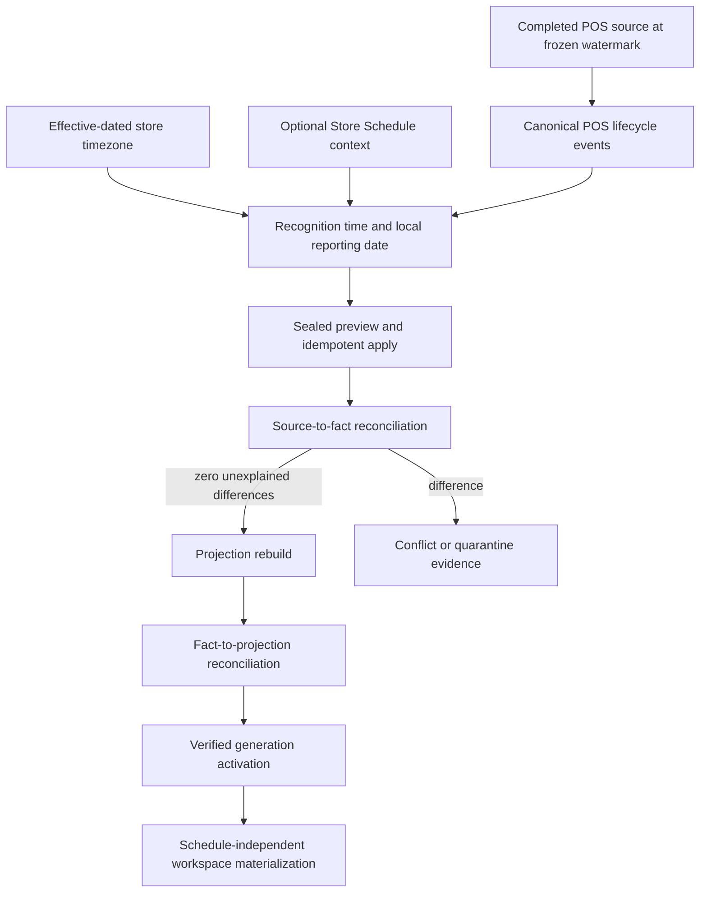
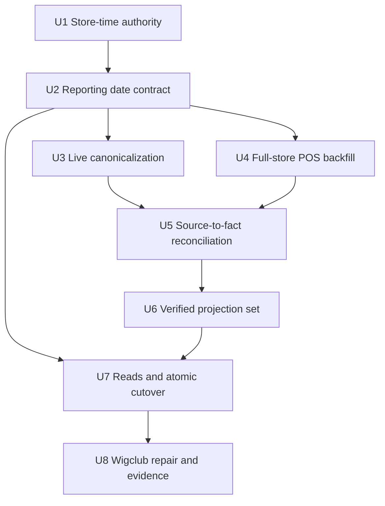
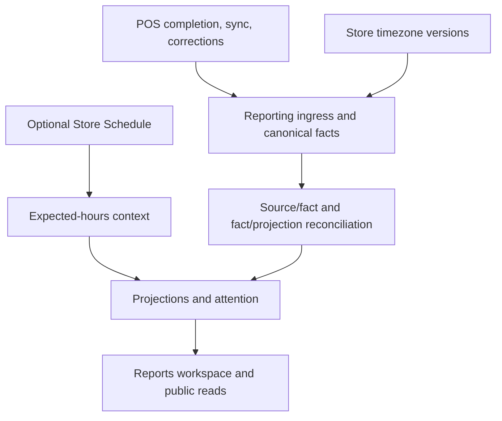

# refactor: Make completed POS sales authoritative for Reports

## Summary

Separate financial recognition from operating-hours interpretation. Every valid completed POS sale will be represented in canonical reporting facts using immutable occurrence time and store-local calendar attribution, while Store Schedule becomes optional context for comparisons and attention. A full-store, sealed reconciliation will repair all historical omissions and prove source-to-fact completeness before rebuilt projections can activate.

---

## Problem Frame

Wigclub has completed POS transactions that are absent from Reports because canonicalization and historical backfill currently require schedule-backed operating-period resolution. The historical compatibility interval ended before live reporting began, and closed or missing schedule states can still quarantine real commerce. This contradicts the stronger financial invariant in the origin document: completed-sale occurrence is durable source truth. This plan explicitly supersedes the schedule-eligibility portions of F-R43/F-R47 while retaining schedules for expected-hours context and same-elapsed comparisons.

---

## Requirements

- R1. Every valid completed POS sale is financially reportable regardless of whether it occurred during configured hours, outside configured hours, on a closed day, before the first schedule, or while operating-hours configuration is absent.
- R2. POS completion occurrence establishes recognition time. Acceptance, synchronization, recording, correction, refund, and void times remain separate immutable evidence and never rewrite the original sale.
- R3. Store-local calendar attribution uses a trusted, effective-dated IANA timezone authority independent of opening-hours windows. Historical facts retain the exact timezone version and reporting date used at recognition.
- R4. Store Schedule contributes optional expected-hours context, overnight-window interpretation, comparison denominators, and attention metadata. Missing, closed, or outside-hours schedule state never suppresses financial facts, projections, materialization, or public totals.
- R5. Full-store reconciliation covers all POS history and lifecycle effects: original completed sales, applied item adjustments, refunds, completed voids, and settlement corrections. Metadata-only changes do not alter revenue.
- R6. Preview and apply remain bounded, restartable, deterministic, sealed, and idempotent. Exact canonical replay is `existing`; conflicting reuse of an event identity remains an explicit conflict.
- R7. Activation requires source-to-fact reconciliation as well as fact-to-projection reconciliation. Every source record must be represented or explicitly dispositioned, with zero unexplained count, net-sales, units, currency, refund, void, adjustment, or date differences.
- R8. Missing SKU attribution or merchandise cost must not erase trustworthy transaction-level sales. Trustworthy net sales always surface; units surface only when trustworthy quantity evidence exists, otherwise unit coverage remains explicitly unknown/partial. Unsupported COGS and profit remain unknown.
- R9. Reports presets, workspace materialization, and public reads remain available from timezone-derived calendar periods without Store Schedule. Schedule-dependent comparisons may be unavailable independently.
- R10. Because Reports is still in early development, an operator may purge every row from the explicitly enumerated reporting-owned tables in the dev deployment before rebuilding the new contract. This is an out-of-band development operation, not a runtime per-store reset workflow. Authoritative POS, payment, inventory, store-time, and other operational source records remain untouched.
- R11. Coverage and health expose source census, created/existing/conflict/quarantine counts, unexplained deltas, missing-cost/SKU coverage, schedule-context coverage, and the historical/live handoff watermark.
- R12. The existing dirty Reports fixes remain preserved: stable active snapshot reads, item metric normalization, closed-day reference behavior where still applicable, retryable materialization, and canvas background parity. Dev-proven payment-correction audit events whose referenced POS transaction no longer exists are explicitly dispositioned as `orphan_payment_correction`, never currency-inferred or materialized as facts; their reason and count are sealed through preview, source audit, reconciliation, and census hash. Existing cross-store, misbound, or temporally impossible parent records remain unexplained blockers. Applied-adjustment snapshot lines with zero quantity and money delta remain coherence evidence but do not create no-op facts.
- R13. No v1 reporting behavior, facts, readers, or bundles are preserved. During the dev purge/rebuild, Reports may explicitly show rebuilding/unavailable; public reads resume only from the first fully verified new-design bundle.
- R14. The POS repair uses a sealed POS-only census and an append-only lifecycle journal. Occurrence time controls financial dating, while durable recording sequence controls snapshot and catch-up boundaries.
- R15. After the dev purge, one authenticated store `full_admin` can authorize and trigger the full-history POS backfill. The sole public mutation first verifies that the reporting-owned purge set is empty, then creates an immutable, scope-bound authorization grant from server authentication; every later phase is internal-only, consumes that grant/run lineage, and runs automatically until completion or a genuine integrity blocker. No second-admin approval or force-complete override exists.

**Origin flows:** F-R5, F-R19, F-R20, F-R25, F-R29, F-R43-F-R47, F-R69-F-R80, F-R87.

**Origin acceptance examples:** F-AE6 (refund semantics), F-AE10 (unknown cost and resumable zero-delta backfill).

---

## Scope Boundaries

- Do not change POS business authority, payment, stock, or register-session semantics. Authoritative POS mutations are deliberately widened with a mandatory same-transaction lifecycle-journal write, adding that persistence dependency so later reporting cannot lose accepted transitions.
- Do not rewrite operational POS source rows or delete original completed-sale evidence.
- Do not infer timestamps, revenue currency, SKU identity, valuation currency, cost, COGS, or profit without trustworthy evidence.
- Do not treat outside-hours activity as fraud, an error, or an activation blocker.
- Do not delete operational source truth. The explicit early-development purge may delete reporting-owned canonical facts and derived state; after the new bundle activates, ordinary rollback remains a bundle-pointer operation between new-design generations.
- Do not broaden the initial repair to non-POS source domains; the time-authority contract must remain reusable, but the migration census and completeness certification are POS-scoped.

### Deferred to Follow-Up Work

- Production rollout and store-by-store timezone authorization beyond Wigclub: separate release decision after dev reconciliation evidence.
- Operator-facing configuration for disputed historical timezone intervals: separate product workflow if source evidence cannot establish a unique version.
- New outside-hours UI beyond the existing Reports attention surface: only the reporting reason and browser-safe context are in scope.

---

## Context & Research

### Relevant Code and Patterns

- `packages/athena-webapp/convex/reporting/ingress.ts` atomically receives durable source ingress but currently quarantines unresolved schedule periods.
- `packages/athena-webapp/convex/reporting/operatingPeriods.ts` currently bundles timezone/date attribution with open-window resolution.
- `packages/athena-webapp/convex/reporting/maintenance/backfill.ts` already provides full POS source phases, sealed preview/apply manifests, canonical overlap, and bounded idempotency; its schedule/policy exclusion logic is the repair target.
- `packages/athena-webapp/convex/reporting/factIdentity.ts` and `packages/athena-webapp/convex/reporting/factFingerprint.ts` own replay identity and semantic conflict boundaries.
- `packages/athena-webapp/convex/reporting/projections/reconciliation.ts`, `packages/athena-webapp/convex/reporting/maintenance/rebuild.ts`, and `packages/athena-webapp/convex/reporting/activation.ts` own downstream verification and activation, but do not currently prove POS-source completeness.
- `packages/athena-webapp/convex/reporting/readModels/materialize.ts` and `packages/athena-webapp/convex/reporting/public.ts` currently allow schedule availability to affect preset materialization/readability.
- `packages/athena-webapp/convex/lib/storeScheduleTime.ts` already exposes consumer-neutral within/before/between/after/closed context suitable for non-blocking annotations.

### Institutional Learnings

- `docs/solutions/architecture/athena-reporting-fact-projection-boundary-2026-07-09.md`: accepted commerce is immutable; async reporting may lag but cannot reverse or hide accepted source truth; live and historical paths share canonical identity.
- `docs/solutions/architecture/athena-store-schedule-foundation-2026-06-27.md`: Store Schedule is consumer-neutral context, not reporting eligibility policy.
- `docs/solutions/logic-errors/athena-pos-item-adjustment-reporting-2026-05-20.md`: applied adjustments are linked effects rather than rewrites.
- `docs/solutions/logic-errors/athena-pos-completed-transaction-void-reversal-2026-05-21.md`: completed voids preserve original facts and add linked reversals.
- `docs/solutions/logic-errors/athena-pos-ledger-safe-corrections-2026-04-30.md`: audited corrections preserve original ledger meaning.

### External References

- None. Athena's existing financial, local-first POS, reporting, and Convex consistency contracts are the authoritative design inputs.

---

## Key Technical Decisions

| Decision | Resolution and rationale |
|---|---|
| Financial eligibility | Completed POS status plus durable occurrence is authoritative. Schedule state cannot overrule accepted commercial evidence. |
| Calendar authority | Introduce effective-dated store timezone versions independent of operating windows. A flat current timezone would silently reinterpret history after a change. |
| Period model | Persist recognition time, local reporting date, timezone lineage, and optional schedule context as separate concepts. This prevents schedule availability from controlling money. |
| Existing reporting state | Purge all generated reporting tables in the dev deployment with the explicit operator script, then rebuild solely from authoritative sources under the new contract. Do not build a generalized runtime reset engine. |
| Historical repair | Reuse the full-store POS source scanner and sealed manifest rather than adding an interval-specific script or writing live ingress from maintenance. |
| Completeness proof | Add source-to-fact reconciliation before existing fact-to-projection verification because a projection can perfectly reproduce an incomplete fact set. |
| Schedule anomalies | Closed-day, outside-hours, and schedule-unavailable states are contextual. They may create low-precedence attention evidence but cannot lower financial coverage. |
| Rollback | The initial dev purge is intentionally destructive for reporting-owned state and has no v1 rollback. After the first new bundle activates, rollback changes only new-design bundle pointers. |
| Mutable POS census | Add append-only lifecycle journal evidence for future transitions, then seal historical baselines only after source fingerprints and the journal terminal cursor stabilize. Occurrence is never the freeze coordinate. |
| Partial historical lines | Paginate complete line sets. If identity remains malformed but header money, currency, occurrence, and lifecycle multiplicity are trustworthy, use a transaction-revenue summary with unknown item, unit, and cost coverage. |
| Backfill authorization | Replace creator/second-approver dual control with one authenticated store `full_admin` trigger. Keep immutable actor evidence, stable request identity, sealed preview/apply parity, reconciliation, and activation gates. |
| Authorization envelope | The trigger atomically persists an unforgeable grant bound to org, store, POS scope, migration purpose, timezone/content hash, contract version, request hash, authenticated principal, membership, role snapshot, and resulting run. All asynchronous phases reject lineage mismatch. |

---

## Open Questions

### Resolved During Planning

- Should a completed sale outside configured hours count? Yes; it counts normally and may carry schedule-context evidence.
- Can current Store Schedule remain the only timezone authority? No; hours and timezone need independent lifecycles so missing hours cannot block calendar attribution.
- Is fact-to-projection reconciliation sufficient? No; activation also needs a frozen POS-source-to-fact proof.
- Should all historical POS rows be blindly inserted again? No; the sealed scanner uses canonical identities to classify exact replay, creation, conflict, or quarantine.
- Must a different second admin approve a report backfill? No; one authenticated store `full_admin` may authorize and trigger it, while server-owned evidence and integrity gates preserve accountability.

### Deferred to Implementation

- None. Legacy reporting compatibility is deliberately excluded; implementation discovery may refine helper names but cannot restore legacy facts or readers.

---

## High-Level Technical Design

> *This illustrates the intended approach and is directional guidance for review, not implementation specification. The implementing agent should treat it as context, not code to reproduce.*

The frozen boundary is a persisted census token, not occurrence time. It binds POS-only scope, a historical baseline digest, per-phase high-water evidence, the append-only lifecycle-journal terminal cursor, pending-ingress cursor, contract versions, and the stabilization proof consumed by reconciliation and activation.

---

## Implementation Units

- U1. **Extract effective-dated store timezone authority**

**Goal:** Establish trusted store-local calendar time independently from opening-hours configuration.

**Requirements:** R3, R10-R11, R15

**Dependencies:** None

**Files:**
- Create: `packages/athena-webapp/convex/schemas/inventory/storeTimezone.ts`
- Create: `packages/athena-webapp/convex/lib/storeTimezone.ts`
- Test: `packages/athena-webapp/convex/lib/storeTimezone.test.ts`
- Modify: `packages/athena-webapp/convex/schema.ts`
- Modify: `packages/athena-webapp/convex/schemas/inventory/storeSchedule.ts`
- Test: `packages/athena-webapp/convex/reporting/schemaIndexes.test.ts`
- Create: `packages/athena-webapp/convex/reporting/storeTimeAuthority.ts`
- Test: `packages/athena-webapp/convex/reporting/storeTimeAuthority.test.ts`

**Approach:**
- Add immutable, effective-dated IANA timezone versions scoped to one store and organization, with non-overlap validation and provenance.
- Seed candidate versions from trustworthy current/historical schedule and single-admin-authorized policy evidence without rewriting those sources.
- Remove creator/approver separation from historical interpretation authorization. Persist the authenticated authorizer, authorization time, immutable content hash, evidence, store/org scope, and request identity; caller-supplied actor IDs remain forbidden.
- Expose no separate public timezone-approval command for this migration. U1 provides validation/persistence helpers; U4's sole public trigger receives the timezone evidence and atomically creates the effective-dated timezone version, immutable grant, and backfill run after verifying the dev purge.
- Make opening-hours schedules reference or validate against the applicable timezone version while remaining consumer-neutral.
- Keep Store Schedule compatibility only where operational consumers require it; do not preserve legacy reporting fact/projection semantics.

**Execution note:** Implement versioning and boundary tests before wiring reporting consumers.

**Patterns to follow:**
- Effective-dated Store Schedule versions in `packages/athena-webapp/convex/schemas/inventory/storeSchedule.ts`.
- Immutable store-time authorization/provenance in `packages/athena-webapp/convex/reporting/storeTimeAuthority.ts`.

**Test scenarios:**
- Happy path: a trusted Africa/Accra version resolves the local calendar date from a UTC occurrence without any hours schedule.
- Boundary: adjacent timezone versions switch exactly at their effective boundary and retain historical lineage.
- Edge case: DST ambiguous/nonexistent wall-clock times remain deterministic because conversion starts from a UTC occurrence instant.
- Error path: overlapping versions, invalid IANA identifiers, cross-store lineage, or untrusted fallback are rejected.
- Boundary: operational schedules/stores remain intact while the operator purges reporting-owned legacy state.

**Verification:**
- Every reporting date can cite a trusted store timezone version; missing opening hours are irrelevant to timezone resolution.

- U2. **Separate financial date attribution from schedule context**

**Goal:** Model recognition time, local reporting date, timezone lineage, and optional schedule context independently across facts and projections.

**Requirements:** R1-R4, R9-R10, R13

**Dependencies:** U1

**Files:**
- Modify: `packages/athena-webapp/convex/reporting/operatingPeriods.ts`
- Test: `packages/athena-webapp/convex/reporting/operatingPeriods.test.ts`
- Modify: `packages/athena-webapp/convex/schemas/reporting/facts.ts`
- Modify: `packages/athena-webapp/convex/schemas/reporting/projections.ts`
- Modify: `packages/athena-webapp/shared/reportingContract.ts`
- Modify: `packages/athena-webapp/convex/reporting/factFingerprint.ts`
- Test: `packages/athena-webapp/convex/reporting/factFingerprint.test.ts`
- Modify: `packages/athena-webapp/convex/reporting/factIdentity.ts`
- Test: `packages/athena-webapp/convex/reporting/facts.test.ts`

**Approach:**
- Add a schedule-independent financial-date resolver driven by immutable occurrence and applicable timezone version.
- Preserve optional schedule context separately: schedule version, within/outside/closed/unavailable classification, and overnight-window interpretation where trustworthy.
- Replace fact/projection semantics with the new timezone-lineage contract; schedule lineage is optional context rather than exactly-one period authority.
- Keep stable POS business-event identity for idempotency, but introduce no legacy successor identity, `supersedesFactId`, or dual-version projection selection.
- Readers recognize only the new contract. Before the first new bundle activates they return an explicit rebuilding/unavailable state rather than serving v1.

**Execution note:** Test the new contract and rebuilding state directly; do not add legacy compatibility characterization.

**Patterns to follow:**
- Existing occurrence and period evidence in `packages/athena-webapp/convex/reporting/factFingerprint.ts`.
- Consumer-neutral schedule phases in `packages/athena-webapp/convex/lib/storeScheduleTime.ts`.

**Test scenarios:**
- Happy path: during-hours and after-hours completed sales share financial eligibility and differ only in schedule context.
- Edge case: a closed-day or schedule-missing sale resolves to the timezone-local date and remains financially complete.
- Edge case: a cross-midnight configured window may provide operational-date context without moving the immutable local calendar attribution.
- Error path: missing trusted timezone, conflicting timezone lineage, or changed material semantics produces explicit integrity disposition rather than UTC fallback.
- Reset: after reporting-owned state is cleared, every rebuilt fact uses only the new contract and canonical POS identity.
- Cutover: before the first new bundle activates, public reads return explicit rebuilding/unavailable state and never fall back to legacy facts.

**Verification:**
- No financial fact validator or fingerprint requires an open schedule window.

- U3. **Apply the new authority to live POS canonicalization**

**Goal:** Ensure newly accepted completed POS commerce canonicalizes regardless of hours configuration.

**Requirements:** R1-R5, R8, R11, R14

**Dependencies:** U2

**Files:**
- Create: `packages/athena-webapp/convex/pos/infrastructure/posLifecycleJournal.ts`
- Test: `packages/athena-webapp/convex/pos/infrastructure/posLifecycleJournal.test.ts`
- Modify: `packages/athena-webapp/convex/schemas/pos/posTransaction.ts`
- Modify: `packages/athena-webapp/convex/schema.ts`
- Modify: `packages/athena-webapp/convex/reporting/ingress.ts`
- Test: `packages/athena-webapp/convex/reporting/ingress.test.ts`
- Modify: `packages/athena-webapp/convex/reporting/sourceAdapters/pos.ts`
- Test: `packages/athena-webapp/convex/reporting/sourceAdapters/pos.test.ts`
- Modify: `packages/athena-webapp/convex/pos/application/commands/completeTransaction.ts`
- Modify: `packages/athena-webapp/convex/pos/application/commands/adjustTransactionItems.ts`
- Modify: `packages/athena-webapp/convex/pos/application/commands/correctTransaction.ts`
- Modify: `packages/athena-webapp/convex/pos/infrastructure/repositories/localSyncRepository.ts`
- Test: `packages/athena-webapp/convex/pos/application/completeTransaction.test.ts`
- Test: `packages/athena-webapp/convex/pos/application/adjustTransactionItems.test.ts`
- Test: `packages/athena-webapp/convex/pos/application/correctTransactionPaymentMethod.test.ts`
- Test: `packages/athena-webapp/convex/pos/application/sync/projectLocalEvents.test.ts`
- Test: `packages/athena-webapp/convex/pos/infrastructure/repositories/localSyncRepository.test.ts`

**Approach:**
- Resolve financial date from occurrence/timezone before optional schedule enrichment.
- Stop mapping closed or missing schedule state to `missing_reporting_period`; retain quarantine for genuine identity, occurrence, timezone, or currency failures.
- Preserve canonical event identity across online, locally synchronized, replayed, corrected, refunded, and voided POS events.
- Preserve POS business semantics while widening the authoritative mutation transaction with the mandatory journal insert. Canonicalization and projection continuation remain asynchronous and replayable.
- Append sanitized immutable lifecycle evidence atomically for completion, item/service refund, completed void, applied adjustment/settlement, and payment-method correction. Its durable sequence, not occurrence, supports census catch-up.
- Wire the journal at every authoritative mutation boundary, including register completion/refund/void flows, adjustment settlement, payment-method correction, and local-sync projection. Characterization must enumerate any additional refund or service-refund writer before U3 closes; no downstream reporting hook may substitute for same-transaction source capture.

**Patterns to follow:**
- Canonical POS identities in `packages/athena-webapp/convex/reporting/factIdentity.ts`.
- Durable pending ingress and retry behavior in `packages/athena-webapp/convex/reporting/ingress.ts`.

**Test scenarios:**
- Happy path: completed sales during hours, after closing, on a closed Sunday, and with no hours schedule all canonicalize.
- Integration: a locally completed sale synchronized later retains its original occurrence date and exposes synchronization delay separately.
- Lifecycle: refunds, completed voids, and applied adjustments create linked signed effects; the original sale remains immutable.
- Census: each authoritative lifecycle transition appends one stable journal identity in the same source mutation; replay is idempotent and in-place aggregates cannot evade the journal.
- Atomicity: failure to persist journal evidence rolls back the corresponding source transition; retry creates exactly one journal event for each completion, item/service refund, void, adjustment/settlement, payment correction, and local-sync transition.
- Replay: identical ingress is a no-op; the same identity with different money, quantity, occurrence, or currency is a conflict.
- Error path: missing trusted timezone or invalid nonzero revenue currency remains quarantined with actionable evidence.

**Verification:**
- New valid completed sales cannot enter a schedule-derived reporting quarantine.

- U4. **Generalize sealed backfill to all POS history**

**Goal:** Preview and idempotently apply every valid historical POS lifecycle event for the store, not a bounded gap interval.

**Requirements:** R1-R8, R10-R11, R14-R15

**Dependencies:** U2-U3

**Files:**
- Modify: `packages/athena-webapp/convex/reporting/maintenance/backfill.ts`
- Test: `packages/athena-webapp/convex/reporting/maintenance/backfill.test.ts`
- Create: `packages/athena-webapp/scripts/purge-reporting-dev.sh`
- Create: `packages/athena-webapp/scripts/empty-table.json`
- Modify: `packages/athena-webapp/convex/schemas/reporting/maintenance.ts`
- Modify: `packages/athena-webapp/convex/schema.ts`
- Modify: `packages/athena-webapp/convex/reporting/storeTimeAuthority.ts`
- Test: `packages/athena-webapp/convex/reporting/storeTimeAuthority.test.ts`
- Modify: `packages/athena-webapp/convex/reporting/reportingDeployment.test.ts`
- Modify: `packages/athena-webapp/convex/reporting/access.ts`

**Approach:**
- Add sealed `sourceScope: pos` to run/manifest identity, digest, resume, apply, reconciliation, and activation. POS runs use only completion, item/service refund, completed void, adjustment/settlement, payment-correction, and done phases; mixed-scope resume/apply is rejected.
- Add a dev/local-only operator script that uses explicit `convex import --replace` operations to empty the enumerated generated reporting tables. It must reject production and unknown deployment names and must not use a deployment-wide replace operation.
- Keep operational POS/payment/inventory/source tables, the POS lifecycle journal, store-time authority, valuation/integrity authority, and identity migrations outside the purge list.
- Purge authorization grants and runs with the rest of generated reporting state. The subsequent public backfill trigger verifies every purge-owned table is empty before creating the new grant and run.
- Define authoritative census rows/events for completion, item and service-line refund, completed void, applied adjustment and settlement, and payment-method correction. Historically unreconstructable multiplicity is blocking rather than synthesized.
- Classify only structurally transaction-bound payment-correction events with an absent parent as the stable non-fact exclusion `orphan_payment_correction`. Seal its count and reason in preview/apply parity, per-source audit, reconciliation certificate, and source-census hash; require zero unexplained records and exact excluded-count agreement before activation. A present but cross-store, misbound, or temporally invalid parent remains blocking.
- Validate the complete applied-adjustment line snapshot, including unchanged lines, but emit authoritative facts and expected preview identities only for lines with a nonzero quantity or money delta.
- Capture a historical source-row fingerprint/digest plus lifecycle-journal start and terminal cursors. Rescan until both baseline digest and terminal cursor stabilize; later journal events flow strictly above the sealed cursor into catch-up.
- Generate candidates with the same new-contract canonical identity and financial-date semantics as live ingress.
- Remove historical closed-day exclusion and interval-only period eligibility while retaining authorized inference boundaries for missing historical revenue currency.
- Seal candidate semantics, dispositions, per-domain totals, and timezone/schedule provenance before writes; apply only the sealed manifest.
- Persist per-phase high-water IDs, counts, and digests. After apply, consume journal/ingress through a captured terminal cursor and require a final bounded no-unseen-event pass before activation; occurrence remains date evidence only.
- Preserve bounded pagination, pause/resume, retry, cleanup, and exact replay behavior.
- Add one authenticated, store-scoped `full_admin` trigger as the sole public entrypoint. After `requireReportingStoreAccess` and the purge-empty assertion, it atomically creates the backfill run and immutable authorization grant, then advances internal-only preview, seal, apply, reconciliation, and candidate-generation phases. A second approver is never requested; integrity conflicts still stop progress.
- Bind the grant to organization, store, `sourceScope: pos`, migration purpose, timezone/content hash, new contract version, server-hashed idempotency envelope, authenticated identity subject, Athena user, membership, `full_admin` role snapshot, authorization time, and run ID. Each internal phase reloads the grant and rejects any org/store/scope/version/hash/run mismatch; no admin override can bypass integrity gates.
- Derive the idempotency envelope from server-owned scope/purpose/contract fields plus an optional client nonce. Exact concurrent replay returns the existing run; reuse with changed semantics is a hard conflict. Authorization evidence outlives transient manifest cleanup.

**Execution note:** Add failing closed-day, missing-hours, full-history, and replay characterizations before changing the scanner.

**Patterns to follow:**
- Existing preview/apply manifest digest and lifecycle in `packages/athena-webapp/convex/reporting/maintenance/backfill.ts`.
- Canonical overlap comparison in `packages/athena-webapp/convex/reporting/factFingerprint.ts`.

**Test scenarios:**
- Happy path: a full-store preview includes every valid completed sale across all historical intervals and schedule states.
- Lifecycle: original sales plus refunds, completed voids, and adjustments are enumerated exactly once with linked identities.
- Known non-facts: a structurally valid orphan payment correction is explicitly excluded without currency inference, while a present cross-store/misbound parent blocks; zero-delta adjustment snapshot lines are validated but absent from the manifest and fact census.
- Replay: rerunning after a successful apply produces only `existing` candidates and identical totals.
- Drift: source mutation between preview and apply aborts before activation; late pre-watermark synchronization is found by catch-up reconciliation.
- Scope: a POS-only run never scans, manifests, or writes storefront, service, procurement, inventory, expense, or payment-domain candidates.
- Mutation race: a refund, void, or status transition during scan/apply is journaled above the cursor or invalidates stabilization; it cannot silently enter or leave the census.
- Authorization: one authenticated store `full_admin` can trigger or idempotently resume the backfill; unauthenticated, non-admin, cross-store, caller-forged actor, or conflicting request reuse is rejected.
- Authorization lineage: every internal backfill/reconcile/rebuild/materialize/activate phase rejects missing or mismatched grant lineage; there is no public resume/apply/force-complete entrypoint.
- Purge safety: the script accepts only literal `dev` or `local`, empties only its explicit generated-reporting table list, and demonstrably refuses `prod` and unknown deployment names.
- Purge precondition: the public trigger refuses to create a grant or run while any purge-owned reporting table is nonempty.
- Concurrency: identical simultaneous triggers converge on one run; changed-payload key reuse, principal/membership mismatch, or stale role evidence fails without starting another reset.
- Coverage: missing cost/SKU attribution preserves transaction-level money where trustworthy; units appear only from trustworthy quantity evidence and otherwise remain explicitly partial.
- Error path: malformed lines, missing occurrence/timezone, conflicting currency, oversized source shapes, and semantic identity conflicts remain explicitly accounted for.

**Verification:**
- Preview and apply totals match exactly, and no schedule state appears as an exclusion reason.

- U5. **Add frozen POS source-to-fact reconciliation**

**Goal:** Prove canonical fact completeness against authoritative POS evidence before projections can verify.

**Requirements:** R5-R7, R11, R14-R15

**Dependencies:** U3-U4

**Files:**
- Create: `packages/athena-webapp/convex/reporting/maintenance/posSourceReconciliation.ts`
- Test: `packages/athena-webapp/convex/reporting/maintenance/posSourceReconciliation.test.ts`
- Modify: `packages/athena-webapp/convex/schemas/reporting/maintenance.ts`
- Modify: `packages/athena-webapp/convex/schema.ts`
- Modify: `packages/athena-webapp/convex/reporting/maintenance/rebuild.ts`
- Test: `packages/athena-webapp/convex/reporting/maintenance/rebuild.test.ts`
- Modify: `packages/athena-webapp/convex/reporting/activation.ts`
- Test: `packages/athena-webapp/convex/reporting/activation.test.ts`

**Approach:**
- Reconcile against the exact census token: POS-only scope, baseline digest, per-phase high-water evidence, lifecycle-journal terminal cursor, pending-ingress cursor, and contract versions.
- Compare identities, counts, signed net sales, units, dates, currencies, item/service refunds, completed voids, applied adjustments/settlements, payment corrections, and dispositions.
- Separate original gross events from linked negative/correction events so net agreement cannot hide a missing original and offsetting error.
- Persist bounded accumulator/checkpoint evidence and distinguish explained partial coverage from unexplained financial deltas.
- Require reconciliation-finalized evidence under the same contract and watermark before generation verification/activation.
- Require the immutable backfill authorization grant and exact org/store/POS-scope/request/run lineage on every reconciliation page; no public or internal caller can substitute raw IDs or bypass discrepancies.

**Patterns to follow:**
- Bounded reconciliation accumulators in `packages/athena-webapp/convex/reporting/projections/reconciliation.ts`.
- Activation lineage gates in `packages/athena-webapp/convex/reporting/activation.ts`.

**Test scenarios:**
- Happy path: source and facts agree by event identity, signed totals, units, dates, currency, and lifecycle category.
- Failure: omitted sale, duplicate fact, wrong date, missing refund, net-cancelling mismatch, or unexplained quarantine prevents verification.
- Edge case: missing cost or item attribution is explained partial coverage and does not erase matching transaction-level revenue; untrustworthy quantity never becomes reported units.
- Concurrency: paginated resume/retry produces one final result and rejects mixed watermarks or contract versions.
- Handoff: an old-occurrence event recorded after baseline is included by durable journal sequence; activation proves no pending journal or ingress evidence at or below the terminal cursor.
- Integration: a perfect fact-to-projection result cannot activate when source-to-fact reconciliation is incomplete.

**Verification:**
- “Complete” means every POS source event is created, existing-identical, or explicitly unresolved; zero unexplained financial difference is required.

- U6. **Rebuild and verify a compatible projection set**

**Goal:** Produce a mutually compatible verified store-day, SKU-day, and derived-generation set from reconciled facts without changing public selection.

**Requirements:** R6-R8, R10-R15

**Dependencies:** U5

**Files:**
- Modify: `packages/athena-webapp/convex/reporting/projections/processor.ts`
- Test: `packages/athena-webapp/convex/reporting/projections/processor.test.ts`
- Modify: `packages/athena-webapp/convex/reporting/projections/daily.ts`
- Test: `packages/athena-webapp/convex/reporting/projections/daily.test.ts`
- Modify: `packages/athena-webapp/convex/reporting/projections/skuDay.ts`
- Test: `packages/athena-webapp/convex/reporting/projections/skuDay.test.ts`
- Modify: `packages/athena-webapp/convex/reporting/projections/reconciliation.ts`
- Test: `packages/athena-webapp/convex/reporting/projections/reconciliation.test.ts`
- Modify: `packages/athena-webapp/convex/reporting/maintenance/rebuild.ts`
- Test: `packages/athena-webapp/convex/reporting/maintenance/rebuild.test.ts`
- Modify: `packages/athena-webapp/convex/reporting/activation.ts`
- Test: `packages/athena-webapp/convex/reporting/activation.test.ts`
- Modify: `packages/athena-webapp/convex/schema.ts`

**Approach:**
- Project new-contract reporting dates and optional schedule context from the freshly rebuilt fact set.
- Rebuild from the purged-and-backfilled new-contract fact set, catch up through a stable watermark, and require both reconciliation layers before activation.
- During the initial rebuild there is no legacy generation/workspace to preserve; Reports remains explicitly rebuilding until U7 activates the first complete new-design bundle.
- Persist a projection-set candidate referencing the verified store-day, SKU-day, and required derived generations. It contains no workspace epoch and cannot change public selection; U7 consumes it to build the complete bundle.
- Bind the candidate to the same immutable authorization grant, census token, contract, org/store, and run lineage used by backfill/reconciliation.
- Define rollback as pointer reactivation only; newly inserted canonical facts remain durable for later corrected generations.

**Test scenarios:**
- Happy path: full-history facts aggregate into correct store-day and SKU-day money/units under the new date contract.
- Edge case: schedule-missing, closed-day, outside-hours, and unknown-cost facts aggregate without losing trustworthy metrics.
- Failure: incompatible lineage, unstable watermark, source discrepancy, or projection discrepancy blocks activation.
- Integration: the verified candidate binds a mutually compatible projection set without materializing a workspace or changing public selection.
- Reset window: with no prior new-design bundle, projection or derived-generation failure leaves Reports explicitly rebuilding/unavailable and cannot activate a partial set.
- Readiness: an incomplete projection set cannot be marked verified or offered to U7 for workspace materialization.

**Verification:**
- A generation cannot become active unless it proves source-to-fact and fact-to-projection integrity for one frozen contract/watermark.

- U7. **Enable schedule-independent reads and atomically cut over the bundle**

**Goal:** Keep totals, presets, and materialization available from store-local calendar time while degrading only schedule-dependent context.

**Requirements:** R4, R8-R9, R11-R15

**Dependencies:** U2, U6

**Files:**
- Modify: `packages/athena-webapp/convex/reporting/public.ts`
- Test: `packages/athena-webapp/convex/reporting/public.test.ts`
- Modify: `packages/athena-webapp/convex/reporting/readModels/materialize.ts`
- Test: `packages/athena-webapp/convex/reporting/readModels/materialize.test.ts`
- Modify: `packages/athena-webapp/convex/reporting/projections/storeIntraday.ts`
- Test: `packages/athena-webapp/convex/reporting/projections/storeIntraday.test.ts`
- Modify: `packages/athena-webapp/convex/reporting/attentionRules.ts`
- Test: `packages/athena-webapp/convex/reporting/attentionRules.test.ts`
- Modify: `packages/athena-webapp/convex/reporting/projections/attention.ts`
- Test: `packages/athena-webapp/convex/reporting/projections/attention.test.ts`
- Modify: `packages/athena-webapp/shared/reportingContract.ts`
- Test: `packages/athena-webapp/src/components/reports/ReportsLayout.test.tsx`
- Modify: `packages/athena-webapp/convex/reporting/activation.ts`
- Test: `packages/athena-webapp/convex/reporting/activation.test.ts`

**Approach:**
- Resolve today/WTD/prior/trailing/custom calendar ranges from effective timezone versions; use schedules only for same-elapsed windows and active-day denominators.
- Replace schedule-blocked materialization with calendar materialization and teach readers to resolve only a complete activated bundle.
- Consume U6's verified projection set, materialize and verify its compatible workspace epoch, then seal one complete bundle-level activation record.
- After the read path is deployed and the complete bundle is sealed, atomically switch the single public bundle pointer. Bundle rollback restores the prior mutually compatible projection/workspace set; mixed lineage is never publicly observable.
- Materialize, seal, and activate only through internal functions that reload the grant and reject any actor, membership, org/store, POS scope, content hash, contract, request, or run mismatch. The admin grant cannot waive source, projection, quarantine, watermark, bundle, or pointer gates.
- Represent schedule-unavailable/outside-hours/closed-day activity as optional low-precedence context with calm operator-facing language; never map it to missing financial coverage.
- Preserve the dirty stable-snapshot, item DTO, materialization retry, intraday, and layout fixes while adapting their schedule assumptions.

**Test scenarios:**
- Happy path: Reports materializes and returns WTD totals with a timezone but no hours schedule.
- Degraded context: same-elapsed comparison is unavailable while net sales and units remain complete and readable.
- Context: after-hours and closed-day sales appear in totals and may surface non-blocking attention without alarmist copy.
- Failure: candidate materialization failure leaves Reports rebuilding/unavailable when no new-design bundle exists, or preserves the prior new-design bundle on later rebuilds; it cannot partially advance a projection pointer.
- Integration: activating or rolling back one bundle pointer changes store-day, SKU-day, derived generation, and workspace selection together.
- Regression: normalized item metrics, stable active watermark reads, closed-day reference behavior, and canvas background parity remain intact.

**Verification:**
- No public financial total or workspace epoch is blocked solely by Store Schedule availability.

- U8. **Run the governed Wigclub migration and capture evidence**

**Goal:** Use the completed U1-U7 capabilities for one governed Wigclub migration and cutover in dev, then produce auditable post-cutover proof that Reports matches POS source truth.

**Requirements:** R5-R15

**Dependencies:** U7

**Files:**
- Modify: `packages/athena-webapp/convex/reporting/maintenance/backfill.test.ts`
- Modify: `packages/athena-webapp/convex/reporting/reportingDeployment.test.ts`
- Create: `docs/verification/2026-07-12-wigclub-pos-reporting-reconciliation.md`

**Approach:**
- Have one Wigclub `full_admin` authorize the timezone evidence and trigger the POS-only backfill once; Athena advances the sealed pipeline automatically and surfaces any unresolved disposition as a blocker rather than asking for another administrator.
- Exercise the implemented source-to-fact reconciliation, projection-set rebuild, workspace materialization, bundle seal, and atomic cutover in their defined order; U8 adds no second write or activation path.
- After the one migration/cutover, demonstrate idempotent no-op replay, historical/live handoff catch-up, bundle-pointer rollback/reactivation, and preserved prior workspace on candidate failure as verification exercises rather than additional migrations.
- Record source counts and signed totals without copying customer or payment-instrument data.

**Execution note:** Treat the repair as a governed, single-admin-triggered migration; automated preview/apply parity and reconciliation remain mandatory.

**Test scenarios:**
- Integration: all valid Wigclub completed sales through the frozen watermark are represented exactly once across original and linked lifecycle effects.
- Integration: the July 6-9 transactions and all other previously omitted schedule states appear in corrected reporting dates and totals.
- Replay: a second full-store run creates no duplicate facts and reports identical source/fact totals.
- Rollback: after creating a second verified new-design bundle for verification, its prior new-design bundle can be reactivated without deleting facts; no legacy state is restored.
- Privacy: verification evidence contains aggregate IDs/counts/totals and sanitized dispositions only.

**Verification:**
- Wigclub Reports totals match the authoritative POS census for every covered date and lifecycle category, with zero unexplained financial omission.

---

## System-Wide Impact

- **Interaction graph:** POS business authority stays unchanged, but authoritative mutations gain a mandatory atomic lifecycle-journal insert. Reporting ingress, time resolution, facts, backfill, reconciliation, workspace materialization, bundle activation, attention, and browser contracts change in sequence.
- **Error propagation:** Source-integrity uncertainty blocks completeness certification and new activation, but never reverses accepted POS commerce. Missing hours degrades only context/comparison availability.
- **State lifecycle risks:** Preview/apply drift, late pre-watermark sync, duplicate delivery through live/backfill, mixed contract versions, partial migration, and stale workspace activation require explicit guards.
- **API surface parity:** Store-day, SKU-day, custom ranges, exports, materialized presets, attention, and intraday consumers must agree on the new date/timezone contract.
- **Integration coverage:** Tests must prove source command to ingress to fact, full-history manifest to fact, both reconciliation layers, activation, materialization, public reads, replay, and rollback.
- **Unchanged invariants:** POS completion remains authoritative; canonical facts remain append-only; inventory effects retain their existing atomic boundary; missing cost never becomes zero; active verified generations remain the only public reporting source.

---

## Risks & Dependencies

| Risk | Mitigation |
|---|---|
| No timezone authority exists independently of schedules | Land effective-dated store timezone versions first, with trusted evidence and no UTC fallback. |
| New-contract fingerprint semantics conflict with pre-purge reporting state | Deploy temporary schema width only until the dev purge removes old reporting facts/lineage, rebuild exclusively under the new contract, and reject legacy-contract rows from candidates, reconciliation, bundle sealing, and reads. |
| Net totals can hide missing original/reversal events | Reconcile identities and lifecycle categories in addition to net sales and units. |
| Malformed historical lines prevent an absolute zero-quarantine claim | Preserve trustworthy transaction-level money where safe and require every unresolved record to have an explicit disposition; never call unexplained omissions complete. |
| Full-history scans exceed Convex limits | Retain indexed source phases, bounded pagination, sealed manifests, resumable accumulators, and stable watermarks. |
| Live ingress races with backfill | Seal a stabilized baseline plus durable journal/ingress cursors, unify canonical identities, and prove a final no-unseen-event catch-up pass. |
| Schedule attention becomes operational noise | Keep it informational, low precedence, and separate from financial completeness or activation health. |
| Dirty fixes are overwritten during redesign | Treat the transferred worktree diff as required baseline behavior and retain its regression tests in U7. |
| Mutable POS status changes evade a timestamp cutoff | Journal lifecycle transitions append-only and seal a stabilized baseline plus durable terminal cursor; never freeze on occurrence time. |
| Development purge touches operational truth | Keep a literal generated-reporting table list, use per-table replacement, reject production, and verify the public trigger only starts from an empty purge set. |

---

## Phased Delivery

### Phase 1: New contract and dev purge capability
- Land U1-U2's store-time authority, new-only fact/projection contract, explicit rebuilding public state, and the single-`full_admin` authorization grant with fixtures; do not mutate Wigclub yet.
- Deploy only the temporary schema width necessary for old reporting documents to coexist until the dev purge deletes them. Add no old readers, successor facts, or behavioral compatibility.
- The bounded rebuilding/unavailable window starts when U2's new-only public reader deploys. From that point until U8 activates the first new-design bundle, Wigclub Reports deliberately serves no legacy generation.

### Phase 2: Write paths and completeness proof
- Deploy U3's new-contract writers and append-only lifecycle journal.
- Land and test U4-U5's dev purge guardrails, POS-only census, sealed apply, catch-up, grant lineage, and reconciliation capabilities with fixtures; do not execute the Wigclub dev purge/backfill yet.

### Phase 3: Projection and read migration
- Land and test U6's new-contract projection-set builder and U7's calendar-safe materialization, bundle sealing, atomic pointer, and rebuilding state without touching Wigclub.

### Phase 4: Wigclub dev repair
- An operator first runs the dev-only reporting purge. U8 then uses one Wigclub `full_admin` grant/trigger for timezone authorization, POS-only preview/apply, source reconciliation, projection-set rebuild, workspace materialization, bundle seal, and atomic pointer switch.
- Idempotent replay and a later new-design bundle rollback/reactivation happen afterward as verification; there is no legacy bundle or fact rollback.
- Remove temporary schema width after the purge proves no old reporting documents remain.

---

## Success Metrics

- 100% of valid completed Wigclub POS source events through the frozen watermark are represented by exact canonical identities or linked lifecycle effects.
- Zero unexplained source-to-fact and fact-to-projection differences before activation.
- Replaying the full-store repair creates zero duplicate facts.
- Reports remains readable with correct net sales and units when hours are missing, closed, or outside-window.
- Missing cost/SKU coverage remains explicit without suppressing trustworthy transaction-level money.
- Before U2's new-only reader deploys, existing dev reads remain unchanged. From that deploy through the initial purge/rebuild, Reports explicitly shows rebuilding/unavailable. After the first new-design bundle activates, later rebuild failures preserve the prior new-design bundle and rollback is pointer-only between new-design bundles.

---

## Documentation / Operational Notes

- Update the reporting architecture learning after implementation because this plan intentionally supersedes schedule-as-eligibility language.
- Record contract-version rollout order, single-admin authorization identity/time, timezone evidence hash, preview digest, reconciliation totals, activation IDs, rollback proof, and remaining sanitized dispositions.
- Regenerate Convex API types and Graphify after schema/code changes.
- Do not deploy the repair to production as part of this plan without a separate explicit release decision.

---

## Sources & References

- **Origin document:** `docs/brainstorms/2026-07-09-reports-foundation-requirements.md`
- Prior plan being revised: `docs/plans/2026-07-11-001-fix-wigclub-reporting-history-plan.md`
- Architecture: `docs/solutions/architecture/athena-reporting-fact-projection-boundary-2026-07-09.md`
- Store time: `docs/solutions/architecture/athena-store-schedule-foundation-2026-06-27.md`
- POS adjustments: `docs/solutions/logic-errors/athena-pos-item-adjustment-reporting-2026-05-20.md`
- POS voids: `docs/solutions/logic-errors/athena-pos-completed-transaction-void-reversal-2026-05-21.md`
- POS corrections: `docs/solutions/logic-errors/athena-pos-ledger-safe-corrections-2026-04-30.md`
