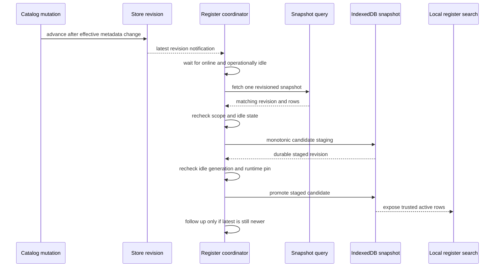
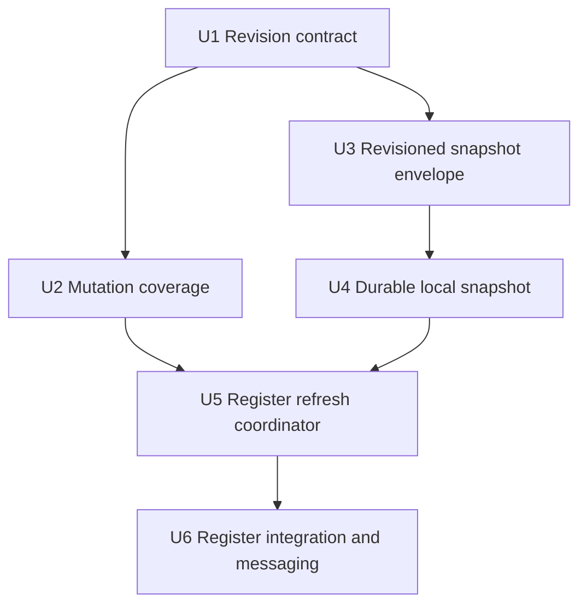
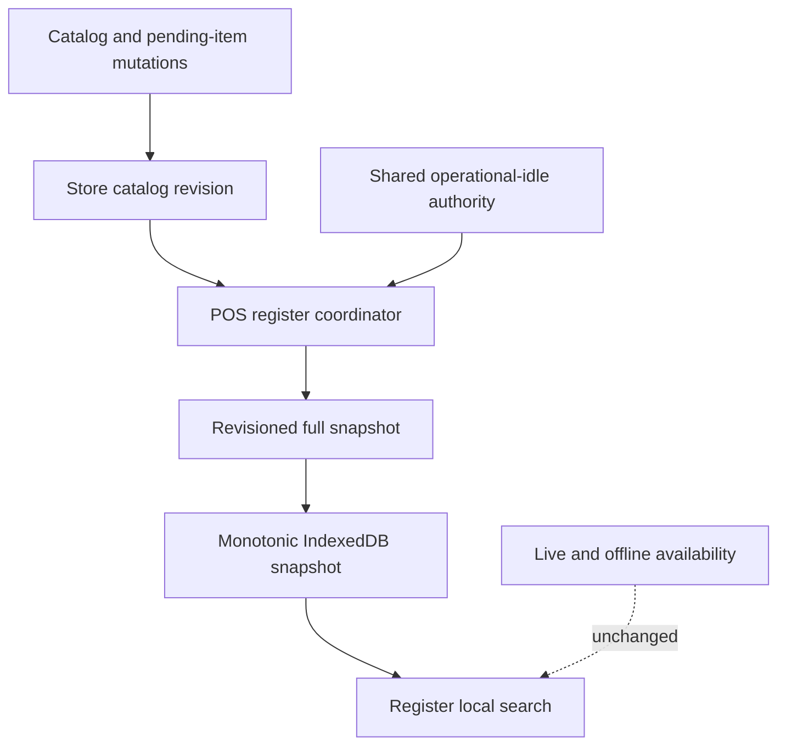

# feat: Refresh the POS catalog at safe idle boundaries

## Summary

Add a lightweight, store-scoped catalog revision that an open POS register can subscribe to without live-subscribing to the full catalog. A register-owned refresh coordinator coalesces newer revisions, waits for the shared operational-idle boundary, fetches one revisioned catalog snapshot, durably persists it, and only then exposes it to local search. All waiting and recovery coordination remains in the background.

---

## Problem Frame

The register intentionally searches a local metadata snapshot, but its current one-shot refresh lifecycle leaves an already-open terminal unaware of catalog changes made elsewhere. The implementation must close that freshness gap without reintroducing high-cardinality reactive reads or changing the catalog beneath active sale work (see origin: `docs/brainstorms/2026-07-13-pos-register-catalog-refresh-requirements.md`).

---

## Requirements

- R1. Maintain a lightweight, store-scoped revision that advances only when the effective register-catalog metadata changes.
- R2. Subscribe open POS registers to the revision only; keep the full catalog as an imperative, one-shot snapshot read.
- R3. Coalesce revisions observed while blocked, in flight, or inside a bounded idle-side refresh window and converge on the latest revision without parallel or unbounded full-snapshot reads.
- R4. Exclude sales, holds, quantities, and other availability-only churn from metadata revision activity.
- R5. Use one authoritative operational-idle decision covering sale lines, service work, customer details, payments, checkout mutation, drawer/register transitions, and local persistence risk.
- R6. Preserve the active sale and current searchable catalog while refresh is unsafe.
- R7. Start or resume refresh automatically when the register is online and every idle blocker is clear.
- R8. Return rows with their revision from one Convex query snapshot, stage both atomically, and ensure every non-idle runtime remains pinned to its prior retained revision until it safely adopts the promoted default.
- R9. Keep waiting, refreshing, offline, retry-delayed, and authorization-paused states internal; do not publish catalog-refresh app messages or cashier controls.
- R10. Preserve autonomous recovery and trusted-row fallback without requiring cashier action.
- R11. Preserve the last trusted active catalog after server-read or local-write failure.
- R12. Retry transient failures safely, without route reload or cashier action, while avoiding offline and authorization hot loops.

**Origin actors:** A1 (catalog operator), A2 (cashier), A3 (POS terminal)

**Origin flows:** F1 (remote change reaches an idle register), F2 (remote change waits behind active work), F3 (deferred refresh fails safely)

**Origin acceptance examples:** AE1 (idle remote create), AE2 (burst during active sale), AE3 (non-cart idle blockers), AE4 (availability-only change), AE5 (failure and retry), AE6 (new revision during waiting or refresh)

---

## Scope Boundaries

- Do not restore a live subscription to the full register catalog or add fixed-interval polling.
- Do not implement per-SKU delta synchronization, a retained event feed, or cross-tab leader election.
- Do not change the bounded live-availability or full offline-availability contracts.
- Do not reprice, remove, or otherwise mutate lines already present in active sale state.
- Do not expose catalog-refresh app messages or add cashier apply, retry, or dismiss controls.
- Scope reactive orchestration to the POS register; expense-register, POS-hub prewarm, and generic catalog consumers retain their current lifecycle.
- Repair snapshot-affecting mutation paths that bypass projection maintenance only to establish complete revision coverage; unrelated inventory or catalog cleanup remains out of scope.

### Deferred to Follow-Up Work

- Cross-tab refresh leadership or `BroadcastChannel` deduplication: correctness will come from monotonic store-scoped persistence and stale-completion guards; add coordination only if measured duplicate client calls justify it.
- Rich freshness telemetry or a cashier-facing catalog diagnostics surface: keep this delivery focused on silent automatic convergence.

---

## Context & Research

### Relevant Code and Patterns

- `packages/athena-webapp/convex/inventory/skuSearch.ts` centralizes `productSkuSearch` projection upserts, removals, and product/taxonomy fanout refreshes; its existing changed-versus-unchanged outcomes are the narrowest starting point for revision maintenance.
- `packages/athena-webapp/convex/pos/application/queries/listRegisterCatalog.ts` defines the effective snapshot, including provisional import and pending-checkout rows in addition to `productSkuSearch`.
- `packages/athena-webapp/convex/pos/application/sync/registerMappingAuthorityRevision.ts` provides a store-scoped monotonic revision pattern.
- `packages/athena-webapp/src/lib/pos/infrastructure/convex/catalogGateway.ts` owns local hydration, imperative snapshot reads, and catalog persistence; it is the natural coordinator seam, but its current local-write failure path exposes unpersisted server rows and must be corrected.
- `packages/athena-webapp/src/lib/pos/presentation/register/registerUiState.ts` and `useRegisterViewModel.ts` already aggregate the safety inputs used to block app-update application.

### Institutional Learnings

- `docs/solutions/performance/athena-pos-register-catalog-snapshot-and-closeout-gate-2026-06-30.md` establishes the bounded full-snapshot query and protects it from becoming a high-cardinality live subscription.
- `docs/solutions/logic-errors/athena-pos-register-local-catalog-search-2026-05-04.md` establishes local-first metadata search and durable snapshot replacement.
- `docs/solutions/architecture/athena-pos-offline-inventory-snapshot-2026-05-15.md` keeps stable metadata, bounded live availability, and full offline availability as separate contracts.
- `docs/solutions/architecture/athena-app-update-apply-safety-2026-06-17.md` defines the operational-idle posture to share with catalog refresh.

### Research Decision

- External research is intentionally omitted. Athena has several recent, direct patterns for Convex revision signals, imperative catalog snapshots, local POS persistence, and register safety; additional generic guidance would not materially sharpen the implementation plan.

---

## Key Technical Decisions

| Decision | Rationale |
|---|---|
| Use a dedicated store-scoped monotonic catalog revision | Existing catalog-summary timestamps and refresh booleans include stock churn or fail to signal repeated changes. A dedicated integer expresses exactly the metadata contract and avoids timestamp ordering ambiguity. |
| Advance revision from effective snapshot-facing lifecycle changes | Projection upsert/remove outcomes can suppress no-ops, but the effective snapshot also contains provisional and pending-checkout rows. Revision coverage therefore follows every mutation that changes snapshot membership or mapped metadata, not merely every `productSkuSearch` write. |
| Return `{revision, rows}` as one authenticated snapshot envelope | Reading the revision and catalog separately can acknowledge a revision whose rows were not part of the same database snapshot. One query transaction preserves correspondence. |
| Keep monotonic durable active and staged snapshots plus a runtime revision pin | Durability is the acknowledgment boundary, but persistence alone cannot mean activation. Staging and promotion manage the default idle catalog; a non-idle register runtime pins its current revision and continues selecting that retained version across races, tabs, and remounts until every blocker clears. |
| Share one operational-idle authority and recheck it around persistence/activation | A sale can start after a refresh begins. A shared decision prevents drift from app-update safety; a pre-persist check avoids unnecessary writes, and an activation check keeps newly persisted metadata out of an active runtime until safe. |
| Keep revision orchestration register-specific | The shared gateway also serves expense and prewarm consumers. Register-specific enablement prevents surprise subscriptions outside the confirmed surface. |
| Use bounded, network-aware retry without terminal exhaustion | Transient query or IndexedDB failures must recover without a later revision. Offline and authorization states pause retries; current revision, store, and auth epochs suppress stale work and hot loops. |
| Keep refresh coordination in the background | Waiting and automatic recovery do not require cashier decisions, so they should not compete with actionable register messages. |

---

## Open Questions

### Resolved During Planning

- **Where should revision maintenance live?** Use a dedicated revision helper invoked by the effective register-catalog projection and provisional/pending lifecycle boundaries. Keep the revision contract separate from stock-derived catalog summaries.
- **How is a revision acknowledged?** The server returns a revisioned envelope; the terminal stages its revision and rows together, then promotes the staged candidate as the default active local snapshot at an idle boundary. A runtime that becomes non-idle concurrently pins and continues selecting its prior retained revision; it adopts the promoted revision only after all blockers clear.
- **What happens when a newer revision arrives mid-refresh?** Update `latestObservedRevision` only, finish or safely defer the current single-flight operation, then schedule exactly one follow-up if the durable applied revision remains behind.
- **What is the retry and read-rate posture?** Use bounded exponential attempts while online and idle, pause offline or on invalid authorization, and retain pending state after repeated failure. After a quiet period, the first revision may refresh immediately; sustained revisions are coalesced behind a minimum per-terminal full-refresh interval with trailing-edge convergence and a maximum freshness deadline so reads are bounded without indefinite delay.
- **How are legacy local snapshots handled?** Treat an unversioned local snapshot as a distinct `legacy` state, never as server revision zero. The first revisioned envelope must stage and promote a canonical server version even when the server revision is zero; a restored busy runtime may pin the legacy version until it becomes idle.

### Deferred to Implementation

- **Exact helper and state type names:** Choose names that fit the existing catalog gateway and revision modules after tests establish the behavior; the lifecycle and ownership boundaries in this plan are authoritative.
- **Exact backoff durations:** Match the existing POS recovery cadence without changing the automatic retry contract.
- **Mutation inventory details:** Confirm every provisional/pending transition and raw product/SKU deletion path while implementing U2. Any newly discovered snapshot-affecting path belongs in U2; unrelated cleanup remains deferred.

---

## High-Level Technical Design

> *This illustrates the intended approach and is directional guidance for review, not implementation specification. The implementing agent should treat it as context, not code to reproduce.*

The register coordinator behaves as a single-flight state machine:

| Mode | Active catalog | Transition rule |
|---|---|---|
| Current | Last durably applied snapshot | A newer observed revision moves to waiting or refreshing. |
| Waiting | Last durably applied snapshot | Stay pending while busy or offline; coalesce to the latest revision. |
| Refreshing/persisting | Last durably applied snapshot | Never run a parallel full read; update only the latest observed target. |
| Pending activation | Immediate-pin rows, durable pinned version, or previous active snapshot | A newer candidate may be staged; the runtime's immediate/durable pin decides whether it may use the promoted default, and only restorable busy state requires durable materialization. |
| Retry paused | Last durably applied snapshot | Retry transient failures while online/idle; pause offline or until auth/store scope is valid. |

---

## Implementation Units

- U1. **Define the store catalog revision contract**

**Goal:** Add a dedicated, authenticated, store-scoped monotonic revision with change-aware helpers that can advance once per effective metadata mutation and return zero when no record exists.

**Requirements:** R1, R4

**Dependencies:** None

**Files:**
- Create: `packages/athena-webapp/convex/schemas/inventory/posRegisterCatalogRevision.ts`
- Create: `packages/athena-webapp/convex/pos/application/sync/registerCatalogRevision.ts`
- Create: `packages/athena-webapp/convex/pos/application/sync/registerCatalogRevision.test.ts`
- Modify: `packages/athena-webapp/convex/schemas/inventory/index.ts`
- Modify: `packages/athena-webapp/convex/schema.ts`

**Approach:**
- Store one indexed record per store with a monotonic integer revision and update timestamp; lazily interpret a missing record as revision zero.
- Expose transaction-local read and advance helpers so callers can bump in the same mutation that changes catalog state.
- Accept an explicit effective-change outcome from callers rather than coupling the revision to every inventory write.
- Make same-store authorization the contract for the later public query rather than exposing revisions across tenants.

**Execution note:** Build the helper test-first, including no-op and same-store isolation behavior, before wiring mutation callers.

**Patterns to follow:**
- `packages/athena-webapp/convex/pos/application/sync/registerMappingAuthorityRevision.ts`
- `packages/athena-webapp/convex/inventory/skuSearch.ts`

**Test scenarios:**
- Happy path: advancing a store with no revision record creates revision one; a second effective change produces revision two.
- Edge case: a caller reporting no effective change leaves the revision unchanged and does not create a record.
- Edge case: changes for two stores advance independent monotonic sequences.

**Verification:**
- Revision writes are constant-size, store-isolated, monotonic, and absent from availability-only mutation paths.

- U2. **Wire every effective snapshot mutation to the revision boundary**

**Goal:** Ensure product, taxonomy, import, repair, provisional, and pending-checkout changes advance the revision exactly when the effective register snapshot changes, while closing known snapshot-maintenance bypasses required for accurate signaling.

**Requirements:** R1, R3, R4; F1; AE1, AE4

**Dependencies:** U1

**Files:**
- Modify: `packages/athena-webapp/convex/inventory/skuSearch.ts`
- Modify: `packages/athena-webapp/convex/inventory/skuSearch.test.ts`
- Modify: `packages/athena-webapp/convex/inventory/products.ts`
- Modify: `packages/athena-webapp/convex/inventory/products.sku.test.ts`
- Modify: `packages/athena-webapp/convex/inventory/categories.ts`
- Modify: `packages/athena-webapp/convex/inventory/subcategories.ts`
- Modify: `packages/athena-webapp/convex/inventory/colors.ts`
- Modify: `packages/athena-webapp/convex/inventory/taxonomySkuSearchRefresh.test.ts`
- Modify: `packages/athena-webapp/convex/inventory/catalogImport.ts`
- Modify: `packages/athena-webapp/convex/inventory/catalogImport.test.ts`
- Modify: `packages/athena-webapp/convex/pos/application/commands/quickAddCatalogItem.ts`
- Modify: `packages/athena-webapp/convex/pos/application/commands/quickAddCatalogItem.test.ts`
- Modify: `packages/athena-webapp/convex/pos/application/commands/createOrReusePendingCheckoutItem.ts`
- Modify: `packages/athena-webapp/convex/pos/application/commands/createOrReusePendingCheckoutItem.test.ts`
- Modify: `packages/athena-webapp/convex/pos/public/catalog.ts`
- Modify: `packages/athena-webapp/convex/pos/public/catalog.test.ts`
- Modify as required by the mutation inventory: `packages/athena-webapp/convex/pos/application/commands/completeTransaction.ts`
- Test as required by the mutation inventory: `packages/athena-webapp/convex/pos/application/completeTransaction.test.ts`

**Approach:**
- Define effective metadata equality from fields that control snapshot membership and register mapping: lifecycle/POS visibility, identifiers, searchable names and descriptions, SKU/barcode, sale prices, product processing-fee absorption, taxonomy labels, option attributes, and imagery.
- Exclude inventory counts, available quantities, hold state, stock-derived summaries, timestamps, and other availability-only fields.
- Make projection removal change-aware so missing/orphan no-ops do not advance revision; ensure real sidecar removal does.
- Advance once per logical product, taxonomy, import, repair, or pending/provisional mutation after its relevant writes, not once per affected SKU when the operation can coalesce safely.
- Include effective changes from `inventoryImportProvisionalSku` and `posPendingCheckoutItem`, because the register snapshot derives rows and suppression/alias behavior from them even when the projection itself is unchanged.
- Cover direct pending-item finalization and review-resolution mutations in `pos/public/catalog.ts`; changes to status, canonical bindings, lookup aliases, or suppression behavior must participate in the same effective-change decision.
- Repair snapshot-affecting batch-price and raw deletion paths that currently bypass projection maintenance, but do not broaden into unrelated inventory cleanup.

**Execution note:** Characterize current snapshot output for each mutation family first, then add revision expectations alongside those behavioral tests.

**Patterns to follow:**
- Changed/unchanged/source-orphan outcomes in `packages/athena-webapp/convex/inventory/skuSearch.ts`
- Existing projection lifecycle coverage in `products.sku.test.ts`, `taxonomySkuSearchRefresh.test.ts`, and `catalogImport.test.ts`

**Test scenarios:**
- Happy path: eligible SKU create and snapshot-facing edits to name, barcode, sale price, visibility, archival state, taxonomy, color/options, or imagery advance the store revision when output changes.
- Happy path: a product processing-fee absorption change advances revision only when the effective mapped value changes.
- Happy path: a real SKU/product removal, provisional import activation/retirement, or pending-checkout alias/link/suppression transition advances the revision.
- Happy path: product-page finalization and pending-review resolution advance revision when they change snapshot membership, canonical bindings, aliases, or suppression, and remain no-ops when effective output is unchanged.
- Edge case: an unchanged projection, missing orphan removal, or repeated repair with identical effective output does not advance revision.
- Edge case: a product/taxonomy/import fanout touching many SKUs advances once per logical mutation where the transaction boundary permits coalescing.
- Covers AE4. Integration: stock receipt, sale, hold, quantity, and availability overlay changes leave the metadata revision unchanged.
- Covers AE1. Integration: a product created through the normal Products workspace reaches both the effective snapshot and the revision boundary in the same mutation lifecycle.
- Integration: batch sale-price updates and raw archive/delete paths refresh or remove sidecars before advancing revision, preventing a signal that points to stale projection data.

**Verification:**
- Every source that can change `listRegisterCatalog` metadata or membership has explicit change/no-change coverage, and availability-only commands have explicit non-advancement coverage.

- U3. **Expose an atomic revisioned catalog snapshot**

**Goal:** Let the register subscribe to a tiny revision query and imperatively fetch rows with the exact revision represented by the same Convex read snapshot, without changing the legacy row-array endpoint.

**Requirements:** R2, R3, R8

**Dependencies:** U1

**Files:**
- Modify: `packages/athena-webapp/convex/pos/application/queries/listRegisterCatalog.ts`
- Modify: `packages/athena-webapp/convex/pos/application/queries/listRegisterCatalog.test.ts`
- Modify: `packages/athena-webapp/convex/pos/public/catalog.ts`
- Modify: `packages/athena-webapp/convex/pos/public/catalog.test.ts`

**Approach:**
- Add a lightweight authenticated query that returns only the current store revision and is safe for reactive subscription.
- Keep `listRegisterCatalogSnapshot` returning its existing row array and add a separately named revisioned-snapshot query whose envelope contains the revision and rows read in one query transaction.
- Preserve the current store authorization, filtering, projection-only hot path, provisional/pending semantics, and row shape.
- Keep bounded live availability and offline availability endpoints unchanged.

**Patterns to follow:**
- Existing POS public catalog authorization in `packages/athena-webapp/convex/pos/public/catalog.ts`
- High-cardinality read instrumentation in `packages/athena-webapp/convex/pos/application/queries/listRegisterCatalog.test.ts`

**Test scenarios:**
- Happy path: an authorized store query returns its current revision; the full endpoint returns the same revision with rows from one snapshot.
- Compatibility: the legacy `listRegisterCatalogSnapshot` contract continues returning the unchanged row array for existing consumers.
- Edge case: a store with no revision record returns baseline zero and a valid catalog envelope.
- Edge case: a high-cardinality catalog continues to use the projection read shape without per-row product, SKU, or category hydration.
- Error path: unauthenticated, unauthorized, and cross-store requests fail without leaking revision or catalog data.
- Cross-unit verification after U2: a metadata mutation advances the revision and the next envelope contains rows that reflect that revision.

**Verification:**
- The only reactive server payload is constant-size, while full catalog reads remain imperative, authorized, snapshot-consistent, and bounded.

- U4. **Make local catalog replacement revisioned and monotonic**

**Goal:** Persist revisioned catalog versions, stage and promote a default idle catalog monotonically, and pin non-idle register runtimes to their prior retained version so races, tabs, or remounts cannot change their searchable catalog.

**Requirements:** R6, R8, R11; F3; AE5

**Dependencies:** U3

**Files:**
- Modify: `packages/athena-webapp/src/lib/pos/application/posLocalStoreTypes.ts`
- Modify: `packages/athena-webapp/src/lib/pos/application/posLocalStorePort.ts`
- Modify: `packages/athena-webapp/src/lib/pos/application/posLocalStorePort.test.ts`
- Modify: `packages/athena-webapp/src/lib/pos/infrastructure/local/posLocalStore.ts`
- Modify: `packages/athena-webapp/src/lib/pos/infrastructure/local/posLocalStore.test.ts`
- Modify: `packages/athena-webapp/src/lib/pos/infrastructure/local/localCommandGateway.ts`
- Modify: `packages/athena-webapp/src/lib/pos/infrastructure/local/localCommandGateway.test.ts`
- Modify: `packages/athena-webapp/src/lib/pos/infrastructure/local/registerReadModel.ts`
- Modify: `packages/athena-webapp/src/lib/pos/infrastructure/local/registerReadModel.test.ts`
- Modify: `packages/athena-webapp/src/lib/pos/infrastructure/local/localRegisterReader.ts`

**Approach:**
- Model store-scoped revisioned catalog versions plus active and staged pointers; represent an unversioned legacy record with a sentinel distinct from numeric server revision zero.
- Stage incoming rows and revision together without changing the active snapshot. Promote a staged candidate to active in a separate atomic transaction guarded by the coordinator's current store/auth and operational-idle generation.
- Stamp the current selected catalog revision into the same IndexedDB transaction as the first durable local event/command that establishes non-idle runtime state. The command gateway captures the current selection before exposing the UI transition, and the event/read-model contract restores that pin from the same durable record.
- Capture an immediate in-memory pin containing both the selected revision and its current row snapshot on every idle-to-busy edge, including transient checkout, drawer, and local-save blockers, and use those rows before another context can promote. When the transition commits restorable sale/runtime state, the same transaction must verify that revision still exists durably or re-materialize it from the pinned rows before persisting the command/event and pin; if a transient-only blocker crashes first, no restorable busy runtime remains.
- Hydration restores register runtime/sale safety and its pin before selecting catalog rows. It exposes the pinned version while busy and the promoted active version while idle, so a remount during sale work cannot reveal newer metadata.
- Retain the active, staged, and every durably pinned catalog version; prune only versions proven unreferenced by the current default and durable runtime state. An in-memory-only pin remains usable from its captured rows, and durable upgrade re-materializes it if concurrent pruning won the race.
- During upgrade hydration, if a legacy event stream already projects a non-idle runtime without a pin, atomically create a runtime pin to the legacy/active version before catalog selection, refresh, or promotion.
- Keep the existing single `registerCatalog` record as a transactional compatibility mirror of the promoted default rows. New version/pointer/pin records are additive; promotion updates the new active pointer and legacy mirror together so the unchanged previous one-shot reader can recover offline after rollback.
- Compare revisions inside both transactions and reject or report older stage/promotion attempts instead of allowing them to regress the store snapshot.
- Return outcomes that let a coordinator distinguish staged, promoted, already-newer, deferred, and failed states, reloading the durable winner when another tab has advanced it.

**Execution note:** Add local-store contract tests before changing the gateway so durability semantics are fixed independently of React lifecycle behavior.

**Patterns to follow:**
- Existing atomic catalog replacement in `packages/athena-webapp/src/lib/pos/infrastructure/local/posLocalStore.ts`
- Store-scoped snapshot contracts in `packages/athena-webapp/src/lib/pos/application/posLocalStorePort.ts`

**Test scenarios:**
- Happy path: staging revision two preserves revision-one active rows; an idle-generation-valid promotion atomically makes revision two active.
- Happy path: a runtime that becomes non-idle pins revision one and keeps selecting revision one after revision two becomes the default; clearing every blocker releases the pin and selects revision two.
- Edge case: loading an unversioned legacy snapshot preserves its usable rows under a distinct legacy sentinel; a server revision-zero envelope still creates a canonical version and replaces the idle default.
- Edge case: staging or promoting the same revision is idempotent.
- Concurrency: a delayed revision-two write cannot overwrite an already-persisted revision-three snapshot; the caller receives or can load revision three.
- Error path: an IndexedDB transaction failure leaves both prior rows and prior revision intact.
- Covers AE5. Integration: a failed replacement never exposes the incoming rows as the trusted local snapshot.
- Concurrency: a candidate staged while idle remains non-active when sale work starts before promotion; remounting during that sale hydrates the prior active rows and retains the candidate for later promotion.
- Concurrency: when sale work starts after the promotion precheck or another same-device context promotes a newer default, the busy runtime's durable pin continues selecting its retained revision.
- Concurrency: a transient-only blocker captures an immediate in-memory pin, and another tab's promotion cannot change that runtime's selected rows before the blocker clears.
- Concurrency: another tab promotes and prunes between transient pin capture and durable command commit; the upgrade transaction re-materializes the captured version before committing restorable busy state, and remount selects it successfully.
- Crash consistency: the first sale-affecting command and its catalog pin commit together, so no durable non-idle runtime can exist without a restorable catalog selection.
- Upgrade: a pre-feature busy runtime with no pin receives an atomic legacy/active pin during hydration before any newer default can be selected.
- Compatibility: data written and promoted by the new store remains readable as the latest default rows through the unchanged previous one-shot catalog reader while offline.

**Verification:**
- Local catalog persistence has monotonic version/staging/promotion boundaries; non-idle runtimes select either their immediate pin's captured rows or a retained durable version, with durable materialization required before restorable busy state commits; legacy device data remains readable.

- U5. **Build the idle-gated single-flight refresh coordinator**

**Goal:** Coordinate revision observation, idle/network gating, snapshot fetch, durable persistence, activation, coalescing, retry, and stale-scope suppression while keeping the previous catalog active until success.

**Requirements:** R2, R3, R5, R6, R7, R8, R11, R12; F1, F2, F3; AE1-AE6

**Dependencies:** U2, U3, U4

**Files:**
- Modify: `packages/athena-webapp/src/lib/pos/infrastructure/convex/catalogGateway.ts`
- Modify: `packages/athena-webapp/src/lib/pos/infrastructure/convex/catalogGateway.test.tsx`
- Modify: `packages/athena-webapp/src/lib/pos/application/dto.ts`

**Approach:**
- Add register-specific reactive enablement and an input from the shared operational-idle authority; leave expense, prewarm, and generic consumers on their current one-shot behavior.
- Hydrate the trusted local rows and applied revision before reconciling the latest observed server revision.
- Track latest observed, durable applied, in-flight target, retry state, and store/auth epoch separately; never start parallel full reads.
- If a newer revision is observed while busy or offline, retain one pending latest target and perform no full read.
- Apply an event-driven per-terminal refresh budget: refresh the first revision immediately after a quiet period, then coalesce sustained revisions behind a minimum full-refresh interval and trailing edge, bounded by a maximum freshness deadline. This timer exists only while a newer revision is pending and is not polling.
- After a successful fetch, discard stale epoch results; recheck idle before staging. Stage the candidate durably, then promote it only if the store/auth scope and operational-idle generation still match. A concurrent transition to non-idle pins the prior revision before that runtime may select rows, so even a promotion that wins the commit race cannot change its catalog.
- Select only the local store's promoted default while idle or the runtime's retained pinned revision while busy. Correct the current failure behavior that returns newly fetched rows after an IndexedDB write failure.
- After activation, refresh again only when the latest observed revision remains newer than the applied revision.
- Retry transient query or write failures with capped backoff while online and idle. Pause offline; pause non-transient auth/permission failures until scope changes; keep a recoverable pending state rather than permanently exhausting autonomous recovery.

**Execution note:** Implement the coordinator from failing state-transition tests, especially the busy-during-fetch/write and newer-revision races, before integrating UI messaging.

**Patterns to follow:**
- Existing local-first gateway in `packages/athena-webapp/src/lib/pos/infrastructure/convex/catalogGateway.ts`
- Retry and stale-attempt suppression in `packages/athena-webapp/src/lib/pos/infrastructure/terminal/usePosTerminalAppSessionRecovery.ts`
- Network-aware scheduling in `packages/athena-webapp/src/lib/pos/infrastructure/local/syncScheduler.ts`

**Test scenarios:**
- Covers AE1. Happy path: an idle online register observes one newer revision, performs one full read, one candidate-staging transaction, and one atomic promotion transaction that updates the active pointer and legacy mirror before exposing the new rows without remount.
- Covers AE2. Edge case: several revisions observed during active sale work cause zero full reads until idle, followed by one latest-state refresh.
- Covers AE3. Edge case: each blocker independently keeps the coordinator waiting; clearing only one of several blockers does not refresh.
- Covers AE6. Concurrency: a newer revision during fetch or persistence never creates a parallel request and produces exactly one follow-up when still behind.
- Concurrency: the register becomes busy before staging, so fetched rows are discarded/deferred; it becomes busy after staging, so the candidate remains non-active until an idle-generation-valid promotion.
- Concurrency: sale work begins after the promotion precheck, or one same-device tab is busy while another promotes; each busy runtime stays on its pinned revision and adopts the latest default only after becoming idle.
- Read efficiency: revisions arriving just after successive refresh completions stay within the refresh budget, produce a bounded number of full reads, and converge by the maximum freshness deadline.
- Error path: server-read failure preserves active rows and retries without route reload.
- Covers AE5. Error path: local-write failure preserves active rows and unapplied revision; successful retry durably swaps rows and clears failure state.
- Error path: offline state makes no full request, reconnect resumes comparison and refresh, and an auth failure does not hot-loop.
- Edge case: store switch, auth loss, or unmount invalidates stale asynchronous completion and cannot acknowledge into the new scope.
- Edge case: a legacy-sentinel snapshot receives the normal initial refresh and becomes canonical even when the server envelope revision is zero.
- Integration: when another tab has already persisted a higher revision, the coordinator uses the durable winner and cannot regress it.
- Integration: route remount during active sale work hydrates the prior active snapshot, not a newer staged candidate.

**Verification:**
- The coordinator's observable states and side effects prove single-flight, latest-state convergence, durable-only activation, idle safety, and autonomous recovery.

- U6. **Integrate one idle authority and one catalog source**

**Goal:** Wire the coordinator into the POS register, prevent duplicate catalog refresh sources, and keep its waiting and recovery states in the background.

**Requirements:** R5, R6, R7, R9, R10; F1, F2; AE1, AE2, AE3, AE6

**Dependencies:** U5

**Files:**
- Modify: `packages/athena-webapp/src/lib/pos/presentation/register/registerUiState.ts`
- Modify: `packages/athena-webapp/src/lib/pos/presentation/register/registerUiState.test.ts`
- Modify: `packages/athena-webapp/src/lib/pos/presentation/register/useRegisterViewModel.ts`
- Modify: `packages/athena-webapp/src/lib/pos/presentation/register/useRegisterViewModel.test.ts`
- Modify: `packages/athena-webapp/src/lib/pos/presentation/register/useRegisterLocalRuntime.ts`
- Modify: `packages/athena-webapp/src/lib/pos/presentation/register/useRegisterLocalRuntime.test.ts`
- Modify: `packages/athena-webapp/src/components/pos/register/POSRegisterView.tsx`
- Modify: `packages/athena-webapp/src/components/pos/register/POSRegisterView.test.tsx`
- Modify: `packages/athena-webapp/src/components/pos/ProductEntry.tsx`
- Modify: `packages/athena-webapp/src/components/pos/ProductEntry.test.tsx`

**Approach:**
- Extract or expose a neutral operational-idle decision from the same inputs used by app-update safety instead of making catalog refresh depend on an update-specific presentation object. Route durable idle-to-busy changes through the local command/event boundary from U4, which captures and commits the catalog pin before the newly busy UI state is exposed.
- Capture the selected revision and current rows immediately in runtime memory for every transient idle blocker, then use that snapshot to verify or re-materialize the U4 durable version if the operation creates restorable busy state.
- Reorder view-model computation as needed so the complete idle signal is available before the register-specific catalog coordinator is invoked; do not duplicate a partial cart-only predicate.
- Ensure local runtime persistence risk remains a blocker even when visible sale content has just been held, cleared, or completed.
- Keep coordinator status inside the catalog gateway. Do not project catalog-refresh state through the register view model or register it with app messages.
- Pass the view model's shared trusted catalog rows into `ProductEntry` or otherwise disable its independent register-route catalog refresh so it cannot bypass the idle gate.

**Execution note:** Characterize the existing update blocker and ProductEntry catalog call sites before moving ownership, then add integration tests for every idle blocker and a regression test proving catalog coordination does not publish app messages.

**Patterns to follow:**
- `buildRegisterUpdateApplyBlockerState` in `packages/athena-webapp/src/lib/pos/presentation/register/registerUiState.ts`

**Test scenarios:**
- Covers AE3. Edge case: product line, service line, customer-only draft, payment, checkout mutation, each drawer/register transition, and local persistence risk independently make the register non-idle.
- Edge case: visually clearing or holding a sale does not report idle until local persistence risk has cleared.
- Concurrency: the first transition into any non-idle state pins the current revision; later blockers reuse it, and the pin releases only after the last blocker and its local save risk clear.
- Concurrency: another tab promotes while the runtime has only a transient checkout/drawer/save blocker; the runtime remains on its immediate pin and requires no durable recovery if the blocker disappears without committing sale state.
- Concurrency: another tab prunes the transient pin's revision before a sale-affecting command commits; the command transaction restores that version from the captured rows before creating durable busy state.
- Covers AE2. Happy path: a pending revision during sale work performs no catalog swap and publishes no catalog-refresh app message.
- Interaction states: busy, offline, transient-retry-delayed, and authorization-paused states remain internal while automatic recovery continues.
- Integration: ProductEntry searches the view model's trusted catalog source and does not trigger a second register-route full snapshot refresh.
- Covers AE1. Integration: a remotely created eligible SKU becomes searchable on an already-open idle register without reload.
- Covers AE2. Integration: remote edits during active sale work do not change current cart prices, customer details, payments, or search rows and apply once every blocker clears.

**Verification:**
- The register has exactly one catalog refresh owner, one authoritative idle decision, and no catalog-refresh app-message adapter.

---

## System-Wide Impact

- **Interaction graph:** Product/taxonomy/import/pending mutation paths feed the revision; the register subscribes to that constant-size signal, coordinates an imperative snapshot, persists it locally, and exposes only trusted rows to search.
- **Error propagation:** Query, auth, network, and IndexedDB failures become coordinator states. They do not replace trusted rows, mutate sale state, or escape as generic app-message commands.
- **State lifecycle risks:** Revision, store/auth epoch, in-flight target, staged/default revisions, runtime catalog pin, and row selection are deliberately separate so late completions and busy-state transitions cannot lose or prematurely apply work.
- **API surface parity:** Only the POS register opts into reactive orchestration. Existing catalog consumers retain current behavior; the shared snapshot envelope and local revision remain backward-compatible at their boundaries.
- **Integration coverage:** Backend mutation-to-revision-to-envelope tests and frontend revision-to-durability-to-search tests are both required; mocks at only one layer cannot prove convergence.
- **Unchanged invariants:** Full catalog data remains one-shot, product search remains local-first, availability remains separate, active sale lines retain captured values, and unrelated app-message behavior stays generic.

---

## Risks & Dependencies

| Risk | Mitigation |
|---|---|
| Revision advances without the snapshot reflecting the mutation | Advance in the same Convex mutation after projection/provisional/pending writes; test each mutation family and return rows plus revision from one query snapshot. |
| A relevant mutation path never advances revision | Inventory every effective snapshot source in U2, add representative integration tests, and include known batch-price/raw-delete bypass repairs in scope. |
| Stock churn causes expensive full reads | Define snapshot-facing metadata equality explicitly and add non-advancement tests for sales, holds, quantities, and availability updates. |
| A sale begins during refresh, another tab promotes, or the route remounts | Pin the runtime's current revision on the idle-to-busy edge, retain referenced catalog versions, and hydrate runtime safety/pin before selecting rows. |
| IndexedDB fails after the server read or during first busy command | Treat persistence as the acknowledgment boundary, retain prior active rows, and do not expose durable busy state unless its catalog pin committed in the same transaction. |
| Same-device tabs finish out of order or one promotes during a transient blocker | Use monotonic transactional replacement, immediate per-runtime pins for every non-idle edge, durable pins for restorable state, and stale-completion guards; defer leader election unless measurement warrants it. |
| Retries or sustained authorized mutations generate unnecessary reads | Single-flight attempts, capped backoff, offline/auth pauses, and a minimum refresh interval with trailing convergence and a maximum freshness deadline bound full reads. |
| Register and ProductEntry issue duplicate full refreshes | Consolidate register-route catalog ownership and verify only one imperative refresh call occurs. |
| Shared gateway changes regress expense or prewarm flows | Make reactive behavior explicit and register-scoped; retain existing one-shot defaults and run focused parity tests for shared consumers if signatures change. |

---

## Operational / Rollout Notes

- No server data backfill is required: an absent server revision reads as numeric zero, while an unversioned local snapshot uses a distinct legacy sentinel. The existing initial mount refresh establishes a canonical revision-zero-or-newer baseline once idle.
- Add structured diagnostics for observed, target, staged, applied, retry, blocking reason, and failure transitions without logging catalog payloads or operator data. Use them to verify that metadata changes produce constant-size revision reads and refresh-budget-bounded full snapshots per terminal.
- Roll out with focused Convex read-count and POS race tests green. In production, confirm an already-open idle register receives a remotely-created product without reload, then confirm an active-sale register waits and converges after hold/finish/clear.
- Keep the promoted default mirrored in the exact legacy `registerCatalog` record shape/lookup used by the previous one-shot reader. Revision graph records are additive, and rollback must occur at the existing idle-safe app-update boundary; verify the previous reader can load the new writer's mirrored rows while offline before rollout.
- Run the repository-required graph rebuild after implementation changes code so architecture artifacts reflect the new revision and coordinator boundaries.

---

## Alternative Approaches Considered

| Approach | Why not selected |
|---|---|
| Live full-catalog subscription | It restores the high-cardinality reactive read boundary the local snapshot architecture intentionally removed. |
| Fixed revision polling | It spends calls while nothing changes and still introduces an arbitrary freshness interval. |
| Per-SKU delta feed | It adds ordering, retention, replay, deletion, and local migration complexity beyond the stale-open-register gap. |
| Refresh immediately during an active sale | It can change the searchable catalog and local persistence state beneath cashier work, violating the agreed operational safety boundary. |

---

## Success Metrics

- An eligible remote product becomes searchable on an already-open idle register without route reload.
- A busy register performs zero full catalog reads until all idle blockers clear; bursty or sustained revisions then remain bounded by the event-driven refresh budget and converge by its maximum deadline.
- Availability-only changes produce no metadata revision and no full catalog refresh.
- Server-read and local-write failures preserve the last trusted catalog; a later autonomous retry converges silently.
- Existing high-cardinality tests continue to show projection-bounded catalog reads without per-row product, SKU, or taxonomy hydration.
- No register flow can expose fetched-but-unpersisted rows; no durable busy runtime can exist without a catalog pin; a busy runtime cannot select a newer default than that pin across tabs or remounts; and a legacy snapshot cannot compare equal to canonical server revision zero.

---

## Sources & References

- **Origin document:** `docs/brainstorms/2026-07-13-pos-register-catalog-refresh-requirements.md`
- `graphify-out/GRAPH_REPORT.md`
- `graphify-out/wiki/index.md`
- `packages/athena-webapp/convex/_generated/ai/guidelines.md`
- `packages/athena-webapp/convex/inventory/skuSearch.ts`
- `packages/athena-webapp/convex/pos/application/queries/listRegisterCatalog.ts`
- `packages/athena-webapp/convex/pos/public/catalog.ts`
- `packages/athena-webapp/src/lib/pos/infrastructure/convex/catalogGateway.ts`
- `packages/athena-webapp/src/lib/pos/infrastructure/local/posLocalStore.ts`
- `packages/athena-webapp/src/lib/pos/presentation/register/registerUiState.ts`
- `packages/athena-webapp/src/lib/pos/presentation/register/useRegisterViewModel.ts`
- `packages/athena-webapp/src/components/pos/register/POSRegisterView.tsx`
- `docs/solutions/performance/athena-pos-register-catalog-snapshot-and-closeout-gate-2026-06-30.md`
- `docs/solutions/logic-errors/athena-pos-register-local-catalog-search-2026-05-04.md`
- `docs/solutions/architecture/athena-pos-offline-inventory-snapshot-2026-05-15.md`
- `docs/solutions/architecture/athena-app-update-apply-safety-2026-06-17.md`
