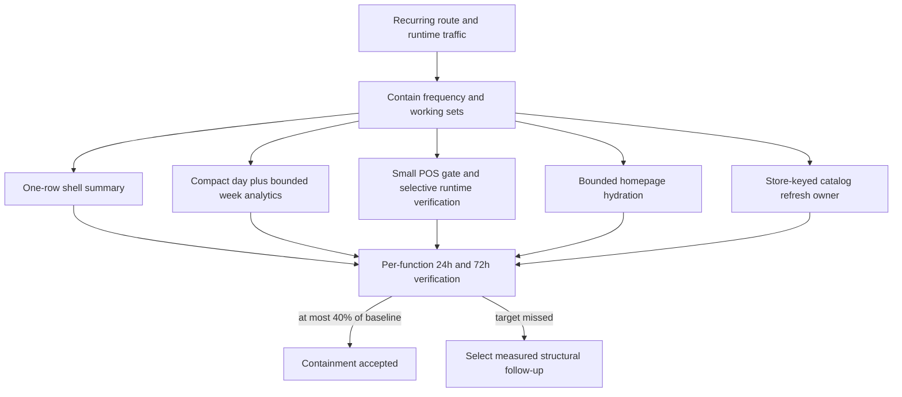
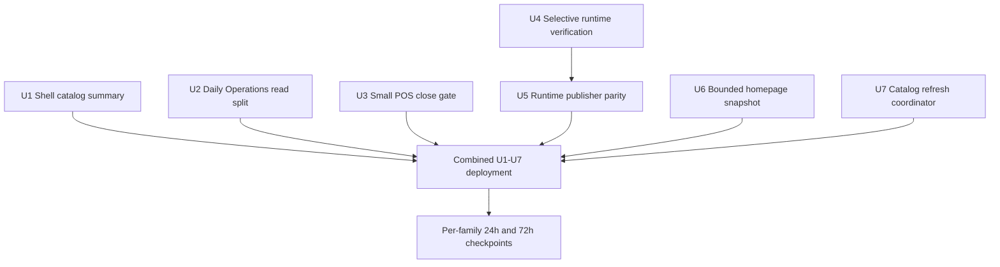
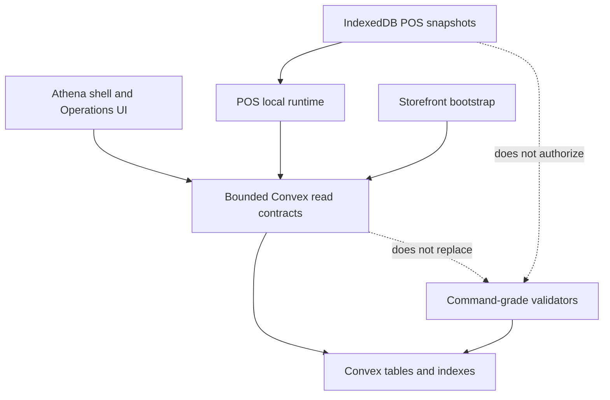

# fix: Contain Convex database I/O before the billing limit

## Summary

Reduce recurring Convex Database I/O to at most 40% of the normalized baseline by removing known amplified reads across the authenticated shell, Daily Operations, POS terminal/runtime paths, the storefront homepage, and POS catalog refreshes. Deliver U1-U7 together, measure each family at fixed 24-hour and 72-hour checkpoints, and preserve command-grade, offline, authorization, and reporting-integrity boundaries.

### Execution scope correction — 2026-07-13

The Dev reporting backfill had already completed before implementation began, and no further heavy maintenance is scheduled for this billing-period containment window. U8 and V26-1047 are therefore deferred as a future structural safeguard. This delivery implements U1-U7 only and credits no maintenance savings toward the recurring-rate target or billing forecast.

---

## Problem Frame

Athena has consumed 29.4 GB of a 50 GB Convex Database I/O allocation while function calls and compute remain far below their limits. At the observed calendar-month rate, usage projects to roughly 70 GB and would exhaust the allocation around July 22. The visible function breakdown attributes about 82% of total I/O to a small set of recurring or maintenance-heavy functions; Daily Operations, broad product reads, terminal runtime status, and POS catalog reads alone represent about 64.5% of total usage.

The dominant problem is not business volume. It is large read sets multiplied by global subscriptions, eager companion queries, broad scans, recurring heartbeat side effects, duplicate cold refreshes, and overlapping Dev maintenance. A prior posture/detail split established the correct architectural boundary, but several callers later reopened expensive paths by eagerly mounting their companion reads.

---

## Requirements

- R1. Reduce the combined recurring Dev and Prod Database I/O rate by at least 60% against comparable, maintenance-free pre-deploy windows; the post-change rate must be at most 40% of baseline.
- R2. Keep the projected billing-period total below the 50 GB allocation with at least 10% forecast headroom. At each checkpoint, enforce the stricter of a 60% recurring-rate reduction or the remaining-budget ceiling `(45 GB - cumulative usage at checkpoint time) / remaining billing-period hours`, using 24-hour and 72-hour confirmation rather than a single short sample.
- R3. Remove `inventory/products.getAll` from authenticated shell navigation and use the existing one-row catalog summary without turning the shell into a repair trigger or presenting stale zero as trustworthy.
- R4. Keep Daily Operations compact posture automatic, supply week-at-a-glance data through a bounded analytics-only contract, and load selected-day detail only from explicit operator intent; no route mount may build seven command-grade day snapshots.
- R5. Replace the POS opening guard's full Daily Close subscription with a small server-owned store-day gate while preserving the exact active, completed, reopened, loading, authorization, and local/offline readiness semantics.
- R6. Make accepted runtime heartbeats read only recovery commands awaiting runtime verification, align client/server material-state classification, and coordinate one active publisher per store/terminal without weakening the sub-two-minute terminal-health freshness contract.
- R7. Reduce storefront homepage cold-read working sets through store-scoped indexes, bounded candidate selection before hydration, and validity-safe time bucketing while preserving public DTO, ranking, visibility, money, guest, and cookie behavior.
- R8. Coalesce POS metadata/full-availability refresh ownership per store and reuse a recent persisted snapshot without turning one-shot reads into subscriptions or allowing local cache state to authorize checkout.
- R9. Deliver independently measurable function-family checkpoints with explicit whole-surface rollback triggers and live per-function-family Database I/O, Function Calls, derived average bytes/call, correctness, and adoption evidence; prove document-count and distribution boundaries in high-cardinality tests rather than requiring unavailable live telemetry.

---

## Scope Boundaries

- Do not change POS command-side stock, catalog, register, checkout, or transaction validation; server truth remains authoritative.
- Do not lengthen terminal heartbeat freshness beyond the existing health threshold, remove material sync posture, or expose internal write/no-write outcomes through public APIs.
- Do not move Daily Opening, Daily Close, queue, cash, or reporting lifecycle authority into Daily Operations display queries.
- Do not cache the entire cookie-bearing storefront bootstrap response as the containment mechanism.
- Do not collapse reporting preview, preflight, manifest, apply, reconciliation, or activation boundaries to reduce transient I/O.
- Do not retire every remaining `products.getAll` consumer in this delivery; only the global shell read is removed now.
- Do not silently introduce migration-heavy digest/projection tables into containment. Promoting a digest/projection requires an explicit scope change, a separately reviewed unit and budget, and user approval.

### Deferred to Follow-Up Work

- Materialized Daily Operations store-day and week digests maintained from source writes, plus a shared compact store-day posture projection for POS and Operations.
- Paginated/search-first product digests and selected-product detail contracts that retire remaining `products.getAll` consumers in dashboard, bulk operations, promo, homepage-admin, and selection dialogs.
- Store-level catalog revision documents, compact POS metadata/availability projections, and incremental refresh protocols.
- A materialized public homepage payload with an explicit invalidation model, separate from cookie bootstrap.
- A high-churn terminal telemetry/heartbeat document split if selective verification and publisher ownership do not meet the runtime target.
- Queue, cash/deposit, stock-reservation, and inventory-unit digests driven by post-containment function evidence.
- Byte-aware reporting batches, page-local memoization/aggregation, a queued maintenance scheduler above the containment reservation, and formal per-run I/O budgets.
- A singleton shared-Dev maintenance reservation if another heavy backfill/rebuild lineage is scheduled; the completed Dev backfill is historical and earns no savings credit here.
- Periodic usage-snapshot automation and budget alarms if Convex exposes a stable low-overhead export suitable for Athena's scale.
- Canonical operational timeline backfill sufficient to remove compensating broad timeline preview reads.

---

## Context & Research

### Relevant Code and Patterns

- `packages/athena-webapp/src/components/products/Products.tsx` already treats `catalogSummary` as the product-count source and distinguishes trustworthy from pending summaries.
- `packages/athena-webapp/convex/inventory/products.ts` exposes `getCatalogSummary`, backed by `catalogSummary.by_storeId`; `packages/athena-webapp/convex/inventory/catalogSummary.ts` owns dirtying and repair boundaries.
- `packages/athena-webapp/convex/operations/dailyOperations.ts` already separates compact, detail, store-pulse, refresh, and timeline contracts, but the detail query and caller currently reassemble expensive work.
- `packages/athena-webapp/convex/operations/dailyClose.ts` owns store-day close lifecycle and is the command-grade authority; its indexed close lookup can support a small read DTO without weakening completion validation.
- `packages/athena-webapp/convex/schema.ts` already defines `posTerminalRecoveryCommand.by_store_terminal_verification`, so runtime command selectivity does not need a migration.
- `packages/athena-webapp/src/lib/pos/infrastructure/local/usePosLocalSyncRuntime.ts` already has same-tab publish state and a short cross-context claim; containment extends this established coalescing boundary.
- `packages/athena-webapp/src/lib/pos/infrastructure/convex/catalogGateway.ts` already uses one-shot queries and IndexedDB persistence; coordination belongs around that gateway rather than in UI surfaces.
- Reporting maintenance workers already expose pause/cancel and lineage state. If another heavy shared-Dev lineage is scheduled, a separately planned start/resume guard should extend the existing run ledger rather than inventing a second scheduler.

### Institutional Learnings

- `docs/solutions/performance/athena-convex-read-amplification-2026-06-29.md`: default route/register/roster reads are bounded posture contracts; detail, analytics, and history belong behind explicit companion reads. Client caching does not repair an expensive server read.
- `docs/solutions/logic-errors/athena-foundation-sku-search-catalog-summary-2026-06-25.md`: shell metrics read `catalogSummary`; missing/stale summary state is pending, and repair remains outside shell reads.
- `docs/solutions/logic-errors/athena-daily-operations-current-day-refresh-2026-06-30.md`: current-day refresh remains narrow and store-day-aware rather than reverting to broad detail hydration.
- `docs/solutions/performance/athena-pos-runtime-status-check-in-storm-2026-07-02.md`: duplicate/no-op suppression is already valuable, but terminal freshness, `sync.status`, staff identity, app-update evidence, and side-effect semantics are load-bearing.
- `docs/solutions/architecture/athena-pos-offline-inventory-snapshot-2026-05-15.md`: metadata, bounded live availability, full offline availability, and command validation are separate trust contracts.
- `docs/solutions/logic-errors/athena-homepage-snapshot-contract-2026-06-22.md`: optimize inside the typed public snapshot and cookie bootstrap contract rather than introducing bypass queries.
- `docs/solutions/architecture/athena-reporting-fact-projection-boundary-2026-07-09.md`: maintenance remains bounded, idempotent, lineage-governed, and independently reconciled.

### Prior Art and Regression Evidence

- PR #591 established bounded posture/detail contracts and one-shot catalog metadata reads.
- PR #592 reintroduced automatic week-detail and store-pulse hydration; current tests explicitly preserve this eager behavior and must be rewritten with the containment contract.
- PRs #610, #628, and #630 reduced runtime publish storms and duplicate writes; this plan narrows the remaining accepted-heartbeat read set and completes cross-context publisher ownership.
- The earlier read-amplification delivery used high-cardinality fixtures plus production log/insight samples; this plan retains that dual verification posture.

### External References

- Convex's dashboard already exposes authoritative Database I/O totals and function breakdowns, while the CLI exposes point-in-time JSON Insights and bounded recent logs. Use repeatable checkpoints rather than a long-running collector.

---

## Key Technical Decisions

| Decision | Resolution and rationale |
|---|---|
| Optimization posture | Remove accidental frequency and working-set amplification before introducing new persistent projections. The current signals identify multiple caller/index bugs that are cheaper and safer to eliminate first. |
| Measurement boundary | Normalize recurring I/O by deployment, function, hour, call, and document/byte count. Exclude declared maintenance windows from the recurring baseline and report them separately. |
| Product badge source | Use the existing `catalogSummary` row only when trustworthy. The shell may display pending/no badge but never run repair or treat stale zero as authoritative. |
| Daily Operations week data | Introduce a week-analytics-only query; do not use detail snapshots as a weekly cache. Selected-day compact posture and detail remain separate contracts. |
| POS close readiness | Add a small read DTO owned beside Daily Close. Reuse lifecycle interpretation; do not duplicate the command-grade snapshot builder. |
| Runtime verification | Use the existing verification-status index and preserve a defensive completed-status check, acknowledgement ordering, evidence matching, and fair processing of pending commands. |
| Runtime publisher ownership | Share a browser-safe material projection across client/server and use Web Locks to serialize store/terminal lease acquisition where available. Unsupported browsers use best-effort storage coordination plus existing server no-op/side-effect safety; the plan does not claim strict client fencing in that fallback. |
| Homepage time semantics | Cache-share indexed merchandising candidates on a minute bucket, but apply banner validity against the exact request evaluation time so an expired banner is never extended. Candidate selection remains compatibility-bounded and fills visible quotas before hydration. |
| Catalog coordination | Coordinate in-flight and recently successful refreshes by store inside the gateway. Explicit refresh generations, store changes, and failures bypass/clear reuse safely. |
| Deferred maintenance containment | V26-1047/U8 is not delivered or credited. Before another heavy shared-Dev lineage is scheduled, reassess a deployment-wide reservation under a fresh plan that preserves explicit child lineage and Prod behavior. |
| Rollout | Ship reviewed U1-U7 together, then evaluate shell/Operations, POS/runtime, and homepage/catalog independently in matching 24-hour and 72-hour checkpoints. Any correctness stop uses whole-surface rollback. |

---

## Open Questions

### Resolved During Planning

- Should containment create new digest tables immediately? No. Structural projections are follow-up work triggered by 24/72-hour evidence after accidental amplification is removed.
- May the sidebar repair a missing catalog summary? No. It stays advisory and cheap; the Products/admin path owns repair.
- May the POS gate infer a new definition of closed? No. It is only a smaller DTO over existing Daily Close lifecycle semantics.
- Should the heartbeat cadence be increased to reduce calls? No. The plan narrows reads and publisher ownership without weakening terminal-health freshness.
- Can Prod provide a multi-terminal runtime sample? No. Prod currently has one heartbeat-producing terminal, M Supplies. Production proof is longitudinal for that terminal; multi-context ownership, takeover, and fallback races are proved in controlled Dev and automated tests.
- Should the storefront HTTP response be globally cached? No. The inner query becomes reusable; cookie and guest bootstrap remains request-specific.
- Can maintenance phases be collapsed to save I/O? No. Scheduling and bounded mechanics may improve, but trust and reconciliation boundaries stay intact.
- Should containment results be persisted and exposed inside Athena? No. Convex CLI/dashboard evidence already answers the delivery question, while an in-app surface would add schema, writes, authorization, and reads to the system being optimized. Each gate produces an operator-readable local/CI report instead.

### Deferred to Implementation

- Exact module placement for the shared runtime material normalizer, provided it remains browser-safe, Convex-safe, dependency-neutral, and covered by shared classification vectors.
- Exact runtime leader-lease duration, provided it renews on the existing wake cadence, expires safely below the online threshold, and supports takeover without duplicate long-lived owners.
- Exact short catalog reuse interval, provided explicit refresh generations bypass it and local/offline correctness tests remain green.
- Exact bounded homepage candidate batch size, provided compatibility caps, ordering, hidden-candidate fallthrough, and visible quotas are preserved.

---

## High-Level Technical Design

> *This illustrates the intended approach and is directional guidance for review, not implementation specification. The implementing agent should treat it as context, not code to reproduce.*

The containment queries remain read models. Existing mutation/command boundaries continue to revalidate live source truth, and local POS snapshots remain continuity inputs rather than sale authority.

---

## Implementation Units

- U1. **Move the shell badge to the catalog summary**

**Goal:** Remove the full product/SKU subscription from every authenticated route while preserving an honest unresolved-product signal.

**Requirements:** R1-R3, R9

**Dependencies:** None

**Files:**
- Modify: `packages/athena-webapp/src/components/app-sidebar.tsx`
- Test: `packages/athena-webapp/src/components/app-sidebar.test.tsx`
- Reference: `packages/athena-webapp/src/components/products/Products.tsx`
- Reference: `packages/athena-webapp/src/hooks/useGetProducts.ts`
- Reference: `packages/athena-webapp/convex/inventory/products.ts`
- Reference/Test: `packages/athena-webapp/convex/inventory/catalogSummary.test.ts`

**Approach:**
- Subscribe directly to `getCatalogSummary` for the active store and remove the sidebar dependency on `useGetUnresolvedProducts`.
- Show the badge only when summary data is current/trustworthy and the unresolved count is positive. Missing or dirty summary state remains pending/no badge rather than a false zero.
- Keep `useGetUnresolvedProducts` for the actual unresolved-products workspace; do not broaden this unit into general product-query retirement.
- Never call summary repair from the shell.

**Execution note:** Update the shell behavior tests before removing the broad hook so the pending/trust semantics remain explicit.

**Patterns to follow:**
- Summary trust handling in `packages/athena-webapp/src/components/products/Products.tsx`.
- Dirty/repair ownership in `packages/athena-webapp/convex/inventory/catalogSummary.ts`.

**Test scenarios:**
- Happy path: an authenticated route with a trustworthy positive summary renders the exact unresolved count and never subscribes to `products.getAll`.
- Edge case: active-store switching changes the summary subscription and never displays the previous store's count.
- Edge case: missing, `needsRefresh`, or zero-timestamp summaries render pending/no badge without triggering repair.
- Authorization: absence of an active store skips the query; no cross-store summary is displayed.
- Integration: catalog-changing mutations continue marking the summary dirty and the Products surface remains the repair owner.

**Verification:**
- Shell navigation produces zero `products.getAll` calls attributable to the sidebar and at least an 80% aggregate reduction in the broad product function family during comparable navigation.

- U2. **Separate bounded week analytics from Daily Operations detail**

**Goal:** Preserve week-at-a-glance and selected-day behavior without automatically building eight command-grade snapshots per uncached week.

**Requirements:** R1-R2, R4, R9

**Dependencies:** None

**Files:**
- Modify: `packages/athena-webapp/convex/operations/dailyOperations.ts`
- Test: `packages/athena-webapp/convex/operations/dailyOperations.test.ts`
- Modify: `packages/athena-webapp/src/components/operations/DailyOperationsView.tsx`
- Test: `packages/athena-webapp/src/components/operations/DailyOperationsView.test.tsx`

**Approach:**
- Add an authorized week-analytics contract that returns only the metrics needed by the week strip/trend and does not invoke Daily Opening, Daily Close, queue, timeline, store-pulse detail, or automation builders per day.
- Make `getDailyOperationsDetailSnapshot` selected-day-only and remove its seven-day `weekSnapshots` expansion.
- Maintain separate client caches for week metrics and selected-day detail. Navigating within a week may reuse metrics, but still loads the selected day's compact posture independently.
- Remove automatic detail and store-pulse hydration on route mount. Explicit detail/store-pulse intent remains lazy; manual current-day refresh remains the existing narrow store-day flow.
- Preserve full-admin analytics and financial evidence while keeping `pos_only` redaction and posture behavior unchanged.

**Execution note:** Characterize visible week-strip, selected-day, authorization, and refresh behavior before deleting the eager tests that currently lock in the regression.

**Patterns to follow:**
- Existing companion-query split in `packages/athena-webapp/convex/operations/dailyOperations.ts`.
- Route/snapshot-key cache isolation in `packages/athena-webapp/src/components/operations/DailyOperationsView.tsx`.

**Test scenarios:**
- Happy path: initial Operations route load fetches compact selected-day posture and one bounded weekly result; detail and store-pulse detail remain skipped.
- Happy path: explicit detail intent fetches only the selected day and never returns/caches seven full day snapshots.
- Navigation: moving within the same week reuses weekly metrics while loading the next selected day's compact posture; moving weeks uses a new week key.
- Race: rapid week/date navigation cannot attach a late response to the wrong store, week, or day.
- Historical: historical dates remain view-only and do not arm today's automatic stale refresh.
- Authorization: full admins retain weekly totals/detail evidence; `pos_only` retains redacted posture without unauthorized analytics.
- Edge cases: closed days, reopened close records, empty weeks, and missing analytics render valid shells without falling back to the broad query.
- Read-shape: high-cardinality/source spies prove weekly metrics do not call command-grade Daily Close/Opening builders seven times.

**Verification:**
- `getDailyOperationsDetailSnapshot` has zero initial-route calls without explicit detail intent and at least a 75% aggregate I/O reduction in comparable Operations windows.

- U3. **Replace the POS opening guard's full Daily Close read**

**Goal:** Give POS the minimum cloud store-day close decision it consumes while keeping Daily Close authoritative.

**Requirements:** R1-R2, R5, R9

**Dependencies:** None

**Files:**
- Modify: `packages/athena-webapp/convex/operations/dailyClose.ts`
- Test: `packages/athena-webapp/convex/operations/dailyClose.test.ts`
- Modify: `packages/athena-webapp/src/components/pos/register/POSRegisterOpeningGuard.tsx`
- Test: `packages/athena-webapp/src/components/pos/register/POSRegisterOpeningGuard.test.tsx`
- Reference/Test: `packages/athena-webapp/src/lib/pos/infrastructure/local/localPosReadiness.test.ts`

**Approach:**
- Add a narrowly authorized store-day close gate beside the full snapshot query, using the existing indexed close lookup and lifecycle interpretation.
- Return only the safe fields needed to distinguish absent/open, active completed, reopened/superseded, and unresolved states; do not calculate financial, blocker, transaction, expense, deposit, or review evidence.
- Replace only the POS opening guard callsite. EOD Review and mutation-time completion continue using full command-grade evidence.
- Keep local/offline readiness precedence and loading behavior intact.

**Execution note:** Start with backend lifecycle characterization and frontend guard-state tests because the read shape changes but the closed/open policy must not.

**Patterns to follow:**
- Store-day lifecycle/currentness helpers in `packages/athena-webapp/convex/operations/dailyClose.ts`.
- Existing readiness composition in `packages/athena-webapp/src/lib/pos/infrastructure/local/localPosReadiness.ts`.

**Test scenarios:**
- Happy path: no close record or an opening/active day continues through readiness evaluation.
- Closed path: the active completed close blocks register entry.
- Reopen path: completed history with the active lifecycle reopened does not falsely block.
- Legacy/currentness: superseded/non-current completed history cannot masquerade as the active close.
- Loading: unresolved cloud gate state remains checking rather than falsely ready or closed.
- Authorization: `full_admin` and `pos_only` retain current access; other-store input is rejected without leakage.
- Offline integration: local closeout continuity and local readiness remain unchanged when cloud data is unavailable.
- Read-shape: the compact query does not invoke the full snapshot builder or transaction/item/expense/deposit sources.

**Verification:**
- POS guard executions reduce read bytes/documents by over 90% while register-opening and Daily Close regression scenarios remain unchanged.

- U4. **Use selective recovery-command reads on accepted heartbeats**

**Goal:** Eliminate the up-to-50 completed-command scan from each accepted runtime heartbeat.

**Requirements:** R1-R2, R6, R9

**Dependencies:** None

**Files:**
- Modify: `packages/athena-webapp/convex/pos/application/terminalRecovery/terminalCommandService.ts`
- Test: `packages/athena-webapp/convex/pos/application/terminalRecovery/terminalCommandService.test.ts`
- Modify: `packages/athena-webapp/convex/pos/infrastructure/repositories/terminalRecoveryRepository.ts`
- Test: `packages/athena-webapp/convex/pos/infrastructure/repositories/terminalRecoveryRepository.test.ts`
- Reference: `packages/athena-webapp/convex/schema.ts`
- Test if integration contract moves: `packages/athena-webapp/convex/pos/application/terminals.test.ts`
- Test if public behavior moves: `packages/athena-webapp/convex/pos/public/terminals.test.ts`

**Approach:**
- Extend the recovery repository with a purpose-specific bounded read for `runtime_verification_ready` commands using the existing store/terminal/verification index.
- Keep a defensive completed-status check before verification and preserve acknowledgement time, command execution identity, register/session evidence, app-update evidence, local-review counts, and stale-runtime rejection.
- Define fair ordering/continuation for any bound so older verification-ready commands cannot starve behind newer rows.
- Keep post-runtime side-effect orchestration and public response contracts unchanged.

**Execution note:** Implement repository index-use and service evidence-match tests first; this is a high-frequency correctness boundary.

**Patterns to follow:**
- Existing selective compound-index queries in POS repositories.
- Runtime evidence safeguards in `terminalCommandService.test.ts`.

**Test scenarios:**
- Empty path: accepted heartbeat with zero verification-ready commands performs no completed-history scan and no command writes.
- Happy path: fresh post-acknowledgement evidence verifies the matching ready/completed command.
- Evidence failures: stale runtime, pre-acknowledgement evidence, mismatched app-update execution, count-only review evidence, and mismatched register/session remain unverified.
- Index shape: the repository uses the exact verification index scoped by store and terminal.
- Isolation: ready commands for another store/terminal and unrelated completed history are not loaded.
- Fairness: more ready commands than the batch bound make deterministic progress without starvation.

**Verification:**
- Accepted-heartbeat read bytes fall by at least 80% from the measured ~185 KB heavy path; the no-op path remains at its current minimal read set and recovery completion latency does not regress.

- U5. **Align runtime material state and elect one publisher**

**Goal:** Stop semantically equivalent browser publishers from generating redundant reports while preserving timely health and recovery evidence.

**Requirements:** R1-R2, R6, R9

**Dependencies:** U4

**Files:**
- Create or Modify: `packages/athena-webapp/shared/pos/terminalRuntimeMaterial.ts`
- Test: `packages/athena-webapp/shared/pos/terminalRuntimeMaterial.test.ts`
- Modify: `packages/athena-webapp/src/lib/pos/infrastructure/local/runtimeStatusPublisher.ts`
- Modify: `packages/athena-webapp/src/lib/pos/infrastructure/local/usePosLocalSyncRuntime.ts`
- Test: `packages/athena-webapp/src/lib/pos/infrastructure/local/usePosLocalSyncRuntime.test.ts`
- Modify: `packages/athena-webapp/convex/pos/infrastructure/repositories/terminalRepository.ts`
- Test: `packages/athena-webapp/convex/pos/infrastructure/repositories/terminalRepository.test.ts`
- Test as needed: `packages/athena-webapp/convex/pos/application/terminals.test.ts`
- Test as needed: `packages/athena-webapp/convex/pos/public/terminals.test.ts`

**Approach:**
- Extract one dependency-neutral material projection consumed by browser publish decisions and server duplicate/material comparison.
- Preserve fields that affect operational health or directives: local seed/store availability, sync/review posture, staff/sale/terminal/drawer/app-session status, active register identity, and app-update execution/status.
- Exclude dropped/volatile observations such as reported/observed timestamps, snapshot ages, browser diagnostics, usage counters, and other fields the server intentionally ignores.
- Replace the short cross-context cycle claim with a renewable store/terminal leader lease. Where `navigator.locks` exists, serialize lease acquire/takeover and epoch updates under a store/terminal Web Lock; the lock protects the ownership transition rather than remaining held for the lease lifetime. The owner renews on the existing wake cadence and another context takes over after expiry or owner shutdown.
- Define the cross-context handoff explicitly: store/terminal-keyed `BroadcastChannel` messages carry the latest material projection and monotonic lease epoch/generation; storage events provide the transport fallback. Followers forward their latest material state and the owner verifies current epoch immediately before publish/renew.
- In browsers without Web Locks, treat storage ownership as best-effort duplicate suppression, not strict fencing. A racing stale publish may complete, so retain server fast-duplicate/no-op and idempotent side-effect guards as the correctness boundary and measure duplicate call rate separately. Do not add a server lease read/write to every heartbeat solely to make client ownership strict.
- Retain same-tab coalescing, one in-flight publish, queued-latest replay, freshness-only heartbeat, fast-duplicate suppression, richer staff identity preservation, and transient-syncing debounce.

**Execution note:** Use shared classification vectors and fake-clock cross-context tests before changing lease timing.

**Patterns to follow:**
- Existing module-global publish state and cross-context claim in `usePosLocalSyncRuntime.ts`.
- Existing duplicate-window and material comparison tests in `terminalRepository.test.ts`.

**Test scenarios:**
- Parity: client and server classify the same material/volatile field vectors identically.
- Same tab: duplicate hooks share one in-flight mutation and replay only the latest material state.
- Cross tab: one store/terminal has one leader; a second terminal remains independently publishable.
- Lifecycle: the leader renews, releases on shutdown where possible, and a follower takes over after expiry.
- Handoff: a material change observed only by a follower reaches the leader and publishes once; fallback transport has the same result without BroadcastChannel.
- Serialization: with Web Locks, simultaneous expiry contenders produce one winning epoch and a prior owner cannot begin a new publish after observing takeover.
- Fallback race: without Web Locks, simultaneous contenders may produce duplicate calls, but server no-op/side-effect tests prove no duplicate recovery or Remote Assist effects and the runtime stays within the cost guardrail.
- Freshness: a cadence heartbeat remains writable before active runtime status can age past the online threshold.
- Material change: meaningful sync, staff, drawer, register, or app-update change publishes without unbounded lease delay.
- No-op: fast server duplicates remain no-write and skip recovery/Remote Assist side effects.
- Identity: omitted staff identity does not erase richer known state.
- Transient state: fast `syncing -> settled` churn remains debounced without removing `sync.status` from material posture.

**Verification:**
- Web-Locks-capable clients converge toward one freshness publisher per active terminal plus genuine material changes; fallback clients remain best-effort and must still meet the runtime byte/call budget with no duplicate side effects, false-offline increase, OCC regression, or recovery backlog growth.

- U6. **Bound and cache-share the storefront homepage snapshot**

**Goal:** Reduce the public homepage's cold query from thousands of documents while preserving merchandising and bootstrap behavior.

**Requirements:** R1-R2, R7, R9

**Dependencies:** None

**Files:**
- Modify: `packages/athena-webapp/convex/schema.ts`
- Modify: `packages/athena-webapp/convex/storeFront/homepageSnapshot.ts`
- Test: `packages/athena-webapp/convex/storeFront/homepageSnapshot.test.ts`
- Modify: `packages/athena-webapp/convex/http/domains/customerChannel/routes/homepageSnapshot.ts`
- Test: `packages/athena-webapp/convex/http/domains/customerChannel/routes/homepageSnapshot.test.ts`
- Test for public parity: `packages/storefront-webapp/src/api/homepageSnapshot.test.ts`
- Test for loader parity: `packages/storefront-webapp/src/routes/-homePageLoader.test.ts`
- Test for UI parity as needed: `packages/storefront-webapp/src/components/HomePage.test.tsx`

**Approach:**
- Add store-scoped indexes for best-seller and featured placement reads and store/taxonomy indexes for target product candidates.
- Select and order lightweight candidate rows first, then hydrate in small bounded batches until visible quotas are filled or the existing compatibility cap is exhausted. Hidden/invalid top rows must fall through to valid later candidates.
- Bound SKU hydration to the display need while retaining first-sellable ordering, rank continuity, visibility rules, reserved-category exclusion, and minor-unit money semantics.
- Use a minute bucket only for cacheable, indexed merchandising candidate/hydration work. Apply `presentPublicBannerMessage` (and any equivalent validity-sensitive presentation) against the exact request `nowMs` after the reusable candidate result is obtained. Keep guest creation and response cookies request-specific; do not add whole-response HTTP caching.

**Execution note:** Add high-cardinality and exact time-boundary characterization before changing query/index shape.

**Patterns to follow:**
- Typed `homepage_snapshot.v1` construction in `homepageSnapshot.ts`.
- Current bootstrap/guest/cookie tests in the HTTP route.

**Test scenarios:**
- Read shape: store placement and taxonomy candidates use indexes and never scan another store.
- High cardinality: only bounded candidates and visible products/SKUs are hydrated; documents/bytes fall by at least 70% from the observed cold call.
- Fallthrough: hidden, unavailable, reserved, cross-store, or non-live leading candidates are skipped while later valid rows fill quotas in correct order.
- Time boundary: requests within a minute share merchandising work; a boundary advances the bucket; `countdownEndsAt <= nowMs` hides the banner immediately with no early expiry or expiry extension.
- Bootstrap: missing store remains not-found, guest creation remains idempotent by marker, and cookies are still returned on equivalent cached/uncached query results.
- Contract: DTO version, contiguous ranks, shop-look singleton behavior, images, and minor-unit money stay unchanged.
- Integration: route loader plus component hydration does not produce duplicate network fetches for one navigation.

**Verification:**
- High-cardinality tests prove at least 70% fewer hydrated documents; live checkpoints show at least 70% lower average bytes/call, same-bucket requests become cache-shareable, and public error/latency/merchandising contracts show no regression.

- U7. **Coordinate POS catalog refresh ownership per store**

**Goal:** Prevent POS prewarm, register, expense, and product consumers from independently downloading and persisting the same full catalog snapshots.

**Requirements:** R1-R2, R8, R9

**Dependencies:** None

**Files:**
- Modify: `packages/athena-webapp/src/lib/pos/infrastructure/convex/catalogGateway.ts`
- Test: `packages/athena-webapp/src/lib/pos/infrastructure/convex/catalogGateway.test.tsx`
- Test contract as needed: `packages/athena-webapp/src/components/pos/PointOfSaleView.test.tsx`
- Test contract as needed: `packages/athena-webapp/src/lib/pos/presentation/register/useRegisterViewModel.test.ts`
- Test contract as needed: `packages/athena-webapp/src/lib/pos/presentation/expense/useExpenseRegisterViewModel.test.ts`
- Reference/Test: `packages/athena-webapp/convex/pos/application/queries/listRegisterCatalog.test.ts`
- Reference/Test: `packages/athena-webapp/convex/pos/public/catalog.test.ts`

**Approach:**
- Add a module-level store-keyed coordinator around existing one-shot metadata and full-availability refresh operations.
- Share one in-flight request and persistence completion among concurrent consumers. Reuse a recently successful persisted snapshot for a short explicit window.
- Treat explicit metadata refresh generations/keys as invalidation. Isolate different stores, clear failed ownership for retry, and prevent late older responses from overwriting newer local state.
- Keep metadata and full availability separate. Keep bounded selected-SKU availability reactive and command-side stock/catalog validation authoritative.
- Preserve immediate local IndexedDB rendering offline and while refresh is pending; refresh failure must not discard usable local data.

**Execution note:** Build concurrency, store isolation, failure, and late-result tests around the gateway before changing callsites.

**Patterns to follow:**
- Existing one-shot Convex query and local persistence path in `catalogGateway.ts`.
- Existing store-keyed runtime coalescing patterns in the POS local runtime.

**Test scenarios:**
- Concurrency: simultaneous POS prewarm, register mount, and expense mount for one store issue one query and one persistence operation.
- Reuse: prewarm followed by register/expense within the freshness window reuses the persisted result.
- Explicit invalidation: refresh-key/generation change forces a new request despite recent success.
- Isolation: different stores never share data, promises, timestamps, or failures.
- Failure: a failed owner clears in-flight state and a later retry succeeds; one consumer unmounting does not cancel shared completion.
- Ordering: a late older refresh cannot replace newer local metadata/availability.
- Offline: usable local rows render immediately and remain after refresh or persistence failure.
- Authority: bounded live overlays continue and checkout commands still reject stale/invalid server state.

**Verification:**
- At most one metadata and one full-availability refresh occur per store/browser-runtime refresh cycle, with no loss of offline-ready rate or increase in checkout validation failure.

U8/V26-1047 is not an implementation unit in this delivery. The Dev backfill already ran. A maintenance reservation remains a future structural fix only if another heavy shared-Dev lineage is scheduled, with a fresh plan and no retrospective savings credit.

---

## System-Wide Impact

- **Interaction graph:** The shell, Daily Operations route, POS opening guard, POS runtime hosts, storefront HTTP bootstrap, and catalog gateway change read ownership or query selectivity. Command owners remain separate.
- **Error propagation:** Query failures preserve current loading/error/offline behavior. Catalog refresh failures retain usable local data; runtime ownership failures fall back through lease expiry.
- **State lifecycle risks:** Week/detail caches, catalog in-flight state, and runtime leader leases must be store-scoped and resistant to late/stale results.
- **API surface parity:** Public homepage DTO/cookies, POS public runtime responses, Daily Close full snapshot, and command APIs remain stable. New small queries are additive and replace only specific internal callsites.
- **Observability integrity:** Cost evidence remains outside Athena's runtime. CLI/dashboard outputs are captured for explicit windows and summarized in operator reports; no measurement table, import mutation, route, or subscription is added.
- **Integration coverage:** Browser/backend tests must prove route query ownership, offline/local continuity, runtime cross-context takeover, and storefront bootstrap—not only isolated helpers.
- **Unchanged invariants:** Authorization stays store-scoped; POS commands validate live server truth; Daily Close owns close semantics; reporting backfill never rewrites source truth; terminal health remains fresh below two minutes.

---

## Alternative Approaches Considered

- **Materialize all hot surfaces immediately:** Rejected for containment because it adds migrations, write fan-out, drift risk, and a slower route to the billing target before caller/index bugs are removed.
- **Rely on frontend caching alone:** Rejected because expensive cold server reads and reactive invalidations still incur Database I/O, and several current paths are already cached yet remain costly.
- **Only ration Dev usage:** Rejected because Prod recurring functions remain large and public/POS costs scale with traffic; Dev freeze is necessary but insufficient.
- **Increase terminal heartbeat intervals:** Rejected because it trades billing savings for false-offline/recovery risk and violates the existing health contract.
- **Buy additional allocation without changing reads:** Rejected as the primary response; it raises the ceiling without correcting functions that read thousands of documents to answer small UI questions.

---

## Success Metrics

### Primary Billing Outcome

- Combined recurring Dev and Prod Database I/O GB/hour is at most 40% of the normalized maintenance-free baseline for comparable active-surface windows.
- The billing-period forecast stays under 45 GB, providing at least 10% headroom below the 50 GB allocation.
- Maintenance I/O is tagged/reported separately and is zero outside declared windows.
- At each checkpoint, calculate `allowable remaining GB/hour = (45 GB - cumulative billed GB) / remaining billing-period hours`. A family passes cost only when its normalized rate is at or below both that ceiling and 40% of its comparable baseline; missing exposure remains `Hold`, while a correctness stop triggers whole-surface rollback.

### Weighted Savings Budget

The screenshot totals below are attribution inputs, not a promise that every byte is removable by the named unit. Comparable checkpoints must replace cumulative GB with caller-attributed GB/hour. Past maintenance usage is sunk and never credited as savings.

#### Recurring-rate ledger (R1)

| Units / billed family | Visible maintenance-free contribution | Planning low / base / high savings | Attribution condition |
|---|---:|---:|---|
| U1 broad products | 4.64 GB | 0.5 / 2.5 / 3.7 GB | Measure shell share separately from remaining intentional `getAll` callers. |
| U2 Daily Operations / queue family | 7.57 GB | 3.0 / 4.8 / 5.7 GB | Credit only detail/week calls removed by the new route contract, not unrelated queue work. |
| U3 POS close gate | 0.39 GB known visible close slice | 0.2 / 0.3 / 0.35 GB | Attribute only guard-originated close reads. |
| U4-U5 terminal runtime | 3.67 GB | 1.8 / 2.8 / 3.3 GB | Separate accepted heartbeat, no-op, and client-build adoption. |
| U6 homepage | 0.81 GB | 0.4 / 0.57 / 0.65 GB | Compare cold calls with identical merchandising cardinality. |
| U7 POS catalog | 3.10 GB | 0.8 / 1.55 / 2.0 GB | Measure duplicate ownership separately from necessary cold refreshes. |
| **Recurring total planning range** | **20.18 GB visible** | **6.7 / 12.52 / 15.70 GB** | Excludes U8 and all declared maintenance windows. |

Using the screenshot only as a planning proxy, the maintenance-free baseline is approximately 26.66 GB and a 60% reduction requires about 16.0 GB-equivalent recurring savings. The current high case is about 0.30 GB short, so the plan does not claim R1 is already funded.

The recurring high case is about 0.30 GB short of the 60% planning target, so the delivery does not pre-claim R1. If the 24/72-hour family evidence misses R1 without a correctness regression, select one measured structural follow-up under a fresh plan. Do not inflate targets or credit U8.

### Function-Family Guardrails

| Function family | Target |
|---|---|
| `inventory/products.getAll` | At least 80% aggregate reduction; zero shell-navigation calls. |
| Daily Operations detail | At least 75% aggregate reduction; zero initial-load detail calls without explicit intent. |
| POS opening gate | Over 90% fewer read bytes/documents than full Daily Close for guard execution. |
| Runtime status | At least 80% reduction on accepted-heartbeat read bytes; no freshness or verification regression. |
| Storefront homepage | High-cardinality tests prove at least 70% fewer documents; live checkpoints prove at least 70% fewer average bytes/call; same-bucket query arguments are reusable. |
| POS full catalog/availability | At most one metadata and one full-availability refresh per store/browser runtime cycle. |
| Reporting maintenance | Zero unscheduled overlap and zero I/O outside declared maintenance windows. |

### Correctness and Reliability

- No increase in POS checkout, opening, or local/offline readiness failures.
- No increase in active terminals aging past the online threshold, OCC retries, or recovery-command backlog.
- No stale or pre-acknowledgement runtime evidence verifies a recovery command.
- No cross-store shell, homepage, catalog, runtime, or maintenance state leakage.
- Daily Operations compact posture, week metrics, role-based evidence, and selected-day behavior retain parity.
- Storefront visibility, rank, money, guest, cookie, and banner-validity contracts retain parity.

---

## Combined Delivery and Measured Checkpoints

### Predeploy: normalize the baseline and freeze discretionary Dev I/O

- Record at least one comparable maintenance-free pre-deploy window by deployment and function family: GB/hour, calls/hour, I/O by function family, derived average bytes/call, active surfaces, and current client build. Record document counts, percentile distributions, cache state, and bounded logs only when available as diagnostics; they are not live pass prerequisites.
- Pause or cancel non-essential reporting maintenance and do not rehearse full migrations against shared Dev.
- Establish the billing forecast and per-family baseline used by every checkpoint.
- Complete the caller-attributed recurring ledger above, explicitly record any shortfall, and allocate an absolute GB allowance to each family from the dated remaining-budget ceiling.
- Capture baseline dashboard/CLI checkpoint evidence into an operator report before deployment. Keep screenshots, exports, and JSON Insights in local or CI artifacts, not Athena data tables or the browser. The July 13 screenshot baseline is explicitly `Hold` because it lacks a reproducible range/build boundary; see `docs/reports/convex-io-containment/2026-07-13-predeploy-baseline.md`.

### Checkpoint Observation Output

- For each baseline, 24-hour, and 72-hour window, capture deployment, UTC start/end, client/server build, active surfaces, maintenance disposition, and boundary billing usage before running the CLI evidence commands.
- At each boundary, save the Convex Usage views for total Database I/O, Database I/O by function, and Function Calls by function using the identical Dev/Prod deployment and selected time range. End minus start is the allocation delta; the two breakdowns provide contributing families, minimum exposure, and derived average bytes/call.
- For a family with a numeric live latency/error guardrail, save the affected function's dashboard view for the same range so p95 execution time and errors are checkpoint evidence rather than inferred from logs.
- Run `bunx convex insights --deployment <deployment> --details --json` at each checkpoint for optional read-many-documents/read-many-bytes/OCC diagnostic evidence. Use `--prod` for the default production deployment. Absence of an Insight after optimization is not missing gate evidence.
- Use `bunx convex logs --deployment <deployment> --history <bounded-count> --success --jsonl` only to diagnose a specific function or confirm a recent M Supplies/runtime behavior. It is a point-in-time sample, never a completeness requirement or billing gate.
- Store checkpoint screenshots/exports, Insights JSON, and any diagnostic log sample outside the app in `artifacts/convex-io-containment/<window-id>/` or the equivalent CI artifact. Do not commit raw production logs.
- Write one operator-readable summary from `docs/operations/templates/convex-io-containment-checkpoint.md` to `docs/reports/convex-io-containment/<window-id>.md` containing billing delta/rate, forecast, function-family I/O and call breakdowns, derived average bytes/call, available diagnostic Insights, M Supplies build/freshness evidence for U3-U5, correctness thresholds, remaining-budget math, pass/hold/rollback decision, and links or checksums for the checkpoint artifacts.
- A window cannot pass when boundary billing evidence, minimum exposure, build adoption, maintenance classification, or correctness evidence is missing. Corrections append a superseding report; they do not silently rewrite a signed-off decision.

### Checkpoint Gate Contract

| Family | Minimum exposure for a conclusive checkpoint | Cost pass | Correctness stop threshold | Build/adoption requirement | Rollback action |
|---|---|---|---|---|---|
| U1-U2: shell and Operations | At least 24 hours and 100 calls for each changed query family across representative shell/Operations activity; a low-exposure family remains `Hold`. | Unit-weighted residual is within its allocated GB and the recomputed remaining-budget ceiling. | Zero cross-store/auth failures; zero missing selected-day/week behaviors in characterization checks; query-call ownership matches the new intent gates. | Server functions fully deployed; affected web build confirmed before interpreting client-call counts. | Roll back the complete release functions/client, leave compatible additive indexes in place, and recompute budget. |
| U3-U5: POS gate and runtime | Prod: at least 24 operating hours and 50 accepted heartbeat cycles from the single M Supplies terminal. Dev/tests: deterministic multi-context Web Locks takeover, unsupported-browser fallback race, follower-only material change, and stale-owner cases. | Compare Prod per-terminal calls/hour and average bytes/call with a comparable M Supplies operating window when available; the runtime/gate residual must fit its allocated GB and stricter hourly ceiling. | Prod: zero readiness/auth or duplicate-side-effect failures, no unexpected offline interval while the terminal is operating, heartbeat age stays below the existing online threshold, and no recovery backlog growth. Dev/tests own concurrency correctness because Prod has no terminal cohort. | The M Supplies terminal must report the exact target `appVersion`/`buildSha` before its traffic is interpreted. Dev reports Web Locks availability/fallback coverage separately. | Roll back the complete release functions/client, preserve compatible indexes, and continue observing the prior build on M Supplies. |
| U6-U7: storefront and catalog | At least 24 hours, 100 homepage calls spanning validity boundaries, and 10 catalog refresh generations including failure/retry and store switch; unavailable exposure remains `Hold`. | Homepage/catalog residual is within its allocated GB and the stricter hourly ceiling. | Zero DTO/money/visibility/cookie/expiry contract failures; homepage error rate and p95 latency no more than 10% above baseline; offline-ready rate no more than 0.5 percentage points below baseline. | Storefront/web build adoption confirmed for the measured callers; server query version recorded. | Roll back the complete release functions/clients, retain additive indexes, and hold structural follow-up decisions until budget is recomputed. |

All thresholds are evaluated per deployment and in aggregate. Low traffic never counts as a pass; that family remains `Hold`. The release ships as one reviewed U1-U7 change because it has no selective rollout flags. Any correctness stop triggers whole-surface rollback to the prior Convex functions and Athena client; compatible additive indexes may remain.

### Release: U1-U7 together

- Merge the reviewed delivery, align a clean local root `main` with `origin/main`, deploy the production Convex functions, and then deploy the Athena client.
- Record the deploy SHA/build and take one bounded `convex insights --prod --details --json` snapshot for immediate diagnostics.
- Do not use continuous logs or create an in-app monitoring surface.

### 24-hour checkpoint

- Capture matching Database I/O and Function Calls dashboard ranges and one bounded Insights snapshot.
- Evaluate U1-U2, U3-U5, and U6-U7 independently in the same report; incomplete family exposure is `Hold`, not a blocker to recording other family results.
- Treat M Supplies as a single-terminal longitudinal Prod control, require the exact target build before interpreting it, and keep multi-context correctness assigned to controlled Dev/tests.

### 72-hour checkpoint

- Repeat matching dashboard windows and bounded Insights evidence across normal traffic cycles.
- Gate on the family-specific correctness and budget contract above. Only the signed 72-hour report may declare the overall result `Pass` or `On track`.
- If the target is missed without a correctness regression, keep the result `Hold` and use per-family evidence to select one deferred structural follow-up. Do not broaden this release in place.

### Deferred maintenance guard

- V26-1047/U8 remains deferred because the Dev backfill already ran. It contributes no savings to the current result.
- Before another heavy shared-Dev lineage is scheduled, separately review whether a singleton maintenance reservation is still needed.

---

## Risk Analysis & Mitigation

| Risk | Likelihood | Impact | Mitigation |
|---|---|---|---|
| Removing eager Daily Operations detail hides visible week data | Medium | High | Add a bounded week analytics contract first; characterize week strip/trend and role behavior before removing eager detail. |
| Small POS gate changes close semantics | Low | High | Reuse indexed Daily Close lifecycle/currentness helpers and test active, completed, reopened, legacy, loading, and offline combinations. |
| Runtime index misses eligible commands or starves older work | Low | High | Preserve completed/evidence guards and define deterministic bounded continuation with backlog monitoring. |
| Runtime leader lease creates false-offline gaps or duplicate owners | Medium | High | Serialize transitions with Web Locks when available, forward follower state, provide explicit best-effort fallback, renew below health threshold, test races with fake clocks, and retain server duplicate/no-op safety. |
| Homepage indexing/selection changes merchandising order | Medium | High | Preserve compatibility cap, rank rules, hidden-candidate fallthrough, shop-look singleton, and high-cardinality contract tests. |
| Time bucketing extends an expired banner | Low | High | Bucket only reusable merchandising work and apply banner presentation against exact request time; test `countdownEndsAt <= nowMs` boundaries. |
| Catalog coalescing serves stale or cross-store data | Medium | High | Store-key all state, honor explicit generations, clear failures, reject late older persistence, and retain command validation. |
| Maintenance guard deadlocks legitimate authorized chain | Medium | High | Characterize lineage first; exempt only explicit parent/child evidence and run an end-to-end authorized-chain test. |
| Traffic or maintenance differences produce a misleading 60% result | High | High | Compare normalized maintenance-free windows, report Dev/Prod and function families separately, verify build adoption, and confirm at 24/72 hours. |

---

## Documentation / Operational Notes

- Use `docs/operations/convex-io-containment-observation.md` and `docs/operations/templates/convex-io-containment-checkpoint.md` for exact CLI commands, observation-window timestamps, billing boundary capture, maintenance exclusions, raw-artifact location, comparison table, correctness/adoption checklist, whole-surface rollback, and checkpoint sign-off.
- Update the existing performance solution documents after production evidence is collected, recording before/after bytes and documents rather than only code changes.
- Run focused Vitest through `bun run test -- <package-relative-path>` from `packages/athena-webapp`; never invoke Athena Vitest files with `bun test`.
- Implementation verification should include focused tests, Convex audit/lint, frontend lint, typecheck, build, affected POS/storefront browser coverage, Graphify rebuild, and the repo's authoritative PR gate.
- Confirm active terminal `appVersion`/`buildSha` before interpreting post-runtime-deploy logs.
- Roll back the full U1-U7 release on terminal false-offline events, stale/incorrect store-day gates, public merchandising validity errors, loss of offline catalog readiness, recovery backlog growth, or any command correctness regression.

---

## Sources & References

- User-provided Convex billing and function-breakdown screenshots, July 13, 2026.
- Live bounded Dev/Prod `convex insights` and production log samples collected during the audit.
- `docs/solutions/performance/athena-convex-read-amplification-2026-06-29.md`
- `docs/solutions/logic-errors/athena-foundation-sku-search-catalog-summary-2026-06-25.md`
- `docs/solutions/logic-errors/athena-daily-operations-current-day-refresh-2026-06-30.md`
- `docs/solutions/performance/athena-pos-register-catalog-snapshot-and-closeout-gate-2026-06-30.md`
- `docs/solutions/performance/athena-pos-runtime-status-check-in-storm-2026-07-02.md`
- `docs/solutions/architecture/athena-pos-offline-inventory-snapshot-2026-05-15.md`
- `docs/solutions/logic-errors/athena-homepage-snapshot-contract-2026-06-22.md`
- `docs/solutions/architecture/athena-reporting-fact-projection-boundary-2026-07-09.md`
- Prior delivery: PRs #591, #610, #623, #628, and #630; Linear V26-905 through V26-911.
- Convex dashboard Functions/Usage and CLI references: `https://docs.convex.dev/dashboard/deployments/functions`, `https://docs.convex.dev/cli/reference/insights`, and `https://docs.convex.dev/cli/reference/logs` for point-in-time function, Insights, and bounded diagnostic evidence.
