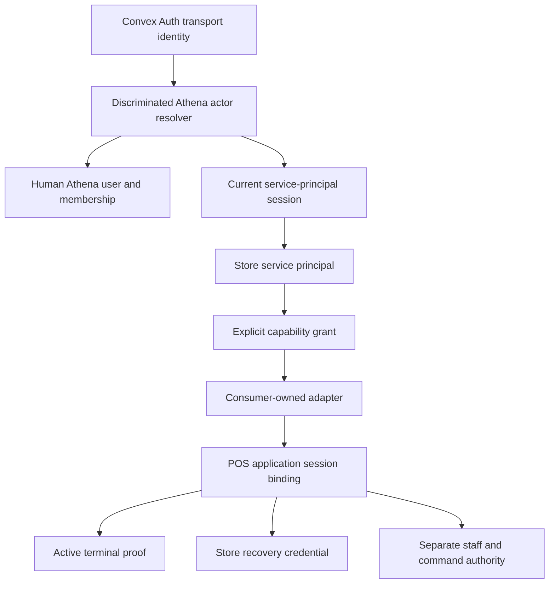
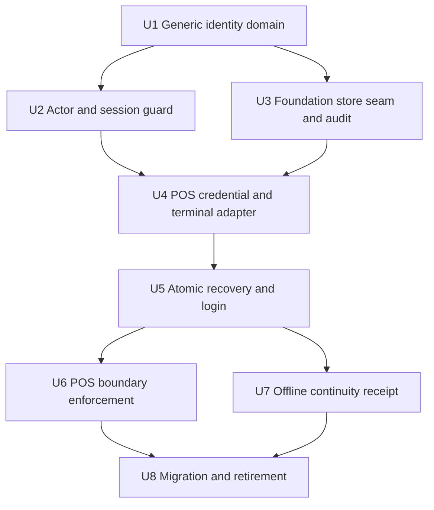
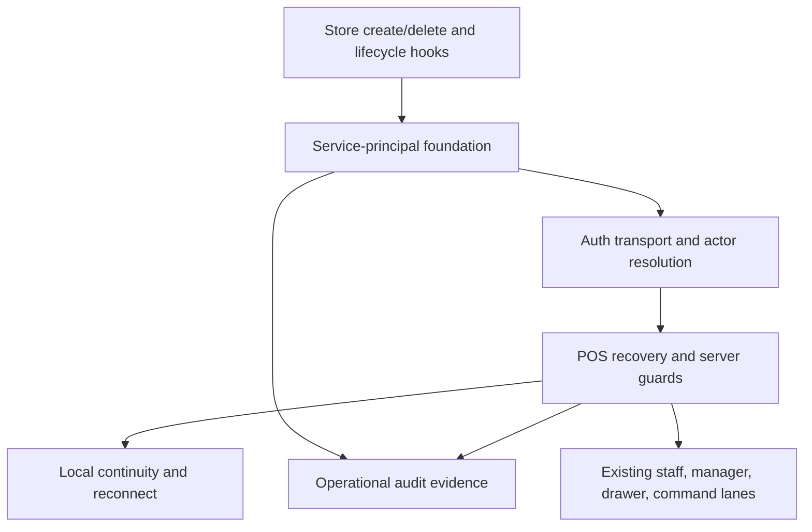

# feat: Establish store service principals with POS as the first consumer

## Summary

Create an Athena-owned, store-scoped identity foundation for non-human systems, then migrate POS onto it as the first consumer. The implementation separates durable principal identity, explicit capability grants, authentication transport, consumer sessions, credentials, and terminal proof; derives POS store scope from an already-enrolled terminal; and replaces the global `pos@wigclub.store` account through a reversible store-by-store cutover.

---

## Problem Frame

The current recovery credential is store-scoped, but every store authenticates as one synthetic human account and proves terminal possession only after login. That sequence cannot establish a single store-bound application actor or make principal, capability, credential, terminal, and session revocation authoritative at every POS boundary.

---

## Assumptions

*These are plan-time technical choices made from current repository evidence and should receive explicit review before implementation.*

- The first delivery keeps the current high-entropy terminal sync secret as bearer proof so existing terminals can migrate without forced re-enrollment. It is never described as unclonable; asymmetric WebCrypto challenge-response is deferred as a separate hardening project.
- The foundation integrates with current store create/delete behavior and exposes an idempotent lifecycle hook for future disable/archive/restore transitions. This delivery does not add user-facing store lifecycle states or imply broader effects on human access, sales, inventory, or reporting.
- POS session continuation may use fresh terminal proof within a bounded absolute session lifetime. Recovery-code entry is required for a new session after that lifetime, explicit sign-out, credential rotation/revocation, proof loss, or migration cutover. Exact timeout values remain configuration decisions during implementation.

---

## Requirements

- R1. Represent service principals as first-class non-human identities, never as `athenaUser` or `organizationMember` records.
- R2. Bind every principal, grant, binding, and session to exactly one server-owned organization/store scope.
- R3. Grant authority through explicit closed-catalog capabilities; unknown, absent, duplicate, or revoked authority fails closed.
- R4. Keep the foundation consumer-neutral so each consumer owns its credentials, proof, and session context; POS is only the first adapter.
- R5. Audit principal, capability, binding, and session lifecycle separately from human, terminal, credential, staff, manager, drawer, and command evidence.
- R6. Integrate service-principal reconciliation/decommissioning with current store create/delete behavior and provide an idempotent boundary that any available or future store lifecycle transition must call, without inventing broader store lifecycle semantics.
- R7. Reconcile exactly one active POS-capable principal per active store and remove the shared POS account after verified migration.
- R8. Restrict new terminal enrollment, cross-store reassignment, proof-loss recovery, and revoked-terminal reactivation to normally authenticated full administrators.
- R9. Keep terminal enrollment separate from POS recovery and bind an active terminal to exactly one store.
- R10. Derive POS recovery organization/store scope from the terminal record, treating URL, route, and local seed values as presentation or consistency inputs only.
- R11. Validate principal, POS capability, recovery credential, active terminal proof, and current store/lifecycle state in one recovery transaction before issuing pending authority; create transport/session bindings only through the subsequent authenticated activation.
- R12. Prevent fresh, revoked, missing-proof, or cross-store browsers from recovering POS with a valid credential alone.
- R13. Return one generic unauthenticated failure contract while retaining redacted internal denial evidence. Only a terminal ID plus matching last stored proof for that same revoked terminal may return a non-authorizing administrator-reconnect disposition and opaque intent; every other denial remains generic.
- R14. Remove the synthetic POS account field and show operational store/terminal identity, including `Sign in to {terminalName}` on provisioned terminals.
- R15. Keep application, terminal, staff, manager, drawer, register-session, and command authority independently enforceable.
- R16. Permit only bounded offline continuity derived from a previous online validation; never enroll, recover, refresh server authority, or switch stores offline.
- R17. Revalidate mutable server state on every protected server boundary so principal, grant, credential, terminal, store, or session revocation blocks subsequent use. Terminal revocation must be terminal-scoped, preserve the same terminal identity and queued local evidence, honor only the remainder of an already-issued offline lease, and lead to a same-browser, same-store full-administrator reconnection path that rotates proof and requires fresh POS recovery. Recovery-code entry, old proof, or a remote action alone cannot bypass that path.
- R18. Preserve safe credential verifiers and terminal records, require terminal-specific recovery evidence, cut over by store without implicit fallback, and retire legacy authority only after census gates pass.

**Origin actors:** A1 full administrator; A2 POS operator; A3 store service principal; A4 registered POS terminal; A5 future store-owned system.

**Origin flows:** F1 service-principal lifecycle; F2 full-admin terminal enrollment; F3 store-and-terminal POS recovery; F4 revocation and migration.

**Origin acceptance examples:** AE1 cross-store credential denial; AE2 fresh-browser denial; AE3 enrollment remains separate from recovery; AE4 terminal revocation; AE5 explicit POS capability; AE6 operational login identity; AE7 separate staff/manager authority; AE8 no fresh offline session; AE9 one recovery after migration.

---

## Scope Boundaries

- Deliver the generic foundation and POS adapter, not a second consumer solely to demonstrate extensibility.
- Do not introduce POS vocabulary or terminal/recovery-code fields into foundation schemas or modules.
- Do not support cross-store, organization-wide, third-party, OAuth-client, or public API-key principals.
- Do not add recovery-code-only, QR, one-time-code, or existing-terminal-assisted terminal enrollment.
- Do not redesign staff PINs, manager approval, drawer lifecycle, register sessions, command policy, or shared-demo admission.
- Do not treat route slugs, local storage, terminal display data, or token claims as current authorization state.
- Do not include the unrelated `packages/storefront-webapp/vite.config.ts` change already present in the worktree.

### Deferred to Follow-Up Work

- Asymmetric terminal challenge-response with a non-extractable browser key, replay-resistant nonce, and CSP/XSS hardening: follow-up security plan after the store-principal cutover is stable.
- A second service-principal consumer and any consumer self-service management UI: future consumer-specific work.
- Hardware/platform attestation, public developer identity, OAuth, client credentials, and API-key management: separate platform initiatives.

---

## Context & Research

### Relevant Code and Patterns

- Human auth currently flows through `packages/athena-webapp/convex/auth.ts`, `packages/athena-webapp/convex/lib/athenaUserAuth.ts`, and `packages/athena-webapp/convex/lib/storeMemberAccess.ts`; these assume email-backed `athenaUser` plus organization membership and must remain a distinct actor lane.
- Shared Demo supplies a useful server-derived/default-deny policy shape in `packages/athena-webapp/convex/sharedDemo/actor.ts`, `packages/athena-webapp/convex/sharedDemo/policy.ts`, and `packages/athena-webapp/convex/sharedDemo/capabilityCatalog.ts`, but its synthetic-human persistence is not reusable for the foundation.
- POS recovery is split across `packages/athena-webapp/convex/auth/PosRecoveryCode.ts`, `packages/athena-webapp/convex/pos/public/posRecoveryCodes.ts`, and `packages/athena-webapp/convex/pos/public/terminalAppSessions.ts`; today it accepts email/client store context before terminal proof and maps through the global account.
- Terminal enrollment in `packages/athena-webapp/convex/pos/public/terminals.ts` currently permits `full_admin` and `pos_only`, while `packages/athena-webapp/src/lib/pos/presentation/register/useRegisterViewModel.ts` also uses registration for automatic repair. New enrollment, valid-proof rotation, and proof-loss recovery must become separate transitions.
- `packages/athena-webapp/convex/schemas/pos/posRecoveryCredential.ts` persists `plaintextCode`, and `packages/athena-webapp/src/components/pos/settings/POSSettingsView.tsx` exposes it after creation. The legacy low-entropy SHA verifier is offline-crackable; migration must use plaintext once to derive the new deployment-keyed slow verifier, then remove plaintext and implement real throttling/lock behavior.
- Store creation/removal lives in `packages/athena-webapp/convex/inventory/stores.ts`, but `packages/athena-webapp/convex/schemas/inventory/store.ts` has no operational lifecycle. Store Settings already owns destructive management in `packages/athena-webapp/src/settings/store/StoreSettingsView.tsx`.
- The bounded, idempotent preview/apply/cursor/audit pattern in `packages/athena-webapp/convex/migrations/backfillAthenaUserNormalizedEmail.ts` is the migration precedent.

### Institutional Learnings

- `docs/solutions/architecture-patterns/shared-demo-principal-policy-and-restore-boundary-2026-07-12.md` establishes server-derived scope, a closed capability catalog, and fail-closed authorization at the real boundary.
- `docs/solutions/architecture/athena-pos-recovery-code-login-2026-06-03.md` and `docs/solutions/architecture/athena-pos-local-staff-authority-2026-05-14.md` establish that app recovery, terminal proof, staff proof, manager proof, drawer authority, and command authority are independent lanes.
- `docs/solutions/architecture/athena-pos-offline-sales-continuity-2026-06-04.md` permits local sale continuity after previous validation but never fresh offline authority.
- `docs/solutions/security-issues/pos-public-surface-authz-and-rejected-sale-loss-2026-07-15.md` requires authorization at each resource-owning store boundary; import presence or a single login check is not sufficient coverage.

### External References

- [Convex authentication and authorization](https://docs.convex.dev/auth/overview) and [auth in functions](https://docs.convex.dev/auth/functions-auth): authentication establishes transport identity; application code must authorize each public function.
- [RFC 9700](https://datatracker.ietf.org/doc/html/rfc9700) and [RFC 8725](https://datatracker.ietf.org/doc/html/rfc8725): use minimum privilege, audience/type separation, and mutually exclusive validation paths for human and machine identity.
- [RFC 6749](https://datatracker.ietf.org/doc/html/rfc6749): a browser is a public client, so no shared client secret should be embedded as the principal credential.
- [NIST SP 800-63B-4](https://pages.nist.gov/800-63-4/sp800-63b.html) and [OWASP Authentication guidance](https://cheatsheetseries.owasp.org/cheatsheets/Authentication_Cheat_Sheet.html): bound session lifetime, throttle limited-entropy secrets, and prevent enumeration through messages, categories, and observable paths.
- [RFC 7009](https://datatracker.ietf.org/doc/html/rfc7009): revocation should cascade to renewable authority; Athena's durable guard closes the gap left by still-valid bearer tokens.

---

## Key Technical Decisions

| Decision | Chosen approach | Rejected approach |
|---|---|---|
| Domain authority | Athena tables own principal, grant, auth binding, and service session state; Convex Auth supplies transport identity only. | Token claims or an Auth `users` row as durable authorization truth. |
| Human/machine separation | Resolve a discriminated actor and keep human-only and service-only guards mutually exclusive. | Add service principals to `organizationMember` or synthesize an `athenaUser`. |
| Consumer boundary | Generic modules store opaque namespaced capability IDs and expose default-deny matching; each consumer owns its closed declaration catalog and internal grant/reconcile entry points. POS alone declares `pos.application`, terminal, recovery credential, and POS session binding. | A foundation catalog containing POS vocabulary or a `posServicePrincipal` foundation future consumers must inherit. |
| Recovery scope | Load terminal by ID/proof and derive organization/store/principal server-side in one mutation. | Client-selected store/email followed by a later terminal check. |
| Runtime revocation | Every POS-capable server boundary reloads current session, principal, store, grant, current credential status/revision, and POS terminal binding. Revision comparison invalidates derived sessions without enumerating them. | Trust login-time claims or the five-minute route assertion as authorization. |
| Store lifecycle | Reconcile on create, decommission before current hard delete, and expose an idempotent foundation lifecycle hook for any future disable/archive/restore feature. | Invent ambiguous user-facing store states inside identity work or leave deletion able to orphan authority. |
| Terminal proof | Retain and rotate the existing bearer proof during this migration, with exact same-store validation and full-admin proof-loss recovery. | Expand this delivery into WebCrypto key management or let a recovery code enroll a browser. |
| Migration fallback | Explicit per-store compatibility mode before cutover; once a store is enforced, revocation/error never falls back to the global account. | A permanent `legacy OR service principal` authorization predicate. |

Identity record cardinality is explicit:

- `servicePrincipalAuthBinding` is an immutable mapping from one stable, dedicated non-human transport Auth user to one principal. The transport user is never rebound to another principal, store, or organization.
- `servicePrincipalSession` is one revocable issued application session bound to the exact Convex Auth session ID returned by `getAuthSessionId`, plus one consumer. Concurrent Auth sessions on the same transport user are therefore distinct and an old token cannot inherit a newer application session.
- `posApplicationSessionBinding` is the consumer record with at most one current binding per `(servicePrincipalId, terminalId, consumerId)` lineage; different terminals may be current concurrently.
- There is no separate store-level “binding policy” row. Principal lifecycle plus the consumer-owned capability grant and credential decide whether a pending exchange may be issued.

---

## Open Questions

### Resolved During Planning

- **How does Convex Auth fit?** It is a transport adapter with a two-phase handoff that uses the supported credentials-provider `{ userId, sessionId }` return contract. Before issuance, Athena writes one versioned browser handoff journal containing only `activeNamespace`, a cryptographically unique empty `pendingNamespace`, phase, a client-generated non-secret recovery correlation key, owner token, and timestamps—never a recovery credential, terminal proof, nonce, JWT, refresh token, or server document ID. The correlation key has a unique server index and makes preparation idempotent; it never authorizes a retry or abort. Machine recovery runs through an isolated unauthenticated Auth client using `pendingNamespace`. In one internal mutation, the credentials provider atomically validates terminal proof, a freshly supplied recovery code, principal, grant, and lifecycle; creates or reuses the principal's stable transport user/binding; inserts a new `authSessions` row with a server-derived configured expiry; and writes a short-lived recovery exchange already bound to that exact Auth session ID and correlation key. The provider returns both IDs, so Convex Auth issues tokens for the supplied session without calling `createNewAndDeleteExistingSession` or deleting the predecessor. The provider rejects any attached Auth session as a fail-safe. If preparation commits but token generation/response is lost, a journal-only retry is denied: the operator must resubmit the recovery code and current terminal proof, every current authority lane is revalidated, and only then may the provider idempotently return the same prepared pair for that correlation key. Abort phase is server-derived, never trusted from the journal: the mutation reads `authRefreshTokens` through its `sessionId` index for the prepared session. With no refresh row, abort requires the same current terminal ID/proof plus correlation scope, is rate-limited/audited outside the shared credential counter, and atomically expires only an unactivated same-store exchange/session. If any refresh row exists, abort requires the exact authenticated prepared session plus terminal scope. Without the required proof the browser may only abandon locally and wait for expiry. Activation and abort share the exchange row so one transaction wins; neither path revokes the predecessor, and an activated exchange cannot be aborted. The issuance race is fail-closed: the abort transaction's indexed no-refresh read conflicts if `auth:store` concurrently inserts in that range and retries against the issued state; if abort commits first and `auth:store` later inserts without validating the deleted/expired session, the JWT cannot activate or pass any service guard, and bounded cleanup deletes orphan refresh rows/session artifacts by prepared session ID. The browser records `auth_issued` only after tokens demonstrably exist in pending storage. From that point, Phase B needs no recovery code or browser-held claim secret: the isolated authenticated client resolves its exact user/session pair and can activate only the exchange already bound to that pair. Activation creates the service/POS binding, invalidates only the predecessor application lineage, and retains the immutable result for same-session retries. The browser then records `activated`, atomically promotes `activeNamespace = pendingNamespace`, and remounts the root `ConvexAuthProvider`. On restart, an `auth_issued` journal loads the pending namespace and retries Phase B; a response-lost commit returns the retained result. A promoted journal mounts the new namespace directly even if the earlier remount never ran. Only after the remounted provider proves the expected exact session server-side may Athena remove the predecessor namespace and clear pending fields. Ambiguous network, storage, crash, or remount failures never delete pending tokens; only confirmed unactivated expiry or an authorized abort that first invalidates the prepared Auth session may clean them. Browser handoffs serialize under `navigator.locks`; tabs observing a foreign live owner through the journal/storage event enter a fail-closed handoff-pending state, and stale-owner takeover requires version/lease validation. The journal is routing metadata, never authority; every retry still passes exact server-side session/principal/grant/store/terminal validation. No private token API or same-window storage event is required, and the isolated client is disposed after verified promotion. The transport user is immutable to the principal, each Auth session has its own application-session row, the predecessor remains usable until activation commits, and every guard reloads Athena state.
- **How does store lifecycle integrate?** Current create/delete orchestration calls idempotent reconcile/decommission helpers, and a missing/deleted store always fails guards. Future disable/archive/restore work must call the same foundation boundary, but this plan does not define those product-wide states.
- **How does a current terminal repair itself?** Rotating proof is allowed only when the current proof authenticates the same active terminal. Missing proof, revoked/lost status, a new browser, or a cross-store collision requires full-admin enrollment/reassignment.
- **How does recovery remain generic?** All unauthenticated denial lanes return one normalized error code/message/category; exact internal reason and correlation ID are recorded in protected, secret-free audit evidence.
- **What must happen after store cutover?** The store can never silently use the global account again. Rollback is an explicit compatibility-state transition available only before the global-retirement gate.

### Deferred to Implementation

- Exact idle, absolute, and offline-validation lifetimes: choose centrally configured values against current POS operating windows and cover their boundary behavior; do not scatter magic numbers.
- Exact batched retention/cleanup windows for expired pending exchanges and historical Auth/application sessions; activated exchanges and their immutable retry result must be retained beyond the maximum client retry window, and cleanup cannot participate in or weaken the current-authority decision. Stable principal transport users and their binding tombstones remain retained after principal decommissioning; no cleanup path may free either unique side for reassignment.

---

## High-Level Technical Design

*This illustrates the intended approach and is directional guidance for review, not implementation specification. The implementing agent should treat it as context, not code to reproduce.*



POS recovery state transition:

```text
full-admin enrollment -> active terminal proof -> recovery attempt
  -> derive store from terminal
  -> atomically validate store + principal + POS grant + credential
  -> issue service session + POS binding + local validation receipt
  -> require separate staff proof

terminal revoke confirmed -> name store/terminal + explain online/offline effects
  -> only that terminal's binding is revoked; sibling terminals remain active
online/reconnect -> next server-backed guard denies -> reconnect-denied shell
offline -> no fresh authority; prior receipt permits bounded local continuity only
lease expiry -> stop new local work; keep queued local records
reconnect -> revalidate before upload or other server-backed work; denial keeps queue intact
proof-gated disposition -> opaque reconnect intent -> full-admin email sign-in
  -> same-browser current-terminal panel -> patch same terminal row + rotate proof
  -> Continue to POS sign-in -> POS recovery -> classified idempotent sync
```

---

## Output Structure

```text
packages/athena-webapp/convex/
├── schemas/servicePrincipals/
│   ├── servicePrincipal.ts
│   ├── servicePrincipalCapability.ts
│   ├── servicePrincipalAuthBinding.ts
│   └── servicePrincipalSession.ts
├── servicePrincipals/
│   ├── actor.ts
│   ├── authorization.ts
│   ├── capabilities.ts
│   └── lifecycle.ts
└── pos/application/
    ├── posApplicationAuthority.ts
    ├── posApplicationSessionBinding.ts
    ├── posRecoveryExchange.ts
    └── posServicePrincipal.ts
```

The tree communicates ownership, not exact final filenames. Foundation modules must not import from `pos/`.

---

## Implementation Units



### Phase 1 — Generic foundation

- U1. **Create the consumer-neutral store service-principal domain**

**Goal:** Add first-class non-human principals, explicit grants, transport bindings, and service sessions without any POS dependency or synthetic human records.

**Requirements:** R1-R4; A3, A5; F1.

**Dependencies:** None.

**Files:**
- Create: `packages/athena-webapp/convex/schemas/servicePrincipals/servicePrincipal.ts`
- Create: `packages/athena-webapp/convex/schemas/servicePrincipals/servicePrincipalCapability.ts`
- Create: `packages/athena-webapp/convex/schemas/servicePrincipals/servicePrincipalAuthBinding.ts`
- Create: `packages/athena-webapp/convex/schemas/servicePrincipals/servicePrincipalSession.ts`
- Create: `packages/athena-webapp/convex/servicePrincipals/capabilities.ts`
- Create: `packages/athena-webapp/convex/servicePrincipals/lifecycle.ts`
- Modify: `packages/athena-webapp/convex/schema.ts`
- Test: `packages/athena-webapp/convex/servicePrincipals/lifecycle.test.ts`
- Test: `packages/athena-webapp/convex/servicePrincipals/capabilities.test.ts`

**Approach:** Model organization/store ownership as immutable server-derived references. Persist grants, immutable principal-to-Auth-user bindings, and exact Auth-session application sessions separately. Characterization on `@convex-dev/auth` 0.0.71 proved that `getAuthSessionId` exposes the exact Convex Auth session ID from the same JWT subject as `getAuthUserId`. The corrected topology therefore uses one stable dedicated non-human transport user per principal and binds every service session to its exact Auth session ID; concurrent sessions remain distinct and an old token cannot resolve a later application session. `servicePrincipalAuthBinding` has immutable principal, Auth user, organization, and store fields; unique lookups in both directions; and a separate `active | decommissioned` lifecycle with revision/timestamp. Decommissioned bindings remain tombstoned and can never be reassigned or reused. Service sessions carry consumer, lifecycle/capability revisions, issued/idle/absolute expiry, and status, and authorize only through a unique exact-Auth-session lookup after verifying `authSessions.userId` matches the immutable binding. Foundation code treats capability IDs as opaque namespaced values and performs exact default-deny matching; consumer adapters own their closed declaration catalogs and internal grant/reconcile calls. Enforce stable principal keys and fail closed on zero/multiple active authority. Add a dependency sensor proving foundation modules never import POS. A principal's existence grants nothing.

**Execution note:** Characterization is complete: exact Auth session identity is available and covered by `convex/auth/sessionTransport.test.ts`. Implement the corrected stable-user/exact-session topology test-first, including concurrent reconciliation and proof that two Auth sessions on one transport user cannot resolve each other's application session.

**Patterns to follow:** `packages/athena-webapp/convex/sharedDemo/capabilityCatalog.ts`; `packages/athena-webapp/convex/migrations/backfillAthenaUserNormalizedEmail.ts` for idempotent reconciliation.

**Test scenarios:**
- Covers F1 / R1-R3. Concurrent principal reconciliation for one store/stable key produces exactly one principal and no implicit grants.
- Concurrent calls to the generic grant primitive with a neutral namespaced fixture deduplicate only the explicitly requested grant.
- An active principal without a neutral namespaced fixture capability fails foundation capability resolution; an unknown capability name fails closed. The POS-specific AE5 case belongs to U4.
- Store A principal, grant, binding, or session cannot be resolved with Store B scope.
- The principal-to-Auth-user transport binding is immutable and unique in both directions, never rebound to another principal, and remains a non-reusable tombstone after decommissioning. Every application-session row is unique by exact Auth session ID, verifies the backing Auth session belongs to the bound Auth user, is never rebound, and cannot resolve when expired, revoked, or associated with the wrong lineage.
- Batched historical-session/exchange cleanup never deletes a decommissioned Auth user or binding tombstone, and reconciliation/migration cannot reassign or recreate either unique side for another store or principal.
- Disabled/revoked/expired rows never fall through to another actor or an older revision.
- A structural import test proves `servicePrincipals/` and its schemas contain no POS dependency.

**Verification:** The generic domain can create, resolve, grant, revoke, and expire store-scoped non-human authority without creating an `athenaUser`, membership, terminal, or recovery credential.

- U2. **Add mutually exclusive human and service-principal actor resolution**

**Goal:** Let authenticated server code distinguish human, shared-demo, and service-principal transport identities without allowing one lane to inherit another lane's privileges.

**Requirements:** R1-R5, R17; A1, A3, A5; F1, F4.

**Dependencies:** U1.

**Files:**
- Create: `packages/athena-webapp/convex/servicePrincipals/actor.ts`
- Create: `packages/athena-webapp/convex/servicePrincipals/authorization.ts`
- Create: `packages/athena-webapp/convex/lib/authenticatedActor.ts`
- Modify: `packages/athena-webapp/convex/lib/athenaUserAuth.ts`
- Modify: `packages/athena-webapp/convex/lib/storeMemberAccess.ts`
- Test: `packages/athena-webapp/convex/servicePrincipals/actor.test.ts`
- Test: `packages/athena-webapp/convex/servicePrincipals/authorization.test.ts`
- Test: `packages/athena-webapp/convex/lib/storeMemberAccess.test.ts`

**Approach:** Resolve server identity to one discriminated actor kind. Human helpers continue requiring `athenaUser` plus membership; service helpers require current service session, principal, store, and explicit capability; shared-demo keeps its own policy. If a service binding exists but is invalid, fail as service identity rather than falling through to email/human resolution. Authorization reloads mutable rows instead of trusting login-time claims.

**Test scenarios:**
- Human tokens cannot enter service-principal guards; service tokens cannot enter human membership or full-admin guards.
- Missing/revoked service bindings fail closed and do not create `athenaUser` or membership rows.
- A valid service token is denied on a non-consumer human route.
- Existing human and shared-demo characterization tests remain unchanged.

**Verification:** Every authenticated identity takes exactly one server-owned actor path, and a service identity can authorize only through the explicit service guard.

- U3. **Integrate service-principal lifecycle and audit with store operations**

**Goal:** Provision/reconcile authority on store creation, decommission it before current store deletion, expose an idempotent hook for future lifecycle transitions, and preserve distinct lifecycle evidence.

**Requirements:** R2, R5-R7, R17; A1, A3; F1, F4.

**Dependencies:** U1, U2.

**Files:**
- Modify: `packages/athena-webapp/convex/inventory/stores.ts`
- Modify: `packages/athena-webapp/convex/schemas/operations/operationalEvent.ts`
- Modify: `packages/athena-webapp/convex/operations/operationalEvents.ts`
- Test: `packages/athena-webapp/convex/inventory/stores.test.ts`
- Test: `packages/athena-webapp/convex/operations/operationalEvents.test.ts`

**Approach:** Store creation first requires a normally authenticated same-organization full administrator, then calls only the generic foundation reconcile seam in this unit; denial or reconciliation failure leaves no store/principal/audit partial state. Current hard delete advances the bounded principal lifecycle revision, marks any stable Auth binding decommissioned without deleting or freeing it for reuse, and writes redacted audit evidence before removing the store. Guards reject every service session and consumer binding through binding/principal lifecycle revision mismatch or missing-store checks rather than scanning or revoking one singular session. Historical-session cleanup is separate and batched. Expose the same idempotent contract for a future store lifecycle feature without adding ambiguous `disabled`/`archived` UI or changing human access. U4 adds the POS consumer orchestration once that adapter exists. Extend operational events with an explicit service-principal actor/reference lane rather than a synthetic human ID.

**Test scenarios:**
- Covers F1 / R6. Store creation reconciles its canonical principal; hard delete decommissions current service authority before removing the store.
- Repeated create/reconcile and decommission calls are idempotent; foundation reconciliation does not restore any individually revoked consumer grant.
- Wrong-org, service, shared-demo, and unauthenticated actors cannot invoke current destructive store operations.
- Unauthenticated, wrong-organization, `pos_only`, service, and shared-demo actors cannot create a store or any associated foundation record; full-admin creation commits the store and reconciliation atomically.
- Store A deletion does not affect Store B.
- Decommission remains bounded with many historical sessions; revision mismatch and missing-store checks block them without a session scan.
- Audit events distinguish human administrator, service-principal lifecycle, consumer, and terminal lanes and contain no secret material.

**Verification:** Current store create/delete behavior cannot orphan active service authority, the reusable lifecycle hook is explicit, and operators retain attributable, redacted evidence without a new store-status product surface.

### Phase 2 — POS consumer adapter

- U4. **Bind POS credentials and full-admin terminal enrollment, revocation, and reactivation to the foundation**

**Goal:** Make POS a consumer-owned adapter, remove synthetic-account ownership, harden recovery credential storage, and enforce full-admin terminal enrollment, revocation, and reactivation.

**Requirements:** R4, R7-R9, R13, R15, R17; A1, A3, A4; F2, F4; AE2-AE5.

**Dependencies:** U2, U3.

**Files:**
- Create: `packages/athena-webapp/convex/pos/application/posServicePrincipal.ts`
- Create: `packages/athena-webapp/convex/schemas/pos/posApplicationSessionBinding.ts`
- Create: `packages/athena-webapp/convex/schemas/pos/posRecoveryExchange.ts`
- Create: `packages/athena-webapp/convex/schemas/pos/posTerminalReconnectIntent.ts`
- Modify: `packages/athena-webapp/convex/schema.ts`
- Modify: `packages/athena-webapp/convex/inventory/stores.ts`
- Modify: `packages/athena-webapp/convex/schemas/pos/posRecoveryCredential.ts`
- Modify: `packages/athena-webapp/convex/schemas/pos/posTerminal.ts`
- Modify: `packages/athena-webapp/convex/pos/public/posRecoveryCodes.ts`
- Modify: `packages/athena-webapp/convex/pos/public/terminals.ts`
- Modify: `packages/athena-webapp/src/lib/pos/application/registerAndProvisionPosTerminal.ts`
- Modify: `packages/athena-webapp/src/lib/pos/presentation/register/useRegisterViewModel.ts`
- Modify: `packages/athena-webapp/src/components/pos/settings/POSSettingsView.tsx`
- Modify: `packages/athena-webapp/src/components/pos/terminals/POSTerminalDetailView.tsx`
- Test: `packages/athena-webapp/convex/pos/public/posRecoveryCodes.test.ts`
- Test: `packages/athena-webapp/convex/pos/public/terminals.test.ts`
- Test: `packages/athena-webapp/convex/pos/application/terminals.test.ts`
- Test: `packages/athena-webapp/src/components/pos/settings/POSSettingsView.test.tsx`
- Test: `packages/athena-webapp/src/components/pos/terminals/POSTerminalDetailView.test.tsx`
- Test: create a focused test beside `packages/athena-webapp/src/lib/pos/application/registerAndProvisionPosTerminal.ts`

**Approach:** POS declares `pos.application` in its consumer-owned closed catalog and exposes same-store full-admin enable/revoke transitions with expected revision and audit; generic grant primitives remain internal. Store creation orchestration invokes POS reconciliation without making the foundation import POS. Reference `servicePrincipalId` from the credential and introduce a versioned, deployment-keyed slow verifier using a server-held pepper, per-credential salt, and a calibrated WebCrypto-supported KDF. During widening, use currently persisted plaintext exactly once to derive the new verifier and then remove plaintext; a missing or invalid plaintext value requires full-admin rotation before cutover. A legacy SHA-only verifier can never authorize an enforced store. Pepper versions support overlap/rotation without exposing key material in tables, logs, or clients. Credential create/rotate enters a reveal-once state: name the store, explain the code cannot be shown again, offer copy with announced success/failure, warn that rotation invalidates the prior code, and require explicit acknowledgment before completion. Define loading, mutation failure, close/Escape, locked, revoked, and no-credential states without re-fetching plaintext. Validate active terminal proof before reading or mutating the shared credential failure counter; invalid terminal proof uses a separate bounded denial lane plus fixed-cost normalization and cannot lock the store credential. Restrict enroll/reassign/reactivate to human full admins. Allow proof rotation only with valid current same-terminal proof; proof loss or cross-store collision requires full-admin action. Enforce one active store per browser fingerprint/reassignment transition. Revoking a terminal advances only that terminal's lifecycle/binding revision, never the store principal, `pos.application` grant, shared recovery credential, or sibling-terminal bindings. Ordinary reactivation must patch the same `posTerminal` row: preserve cloud terminal ID, store binding, local seed, local event IDs, ledger order, and sync cursor; advance the terminal lifecycle revision; invalidate old proofs and bindings; and issue fresh proof only to the affected browser after same-store full-admin authorization. It must not create a replacement terminal row. Remote Terminal Detail may disconnect and inspect a terminal but cannot deliver replacement proof. After enrollment or same-browser reactivation, show store/terminal confirmation with primary `Continue to POS sign-in` (ends the human session and opens terminal-derived recovery) and secondary `Stay in settings`; failure to sign out preserves an explicit retry state rather than blending actor lanes.

**Operator interaction:** POS Settings owns a `POS application access` section that shows enabled/revoked state and full-admin enable/revoke actions with loading, success, failure, disabled, and re-enable states. Capability revoke and credential rotate/revoke confirmations name the store and explain that active online registers lose server authority and require POS recovery; disconnected registers can continue only within their existing signed validation lease and are checked on reconnect. An individual terminal-revoke confirmation names the terminal and store and states that online server access stops on its next request, an offline register may continue only until its current validation lease expires, unsynchronized records stay on that checkout station, and other checkout stations are unaffected. Its destructive action is `Disconnect checkout station`; cancel/Escape leaves authority unchanged and restores focus. The reveal-once surface repeats the relevant consequence after credential rotation.

**Test scenarios:**
- Covers AE2. A fresh browser plus valid code cannot enroll or recover.
- Covers AE3. Full-admin enrollment persists Store A terminal proof but still leaves POS recovery required.
- `pos_only`, service-principal, shared-demo, wrong-org, and unauthenticated actors cannot enroll/reassign/reactivate.
- An active fingerprint bound to Store A cannot enroll to Store B without explicit full-admin reassignment that invalidates Store A proof.
- Existing valid proof may rotate only for the same active terminal; lost/revoked/wrong-store proof cannot self-repair.
- Covers AE4. Confirming `Disconnect checkout station` revokes only the named same-store terminal; cancellation changes nothing, sibling terminals remain active, and the confirmation communicates next-request denial, bounded offline continuation, and preservation of unsynchronized records.
- A revoked terminal cannot reactivate with its old proof or a valid recovery code; same-store full-admin reactivation on the affected browser updates the existing terminal row, rotates proof and authority revision, requires a new POS recovery, and preserves its terminal ID, local seed, event IDs, ledger order, and cursor.
- Remote Terminal Detail cannot return replacement proof. Wrong-role, wrong-organization, expired/replayed-intent, and different-browser attempts change no terminal state and show that a full administrator for the store must reconnect the checkout station on that station.
- Root schema registration exposes the POS session-binding, recovery-exchange, and reconnect-intent tables with the unique lookup and expiry/status indexes required by their lineage, replay, and cleanup invariants.
- Credential create/rotate returns plaintext once; status and database rows expose only versioned verifier metadata.
- Enforced stores accept only the keyed slow verifier; verifier rows alone cannot validate guesses, pepper rotation is versioned, and missing legacy plaintext forces full-admin rotation.
- Reveal-once UI covers copy success/failure, explicit acknowledgment, close/Escape, rotation warning, locked/revoked/no-credential, and mutation failure without redisplaying plaintext later.
- Enrollment and credential dialogs use semantic forms/dialogs, safe initial and return focus, keyboard operation, announced copy/mutation results, disabled/loading semantics, and single-column narrow-screen layout with operator-sized targets.
- Repeated invalid attempts lock/throttle the store credential lane without permitting cross-store enumeration.
- Terminal-ID/proof spraying cannot mutate the shared credential lock state; repeated bad codes from a proven terminal do trigger the configured throttle.
- Full-admin POS capability enable/revoke succeeds only for the same store and expected revision; every other actor lane is denied.
- POS application-access controls show current state; rotate/revoke confirmations explain live and offline-register consequences, require confirmation, preserve focus, announce results, and render success/failure/re-enable transitions.
- Creating a store, or invoking the explicit lifecycle reconcile hook after U4 exists, reconciles exactly one canonical principal and POS grant without a foundation-to-POS import. Store reconciliation alone does not create an Auth binding; migration may pre-provision it, and ordinary recovery idempotently creates or reuses exactly one stable binding before writing the first exchange.
- Covers AE3. Enrollment confirmation names store/terminal; continuing signs out the admin before terminal-derived recovery, staying returns to settings, and sign-out failure never opens POS.

**Verification:** POS owns credential and terminal policy on top of a generic principal/grant; no registration path depends on the shared POS account or recovery code alone.

- U5. **Make POS recovery atomic and split machine login from human sync**

**Goal:** Exchange terminal proof plus the store credential for a revocable POS application session without email or client-selected authority.

**Requirements:** R10-R15, R17; A2-A4; F3, F4; AE1, AE4-AE7.

**Dependencies:** U2, U4.

**Files:**
- Modify: `packages/athena-webapp/convex/auth/PosRecoveryCode.ts`
- Modify: `packages/athena-webapp/convex/auth.ts`
- Modify: `packages/athena-webapp/convex/pos/public/posRecoveryCodes.ts`
- Modify: `packages/athena-webapp/convex/pos/public/terminalAppSessions.ts`
- Modify: `packages/athena-webapp/src/App.tsx`
- Create: `packages/athena-webapp/src/lib/auth/authRuntimeHandoff.ts`
- Modify: `packages/athena-webapp/src/routes/login/-login-layout.tsx`
- Modify: `packages/athena-webapp/src/hooks/useAuth.ts`
- Modify: `packages/athena-webapp/src/components/auth/Login/LoginForm.tsx`
- Modify: `packages/athena-webapp/src/components/auth/Login/index.tsx`
- Modify: `packages/athena-webapp/src/components/auth/Login/PosRecoveryCodeForm.tsx`
- Modify: `packages/athena-webapp/src/routes/-authed-layout.tsx`
- Test: `packages/athena-webapp/convex/auth/PosRecoveryCode.test.ts`
- Test: `packages/athena-webapp/convex/pos/public/terminalAppSessions.test.ts`
- Test: `packages/athena-webapp/src/App.test.tsx`
- Test: `packages/athena-webapp/src/lib/auth/authRuntimeHandoff.test.ts`
- Test: `packages/athena-webapp/src/components/auth/Login/index.test.tsx`
- Test: `packages/athena-webapp/src/components/auth/Login/PosRecoveryCodeForm.test.tsx`
- Test: `packages/athena-webapp/src/routes/login/_layout.test.tsx`
- Test: `packages/athena-webapp/src/hooks/useAuth.test.tsx`
- Test: `packages/athena-webapp/src/routes/_authed.test.tsx`

**Approach:** Replace email/store input with recovery code plus terminal ID/proof. Before submission, the browser persists the non-secret versioned handoff journal with a client-generated correlation key. The credentials provider calls one internal mutation that atomically loads terminal, derives store/org, requires exactly one active POS-capable principal and POS grant, verifies the freshly supplied credential, creates or reuses the principal's stable transport user/binding, inserts a new exact `authSessions` row using the server-derived Auth session duration, and writes a prepared recovery exchange bound to that exact user/session pair and uniquely indexed correlation key; it does not revoke current authority. Machine recovery uses a separate Convex client and isolated `ConvexAuthProvider` with the journal's unique empty namespace. The provider returns `{ userId, sessionId }`, so the library generates tokens for the supplied exact session and does not delete the predecessor; an attached session is rejected as a fail-safe. Preparation retry before tokens exist requires terminal proof plus recovery-code re-entry and full current-state revalidation; the correlation key alone is denied, and a valid retry reuses rather than duplicates the prepared pair. Once tokens demonstrably exist the browser marks `auth_issued`, and Phase B uses the isolated authenticated client to find only the exchange bound to its exact Auth session. It creates the active service session plus POS binding, advances the current lineage keyed by `(servicePrincipalId, terminalId, consumerId)`, and invalidates only that terminal lineage's predecessor. The exchange retains binding IDs and original authority expiry for idempotent same-session retries. After commit, the browser records `activated`, promotes the pending namespace as active, and remounts the application provider; the remounted provider reads JWT and refresh token from supported storage, asserts its expected exact session server-side, and only then cleans the predecessor namespace. If a crash occurs after tokens exist but before activation, startup loads pending tokens and retries Phase B. If preparation committed but tokens were never stored, startup requires recovery-code re-entry before the provider may return the same prepared session. If a crash occurs after server activation, the same exact session receives the retained result and promotes. If promotion was written but remount failed, startup mounts the promoted namespace directly. Only confirmed unactivated expiry or explicit abort after invalidating the prepared session may delete temporary storage; ambiguous failures preserve it. `navigator.locks`, a versioned owner lease, and storage-event observation serialize tabs; a foreign live owner or corrupt/ambiguous journal blocks both clients in a recovery-pending state rather than selecting authority. The journal contains no authentication or recovery secret. No token copying or private `setToken` API is used, and the isolated client is disposed after verified promotion. Multiple terminals retain concurrent current bindings. A concurrent or pre-existing Auth session cannot activate the exchange because its exact session ID differs; after activation every different-session attempt is denied. Expired-unactivated and superseded-lineage replay is denied, while cleanup retains retry evidence beyond the maximum window. Failed token issuance or activation leaves the predecessor intact and the prepared exchange/session resumable only through its phase-appropriate proof until confirmed expiry. The stable transport user is never rebound to another principal, and every server guard requires an exact current Auth-session match, so an old/parallel token cannot inherit later authority. The existing five-minute assertion remains presentation continuity only. The frontend waits for local terminal evidence before choosing a login state: locally provisioned terminals show store, terminal, and recovery code; missing local enrollment/proof shows a calm setup-required state with an administrator email-sign-in action; submitting, pending Auth handoff, activation, retry, back, and completion are explicit states. It discriminates human from service login, never calls human sync for a service session, removes the account field, and carries the already-started `Sign in to {terminalName}` change. Revoked/cross-store/credential/server denials remain generic except for a proof-gated, non-authorizing revoked-terminal disposition: only when terminal ID and last stored proof match the same revoked terminal may the server return `administrator_reconnect_required` plus a short-lived, opaque, single-use reconnect intent scoped to that terminal/store/browser. That lane validates no recovery credential, mutates no credential counter, and creates no exchange or service session; wrong/missing proof and all other denials keep the generic response. `Sign in as administrator` carries only the opaque intent through normal email authentication, then server resolution requires a same-organization full admin and returns the affected browser to its current-checkout-station panel in POS Settings. Expired, replayed, wrong-role, wrong-organization, or different-browser intents fail without state change.

**Test scenarios:**
- Covers AE1. Store B terminal proof plus Store A code has the same public outcome as an invalid code and creates no partial session.
- Covers AE5. Missing, duplicate, or revoked POS grant blocks recovery.
- Covers AE6. Front register at Wigclub Accra renders store/terminal identity and never renders or submits `pos@wigclub.store`.
- Terminal evidence loading never flashes the wrong login mode; missing local enrollment/proof shows setup required and a working administrator email-sign-in action rather than a futile recovery form.
- Submitting, handoff pending, activation, retry, back, and completion states prevent duplicate submission and preserve the human/machine boundary.
- Recovery preserves accessible labels for store/terminal identity, announces status changes, restores focus after errors, supports keyboard/back behavior, and remains single-column on narrow terminals.
- Principal, store/lifecycle, POS grant, credential, terminal, and proof are evaluated atomically before a pending exchange is created; any proof failure creates no exchange or session.
- Auth issuance or activation failure cannot revoke the predecessor or activate partial authority; replayed/expired exchanges and old/parallel Auth sessions are denied.
- The credentials provider rejects an attached Auth session and the isolated empty-namespace sign-in path leaves the predecessor `authSessions` row and mounted provider untouched. Ambiguous activation/storage/remount failure preserves pending storage for resume; only confirmed unactivated expiry or explicit abort after invalidating the prepared session deletes it. After commit, persisting the new active-namespace pointer and remounting the root provider loads the new JWT and refresh token through supported storage; pre-commit requests use the predecessor and post-remount requests use only the new exact session.
- Crash/failure tests cover: journal prepared before issuance; Auth issued before activation; activation committed before promotion; promotion written before remount; remount verified before predecessor cleanup; response-lost activation retry; storage-write/remount failure; corrupt or stale journals; and two tabs racing/observing ownership. Post-commit ambiguity preserves the pending namespace and resumes; only confirmed pre-commit expiry or explicit invalidating abort cleans it.
- If server preparation commits but token generation/response is lost, page reload cannot mint tokens from the non-secret journal alone. A retry requires fresh recovery-code submission plus terminal proof/current-authority revalidation and idempotently reuses the prepared exact Auth session; invalid proof/code creates no duplicate and cannot resume it.
- Correlation-only, guessed, cross-terminal, and cross-store pre-token aborts fail without touching the credential counter. Same-terminal proof-gated abort is rate-limited, audited, and idempotent; post-token abort requires the exact prepared Auth session; and an abort/activation race has exactly one winner without affecting the predecessor.
- Abort derives issuance from the indexed `authRefreshTokens` rows, not the browser journal. Tests cover refresh insertion racing a no-refresh abort: indexed OCC forces issued-state re-evaluation when insertion wins; if abort commits first and Auth later creates orphan token artifacts, activation/guards deny them, bounded cleanup removes them, and the predecessor remains active.
- Two concurrent Auth sessions on the stable transport user cannot activate one exchange because the provider pre-binds it to one newly prepared exact Auth session ID. A committed same-session retry returns the immutable result; every different session is denied, and cleanup cannot erase retry evidence before the retention window.
- A committed activation whose response is lost returns the same binding and original expiry on same-identity retry; another identity cannot replay it.
- Recovering Terminal B does not invalidate Terminal A; only the predecessor in the same principal/terminal/consumer lineage is superseded.
- Missing principal, missing/deleted store, unavailable future lifecycle state, bad proof, and locked credential share failure code, category, shape, and operator copy before exchange issuance. A revoked terminal differs only after last-proof possession is established, returning the safe reconnect disposition without validating the recovery credential or issuing authority.
- Covers AE4. A matching last proof for a revoked terminal can obtain only a rate-limited, audited reconnect disposition and opaque intent; old proof plus recovery code still cannot create an exchange or reactivate. The intent survives email authentication, rejects wrong-role/organization/browser and replay, and routes an authorized full admin back to the affected checkout station.
- A service session bypasses human profile synchronization and cannot enter human-only routes.
- Covers AE7. Recovery alone does not satisfy staff, manager, drawer, or command guards.

**Verification:** POS recovery produces one store-bound application actor only when all independent lanes agree, with no synthetic email or human membership.

- U6. **Enforce POS application authority at every real server boundary**

**Goal:** Replace shared-account membership assumptions with a POS-specific service-session guard while preserving all operational proofs.

**Requirements:** R2-R5, R15, R17; F3, F4; AE4, AE5, AE7.

**Dependencies:** U2, U5.

**Files:**
- Create: `packages/athena-webapp/convex/pos/application/posApplicationAuthority.ts`
- Create: `packages/athena-webapp/convex/pos/application/posApplicationAuthority.test.ts`
- Modify/classify: `packages/athena-webapp/convex/pos/public/catalog.ts`
- Modify/classify: `packages/athena-webapp/convex/pos/public/customers.ts`
- Modify/classify: `packages/athena-webapp/convex/pos/public/transactions.ts`
- Modify/classify: `packages/athena-webapp/convex/pos/public/register.ts`
- Modify/classify: `packages/athena-webapp/convex/pos/public/sync.ts`
- Modify/classify: `packages/athena-webapp/convex/pos/public/terminals.ts`
- Modify/classify: `packages/athena-webapp/convex/pos/application/commands/register.ts`
- Modify/classify: `packages/athena-webapp/convex/inventory/posSessionItems.ts`
- Modify/classify: `packages/athena-webapp/convex/inventory/posSessions.ts`
- Modify/classify: `packages/athena-webapp/convex/operations/staffCredentials.ts`
- Test: corresponding focused tests beside every classified public surface above.

**Approach:** Maintain a source-derived inventory classifying each callable boundary as human administration, POS business operation, device control, or intentionally public. POS business operations reload service session, principal, current store existence/available lifecycle state, `pos.application` grant, the credential referenced by the POS binding, and terminal binding, then compare current lifecycle/credential revisions and clamp resource IDs to that store. Credential rotate/revoke advances its revision, invalidating every derived binding without enumerating sessions. Human administration continues through full-admin membership. Staff/manager/drawer/register/command requirements remain additional checks, never implied by application authority. Unknown or newly added endpoints fail the inventory sensor.

**Execution note:** Characterize each public surface and write cross-store/revocation tests before changing its guard.

**Patterns to follow:** `packages/athena-webapp/convex/sharedDemo/capabilityCatalog.ts` public-function inventory; resource-owner checks documented in the POS public-surface security solution.

**Test scenarios:**
- Covers AE4. Revoking the terminal blocks the next server-backed call from an already-authenticated service session.
- Principal, store, grant, credential, session, and terminal revocation each independently block the next applicable server request.
- Client-supplied Store B/resource IDs cannot override a Store A service session.
- Human full-admin endpoints reject service sessions; POS business endpoints accept a current POS session and continue enforcing staff/manager/drawer checks.
- Every classified surface has a same-store success and cross-store denial test; an unclassified new public endpoint breaks the sensor.
- Existing shared-demo and human authorization characterization remains green.

**Verification:** Login-time identity alone authorizes nothing; every POS server boundary proves current, same-store application authority plus its existing operational invariants.

- U7. **Replace local account identity with a bounded validation receipt**

**Goal:** Preserve existing offline-sale continuity without letting client state mint or extend service-principal authority.

**Requirements:** R10, R15-R18; A2, A4; F3, F4; AE4, AE8, AE9.

**Dependencies:** U5, U6.

**Files:**
- Create: `packages/athena-webapp/convex/pos/application/offlineAuthorityReceipt.ts`
- Create: `packages/athena-webapp/src/lib/pos/security/offlineAuthorityPublicKeys.ts`
- Modify: `packages/athena-webapp/src/lib/pos/application/posLocalStoreTypes.ts`
- Modify: `packages/athena-webapp/src/lib/pos/infrastructure/local/posLocalStore.ts`
- Modify: `packages/athena-webapp/src/lib/pos/infrastructure/local/posLocalStoreMigrations.ts`
- Modify: `packages/athena-webapp/src/lib/pos/infrastructure/terminal/usePosTerminalAppSessionRecovery.ts`
- Modify: `packages/athena-webapp/src/lib/pos/infrastructure/local/usePosLocalSyncRuntime.ts`
- Modify: `packages/athena-webapp/src/lib/pos/infrastructure/local/syncContract.ts`
- Modify: `packages/athena-webapp/src/offline/posOfflineReadiness.ts`
- Modify: `packages/athena-webapp/src/routes/-authed-layout.tsx`
- Modify: `packages/athena-webapp/convex/pos/application/sync/ingestLocalEvents.ts`
- Modify: `packages/athena-webapp/convex/schemas/pos/posLocalSyncConflict.ts`
- Test: `packages/athena-webapp/src/lib/pos/infrastructure/local/posLocalStore.test.ts`
- Test: `packages/athena-webapp/src/lib/pos/infrastructure/local/posLocalStoreMigrations.test.ts`
- Test: `packages/athena-webapp/src/lib/pos/infrastructure/terminal/usePosTerminalAppSessionRecovery.test.ts`
- Test: `packages/athena-webapp/src/lib/pos/infrastructure/local/usePosLocalSyncRuntime.test.ts`
- Test: `packages/athena-webapp/src/lib/pos/infrastructure/local/syncContract.test.ts`
- Test: `packages/athena-webapp/src/offline/posOfflineReadiness.test.ts`
- Test: `packages/athena-webapp/src/routes/_authed.test.tsx`
- Test: `packages/athena-webapp/convex/pos/application/offlineAuthorityReceipt.test.ts`
- Test: `packages/athena-webapp/convex/pos/application/sync/ingestLocalEvents.test.ts`

**Approach:** Replace stored global account ID as the continuity source with a canonical-JSON, versioned ECDSA P-256/SHA-256 receipt envelope containing issuer, POS audience, store, terminal, principal/session reference, capability/lifecycle revision, issued-at, expiry, nonce, and signing-key version. Deployment-scoped current/retiring/revoked key states live in typed Convex server configuration: PKCS#8/JWK private keys never enter application tables, logs, bundles, or browser state; the client bundles a reviewed versioned public-JWK keyset. Rotation deploys the new public key before signing switches, retains retiring public keys for at least the maximum receipt lifetime, and removes or marks compromised keys revoked through an emergency runbook. The browser verifies signature, key state, and every scope field before continuity. Existing/unsigned seed data does not synthesize a receipt. Each offline-created event records the receipt version/nonce and preserves terminal-ledger order without embedding secrets. Within the lease, established terminals may use the existing local-sale policy; they cannot enroll, recover, refresh, switch store, or use server functions offline. After reactivation, the server verifies the referenced receipt signature and store/terminal scope for each ordered event: work recorded within the signed lease remains eligible for normal idempotent ingestion, while post-expiry, missing-receipt, or ambiguous work is durably accepted into the existing `needs_review` evidence path rather than silently projected or discarded. The local cursor advances and events become uploaded only for stable server-returned IDs that are either normally accepted or durably accepted-for-review; an infrastructure rejection leaves the cursor and queue unchanged. The central authenticated shell owns distinct `validation expired`, `reconnect pending`, `reconnect denied`, and `migration recovery required` states. Lease expiry, before server disposition is known, shows title `Reconnect this checkout station`, message `The offline access window ended. Local records are preserved. Reconnect before selling or syncing can continue.`, and primary action `Reconnect`; failed network attempts remain in that state and announce the failure. A proof-gated revocation disposition transitions to title `This checkout station was disconnected`, message `Local records are preserved. A store administrator must reconnect this checkout station in POS Settings before selling or syncing can continue.`, and primary action `Sign in as administrator`. There is no ordinary POS-recovery or generic retry action in the confirmed-disconnection state because neither can reactivate a revoked terminal. State transitions move focus to the heading and announce status without repeatedly stealing focus.

**Test scenarios:**
- Covers AE8. A fresh browser or seed-only browser has no receipt and cannot open POS offline.
- Forged, unsigned, replayed, copied-store/terminal, expiry-extended, unknown-key-version, and malformed receipts fail closed.
- Canonicalization, key-version selection, overlap, retirement, and bundle inspection prove private signing material never reaches client code.
- A previously validated terminal can continue local sale capture only within the configured lease and only for the same store/terminal.
- Offline mode cannot enroll, recover, refresh transport authority, switch store, or upload.
- Covers AE4. An online terminal whose binding is revoked enters `reconnect denied` on its next server-backed call; an offline terminal continues only to receipt expiry, and reconnect discovers revocation before upload.
- A mixed post-reactivation backlog keeps strict ledger order: valid pre-revocation/within-lease events ingest normally, duplicate IDs return stable outcomes, and post-expiry/missing-receipt/ambiguous events become durable `needs_review` evidence. Only normally accepted or durably accepted-for-review IDs advance the cursor; infrastructure rejection leaves the queue unchanged.
- Reconnect denial neither deletes queued local evidence, advances the sync cursor, nor marks an event uploaded; sibling terminals remain unaffected. After same-row reactivation and POS recovery, pre-revocation queued events upload idempotently under the unchanged terminal ID and cursor lineage.
- Expiry renders the exact reconnect title/message/action without claiming revocation; confirmed revocation renders the exact disconnected title, preserved-record message, and `Sign in as administrator` action with no ordinary POS recovery path. Transitions manage focus and announce network or authorization outcomes.
- Covers AE9. A legacy local account ID never authorizes the new model; first online recovery creates the new receipt.

**Verification:** Offline behavior is a finite continuation of earlier server authority, never a new source of authority, and reconnect cannot bypass current revocation.

### Phase 3 — Migration, cutover, and retirement

- U8. **Backfill, shadow, cut over by store, and retire the shared account**

**Goal:** Replace the global POS account without losing active terminals or credential verifiers and without leaving a permanent compatibility bypass.

**Requirements:** R7, R11-R13, R16-R18; F4; AE1, AE4, AE9.

**Dependencies:** U3-U7.

**Files:**
- Create: `packages/athena-webapp/convex/migrations/backfillStoreServicePrincipals.ts`
- Create: `packages/athena-webapp/convex/migrations/backfillStoreServicePrincipals.test.ts`
- Modify: `packages/athena-webapp/convex/schema.ts`
- Modify: `packages/athena-webapp/convex/pos/public/posRecoveryCodes.ts`
- Modify: `packages/athena-webapp/convex/pos/public/terminalAppSessions.ts`
- Modify: `packages/athena-webapp/src/lib/constants.ts`
- Modify: `packages/athena-webapp/src/lib/pos/infrastructure/local/posLocalStoreMigrations.ts`
- Test: affected recovery, app-session, auth, and local migration tests from U4-U7.

**Approach:** Use preview/apply/cursor/conflict phases. Widen with optional references; reconcile one principal, one immutable principal transport-user binding, and one POS grant per existing store; derive the keyed verifier from valid legacy plaintext or require full-admin rotation while preserving terminal IDs/proofs; shadow-evaluate the new tuple; enable explicit per-store compatibility mode; require terminal-specific successful recovery; then enforce the new path for that store with no automatic fallback. Auth application sessions are created only by activated recovery exchanges and counted by exact Auth session ID; POS bindings are counted per retained terminal lineage. Census must detect zero/multiple principals, missing grants, missing/duplicate/cross-principal transport-user bindings, legacy SHA-only or missing keyed verifiers, cross-org credentials, duplicate/cross-store terminal bindings, unmigrated terminals, legacy synthetic-account versus human `pos_only` memberships, and secret exposure. Every existing store must be enforced before global retirement unless it has been removed through the decommissioning path. Narrow `posAccountId`, plaintext recovery fields, global email lookup, `POS_APP_ACCOUNT_ID_KEY`, the synthetic account's memberships/machine checks, and compatibility branches after the observation/rollback deadline. Preserve the `pos_only` role and membership behavior for legitimate human members.

**Test scenarios:**
- Covers AE9. Existing credential verifier and terminal records survive widening, but each terminal remains pending until one successful new-principal recovery.
- Preview reports every invariant conflict; apply refuses conflicted or stale preview evidence and remains idempotent under retries/concurrency.
- Store cutover activation succeeds only with exactly one principal, POS grant, and credential plus exactly one current binding or explicit disposition per retained terminal.
- Once Store A is enforced, any new-path failure denies generically and never falls back to the global account; Store B may remain in explicit compatibility mode.
- Rollback before global retirement returns only the chosen store to its recorded compatibility state; rollback after retirement cannot resurrect shared authority.
- Legacy account/session/membership and plaintext credential paths are unreachable after narrowing.

**Verification:** Fleet census proves complete store and terminal coverage, enforced stores have no legacy bypass, and final cleanup removes all production references to the shared synthetic account.

---

## System-Wide Impact



- **Frontend/operator:** login and recovery identify store/terminal; full admins gain explicit terminal enrollment, terminal-scoped disconnect/reactivation, and POS-capability controls; operators retain separate cashier login. Terminal disconnect confirmation names the terminal/store and consequences; the affected shell preserves local-record messaging and exposes only administrator sign-in. Consequential forms/dialogs define focus, keyboard, status announcement, safe Escape behavior, loading/disabled semantics, operator-sized targets, and narrow-terminal layout. No new store-status product surface is introduced.
- **Backend/auth:** service transport identity bypasses human profile synchronization and resolves through a distinct, fail-closed actor lane.
- **Data lifecycle:** new generic identity tables, POS credential references, service sessions, terminal-specific migration evidence, and versioned local receipts require additive migrations before narrowing.
- **Authorization:** every POS public boundary must be inventoried and store-clamped; human administration and shared demo remain separate.
- **Operations/support:** audit can answer who enrolled/revoked, which lane denied, which stores/terminals remain compatible, and whether secrets were excluded.
- **Failure propagation:** any invalid required lane blocks new recovery and the next server-backed use; a terminal-specific revocation leaves sibling terminals active, and offline queues remain intact until authority is revalidated and successfully uploaded.

---

## Alternative Approaches Considered

- **One human-shaped POS user per store:** improves store scoping but preserves the human/non-human ambiguity, email dependency, membership coupling, and future-consumer dead end.
- **One service principal per terminal:** collapses application and device identity, multiplies lifecycle records, and contradicts the independent terminal-proof requirement.
- **Recovery credential only:** simplifies login but makes the credential an enrollment secret and cannot distinguish a registered terminal from a fresh browser.
- **Custom JWT claims as authority:** reduces database reads but delays revocation and risks human/machine subject confusion; durable Athena state remains authoritative instead.
- **Permanent dual-path authorization:** lowers short-term rollout risk but leaves the global account as a long-term bypass; compatibility is explicitly per-store and temporary.
- **Build WebCrypto terminal keys now:** stronger device possession but materially expands enrollment, browser storage, XSS, recovery, and fleet migration scope. Preserve the independent proof seam now and harden its mechanism separately.

---

## Risk Analysis & Mitigation

- **Auth session outlives authority:** exact Auth-session binding, an immutable principal transport user, two-phase activation, and central guards reload session/principal/grant/credential/store/terminal state; short lifetimes limit bearer exposure.
- **Duplicate principal/grant under concurrency:** reconciliation is idempotent, detects duplicate active rows, and fails closed; migration preview blocks cutover.
- **Terminal bearer proof theft:** never treat proof as hardware-bound; rotate on enrollment/recovery, never log it, require current proof for self-rotation, and track asymmetric hardening separately.
- **Credential enumeration or leakage:** replace the legacy SHA verifier with a deployment-keyed slow verifier, remove persisted plaintext, add lane throttling, normalize public failure shape/timing category, and keep peppers/denial evidence protected.
- **Human/service privilege confusion:** mutually exclusive actor guards and characterization tests prevent fallback or membership synthesis.
- **Store lifecycle ambiguity:** this plan changes only current create/delete integration and the foundation hook; any future disable/archive UI must separately define product-wide semantics and call the hook.
- **Offline revocation gap:** bounded receipt lifetime and mandatory reconnect validation; communicate that revocation cannot be observed while disconnected.
- **Migration outage:** shadow evaluation, explicit compatibility state, terminal-specific recovery evidence, cohort gates, and pre-retirement rollback.
- **Scope collision:** preserve current dirty login files as part of U5; leave `packages/storefront-webapp/vite.config.ts` untouched and out of plan ownership.

---

## Phased Delivery and Operational Gates

1. **Foundation shadow:** deploy U1-U3 additively; reconcile existing stores without changing store product behavior; human and shared-demo behavior remains unchanged.
2. **Adapter shadow:** deploy U4-U7 behind explicit store compatibility state; record new-path shadow mismatches without changing outcomes.
3. **Preview and reconcile:** run U8 preview/apply until every existing store has exactly one principal, POS grant, and credential link plus a valid per-terminal binding/disposition census.
4. **Store cohorts:** enable new recovery for selected stores; after a terminal succeeds, record its principal recovery version and never let that terminal silently fall back.
5. **Store enforcement:** enforce new authorization only when store and terminal coverage gates pass; monitor denial lanes, session failures, offline reconnects, and secret-free audit.
6. **Global retirement:** stop all new shared-account issuance; invalidate legacy sessions and disable the global account only when every existing store is enforced or has been deleted through the decommissioning path.
7. **Narrow:** after the observation/rollback deadline, remove legacy fields, constants, synthetic-account membership/machine checks, email lookup, SHA-only verifiers, plaintext status exposure, and compatibility branches while preserving human `pos_only` membership semantics.

Rollback before global retirement is an explicit per-store transition to its recorded compatibility mode. After retirement, rollback fixes or pauses the new path; it never recreates the shared-account bypass.

---

## Success Metrics

- 100% of existing stores have exactly one active POS-capable principal, linked credential, and explicit migration state; every retained terminal has exactly one current principal/terminal/consumer binding or explicit disposition.
- 100% of retained active terminals are either recovered against the new principal or explicitly revoked/dispositioned before global retirement.
- Zero production authorization references to `pos@wigclub.store`, `POS_APP_ACCOUNT_ID_KEY`, the synthetic account's memberships, or `pos_only` as machine authority after narrowing; legitimate human `pos_only` membership remains supported.
- Cross-store terminal/credential combinations and unregistered browsers produce generic denial with no partial session state.
- Revoking one terminal blocks its next server-backed request, presents the specified administrator-reconnection experience, preserves its queued offline evidence, and leaves sibling terminals active; broader lane revocations retain their intended broader scope.
- Audit evidence distinguishes human administrator, service principal, POS credential, terminal, service session, and staff/manager/command actors without secret material.

---

## Documentation Plan

- Update `docs/solutions/architecture/athena-pos-recovery-code-login-2026-06-03.md` or add a superseding solution note after implementation so the global-account assumption is not reused.
- Document the generic service-principal vocabulary and consumer-adapter contract in `CONCEPTS.md` if that file is the current durable terminology surface.
- Add an operator runbook for terminal proof loss, credential-pepper rotation, offline receipt signing-key rotation/emergency revocation, store lifecycle hooks, migration census, rollback deadline, and global-account retirement.
- Keep product copy aligned with `docs/product-copy-tone.md`; no backend role names or denial reasons reach unauthenticated UI.

---

## Sources & References

- Origin: `docs/brainstorms/2026-07-15-store-service-principal-foundation-requirements.md`
- Repo architecture: `graphify-out/GRAPH_REPORT.md`; `graphify-out/wiki/index.md`
- Foundation precedent: `docs/solutions/architecture-patterns/shared-demo-principal-policy-and-restore-boundary-2026-07-12.md`
- POS recovery/staff separation: `docs/solutions/architecture/athena-pos-recovery-code-login-2026-06-03.md`; `docs/solutions/architecture/athena-pos-local-staff-authority-2026-05-14.md`
- Offline continuity: `docs/solutions/architecture/athena-pos-offline-sales-continuity-2026-06-04.md`
- POS authorization coverage: `docs/solutions/security-issues/pos-public-surface-authz-and-rejected-sale-loss-2026-07-15.md`
- Migration precedent: `packages/athena-webapp/convex/migrations/backfillAthenaUserNormalizedEmail.ts`
- Convex guidance: `packages/athena-webapp/convex/_generated/ai/guidelines.md`; [Convex auth overview](https://docs.convex.dev/auth/overview)
- Security guidance: [RFC 9700](https://datatracker.ietf.org/doc/html/rfc9700); [RFC 8725](https://datatracker.ietf.org/doc/html/rfc8725); [RFC 7009](https://datatracker.ietf.org/doc/html/rfc7009); [NIST SP 800-63B-4](https://pages.nist.gov/800-63-4/sp800-63b.html); [OWASP Authentication Cheat Sheet](https://cheatsheetseries.owasp.org/cheatsheets/Authentication_Cheat_Sheet.html)

---

## Implementation Readiness

- The planning boundary is complete: foundation, POS adapter, server guards, offline continuity, store lifecycle, migration, rollback, audit, and final retirement are traced to R1-R18 and AE1-AE9.
- U1-U8 use stable IDs and explicit dependencies; implementation should not renumber them during refinement.
- Before U8 global retirement, implementation must produce the store/terminal census, shadow mismatch report, secret-leak check, authorization inventory result, and rollback-deadline record.
- Browser validation is intentionally left to the user; implementers still own focused Vitest, type, lint, build, graph, migration, and repository gates.
