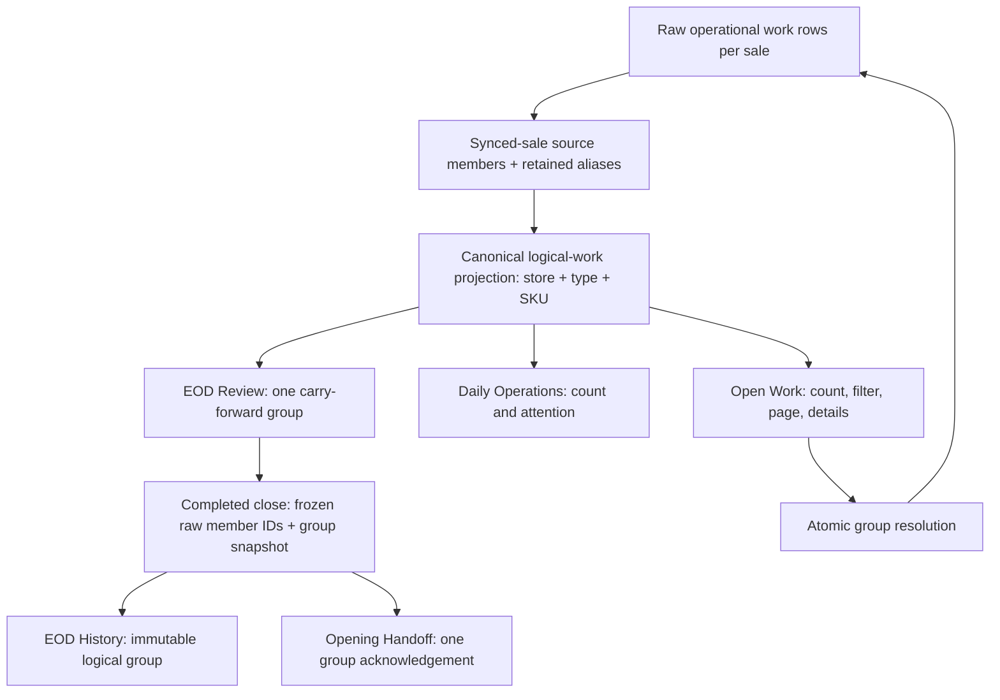
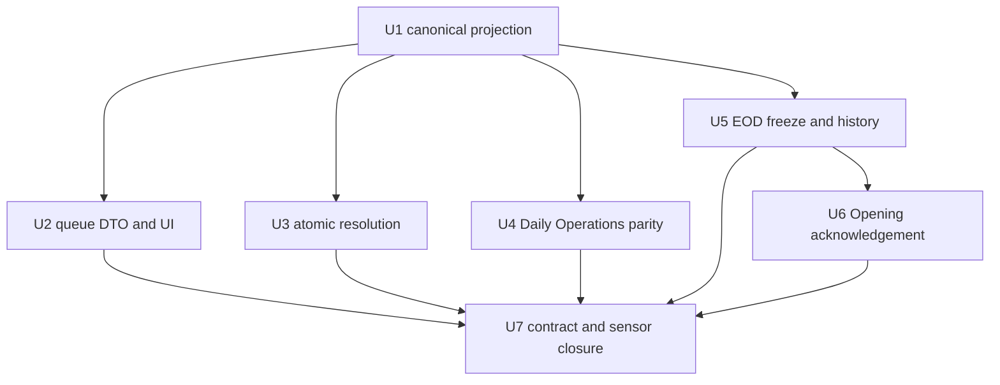
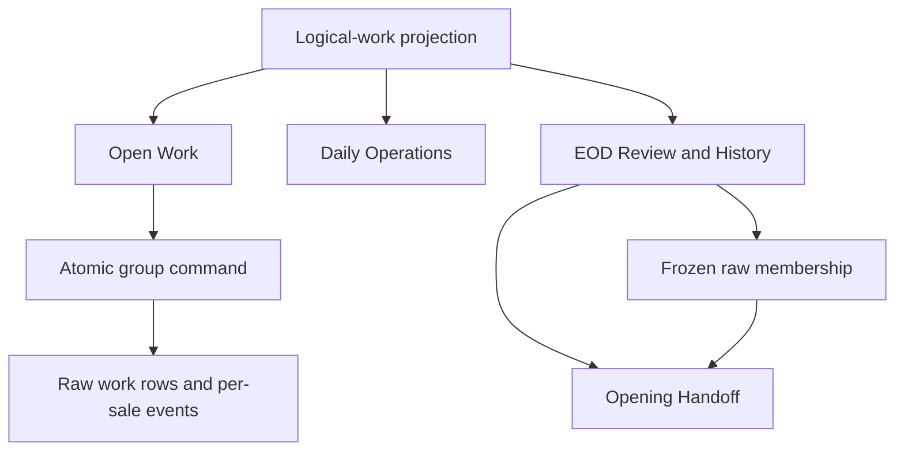

# refactor: Project logical Open Work groups across operations

## Summary

Introduce one server-owned logical-work projection that groups current synced-sale inventory reviews by store and canonical SKU before any operator-facing count, row, page, carry-forward snapshot, or acknowledgement is derived. Keep the sale-level work items authoritative, freeze their exact membership at EOD, reconstruct that frozen group in Opening Handoff, and replace the current client mutation loop with one bounded atomic group command.

---

## Problem Frame

Open Work currently consolidates same-SKU `synced_sale_inventory_review` rows only inside `OperationsQueueView`. Daily Operations, EOD Review, EOD History, and Opening Handoff read or persist the raw per-sale rows, so their counts and acknowledgement units disagree with the workspace that owns resolution. Client-only grouping also occurs after server caps and resolves a group through sequential single-row mutations, which can expose incomplete membership and partial success.

The implementation must distinguish two valid truths: operators act on one SKU-scoped unit, while audit, source validation, stock proof, and terminal transitions remain attached to each sale-level `operationalWorkItem`.

---

## Requirements

- R1. One server-owned logical-work projection must define group identity, membership, ordering, aggregation, and completeness for Open Work, Daily Operations, EOD Review, EOD History, and Opening Handoff.
- R2. Current `synced_sale_inventory_review` rows with the same store and canonical SKU must form one logical group while preserving every distinct sale-level work item as an auditable member.
- R3. The shared projection groups only `synced_sale_inventory_review`. Every other work type passes through each surface's existing canonical eligibility, identity, count, and presentation contract unchanged. Synced-sale rows without a valid canonical SKU remain singletons and must never group by title, receipt number, product name, or other display metadata.
- R4. Complete logical groups must be deterministic: stable key, stable representative and member order, strongest existing priority, `in_progress` when any member is in progress, oldest actionable timestamp, logical sale/source-member count, and exact ordered raw row-ID set including duplicate aliases. Incomplete projections expose only an observed logical lower bound and no actionable membership.
- R5. Open Work must consume sanitized logical DTOs from Convex. Header counts, work-type mix, filters, pagination, row details, and action safety must not infer SKU groups in React.
- R6. Daily Operations must derive its Open Work lane count and attention items from the same logical projection while remaining a visibility/navigation surface rather than a resolution owner.
- R7. EOD Review must show and count one carry-forward item per logical group but freeze the complete raw member-ID union in the completed close and immutable report snapshot.
- R8. Opening Handoff must reconstruct groups only from the prior close's frozen membership. One acknowledgement covers one frozen group, and same-SKU work created after EOD must not retroactively join it.
- R9. A synced-sale group of at most 50 raw transition rows resolves in one bounded Convex transaction. The server re-derives the complete current group and requires exact equality with the submitted membership before any write; any added, removed, terminalized, or changed row produces a zero-write `This work changed` conflict. Larger legitimate groups use a separate audited, resumable support repair workflow and remain one non-actionable logical unit until repair completes.
- R10. Logical caps and completeness must be truthful. Grouping occurs before presentation caps; an incomplete raw probe produces an explicitly partial logical count, cannot claim exact membership, and must fail closed for group resolution and EOD freeze in both human and automation paths.
- R11. Historical and broad-reader contracts must remain safe: new persisted fields are optional and bounded, newly versioned EOD snapshots persist authoritative logical groups, legacy snapshots render exactly as stored as singleton legacy items, immutable history never derives historical grouping from current rows, and raw member IDs never leak through redacted payloads.
- R12. Preserve the existing workspace direction and dirty-worktree heading behavior: selected filters continue to read `N open [work type] work item(s)`, all work types retain `N open work item(s)`, unrelated work types keep existing behavior, and manual browser validation remains a user-owned handoff.

---

## Scope Boundaries

- Do not merge sale-linked `operationalWorkItem` rows into one mutable SKU record or rewrite transaction-level source identity.
- Do not make SKU identity a substitute for each member's terminal, register-session, local transaction, canonical mapping, stock-proof, or audit validation.
- Do not consolidate approvals, pending-checkout review work, terminal attention, or unrelated inventory workflows.
- Do not give Daily Operations a resolution command.
- Do not group rows using title, receipt, product name, transaction label, or other weak presentation metadata.
- Do not redesign the four operations workspaces beyond the count, row, acknowledgement, incomplete-state, and action adaptations required by logical groups.
- Do not rewrite completed operational-work, event history, or legacy EOD snapshots. Retrospective inferred grouping and report-snapshot backfills are out of scope.
- Do not make manual browser validation an implementation completion blocker; automated backend, component, and boundary coverage remains required.
- Do not expose the oversized-group repair workflow as a normal operator action; it is an exceptional support-owned lifecycle with explicit authorization and audit.

### Deferred to Follow-Up Work

- Consolidation policies for additional work types.
- Queue analytics such as resolution time by logical group.
- General-purpose persisted work-group entities; the only persisted coordination state is the narrowly scoped oversized-group repair record required when one logical group cannot fit a Convex transaction.

---

## Context & Research

### Relevant Code and Patterns

- `packages/athena-webapp/src/components/operations/OperationsQueueView.tsx` contains the current client-only `groupOpenWorkItems` behavior and the moved filtered-heading change that must be retained.
- `packages/athena-webapp/convex/operations/operationalWorkItems.ts` owns sanitized queue DTOs, stable source identity, deterministic raw ordering/deduplication, lane probes, and queue overflow.
- `packages/athena-webapp/convex/operations/openWorkInventoryReviews.ts` owns validated synced-sale review resolution but currently mutates one work item per command.
- `packages/athena-webapp/convex/operations/dailyOperations.ts` reads and counts raw open work for the Open Work lane and attention feed.
- `packages/athena-webapp/convex/operations/dailyClose.ts` reads raw work, creates carry-forward items, records source completeness, freezes `carryForwardWorkItemIds`, and persists immutable report snapshots.
- `packages/athena-webapp/convex/operations/dailyOpening.ts` hydrates prior-close carry-forward IDs, derives acknowledgement keys, and persists opening evidence without resolving underlying work.
- `packages/athena-webapp/convex/schemas/operations/operationalWorkItem.ts` already carries first-class `productSkuId`; `packages/athena-webapp/convex/schema.ts` already indexes store, type, status, and SKU.
- `docs/plans/2026-07-02-001-fix-open-work-resolution-plan.md` establishes deterministic queue ordering, sanitized DTOs, and Operations-owned synced-sale resolution.
- `docs/plans/2026-07-04-001-fix-pos-pending-checkout-archive-work-lifecycle-plan.md` is the closest cross-surface parity precedent: source-correct lifecycle and one shared boundary instead of per-surface filters.

### Institutional Learnings

- `docs/solutions/architecture-patterns/athena-open-work-resolution-ownership-2026-07-02.md`: Open Work owns sanitized discovery/projection; raw source identity and source-workflow authority remain explicit. Synced-sale inventory review is the narrow Operations-owned resolver exception.
- `docs/solutions/logic-errors/athena-pos-sale-inventory-review-sku-scope-2026-07-08.md`: review presentation is SKU-scoped while sale projection and audit remain transaction-level.
- `docs/solutions/logic-errors/athena-daily-operations-aggregate-read-model-2026-05-08.md`: Daily Operations composes bounded source-owned reads and must use `N+` rather than false exactness.
- `docs/solutions/design-patterns/athena-daily-operations-carry-forward-copy-2026-07-04.md`: operator-facing carry-forward copy belongs at a shared projection boundary; internal IDs and metadata must not leak.
- `docs/solutions/architecture-patterns/athena-operations-review-and-cash-closeout-continuity-2026-07-11.md`: Daily Operations is visibility/routing; Open Work and source workflows retain resolution authority.
- `docs/brainstorms/2026-05-08-opening-mvp-store-readiness-gate-requirements.md`: Opening acknowledges unresolved prior-close work without resolving it and preserves prior-close evidence.

### External References

- None. Athena already has direct local patterns for indexed Convex reads, sanitized aggregate DTOs, immutable close snapshots, and acknowledgement evidence. External research would not improve this plan materially.

---

## Key Technical Decisions

- **Project rather than merge.** Add one pure server-domain logical-work module near the operations queries. Raw work items remain the write/audit authority; consumers receive logical groups.
- **Preserve source identity and aliases before grouping.** For synced-sale reviews only, retain one logical sale/source member per existing canonical source identity plus every current duplicate alias row ID. Aliases do not inflate operator counts but do participate in completeness, EOD evidence, and atomic terminalization/supersession. Every other work type keeps its current per-surface contract unchanged.
- **Prefer the first-class SKU anchor.** Use `operationalWorkItem.productSkuId` as the canonical group anchor, with a bounded compatibility fallback to legacy `primaryProductSkuId` metadata. Invalid or absent anchors produce singletons.
- **Keep source completeness and resolution availability orthogonal.** `sourceCompleteness: "complete"` always carries exact ordered logical members, alias row IDs, and counts. Its exhaustive `resolutionAvailability` union is `available`, `budget_exceeded`, or `remediation_in_progress`. `sourceCompleteness: "incomplete"` carries only observed lower-bound counts and non-authoritative safe display evidence, forbids actionable IDs, and has `resolutionAvailability: "source_incomplete"`. Exhaustive type tests reject invalid combinations. Do not hide raw IDs in generic metadata that broad-reader redactors currently pass through.
- **Separate logical overflow from raw-source completeness.** Read bounded raw probes with an extra sentinel, project the observed rows, then apply surface caps. A complete source with more logical groups is normal pagination/overflow; an incomplete source is a lower bound and disables unsafe freeze/resolution.
- **Resolve current membership atomically.** The client submits the logical identity and exact member/alias IDs it displayed. Inside the mutation, the server re-derives the complete current store/type/SKU group and requires exact ordered-set equality plus actionable statuses before any write. Any concurrent distinct source, alias, terminal transition, deletion, or membership change rejects the whole command with normalized `This work changed. Review the refreshed group before marking it reviewed.` copy. `MAX_ATOMIC_SYNCED_SALE_REVIEW_GROUP_SIZE = 50`: at most 50 work-row patches plus 50 operational-event inserts, bounded member/source reads, and one indexed shared SKU stock-proof read.
- **Use a bounded event-write path.** Do not call the existing subject-history `.collect()` helper per member. After all nonterminal/idempotency preconditions pass, build and insert each row event directly inside the same transaction (or add an indexed per-row business-event key with `.unique()`); Convex transactional retry plus the terminal-status precondition prevents duplicate committed events. Deep existing event history must not affect read cost.
- **Repair legitimate oversized groups explicitly.** Creation, amendment, resume, and finalization are `internalMutation` boundaries absent from the public API. A named `scripts/operational-work-repair.ts` runbook/tool invokes them only with a Convex deploy/admin credential and requires organization, store, group key, immutable initiator identifier, reason, and support ticket; the repair record and every event persist that evidence. Client/store-admin calls cannot reach the boundary. Creation re-derives and freezes the complete current group into a typed `oversizedOperationalWorkRepair` record, then scheduled bounded mutations validate and terminalize rows in batches with row-level events. The projection treats frozen membership as one `remediation_in_progress` group; later distinct source identities remain a separate live group. Before each batch and finalization, the repair rechecks canonical source identities. A later alias of a frozen source pauses repair, blocks finalization, and requires an internal audited membership amendment that appends the alias for a later bounded batch while retaining all completed-batch evidence. Retries resume from the persisted cursor. Only after every frozen/amended row and alias succeeds and a final no-unprocessed-alias check passes does one mutation mark the repair complete. A validation failure pauses with retained evidence and no newly scheduled batch. This support exception does not claim database-level all-or-none behavior across batches.
- **Freeze EOD membership, not current-query intent.** EOD persists all raw IDs behind each selected logical group and persists group display aggregates for immutable history. Opening reconstructs only that frozen membership and never expands it from the live queue.
- **One acknowledgement is evidence, not resolution.** Opening stores one group key bound to the frozen member IDs while leaving all underlying work rows unchanged. If all frozen members are terminal, no acknowledgement is required; if some remain unresolved, one group is shown with frozen and unresolved counts.
- **Version new snapshots; never infer legacy history.** Newly completed closes persist authoritative logical-group evidence. Existing report snapshots remain byte-for-contract readable as stored and each legacy carry-forward item stays a singleton for history and Opening acknowledgement. Missing legacy IDs remain individual integrity blockers; no current SKU field may rewrite historical meaning.
- **Retain existing UI copy and ownership.** The moved filtered-header change is part of the worktree baseline. Daily Operations stays read-only, and unrelated work types retain their source-owned behavior.

---

## Open Questions

### Resolved During Planning

- **Where does grouping live?** In one server-owned pure operations projection consumed by all four surfaces; React does not define a second grouping rule.
- **What does one acknowledgement cover?** One EOD-frozen logical group and its complete raw member-ID set.
- **What happens to later same-SKU work?** It remains current Open Work and does not join the completed EOD snapshot or next Opening Handoff.
- **What happens when source membership is capped or incomplete?** Read surfaces show a partial logical lower bound without actionable membership; grouped resolution and EOD completion fail closed.
- **What happens when frozen members become terminal before Opening?** EOD history remains immutable. Fully terminal groups require no Opening acknowledgement; partially unresolved groups require one acknowledgement bound to the full frozen membership.
- **What happens when a frozen member is missing?** A newly versioned group becomes one non-bypassable integrity blocker. Human, manager-routed, and automated start all reject until remediation. A legacy missing ID stays its own non-bypassable singleton blocker.
- **Should raw rows or historical events be migrated?** No. Legacy history remains exactly as persisted; logical grouping starts with newly versioned snapshots.
- **What is the concurrency rule for resolution?** The current server-derived group must exactly match the submitted membership and remain actionable. Any new distinct source, new alias, removed row, or status change rejects with zero writes and forces refresh; the operator then reviews the newly projected group.
- **What is the atomic group maximum?** 50 raw transition rows total, including representatives and aliases; `max + 1` is a typed fail-closed conflict.

### Deferred to Implementation

- The final module/type names and whether stable source comparator helpers move entirely into the new module or remain exported from `operationalWorkItems.ts`.
- The final naming of the oversized repair table/module and batch size, provided each batch is independently bounded below Convex limits and the projection preserves one remediation state until completion.

---

## High-Level Technical Design

> *This illustrates the intended approach and is directional guidance for review, not implementation specification. The implementing agent should treat it as context, not code to reproduce.*

| Source state | Count contract | Group actions | EOD freeze |
| --- | --- | --- | --- |
| Raw probe complete; group within 50-row atomic budget | Exact membership/count + `resolutionAvailability: "available"` | Enabled; mutation re-derives and exactly matches the current group | Allowed |
| Raw probe complete; one group exceeds 50 transition rows | Exact membership/count + `resolutionAvailability: "budget_exceeded"` | Operator resolution disabled; support may start the audited resumable repair | Allowed to freeze at EOD; repair remains one logical unit until complete |
| Raw probe incomplete | `incomplete`: observed logical lower bound with `+`; no actionable IDs | Disabled/fail closed | Blocked |
| Opening from frozen EOD IDs | Exact historical membership; later work excluded | Acknowledgement only | Not applicable |

### Operator state contract

| Surface/state | Operator copy and count | Action posture | Recovery/exit |
| --- | --- | --- | --- |
| Open Work incomplete source | Header/mix use observed logical `N+`; one calm banner: `Open Work is still loading the complete inventory review set.` | Group detail may remain readable, but `Mark reviewed` is disabled because actionable membership is unavailable. | Reactive query retries automatically; `Refresh` retries immediately; navigation remains available. |
| Open Work membership changed | Keep the row visible and show normalized inline conflict copy: `This work changed. Review the refreshed group before marking it reviewed.` | The attempted command writes nothing; button stays disabled until the complete refreshed DTO arrives. | Reactive refresh is primary; explicit `Refresh` is available; no modal trap. |
| Open Work complete group above atomic budget | Keep the exact logical count and show `This inventory review group needs support to complete safely.` | `Mark reviewed` is disabled; any forged/direct operator command returns a typed zero-write conflict. A support-only action creates/resumes the audited repair. | Navigation/refresh remain available; support owns remediation, and the projection shows one `remediation_in_progress` group until every frozen row succeeds. |
| Daily Operations incomplete source | Open Work lane shows observed logical `N+` and one attention item labelled `Open Work count is still updating.` | Navigation to Open Work remains enabled; no resolution action is added. | Reactive retry plus normal workspace navigation. |
| EOD incomplete source | Readiness count uses `N+`; carry-forward section shows `Open Work membership is incomplete.` | Human and automated close completion are blocked; existing loading/empty behavior is unchanged when the source is complete. | `Refresh readiness` retries; operator may leave EOD and return, but cannot override the blocker. |
| Opening missing frozen membership | One integrity blocker per versioned group, or per legacy singleton: `Prior-close work evidence is missing.` | Acknowledgement, normal start, manager-routed start, and automated start all reject. | Preserve the frozen IDs and route to remediation/support; retry after evidence is restored. |

---

## Implementation Units

- U1. **Define the canonical logical-work projection**

**Goal:** Establish one deterministic server-domain contract for synced-sale source identity/aliases, SKU grouping, aggregate urgency, ordered membership, and source completeness while passing unrelated work types through unchanged.

**Requirements:** R1-R4, R10-R11

**Dependencies:** None

**Files:**
- Create: `packages/athena-webapp/convex/operations/logicalOperationalWork.ts`
- Create/Test: `packages/athena-webapp/convex/operations/logicalOperationalWork.test.ts`
- Modify: `packages/athena-webapp/convex/operations/operationalWorkItems.ts`
- Test: `packages/athena-webapp/convex/operations/operationalWorkItems.test.ts`

**Approach:**
- Reuse stable source identity for synced-sale reviews, but retain duplicate aliases behind their canonical sale/source member instead of discarding them from lifecycle evidence.
- Project valid synced-sale reviews by store/type/first-class SKU with bounded legacy fallback; use stable singleton identity for every non-groupable row.
- Return orthogonal exhaustive discriminants: source completeness owns exact versus lower-bound membership/counts; resolution availability is `available`, `budget_exceeded`, `remediation_in_progress`, or `source_incomplete`.
- Keep the core projection server-only and pure so every Convex consumer can apply it without pulling a server module into the browser bundle.

**Execution note:** Start with characterization of existing source-deduplication ordering, then add the new projection behavior test-first.

**Patterns to follow:**
- `packages/athena-webapp/convex/operations/operationalWorkItems.ts` source identity, comparison, resolver-context preference, and sanitized DTO boundaries.
- `docs/solutions/logic-errors/athena-pos-sale-inventory-review-sku-scope-2026-07-08.md` SKU-scoped review with sale-level audit.

**Test scenarios:**
- Happy path: two current same-store/same-SKU reviews across `open` and `in_progress` become one logical group with two ordered raw member IDs.
- Happy path: different SKUs, different stores, unrelated work types, and distinct non-groupable sources remain separate logical units.
- Edge case: missing, blank, invalid, or legacy-incomplete SKU anchors remain singletons and never group by matching copy or receipt.
- Edge case: duplicate rows for the same transaction/local source identity count once but retain all alias IDs for completeness, freeze, and terminalization; an alias set that exceeds bounds fails closed.
- Edge case: mixed priority/status members select the strongest defined values and oldest actionable timestamp without input-order drift.
- Edge case: first-class `productSkuId` and valid legacy metadata fallback produce the same stable group identity.
- Completeness: an incomplete raw input remains explicitly incomplete after projection and cannot yield an exact member count.
- Type contract: exhaustive compile/runtime tests accept only `complete + available`, `complete + budget_exceeded`, `complete + remediation_in_progress`, or `incomplete + source_incomplete`; invalid combinations are rejected.

**Verification:** The same raw fixture produces the same group key, membership, order, aggregates, and completeness for every consumer without any React grouping rule.

---

- U2. **Return logical Queue DTOs and consume them in Open Work**

**Goal:** Make the server snapshot the sole authority for Open Work count, mix, filtering, pagination, row membership, and action safety while preserving the moved heading copy.

**Requirements:** R1-R5, R10-R12

**Dependencies:** U1

**Files:**
- Modify: `packages/athena-webapp/convex/operations/operationalWorkItems.ts`
- Test: `packages/athena-webapp/convex/operations/operationalWorkItems.test.ts`
- Modify: `packages/athena-webapp/src/components/operations/OperationsQueueView.tsx`
- Test: `packages/athena-webapp/src/components/operations/OperationsQueueView.test.tsx`

**Approach:**
- Apply the synced-sale projection before the logical display cap, pass unrelated work types through unchanged, then serialize allowlisted complete/incomplete DTO variants.
- Preserve raw-probe completeness separately from normal logical overflow so counts and actions cannot confuse truncation with a complete group.
- Remove `groupOpenWorkItems`; drive header, work-type mix, filter, pagination, grouped details, and resolution affordance from the server DTO.
- Retain `N open [work type] work item(s)` for selected filters and `N open work item(s)` for the all-types filter.

**Execution note:** Test-first around the server DTO and component contract; preserve existing queue behavior for singleton work types.

**Patterns to follow:**
- Existing queue DTO sanitization and overflow payload in `operationalWorkItems.ts`.
- Existing grouped synced-sale card/detail behavior in `OperationsQueueView.tsx` as presentation parity, not as the grouping authority.

**Test scenarios:**
- Open Work returns/renders one logical DTO, one article, one filter/mix count, and the total affected-sale count for multiple same-SKU members.
- Pagination and the global header count operate on logical groups, and a group is never split across pages.
- Missing-SKU reviews remain separate rows; other work types keep their existing titles, links, and counts.
- Incomplete raw membership renders the operator-state contract, exposes no actionable membership, and disables grouped resolution without claiming an exact affected-sale count.
- A complete 50-row group enables resolution; a complete 51-row group remains exactly countable/readable but renders the over-budget operator state and never issues the mutation.
- Sanitized members omit raw metadata, proof IDs, internal payloads, and hidden financial evidence.
- The existing selected-filter and all-types heading expectations remain green.

**Verification:** No client-side SKU grouping remains; Open Work display and action safety can be derived from the Queue response alone.

---

- U3. **Resolve synced-sale logical groups atomically**

**Goal:** Replace the sequential client mutation loop with one all-or-none Operations-owned group command while preserving member-level source validation and audit evidence.

**Requirements:** R2-R4, R9-R11

**Dependencies:** U1, U2

**Files:**
- Modify: `packages/athena-webapp/convex/operations/openWorkInventoryReviews.ts`
- Test: `packages/athena-webapp/convex/operations/openWorkInventoryReviews.test.ts`
- Create: `packages/athena-webapp/convex/operations/oversizedOperationalWorkRepair.ts`
- Create/Test: `packages/athena-webapp/convex/operations/oversizedOperationalWorkRepair.test.ts`
- Modify: `packages/athena-webapp/convex/operations/operationalEvents.ts`
- Test: `packages/athena-webapp/convex/operations/operationalEvents.test.ts`
- Modify: `packages/athena-webapp/convex/schema.ts`
- Modify if a focused schema module owns the table definition: `packages/athena-webapp/convex/schemas/operations/inventoryMovement.ts`
- Create: `packages/athena-webapp/convex/schemas/operations/oversizedOperationalWorkRepair.ts`
- Create: `scripts/operational-work-repair.ts`
- Create/Test: `scripts/operational-work-repair.test.ts`
- Modify: `package.json`
- Modify: `packages/athena-webapp/src/components/operations/OperationsQueueView.tsx`
- Test: `packages/athena-webapp/src/components/operations/OperationsQueueView.test.tsx`
- Refresh if generated by the approved Convex workflow: `packages/athena-webapp/convex/_generated/api.d.ts`

**Approach:**
- Accept a logical SKU identity and expected bounded membership. Re-derive the complete current group inside the mutation and require exact representative/alias set equality plus actionable statuses before any write.
- Preserve existing authorization, store/org, terminal, register-session, sale, local mapping, source-status, and qualifying stock-proof checks for each member.
- Enforce `MAX_ATOMIC_SYNCED_SALE_REVIEW_GROUP_SIZE = 50`, counting every raw representative and alias row that must transition. Budget at most 50 work-item patches plus 50 operational-event inserts, bounded source reads per row, and one indexed shared SKU stock-proof read loaded before writes.
- Add/use an index that proves qualifying SKU stock movement without the existing unbounded `.collect()`; validate all members and aliases first, then patch/terminalize or explicitly supersede every row and emit row-level evidence through the bounded direct-insert/event-key path inside one mutation.
- For a legitimate group above 50 rows, reject the operator resolver and use the support-authorized repair record/scheduler lifecycle. Re-derive and freeze exact current membership at repair creation, process bounded idempotent batches, retain one remediation projection throughout, pause safely on validation failure, and finalize only after all rows/events succeed.
- Keep repair commands internal-only and runbook-driven. Persist immutable initiator/reason/ticket/org/store evidence; prove the generated/public API does not expose repair mutations and that store admins or forged direct client calls cannot create, amend, resume, pause, or finalize repairs.
- Treat stale, terminal, mixed-SKU, missing, incomplete, forged, over-50, or mismatched alias membership as a typed conflict that writes nothing and activates the operator-state contract.

**Execution note:** Test-first with a failing no-partial-write scenario before introducing the group command.

**Patterns to follow:**
- Existing typed resolver validation and event recording in `openWorkInventoryReviews.ts`.
- Convex single-mutation transaction boundary; validate before the first write.

**Test scenarios:**
- Happy path: one command completes every member and records one audit event per underlying sale/work item.
- Atomicity: wrong store/org/type/SKU/status, stale member, missing canonical mapping, or missing stock proof causes zero member patches and zero events.
- Input integrity: empty, duplicate, mixed-group, incomplete, or forged membership fails closed; exactly 50 transition rows succeeds and 51 fails with zero writes.
- Alias integrity: duplicate source rows count as one logical sale but every alias participates in the 50-row cap, freeze, and atomic terminal/supersession evidence so no alias resurfaces.
- Event boundedness: a 50-row command against members with deep pre-existing subject histories performs no history `.collect()` and commits exactly one event per transitioned row.
- Concurrency: a retry after another actor terminally changes one member does not partially complete the remainder.
- Lifecycle: omitting a current row, adding a distinct source or alias, removing a row, or changing any expected status causes exact-match failure and zero writes; refresh presents the new complete group for review.
- Oversized lifecycle: a 51-row legitimate group disables the operator action; public/store-admin calls cannot invoke repair; the credentialed internal runbook preserves initiator/reason/ticket evidence and eventually terminalizes all frozen rows through resumable bounded batches.
- Repair concurrency: a later distinct source remains separately projected; an alias arriving before its representative batch, between batches, or immediately before finalization pauses repair, is appended only through an audited amendment, and must finish before the final no-alias check permits completion.
- UI integration: `Mark N reviewed` issues one server command, has one pending state, and renders one normalized result.

**Verification:** One operator action commits only when the submitted representative/alias set exactly equals the complete actionable group at mutation time. Every membership or status change writes nothing; refresh then projects the changed consolidated current group. Separate-live-group behavior applies only to post-freeze distinct sources during oversized remediation.

---

- U4. **Align Daily Operations counts and attention**

**Goal:** Make the Daily Operations Open Work lane and attention feed use the shared logical units without acquiring resolution authority.

**Requirements:** R1-R4, R6, R10-R12

**Dependencies:** U1

**Files:**
- Modify: `packages/athena-webapp/convex/operations/dailyOperations.ts`
- Test: `packages/athena-webapp/convex/operations/dailyOperations.test.ts`
- Modify only if its presentation contract changes: `packages/athena-webapp/src/components/operations/DailyOperationsView.tsx`
- Test: `packages/athena-webapp/src/components/operations/DailyOperationsView.test.tsx`

**Approach:**
- Project open/in-progress work before lane count and attention derivation, emitting one stable navigation item per logical group.
- Preserve terminal-work exclusion, approval separation, and Open Work routing.
- Report observed logical `N+` when the raw source probe is incomplete instead of using the raw-row cap as a count.

**Execution note:** Add backend parity coverage first; touch the React view only if the existing count-label contract cannot represent the new completeness state.

**Patterns to follow:**
- Bounded aggregate read and `N+` posture in `dailyOperations.ts`.
- Daily Operations visibility-only ownership from the operations continuity learning.

**Test scenarios:**
- Two same-SKU reviews produce one lane count and one attention item linked to Open Work.
- Different SKU groups, missing-SKU singletons, unrelated work, and pending approvals retain distinct behavior.
- An incomplete raw source produces a logical lower-bound label and never a false exact count.
- The same complete fixture yields the same logical keys/count in Queue and Daily Operations adapters.

**Verification:** Daily Operations and Open Work agree on logical count/identity for the same complete source while resolution remains in Open Work.

---

- U5. **Freeze logical EOD groups and immutable history**

**Goal:** Present one EOD carry-forward unit per logical group while persisting every raw member ID and an immutable, redaction-safe group snapshot.

**Requirements:** R1-R4, R7, R10-R12

**Dependencies:** U1

**Files:**
- Modify: `packages/athena-webapp/convex/operations/dailyClose.ts`
- Modify if required by the typed persisted contract: `packages/athena-webapp/convex/schemas/operations/dailyClose.ts`
- Test: `packages/athena-webapp/convex/operations/dailyClose.test.ts`
- Modify: `packages/athena-webapp/src/components/operations/DailyCloseView.tsx`
- Test: `packages/athena-webapp/src/components/operations/DailyCloseView.test.tsx`
- Modify if compatibility is rendered there: `packages/athena-webapp/src/components/operations/DailyCloseHistoryView.tsx`
- Test: `packages/athena-webapp/src/components/operations/DailyCloseHistoryView.test.tsx`

**Approach:**
- Derive live EOD carry-forward items, readiness counts, and open-work summary from logical groups while retaining typed group membership.
- Validate all-or-none group membership server-side and persist the flat raw representative-and-alias ID union on `dailyClose` plus stable group display aggregates/membership and snapshot contract version in the report snapshot.
- Block human and automation completion when operational-work source completeness cannot prove the frozen set.
- Keep completed/history rendering on persisted group evidence so later row changes do not drift history; make new fields optional and explicitly remove membership from broad-reader DTOs.
- Render legacy report snapshots exactly as persisted. Treat each legacy carry-forward item as a singleton in history and Opening; do not hydrate current SKU anchors, infer historical groups, or backfill old snapshots.

**Execution note:** Characterize current completion, automation, redaction, reopen, and legacy snapshot behavior before changing the persisted contract.

**Patterns to follow:**
- Existing `sourceCompleteness`, `carryForwardWorkItemIds`, immutable `reportSnapshot`, and broad-reader redaction in `dailyClose.ts`.
- Cross-surface parity precedent in the pending-checkout archive lifecycle plan.

**Test scenarios:**
- Live EOD: multiple same-SKU members produce one carry-forward row/readiness count while preserving the complete member set.
- Completion: one selected group persists every raw ID, one logical report item, and logical summary/readiness counts; partial selection is rejected.
- Completeness: human and automation completion both write nothing when the operational-work source is incomplete.
- Frozen membership: work created after completion does not join the persisted close; later member status/title/priority changes do not alter history.
- Legacy compatibility: same-SKU legacy frozen IDs remain separate singleton items exactly as persisted; missing legacy IDs remain separate non-bypassable integrity blockers rather than guessed groups.
- Privacy: broad/read-only snapshots retain safe logical copy/counts but omit member IDs and source/proof material.
- Reopen/history: reopening or superseding a close preserves its original report snapshot and group membership.

**Verification:** EOD exposes logical units while completed-close evidence contains the exact frozen raw membership and remains immutable, complete, and redaction-safe.

---

- U6. **Require one Opening acknowledgement per frozen group**

**Goal:** Reconstruct prior-close logical groups from frozen IDs and persist one acknowledgement key bound to their full historical membership without resolving work.

**Requirements:** R1-R4, R8, R10-R12

**Dependencies:** U1, U5

**Files:**
- Modify: `packages/athena-webapp/convex/operations/dailyClose.ts`
- Modify: `packages/athena-webapp/convex/operations/dailyOpening.ts`
- Modify if required by the typed evidence contract: `packages/athena-webapp/convex/schemas/operations/dailyOpening.ts`
- Test: `packages/athena-webapp/convex/operations/dailyOpening.test.ts`
- Modify: `packages/athena-webapp/src/components/operations/DailyOpeningView.tsx`
- Test: `packages/athena-webapp/src/components/operations/DailyOpeningView.test.tsx`

**Approach:**
- Build Opening groups exclusively from prior-close frozen membership, never from current Open Work.
- Require one stable logical key when any frozen member remains unresolved; retain the full frozen member set and expose frozen-versus-unresolved counts.
- Persist the flat raw representative-and-alias ID set plus typed key-to-membership acknowledgement evidence on Opening and the operational/manager-review evidence paths.
- Omit fully terminal groups from required acknowledgements without changing EOD history. Missing membership is non-bypassable: one blocker per newly versioned group or per legacy singleton rejects normal, manager-routed, and automated start until remediation.
- Explicitly redact membership from broad-reader snapshots.

**Execution note:** Test-first around acknowledgement validation and frozen-membership persistence, with legacy and missing-member characterization retained.

**Patterns to follow:**
- Existing required acknowledgement-key validation, manager-review routing, event evidence, and non-resolving Opening semantics in `dailyOpening.ts`.

**Test scenarios:**
- Prior close with two same-SKU frozen IDs yields one row/count/key; omitting the key fails once and providing it starts the day.
- Successful Opening persists both raw IDs and the key-to-frozen-membership evidence without patching underlying work.
- A new current same-SKU review created after EOD never joins the prior group.
- If some frozen members are terminal, one group remains for unresolved work and evidence retains the full frozen membership; if all are terminal, no acknowledgement is required.
- A missing frozen member creates one versioned group-level blocker (or legacy singleton blocker); acknowledgement, normal start, manager-routed start, and automated start all write nothing until remediation.
- Started-opening hydration remains stable after raw rows change, and broad readers cannot see member IDs.

**Verification:** Opening and EOD agree on frozen logical groups; one acknowledgement creates complete evidence and never changes operational-work status.

---

- U7. **Close the cross-surface contract, sensors, and durable learning**

**Goal:** Prove parity across all consumers, keep validation routing current, refresh generated artifacts, and record the reusable logical-projection boundary.

**Requirements:** R1-R12

**Dependencies:** U2-U6

**Files:**
- Update: `docs/solutions/architecture-patterns/athena-operations-review-and-cash-closeout-continuity-2026-07-11.md`
- Modify only if the new helper/test path is not already covered: `scripts/harness-app-registry.ts`
- Test if registry changes: `scripts/harness-app-registry.test.ts`
- Regenerate through the registry workflow if needed: `packages/athena-webapp/docs/agent/validation-map.json`
- Regenerate through the registry workflow if needed: `packages/athena-webapp/docs/agent/validation-guide.md`
- Refresh after implementation code changes: `graphify-out/GRAPH_REPORT.md`
- Refresh after implementation code changes: `graphify-out/graph.json`
- Refresh after implementation code changes: `graphify-out/wiki/index.md`
- Create a landed-change report under `docs/reports/` only if the repository gate requires one.

**Approach:**
- Add a shared fixture or equivalent integration assertions proving Queue, Daily Operations, EOD, History, and Opening agree on keys/counts while preserving their distinct authority.
- Keep the existing “Daily store operations lifecycle edits” validation-map route unless touched-file auditing proves the new module is not selected; regenerate mapped docs rather than editing them manually.
- Document the split between logical operator units and raw authoritative work, including cap/completeness, EOD freeze, Opening acknowledgement, atomic resolution, and privacy rules.
- Rebuild Graphify after final code changes, preserve the moved generated dirt until it is refreshed against the final implementation, and satisfy any compound/landed-report gate triggered by the final diff.

**Execution note:** Sensor-only for documentation/generated artifacts; all behavioral coverage belongs in U1-U6.

**Patterns to follow:**
- `AGENTS.md` Vitest and Graphify rules.
- Existing operations lifecycle harness mapping in `scripts/harness-app-registry.ts`.
- Existing Open Work and Daily Operations solution-note frontmatter conventions.

**Test scenarios:**
- Integration: the same complete raw fixture produces matching logical keys/counts across Queue and Daily Operations, then freezes the same membership in EOD and requires the same single group in Opening.
- Integration: incomplete raw membership is partial in visibility surfaces and fail-closed in resolution/EOD mutation surfaces.
- Boundary: route-tree/browser checks prove no server-only grouping helper enters frontend imports.
- Test expectation for documentation/generated artifacts: none beyond their dedicated validators because they do not introduce runtime behavior.

**Verification:** Focused backend/component suites, Convex audit, changed-file lint, typecheck, package build, route/browser boundary, Graphify freshness, documentation gates, and merge-grade `pr:athena` all agree on the final contract. Manual browser validation remains explicitly delegated to the user.

---

## System-Wide Impact

- **Interaction graph:** Queue reads and resolution, Daily Operations snapshot, Daily Close live/completed/history snapshots, Opening context/start command, schema validators, redactors, generated Convex API types, harness mapping, and Graphify are affected.
- **Error propagation:** Incomplete or stale membership is an explicit domain precondition/conflict. Visibility surfaces may render partial lower bounds; mutation surfaces must fail before writes. Existing normalized user-error handling remains the browser boundary.
- **State lifecycle risks:** Synced-sale source aliases are retained behind one logical sale member; EOD membership is immutable; Opening never expands from live work; missing evidence is non-bypassable; exact-current-membership validation turns every concurrent change into a zero-write refresh conflict.
- **API surface parity:** Server DTOs become logical for Queue and lifecycle snapshots. New persisted membership fields are optional for old documents, and redacted readers receive safe aggregates without raw IDs.
- **Integration coverage:** Shared fixtures must cross Queue, Daily Operations, EOD completion/history, and Opening; unit tests alone cannot prove frozen membership and cross-surface count parity.
- **Unchanged invariants:** Sale-level work items, source-owned lifecycle, Operations-owned synced-sale validation, approval separation, terminal status rules, and transaction/event audit history remain authoritative.

---

## Risks & Dependencies

| Risk | Mitigation |
| --- | --- |
| Raw cap freezes only part of a group | Carry raw-source completeness through projection; show `N+`; block group resolution and both human/automation EOD completion until membership is provably complete. |
| Atomic group exceeds Convex transaction limits | Cap the operator transaction at 50 rows; row 51 routes to the support-authorized resumable repair record with bounded scheduled batches and one projected remediation state. |
| Legacy history is falsely regrouped from mutable current rows | Version new snapshots only; render old snapshots exactly as stored as singleton legacy items and perform no inferred backfill. |
| Raw member IDs leak through broad DTO metadata | Use typed membership fields and explicit redactor omission; add negative payload tests. |
| Mutable raw rows change completed history | Persist display aggregates and exact membership in the close report snapshot; history reads persisted evidence. |
| Missing/terminal members silently shrink Opening evidence | Preserve frozen and unresolved membership separately; all-terminal groups need no acknowledgement; missing members block normal, manager, and automated start until remediation. |
| Client submits a partial, stale, or forged group | Re-derive the complete current group inside the mutation and require exact representative/alias equality before writes; any mismatch returns the same zero-write refresh conflict. |
| Duplicate source aliases resurface after group resolution | Count aliases once for presentation but include every alias row in completeness, 50-row cap, freeze, and atomic terminal/supersession evidence. |
| Per-row event dedupe scans make the group mutation unbounded | Use direct transactional inserts after terminal-status validation or an indexed business-event key; test deep existing history at the 50-row boundary. |
| Oversized repair is invoked by an operator or loses actor provenance | Expose only internal mutations behind the deploy-credential runbook; require and immutably persist initiator, reason, ticket, organization, and store evidence; test public API absence. |
| Alias arrives during multi-batch repair | Recheck source identities before each batch/finalization; pause and audit-amend membership, retain completed evidence, and require a final no-unprocessed-alias proof. |
| Group key or ordering drifts between surfaces | Centralize key/ordering/aggregation and run the same fixture through every adapter. |
| Schema rollout rejects legacy documents | Make new fields optional and bounded; test old/new report and Opening documents together. |
| Current dirty heading/Graphify work is lost | Treat the transferred files as the worktree baseline; preserve heading behavior and rebuild generated Graphify artifacts only against the final implementation. |

---

## Documentation / Operational Notes

- The implementation should produce a durable solution note because it establishes a reusable cross-surface read/command boundary rather than a one-off UI fix.
- Refresh generated Convex types only through Athena's approved generated-artifact workflow; do not hand-edit generated APIs.
- Update the harness registry only if touched-file selection does not already include the new operations helper/test, then regenerate validation docs from the registry.
- Run focused Vitest from `packages/athena-webapp` with package-relative paths; never run these tests directly through `bun test`.
- After code changes, run `bun run graphify:rebuild`. The existing moved Graphify files are retained in this worktree and should be refreshed once against the final code.
- Merge-level implementation validation should include focused backend/UI suites, Convex audit and changed lint, changed frontend lint, TypeScript no-emit, package build, browser-boundary coverage, Graphify freshness, compound/documentation gates, any required landed-change report, and `bun run pr:athena`.
- Manual browser validation remains assigned to the user.

---

## Sources & References

- `packages/athena-webapp/convex/operations/operationalWorkItems.ts`
- `packages/athena-webapp/convex/operations/openWorkInventoryReviews.ts`
- `packages/athena-webapp/convex/operations/dailyOperations.ts`
- `packages/athena-webapp/convex/operations/dailyClose.ts`
- `packages/athena-webapp/convex/operations/dailyOpening.ts`
- `packages/athena-webapp/src/components/operations/OperationsQueueView.tsx`
- `docs/plans/2026-07-02-001-fix-open-work-resolution-plan.md`
- `docs/plans/2026-07-04-001-fix-pos-pending-checkout-archive-work-lifecycle-plan.md`
- `docs/solutions/architecture-patterns/athena-open-work-resolution-ownership-2026-07-02.md`
- `docs/solutions/logic-errors/athena-pos-sale-inventory-review-sku-scope-2026-07-08.md`
- `docs/solutions/logic-errors/athena-daily-operations-aggregate-read-model-2026-05-08.md`
- `docs/solutions/design-patterns/athena-daily-operations-carry-forward-copy-2026-07-04.md`
- `docs/solutions/architecture-patterns/athena-operations-review-and-cash-closeout-continuity-2026-07-11.md`
- `docs/brainstorms/2026-05-08-opening-mvp-store-readiness-gate-requirements.md`
