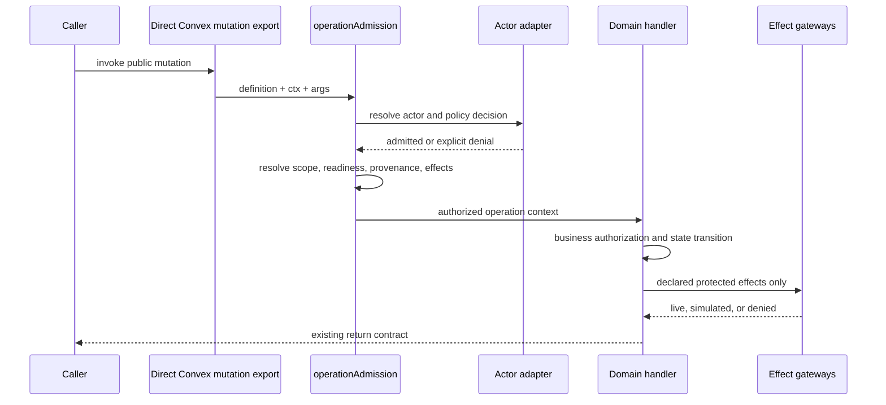
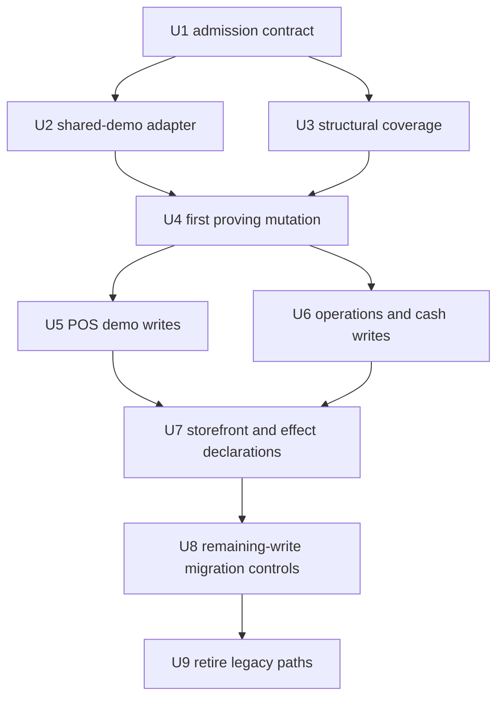
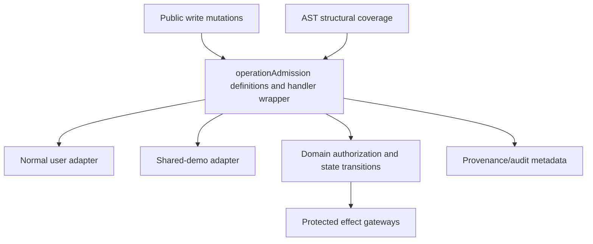

# feat: Add operation admission rail

## Summary

This plan introduces a neutral `operationAdmission` rail for Convex public write mutations while keeping public exports in Convex's normal `mutation({ ... })` shape. It proves the rail with shared demo as the first non-human policy consumer, migrates `operations/openWorkInventoryReviews` first, then moves demo-reachable writes and remaining public writes behind structural admission coverage.

---

## Problem Frame

Athena already classifies public writes by capability, but runtime enforcement is still handler-local and optional. A write can be classified as demo-allowed yet still reach ordinary Athena auth first, which causes recognized shared-demo principals to fail with misleading normal-auth errors instead of explicit policy decisions.

---

## Requirements

- R1. Public write mutations declare a valid catalog capability, scope, readiness policy, and protected effect requirements before their handler runs.
- R2. The rail resolves a typed actor before normal-user auth or domain logic; recognized shared-demo principals either admit through their adapter or deny explicitly, never falling through to normal auth.
- R3. Actor behavior lives in adapter modules. The generic `operationAdmission` core does not import `sharedDemo` modules or contain demo-specific branches.
- R4. The shared-demo adapter enforces server-owned principal resolution, expiry, closed grants, server-owned store/org scope, restore readiness/epoch fencing, stable denials, and provenance.
- R5. Normal-user behavior remains compatible with existing Athena authentication, organization membership, store membership, role checks, domain authorization, and live effects.
- R6. Domain authorization remains local. Admission permits entry to an operation; existing domain code still owns full-admin/staff/manager rules, approval proof, workflow state, register state, transaction state, and inventory invariants.
- R7. Denied actors receive explicit policy denials; protected operations declare access intent even when a given actor is denied.
- R8. Scope declarations support no scope, store scope, organization scope, and resource-derived scope resolvers that load owning store/org before admission.
- R9. Handlers receive a normalized authorized operation context containing actor, actor kind, Athena user identity when applicable, authorized constraints, provenance, and policy decision metadata.
- R10. The rail defines a compatible protected-effect extension point for live, simulated, and denied effects without migrating all providers in the first delivery.
- S1. Structural enforcement, derived from the origin document's Structural Enforcement section: checks reject raw or incompletely declared public write mutations, distinguish internal mutations, support explicit dynamic-capability variants, and prevent capability declarations from drifting away from runtime enforcement.

---

## Scope Boundaries

This phase introduces a generic operation-admission rail for public write mutations, proves it with shared demo as the first consumer, and leaves public reads, public actions, role-model changes, broad policy language, and provider migration for explicit follow-on work.

- Public reads/queries stay out of scope except where existing shared-demo read allowlists remain unchanged.
- The rail does not redesign Athena roles, organization membership, staff credentials, approval proof, terminal proof, or domain-specific authorization.
- The rail is code-owned and explicit; it does not introduce a runtime policy DSL, dynamic plugin/config system, or general-purpose authorization engine.
- Convex public exports stay direct `mutation({ ... })` declarations with explicit validators and return validators. The plan does not hide Convex registration behind an opaque registrar.
- "Raw public mutation" means a public mutation export whose handler does not pass through operation admission. Accepted direct Convex exports still use `mutation`; they are not raw when their handler is admitted through the rail.
- Shared-demo fixture behavior, presentation, seeding, and restore implementation are not redesigned.
- Convex internal functions are not forced through the public admission boundary.

### Deferred to Follow-Up Work

- Public read/query and public action admission: apply the actor model after public write mutation admission is stable.
- Broad provider migration: move provider and scheduled effect dispatch through the effect rail after public write mutation admission proves the contract. This plan only declares protected effects for migrated mutation paths and tests the admission/effect contract through existing provider guard points.
- Future actor adapters: add automation, integration credential, support session, or delegated principal adapters only when a concrete consumer exists.

---

## Context & Research

### Relevant Code and Patterns

- `packages/athena-webapp/convex/lib/athenaUserAuth.ts`: current normal auth resolution and optional shared-demo capability path that this plan eventually retires from generic user auth.
- `packages/athena-webapp/convex/sharedDemo/actor.ts`: existing server-owned demo principal, capability, store clamp, and restore-fence helpers to reuse from a shared-demo adapter.
- `packages/athena-webapp/convex/sharedDemo/policy.ts`: current closed demo allowlist, explicit denial helper, effect classifications, and representative public-function inventory.
- `packages/athena-webapp/convex/sharedDemo/capabilityCatalog.ts`: Athena-wide capability catalog currently housed under shared demo; move it into a neutral platform-owned namespace so shared demo consumes platform capabilities instead of owning them.
- `packages/athena-webapp/convex/sharedDemo/restore.ts`: same-transaction `sharedDemoRestoreState` readiness and expected-epoch fence.
- `packages/athena-webapp/convex/operations/openWorkInventoryReviews.ts`: first proving mutation, currently a direct public `mutation({ ... })` with normal auth and `full_admin` domain checks but no shared-demo admission despite `daily_operations.write` classification.
- `packages/athena-webapp/convex/sharedDemo/policy.test.ts`, `packages/athena-webapp/convex/sharedDemo/enforcement.test.ts`, and `packages/athena-webapp/convex/sharedDemo/serviceEffectBoundaryCoverage.test.ts`: current source and behavior sensors to replace or fold into generic structural coverage.
- `scripts/convex-return-validator-contract-check.ts`: local model for static Convex export analysis that reports structured findings.
- `packages/athena-webapp/docs/agent/architecture.md`: command results, raw server error handling, approval authority, reporting effects, and domain-boundary guidance.
- `packages/athena-webapp/convex/_generated/ai/guidelines.md`: Convex public functions must use `query`/`mutation`/`action`, include validators, and preserve file/export routing.

### Institutional Learnings

- `docs/solutions/architecture-patterns/shared-demo-principal-policy-and-restore-boundary-2026-07-12.md`: shared-demo is a server-derived principal, allowed writes must pass a closed capability registry and same-transaction restore fence, and provider effects require a second boundary.
- `docs/solutions/security-issues/pos-public-surface-authz-and-rejected-sale-loss-2026-07-15.md`: public Convex auth coverage must be per endpoint, not per file/import, and authorization failure must prevent delegate writes.
- `docs/solutions/architecture-patterns/athena-store-service-principal-authority-foundation-2026-07-15.md`: identity, granted authority, sessions, and consumer adapters should remain separate lanes; a principal alone has no authority.
- `docs/solutions/architecture-patterns/athena-manager-gated-operational-surfaces-2026-07-07.md`: manager/full-admin visibility and policy-write authority remain distinct from operation admission.
- `docs/solutions/workflow-issues/static-harness-contract-preflight-before-provider-validation-2026-07-13.md`: deterministic structural checks should fail before expensive provider or broad validation.
- `docs/solutions/harness/convex-return-validator-contract-proof-2026-06-18.md`: public Convex return contracts need executable proof, not string-only checks.

### External References

- No external research was used. Local Convex guidelines and established Athena patterns are sufficient for this brownfield plan.

---

## Key Technical Decisions

- Keep Convex exports direct: migrated functions continue to export `mutation({ args, returns, handler })`; admission wraps the handler or handler context rather than replacing Convex registration.
- Introduce a neutral `packages/athena-webapp/convex/operationAdmission/` namespace for generic types, definitions, actor normalization, scope/readiness/effect contracts, and structural coverage helpers.
- Move the Athena-wide capability catalog out of `sharedDemo` into a neutral platform-owned module so shared demo consumes the generic catalog instead of owning it.
- Model operation definitions as code-owned declarations with `operationId`, `capability`, `scope`, `readiness`, `effects`, actor adapter coverage, migration mode, and return/handler contract notes.
- Resolve actor kind before normal Athena user auth. A recognized shared-demo principal that is expired, disabled, malformed, or out of scope denies through shared-demo policy rather than trying normal auth.
- Require operation-specific scope resolvers for resource-scoped operations. Client-supplied `storeId` is not authority when nested resource IDs can derive a different owner.
- Browser-originated shared-demo writes require an expected restore epoch when the frontend has runtime context. Missing or stale epoch denies with restore/retry semantics instead of silently admitting.
- Batch mutations classify admission once at the operation boundary and define per-item capability handling explicitly. A denied item rejects the whole mutation unless an existing domain conflict/review artifact is intentionally used for partial acceptance.
- Protected effects are declared at the public operation boundary and tested through existing provider/effect guard points. Phase one defines the extension point without broad provider dispatch migration.
- Structural coverage uses AST/source-derived public write mutation discovery plus explicit operation definitions and legacy migration exemptions. Regex/string containment can remain only as temporary compatibility proof during migration.

---

## Open Questions

### Resolved During Planning

- Should missing or invalid operation declarations fail only static checks or runtime too? Resolution: both. Static coverage fails, and any reached declared boundary with invalid metadata denies rather than fail-opening.
- Must shared-demo browser writes include expected restore epoch? Resolution: yes when the browser has shared-demo runtime context; server-only/internal repair paths may use readiness-only policies only when explicitly declared.
- How should batch mutations handle denied items? Resolution: reject the whole mutation unless the domain already has a deliberate conflict/review artifact for partial acceptance.
- What should resource-scoped operations do without `storeId` args? Resolution: require an operation-specific resolver that loads the resource owner before admission and before writes/effects.
- What is the canonical coverage source during migration? Resolution: explicit operation definitions checked against AST-discovered public write mutation exports, with shrinking legacy exemptions.

### Deferred to Implementation

- Exact TypeScript helper names and module layout: implementation should follow the final code shape that typechecks cleanly with Convex generated refs.
- Exact AST parser choice: implementation should reuse repo tooling when practical, but may choose the smallest reliable TypeScript-aware parser for public export discovery.
- Exact migration wave ordering after demo-reachable writes: implementation should sequence by capability group and current test coverage once the first proving path lands.

---

## Output Structure

    packages/athena-webapp/convex/operationAdmission/
      actors.ts
      adapters.ts
      capabilities.ts
      definitions.ts
      effects.ts
      publicMutation.ts
      scopes.ts
      types.ts
      *.test.ts
    packages/athena-webapp/convex/sharedDemo/
      operationAdapter.ts
      operationAdapter.test.ts
    packages/athena-webapp/convex/operations/
      openWorkInventoryReviews.ts
      openWorkInventoryReviews.test.ts
    scripts/
      convex-operation-admission-check.ts
      convex-operation-admission-check.test.ts

This tree is the expected shape for review. The per-unit `Files` sections remain authoritative if implementation reveals a simpler layout.

---

## High-Level Technical Design

> *This illustrates the intended approach and is directional guidance for review, not implementation specification. The implementing agent should treat it as context, not code to reproduce.*

---

## Implementation Units

- U1. **Define the neutral operation admission contract**

**Goal:** Add the generic declaration, actor, scope, readiness, effect, provenance, and public-mutation handler contracts without changing behavior.

**Requirements:** R1, R2, R3, R8, R9, R10, S1

**Dependencies:** None

**Files:**
- Create: `packages/athena-webapp/convex/operationAdmission/types.ts`
- Create: `packages/athena-webapp/convex/operationAdmission/definitions.ts`
- Create: `packages/athena-webapp/convex/operationAdmission/actors.ts`
- Create: `packages/athena-webapp/convex/operationAdmission/scopes.ts`
- Create: `packages/athena-webapp/convex/operationAdmission/effects.ts`
- Create: `packages/athena-webapp/convex/operationAdmission/publicMutation.ts`
- Create: `packages/athena-webapp/convex/operationAdmission/capabilities.ts`
- Test: `packages/athena-webapp/convex/operationAdmission/definitions.test.ts`
- Test: `packages/athena-webapp/convex/operationAdmission/publicMutation.test.ts`

**Approach:**
- Keep Convex registration direct and validators explicit; the rail wraps handler execution and builds an authorized operation context.
- Define code-owned operation definitions with valid catalog capability, scope resolver, readiness policy, effect declarations, actor adapter coverage, and migration mode.
- Treat invalid definitions as fail-closed: static tests fail and runtime boundary denies before handler invocation.
- Cache actor resolution within a single handler invocation so hot paths do not repeat auth/principal reads.
- Preserve existing public return contracts by passing domain return values through unchanged.

**Execution note:** Start with characterization tests around definition validation and handler non-invocation before adapting existing mutations.

**Patterns to follow:**
- `packages/athena-webapp/convex/lib/commandResultValidators.ts`
- `packages/athena-webapp/convex/lib/returnValidatorContract.ts`
- `packages/athena-webapp/convex/sharedDemo/capabilityCatalog.ts`
- `packages/athena-webapp/convex/sharedDemo/policy.test.ts`

**Test scenarios:**
- Happy path: valid operation definition with store scope and no protected effects admits a mock normal actor and invokes the wrapped handler once with authorized context.
- Edge case: no-scope operation declares `scope: none` and does not require a store resolver.
- Error path: unknown capability, duplicate operation id, missing scope resolver, missing readiness policy for a demo-writable operation, and undeclared protected effect each fail definition validation.
- Error path: invalid metadata at runtime denies and does not invoke the domain handler.
- Integration: direct Convex-style handler wrapper preserves existing `CommandResult` return values and `assertConformsToExportedReturns` remains valid for wrapped exports.

**Verification:**
- Generic admission tests prove definitions are mandatory, actor resolution precedes handler execution, handler output is unchanged, and no shared-demo module is imported by the generic core.
- After adding Convex source modules under `convex/operationAdmission`, implementation must run the repo's generated-artifact refresh/check path and expect `_generated/api.d.ts` / `_generated/api.js` churn where Convex emits new module refs.

- U2. **Implement normal-user and shared-demo actor adapters**

**Goal:** Move actor-specific admission decisions into adapters while preserving normal-user behavior and making shared demo a consumer of the generic rail.

**Requirements:** R2, R3, R4, R5, R7, R8, R9

**Dependencies:** U1

**Files:**
- Create: `packages/athena-webapp/convex/operationAdmission/adapters.ts`
- Create: `packages/athena-webapp/convex/sharedDemo/operationAdapter.ts`
- Modify: `packages/athena-webapp/convex/sharedDemo/actor.ts`
- Modify: `packages/athena-webapp/convex/sharedDemo/policy.ts`
- Modify: `packages/athena-webapp/convex/lib/athenaUserAuth.ts`
- Test: `packages/athena-webapp/convex/operationAdmission/adapters.test.ts`
- Test: `packages/athena-webapp/convex/sharedDemo/operationAdapter.test.ts`
- Test: `packages/athena-webapp/convex/lib/athenaUserAuth.test.ts`

**Approach:**
- Define adapter outcomes for admitted, denied, unauthenticated, invalid actor state, and not-applicable cases.
- Normal-user adapter resolves identity and actor context only. Role, membership, manager/staff proof, and domain authorization remain in existing domain helpers unless a specific migrated handler already performs that check at the public boundary.
- Shared-demo adapter reuses `getSharedDemoActorWithCtx`, closed capability grants, store/org clamp, explicit denial, and restore readiness/epoch fencing.
- Adapter selection must avoid fallback: once a shared-demo principal row is recognized, expired/disabled/wrong-store states deny as shared-demo states rather than flowing into normal user auth.
- Shared-demo provenance is produced by the adapter and appended to authorized operation context without leaking tickets, tokens, PINs, headers, or visitor free text.

**Execution note:** Add non-fallback tests before touching any migrated operation.

**Patterns to follow:**
- `packages/athena-webapp/convex/sharedDemo/actor.ts`
- `packages/athena-webapp/convex/sharedDemo/actor.test.ts`
- `packages/athena-webapp/convex/sharedDemo/restore.test.ts`
- `docs/solutions/architecture-patterns/shared-demo-principal-policy-and-restore-boundary-2026-07-12.md`

**Test scenarios:**
- Happy path: authenticated Athena user admits and receives existing Athena user identity in authorized context.
- Happy path: valid shared-demo principal, allowed capability, matching store, and ready expected epoch admit with shared-demo provenance.
- Error path: unauthenticated normal request denies with existing normal auth semantics and does not call the domain handler.
- Error path: expired shared-demo principal, disabled demo, malformed principal, denied capability, wrong store, restore in progress, failed restore, stale epoch, and missing browser epoch each deny explicitly and do not invoke normal auth fallback.
- Edge case: resource scope resolves to a foreign store even when `args.storeId` is demo-owned; shared-demo adapter denies before writes.
- Integration: existing normal-user role checks continue to produce the same allow/deny outcomes for full-admin, pos-only, and manager-gated flows.

**Verification:**
- Adapter tests prove actor-kind separation, explicit denial, provenance redaction, and normal-user compatibility.

- U3. **Add structural admission coverage**

**Goal:** Replace hand-maintained representative inventory as proof of enforcement with structural checks over actual public Convex exports and operation definitions.

**Requirements:** R1, R7, S1

**Dependencies:** U1

**Files:**
- Create: `scripts/convex-operation-admission-check.ts`
- Create: `scripts/convex-operation-admission-check.test.ts`
- Modify: `packages/athena-webapp/convex/sharedDemo/coverage.test.ts`
- Modify: `packages/athena-webapp/convex/sharedDemo/policy.test.ts`
- Modify: `packages/athena-webapp/package.json`
- Modify: `package.json`

**Approach:**
- Discover exported public `mutation` functions under `packages/athena-webapp/convex`, excluding tests, generated files, and internal registrations.
- Check every public write mutation against explicit operation definitions or a shrinking legacy exemption list with an owner/reason.
- Fail on raw public mutation exports once they are in the migrated set, missing definitions, invalid capability, missing scope/readiness/effect metadata, duplicate ids, and dynamic-capability operations without an explicit supported variant.
- Keep internal mutations distinguishable so internal command helpers are not incorrectly forced through public admission.
- Integrate the check into the existing package/root validation path only after the first proving migration has enough exemptions to keep current mainline honest.

**Execution note:** Build this as a deterministic static sensor before broad migration; it should aggregate findings instead of failing one missing function at a time.

**Patterns to follow:**
- `scripts/convex-return-validator-contract-check.ts`
- `packages/athena-webapp/convex/sharedDemo/coverage.test.ts`
- `packages/athena-webapp/convex/sharedDemo/serviceEffectBoundaryCoverage.test.ts`
- `docs/solutions/workflow-issues/static-harness-contract-preflight-before-provider-validation-2026-07-13.md`

**Test scenarios:**
- Happy path: source-discovered public write mutation with one valid operation definition passes.
- Edge case: internal mutation, generated file, and test fixture are ignored.
- Error path: raw public mutation in migrated scope, missing definition, duplicate operation id, unknown capability, missing scope resolver, missing readiness, and missing protected-effect declaration each produce named findings.
- Error path: legacy exemption without owner/reason or expired migration mode fails.
- Integration: current public mutation inventory count is reported, and every discovered public write is either declared or explicitly legacy-exempt during migration.

**Verification:**
- Static coverage can be run independently, produces stable structured findings, and is wired into the package validation path without replacing `bun run pr:athena`.

- U4. **Migrate `openWorkInventoryReviews` as the proving path**

**Goal:** Put the failing open-work inventory-review command behind the rail, proving shared-demo can use a declared capability without a second handler-level auth patch.

**Requirements:** R1, R2, R4, R5, R6, R7, R8, R9, S1

**Dependencies:** U1, U2, U3

**Files:**
- Modify: `packages/athena-webapp/convex/operations/openWorkInventoryReviews.ts`
- Modify: `packages/athena-webapp/convex/operations/openWorkInventoryReviews.test.ts`
- Modify: `packages/athena-webapp/src/components/operations/OperationsQueueView.tsx`
- Modify: `packages/athena-webapp/src/components/operations/OperationsQueueView.test.tsx`
- Modify: `packages/athena-webapp/convex/_generated/api.d.ts`
- Modify: `packages/athena-webapp/convex/_generated/api.js`
- Modify: `packages/athena-webapp/convex/sharedDemo/policy.ts`
- Test: `packages/athena-webapp/convex/operations/openWorkInventoryReviews.test.ts`
- Test: `packages/athena-webapp/src/components/operations/OperationsQueueView.test.tsx`
- Test: `packages/athena-webapp/convex/sharedDemo/enforcement.test.ts`

**Approach:**
- Declare `operations.openWorkInventoryReviews.resolveSyncedSaleInventoryReviewGroup` with `daily_operations.write`, store scope from `args.storeId`, shared-demo restore readiness, no protected external effects, and existing return policy.
- Add an optional expected demo restore epoch argument to the public mutation. Normal users may omit it; recognized shared-demo actors must deny before group reads when it is missing, stale, or not ready.
- Pass the expected demo restore epoch from the Operations queue shared-demo runtime context when present, preserving the existing normal-user call shape.
- Wrap the public mutation handler with operation admission while leaving the internal mutation and reusable `...WithCtx` helpers available for internal/server paths.
- Refactor the domain helper only enough to accept authorized operation context when needed; keep full-admin organization membership, current group validation, stock proof, terminal/register/sale validation, and terminal state rules in domain code.
- Preserve normal-user behavior and return envelopes.
- For shared-demo, admit only when capability, store clamp, and restore epoch/readiness pass; provenance should reach the operational event/resolution metadata where appropriate.

**Execution note:** Characterize current normal-user behavior first, then add shared-demo denial/admission tests before changing the public handler.

**Patterns to follow:**
- `packages/athena-webapp/convex/operations/openWorkInventoryReviews.ts`
- `packages/athena-webapp/convex/operations/openWorkInventoryReviews.test.ts`
- `packages/athena-webapp/convex/pos/public/sync.sharedDemo.test.ts`
- `packages/athena-webapp/convex/sharedDemo/enforcement.test.ts`

**Test scenarios:**
- Happy path: authenticated full-admin normal user resolves an exact current logical group and receives the same `CommandResult` shape as before.
- Happy path: shared-demo principal with `daily_operations.write`, matching store, and ready expected epoch resolves the inventory-review group and records shared-demo provenance.
- Edge case: empty `expectedMemberIds`, duplicate member IDs, oversized group, stale group membership, missing work item, terminal mismatch, sale mismatch, and missing stock proof retain existing `user_error`/conflict behavior.
- Error path: unauthenticated normal caller denies before probing group membership.
- Error path: expired demo, wrong store, restore-in-progress, stale epoch, and denied capability do not invoke group reads, patches, inserts, or normal auth fallback.
- Error path: recognized shared-demo caller omitting expected demo restore epoch denies before group reads while normal callers continue to omit the arg successfully.
- Integration: `assertConformsToExportedReturns` still passes for the migrated public command.
- Integration: generated Convex API artifacts are refreshed or repaired after the public argument change.

**Verification:**
- The first public mutation proves declared capability installs admission automatically for shared demo while normal users and domain validation remain unchanged.
- The proving path includes both the backend public arg/validator change and the Operations queue caller that supplies demo restore epoch when available.

- U5. **Migrate POS demo write boundaries**

**Goal:** Move POS-facing shared-demo write boundaries onto operation admission without broad POS refactors.

**Requirements:** R1, R3, R4, R5, R6, R7, R8, R9, R10, S1

**Dependencies:** U4

**Files:**
- Modify: `packages/athena-webapp/convex/pos/public/transactions.ts`
- Modify: `packages/athena-webapp/convex/pos/public/sync.ts`
- Modify: `packages/athena-webapp/convex/pos/public/catalog.ts`
- Modify: `packages/athena-webapp/convex/pos/application/commands/register.ts`
- Modify: `packages/athena-webapp/convex/pos/public/register.ts`
- Test: `packages/athena-webapp/convex/pos/public/transactions.test.ts`
- Test: `packages/athena-webapp/convex/pos/public/sync.sharedDemo.test.ts`
- Test: `packages/athena-webapp/convex/pos/public/catalog.test.ts`
- Test: `packages/athena-webapp/convex/pos/application/commands/register.test.ts`
- Test: `packages/athena-webapp/convex/sharedDemo/enforcement.test.ts`

**Approach:**
- Migrate POS store-scoped writes and register commands that already participate in shared-demo flows.
- For public wrappers that delegate into command modules, pass authorized operation context into command helpers when required instead of relying on direct `requireAuthenticatedAthenaUserWithCtx(ctx)` calls.
- Preserve domain gates such as manager proof, staff proof, terminal ownership, register state, and transaction invariants.
- For batch/sync operations, classify capability handling at the operation boundary and use existing domain conflict/review artifacts only where partial acceptance is already intentional.
- Declare protected effects and test the admission/effect contract using existing provider guard points; do not refactor or migrate provider dispatch in this delivery.

**Execution note:** Convert the POS subset incrementally with focused tests; do not treat this as permission to migrate all POS public reads or unrelated terminal/session endpoints.

**Patterns to follow:**
- `packages/athena-webapp/convex/sharedDemo/enforcement.test.ts`
- `packages/athena-webapp/convex/pos/public/transactions.test.ts`
- `packages/athena-webapp/convex/pos/public/sync.sharedDemo.test.ts`
- `packages/athena-webapp/convex/cashControls/registerSessionActivity.test.ts`
- `packages/athena-webapp/convex/storeFront/returnExchangeOperations.test.ts`

**Test scenarios:**
- Happy path checklist: `pos/public/transactions:completeTransaction`, `pos/public/catalog:quickAddSku`, `pos/public/register:openDrawer`, and `pos/public/sync:ingestLocalEvents` each prove admission, store clamp, restore readiness, and domain success.
- Error path checklist: `pos/public/transactions:voidTransaction`, `pos/public/transactions:updateInventory`, and terminal-management writes touched by this slice receive explicit policy denial before handler side effects when not demo-admitted.
- Edge case: POS sync operations with mixed event types either reject the whole mutation or route to an existing conflict artifact exactly as declared.
- Error path: protected payment/refund/export/integration effects triggered from POS-adjacent flows never call live provider handlers for shared-demo actors.
- Integration: normal-user characterization tests preserve current full-admin, pos-only, staff, manager, and approval outcomes for the migrated POS writes.

**Verification:**
- POS demo-write coverage no longer depends on handler-local shared-demo helper patches, and normal POS command behavior remains unchanged.

- U6. **Migrate operations, cash-control, and stock adjustment demo writes**

**Goal:** Move the operations, cash-control, and inventory-adjustment demo-write groups onto operation admission after the proving path.

**Requirements:** R1, R3, R4, R5, R6, R7, R8, R9, S1

**Dependencies:** U5

**Files:**
- Modify: `packages/athena-webapp/convex/cashControls/deposits.ts`
- Modify: `packages/athena-webapp/convex/cashControls/closeouts.ts`
- Modify: `packages/athena-webapp/convex/stockOps/adjustments.ts`
- Modify: `packages/athena-webapp/convex/operations/staffMessages.ts`
- Modify: `packages/athena-webapp/convex/operations/dailyOpening.ts`
- Modify: `packages/athena-webapp/convex/operations/approvalRequests.ts`
- Modify: `packages/athena-webapp/convex/operations/staffCredentials.ts`
- Test: `packages/athena-webapp/convex/cashControls/deposits.test.ts`
- Test: `packages/athena-webapp/convex/cashControls/closeouts.test.ts`
- Test: `packages/athena-webapp/convex/stockOps/adjustments.test.ts`
- Test: `packages/athena-webapp/convex/operations/staffMessages.test.ts`
- Test: `packages/athena-webapp/convex/operations/dailyOpening.test.ts`
- Test: `packages/athena-webapp/convex/operations/approvalRequests.sharedDemo.test.ts`
- Test: `packages/athena-webapp/convex/operations/staffCredentials.test.ts`

**Approach:**
- Migrate `cash.control.write`, `inventory.adjust`, `daily_operations.write`, `approvals.manage`, `staff.authenticate`, and `staff.communication.write` public command boundaries that are part of the shared-demo write envelope.
- Keep normal-user role, membership, manager proof, staff proof, and approval logic in the current domain helpers.
- Require scope resolvers for operations that target register sessions, operational work, approval requests, or staff credentials through ids rather than direct `storeId`.
- Declare protected effects only where these existing paths already call or schedule them; do not migrate provider dispatch.
- Remove redundant handler-level shared-demo capability calls only after equivalent adapter tests prove the operation admission path.

**Execution note:** Use characterization-first tests for weakly tested operational modules before changing admission order.

**Patterns to follow:**
- `packages/athena-webapp/convex/sharedDemo/enforcement.test.ts`
- `packages/athena-webapp/convex/cashControls/registerSessionActivity.test.ts`
- `packages/athena-webapp/convex/operations/approvalRequests.sharedDemo.test.ts`
- `docs/solutions/architecture-patterns/athena-manager-gated-operational-surfaces-2026-07-07.md`

**Test scenarios:**
- Happy path checklist: `cashControls/deposits:recordRegisterSessionDeposit`, `cashControls/deposits:resolveRegisterSessionSyncReview`, `cashControls/closeouts:submitRegisterSessionCloseout`, `stockOps/adjustments:submitStockAdjustmentBatch`, `operations/staffMessages:postStaffMessage`, `operations/dailyOpening:startStoreDay`, `operations/approvalRequests:decideApprovalRequest`, and `operations/staffCredentials:authenticateStaffCredentialForApproval` admit valid normal users and valid shared-demo actors where the capability is allowed.
- Error path checklist: `operations/staffCredentials:createStaffCredential`, `operations/staffProfiles:createStaffProfile`, invitation/permission writes, and cash/stock operations with foreign resource ids deny after owner resolution and before writes/effects.
- Error path: missing auth, missing membership, insufficient role, and missing manager/staff proof retain existing domain-specific denial semantics.
- Error path: denied identity-management or permissions-management staff operations receive explicit shared-demo denial before handler writes.
- Integration: generated Convex API refs and public return contracts remain compatible after migration.

**Verification:**
- Demo-reachable operations, cash-control, stock-adjustment, staff-authentication, and staff-communication writes are structurally admitted or explicitly denied with focused tests.

- U7. **Declare storefront and protected-effect demo boundaries**

**Goal:** Move storefront order-fulfillment demo writes and protected-effect declarations onto operation admission without refactoring provider dispatch.

**Requirements:** R1, R3, R4, R5, R6, R7, R8, R9, R10, S1

**Dependencies:** U5, U6

**Files:**
- Modify: `packages/athena-webapp/convex/storeFront/onlineOrder.ts`
- Modify: `packages/athena-webapp/convex/storeFront/onlineOrderUtilFns.ts`
- Modify: `packages/athena-webapp/convex/storeFront/payment.ts`
- Modify: `packages/athena-webapp/convex/reporting/export.ts`
- Modify: `packages/athena-webapp/convex/sharedDemo/policy.ts`
- Test: `packages/athena-webapp/convex/storeFront/onlineOrder.test.ts`
- Test: `packages/athena-webapp/convex/storeFront/returnExchangeOperations.test.ts`
- Test: `packages/athena-webapp/convex/storeFront/payment.test.ts`
- Test: `packages/athena-webapp/convex/reporting/export.test.ts`
- Test: `packages/athena-webapp/convex/sharedDemo/providerEnforcement.test.ts`
- Test: `packages/athena-webapp/convex/sharedDemo/serviceEffectBoundaryCoverage.test.ts`

**Approach:**
- Migrate order-fulfillment/status progression operations that shared demo may perform, preserving local order-state authorization and fulfillment-only restrictions.
- Declare payment, refund, export, customer-message, order-notification, and integration effects in operation metadata where existing paths already reach those gateway guard points.
- Test the operation/effect contract through existing provider guard points; do not refactor provider modules, credentials, scheduled jobs, or network dispatch in this delivery.
- Preserve existing normal storefront authorization and return envelopes.

**Execution note:** Keep effect work to declarations plus current gateway enforcement tests; provider dispatch migration is follow-on work.

**Patterns to follow:**
- `packages/athena-webapp/convex/sharedDemo/providerEnforcement.test.ts`
- `packages/athena-webapp/convex/storeFront/returnExchangeOperations.test.ts`
- `docs/solutions/architecture-patterns/shared-demo-principal-policy-and-restore-boundary-2026-07-12.md`

**Test scenarios:**
- Happy path: shared-demo actor can perform allowed fulfillment/status updates for the demo store only.
- Error path: shared-demo actor cannot perform payment collection, refund, export, integration, or unsupported order-management effects.
- Error path: foreign order ids and mismatched store ids deny before order writes or provider calls.
- Integration: existing provider spies still prove denied/simulated shared-demo effects do not invoke live handlers.
- Integration: normal-user order, payment, refund, and export behavior remains unchanged where those operations are not demo-admitted.

**Verification:**
- Storefront demo writes and protected-effect declarations are covered without broad provider migration.

- U8. **Control remaining public-write migration and no-new-raw enforcement**

**Goal:** Create the tracking and enforcement controls for remaining public write mutations so follow-up capability waves cannot add or leave raw public operations unnoticed.

**Requirements:** R1, R5, R6, R7, R8, R10, S1

**Dependencies:** U7

**Files:**
- Modify: `packages/athena-webapp/convex/operationAdmission/definitions.ts`
- Modify: `scripts/convex-operation-admission-check.ts`
- Modify: `scripts/convex-operation-admission-check.test.ts`
- Create or modify: `packages/athena-webapp/convex/operationAdmission/migrationInventory.ts`
- Create or modify: `packages/athena-webapp/convex/operationAdmission/migrationInventory.test.ts`

**Approach:**
- Convert the remaining raw public write mutation backlog into an explicit migration inventory grouped by capability, risk, and owning module.
- Enforce no-new-raw-public-writes for changed/new files immediately, while allowing existing unmigrated writes only through named legacy exemptions.
- Track follow-up waves for identity/permissions, payments/refunds, exports/integrations, destructive administration, customer PII, POS sync remainder, services, reporting maintenance, and remote assist rather than merging them into one implementation unit.
- Require each follow-up wave to define resource scope resolvers, protected effects, normal-user characterization tests, shared-demo denial/admission tests where relevant, and public return-contract proof.

**Execution note:** Treat this as migration control, not blanket migration. Follow-up waves should be separate work items or plans if they exceed a single capability group.

**Patterns to follow:**
- `docs/solutions/security-issues/pos-public-surface-authz-and-rejected-sale-loss-2026-07-15.md`
- `scripts/convex-return-validator-contract-check.ts`
- `packages/athena-webapp/convex/sharedDemo/coverage.test.ts`

**Test scenarios:**
- Happy path: a new public write mutation with a valid operation definition passes the no-new-raw check.
- Error path: a new or changed raw public write mutation without operation metadata fails even while legacy exemptions still exist.
- Error path: remaining legacy exemption without owner, reason, capability, risk group, and follow-up reference fails.
- Integration: migration inventory groups every non-exempt public write mutation under a follow-up capability wave.

**Verification:**
- The repo cannot add new undeclared public writes, and remaining public-write adoption is bounded by explicit follow-up waves rather than one oversized unit.

- U9. **Retire legacy shared-demo enforcement paths and update docs**

**Goal:** Remove redundant compatibility paths after public writes are structurally admitted, leaving shared demo implemented as an adapter rather than a special case in normal auth helpers.

**Requirements:** R3, R4, R5, R7, R10, S1

**Dependencies:** U8

**Files:**
- Modify: `packages/athena-webapp/convex/lib/athenaUserAuth.ts`
- Modify: `packages/athena-webapp/convex/sharedDemo/policy.ts`
- Modify: `packages/athena-webapp/convex/sharedDemo/coverage.test.ts`
- Modify: `packages/athena-webapp/docs/shared-demo-backend-coverage.md`
- Create or modify: `packages/athena-webapp/convex/operationAdmission/README.md`
- Test: `packages/athena-webapp/convex/lib/athenaUserAuth.test.ts`
- Test: `packages/athena-webapp/convex/sharedDemo/policy.test.ts`
- Test: `packages/athena-webapp/convex/operationAdmission/*.test.ts`

**Approach:**
- Remove optional `{ sharedDemoCapability }` paths from generic Athena-user auth once the current delivery's migrated write groups no longer depend on helper-only admission and the remaining migration inventory has explicit controls.
- Retire representative shared-demo public-function inventory as enforcement proof, keeping only shared-demo adapter capability/effect policy tests.
- Document the admission declaration contract, migration rules, and how future actor adapters or protected effects are added.
- Keep docs explicit that browser validation remains user-owned unless separately requested and that merge readiness still depends on `bun run pr:athena`.

**Execution note:** Do this only after migrated write groups prove no public write in this delivery depends on legacy helper-only admission; do not remove compatibility needed by still-inventory-tracked legacy waves.

**Patterns to follow:**
- `packages/athena-webapp/docs/agent/architecture.md`
- `packages/athena-webapp/docs/shared-demo-backend-coverage.md`
- `docs/solutions/harness/convex-return-validator-contract-proof-2026-06-18.md`

**Test scenarios:**
- Happy path: normal `requireAuthenticatedAthenaUserWithCtx(ctx)` behavior remains unchanged for human users.
- Error path: shared-demo principal no longer becomes an Athena user through generic user auth helpers.
- Error path: removing a required operation definition reintroduces a structural failure.
- Integration: shared-demo adapter tests still prove allowed/denied capability and effect decisions without the retired inventory acting as runtime proof.

**Verification:**
- Legacy helper-only shared-demo admission is gone, shared demo is adapter-owned, and documentation points future work to the generic operation-admission rail.

---

## System-Wide Impact

- **Interaction graph:** Public Convex write mutations route through admission before domain handlers; adapters resolve actor policy; domain helpers keep existing business authorization; existing provider/effect guard points validate declared protected effects.
- **Error propagation:** Shared-demo policy denials use explicit shared-demo denial semantics; normal-user unauthenticated/role/domain failures keep existing behavior; unexpected faults still collapse through existing command-result and route backstop patterns.
- **State lifecycle risks:** Shared-demo writes read restore readiness/epoch in the same transaction as business writes; stale browser epochs deny instead of landing after restore. Batch mutations must define all-or-nothing versus domain-conflict behavior.
- **API surface parity:** Convex file/export refs and validators remain stable; public return validators and browser-safe `CommandResult` contracts must not change.
- **Integration coverage:** Static coverage proves every public write mutation is declared or explicitly legacy-exempted; behavioral tests prove admission denial prevents domain writes/effects; return-contract tests prove wrapper compatibility.
- **Unchanged invariants:** Domain authorization remains local, internal mutations remain distinguishable, public reads are deferred, provider migration is deferred, and normal users retain existing permissions.

---

## Risk Analysis & Mitigation

| Risk | Likelihood | Impact | Mitigation |
|------|------------|--------|------------|
| A recognized shared-demo principal falls through to normal auth and inherits admin-like access | Medium | High | Actor resolution precedes normal auth; shared-demo adapter returns explicit denial for invalid/expired/disabled states; non-fallback tests are required. |
| Static coverage misses public exports due to wrapper or alias patterns | Medium | High | Use TypeScript-aware AST/source discovery checked against operation definitions, with tests for aliases, internal functions, generated files, and fixtures. |
| Big-bang migration changes behavior across 228 public mutations | High | High | Brownfield migration with report-only definitions, legacy exemptions, proving path, capability waves, and shrinking exemption list. |
| Resource-scoped operations trust caller-supplied store ids | Medium | High | Require operation-specific scope resolvers that load owning store/org before admission and before writes/effects. |
| Shared-demo write lands during or after restore | Medium | High | Require restore readiness and expected epoch for browser-originated demo writes in the same transaction as the business write. |
| Protected downstream effects execute after an admitted business write | Medium | High | Declare induced effects at operation boundary and test existing provider guard points; defer broad provider dispatch migration. |
| Normal-user permissions broaden or narrow accidentally | Medium | High | Characterize existing normal-user allow/deny paths before each migration wave and preserve domain-level role/staff/approval checks. |
| Admission adds excessive reads to hot POS sync paths | Medium | Medium | Cache actor resolution within handler invocation, avoid per-item principal lookups, and keep batch admission policies explicit. |

---

## Phased Delivery

### Phase 1: Foundation and Proving Path

- Land U1, U2, U3, and U4.
- Refresh or repair generated Convex API artifacts after adding new Convex modules or changing public operation args.
- Keep structural coverage in migration mode with explicit legacy exemptions.
- Prove `openWorkInventoryReviews` admission for normal users and shared demo.

### Phase 2: Demo-Reachable Writes

- Land U5, U6, and U7 by capability group.
- Remove redundant handler-level shared-demo checks as each group migrates.
- Confirm unsupported shared-demo operations receive stable explicit policy denials.

### Phase 3: Migration Controls and Follow-Up Waves

- Land U8 to prohibit new raw exported public mutations and make remaining legacy writes explicit.
- Use follow-up capability waves for remaining identity/permissions, payments/refunds, exports/integrations, destructive administration, customer PII, services, reporting maintenance, and remote-assist writes.

### Phase 4: Legacy Cleanup and Documentation

- Land U9.
- Remove optional shared-demo capability paths from generic Athena-user auth.
- Retire hand-maintained representative inventories as proof of runtime enforcement.

---

## Documentation / Operational Notes

- Update `packages/athena-webapp/docs/shared-demo-backend-coverage.md` so coverage refers to operation admission rather than representative shared-demo function inventory.
- Add a concise operation-admission README or package doc explaining how to declare capabilities, scopes, readiness, effects, and actor adapter coverage.
- Browser validation remains with the user per origin acceptance criteria; implementation should finish with focused Vitest coverage and the repo's normal merge gate when moving beyond planning.
- After code implementation, run `bun run graphify:rebuild` because repo instructions require graph refresh after code edits. This planning-only change does not require graph rebuild.

---

## Success Metrics

- Enabling an already-declared capability for shared demo no longer requires a second handler-level auth patch.
- Public write mutation structural coverage reports zero undeclared new/changed writes, all migrated writes declared, and a shrinking legacy exemption list for follow-up waves.
- Shared-demo actors receive authorized execution or explicit denial, never misleading normal-auth failure.
- Normal authenticated users retain current behavior across migrated capability groups.
- Store/resource scope and restore readiness are enforced before domain writes and protected effects.

---

## Sources & References

- **Origin document:** [docs/brainstorms/2026-07-21-operation-admission-rail-requirements.md](../brainstorms/2026-07-21-operation-admission-rail-requirements.md)
- Related plan: [docs/plans/2026-07-12-002-feat-shared-demo-plan.md](2026-07-12-002-feat-shared-demo-plan.md)
- Related code: `packages/athena-webapp/convex/lib/athenaUserAuth.ts`
- Related code: `packages/athena-webapp/convex/sharedDemo/actor.ts`
- Related code: `packages/athena-webapp/convex/sharedDemo/policy.ts`
- Related code: `packages/athena-webapp/convex/sharedDemo/capabilityCatalog.ts`
- Related code: `packages/athena-webapp/convex/sharedDemo/restore.ts`
- Related code: `packages/athena-webapp/convex/operations/openWorkInventoryReviews.ts`
- Related solution: `docs/solutions/architecture-patterns/shared-demo-principal-policy-and-restore-boundary-2026-07-12.md`
- Related solution: `docs/solutions/security-issues/pos-public-surface-authz-and-rejected-sale-loss-2026-07-15.md`
- Related solution: `docs/solutions/architecture-patterns/athena-store-service-principal-authority-foundation-2026-07-15.md`
- Related solution: `docs/solutions/architecture-patterns/athena-manager-gated-operational-surfaces-2026-07-07.md`
- Related harness: `scripts/convex-return-validator-contract-check.ts`
