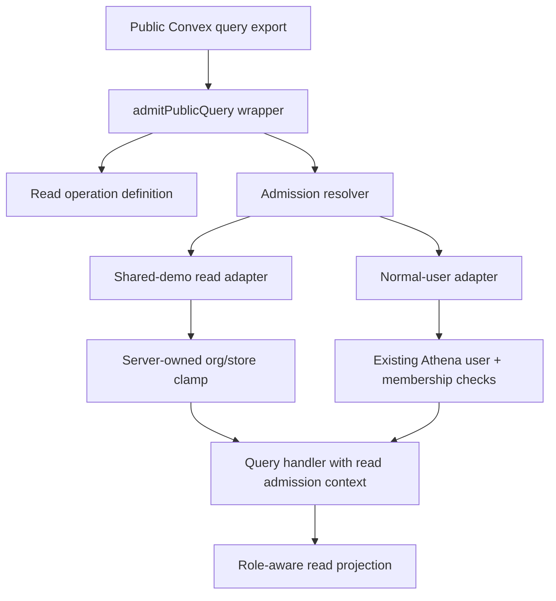
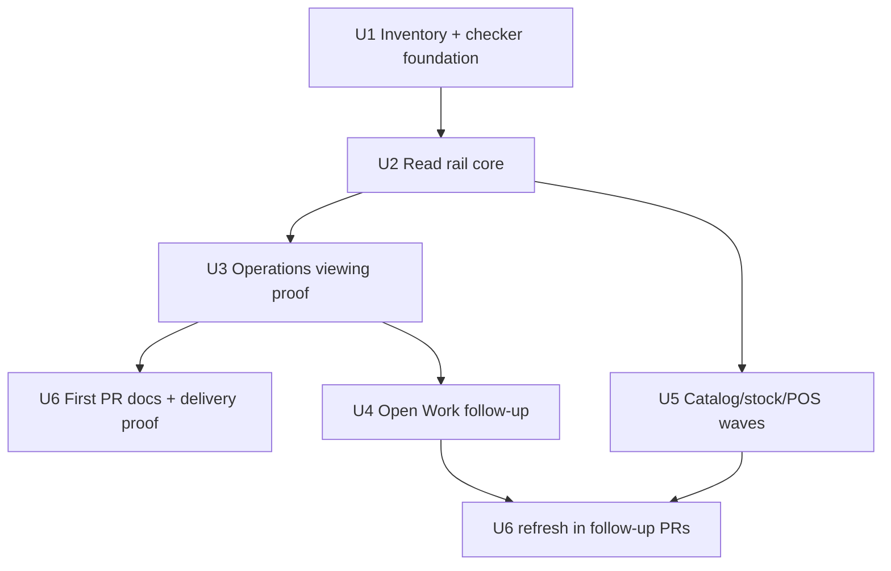

# Shared Demo Read Admission Rail

## Summary

Build a query-side counterpart to the operations admission rail for shared-demo reads, prove it first on the Operations viewing path, and leave a checker-backed inventory that drives follow-up onboarding waves. The first mergeable PR should land the rail, the complete non-reporting read inventory, and the Operations viewing proof; subsequent tracked work migrates the rest of the inventory onto the same rail.

---

## Problem Frame

The recently added operations admission rail made public writes actor- and operation-aware, but shared-demo reads still rely on scattered helper-level checks. Some Operations reads even use write-shaped capabilities such as `daily_operations.write` and `inventory.adjust`, which makes shared-demo viewing brittle and pushes policy back into generic auth helpers.

---

## Requirements

- R1. Create a shared-demo read admission rail for public Convex queries that resolves actor, store or organization scope, read intent, and provenance before query handlers read protected data.
- R2. Prove the rail on the Operations viewing path first, especially the Daily Operations public snapshot queries used by the shared-demo current-day experience.
- R3. Inventory every non-reporting shared-demo read surface that currently uses ad hoc demo checks and keep the inventory checker-backed until each surface is migrated.
- R4. Onboard inventoried non-reporting read surfaces after the proving path in bounded tracked waves, including Operations/Open Work, catalog and stock reads, POS shell reads, workflow evidence, storefront/order reads, and telemetry where applicable.
- R5. Preserve normal-user authorization, role-based projection, and store/org ownership behavior for every migrated query.
- R6. Keep reporting reads out of this work; the reporting workspace is hidden and its current `reports.read` bridge remains a separate concern.
- R7. Ensure recognized shared-demo denials, including wrong-store and expired-admission cases, do not fall through to normal auth.
- R8. Add structural and behavior tests that prove definitions are enforced at exported query boundaries, not only documented in a catalog.
- R9. Keep the first PR bounded to rail foundation, complete inventory, and Operations viewing proof so the proving path can become an open, mergeable PR without absorbing every migration wave.

---

## Scope Boundaries

- Do not migrate `packages/athena-webapp/convex/reporting/**`, `reports.read` bridges, or add new reporting read behavior.
- Do not broaden `packages/athena-webapp/convex/lib/athenaUserAuth.ts` to admit write capabilities as read bridges.
- Do not change shared-demo write admission, mutation effect policy, or restore write epoch behavior except where tests prove read and write rails remain separate.
- Do not change the product shape of Daily Operations history fixtures; this plan targets live current-day read access and query authorization.
- Do not turn Open Work into a source-workflow authority surface; it remains a queue and navigation/read surface.

### Deferred to Follow-Up Work

- Reporting read admission: separate plan if the hidden reporting workspace becomes visible again.
- Complete removal of low-level shared-demo read helpers: only after all follow-up waves prove no active callsites or future compatibility paths still need them. If helpers remain as lower-level adapter internals, public query callsites should no longer depend on them directly.
- Full inventory migration in one PR: intentionally split into follow-up tickets after the Operations viewing proof to avoid turning the proving path into a high-risk batch.
- Production browser walkthrough: execution may validate locally; production proof is outside the PR-only finish line unless explicitly requested later.

---

## Context & Research

### Relevant Code and Patterns

- `packages/athena-webapp/convex/operationAdmission/publicMutation.ts` wraps public mutations and injects `operationAdmission` before domain logic.
- `packages/athena-webapp/convex/operationAdmission/definitions.ts` declares public write operation metadata and validates capability, scope, readiness, and effects.
- `packages/athena-webapp/convex/sharedDemo/operationAdapter.ts` is the shared-demo write adapter pattern: resolve principal, clamp org/store, enforce policy, return provenance.
- `packages/athena-webapp/convex/sharedDemo/actor.ts` contains existing shared-demo actor and store-read helpers; the new rail should reuse the actor semantics but stop adding callsite-specific exceptions.
- `packages/athena-webapp/convex/lib/storeMemberAccess.ts` is the closest existing read-side pattern, especially `demoAccess: { kind: "read" }`.
- `packages/athena-webapp/convex/operations/dailyOperations.ts` is the proving path: `authorizeDailyOperationsSnapshot` currently uses write-shaped demo capability for read snapshots.
- `packages/athena-webapp/convex/operations/operationalWorkItems.ts` is the first Operations onboarding path after proof: Open Work queue reads currently use `inventory.adjust` as a read bridge.
- `scripts/convex-operation-admission-check.ts` is the structural checker pattern to mirror for public queries.

### Institutional Learnings

- `docs/solutions/architecture-patterns/athena-operation-admission-rail-2026-07-21.md`: definitions alone are not coverage; the exported public function must be wrapped and tested.
- `docs/solutions/architecture-patterns/shared-demo-principal-policy-and-restore-boundary-2026-07-12.md`: shared demo is a distinct principal with a server-owned org/store clamp, not generic administrator auth.
- `docs/solutions/architecture-patterns/athena-sku-activity-untrusted-sales-read-model-2026-07-04.md`: route gates are not security boundaries; public Convex reads need query-boundary authorization.
- `docs/solutions/security-issues/pos-public-surface-authz-and-rejected-sale-loss-2026-07-15.md`: public POS/Convex surfaces need per-endpoint authorization and cross-store denial tests.
- `docs/solutions/design-patterns/athena-shared-demo-operational-fixtures-2026-07-21.md`: demo history stays fixture-backed; live current-day operational viewing stays connected to real demo tenant state.

### External References

- None. Local Convex and admission patterns are strong enough for this repo-specific authorization work.

---

## Key Technical Decisions

- Use a query-side rail rather than generic auth expansion: read admission belongs at exported query boundaries, while `athenaUserAuth` should not learn write-shaped demo capability bridges.
- Prove on Operations viewing first: the Daily Operations landing/current-day snapshot path is the most visible shared-demo read experience and one helper reaches the full snapshot family.
- Model reads separately from writes: read admission should carry read intent/access kind, actor coverage, scope, and provenance, but not write readiness or protected effects.
- Treat expired or disabled shared-demo principals as recognized demo denials: once a demo principal is recognized, the rail must not fall through to normal-user auth.
- Preserve role-derived projections: migrated queries still use existing membership/role checks to decide full-admin versus POS-only data shape.
- Keep a legacy read inventory: any non-reporting public query with ad hoc shared-demo read behavior is either migrated to the rail or explicitly listed as legacy with a reason and wave.

---

## Open Questions

### Resolved During Planning

- Should Operations viewing or Open Work be the proving path? Operations viewing is the proving path; Open Work follows as the first onboarding wave.
- Should reporting reads be migrated? No. Reporting reads are explicitly excluded because that workspace is hidden.
- Should the plan use external research? No. The repo has a strong existing write rail and read helper patterns.

### Deferred to Implementation

- Exact names for read definition fields and wrapper helpers: implementation should follow local naming once the first tests clarify ergonomics.
- Exact checker parser shape: implementation should reuse the existing mutation checker approach where practical, but final AST details are execution-time work.
- Final onboarding count per wave: implementation should keep the checked inventory exact and may split waves further if tests show safer review boundaries.

---

## High-Level Technical Design

> *This illustrates the intended approach and is directional guidance for review, not implementation specification. The implementing agent should treat it as context, not code to reproduce.*

The rail mirrors the public-write structure enough for consistency, but keeps read semantics distinct. Read definitions should describe which query is being admitted, what scope it can read, and which actors can use it. They should not inherit mutation-only effects or write restore epoch behavior.

---

## Implementation Units

- U1. **Inventory and Checker Foundation**

**Goal:** Create the non-reporting public-query inventory and structural checker foundation that tracks ad hoc shared-demo read checks until migration is complete.

**Requirements:** R3, R6, R8

**Dependencies:** None

**Files:**
- Create: `packages/athena-webapp/convex/operationAdmission/readMigrationInventory.ts`
- Create: `scripts/convex-read-admission-check.ts`
- Create or modify: `scripts/convex-operation-admission-check.test.ts` or create `scripts/convex-read-admission-check.test.ts`
- Test: `packages/athena-webapp/convex/operationAdmission/migrationInventory.test.ts` or a new read inventory test

**Approach:**
- Discover public query exports structurally and classify non-reporting ad hoc shared-demo read callsites using exported `query(...)` boundaries plus helper usage such as `requireSharedDemoStoreReadIfApplicable`, `demoAccess: { kind: "read" }`, `getSharedDemoActorWithCtx`, and `sharedDemoCapability` inside query paths.
- Explicitly ignore reporting by both path and intent: `packages/athena-webapp/convex/reporting/**` and all `reports.read` bridges remain out of scope for this rail.
- Start with exact legacy entries for the inventory found during research: org/store shell, POS shell reads, workflow traces, product catalog, stock snapshots, SKU activity, Daily Close, Daily Operations automation policies, storefront orders, POS telemetry, POS catalog, POS transactions, cash controls including deposits, register activity, and closeouts, staff credentials, staff messages, cycle count drafts, and Open Work/Daily Operations.
- Add checker behavior that fails when a non-reporting public query uses an ad hoc shared-demo read check without either a read admission definition/wrapper or an exact legacy inventory entry.

**Execution note:** Characterization-first. Capture the current inventory as a failing or snapshot-style test before enforcing migrations.

**Patterns to follow:**
- `scripts/convex-operation-admission-check.ts`
- `packages/athena-webapp/convex/operationAdmission/migrationInventory.ts`
- `packages/athena-webapp/convex/operationAdmission/migrationInventory.test.ts`

**Test scenarios:**
- Happy path: a query listed in the read legacy inventory passes the checker while unmigrated.
- Error path: a public query with an ad hoc shared-demo read helper and no inventory entry fails with an actionable diagnostic.
- Error path: a public query with a read definition but no wrapper fails.
- Edge case: `packages/athena-webapp/convex/reporting/**` is ignored by the checker.
- Edge case: `reports.read` bridges outside `convex/reporting/**` are excluded by reporting intent and are not added to the read rail inventory.
- Integration: checker recognizes migrated query wrapper coverage and lets the inventory entry be removed.

**Verification:**
- The read inventory is exact, reporting is excluded, and the checker can distinguish legacy, migrated, and untracked query states.

---

- U2. **Read Admission Rail Core**

**Goal:** Add the query-side admission abstraction and shared-demo read adapter without changing any public query behavior yet.

**Requirements:** R1, R5, R7, R8

**Dependencies:** U1

**Files:**
- Create: `packages/athena-webapp/convex/operationAdmission/publicQuery.ts`
- Modify: `packages/athena-webapp/convex/operationAdmission/types.ts`
- Modify or create: `packages/athena-webapp/convex/operationAdmission/readDefinitions.ts`
- Create: `packages/athena-webapp/convex/operationAdmission/publicQuery.test.ts`
- Create or modify: `packages/athena-webapp/convex/operationAdmission/adapters.test.ts`
- Modify: `packages/athena-webapp/convex/sharedDemo/actor.ts`
- Create or modify: `packages/athena-webapp/convex/sharedDemo/readAdapter.test.ts`

**Approach:**
- Add read-specific definitions and a public query wrapper that injects read admission context into `QueryCtx`.
- Reuse shared-demo principal resolution and store/org clamp semantics from `sharedDemo/actor.ts`.
- Keep normal-user authorization behavior delegated to existing auth/member helpers rather than inventing a new role model.
- Treat recognized shared-demo expiry, disabled demo, wrong store, or denied actor as stable demo denials with no normal-auth fallback.
- Avoid mutation-only concepts such as protected effects and store-write epoch readiness.

**Execution note:** Test-first for wrapper sequencing, denial/fallback behavior, and context injection.

**Patterns to follow:**
- `packages/athena-webapp/convex/operationAdmission/publicMutation.ts`
- `packages/athena-webapp/convex/operationAdmission/adapters.ts`
- `packages/athena-webapp/convex/sharedDemo/operationAdapter.ts`
- `packages/athena-webapp/convex/lib/storeMemberAccess.ts`

**Test scenarios:**
- Happy path: a shared-demo read actor for the declared store receives admission context before the query handler runs.
- Happy path: a normal user still reaches existing member authorization.
- Error path: wrong-store shared-demo read is denied and the query handler is not invoked.
- Error path: expired shared-demo admission is denied as demo-specific and does not fall through to normal auth.
- Edge case: invalid read definition metadata fails before handler invocation.
- Integration: read admission context can be consumed by existing store-member access code without changing mutation admission context.

**Verification:**
- The core rail has unit coverage independent of any migrated query and does not regress existing operation admission tests.

---

- U3. **Operations Viewing Proving Path**

**Goal:** Migrate Daily Operations viewing queries to the read rail and prove the shared-demo current-day Operations path works through declared read admission.

**Requirements:** R2, R5, R7, R8, R9

**Dependencies:** U1, U2

**Files:**
- Modify: `packages/athena-webapp/convex/operations/dailyOperations.ts`
- Modify: `packages/athena-webapp/convex/operations/dailyOperations.test.ts`
- Modify or create: `packages/athena-webapp/convex/operationAdmission/readDefinitions.ts`
- Modify: `packages/athena-webapp/convex/operationAdmission/readMigrationInventory.ts`
- Optional test: `packages/athena-webapp/src/components/operations/DailyOperationsView.test.tsx`

**Approach:**
- Wrap the Daily Operations public snapshot query exports needed by the Operations viewing path with read admission definitions. At minimum, enumerate and classify:
  - `getDailyOperationsSnapshot`
  - `getDailyOperationsDetailSnapshot`
  - `getDailyOperationsWeekAnalyticsSnapshot`
  - `getDailyOperationsStorePulseSnapshot`
  - `getDailyOperationsStoreRequestsSnapshot`
  - `getDailyOperationsOpenRegisterSessionsSnapshot`
  - `getDailyOperationsAutomationSnapshot`
  - `getDailyOperationsTodayRefreshSnapshot`
  - `getDailyOperationsTimelineSnapshot`
  - `getDailyOperationsTimelinePreviewSnapshot`
- Migrate the current-day Operations viewing exports in the first PR and keep any non-viewing Daily Operations export in exact legacy inventory with a reason if implementation proves it is not part of the proving path.
- Replace the current `daily_operations.write` shared-demo read bridge in `authorizeDailyOperationsSnapshot`.
- Preserve existing full-admin versus POS-only projection behavior, including manager review and financial detail filtering.
- Remove migrated Daily Operations entries from the read legacy inventory once checker coverage proves wrapper installation.

**Execution note:** Test-first. Start by changing the existing shared-demo Daily Operations tests so they fail against the write-shaped bridge and pass only through read admission.

**Patterns to follow:**
- `packages/athena-webapp/convex/operations/dailyOperations.ts`
- `packages/athena-webapp/convex/operations/dailyClose.ts`
- `packages/athena-webapp/convex/lib/storeMemberAccess.ts`

**Test scenarios:**
- Happy path: shared-demo actor viewing the admitted store can load `getDailyOperationsSnapshot`.
- Happy path: role-derived manager evidence behavior remains unchanged for normal full-admin and POS-only users.
- Error path: shared-demo actor requesting a different store is denied before snapshot data is built.
- Error path: expired shared-demo principal gets demo-specific denial and no normal-auth fallback.
- Integration: all Daily Operations public snapshot exports that share `authorizeDailyOperationsSnapshot` are covered by read admission or an explicit reason.
- Integration: checker asserts migrated Daily Operations exports are wrapped at the exported query boundary, not only at an internal shared helper.
- Regression: no `daily_operations.write` shared-demo auth option remains in Daily Operations read authorization.

**Verification:**
- The Operations landing/viewing path is the first migrated and tested rail consumer, and each proving-path Daily Operations export is either wrapped directly or explicitly classified with a checker-backed reason.

---

- U4. **Open Work and Operations Queue Onboarding**

**Goal:** Migrate Open Work count and queue reads after the Operations viewing proof so the shared-demo queue path stops using `inventory.adjust` as a read bridge.

**Requirements:** R4, R5, R7, R8

**Dependencies:** U3; tracked follow-up after the first PR unless execution scope is explicitly expanded.

**Files:**
- Modify: `packages/athena-webapp/convex/operations/operationalWorkItems.ts`
- Modify: `packages/athena-webapp/convex/operations/operationalWorkItems.test.ts`
- Modify: `packages/athena-webapp/convex/operationAdmission/readDefinitions.ts`
- Modify: `packages/athena-webapp/convex/operationAdmission/readMigrationInventory.ts`

**Approach:**
- Add read definitions for Open Work summary and queue snapshot queries.
- Preserve Open Work as a sanitized aggregate/navigation surface; source workflow resolution stays in source modules and write-side operations admission.
- Remove the `inventory.adjust` shared-demo read bridge from Open Work read authorization.

**Execution note:** Test-first for the broken shared-demo queue read path and wrong-store denial.

**Patterns to follow:**
- `packages/athena-webapp/convex/operations/operationalWorkItems.ts`
- `packages/athena-webapp/convex/operations/openWorkInventoryReviews.ts`
- `docs/solutions/architecture-patterns/athena-open-work-resolution-ownership-2026-07-02.md`

**Test scenarios:**
- Happy path: shared-demo actor can read Open Work count and queue snapshot for the admitted store.
- Error path: wrong-store shared-demo read is denied before queue details are collected.
- Regression: normal-user role checks still allow full-admin and POS-only access as before.
- Regression: Open Work read migration does not alter synced-sale inventory review mutation admission.

**Verification:**
- Open Work queries are migrated off write-shaped read capabilities and removed from the read legacy inventory.

---

- U5. **Inventory, POS, Evidence, and Storefront Read Waves**

**Goal:** Onboard all remaining inventoried non-reporting ad hoc shared-demo read surfaces in bounded follow-up waves after the proving path is stable.

**Requirements:** R3, R4, R5, R6, R7, R8

**Dependencies:** U2, U3; tracked follow-up after the first PR unless execution scope is explicitly expanded.

**Files:**
- Modify: `packages/athena-webapp/convex/operationAdmission/readDefinitions.ts`
- Modify: `packages/athena-webapp/convex/operationAdmission/readMigrationInventory.ts`
- Modify/test as applicable:
  - `packages/athena-webapp/convex/inventory/organizations.ts`
  - `packages/athena-webapp/convex/inventory/stores.ts`
  - `packages/athena-webapp/convex/pos/public/terminals.ts`
  - `packages/athena-webapp/convex/pos/public/register.ts`
  - `packages/athena-webapp/convex/pos/public/customers.ts`
  - `packages/athena-webapp/convex/inventory/posSessionItems.ts`
  - `packages/athena-webapp/convex/workflowTraces/public.ts`
  - `packages/athena-webapp/convex/inventory/products.ts`
  - `packages/athena-webapp/convex/stockOps/adjustments.ts`
  - `packages/athena-webapp/convex/operations/skuActivity.ts`
  - `packages/athena-webapp/convex/operations/dailyClose.ts`
  - `packages/athena-webapp/convex/operations/dailyOperationsAutomation.ts`
  - `packages/athena-webapp/convex/storeFront/onlineOrder.ts`
  - `packages/athena-webapp/convex/pos/public/telemetry.ts`
  - `packages/athena-webapp/convex/pos/public/catalog.ts`
  - `packages/athena-webapp/convex/pos/public/transactions.ts`
  - `packages/athena-webapp/convex/cashControls/deposits.ts`
  - `packages/athena-webapp/convex/cashControls/closeouts.ts`
  - `packages/athena-webapp/convex/cashControls/registerSessionActivity.ts`
  - `packages/athena-webapp/convex/operations/staffCredentials.ts`
  - `packages/athena-webapp/convex/operations/staffMessages.ts`
  - `packages/athena-webapp/convex/stockOps/cycleCountDrafts.ts`

**Approach:**
- Migrate in tracked waves, removing exact inventory entries as each wave gains read definitions, wrappers, and tests.
- Wave order:
  - Wave 1 shell/POS read scaffolding already using `demoAccess: { kind: "read" }`.
  - Wave 2 demo-visible catalog, stock, SKU activity, workflow evidence, POS catalog, and cycle count reads.
  - Wave 3 Operations-adjacent and cash/POS financial reads: Daily Close, automation policy, transactions, cash controls, staff messages.
  - Wave 4 storefront/order and telemetry reads.
- Keep reporting excluded by checker and by test.

**Execution note:** Characterization-first per wave when existing behavior is unclear; test-first when the expected shared-demo read behavior is already clear.

**Patterns to follow:**
- `packages/athena-webapp/convex/sharedDemo/readBoundary.test.ts`
- `packages/athena-webapp/convex/sharedDemo/posStoreReadAccessCoverage.test.ts`
- Existing domain-specific test files listed above

**Test scenarios:**
- Happy path: each migrated wave admits shared-demo reads for the server-owned store.
- Error path: each migrated wave denies wrong-store reads.
- Error path: write-shaped shared-demo auth options are removed from migrated reads.
- Edge case: derived-store reads perform only the minimal parent lookup needed to derive scope before child data reads.
- Integration: checker inventory shrinks as each migrated query gains wrapper coverage.
- Regression: reporting remains excluded from read admission migration.

**Verification:**
- Each follow-up wave migrates its included non-reporting inventory entries, removes those exact entries from the legacy inventory, and covers them with wrapper/checker tests.

---

- U6. **Documentation, Durable Learning, and Delivery Proof**

**Goal:** Document the read rail pattern, update generated/review artifacts, and provide delivery evidence for the PR.

**Requirements:** R3, R6, R8, R9

**Dependencies:** U3 for the first PR; U4 and U5 for later onboarding PRs.

**Files:**
- Modify: `packages/athena-webapp/convex/operationAdmission/README.md`
- Create: `docs/solutions/architecture-patterns/athena-shared-demo-read-admission-rail-2026-07-22.md`
- Generated as needed: `graphify-out/**`
- Delivery report as needed: `docs/reports/**/*.html`

**Approach:**
- Explain the distinction between public-write operation admission and public-query read admission.
- Document the inventory/checker workflow and the reporting exclusion.
- Capture reusable learning for the first PR because this is a new authorization rail and migration pattern. Later onboarding PRs should refresh the learning only when they change the pattern.
- Keep delivery report and generated artifacts current if required by PR validation.

**Execution note:** Sensor-only for docs/generation after behavior is stable.

**Patterns to follow:**
- `docs/solutions/architecture-patterns/athena-operation-admission-rail-2026-07-21.md`
- `packages/athena-webapp/convex/operationAdmission/README.md`

**Test scenarios:**
- Test expectation: none for prose-only docs. Generated-artifact and report checks are covered by repo sensors.

**Verification:**
- Docs describe the new read rail, the checker passes, graphify is rebuilt, and merge-level validation accepts the final artifacts.

---

## System-Wide Impact

- **Interaction graph:** Public query exports, shared-demo principal resolution, store/member authorization helpers, and domain read helpers become connected through read admission context.
- **Error propagation:** Recognized shared-demo read denials should remain demo-specific and must not degrade into generic sign-in failures or normal-auth fallback.
- **State lifecycle risks:** Reads should not mutate restore state or require write epoch fences; they must respect active admission expiry and server-owned store scope.
- **API surface parity:** Query admission should mirror mutation admission structurally enough for maintainers to recognize it, but keep read and write semantics separate.
- **Integration coverage:** Checker coverage is required because callsite tests alone will not prove every definition is actually installed at exported query boundaries.
- **Unchanged invariants:** Normal-user membership checks, role projections, write admission, reporting read behavior, and hidden reporting workspace behavior remain unchanged.

---

## Risks & Dependencies

| Risk | Mitigation |
|------|------------|
| Read rail accidentally broadens shared-demo authority | Keep server-owned store/org clamp in adapter tests and deny recognized demo failures without fallback |
| Checker misses a public query class | Start with characterization inventory and negative fixtures modeled on the mutation checker |
| Migration wave becomes too large | First PR stops at rail foundation, complete inventory, and Operations viewing proof; remaining waves become tracked follow-up issues |
| Reporting reads get pulled into scope | Exclude `convex/reporting/**` and `reports.read` intent in checker and tests; keep reporting bridges untouched |
| Role-based projections regress | Add Daily Operations tests for normal full-admin/POS-only projections and demo store reads |
| Read and write admission semantics blur | Keep read definitions free of protected effects and store-write epoch readiness |

---

## Documentation / Operational Notes

- The PR should include a durable solution note because this establishes a reusable authorization migration pattern.
- Running `bun run graphify:rebuild` is required after code modifications.
- Merge-ready validation should use `bun run pr:athena` from the repo root.
- The first execution finish line is an open, mergeable PR for U1, U2, U3, and U6 documentation/delivery proof. U4 and U5 should be tracked from this plan and executed as follow-up onboarding work unless the user explicitly expands the first PR scope.

---

## Sources & References

- Related code: `packages/athena-webapp/convex/operationAdmission/publicMutation.ts`
- Related code: `packages/athena-webapp/convex/operationAdmission/definitions.ts`
- Related code: `packages/athena-webapp/convex/sharedDemo/operationAdapter.ts`
- Related code: `packages/athena-webapp/convex/operations/dailyOperations.ts`
- Related code: `packages/athena-webapp/convex/operations/operationalWorkItems.ts`
- Related checker: `scripts/convex-operation-admission-check.ts`
- Institutional learning: `docs/solutions/architecture-patterns/athena-operation-admission-rail-2026-07-21.md`
- Institutional learning: `docs/solutions/architecture-patterns/shared-demo-principal-policy-and-restore-boundary-2026-07-12.md`
