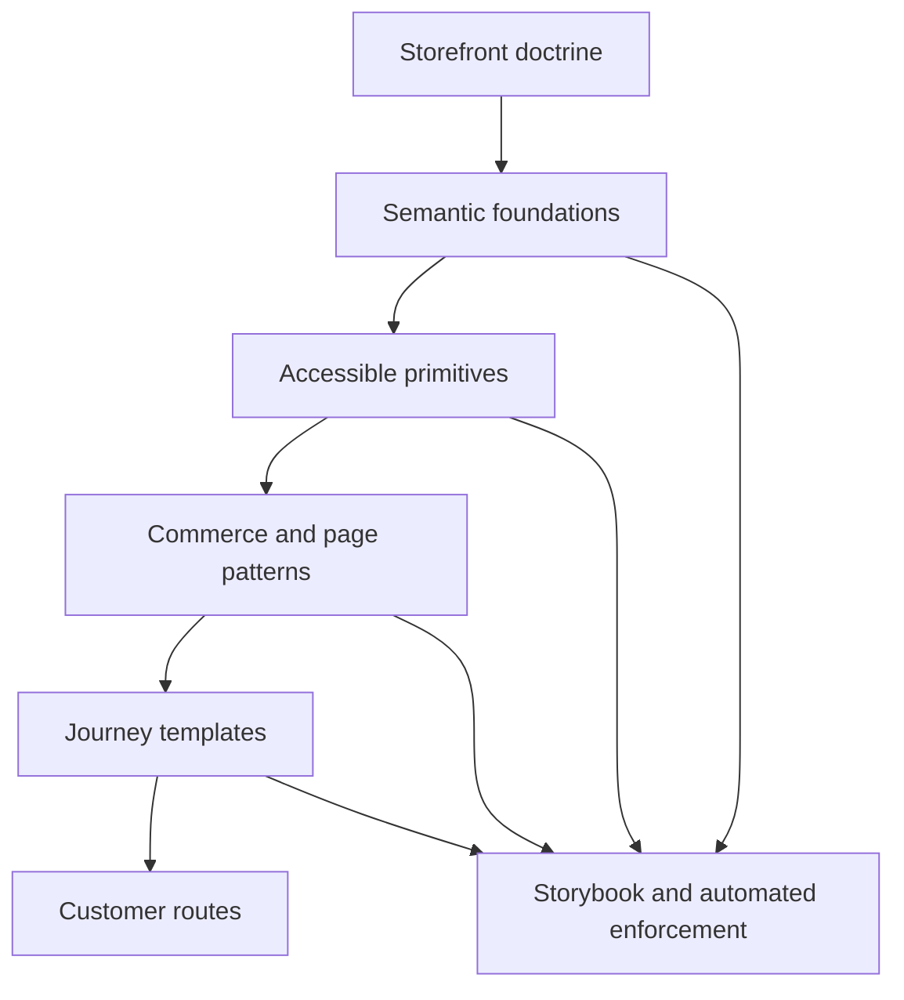
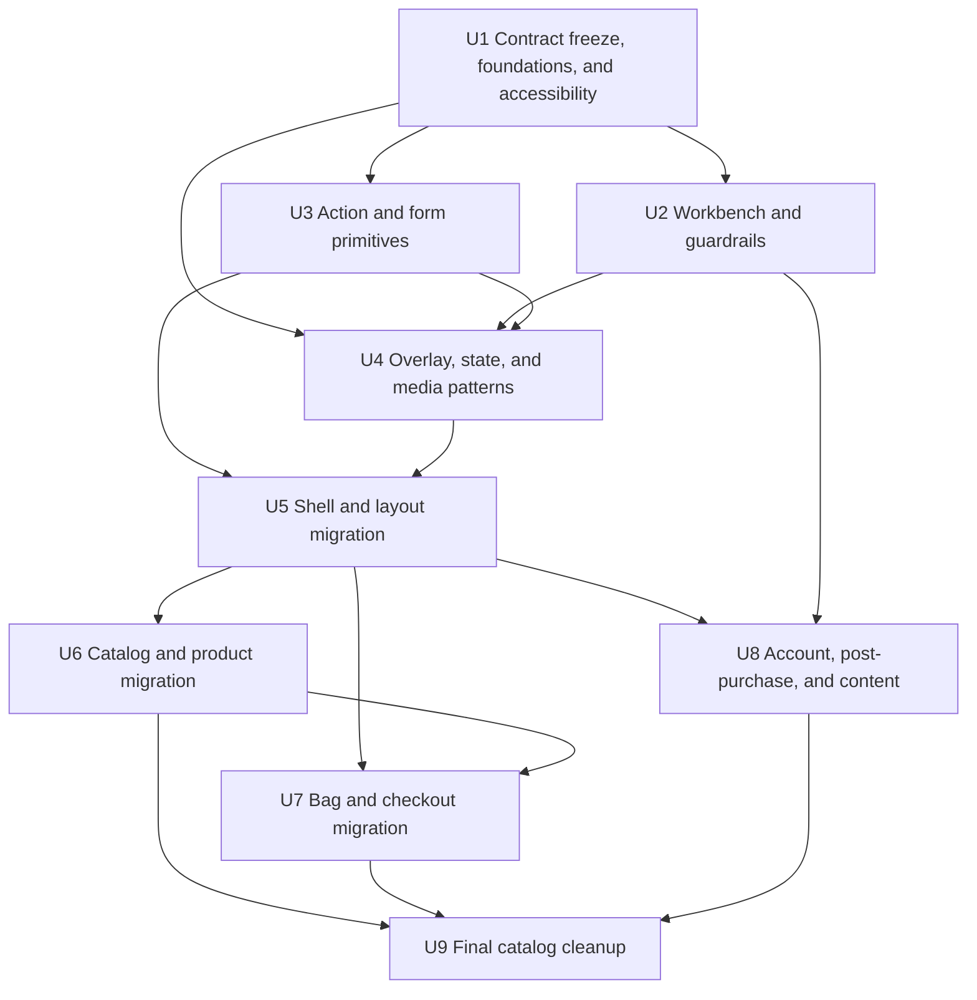
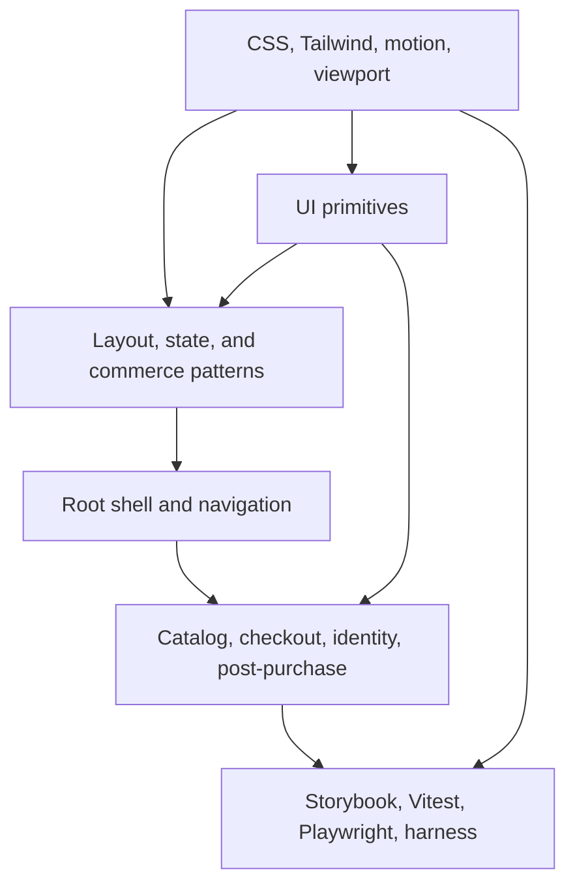

# refactor: Normalize the storefront design system

## Summary

Establish a storefront-local design system by turning the app's existing Tailwind, Radix, shadcn-style, CVA, and Framer Motion foundations into an authoritative layered system: customer-facing doctrine, semantic tokens, accessible primitives, commerce patterns, page templates, and automated enforcement. Migrate the app in journey order without importing Athena's operator visual language or changing storefront business behavior.

---

## Problem Frame

The storefront already contains 57 top-level UI primitive files and a partial CSS-variable theme, but neither is authoritative. Feature code routinely bypasses them with raw palette utilities, arbitrary dimensions, duplicated form and modal implementations, route-local spacing, and one-off motion. The audit found 44 repetitions of the implicit 1024px container, 247 arbitrary dimension/value utilities, 28 hardcoded hex occurrences, 59 blank or `null` async-state candidates, and 33 primitive filenames shared with Athena of which only 12 remain identical.

The drift is not only visual. The shipped viewport disables pinch zoom, central controls commonly remove focus outlines without a replacement, loading buttons do not fully disable while busy, manually built overlays lack a consistent focus contract, and widespread motion has no reduced-motion policy. Athena demonstrates the mature system shape the storefront lacks, but its operator density, shell, tokens, and page treatments are not appropriate for a customer-facing commerce app.

---

## Requirements

### Design authority

- R1. Define a storefront-specific design thesis and customer-facing usage rules covering typography, color, surfaces, density, imagery, motion, accessibility, copy, and responsive composition.
- R2. Make semantic storefront tokens the authority for color, typography, spacing, control height, radius, elevation, motion, container width, gutters, and focus treatment.
- R10. Treat the normalized storefront as light-first in this effort. Keep the token model theme-ready, but do not claim or ship an unverified dark theme.
- R11. Keep the system package-local until stable contracts reveal genuinely neutral cross-app primitives; reuse Athena's governance model, not its operator-specific values or components.

### UI and composition contracts

- R3. Conform the normalized storefront to WCAG 2.2 Level AA, including restored browser zoom, visible keyboard focus, accessible names, true disabled/loading behavior, reduced-motion behavior, and accessible overlay focus management; map design-system assertions to the applicable success criteria.
- R4. Curate and harden the existing primitive fork in place rather than publishing every file under `src/components/ui` as supported or introducing a second primitive directory.
- R5. Encode repeated storefront composition as reusable page, container, section, stack, grid, split-layout, and mobile-action patterns.
- R6. Provide consistent loading, empty, recoverable-error, terminal-error, disabled, and success states with safe customer copy and live-region behavior where appropriate.

### Migration compatibility

- R7. Migrate all customer journeys without changing route contracts, API behavior, telemetry, checkout persistence, payment behavior, or merchandising logic.
- R12. Preserve production readiness selectors, test IDs, URL/search contracts, store-config variation, currency/fulfillment behavior, and journey/failure telemetry timing throughout migration.
- R13. Preserve protected-route and object-access boundaries, and use only synthetic or redacted customer, order, receipt, checkout, authentication, and payment data in Storybook, screenshots, and retained browser artifacts.

### Workbench and enforcement

- R8. Create a single Storybook workbench organized as Guidance, Foundations, Primitives, Patterns, and Templates, with accessibility and interaction coverage enabled in the active configuration.
- R9. Add automated guardrails for token/config contracts, primitive behavior, accessibility, responsive layouts, and newly introduced raw visual values.

---

## Scope Boundaries

- No storefront rebrand or broad visual redesign.
- No direct adoption of Athena's token values, admin shell, `View` scrolling model, `PageLevelHeader` treatment, density defaults, or remote-assist metadata.
- No extraction of a shared cross-app UI package during normalization.
- No checkout, payment, catalog, rewards, order, authentication, analytics, or observability behavior changes.
- No dark-theme launch in this plan.
- Generated `src/routeTree.gen.ts` remains generated and is not edited directly.

### Deferred to Follow-Up Work

- A customer-facing dark theme: separate product and accessibility validation after the light-first system is stable.
- Cross-app package extraction: evaluate only after storefront and Athena primitive contracts converge through real usage.
- Broad brand or merchandising redesign: use the normalized system as the foundation for a separate design brief.

---

## Context & Research

### Relevant Code and Patterns

- `packages/storefront-webapp/src/index.css` is the current partial token source but mixes active tokens, inert dark-mode declarations, and competing form typography.
- `packages/storefront-webapp/tailwind.config.js` exposes base shadcn roles and historical `accent2` through `accent5` swatches rather than commerce intent.
- `packages/storefront-webapp/src/components/ui/button.tsx`, `loading-button.tsx`, `input.tsx`, `dialog.tsx`, and `modal.tsx` show the highest-value primitive contract gaps.
- `packages/storefront-webapp/src/components/navigation-bar/NavigationBar.tsx`, `MobileMenu.tsx`, and `src/routes/_layout/_shopLayout.tsx` expose shell, keyboard, and hand-built overlay drift.
- `packages/storefront-webapp/src/components/ProductCard.tsx`, `src/components/product-page/GalleryViewer.tsx`, and `ProductActions.tsx` are the core catalog/product specimens.
- `packages/storefront-webapp/src/components/checkout` contains duplicated field composition and is a compatibility-sensitive migration surface.
- `packages/storefront-webapp/docs/agent/route-index.md` enumerates 34 customer-facing route source files across shell, catalog, product, commerce, identity, post-purchase, content, receipt, and terminal state flows.
- `packages/athena-webapp/docs/agent/design.md`, `src/index.css`, `tailwind.config.js`, `src/components/ui`, and `src/stories` demonstrate the doctrine → foundations → primitives → patterns → templates → enforcement model.
- `packages/athena-webapp/src/components/ui/primitives.test.tsx`, `button.test.tsx`, and `src/design-system-build-config.test.ts` provide useful contract-test patterns.

### Institutional Learnings

- No prior storefront design-system solution or plan was found under `docs/solutions/` or `docs/plans/`; existing storefront learnings concern backend visibility and context-event boundaries.
- Existing storefront architecture docs require route, API, checkout, observability, and generated-router boundaries to remain intact.
- Athena's design system is a useful maturity reference but also demonstrates guardrails to improve: its active Storybook config does not enable the installed a11y addon, its dark theme suppresses visible focus rings, and doctrine alone has not prevented raw feature-level palette drift.

### External References

- W3C, [Web Content Accessibility Guidelines (WCAG) 2.2](https://www.w3.org/TR/WCAG22/) — normative Level AA accessibility baseline.
- Local architecture and design patterns remain the implementation precedent; WCAG supplies the independent conformance authority.

---

## Audit Findings

| Priority | Finding | Normalization response |
|---|---|---|
| P0 | Pinch zoom is disabled in both `index.html` and `src/routes/__root.tsx`. | Establish one document viewport authority and restore user scaling before visual migration. |
| P0 | Shared controls remove outlines without a reliable visible focus treatment. | Make focus-visible treatment a primitive contract and verify it by keyboard. |
| P0 | Navigation, gallery, bag, and saved-item actions include non-semantic or unnamed controls. | Migrate interactions to button/link primitives with names, hit targets, and keyboard behavior. |
| P0 | Critical routes often render blank/null loading states and expose no `aria-live`/`aria-busy` contract. | Introduce shared async/page-state patterns before route migration. |
| P1 | `accent2–5`, raw status hues, hex values, and hardcoded white/gray classes obscure intent. | Introduce semantic commerce roles and temporary migration aliases. |
| P1 | The app declares light/dark color scheme without a theme authority or complete dark tokens. | Explicitly ship light-first and remove misleading runtime claims while preserving a theme-ready model. |
| P1 | Button sizing, loading behavior, input sizing, dialog composition, and modal ownership conflict. | Separate primitive appearance, size, state, and feature-content responsibilities. |
| P1 | Page rhythm and responsive behavior are route-local; the 1024px container appears 44 times. | Encode storefront layout recipes and migrate the shell before features. |
| P1 | Motion uses many independent delays/durations and has no reduced-motion path. | Tokenize motion and provide a reduced-motion-aware reveal contract. |
| P2 | `components/ui` mixes supported primitives, unused inventory, and feature-specific commerce code. | Classify the catalog and relocate feature-owned content only when its consumers migrate. |
| P2 | Storybook, primitive tests, a11y workbench, and design-system config tests are absent. | Add one authoritative workbench and enforce the new contracts in CI/harness mappings. |

---

## Key Technical Decisions

| Decision | Rationale |
|---|---|
| Normalize the existing `components/ui` layer in place. | A wholesale directory move would create import churn without improving contracts. The curated catalog, tests, and docs establish authority. |
| Use storefront-local semantic values with Athena-compatible governance. | Customer commerce and operator workflows have different hierarchy, density, shell, and brand needs. |
| Make the system light-first but theme-ready. | The current `.dark` block is incomplete and has no application authority; removing the false promise is safer than expanding scope. |
| Keep legacy `accent2–5` aliases temporarily. | An alias-backed migration allows route-by-route conversion without a flag day; the aliases are removed only after usage reaches zero. |
| Put visual treatment in variants and geometry in size contracts. | This prevents Tailwind merge order from silently deciding button/control dimensions. |
| Separate primitives from commerce patterns. | Foundations and primitives must not import product data, routing, analytics, or feature state; product cards, checkout sections, and reward callouts remain patterns/features. |
| Build Storybook from one active config. | Athena's duplicated configs demonstrate the drift risk; accessibility tooling must be enabled where the package script actually points. |
| Migrate checkout after shell and catalog/product proving grounds. | Checkout is persistence- and payment-sensitive; earlier migrations should prove tokens, primitives, layout, and responsive behavior first. |
| Add enforcement during foundation work, not after migration. | Guardrails prevent new raw styles and accessibility regressions from accumulating while existing routes are being converted. |
| Freeze nonvisual contracts before visual migration. | Baseline state matrices, selectors, persisted state, telemetry, and route transitions prevent a design-system refactor from silently changing customer workflows. |
| Treat checkout storage as immutable unless explicitly versioned. | Normalizing fields must not change serialized shape; if a shape change becomes unavoidable, implementation pauses until a versioned migration and backward-compatibility test exist. |
| Preserve existing auth return paths in this refactor. | Designing new post-auth destinations is product behavior. Characterize current flows and file any ambiguity as follow-up rather than changing it during normalization. |
| Keep `index.html` as the sole viewport authority. | This package is a Vite SPA and does not render TanStack Router head content; the static document entry is the deterministic place for one scalable viewport declaration. |

---

## Visual and Interaction Direction

- **Visual thesis:** warm, image-led, refined commerce with quiet neutral surfaces, one recognizable brand/action accent, comfortable touch density, and typography that supports merchandise rather than competing with it.
- **Content hierarchy:** product and journey context first, price/status second, the next customer action third, and promotional detail only where it changes a decision.
- **Interaction policy:** fast feedback for controls, restrained standard transitions for state changes and overlays, no essential navigation hidden behind delay, and equivalent reduced-motion behavior.

---

## Open Questions

### Resolved During Planning

- **Copy Athena's visual system or only its operating model?** Reuse the operating model and conformance expectations; keep storefront values and commerce patterns local.
- **Create a new design-system directory?** No. Curate `components/ui`, add explicit storefront layout/state patterns, and avoid a second competing primitive layer.
- **Support dark mode now?** No. Codify light-first behavior and preserve a theme-ready token architecture.
- **Extract shared primitives now?** No. Normalize locally first and extract only after stable, genuinely identical contracts emerge.

### Deferred to Implementation

- **Which bundled font families and weights remain?** Confirm actual rendered brand needs and asset licensing/weight coverage while establishing typography; remove unused Martel assets only when confirmed unused.
- **Which currently unreferenced UI files are deleted versus retained as experimental?** Classify with import and Storybook evidence during catalog curation; deletion follows proof of no consumers.
- **Which raw-value cases require an approved exception?** Establish a narrow allowlist for receipt printing, media ratios, and browser-specific constraints while migrating.
- **Which visual snapshot service or storage strategy should be used?** Use the repository's existing browser tooling first; choose snapshot storage during Storybook/Playwright implementation without adding a hosted dependency by default.
- **Does the current auth return-to behavior contain a product defect?** Characterize rewards, checkout, saved-items, and review entry paths during U5/U8; preserve current behavior here and route any desired change to a separate product decision.

---

## High-Level Technical Design

> *This illustrates the intended approach and is directional guidance for review, not implementation specification. The implementing agent should treat it as context, not code to reproduce.*

The dependency direction is one-way. Routes and commerce features consume patterns and primitives; foundations and primitives never import route, product, checkout, analytics, or API state.

---

## Implementation Units

- U1. **Freeze contracts and establish doctrine, semantic foundations, and accessibility safety**

**Goal:** Record the nonvisual contracts that normalization must preserve, create one documented light-first storefront foundation, and fix the global accessibility contracts that every later unit depends on.

**Requirements:** R1, R2, R3, R7, R9, R10, R11, R12, R13

**Dependencies:** None

**Files:**
- Create: `packages/storefront-webapp/docs/agent/design.md`
- Create: `packages/storefront-webapp/docs/agent/design-system-migration-baseline.md`
- Create: `packages/storefront-webapp/docs/agent/design-system-artifact-policy.md`
- Create: `packages/storefront-webapp/src/design-system-build-config.test.ts`
- Create: `packages/storefront-webapp/src/lib/motion.ts`
- Create: `packages/storefront-webapp/src/lib/motion.test.ts`
- Modify: `packages/storefront-webapp/AGENTS.md`
- Modify: `packages/storefront-webapp/docs/agent/index.md`
- Modify: `packages/storefront-webapp/index.html`
- Modify: `packages/storefront-webapp/src/routes/__root.tsx`
- Modify: `packages/storefront-webapp/src/index.css`
- Modify: `packages/storefront-webapp/tailwind.config.js`
- Modify: `packages/storefront-webapp/components.json`
- Modify: `packages/storefront-webapp/src/components/ui/sonner.tsx`
- Modify: `packages/storefront-webapp/package.json`
- Modify: `packages/storefront-webapp/tests/e2e/storefront-boot.e2e.ts`

**Approach:**
- Define semantic roles for canvas/surfaces, brand/actions, selection, offer, success/warning/danger/info, inventory, border/input/focus, overlay, type, price/numerics, spacing, control heights, radius, elevation, motion, container width, gutters, and safe areas.
- Build a route-to-contract matrix for all 34 customer-facing route sources, recording reachable loading/failure/success/redirect states, persistence, selectors, telemetry, and the automated or captured baseline evidence for each before changing route presentation.
- Require synthetic fixtures, redact dynamic customer/order identifiers in captured evidence, prohibit secrets/payment/session tokens, and define access, deployment, and retention boundaries for Storybook and browser artifacts before capturing baselines.
- Retain historical accent aliases only as a migration bridge and mark them non-canonical in the design guide.
- Keep `index.html` as the sole viewport authority, remove the route-level viewport entry, and restore user scaling.
- Establish visible contrast-safe focus and reduced-motion contracts without inheriting Athena's dark-mode focus suppression.
- Map focus, contrast, reflow/zoom, naming, status, motion, authentication, error, and target-size assertions to applicable WCAG 2.2 AA success criteria; keep the storefront's 44×44 target as a stricter project rule where WCAG AA permits smaller targets or exceptions.
- Declare the storefront light-first and remove inert or misleading theme behavior; keep semantic token structure capable of a future theme.
- Make Sonner explicitly use the light theme during this effort and remove `next-themes` only after repository search proves it has no other storefront consumer.
- Correct the shadcn manifest and remove the stale HTML Tailwind style authority.

**Execution note:** Add foundation/config characterization assertions before changing token wiring and document behavior.

**Patterns to follow:**
- `packages/athena-webapp/docs/agent/design.md`
- `packages/athena-webapp/src/index.css`
- `packages/athena-webapp/tailwind.config.js`
- `packages/athena-webapp/src/design-system-build-config.test.ts`

**Test scenarios:**
- Happy path: the package build resolves every semantic Tailwind alias from the canonical CSS variables and the shadcn manifest points to the live stylesheet.
- Accessibility: the built document contains exactly one scalable viewport declaration, owned by `index.html`.
- Accessibility: keyboard focus uses a visible semantic focus treatment on light surfaces.
- Reduced motion: the motion helper returns equivalent immediate/non-translating behavior when reduced motion is requested.
- Edge case: legacy accent aliases continue to resolve during route migration without becoming documented canonical roles.
- Integration: the app boot path imports one global stylesheet and no stale HTML Tailwind block competes with it.
- Compatibility: all 34 route sources have a traceable baseline entry covering applicable readiness selectors, test IDs, route URLs/search parameters, state transitions, persistence, and telemetry.
- Privacy: committed and retained fixtures/screenshots contain no live customer data, secrets, payment/session tokens, or unredacted sensitive identifiers.

**Verification:**
- The design guide, CSS, Tailwind configuration, viewport, and contract tests agree on one foundation.
- New feature code can express storefront intent without raw palette names or arbitrary global layout values.

---

- U2. **Create the living workbench and design-system guardrails**

**Goal:** Make the system inspectable and keep new drift from entering while existing routes migrate.

**Requirements:** R1, R8, R9

**Dependencies:** U1

**Files:**
- Create: `packages/storefront-webapp/.storybook/main.ts`
- Create: `packages/storefront-webapp/.storybook/preview.ts`
- Create: `packages/storefront-webapp/src/stories/Guidance/Introduction.stories.tsx`
- Create: `packages/storefront-webapp/src/stories/Foundations/Overview.stories.tsx`
- Create: `packages/storefront-webapp/src/stories/Primitives/Overview.stories.tsx`
- Create: `packages/storefront-webapp/src/stories/Patterns/Overview.stories.tsx`
- Create: `packages/storefront-webapp/src/stories/Templates/Overview.stories.tsx`
- Create: `packages/storefront-webapp/src/stories/storybook-config.test.ts`
- Create: `packages/storefront-webapp/src/styles/design-system-policy.test.ts`
- Create: `packages/storefront-webapp/scripts/design-system-policy-changed.sh`
- Modify: `packages/storefront-webapp/package.json`
- Modify: `scripts/harness-app-registry.ts`
- Modify: `packages/storefront-webapp/docs/agent/testing.md`
- Modify: `packages/storefront-webapp/docs/agent/validation-map.json`

**Approach:**
- Use one package-local Storybook config and ensure the package scripts, tests, and harness all reference it.
- Enable accessibility in the active configuration and add interaction checks to stateful primitive/pattern stories.
- Start a curated catalog with explicit supported, experimental, feature-specific, deprecated, and removable statuses.
- Add a changed-file policy that rejects newly introduced raw hex, raw status hues, and unapproved arbitrary values outside foundation or allowlisted specialist files.
- Select committed, staged, unstaged, and untracked storefront files through a package-local changed-file script modeled on Athena's frontend lint script, then run the raw-value policy over that exact set.
- Prefer gradual enforcement against new/changed code over a repository-wide failing baseline.

**Patterns to follow:**
- `packages/athena-webapp/src/stories`
- `packages/athena-webapp/src/stories/storybook-config.test.ts`
- `packages/athena-webapp/scripts/frontend-lint-changed.sh`
- `scripts/harness-app-registry.ts`

**Test scenarios:**
- Happy path: Storybook builds Guidance, Foundations, Primitives, Patterns, and Templates from the same semantic foundations as the app.
- Accessibility: the active Storybook configuration runs the a11y addon and reports violations for intentionally invalid fixtures.
- Edge case: deprecated or feature-specific components are not presented as supported primitives.
- Guardrail: a new raw hex/status hue in a normal feature file fails policy while a documented specialist allowlist remains possible.
- Integration: harness review maps foundation, primitive, story, and config changes to package tests, build, and Storybook build.

**Verification:**
- Contributors have one documented design workbench and one validation path.
- New visual debt is blocked while the legacy baseline remains migratable.

---

- U3. **Harden action and form primitive contracts**

**Goal:** Make buttons, links, icon actions, loading states, fields, selection controls, and validation consistently accessible and predictable.

**Requirements:** R2, R3, R4, R9

**Dependencies:** U1

**Files:**
- Create: `packages/storefront-webapp/src/components/ui/icon-button.tsx`
- Create: `packages/storefront-webapp/src/components/ui/field.tsx`
- Create: `packages/storefront-webapp/src/components/ui/primitives.test.tsx`
- Create: `packages/storefront-webapp/docs/agent/design-system-consumer-inventory.md`
- Create: `packages/storefront-webapp/tests/e2e/storefront-primitive-compatibility.e2e.ts`
- Modify: `packages/storefront-webapp/src/components/ui/button.tsx`
- Modify: `packages/storefront-webapp/src/components/ui/loading-button.tsx`
- Modify: `packages/storefront-webapp/src/components/ui/input.tsx`
- Modify: `packages/storefront-webapp/src/components/ui/textarea.tsx`
- Modify: `packages/storefront-webapp/src/components/ui/select.tsx`
- Modify: `packages/storefront-webapp/src/components/ui/checkbox.tsx`
- Modify: `packages/storefront-webapp/src/components/ui/radio-group.tsx`
- Modify: `packages/storefront-webapp/src/components/ui/form.tsx`
- Modify: `packages/storefront-webapp/src/components/ui/label.tsx`

**Approach:**
- Keep visual hierarchy in semantic variants and geometry/typography in size/density variants.
- Make loading state native-disabled, busy-announced, repeat-safe, dimensionally stable, and named.
- Require icon-only actions to carry accessible names and a minimum touch target.
- Set a 44×44 CSS-pixel minimum interactive area for standalone controls, icon buttons, and mobile actions; document a narrow exception for inline text links.
- Consolidate field label, hint, validation, required, disabled, and error semantics.
- Keep mobile control text at a zoom-safe size while allowing deliberate desktop density.
- Inventory every consumer of the modified primitives, record its current prop/state contract, and cover each still-unmigrated journey family with a compatibility smoke path before shared changes merge.

**Execution note:** Implement primitive contract tests before migrating any route consumers.

**Patterns to follow:**
- `packages/athena-webapp/src/components/ui/button.tsx`
- `packages/athena-webapp/src/components/ui/form.tsx`
- `packages/athena-webapp/src/components/ui/primitives.test.tsx`

**Test scenarios:**
- Happy path: each button variant and size produces a non-conflicting semantic treatment and stable geometry.
- Accessibility: every interactive primitive displays focus, supports keyboard activation, exposes disabled state, and retains a useful accessible name.
- Loading: a loading action sets native disabled and busy state, ignores repeat activation, and does not change width.
- Form: visible labels, help text, validation messages, `aria-invalid`, and descriptions remain associated across input, textarea, select, checkbox, and radio controls.
- Edge case: icon-only, destructive, selected, compact, and full-width controls keep at least a 44×44 CSS-pixel interactive area, except documented inline text links.
- Integration: React Hook Form consumers continue to receive the same value and validation behavior.
- Compatibility: catalog, checkout, authentication, account, and post-purchase smoke paths continue to render and operate through their existing primitive call patterns before those routes migrate.

**Verification:**
- Route code no longer needs to invent focus, loading, hit-area, label, or validation behavior.

---

- U4. **Normalize overlays, async states, feedback, and media**

**Goal:** Establish consistent modal/drawer behavior, customer-safe state presentation, status language, and image handling.

**Requirements:** R2, R3, R4, R6, R9

**Dependencies:** U1, U2, U3

**Files:**
- Create: `packages/storefront-webapp/src/components/states/PageState.tsx`
- Create: `packages/storefront-webapp/src/components/states/PageState.test.tsx`
- Create: `packages/storefront-webapp/docs/agent/design-state-and-overlay-matrix.md`
- Create: `packages/storefront-webapp/src/stories/Patterns/StatesAndOverlays.stories.tsx`
- Create: `packages/storefront-webapp/src/components/ui/status-badge.tsx`
- Create: `packages/storefront-webapp/src/components/ui/inline-alert.tsx`
- Create: `packages/storefront-webapp/src/components/ui/storefront-image.tsx`
- Create: `packages/storefront-webapp/src/components/ui/overlay-contract.test.tsx`
- Modify: `packages/storefront-webapp/src/components/ui/dialog.tsx`
- Modify: `packages/storefront-webapp/src/components/ui/modal.tsx`
- Modify: `packages/storefront-webapp/src/components/ui/sheet.tsx`
- Modify: `packages/storefront-webapp/src/components/ui/badge.tsx`
- Modify: `packages/storefront-webapp/src/components/ui/skeleton.tsx`
- Modify: `packages/storefront-webapp/src/components/states/empty/empty-state.tsx`
- Modify: `packages/storefront-webapp/src/components/states/error/ErrorBoundary.tsx`
- Modify: `packages/storefront-webapp/src/components/DefaultCatchBoundary.tsx`
- Modify: `packages/storefront-webapp/docs/agent/design-system-consumer-inventory.md`
- Modify: `packages/storefront-webapp/tests/e2e/storefront-primitive-compatibility.e2e.ts`

**Approach:**
- Collapse overlapping dialog/modal presentation flags into one primitive contract; keep upsell, review, and welcome-back content feature-owned.
- Standardize loading, empty, recoverable error, terminal error, unavailable, and success states, including live-region/busy behavior.
- Define a template-family state-content matrix that records every reachable state, full-page versus inline presentation, title/body ownership, primary and secondary actions, and announcement behavior.
- Define an overlay matrix for navigation, bag, filters, dialogs, sheets, and feature modals that records allowed dismissal inputs, initial focus, return-focus target, scroll ownership, and route-change teardown while preserving existing domain outcomes.
- Normalize backend failures before display and never surface raw thrown text to customers.
- Create semantic status treatments for order/payment, reward, inventory, review, and error contexts.
- Consolidate fallback, aspect ratio, responsive sizes, informative/decorative alt behavior, and error-loop protection in one image primitive.
- Extend the consumer inventory and compatibility smoke paths for every modified overlay, state, feedback, and media primitive before merging their new shared contracts.

**Execution note:** Characterize focus restoration and existing terminal-state routing before changing overlay and state composition.

**Patterns to follow:**
- `packages/storefront-webapp/src/components/states/error/ErrorBoundary.tsx`
- `packages/athena-webapp/src/components/ui/dialog.tsx`
- `packages/athena-webapp/src/components/ui/sheet.tsx`

**Test scenarios:**
- Accessibility: opening and closing dialog/sheet traps focus, supports Escape where allowed, restores focus, and names its title/description once.
- Async state: loading announces busy without a blank viewport; empty and recoverable errors offer the intended destination/action; terminal errors do not imply recovery.
- Content matrix: each catalog, product, bag, checkout, auth, customer, and content template state has explicit presentation, copy ownership, actions, and announcement behavior.
- Overlay matrix: Escape, outside interaction, explicit close, navigation, and unmount follow the documented rule for each overlay family.
- Error path: raw backend or thrown error text is normalized into safe storefront copy while diagnostic reporting remains intact.
- Status: success, warning, danger, info, low inventory, and out-of-stock treatments remain distinct by text/icon as well as color.
- Image: failed media uses a fallback once, preserves aspect ratio, avoids layout shift, and cannot recurse through failure.
- Edge case: decorative images remain silent while product/order images have meaningful context-specific alternatives.

**Verification:**
- Shared overlay, state, feedback, and media behavior replaces route-local implementations without changing domain outcomes.

---

- U5. **Normalize the global shell and responsive page composition**

**Goal:** Encode the storefront's implicit page rhythm and migrate navigation, footer, auth, and shared layout ownership.

**Requirements:** R3, R5, R7, R9, R13

**Dependencies:** U3, U4

**Files:**
- Create: `packages/storefront-webapp/src/components/common/StorefrontPage.tsx`
- Create: `packages/storefront-webapp/src/components/common/StorefrontPage.test.tsx`
- Create: `packages/storefront-webapp/src/contexts/NavigationBarProvider.test.tsx`
- Create: `packages/storefront-webapp/tests/e2e/storefront-shell.e2e.ts`
- Modify: `packages/storefront-webapp/src/routes/__root.tsx`
- Modify: `packages/storefront-webapp/src/routes/_layout.tsx`
- Modify: `packages/storefront-webapp/src/components/navigation-bar/NavigationBar.tsx`
- Modify: `packages/storefront-webapp/src/components/navigation-bar/MobileMenu.tsx`
- Modify: `packages/storefront-webapp/src/components/navigation-bar/BagMenu.tsx`
- Modify: `packages/storefront-webapp/src/components/navigation-bar/navBarStyles.ts`
- Modify: `packages/storefront-webapp/src/contexts/NavigationBarProvider.tsx`
- Modify: `packages/storefront-webapp/src/components/HomePage.tsx`
- Modify: `packages/storefront-webapp/src/components/auth/Auth.tsx`
- Modify: `packages/storefront-webapp/src/components/shopping-bag/ShoppingBag.tsx`
- Modify: `packages/storefront-webapp/src/components/checkout/CheckoutProvider.tsx`
- Modify: `packages/storefront-webapp/src/contexts/StoreContext.tsx`
- Modify: `packages/storefront-webapp/src/routes/_layout/_shopLayout.tsx`
- Modify: `packages/storefront-webapp/src/routes/shop/receipt/-PosReceiptPage.tsx` (shell visibility contract only; visual normalization remains U8-owned)
- Modify: `packages/storefront-webapp/src/components/footer/Footer.tsx`
- Modify: `packages/storefront-webapp/src/routes/login.tsx`
- Modify: `packages/storefront-webapp/src/routes/signup.tsx`
- Modify: `packages/storefront-webapp/src/routes/auth.verify.tsx`
- Modify: `packages/storefront-webapp/docs/agent/validation-map.json`

**Approach:**
- Encode container widths, gutters, safe areas, page/section stacks, grids, split layouts, and mobile action offsets in shared composition primitives.
- Replace route-mounted shell mutations with a declarative state contract covering homepage overlay, fixed browsing/account, checkout treatment, banner, desktop submenu/bag, mobile menu/bag/filter, and scroll visibility.
- Migrate every current `setNavBarLayout`, `setAppLocation`, `hideNavbar`, and `showNavbar` call site to that contract in U5; only shell-state ownership changes here, while the feature's visual migration remains in its later journey unit.
- Preserve normal document flow and avoid importing Athena's nested workspace scroll shell.
- Replace clickable spans/paragraphs and hand-built overlays with semantic controls and the normalized overlay layer.
- Give every route one meaningful heading/landmark hierarchy; prevent nested `main` landmarks.
- Remove delayed invisibility from essential navigation and ensure route-driven navbar state is derived without post-render mutation flicker.
- Use dynamic viewport units only where full-height ownership is intentional.
- Prove the shell matrix in a real browser and map the spec through the storefront validation/harness boundary.

**Execution note:** Characterize shell route transitions and auth redirects before changing layout ownership.

**Patterns to follow:**
- The repeated `container mx-auto max-w-[1024px]` convention across current storefront routes
- `packages/athena-webapp/src/components/common/PageLevelHeader.tsx` for centralized rhythm concepts only

**Test scenarios:**
- Keyboard: desktop nav, submenu, bag menu, mobile drawer, sign-out, and footer links are reachable, named, operable, and return focus correctly.
- Responsive: 320, 375/390, 767/768, 1024, 1279/1280, and wide desktop widths preserve gutters, avoid auth overflow, and keep navigation/actions reachable.
- Semantics: each route has one `main` and one meaningful `h1`; the brand mark does not compete as the page heading.
- Reduced motion: navigation and route content remain immediately available without delayed opacity.
- Integration: route transitions preserve current app-location/navbar behavior without a one-frame stale layout.
- Integration: route change or unmount while any overlay is open restores body scroll, focus, navbar visibility, and the correct destination shell state.
- Security: unauthenticated direct entry, session expiry, and logout followed by back/forward navigation never render protected account content while existing redirects resolve.
- External links: new-tab links include safe relationship attributes.

**Verification:**
- Shell and auth flows use shared composition and interaction contracts with no route, redirect, or navigation regressions.

---

- U6. **Migrate catalog and product discovery**

**Goal:** Apply the system to home, catalog, filters, cards, product detail, gallery, variants, reviews, and mobile actions.

**Requirements:** R2, R3, R5, R6, R7, R9

**Dependencies:** U5

**Files:**
- Modify: `packages/storefront-webapp/src/components/HomePage.tsx`
- Modify: `packages/storefront-webapp/src/components/home`
- Modify: `packages/storefront-webapp/src/components/ProductsPage.tsx`
- Modify: `packages/storefront-webapp/src/components/ProductCard.tsx`
- Modify: `packages/storefront-webapp/src/components/filter`
- Modify: `packages/storefront-webapp/src/routes/_layout/_shopLayout.tsx`
- Modify: `packages/storefront-webapp/src/routes/_layout/_shopLayout/shop/$categorySlug/index.tsx`
- Modify: `packages/storefront-webapp/src/routes/_layout/_shopLayout/shop/$categorySlug/$subcategorySlug.tsx`
- Modify: `packages/storefront-webapp/src/components/product-page`
- Move: `packages/storefront-webapp/src/components/ui/modals/UpsellModal.tsx` and related form/success files to a merchandising-owned modal boundary under `packages/storefront-webapp/src/components/home`
- Move: `packages/storefront-webapp/src/components/ui/modals/WelcomeBackModal.tsx` and related form/success/config/animation files to a home/customer-engagement boundary under `packages/storefront-webapp/src/components/home`
- Create: `packages/storefront-webapp/src/stories/Templates/CatalogProduct.stories.tsx`
- Create: `packages/storefront-webapp/docs/agent/design-system-fit-review.md`
- Test: `packages/storefront-webapp/src/components/ProductCard.test.tsx`
- Test: `packages/storefront-webapp/src/components/product-page/ProductPage.test.tsx`
- Test: `packages/storefront-webapp/src/components/product-page/ProductActions.test.tsx`
- Test: `packages/storefront-webapp/src/components/home/HomeHero.test.tsx`

**Approach:**
- Introduce stable commerce patterns for product grid/card, price, offer/inventory status, gallery, variant selection, review summary, and mobile action bar.
- Replace raw pink/gray/status values and one-off dimensions with semantic roles and responsive recipes.
- Make gallery thumbnails and variant selectors true named controls.
- Resolve tablet implicit-grid and hardcoded gallery viewport risks.
- Keep product selection, discount, inventory, tracking, image fallback, and navigation behavior unchanged.
- Share product state/action components across the mobile and desktop presentations so the 767/768px boundary cannot produce divergent behavior.
- Document the completed catalog/product responsive and merchandise-state matrices in `CatalogProduct.stories.tsx` before checkout migration begins; U6 owns product-detail review display under `components/product-page`, not order-linked review submission.
- Record a fit review after U6 that counts compatibility variants, policy exceptions, route-local overrides, and duplicated compositions, then requires an explicit revise-or-proceed decision before U7.
- The implementing lead owns the fit decision. Revision is mandatory for unresolved P0/P1 accessibility failures, undocumented policy exceptions, unowned compatibility variants, or duplicated compositions that change behavior across breakpoints; proceeding requires every remaining deviation to have an owner and removal unit.

**Test scenarios:**
- Happy path: home/category/subcategory cards, pricing, discounts, inventory states, gallery, variant selection, and add/save actions retain current domain behavior.
- Accessibility: gallery, variants, filters, reviews, and mobile actions are keyboard-operable, named, focused, and announced.
- Responsive: grids, gallery, filters, and sticky/mobile actions work at 320, 375, 768, 1024, and 1440px without implicit columns or overflow.
- Edge case: hidden SKU/product, empty category, invalid/empty filters, zero-price promotion, multiple colors, stale inventory, and breakpoint transitions retain correct availability and action behavior.
- State matrix: loading, empty catalog, failed media, sold out, low inventory, offer, disabled action, and recoverable request error use canonical patterns.
- Reduced motion: essential product information/actions are visible immediately and nonessential reveals collapse appropriately.
- Integration: journey/analytics events continue to fire from the same customer actions.

**Verification:**
- Catalog and product routes are the first complete storefront template family documented in Storybook and proven in the running app.
- The fit review demonstrates that the semantic model survived a real journey, or records the required foundation/primitive revision before checkout starts.

---

- U7. **Migrate bag, checkout, and payment terminal states**

**Goal:** Normalize the conversion-critical journey after the system has been proven on lower-risk routes.

**Requirements:** R2, R3, R5, R6, R7, R9

**Dependencies:** U5, U6

**Files:**
- Modify: `packages/storefront-webapp/src/components/shopping-bag`
- Modify: `packages/storefront-webapp/src/components/checkout`
- Modify: `packages/storefront-webapp/src/routes/shop/bag.index.tsx`
- Modify: `packages/storefront-webapp/src/routes/shop/checkout`
- Modify: `packages/storefront-webapp/src/components/states/checkout-expired/CheckoutExpired.tsx`
- Modify: `packages/storefront-webapp/src/components/states/checkout unavailable/CheckoutUnavailable.tsx`
- Test: `packages/storefront-webapp/src/components/shopping-bag/ShoppingBag.test.tsx`
- Test: `packages/storefront-webapp/src/components/checkout/Checkout.test.tsx`
- Test: `packages/storefront-webapp/src/components/checkout/deriveCheckoutState.test.ts`
- Test: `packages/storefront-webapp/src/components/checkout/checkoutStorage.test.ts`
- Test: `packages/storefront-webapp/src/components/checkout/schemas/checkoutSchemas.test.ts`
- Test: `packages/storefront-webapp/src/api/checkoutSession.test.ts`

**Approach:**
- Converge duplicated customer, delivery, and billing field stacks on U3 without altering schemas or persisted shapes.
- Freeze the current checkout storage shape. If implementation cannot preserve it, add an explicit schema version, migration policy, and backward-compatibility coverage before shipping the affected form change.
- Normalize bag line items, quantity/delete/save actions, checkout sections, order summary, trust signals, promo feedback, and mobile/desktop control density.
- Replace blank bootstrap states and nine near-duplicate terminal states with canonical state recipes while preserving route distinctions.
- Keep session identifiers, storage keys/shapes, delivery/POD/payment logic, redirect decisions, telemetry, and verification recovery unchanged.
- Preserve distinct verification, missing-reference, timeout, webhook-pending, canceled, incomplete, finalization-failed/retry, POD, missing-session, completed, and expired outcomes rather than collapsing their domain semantics into one generic result.
- Remove multi-second staged reveals and infinite demand animation when reduced motion is requested.

**Execution note:** Begin with checkout storage, derive-state, route-boundary, and repeat-submit characterization coverage; migrate one checkout section at a time.

**Test scenarios:**
- Happy path: bag edit → checkout bootstrap → customer/delivery/billing → payment/POD → pending/verification → complete remains behaviorally identical.
- Persistence: pre-migration stored checkout data resumes correctly and new UI writes the same supported schema.
- Fulfillment: pickup/delivery switches, country/region fee changes, waiver-threshold crossings, store restrictions, signed-in prefill, and section edits preserve derived state and validation timing.
- Repeat safety: loading submit controls prevent pointer and keyboard repeat activation.
- Error path: expired, canceled, incomplete, unavailable, verification-recovery, promo failure, payment failure, and network failure reach the correct canonical state without raw backend copy.
- Idempotency: direct entry, refresh, back/forward, verification retry, and order-finalization retry never duplicate payment or order mutations.
- Responsive: mobile bag summary, checkout controls, sticky actions, split desktop summary, keyboard visibility, and safe areas work across target widths.
- Accessibility: quantity, save/delete, selects, form errors, summaries, dialogs, and terminal status changes are named and announced.
- Integration: checkout observability and journey events retain current semantics and ordering.

**Verification:**
- Existing checkout behavior tests and mapped harness scenarios pass with no storage, payment, redirect, or observability contract change.

---

- U8. **Migrate account, post-purchase, and content routes**

**Goal:** Complete lower-risk account, post-purchase, and content route coverage independently of checkout, and regression-check the auth routes migrated in U5.

**Requirements:** R2, R3, R4, R5, R6, R7, R8, R9, R11, R13

**Dependencies:** U2, U5

**Files:**
- Modify: `packages/storefront-webapp/src/routes/_layout/account.tsx`
- Modify: `packages/storefront-webapp/src/routes/_layout/rewards.index.tsx`
- Modify: `packages/storefront-webapp/src/routes/_layout/_ordersLayout/shop/orders`
- Modify: `packages/storefront-webapp/src/components/rewards`
- Modify: `packages/storefront-webapp/src/components/saved-items`
- Modify: `packages/storefront-webapp/src/components/product-reviews`
- Move: `packages/storefront-webapp/src/components/ui/modals/LeaveAReviewModal.tsx` and related form/config files to a product-review-owned modal boundary under `packages/storefront-webapp/src/components/product-reviews`
- Modify: `packages/storefront-webapp/src/routes/_layout/contact-us.tsx`
- Modify: `packages/storefront-webapp/src/routes/_layout/policies`
- Modify: `packages/storefront-webapp/src/routes/shop/receipt/-PosReceiptPage.tsx`
- Modify: `packages/storefront-webapp/src/components/states/maintenance`
- Modify: `packages/storefront-webapp/src/components/states/not-found`
- Create: `packages/storefront-webapp/src/stories/Templates/CustomerJourneys.stories.tsx`
- Create: `packages/storefront-webapp/tests/e2e/storefront-customer-routes.e2e.ts`
- Test: `packages/storefront-webapp/src/components/product-reviews/OrderItem.test.tsx`
- Test: `packages/storefront-webapp/src/components/states/maintenance/Maintenance.test.tsx`

**Approach:**
- Apply page, state, status, image, action, form, and typography patterns to account, orders, rewards, saved items, reviews, policies, contact, receipt, maintenance, and not-found. Checkout terminal states remain U7-owned.
- Characterize and preserve current post-auth destinations and partial guest-ownership transfer behavior; do not invent a new return-to policy in this refactor.
- Treat login, signup, and verification presentation as U5-owned. U8 regression-tests their OTP, redirect, and ownership-transfer behavior while owning order-linked post-purchase review submission under `components/product-reviews`.
- Preserve receipt-printing constraints through a documented specialist style boundary rather than forcing normal page tokens onto it.
- Fix route headings, raw status hues, image alternatives, external-link safety, and async states.

**Execution note:** Use changed-route characterization and visual snapshots before deleting legacy aliases or unused inventory.

**Test scenarios:**
- Happy path: login/account, saved items, order list/detail/review, rewards, policy/contact, receipt, maintenance, and not-found routes retain navigation and domain behavior.
- Identity: OTP auto-submit/resend/expiry, authenticated redirects, guest-rewards email prefill, partial ownership-transfer failure, and existing return paths remain stable.
- Authorization: unauthenticated direct entry, mid-session expiry, logout then back/forward, and cross-account order or tokenized receipt identifiers never expose protected content; existing API denials and redirect behavior remain unchanged wherever those boundaries currently apply.
- State matrix: each route has visible loading, empty, recoverable error, terminal error, disabled, and success behavior where applicable.
- Accessibility: one route heading, one main landmark, named actions, safe links, meaningful media alternatives, visible focus, and live async feedback.
- Status: order/payment/reward/review states use semantic text and icon cues rather than raw color alone.
- Guardrail: migrated customer routes introduce no new legacy accent alias, raw status hue, forbidden arbitrary value, or unowned native control outside documented exceptions.
- Integration: storefront boot and representative end-to-end navigation cover all template families.

**Verification:**
- Account, post-purchase, and content routes use the documented system and can ship without waiting on checkout migration.

---

- U9. **Finalize the catalog and remove proven legacy paths**

**Goal:** Curate the supported component catalog and remove migration aliases, unused copies, and dead assets only after every journey migration proves zero live consumers.

**Requirements:** R2, R4, R8, R9, R11

**Dependencies:** U2, U6, U7, U8

**Files:**
- Modify: `packages/storefront-webapp/src/components/ui`
- Modify: `packages/storefront-webapp/src/components/states`
- Modify: `packages/storefront-webapp/src/index.css`
- Modify: `packages/storefront-webapp/tailwind.config.js`
- Modify: `packages/storefront-webapp/src/assets/fonts`
- Modify: `packages/storefront-webapp/README.md`
- Modify: `packages/storefront-webapp/docs/agent/design.md`
- Modify: `packages/storefront-webapp/src/stories`
- Test: `packages/storefront-webapp/src/styles/design-system-policy.test.ts`
- Test: `packages/storefront-webapp/src/design-system-build-config.test.ts`
- Test: `packages/storefront-webapp/tests/e2e/storefront-boot.e2e.ts`

**Approach:**
- Classify every UI file as supported, experimental, feature-specific, deprecated, or removable based on imports, stories, and migrated usage.
- Remove only proven unused copies, dashboard-derived skeletons, unused font assets, native-control bypasses, temporary accent aliases, and policy allowlist entries whose usage has reached zero.
- Verify that every supported file remaining under `components/ui` imports no route, API, query, telemetry, or feature state; feature-owned modals and patterns must have moved to their owning journey boundary.
- Update the Storybook catalog, design guide, README, and generated harness mapping to reflect the final supported surface.
- Keep deletions in a distinct rollback boundary from route migrations.

**Execution note:** Use repository search, contract tests, template snapshots, and boot coverage before each destructive removal.

**Patterns to follow:**
- `packages/athena-webapp/docs/agent/design.md`
- `packages/athena-webapp/src/stories`

**Test scenarios:**
- Guardrail: no live source imports a file classified as removable or a deleted compatibility alias.
- Dependency boundary: supported `components/ui` files have no route, API, query, telemetry, or feature-state imports.
- Integration: every supported primitive and pattern has a Storybook specimen and the package build resolves no deleted asset or style token.
- Regression: storefront boot and representative template stories remain stable after catalog cleanup.
- Edge case: documented receipt/media/browser exceptions remain narrow and continue to pass policy validation.

**Verification:**
- The supported catalog matches real usage, all temporary migration mechanisms have zero consumers, and cleanup can be reverted without reverting route migrations.

---

## System-Wide Impact

- **Interaction graph:** Global tokens and primitive contracts affect every route; shell layout affects all normal document-flow pages; state and overlay patterns cross catalog, checkout, auth, and post-purchase.
- **Error propagation:** API errors continue through existing query and route boundaries, but customer presentation must pass through safe state/feedback patterns while observability retains diagnostic detail.
- **State lifecycle risks:** Checkout persistence, repeat submit, overlay scroll lock/focus restoration, route-driven navbar state, image fallback loops, and delayed motion can regress without characterization.
- **API surface parity:** Component prop contracts may require temporary compatibility variants during migration; route, query, API, telemetry, and generated-router contracts remain unchanged.
- **Integration coverage:** Unit tests cannot prove keyboard traversal, focus restoration, responsive breakpoints, checkout recovery, Storybook configuration, or visual regressions; browser and harness coverage is required.
- **Unchanged invariants:** Product availability/discount selection, bag math, checkout schemas/storage, payment redirects, auth redirects, order/reward data, analytics, context events, observability selectors, and backend ownership remain unchanged.

---

## Phase Gates

| Gate | Required evidence before proceeding |
|---|---|
| Contract freeze → foundations | All 34 route-to-contract entries and their synthetic or redacted baseline evidence are complete, including applicable states, redirects, persistence, selectors, URLs/search parameters, and telemetry, before route presentation changes. |
| Foundations → primitives | Viewport zoom restored; token/config tests pass; focus and reduced-motion contracts documented; light-first theme authority is unambiguous. |
| Primitives → shell | Action/form/overlay/state contract tests cover keyboard, names, loading, focus restoration, and safe errors; active Storybook config runs a11y. |
| Shell → catalog/product | Target viewport matrix passes; declarative shell modes and overlay teardown are proven; navigation has no delayed hidden state or route-transition flicker; landmarks/headings are valid. |
| Catalog/product → checkout | Product discovery is a complete Storybook template; a fit review inventories compatibility variants, policy exceptions, route-local overrides, and duplicated compositions; an explicit revise-or-proceed decision confirms whether the system is ready for checkout. |
| Checkout compatibility | Storage/derive-state/API tests and checkout behavior scenarios pass; fulfillment transitions, terminal route distinctions, direct-entry/refresh idempotency, repeat-submit safety, and observability are preserved. |
| All journey migrations → cleanup | U6, U7, and U8 evidence is complete; repository search and policy tests prove legacy aliases, copied states, unused primitives, and fonts have no live consumers before U9 removal. |

---

## Risks & Dependencies

| Risk | Mitigation |
|---|---|
| A visual-normalization PR becomes an accidental redesign. | Lock the visual thesis and semantic roles first; migrate behavior-preservingly and use before/after route snapshots. |
| Token renames cause a flag-day migration. | Keep temporary aliases and enforce semantic roles only for new/changed code until each route family lands. |
| Primitive changes regress every consumer at once. | Add contract tests first, preserve temporary compatibility variants, and migrate in journey phases. |
| Checkout styling changes alter validation, storage, redirects, or repeat-submit behavior. | Characterize schemas, storage, derive state, session API, and harness scenarios before conversion; migrate checkout last among core journeys. |
| Accessibility work is reduced to static linting. | Require keyboard traversal, focus restoration, live-region, reduced-motion, contrast, and viewport evidence in Storybook/browser tests. |
| Storybook drifts from the shipped app. | Use the same global stylesheet/aliases and one active config; protect package scripts and config with tests. |
| Athena coupling spreads into the customer surface. | Reuse governance patterns only; reject operator-specific tokens, shell, density, and page components. |
| Raw-value enforcement blocks specialist surfaces. | Use a narrow documented allowlist for receipt/media/browser constraints, reviewed as exceptions rather than general escape hatches. |
| Component cleanup deletes latent behavior. | Classify inventory, search imports, snapshot relevant stories, and delete only after migration usage reaches zero. |

---

## Phased Delivery

### Phase 1 — Safety and authority

- U1 establishes doctrine, tokens, viewport, focus, theme, and motion foundations.
- U2 creates the active workbench and changed-code enforcement.

### Phase 2 — Reusable contracts

- U3 hardens action and form primitives.
- U4 normalizes overlays, feedback, async states, and media.

### Phase 3 — Shell and parallel route proving

- U5 migrates the global shell, navigation, auth, and page composition.
- After U5, U6 completes the catalog/product template family while U8 independently migrates account/post-purchase/content routes and regression-checks U5 auth flows.

### Phase 4 — Conversion-critical migration

- U7 migrates bag, checkout, payment recovery, and terminal states behind explicit compatibility gates.

### Phase 5 — Catalog finalization

- U9 curates the supported catalog, removes only zero-consumer legacy paths, and finalizes documentation and workbench coverage.

---

## Success Metrics

- Zero shipped viewport declarations that block user scaling.
- Every supported interactive primitive has visible focus, keyboard behavior, accessible naming, and correct disabled/loading semantics.
- WCAG 2.2 AA criteria applicable to the normalized surface are mapped to automated and manual evidence, with no unresolved conformance failures.
- Every main route family has visible, consistent async states and no blank-screen loading contract.
- New/changed feature code introduces no unapproved raw hex, raw status hue, or arbitrary global layout value.
- The repeated 1024px container/gutter/page rhythm is owned by named composition primitives rather than route-local class strings.
- Storybook builds from one active configuration with accessibility checks and includes all five maturity layers.
- Storefront route, checkout, API, telemetry, observability, and behavior tests remain unchanged in outcome.
- Shell modes, overlay teardown, route/search contracts, selectors, and checkout persistence remain compatible with the recorded baseline.
- Temporary accent aliases and unsupported component inventory reach zero live consumers before removal.

---

## Documentation / Operational Notes

- Add `packages/storefront-webapp/docs/agent/design.md` to the package's required UI workflow and keep it aligned with tokens, Storybook, and supported primitives.
- Update generated harness docs and validation mappings through their normal generation path when design-system surfaces are added.
- Capture representative mobile/tablet/desktop screenshots for each template family as migration evidence.
- Use synthetic fixtures and the documented artifact policy for every Storybook, screenshot, video, and browser trace; do not retain customer data, secrets, or payment/session tokens.
- Keep customer copy calm, clear, and commerce-specific; normalize raw backend wording before display.
- After each implementation checkpoint, rebuild Graphify because code files will have changed.

---

## Sources & References

- `graphify-out/GRAPH_REPORT.md`
- `graphify-out/wiki/packages/storefront-webapp.md`
- `packages/storefront-webapp/AGENTS.md`
- `packages/storefront-webapp/docs/agent/architecture.md`
- `packages/storefront-webapp/docs/agent/route-index.md`
- `packages/storefront-webapp/docs/agent/testing.md`
- `packages/storefront-webapp/src/index.css`
- `packages/storefront-webapp/tailwind.config.js`
- `packages/storefront-webapp/src/components/ui`
- `packages/athena-webapp/docs/agent/design.md`
- `packages/athena-webapp/src/index.css`
- `packages/athena-webapp/tailwind.config.js`
- `packages/athena-webapp/src/components/ui`
- `packages/athena-webapp/src/stories`
- [W3C WCAG 2.2](https://www.w3.org/TR/WCAG22/)
