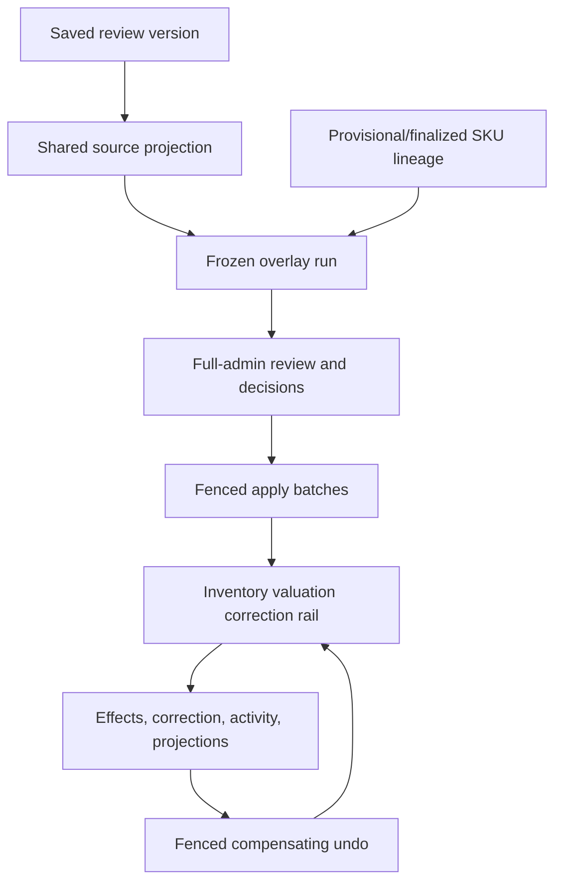
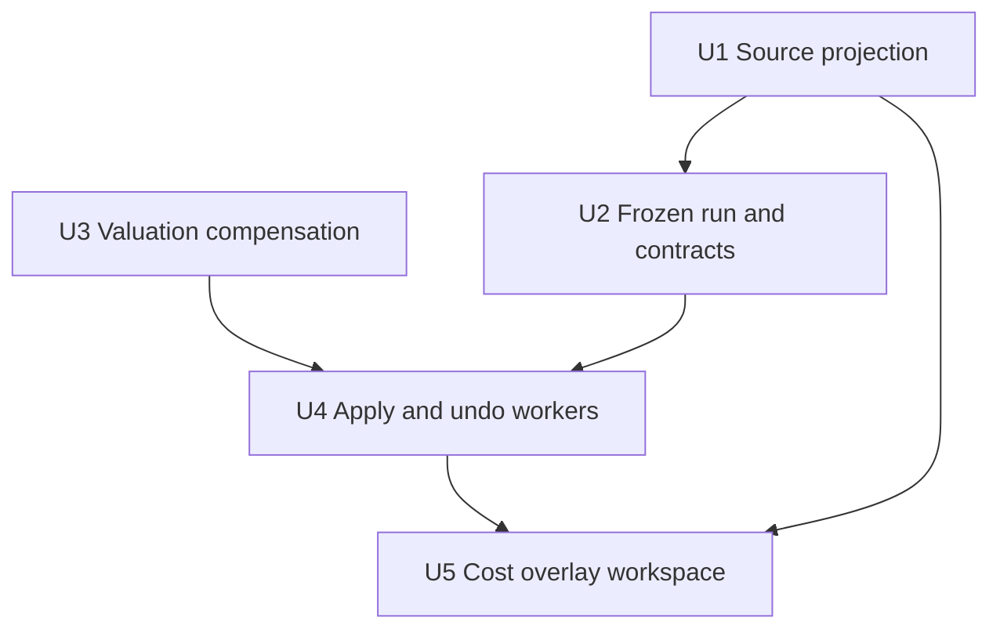
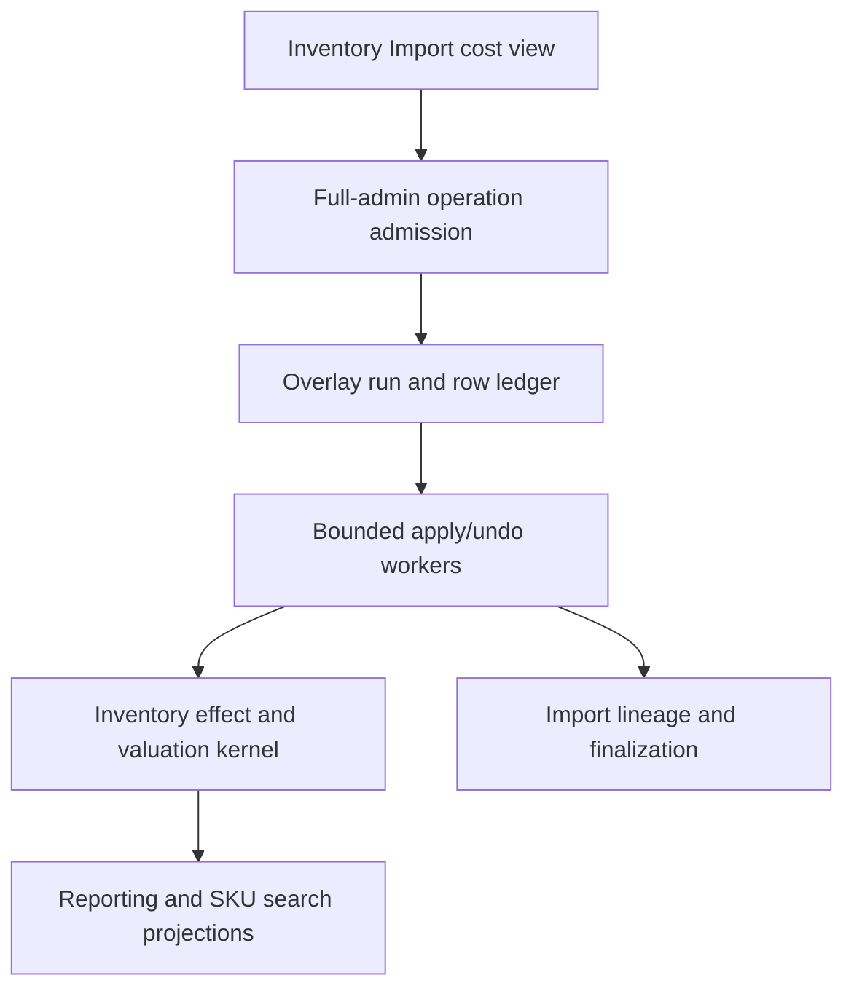

# feat: Add inventory import cost overlay

## Summary

Extend Inventory Import with a focused full-admin cost-overlay workflow that
freezes one saved source column, reviews one durable decision per anchored SKU,
and applies or compensates valuation changes through Athena's existing
inventory-effect rails. Keep the implementation domain-specific: share the
current parser and review primitives, add only the run state needed for bounded
apply/undo, and avoid a generic backfill framework or broad workspace rewrite.

---

## Problem Frame

Legacy rows are already anchored to Athena SKUs, but their source cost is not
consistently represented in current valuation. The current review workspace can
match and persist onboarding decisions, while the reporting inventory kernel
can record prospective valuation corrections; neither currently preserves an
operator-selected arbitrary source column or coordinates large, resumable,
undoable cost-overlay runs. See origin:
`docs/brainstorms/2026-07-28-inventory-import-cost-overlay-requirements.md`.

---

## Requirements

### Access and workspace

- R1. Add a dedicated full-admin Cost overlay mode inside Inventory Import,
  preserving existing source-review interaction patterns.

### Source freeze and review

- R2. Freeze the currently loaded review version, selected source column,
  normalized cost evidence, and run-wide selection before apply.
- R3. Treat source values as store-currency major units; preserve zero and
  distinguish missing and invalid values.
- R4. Preview anchored provisional and trusted/finalized SKUs with their legacy
  and Athena costs, lifecycle, decision, and eligibility.
- R5. Preselect rows with a valid source cost and missing Athena cost. Source
  cells that are missing or invalid are ineligible; known differing Athena
  costs require an explicit overwrite decision.

### Apply and valuation

- R6. Apply every selected run row through bounded resumable work, continuing
  past isolated stale, deficit-blocked, or invalid exceptions.
- R7. Revalue current on-hand inventory and future cost accounting without
  changing stock, availability, price, identity, lifecycle, or historical sale
  facts.
- R8. Preserve an applied cost on active provisional lineage so later
  finalization cannot silently lose it.

### Evidence and undo

- R9. Preserve durable source, actor, decision, progress, pre/post valuation,
  correction, and outcome evidence with idempotent replay/conflict behavior.
- R10. Provide run-level compensating undo that restores the exact safe
  pre-overlay valuation basis for rows that still match their post-apply
  fingerprint, continues past stale rows, and cannot cross or duplicate apply
  work. Undo is explicitly best-effort compensation, not a global rollback
  guarantee while normal store activity continues.

**Origin actors:** A1 (full administrator), A2 (Athena valuation system)

**Origin flows:** F1 (select and preview), F2 (review and apply), F3 (undo)

**Origin acceptance examples:** AE1-AE6

---

## Scope Boundaries

- Do not rewrite historical sale cost or profit.
- Do not add manager-elevation access to cost data.
- Do not alter stock, availability, selling price, catalog identity, or
  onboarding lifecycle through apply or undo.
- Do not add arbitrary source mappings beyond cost.
- Do not add per-row undo.
- Do not build a reusable cross-domain backfill framework.
- Do not repair the existing active-with-`finalizedAt` lifecycle inconsistency;
  classify those rows correctly and defer lifecycle cleanup.
- Do not rewrite `InventoryImportView.tsx`; extract only primitives directly
  shared by the new focused view.

---

## Context & Research

### Relevant Code and Patterns

- `packages/athena-webapp/src/lib/inventory-import/inventoryImportParser.ts`
  owns lenient CSV/JSON parsing and major-to-minor money normalization but
  currently discards arbitrary source-column identity and invalid raw cells.
- `packages/athena-webapp/src/components/operations/InventoryImportView.tsx`
  provides source loading, URL-backed review filters, pagination, bulk
  decisions, autosave, and update-apply dirty protection.
- `packages/athena-webapp/convex/inventory/catalogImport.ts` owns review-version
  hydration, provisional/trusted lineage, stale fingerprints, finalization, and
  import operation events.
- `packages/athena-webapp/convex/schemas/inventory/inventoryImportProvisionalSku.ts`
  preserves exact review version, source row, SKU anchors, imported evidence,
  sale evidence, and finalization evidence for active and finalized rows.
- `packages/athena-webapp/convex/reporting/inventory/effects.ts` is the sole
  direct writer of SKU cost and already records idempotent prospective
  corrections, inventory effects, position revisions, source references, SKU
  activity, and projection work.
- `packages/athena-webapp/convex/reporting/inventory/valuation.ts` owns valuation
  invariants, including deficit rejection. The existing unit-cost correction
  cannot restore a prior mixed costed/uncosted basis exactly.
- `packages/athena-webapp/convex/operationAdmission/` provides admitted public
  query/mutation wrappers, resource scope, readiness, and capability policy.

### Institutional Learnings

- `docs/solutions/architecture/athena-inventory-import-review-version-2026-06-07.md`:
  freeze saved review evidence, keep execution independent of UI pagination,
  and use bounded child documents for payloads.
- `docs/solutions/architecture/athena-pos-provisional-import-trust-boundary-2026-06-10.md`:
  provisional rows own source evidence; they do not independently establish
  trusted stock.
- `docs/solutions/architecture/athena-product-page-single-sku-provisional-trusted-finalization-2026-06-23.md`:
  use explicit lineage, source and trusted fingerprints, validation before
  writes, and request-key replay/conflict behavior.
- `docs/solutions/architecture/athena-reporting-fact-projection-boundary-2026-07-09.md`:
  valuation facts and compatibility state commit atomically; projection
  rollback is not fact compensation.
- `docs/solutions/architecture-patterns/athena-operation-admission-rail-2026-07-21.md`:
  exported public operations must be admitted at runtime, with server-derived
  scope and explicit batch policy.
- `docs/solutions/logic-errors/athena-money-inputs-minor-units-2026-04-23.md`:
  normalize once at the boundary, persist integers, reject invalid precision,
  and preserve legitimate zero.

### External References

- None. Athena has direct, recent local patterns for every relevant technical
  boundary; external research would not improve the plan.

---

## Key Technical Decisions

- **One frozen row per anchored SKU:** Materialize run rows server-side so
  confirmation and work scope are independent of browser pages and filters.
  Source rows resolving to one SKU with the same normalized cost coalesce with
  visible provenance; conflicting costs block that SKU before confirmation.
- **Shared source projection, not a second parser:** Add a pure raw-source
  representation consumed by the existing import adapter and by exact saved
  review hydration. Freeze column identity, projection version, cell outcome,
  and digest when the run is created.
- **Bounded by the saved-review envelope:** Run construction uses one internal
  Node-runtime action in a dedicated `"use node"` module. It reads payload
  chunks individually, parses the complete source within the existing
  34 chunks below 256 KiB each (8 MiB aggregate cap), and calls internal
  queries/mutations in the
  normal overlay module to commit deterministic projection rows in bounded
  transactions. Resumption may reparse the capped source and continues writes
  from the persisted cursor; no streaming parser or second source format is
  introduced.
- **Domain-specific run ledger:** Add a small run document plus indexed row
  documents. This is necessary for selection, bounded progress, exceptions,
  replay, and undo, but is not generalized for other backfills.
- **Existing correction for apply; exact-basis sibling for undo:** Apply reuses
  the current SKU valuation correction with unchanged counts. Undo uses a
  narrowly scoped sibling inside the same inventory-effect boundary that
  validates and restores the frozen costed quantity, uncosted quantity, known
  cost pool, currency, and SKU cost while appending new evidence.
- **Fenced lifecycle:** Every scheduled batch carries a monotonic operation
  epoch and expected direction. Requesting undo closes apply/retry admission
  before compensation begins; stale queued work exits without writes.
- **Server-authorized durable continuation:** Full-admin access is checked on
  every public value-bearing read and command. Confirmation freezes actor and
  store authority for internal continuation; later role revocation blocks
  reads and new commands without corrupting already-authorized work.
- **Explicit provisional overlay provenance:** Preserve selected overlay cost
  separately from original imported cost evidence, then make both finalization
  paths respect the latest valid overlay provenance. A later deliberate product
  correction makes undo stale rather than being silently overwritten.
- **Strict money states:** Parsing distinguishes missing, valid zero, invalid
  syntax, negative, excess precision, and out-of-range values. No truthiness or
  client-submitted normalized amount establishes authority.
- **Narrow financial checkpoints:** Before construction, require acknowledgment
  of the exact review/column and its meaning as store-currency unit cost. Before
  confirm apply, present the Prepared run's sealed selected-row count, aggregate
  on-hand valuation before/after, and largest SKU-level changes; do not add a
  generic anomaly-scoring system.
- **Narrow UI extraction:** Create a focused view and extract only source
  loading, search/filter/pagination, autosave, and dirty-state primitives that
  are materially shared.

---

## Open Questions

### Resolved During Planning

- **How is an exact source frozen?** Persist exact review version, original
  column identity/ordinal or JSON path, projection version, normalized cell
  outcome, and a source digest on the run/row ledger.
- **How are duplicate anchors handled?** Coalesce identical normalized costs by
  SKU; block conflicting costs before confirmation.
- **What is stale?** A mismatch in SKU ownership/cost/counts, valuation
  position/version/basis, source lineage/digest, or provisional lifecycle
  fingerprint.
- **How does undo restore mixed valuation?** Append an exact-target basis
  correction inside the existing reporting inventory-effect boundary.
- **What happens after role revocation?** New reads and commands fail; a
  previously confirmed internal run continues under its immutable authority.
- **Can undo exceptions be retried later?** Exact replay may resume interrupted
  work, but rows skipped because state changed later are terminal for that undo
  request.
- **Does undo require a quiet store?** No. It previews currently compensable and
  stale counts, then safely restores only rows that still match at write time.
  Normal activity may reduce the restorable set and is reported, not overwritten.

### Deferred to Implementation

- Select the smallest safe batch size by measuring the actual read/write/event
  footprint in focused worker tests; do not inherit an unrelated repair limit.
- Final helper and type names may change while preserving the boundaries in
  this plan.
- Choose the smallest shared UI primitive boundary after adding
  characterization tests around current review behavior.

---

## High-Level Technical Design

> *This illustrates the intended approach and is directional guidance for
> review, not implementation specification. The implementing agent should treat
> it as context, not code to reproduce.*

Directional run lifecycle:

```mermaid
stateDiagram-v2
  [*] --> Draft
  Draft --> Ready: bounded construction complete
  Draft --> Abandoned: abandon
  Ready --> Preparing: prepare confirmation; close decisions
  Preparing --> Prepared: manifest and impact sealed
  Preparing --> Preparing: resume interrupted preparation
  Prepared --> Ready: revise; invalidate manifest
  Ready --> Abandoned: abandon
  Prepared --> Abandoned: abandon
  Prepared --> Applying: confirm apply
  Applying --> Applied: no exceptions
  Applying --> AppliedWithExceptions: terminal exceptions
  Applying --> Applying: resume interrupted work
  Applied --> Undoing: request undo
  AppliedWithExceptions --> Undoing: request undo
  Applying --> Undoing: request undo; fence pending apply work
  Undoing --> Undone: safe rows restored
  Undoing --> UndoneWithExceptions: stale rows skipped
  Undoing --> Undoing: resume interrupted work
```

Every worker verifies the run epoch/direction and re-reads its row's frozen
fingerprint before writing. Row outcome and valuation evidence commit in the
same transaction; run summaries are denormalized from terminal row transitions.

---

## Implementation Units

- U1. **Preserve and freeze arbitrary cost-source evidence**

**Goal:** Represent original CSV/JSON columns and raw cells without duplicating
the parser, support exact saved-version hydration, and produce strict
store-currency cost outcomes suitable for a frozen run.

**Requirements:** R2-R4; origin F1, AE1, AE2

**Dependencies:** None

**Files:**
- Create: `packages/athena-webapp/shared/inventoryImportSource.ts`
- Create: `packages/athena-webapp/shared/inventoryImportSource.test.ts`
- Modify: `packages/athena-webapp/src/lib/inventory-import/inventoryImportParser.ts`
- Test: `packages/athena-webapp/src/lib/inventory-import/inventoryImportParser.test.ts`
- Modify: `packages/athena-webapp/convex/inventory/catalogImport.ts`
- Test: `packages/athena-webapp/convex/inventory/catalogImport.test.ts`

**Approach:**
- Extract the current CSV/JSON tokenization and flattening into a pure shared
  source projection that preserves original labels/paths, normalized keys,
  ordinals, duplicate headers, raw row identity, and raw cells.
- Keep the existing Athena import-row parser as an adapter over this projection
  so existing aliases and preview behavior remain unchanged.
- Add strict cost interpretation at the source boundary, with store currency
  scale, safe-integer bounds, and distinct missing/invalid/negative/precision
  outcomes.
- Add store-authorized exact review-version payload hydration for run creation;
  latest-version lookup remains unchanged for the existing review route.
  Construction runs in an internal action: fetch legacy content or each 256 KiB
  payload chunk separately, parse the complete source within the existing
  34-chunk / 8 MiB saved-review ceiling, then pass deterministic row batches to
  cursor-checked mutations. A retry reparses the bounded source and resumes from
  the persisted row cursor rather than returning the full projection through a
  Convex query or mutation.

**Execution note:** Characterize current CSV, JSON, alias, quoting, and money
behavior before extracting shared parsing; add new cost-source behavior
test-first.

**Patterns to follow:**
- Existing parser fixtures in
  `packages/athena-webapp/src/lib/inventory-import/inventoryImportParser.test.ts`
- Chunk ordering and legacy fallback in
  `packages/athena-webapp/convex/inventory/catalogImport.ts`
- Money normalization in
  `packages/athena-webapp/src/lib/pos/displayAmounts.ts`

**Test scenarios:**
- Happy path: CSV and nested JSON expose stable original column identities and
  samples while producing the same normalized import rows as before.
- Happy path: a custom cost column parses major-unit values into integer minor
  units, including explicit zero.
- Edge case: duplicate CSV headers retain separate ordinals and do not collapse
  source cells.
- Edge case: blank, negative, malformed, excess-precision, currency-formatted,
  and unsafe-range values receive distinct deterministic outcomes.
- Integration: exact review-version hydration reconstructs legacy embedded and
  chunked payloads without consulting the latest store version.
- Recovery: action retry after partial materialization reparses the capped
  source and resumes bounded writes without duplicate projection rows.
- Error path: a foreign-store or missing review version reveals no source
  content.

**Verification:**
- Existing import parser results are unchanged for established fixtures.
- A saved review can be projected reproducibly from its exact ID with stable
  column and cell digests.

- U2. **Persist frozen overlay runs and full-admin contracts**

**Goal:** Create the minimal durable run/row model, server-side selection
manifest, and admitted full-admin API needed for preview and confirmation.

**Requirements:** R1-R6, R9; origin F1, F2, AE1-AE3, AE6

**Dependencies:** U1

**Files:**
- Create: `packages/athena-webapp/convex/schemas/inventory/inventoryImportCostOverlayRun.ts`
- Create: `packages/athena-webapp/convex/schemas/inventory/inventoryImportCostOverlayRow.ts`
- Modify: `packages/athena-webapp/convex/schemas/inventory/index.ts`
- Modify: `packages/athena-webapp/convex/schema.ts`
- Create: `packages/athena-webapp/convex/inventory/inventoryImportCostOverlay.ts`
- Create:
  `packages/athena-webapp/convex/inventory/inventoryImportCostOverlayConstruction.ts`
  as a dedicated `"use node"` internal-action module
- Create: `packages/athena-webapp/convex/inventory/inventoryImportCostOverlay.test.ts`
- Modify: `packages/athena-webapp/convex/operationAdmission/definitions.ts`
- Modify: `packages/athena-webapp/convex/operationAdmission/readDefinitions.ts`
- Test: focused operation-admission definition and wrapper tests

**Approach:**
- Store immutable source identity, actor/store authority, projection version,
  selected column, confirmation digest, epoch/direction, progress counters, and
  apply/undo lifecycle on one bounded run document.
- Store normalized source evidence, unique SKU/provisional lineage, decision,
  frozen preview fingerprint, pre/post valuation snapshots, correction links,
  and apply/undo outcomes on indexed row documents.
- Materialize one row per unique anchored SKU. Coalesce identical source costs
  with provenance and mark conflicting duplicates ineligible. Construct large
  runs in the dedicated Node action through cursor-checkpointed internal
  mutations so action memory and database transactions use their intended
  runtime boundaries.
- Make queries paginated and server-filtered. Bulk decisions update durable rows
  in bounded pages. Preparing confirmation closes decision writes, computes an ordered
  selection count/digest and aggregate pre/post on-hand valuation through
  cursor-checkpointed internal batches, and transitions to a prepared review
  only after the sealed manifest and impact summary are persisted. The operator
  then either confirms apply, reopens decisions (invalidating the manifest), or
  abandons the unconfirmed run. Interrupted construction or preparation resumes
  from its durable cursor; exact replay converges without duplicate rows or a
  second manifest.
- Abandon is an admitted full-admin command that marks a draft, ready, or
  prepared run terminal without deleting source/audit evidence. It is
  idempotent, excluded from active-run discovery, and cannot target preparing,
  applying, or later states.
- Enforce full-admin/store authorization on every cost-bearing query and
  command. Register command/read definitions in the current operation-admission
  registries and wrap every exported command/query with the corresponding
  mutation/read admission helper; do not add new APIs to the legacy exemption
  inventory.

**Execution note:** Implement schema and command contracts test-first, including
negative authorization and document-bound tests.

**Patterns to follow:**
- Review metadata/child-payload split in inventory import schemas
- Full-admin reporting access in
  `packages/athena-webapp/convex/reporting/access.ts`
- Admitted domain operations in
  `packages/athena-webapp/convex/operationAdmission/`
- Cursor and terminal-state patterns in reporting maintenance runs

**Test scenarios:**
- Covers F1 / AE1. A full administrator freezes a non-latest loaded review and
  receives paginated rows with current costs and lifecycle states.
- Covers AE2. Rows with a valid source cost and missing Athena cost default
  selected; known differing Athena costs require explicit overwrite, valid
  source zero remains eligible, and missing or invalid source values retain
  ineligibility reasons.
- Edge case: duplicate source rows with equal normalized costs coalesce; unequal
  costs block the SKU before confirmation.
- Edge case: selection across many pages produces one stable confirmation
  count/digest and valuation-impact summary independent of active UI filters.
- Recovery: interrupted run construction and confirmation sealing resume from
  their persisted cursors without duplicate rows or a changed manifest.
- Error path: manager-elevated, signed-out, revoked, and cross-store callers
  cannot discover columns, see costs, read runs, or issue commands.
- Error path: semantic request-key reuse with a different source column,
  review version, or selection conflicts without writes.
- Integration: operation admission records the store-scoped inventory-import
  resource and protects create/prepare/confirm/abandon/retry/undo entrypoints.

**Verification:**
- Run scope is fully server-derived and bounded.
- No cost-bearing public surface inherits manager-enabled import access.

- U3. **Add exact-basis valuation compensation**

**Goal:** Extend the existing inventory-effect boundary just enough to restore
an exact frozen valuation basis through append-only correction evidence.

**Requirements:** R7, R9, R10; origin F3, AE4, AE5

**Dependencies:** None

**Files:**
- Modify: `packages/athena-webapp/convex/reporting/inventory/valuation.ts`
- Test: `packages/athena-webapp/convex/reporting/inventory/valuation.test.ts`
- Modify: `packages/athena-webapp/convex/reporting/inventory/effects.ts`
- Test: `packages/athena-webapp/convex/reporting/inventory/effects.test.ts`
- Modify: `packages/athena-webapp/convex/schemas/reporting/inventoryValuation.ts`
- Test: `packages/athena-webapp/convex/reporting/inventory/directWriteBoundary.test.ts`
- Test: `packages/athena-webapp/convex/reporting/projections/inventory.test.ts`

**Approach:**
- Keep prospective apply on the existing unit-cost correction helper with
  unchanged inventory and availability.
- Add a narrow exact-target valuation operation that validates target
  costed/uncosted quantities, known pool, currency, SKU cost, and unchanged
  physical balances before appending a compensating correction/effect.
- Preserve the same atomic compatibility patch, position revision, source
  reference, SKU activity, idempotency, and projection scheduling guarantees as
  existing corrections.
- Reject unresolved deficits, invalid basis invariants, stale position versions,
  and changed current state before any write.

**Execution note:** Implement valuation invariant and replay/conflict tests
before the effect-layer integration.

**Patterns to follow:**
- `applySkuValuationCorrectionWithCtx` and `applyValuationCorrection`
- Completed-sale compensation patterns that append reversal evidence
- Inventory direct-write boundary contract

**Test scenarios:**
- Happy path: a mixed costed/uncosted basis can be restored exactly, including
  known pool, currency, and missing-versus-zero SKU cost.
- Happy path: compensation appends new correction/effect/activity/revision
  evidence and schedules normal projections without deleting apply evidence.
- Edge case: integer rounding in a mixed pool is restored from the frozen pool,
  not recomputed from a display average.
- Error path: unresolved deficit, changed inventory balance, stale position
  version, invalid basis totals, or cross-store SKU fails before writes.
- Replay: the same request and target returns the stored result; changed target
  reuse conflicts.
- Integration: projected current inventory value follows the compensated
  position while historical sale facts remain unchanged.

**Verification:**
- Exact pre-state restoration is possible without adding a second direct SKU
  cost writer.
- Existing prospective correction behavior and direct-write allowlist remain
  intact.

- U4. **Orchestrate fenced apply, provisional propagation, and undo**

**Goal:** Process selected run rows safely in bounded internal batches, preserve
cost through later finalization, and coordinate resumable compensating undo.

**Requirements:** R6-R10; origin F2, F3, AE3-AE5

**Dependencies:** U2, U3

**Files:**
- Create: `packages/athena-webapp/convex/inventory/inventoryImportCostOverlayWork.ts`
- Create: `packages/athena-webapp/convex/inventory/inventoryImportCostOverlayWork.test.ts`
- Modify: `packages/athena-webapp/convex/inventory/inventoryImportCostOverlay.ts`
- Test: `packages/athena-webapp/convex/inventory/inventoryImportCostOverlay.test.ts`
- Modify: `packages/athena-webapp/convex/inventory/catalogImport.ts`
- Test: `packages/athena-webapp/convex/inventory/catalogImport.test.ts`
- Modify: `packages/athena-webapp/convex/schemas/inventory/inventoryImportProvisionalSku.ts`
- Test: `packages/athena-webapp/convex/inventory/skuSearch.test.ts`

**Approach:**
- Confirming apply seals decisions, advances the run epoch/direction, and
  schedules internal work. Workers claim deterministic pending rows, verify the
  expected epoch/direction, re-read full source/SKU/position/provisional
  fingerprints, and classify blockers before invoking valuation writes.
- Commit a successful valuation correction, provisional overlay provenance, row
  outcome, and progress transition in one transaction; schedule the next batch
  only after progress persists.
- Treat active rows with `finalizedAt` as trusted for overlay display and stale
  checks without changing their lifecycle.
- Make product-page and batch finalization consume valid overlay provenance,
  while a later explicit cost correction supersedes it and makes undo stale.
- Requesting undo fences future apply/retry work. Undo workers compare exact
  post-apply fingerprints and invoke exact-basis compensation only for unchanged
  rows; stale exceptions remain terminal for that undo request.
- Invoke the existing SKU-search projection upsert after accepted apply or
  compensation. Reporting projection lag remains health state and does not
  roll back committed facts.

**Execution note:** Build the state-machine and worker recovery tests first,
then connect valuation and finalization integrations.

**Patterns to follow:**
- Trusted finalization source/SKU fingerprints and request replay
- Internal bounded continuation and checkpoint persistence in reporting work
- Repair scans that account for both active and finalized import statuses

**Test scenarios:**
- Covers F2 / AE3. Selected rows across many pages apply in bounded batches;
  one stale and one deficit-blocked row become exceptions while valid rows
  continue.
- Covers AE4. Apply changes valuation and unit cost but not stock, availability,
  price, identity, lifecycle, or historical sales.
- Integration: an active provisional row records overlay provenance atomically,
  and both later finalization paths preserve the applied cost.
- Race: finalization or SKU/position change between preview and worker claim
  causes a stale outcome before writes.
- Recovery: a worker crash after committed row evidence resumes without
  duplicate valuation effects; a crash before commit safely retries the row.
- Fence: undo requested during partial apply invalidates queued apply workers
  before they write.
- Covers F3 / AE5. Undo restores unchanged rows exactly, skips rows changed
  later, and preserves original apply evidence.
- Replay: a second identical undo resumes or returns terminal results; changed
  undo identity conflicts and never compensates twice.
- Security: role revocation blocks status reads and new commands while internal
  work remains constrained to its frozen store/run authority.

**Verification:**
- Apply and undo converge after retries without crossing epochs or duplicating
  effects.
- Provisional and finalized lineage remain intact and selected cost survives
  legitimate finalization.

- U5. **Deliver the focused Cost overlay workspace**

**Goal:** Expose source selection, run-wide review, progress, exceptions, and
run-level undo through a dedicated Inventory Import mode without expanding the
legacy review component unnecessarily.

**Requirements:** R1-R6, R9, R10; origin F1-F3, AE1-AE3, AE5, AE6

**Dependencies:** U1, U2, U4

**Files:**
- Create: `packages/athena-webapp/src/components/operations/InventoryCostOverlayView.tsx`
- Create: `packages/athena-webapp/src/components/operations/InventoryCostOverlayView.test.tsx`
- Modify: `packages/athena-webapp/src/components/operations/InventoryImportView.tsx`
- Test: `packages/athena-webapp/src/components/operations/InventoryImportView.test.tsx`
- Create: `packages/athena-webapp/src/routes/_authed/$orgUrlSlug/store/$storeUrlSlug/operations/inventory-import/cost-overlay.tsx`
- Create only if characterization justifies extraction:
  `packages/athena-webapp/src/lib/inventory-import/inventoryImportRouteDraft.ts`
- Test only if extracted:
  `packages/athena-webapp/src/lib/inventory-import/inventoryImportRouteDraft.test.ts`

**Approach:**
- Add a full-admin-only entry from the loaded review into a dedicated route.
  Do not expose cost queries or actions while access is unresolved or denied.
- Make the post-freeze route address one run explicitly. Refresh and direct
  navigation hydrate that run, while Inventory Import exposes active runs for
  resume and completed runs for inspection.
- Show original columns with samples and validity counts, then create/freeze a
  run from the selected column. Duplicate CSV labels display an occurrence
  index and JSON fields display their full path everywhere the column is
  selected or confirmed.
- Before construction, restate the saved review version, exact column identity,
  representative samples, and eligible-row count, and require acknowledgment
  that the values are store-currency unit cost.
- Permit an unconfirmed draft/ready/prepared run to be terminally abandoned and
  replaced from the same saved review version. Prepared runs may instead reopen
  decisions, which invalidates their manifest and impact summary. Applying and
  later runs remain immutable and use run-level undo. Existing dirty-state
  protection covers unsaved decisions.
- Reuse/extract review search, filters, pagination, bulk decision controls,
  autosave, route restoration, and dirty blocking only where both views need
  the same behavior. Use the existing app-action blocker API directly unless
  characterization proves a shared import helper is warranted.
- Present legacy versus Athena cost, lifecycle, selection, apply/undo state, and
  exception reasons. Confirmation summarizes all persisted selected rows across
  the run, aggregate on-hand valuation before/after, and a short list of the
  largest SKU-level changes. This is a review summary over existing run rows,
  not configurable anomaly detection.
- Subscribe to durable run progress and expose retry only where the backend
  classifies work as interrupted/retryable. Run-level undo requires an explicit
  summary of currently compensable/stale rows, warns that normal activity can
  reduce the compensable set, and retains post-undo exceptions.
- Preserve the current review workspace's responsive row/card behavior and
  keyboard semantics. Source and bulk controls have explicit labels and
  disabled reasons; confirmations manage and restore focus; progress and
  terminal exception counts are announced without exposing cost to
  unauthorized users.

**Execution note:** Characterize shared review behaviors before extraction, then
implement each user flow test-first.

**Patterns to follow:**
- Inventory Import review cards, filter bar, pagination, bulk decisions,
  autosave, and route state
- Protected full-admin page states used by reporting surfaces
- Calm operator copy from `docs/product-copy-tone.md`

**Test scenarios:**
- Covers F1 / AE1. A full administrator selects a custom source column after
  inspecting samples and receives a paginated frozen preview.
- Covers AE2. Rows with valid source zero and missing Athena cost are selected;
  missing or invalid source values are ineligible and explained; known Athena
  costs require explicit overwrite.
- Covers F2 / AE3. Filter and page changes do not alter confirmed run-wide
  selection; progress survives remount and exposes exceptions.
- Safety: column acknowledgment states the financial meaning before
  construction; apply confirmation shows aggregate valuation impact and the
  largest SKU-level changes without adding configurable thresholds.
- Flow: refresh/direct navigation restores the addressed run; an active-run
  entry resumes work; an unconfirmed run can be abandoned and reselected.
- Accessibility: keyboard-only selection/bulk/confirmation flows, focus
  restoration, progress announcements, and the existing narrow-screen layout
  remain usable.
- Covers F3 / AE5. Apply completion exposes run-level undo; partial undo shows
  currently eligible, restored, and stale counts without erasing apply evidence
  or implying a guaranteed global rollback.
- Covers AE6. Signed-out, loading, manager-elevated, revoked, and cross-store
  states never render cost values or mutation controls.
- Error path: source freeze, decision save, confirmation, retry, or undo failure
  uses normalized operational copy and preserves recoverable state.
- Integration: app-update apply remains blocked while unsaved decisions or
  active confirmation work could be lost.
- Regression: existing inventory review route, autosave, filters, pagination,
  staging, and latest-version hydration remain unchanged.

**Verification:**
- A full administrator can complete select, preview, apply, resume, inspect, and
  undo flows without product-by-product editing.
- Existing onboarding review behavior remains stable and the new component does
  not duplicate parser or execution authority.

---

## System-Wide Impact

- **Interaction graph:** Saved review payloads feed source projection and the
  overlay ledger; overlay workers coordinate import lineage with reporting
  valuation and downstream projections.
- **Error propagation:** Source/decision errors remain row-level preview states;
  authorization and semantic conflicts fail public commands; stale, deficit,
  and changed-state errors become terminal row outcomes; unexpected worker
  failures leave resumable work rather than false completion.
- **State lifecycle risks:** Epoch fencing prevents apply-after-undo; per-row
  terminal states and deterministic request keys prevent duplicate corrections;
  exact pre/post snapshots protect compensation.
- **API surface parity:** Cost-bearing reads and mutations require the new
  full-admin admitted boundary. Existing manager-enabled import APIs remain
  unchanged and must not gain cost fields.
- **Integration coverage:** Cross-layer tests must prove source freeze through
  run rows, apply through valuation/provisional evidence, finalization
  preservation, projection scheduling, and exact undo.
- **Unchanged invariants:** Inventory Import onboarding, trusted stock
  finalization semantics, historical sale facts, physical balances, and direct
  inventory-write ownership remain unchanged.

---

## Risks & Dependencies

| Risk | Mitigation |
|---|---|
| Exact undo cannot be represented by unit cost alone | Freeze full valuation basis and add a narrow exact-target correction inside the existing kernel |
| Queued apply races undo | Monotonic epoch/direction fencing on every worker claim |
| Duplicate source rows target one SKU | Coalesce identical costs and block conflicting costs before confirmation |
| Parser changes alter later retries | Freeze projection version, normalized evidence, and digests at run creation |
| Active-with-`finalizedAt` rows are misclassified | Classify trust using finalization evidence while deferring lifecycle cleanup |
| Cost leaks through manager-enabled import APIs | Separate full-admin queries/commands and negative authorization tests |
| One row exception rolls back a whole batch | Preclassify blockers, keep row transactions bounded, and continue from durable outcomes |
| Later finalization loses overlay cost | Persist explicit overlay provenance and integrate both finalization paths |
| Large runs exceed document or transaction limits | Separate run/row documents, paginated reads, measured batch caps, and internal continuation |
| Reporting projections lag after committed facts | Preserve normal projection scheduling and expose health separately from run success |

---

## Documentation / Operational Notes

- Update
  `docs/solutions/architecture/athena-inventory-import-review-version-2026-06-07.md`
  with selected-column projection, run manifests, and execution independence
  from visible pages.
- Add a focused solution note for exact-basis valuation compensation and
  apply/undo epoch fencing if implementation confirms the pattern is reusable.
- Regenerate Convex APIs and Graphify artifacts after schema/runtime changes.
- Treat the first production run as a monitored financial-data operation:
  inspect selected/applied/exception counts, correction/effect linkage,
  projection health, and undo availability before considering the workflow
  routine.

---

## Sources & References

- **Origin document:**
  `docs/brainstorms/2026-07-28-inventory-import-cost-overlay-requirements.md`
- `packages/athena-webapp/src/lib/inventory-import/inventoryImportParser.ts`
- `packages/athena-webapp/src/components/operations/InventoryImportView.tsx`
- `packages/athena-webapp/convex/inventory/catalogImport.ts`
- `packages/athena-webapp/convex/reporting/inventory/effects.ts`
- `packages/athena-webapp/convex/reporting/inventory/valuation.ts`
- `packages/athena-webapp/convex/operationAdmission/`
- `docs/solutions/architecture/athena-inventory-import-review-version-2026-06-07.md`
- `docs/solutions/architecture/athena-product-page-single-sku-provisional-trusted-finalization-2026-06-23.md`
- `docs/solutions/architecture/athena-reporting-fact-projection-boundary-2026-07-09.md`
- `docs/solutions/architecture-patterns/athena-operation-admission-rail-2026-07-21.md`
