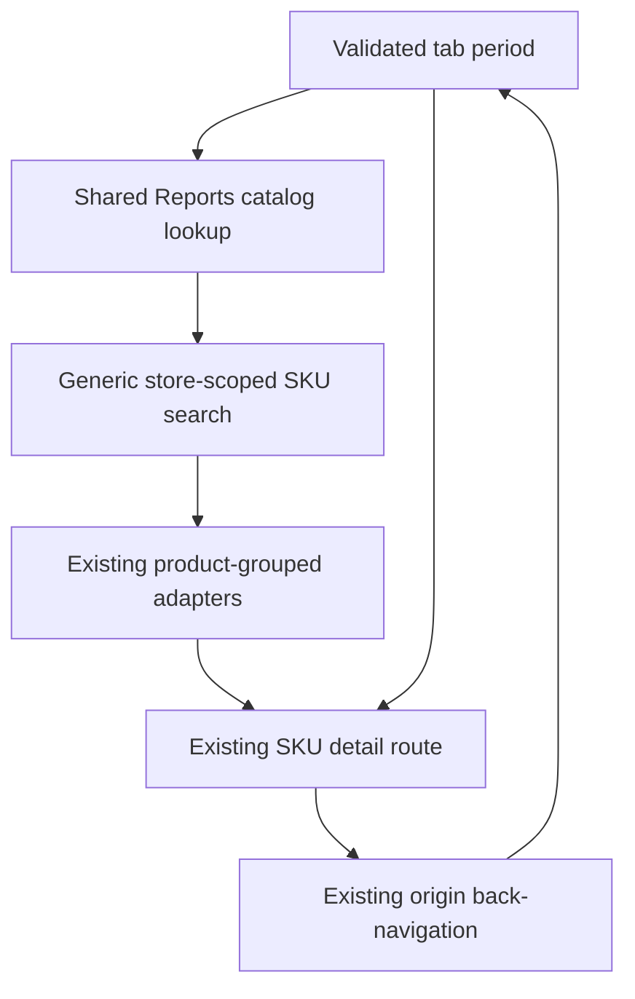
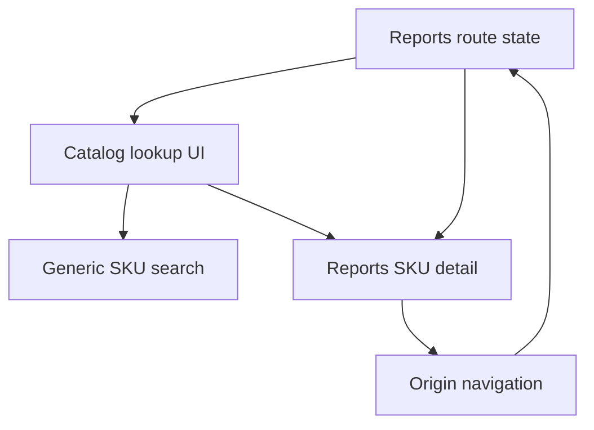

# feat: Add catalog lookup to Reports

## Summary

Extend the existing Reports routes with one reusable catalog lookup that calls Athena's generic SKU search, groups variants through the established admin adapters, and navigates to the current SKU-detail surface. Normalize each primary tab's selected period into the detail route's date range while preserving the originating tab and period in the existing origin-navigation contract.

---

## Problem Frame

Reports can currently investigate only SKUs that an administrator encounters in period activity. The generic catalog search and SKU-detail surface already exist, but they are not connected inside Reports, and Overview's selected window is not currently addressable outside component state.

---

## Requirements

- R64. Provide one shared catalog lookup at the top of both the Overview and Items tab content.
- R65. Accept product name, SKU, and barcode queries.
- R66. Keep results store scoped and preserve Reports access boundaries.
- R67. Search the store catalog independently of activity in the selected reporting snapshot.
- R68. Group results by product and expose selectable SKU variants beneath each product.
- R69. Identify each result with product name, SKU, and available distinguishing variant metadata.
- R70. Preserve the backend's exact SKU and barcode ranking ahead of broader text matches.
- R71. Navigate selection to the existing detail route for the exact `productSkuId`.
- R72. Translate the visible Reports period into the detail route's inclusive start and end dates.
- R73. Preserve the originating tab and period through existing origin navigation while clearing transient lookup state.
- R74. Keep catalog SKUs with no period activity selectable; the existing detail empty state remains the destination.

**Origin actors:** A1 (full administrator), A2 (Athena)

**Origin flow:** F6 (find a known product or SKU)

**Origin acceptance examples:** AE11 (grouped name search and exact variant selection), AE12 (exact inactive/no-activity SKU or barcode lookup), AE13 (period and originating-tab restoration)

---

## Scope Boundaries

- The lookup navigates to SKU detail; it does not filter Overview metrics or the Items table.
- Search results do not contain inline report analytics.
- Report calculations, materialization, freshness, and existing metric contracts remain unchanged.
- The generic SKU-search backend, projections, authorization contract, and other search consumers are not refactored.
- Lookup text and results remain transient and are not restored after returning from detail.
- Automated browser validation is excluded at the user's request; implementation verification is limited to focused Vitest coverage.
- Requirements R1-R63 in the origin document remain governing Reports invariants but are not reopened by this focused delivery.

### Deferred to Follow-Up Work

- Persisted or shareable lookup queries.
- A workspace-wide or application-wide catalog command palette.
- Inline SKU analytics previews in search results.

---

## Context & Research

### Relevant Code and Patterns

- `packages/athena-webapp/convex/inventory/skuSearch.ts` already performs store-scoped product-name, exact SKU, exact barcode, and product-SKU-id lookup; exact matches carry lower ranks than text candidates.
- `packages/athena-webapp/src/lib/skuSearch/productSkuSearchAdapters.ts` already maps generic results into admin options and groups variants by product while preserving backend rank.
- `packages/athena-webapp/src/components/products/Products.tsx` demonstrates the browser query boundary and the shared admin search adapters.
- `packages/athena-webapp/src/components/stock-ops/SkuSearchFilterBar.tsx` and `packages/athena-webapp/src/components/ui/command.tsx` provide established input, keyboard-navigation, grouping, and empty-state presentation primitives.
- `packages/athena-webapp/src/components/reports/ReportsLayout.tsx` owns the shared header and tab navigation; each tab's route renders first inside its outlet immediately below that navigation.
- `packages/athena-webapp/src/routes/_authed/$orgUrlSlug/store/$storeUrlSlug/reports/index.tsx` validates Overview search state and already reads the overview document before rendering.
- `packages/athena-webapp/src/routes/_authed/$orgUrlSlug/store/$storeUrlSlug/reports/items/index.tsx` keeps Items period, sort, cursor, and origin in validated URL state.
- `packages/athena-webapp/src/routes/_authed/$orgUrlSlug/store/$storeUrlSlug/reports/items/$productSkuId.tsx` already accepts an inclusive date range and encoded origin.
- `packages/athena-webapp/src/lib/navigationUtils.ts`, `packages/athena-webapp/src/hooks/use-navigate-back.ts`, and `packages/athena-webapp/src/components/reports/ReportBackLink.tsx` establish the origin round-trip used by existing report drill-down links.
- `packages/athena-webapp/convex/reports/queries.ts` already returns catalog identity with an empty SKU activity range, and `packages/athena-webapp/src/components/reports/ReportsSkuDetailView.tsx` already renders that state as no activity.

### Institutional Learnings

- `docs/solutions/performance/athena-generic-product-sku-search-sidecar-2026-06-25.md`: use the generic indexed SKU search rather than scanning or filtering a bounded page in the browser.
- `docs/solutions/architecture/athena-generic-sku-search-consumer-integration-2026-06-25.md`: keep the search foundation consumer neutral; consumer UI owns grouping, eligibility, and state copy.
- `docs/solutions/logic-errors/athena-shared-sku-search-and-detail-surfaces-2026-05-27.md`: reuse the shared matcher/adapters and include SKU, barcode, and variant identity instead of introducing bespoke search blocks.
- `docs/solutions/architecture-patterns/athena-reports-workspace-read-model-boundary-2026-07-11.md`: preserve period context in route state and keep Reports presentation thin over existing domain reads.
- `docs/product-copy-tone.md`: search loading, empty, and limited-result states should remain calm, clear, and operational.

### External References

- None. Athena already has direct, current patterns for every technical layer this feature needs.

---

## Key Technical Decisions

| Decision | Rationale |
| --- | --- |
| Reuse `inventory.skuSearch.searchProductSkus` without a Reports-specific backend facade | The query already provides store-scoped catalog identity and exact ranking. Reports authorization still gates the workspace, and the destination detail query independently enforces Reports access. The generic query's existing use by other authorized roles remains unchanged. |
| Render one shared lookup component as the first child of both primary tab routes | This keeps the control visually below the common Reports navigation while letting each route provide its own authoritative period context. SKU detail does not render the lookup. |
| Make the Overview window validated URL state | Items already stores period context in the URL. Moving only the Overview window closes the navigation gap without persisting lookup text or introducing a new global state layer. |
| Convert report selections to inclusive detail dates in a pure shared helper | Detail already accepts start and end dates. A tested translation boundary avoids changing the reporting backend or frozen report contract. |
| Preserve backend ranking and disable secondary client filtering | Exact SKU and barcode precedence is already encoded in search results. The UI groups those ordered options without reinterpreting relevance. |
| Keep lookup input local and briefly debounced | The origin URL should retain durable report context, not transient search interaction; a short debounce limits query churn while preserving barcode and SKU responsiveness. |

---

## Open Questions

### Resolved During Planning

- **Does SKU detail need backend work for no-activity catalog items?** No. `getSkuDetail` resolves identity before returning an empty range, and the view already renders a no-activity state.
- **Should the generic SKU-search authorization be narrowed to Reports access?** No. Other existing workspaces rely on its broader authorized catalog role. Reports remains full-admin-only at its route and report-detail query boundaries.
- **Where should shared lookup state live?** In the reusable lookup component, mounted by each primary tab route. Only the selected report period belongs in validated URL state.
- **How should Overview obtain an operating-date anchor without changing the report contract?** Use the latest operating date already present in the loaded overview trend, with the existing report date guess as the empty-trend fallback.

### Deferred to Implementation

- The exact short debounce interval and bounded result limit may follow the closest current admin-search consumer after focused tests expose the most stable interaction.
- Final spacing and responsive wrapping may be adjusted within existing Reports rhythm tokens; no new design system primitive is required.

---

## High-Level Technical Design

> *This illustrates the intended approach and is directional guidance for review, not implementation specification. The implementing agent should treat it as context, not code to reproduce.*

The lookup owns only transient input and result presentation. The tab route supplies an inclusive date range, selection adds that range plus the encoded current URL to the existing detail route, and the existing back control restores the durable route state.

---

## Implementation Units

- U1. **Normalize Reports period context for detail navigation**

**Goal:** Give both primary Reports tabs a tested, URL-addressable way to describe the inclusive date range that SKU detail must inherit.

**Requirements:** R72, R73; F6; AE13

**Dependencies:** None

**Files:**
- Modify: `packages/athena-webapp/src/components/reports/reportPeriodKeys.ts`
- Create: `packages/athena-webapp/src/components/reports/reportPeriodKeys.test.ts`
- Modify: `packages/athena-webapp/src/components/reports/ReportsOverviewView.tsx`
- Modify: `packages/athena-webapp/src/components/reports/ReportsOverviewView.test.tsx`
- Modify: `packages/athena-webapp/src/routes/_authed/$orgUrlSlug/store/$storeUrlSlug/reports/index.tsx`
- Modify: `packages/athena-webapp/src/routes/_authed/$orgUrlSlug/store/$storeUrlSlug/reports/index.test.ts`
- Modify: `packages/athena-webapp/src/routes/_authed/$orgUrlSlug/store/$storeUrlSlug/reports/items/index.test.ts`

**Approach:**
- Add the three existing Overview window values to the Overview route's validated search state and make `ReportsOverviewView` controlled by that value.
- Preserve the current default of Today when the URL does not provide a window.
- Extend the report-period helper boundary to return inclusive dates for Overview Today, week-to-date, and trailing-30 windows and for Items day, ISO week, and calendar month selections.
- Use operating-date label arithmetic rather than browser-local timestamps. For Overview, anchor to the latest loaded trend operating date and retain the current date guess only when the trend is empty.
- Keep Items sort and cursor behavior unchanged; only period selection participates in the detail range.

**Execution note:** Add the pure range and route-schema assertions before changing the controlled Overview state.

**Patterns to follow:**
- `packages/athena-webapp/src/components/reports/reportPeriodKeys.ts`
- `packages/athena-webapp/src/routes/_authed/$orgUrlSlug/store/$storeUrlSlug/reports/items/index.tsx`
- `packages/athena-webapp/shared/reportsContract.ts` operating-date and ISO-week helpers

**Test scenarios:**
- Happy path: missing Overview window parses successfully and resolves to Today in the route.
- Happy path: selecting Week to date updates validated URL state and keeps the corresponding tab trigger active after rerender.
- Covers AE13. Items day, week, and month selections produce the intended inclusive detail ranges without changing sort or cursor state.
- Edge case: ISO week conversion crosses a year boundary correctly.
- Edge case: calendar-month conversion handles February in leap and non-leap years.
- Edge case: trailing 30 days includes exactly 30 operating-date labels.
- Edge case: an empty Overview trend uses the existing date fallback without changing the selected window.
- Error path: invalid Overview window values and malformed dates are rejected by route schemas.

**Verification:**
- Every primary-tab period can be translated deterministically to a valid SKU-detail range, and Overview period state survives refresh and back navigation.

- U2. **Build the shared product-grouped catalog lookup**

**Goal:** Provide an accessible, transient Reports lookup that searches catalog identity and lets the administrator choose an exact SKU variant.

**Requirements:** R64-R71, R74; A1, A2; F6; AE11, AE12

**Dependencies:** U1

**Files:**
- Create: `packages/athena-webapp/src/components/reports/ReportsCatalogLookup.tsx`
- Create: `packages/athena-webapp/src/components/reports/ReportsCatalogLookup.test.tsx`
- Reuse unchanged: `packages/athena-webapp/src/lib/skuSearch/productSkuSearchAdapters.ts`
- Reuse unchanged: `packages/athena-webapp/convex/inventory/skuSearch.ts`

**Approach:**
- Query the generic SKU-search API only when the debounced, trimmed input is non-empty and an active store is available.
- Map and group results through the existing admin adapters. Preserve group and variant order from backend match ranks; any command/list primitive must not apply a competing local relevance filter.
- Present product name as the group identity and SKU, barcode, size, color, lifecycle state, and other available concise metadata as variant distinctions.
- Keep archived, draft, hidden, inactive, and no-activity catalog results selectable for historical reporting; lifecycle metadata informs but does not disable navigation.
- Treat lookup input and results as transient component state. Clear them on selection, store change, explicit clear, and unmount.
- Provide distinct loading, no-match, and limited-result states. When the backend reports truncation or candidate overflow, ask the administrator to refine the query without exposing raw backend language.
- Support keyboard movement and selection, visible focus, accessible group/result names, and escape/clear behavior using existing command and input primitives.

**Patterns to follow:**
- `packages/athena-webapp/src/lib/skuSearch/productSkuSearchAdapters.ts`
- `packages/athena-webapp/src/components/products/Products.tsx`
- `packages/athena-webapp/src/components/stock-ops/SkuSearchFilterBar.tsx`
- `packages/athena-webapp/src/components/ui/command.tsx`
- `packages/athena-webapp/src/hooks/useDebounce.ts`
- `docs/product-copy-tone.md`

**Test scenarios:**
- Covers AE11. A product-name query returns several variants grouped beneath one product, and choosing one reports that exact `productSkuId`.
- Covers AE12. An exact SKU and an exact barcode remain ahead of text matches and can select an inactive/no-activity catalog SKU.
- Happy path: product name, SKU, and barcode inputs each invoke the generic query after the short debounce.
- Happy path: variant rows expose product name, SKU, and available size, color, and barcode distinctions without fabricated placeholders.
- Edge case: blank and whitespace-only input skips the query and shows no result panel.
- Edge case: a product whose SKU lacks optional metadata remains selectable and clearly named.
- Edge case: archived, draft, and hidden lifecycle metadata is visible but does not disable report navigation.
- Edge case: truncated or candidate-overflow responses retain returned results and show restrained refinement guidance.
- Error path: no matching catalog SKU produces a calm no-results state rather than an empty report state.
- State lifecycle: changing stores clears the query and never displays results from the prior store.
- Accessibility: the input, product groups, selectable variants, loading state, empty state, keyboard selection, and clear action have stable accessible semantics.

**Verification:**
- The component finds and distinguishes catalog variants without reading report snapshots, duplicating ranking logic, or modifying the generic search foundation.

- U3. **Integrate lookup navigation into Overview and Items**

**Goal:** Mount the shared lookup in both primary Reports tabs and prove that selection and back navigation preserve durable report context while discarding transient search state.

**Requirements:** R64, R71-R74; F6; AE11-AE13

**Dependencies:** U1, U2

**Files:**
- Modify: `packages/athena-webapp/src/routes/_authed/$orgUrlSlug/store/$storeUrlSlug/reports/index.tsx`
- Modify: `packages/athena-webapp/src/routes/_authed/$orgUrlSlug/store/$storeUrlSlug/reports/items/index.tsx`
- Modify: `packages/athena-webapp/src/routes/_authed/$orgUrlSlug/store/$storeUrlSlug/reports/index.test.ts`
- Modify: `packages/athena-webapp/src/routes/_authed/$orgUrlSlug/store/$storeUrlSlug/reports/items/index.test.ts`
- Modify: `packages/athena-webapp/src/routes/_authed/$orgUrlSlug/store/$storeUrlSlug/reports/items/$productSkuId.test.ts`
- Modify: `packages/athena-webapp/src/components/reports/ReportsSkuDetailView.test.tsx`

**Approach:**
- Render the same lookup component as the first tab-body control on Overview and Items so it sits directly below the common Reports navigation.
- Pass the route's normalized inclusive range into the lookup. On selection, navigate to the existing SKU-detail route with `productSkuId`, start date, end date, and the encoded current URL as origin.
- Do not mount the lookup on SKU detail. The component clears before navigation and remounts empty when origin navigation returns.
- Preserve all durable origin query keys: Overview window, or Items period type, anchor date, sort, and cursor.
- Keep the existing detail query and view behavior unchanged; focused tests characterize the already-supported identity-plus-no-activity response.

**Execution note:** Preserve the existing origin-navigation tests and extend them around the new entry path before altering route composition.

**Patterns to follow:**
- `packages/athena-webapp/src/lib/navigationUtils.ts`
- `packages/athena-webapp/src/hooks/use-navigate-back.ts`
- `packages/athena-webapp/src/components/reports/ReportBackLink.tsx`
- Existing row navigation in `packages/athena-webapp/src/components/reports/ReportsItemsView.tsx`

**Test scenarios:**
- Covers AE11. Overview lookup selection navigates to the exact SKU-detail path with the Overview window's date range and encoded Overview origin.
- Covers AE12. Selecting a catalog SKU without activity reaches detail, preserves its catalog identity, and shows the existing no-activity state.
- Covers AE13. Items lookup selection carries the selected period range; back restores Items period, sort, and cursor while the lookup is empty.
- Happy path: Overview and Items each render one lookup directly before their report-specific controls/content.
- Edge case: detail reached directly without an origin continues to omit the back affordance.
- Edge case: changing Overview window or Items period before searching changes the detail range used by the next selection.
- Error path: malformed or cross-store detail identifiers continue through existing report-detail authorization/not-found behavior without exposing another store's identity.
- Integration: lookup selection uses the existing detail route and origin contract; it does not add search keys to the detail or origin URL.

**Verification:**
- An administrator can reach any same-store catalog SKU report from either primary tab, inspect the intended period, and return to the exact tab context with no lookup state retained.

---

## System-Wide Impact

- **Interaction graph:** Overview and Items route state supplies the lookup's date range; lookup reads generic catalog search; selection enters existing detail; origin navigation returns to the source route.
- **Error propagation:** Search loading, no-result, and limited-result states are normalized in the lookup. Report-detail authorization and unavailable states remain owned by the existing detail query/view.
- **State lifecycle risks:** Lookup state must clear on selection and store change; durable period, sort, and cursor state must remain in the origin URL. No writes, caches, or persistent cleanup are introduced.
- **API surface parity:** The generic SKU-search response and report-detail contract remain unchanged. Only Overview's validated URL search surface gains a window key.
- **Integration coverage:** Route tests must prove date-range and origin construction; component tests must prove grouped search behavior; existing detail tests must prove no-activity navigation remains valid.
- **Unchanged invariants:** Reports stays read-only and full-admin-only; search does not influence snapshot metrics, sorting, pagination, freshness, or materialization; other generic SKU-search consumers retain their current behavior.

---

## Risks & Dependencies

| Risk | Mitigation |
| --- | --- |
| Overview date range drifts from the materialized report's operating day near timezone boundaries | Anchor to the latest operating date in the already-loaded overview trend, with the existing date guess only as an empty-trend fallback; cover boundary arithmetic in pure tests. |
| A UI primitive re-filters grouped backend results and breaks exact-match precedence | Disable secondary client relevance filtering and assert backend rank order through grouped result tests. |
| Shared lookup remains mounted and restores stale input after drill-down | Mount it only in the two index routes and clear transient state before selection and on store change. |
| Archived or inactive catalog identity is accidentally treated as ineligible | Keep lifecycle state presentational and assert those variants remain selectable for historical reporting. |
| Search query volume grows with every keystroke | Use the existing bounded API with a short debounce and skip blank input. |
| Navigation loses Items cursor/sort or Overview window | Encode the current URL with the existing origin helper and test complete round trips for both tabs. |

---

## Verification Strategy

- Run focused Vitest coverage for:
  - `packages/athena-webapp/src/components/reports/reportPeriodKeys.test.ts`
  - `packages/athena-webapp/src/components/reports/ReportsCatalogLookup.test.tsx`
  - `packages/athena-webapp/src/components/reports/ReportsOverviewView.test.tsx`
  - `packages/athena-webapp/src/routes/_authed/$orgUrlSlug/store/$storeUrlSlug/reports/index.test.ts`
  - `packages/athena-webapp/src/routes/_authed/$orgUrlSlug/store/$storeUrlSlug/reports/items/index.test.ts`
  - `packages/athena-webapp/src/routes/_authed/$orgUrlSlug/store/$storeUrlSlug/reports/items/$productSkuId.test.ts`
  - `packages/athena-webapp/src/components/reports/ReportsSkuDetailView.test.tsx`
- Do not run browser automation; the user will validate the rendered workflow.
- Rebuild Graphify after implementation code changes, as required by repository policy.
- Treat broader repository validation as outside this focused implementation request unless the user later asks to prepare the branch for merge.

---

## Documentation / Operational Notes

- No operator documentation or migration is required; this is a discoverable read-only control in an existing workspace.
- No feature flag, backfill, schema change, or search-projection repair is required.
- Keep operator-facing search states consistent with `docs/product-copy-tone.md`.

---

## Sources & References

- **Origin document:** [docs/brainstorms/2026-07-09-reports-workspace-requirements.md](../brainstorms/2026-07-09-reports-workspace-requirements.md)
- [docs/plans/2026-07-11-002-feat-reports-workspace-plan.md](2026-07-11-002-feat-reports-workspace-plan.md)
- [docs/plans/2026-06-25-002-feat-integrate-sku-search-surfaces-plan.md](2026-06-25-002-feat-integrate-sku-search-surfaces-plan.md)
- [docs/solutions/performance/athena-generic-product-sku-search-sidecar-2026-06-25.md](../solutions/performance/athena-generic-product-sku-search-sidecar-2026-06-25.md)
- [docs/solutions/architecture/athena-generic-sku-search-consumer-integration-2026-06-25.md](../solutions/architecture/athena-generic-sku-search-consumer-integration-2026-06-25.md)
- [docs/solutions/logic-errors/athena-shared-sku-search-and-detail-surfaces-2026-05-27.md](../solutions/logic-errors/athena-shared-sku-search-and-detail-surfaces-2026-05-27.md)
- [docs/solutions/architecture-patterns/athena-reports-workspace-read-model-boundary-2026-07-11.md](../solutions/architecture-patterns/athena-reports-workspace-read-model-boundary-2026-07-11.md)
