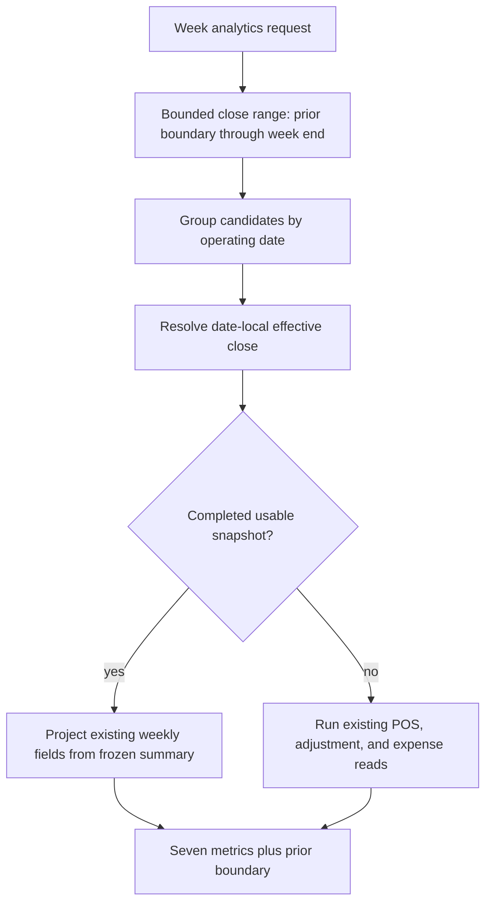

# refactor: Serve finalized Daily Operations metrics from close snapshots

## Summary

Reduce Daily Operations weekly-analytics reads by loading close candidates once, serving finalized operating dates from their frozen EOD report summaries, and retaining the existing live calculation only for dates whose close is open, reopened, ambiguous, uses a legacy snapshot contract, or is otherwise unusable. Keep the public metrics, authorization boundary, selected-day refresh, and frontend cache contract unchanged.

---

## Problem Frame

`getDailyOperationsWeekAnalyticsSnapshot` builds seven displayed metrics plus one prior-week boundary metric. Each date currently reads completed POS transactions, applied transaction adjustments, completed expenses, and Daily Close rows, creating up to 32 indexed queries and exposing as many as 6,400 capped source rows to one weekly request.

Completed EOD Reviews already freeze the same financial inputs inside `dailyClose.reportSnapshot.summary`. Continuing to recompute finalized dates from mutable operational tables spends reads and lets the Daily Operations week strip drift away from the accepted close-time record.

---

## Requirements

- R1. A date with one unambiguous effective, completed close and a usable frozen report snapshot must produce its weekly metric from `reportSnapshot.summary`.
- R2. Open, reopened, superseded-only, ambiguous, unsupported, incomplete, malformed, or snapshot-less dates must retain the existing live operational-source calculation.
- R3. Frozen snapshot authority must be resolved locally to the operating date and must not treat store-global `dailyClose.isCurrent` as date-local authority.
- R4. Snapshot-backed metrics must preserve legitimate zero-valued weekly fields while leaving close-only variance, carry-over, and other fields that the live weekly builder does not populate at their existing weekly defaults.
- R5. The seven displayed dates and prior-week boundary must use the same selection and projection rules.
- R6. Full-admin financial access, POS-only redaction, store scoping, operating-timezone behavior, today-refresh payload/request ordering, and frontend cache merge mechanics must remain unchanged; today-refresh metric authority adopts the same frozen/live decision.
- R7. The weekly read must load close candidates through one bounded operating-date range and touch POS transactions, adjustments, and expenses only for dates that require live fallback.
- R8. Tests must prove response parity, lifecycle correctness, frozen close-time behavior, fallback safety, and reduced table/index fan-out.
- R9. On the normal complete-range path with `k` live-fallback dates, metric construction must perform one close-range query plus exactly three financial-source queries per fallback date; capped-range recovery must remain explicit and measurable.

---

## Scope Boundaries

- No schema change, close mutation change, snapshot backfill, or legacy data migration.
- No replacement of Daily Operations metrics with Reports `reportDay` projections.
- No change to the Daily Operations UI, route contract, permissions, or financial redaction.
- No change to EOD Review history, reopen commands, or source workflow ownership.
- No coercion of missing or malformed frozen financial fields to zero for snapshot eligibility.

### Deferred to Follow-Up Work

- Skipping all operational reads for future dates in the current week: valuable, but it needs a separate trusted current-operating-date contract rather than inferring “future” from the selected historical date.
- General lifecycle repair or telemetry for contradictory Daily Close revision chains: this refactor falls back live when authority is ambiguous.
- Frontend cache invalidation changes after close/reopen/reclose: preserve the existing route/remount and refresh contract here; investigate separately if characterization exposes stale lifecycle state.
- Replacing close-time operational truth with amended reporting truth after late facts: use the Reports projection boundary if that becomes a product requirement.

---

## Context & Research

### Relevant Code and Patterns

- `packages/athena-webapp/convex/operations/dailyOperations.ts` owns the bounded week-analytics query, per-date metric construction, effective-close selection, prior-week boundary, and today-refresh metrics.
- `packages/athena-webapp/convex/operations/dailyClose.ts` freezes a versioned report snapshot when human or automation completion succeeds and rejects incomplete close evidence before completion.
- `packages/athena-webapp/convex/schemas/operations/dailyClose.ts` intentionally keeps snapshot summaries loose and legacy-compatible, so the consumer needs an explicit structural eligibility guard.
- `packages/athena-webapp/convex/schema.ts` already provides `dailyClose.by_storeId_operatingDate`, which can cover the contiguous eight-date window without a schema change.
- `packages/athena-webapp/convex/operations/dailyOperations.test.ts` has an in-memory indexed-query harness and existing cases for weekly boundaries, timezone bucketing, reopen, reclose, redaction, and bounded companion queries.
- `packages/athena-webapp/src/components/operations/DailyOperationsView.tsx` caches the week response and replaces selected-day/prior-day metrics through the narrow today-refresh response; the server payload shape must remain stable.

### Institutional Learnings

- `docs/solutions/logic-errors/athena-daily-close-history-snapshots-2026-05-09.md`: completed close snapshots are frozen operating records and must not be reconstructed from mutable live state.
- `docs/solutions/performance/athena-convex-read-amplification-2026-06-29.md`: Daily Operations analytics belong in a bounded companion query, and read containment must be proved across the caller-to-index path.
- `docs/solutions/logic-errors/athena-daily-operations-aggregate-read-model-2026-05-08.md`: Daily Operations aggregates source-owned truth without becoming a workflow or command owner.
- `docs/solutions/logic-errors/athena-daily-operations-current-day-refresh-2026-06-30.md`: current-day facts refresh through a narrow response rather than rebuilding the full week.
- `docs/solutions/architecture/athena-reporting-fact-projection-boundary-2026-07-09.md`: close-time operational truth and amended reporting truth are distinct; this work intentionally chooses the former for finalized Daily Operations dates.

### External References

- External research was skipped. Athena has direct, recent patterns for frozen close snapshots, lifecycle currentness, bounded Convex reads, and current-day refresh behavior.

---

## Key Technical Decisions

| Decision | Rationale |
|---|---|
| Treat a usable frozen report snapshot as the finalized Daily Operations record | It matches EOD History semantics, removes mutable-source drift, and reuses evidence already accepted by the close command. |
| Resolve authority per operating date, independent of store-global `isCurrent` | Historical and automated closes may correctly have `isCurrent: false`; lifecycle revision state determines which row represents that date. |
| Require a v2 snapshot contract, complete and internally consistent financial-source evidence, metadata and ranges matching the request-derived store day, finite required metrics, and structurally valid payment totals | A loose legacy `Record<string, unknown>` must not turn absent, mis-bucketed, or malformed money into authoritative zeroes. |
| Bulk-load the contiguous eight-date close window once | The seven week dates plus prior Saturday are contiguous, so one bounded indexed read can replace eight close lookups. |
| Preserve the live builder as a compatibility and lifecycle fallback | Open/reopened days need current facts, while old or inconsistent close rows must remain correct even if they retain the old read cost. |
| Project only fields the weekly builder already owns | Daily Close contains additional cash-count and variance fields; introducing those into weekly metrics would be an unrelated behavior change. |
| Admit snapshot authority only for one terminal, internally consistent date-local revision | Duplicate active rows, broken replacement links, or contradictory revision evidence cannot safely choose financial truth; ambiguity uses live fallback. |
| Abort the whole-window optimization only when the `limit + 1` probe returns the extra row | Exactly 200 candidates is complete; 201 proves truncation. A dense revision history on one date can hide later dates, so no row from an incomplete candidate set may become financial snapshot authority. |

---

## Open Questions

### Resolved During Planning

- **Should finalized Daily Operations history reflect later source mutations?** No. It reflects the accepted close-time snapshot. Amended financial truth belongs to Reports.
- **Can `dailyClose.isCurrent` identify the right historical close?** No. It is store-global; the resolver must use date-local lifecycle and revision evidence.
- **Should missing legacy snapshots return unavailable metrics?** No for this delivery. The confirmed compatibility policy is live fallback.
- **Is a new table or index required?** No. The existing operating-date index covers the bounded window.
- **Should the snapshot mapper reuse permissive Daily Close normalization?** No. Weekly eligibility needs stricter validation so missing money cannot become zero silently.
- **What happens when the bounded close window is incomplete?** None of its candidates are used as frozen authority. All eight metrics use the pre-refactor per-date/live path for that request, making the rare recovery cost explicit instead of trusting a truncated revision set.
- **Does capped recovery also redesign lifecycle decoration?** No. It preserves the pre-refactor best-effort closed/reopened decoration while denying frozen financial authority to the incomplete batch. Repairing pathological 200-plus-revision lifecycle history is separate work.

### Deferred to Implementation

- Exact internal helper boundaries may follow the existing facade layout if keeping the resolver and projector in `dailyOperations.ts` becomes difficult to read.
- The smallest query-observer shape for the in-memory test DB can be chosen during implementation, provided it records table and index usage without coupling assertions to helper names.

---

## High-Level Technical Design

> *This illustrates the intended approach and is directional guidance for review, not implementation specification. The implementing agent should treat it as context, not code to reproduce.*

| Date state | Metric source | Closed/reopened decoration | Source-table reads |
|---|---|---|---|
| Effective completed close with usable snapshot | Frozen `reportSnapshot.summary` | Closed | No POS, adjustment, or expense reads |
| Active open or reopened revision | Existing live calculation | Open/reopened | Existing three financial-source reads |
| Superseded/reopened original without an effective completed replacement | Existing live calculation | Reopened | Existing three financial-source reads |
| Effective reclosed replacement with usable snapshot | Replacement frozen summary | Closed | No POS, adjustment, or expense reads |
| Legacy snapshot contract, malformed, incomplete, unsupported, or ambiguous close | Existing live calculation | Existing lifecycle semantics | Existing three financial-source reads |

### Date-local authority decision table

| Candidate shape for one operating date | Frozen authority | Metric decoration |
|---|---|---|
| One untouched completed terminal row with active or legacy lifecycle, no contradictory revision links, and usable snapshot | That row | Closed |
| One completed historical-record row with `isCurrent: false`, no competing terminal revision, and usable snapshot | That row | Closed |
| One active open replacement linked back to a reopened/superseded original | None; live calculation | Reopened |
| One active completed replacement whose forward/back replacement links agree with its superseded original and whose snapshot is usable | Replacement row | Closed |
| Duplicate terminal rows, broken/cross-date links, conflicting forward/back links, or multiple effective completions | None; live calculation | Existing conservative lifecycle semantics |
| Only reopened or superseded originals, with no effective completed replacement | None; live calculation | Reopened |

Week analytics and today refresh must share this one pure authority/projection decision so their financial truth cannot drift.

### Usable v2 financial evidence

A frozen summary is eligible only when the snapshot metadata matches the requested store and operating date, `closeMetadata.startAt/endAt` is a plausible local midnight range within one hour of the request-derived boundaries (23–25 hours to preserve DST transition days), `snapshotContractVersion` is 2, aggregate source completeness is true, and the source entries used by weekly metrics are present and non-contradictory:

- completed POS transactions for the snapshot’s store-day range;
- applied POS transaction adjustments for the same range;
- completed expense transactions for the same range.

Missing, duplicated, explicitly incomplete, wrong-range, wrong-status, boundaries shifted beyond the DST tolerance, or durations outside 23–25 hours force live fallback. Required weekly numeric fields must be finite, count fields must be nonnegative integers, and every payment-total row must have a unique method, finite amount, and nonnegative integer count.

---

## Implementation Units

- U1. **Characterize frozen metric eligibility and read behavior**

**Goal:** Establish the exact financial, lifecycle, and database-read contract before changing the builder.

**Requirements:** R1, R2, R3, R4, R6, R8, R9

**Dependencies:** None

**Files:**

- Modify: `packages/athena-webapp/convex/operations/dailyOperations.test.ts`

**Approach:**

- Extend the in-memory DB harness to record table, index name, ordered predicates, terminal operation, and limit; make `by_storeId_operatingDate` execute in compound-index order before `take`, then pair structural assertions with output parity.
- Add complete frozen-summary fixtures whose values deliberately disagree with mutable operational rows.
- Characterize date-local authority across active completed, active open, reopened original, superseded original, effective reclosed replacement, historical automation, and contradictory revision cases.
- Capture the current serialized weekly field set so snapshot projection cannot accidentally populate close-only variance or carry-over fields.

**Execution note:** Add characterization and read-boundary coverage before modifying production selection logic.

**Patterns to follow:**

- Existing week-boundary, reopen/reclose, timezone, and redaction cases in `packages/athena-webapp/convex/operations/dailyOperations.test.ts`.
- Read-boundary characterization guidance in `docs/solutions/performance/athena-convex-read-amplification-2026-06-29.md`.

**Test scenarios:**

- Happy path: a completed active close with a complete frozen summary returns snapshot values even when live transactions and expenses disagree.
- Happy path: a historical-record close with `isCurrent: false` remains authoritative for its operating date.
- Edge case: legitimate zero-valued frozen metrics pass eligibility without truthiness errors.
- Edge case: missing/non-finite required amounts, malformed payment totals, mismatched metadata, unsupported contract version, or incomplete source evidence selects live fallback.
- Edge case: a v2 snapshot claiming aggregate completeness but missing, duplicating, contradicting, or mis-ranging one required financial source selects live fallback.
- Edge case: valid 23-hour and 25-hour transition-day snapshots remain eligible; metadata shifted beyond one hour, source ranges that disagree with close metadata, or durations outside 23–25 hours select live fallback.
- Edge case: a store-global `isCurrent: true` row for another date cannot influence the requested date.
- Edge case: multiple contradictory active candidates fail safe to live calculation.
- Edge case: broken or cross-date replacement links and multiple terminal completed candidates fail safe to live calculation.
- Edge case: same-store rows immediately outside both date boundaries and other-store rows are excluded by the recorded index predicates.
- Error path: POS-only access returns no weekly money and performs no financial-source reads.
- Integration: query observation distinguishes close-range reads from POS, adjustment, and expense reads.

**Verification:**

- Tests describe exactly when frozen data is authoritative and fail if malformed or lifecycle-ineligible snapshots bypass live fallback.
- The harness can prove source-table absence, not merely equal output.

---

- U2. **Route week analytics through bounded frozen-close selection**

**Goal:** Replace per-date close lookup and finalized-day source aggregation with one bounded close-window read plus live reads only for fallback dates.

**Requirements:** R1, R2, R3, R4, R5, R7, R8, R9

**Dependencies:** U1

**Files:**

- Modify: `packages/athena-webapp/convex/operations/dailyOperations.ts`
- Test: `packages/athena-webapp/convex/operations/dailyOperations.test.ts`

**Approach:**

- Derive the seven displayed dates and prior-week boundary before loading close candidates.
- Read their contiguous operating-date range once with a 201-row lookahead over the existing 200-row budget. Zero through 200 candidates is complete; 201 proves truncation. If truncated, discard the batch for financial snapshot authority and run the pre-refactor per-date/live path for all eight metrics.
- Group complete candidates by operating date and admit only one terminal effective row whose lifecycle, status, identity, and replacement links are internally consistent; never use store-global currentness as the deciding signal.
- Project the allowlisted weekly financial fields from a usable frozen report summary and add selected/closed/reopened decorations separately.
- Invoke the existing live POS/adjustment/expense calculation only when no usable finalized snapshot exists.
- Keep ordering, week selection, prior-boundary comparison, and operating-timezone range behavior unchanged.

**Patterns to follow:**

- Active/legacy close selection in `packages/athena-webapp/convex/operations/dailyClose.ts`.
- Frozen historical rendering in `normalizeCompletedDailyCloseSnapshot`.
- Existing bounded query and lookahead conventions in Daily Operations and Daily Close.

**Test scenarios:**

- Happy path: a fully closed week plus prior boundary performs one bounded Daily Close range read and zero POS, adjustment, or expense reads.
- Happy path: a mixed week reads frozen values for finalized dates and live values only for open, reopened, or legacy-snapshot dates while preserving date order and `isSelected`.
- Happy path: for `k` fallback dates on a complete close range, query observation records `1 + 3k` metric-source queries.
- Happy path: the prior-Saturday comparison uses the same frozen/live resolver as the visible seven days.
- Edge case: reopening an original close selects current live values and marks the metric reopened.
- Edge case: reclosing selects the replacement snapshot, never the superseded original.
- Edge case: exactly 200 close candidates remains eligible for resolution, while 201 candidates concentrated at the first, middle, or last date trigger whole-window recovery; no truncated candidate becomes frozen financial authority, and worst-case recovery is the attempted range read plus the existing 32 metric-source queries.
- Edge case: timezone-offset bucketing remains correct on every live-fallback date.
- Integration: changes to operational rows after completion do not change a snapshot-backed metric; reopen/reclose moves authority to live data and then the replacement snapshot.

**Verification:**

- Finalized dates no longer touch mutable financial-source tables.
- Fallback dates retain the current totals and lifecycle flags.
- The response remains seven ordered metrics plus one compatible prior-boundary metric.

---

- U3. **Preserve refresh, client, and operational contracts**

**Goal:** Lock the optimization into the existing companion-query and current-day-refresh architecture without widening the UI or reporting scope.

**Requirements:** R4, R5, R6, R7, R8

**Dependencies:** U2

**Files:**

- Modify: `packages/athena-webapp/convex/operations/dailyOperations.test.ts`
- Modify only if characterization requires it: `packages/athena-webapp/src/components/operations/DailyOperationsView.test.tsx`
- Modify: `docs/solutions/performance/athena-convex-read-amplification-2026-06-29.md`

**Approach:**

- Apply the same snapshot/live decision to today refresh’s selected and prior-day metrics without broadening its response.
- Confirm that full-admin-only week analytics and POS-only redaction still short-circuit before financial reads.
- Preserve client merge semantics: selected-day replacement, six sibling metrics, prior-boundary comparison, `refreshRequestedAt`, and shared-demo client analytics remain compatible.
- Record the new finalized-day snapshot boundary and its fallback behavior in the existing read-amplification learning.

**Patterns to follow:**

- Narrow refresh behavior in `docs/solutions/logic-errors/athena-daily-operations-current-day-refresh-2026-06-30.md`.
- Existing week cache and today-refresh merge tests in `packages/athena-webapp/src/components/operations/DailyOperationsView.test.tsx`.

**Test scenarios:**

- Happy path: today refresh returns a frozen metric after effective completion and a live metric while the day is open or reopened.
- Happy path: prior-day refresh uses a usable frozen snapshot without rereading its operational sources.
- Edge case: POS-only week analytics and today refresh return redacted/null metric payloads and do not probe snapshot summaries or financial sources.
- Edge case: selected-day replacement preserves `isSelected`, the other six week rows, the prior-boundary value, and fetched-at semantics.
- Error path: a stale refresh response cannot overwrite a newer request because existing `refreshRequestedAt` matching remains intact.
- Integration: shared-demo/client-provided weekly analytics continue bypassing the server week query and merge with current-day refresh exactly as before.
- Integration: server authority transitions are asserted on a fresh read; the unchanged browser cache may retain an older historical row until its existing remount/refetch boundary.

**Verification:**

- No public query arguments or response fields change.
- No frontend production change is required unless a characterization test reveals an existing contract gap.
- The performance learning states when Daily Operations reads frozen close evidence and when it deliberately falls back live.

---

## System-Wide Impact

- **Interaction graph:** EOD completion writes the frozen report snapshot; Daily Operations week analytics consumes it; today refresh merges selected/prior metrics; the React cache presents the unchanged contract.
- **Error propagation:** Snapshot validation never throws an operator-facing error. Ineligible or ambiguous evidence degrades to the existing live calculation.
- **State lifecycle risks:** On each new server read, reopen removes frozen authority and reclose transfers authority to the replacement snapshot; superseded originals remain immutable but non-authoritative. Existing browser cache/remount timing is unchanged and is not an end-to-end immediacy guarantee.
- **API surface parity:** `getDailyOperationsWeekAnalyticsSnapshot`, `getDailyOperationsTodayRefreshSnapshot`, and internal analytics callers share the same resolver. POS-only and shared-demo paths retain their existing behavior.
- **Integration coverage:** Backend tests must cover completion → frozen, reopen → live, and reclose → replacement-frozen transitions, plus frontend merge characterization where necessary.
- **Unchanged invariants:** Daily Close remains the close command and history owner; Reports remains amended financial truth; Daily Operations remains a bounded, read-only aggregate; no query writes are introduced.

---

## Risks & Dependencies

| Risk | Mitigation |
|---|---|
| A malformed legacy snapshot silently becomes financial truth | Require supported version/completeness, identity checks, finite allowlisted metrics, and valid payment totals; otherwise use live fallback. |
| Store-global `isCurrent` selects the wrong historical row | Resolve candidates within each operating date and use lifecycle/revision evidence; ambiguity falls back live. |
| Snapshot mapping changes the weekly contract | Characterize the serialized field set and project only fields already populated by the live builder. |
| Late operational facts no longer alter a closed week metric | Document this as intentional close-time semantics; amended truth remains available through Reports. |
| Legacy-snapshot fallback preserves some read amplification | Accept the compatibility cost; no migration or backfill is in scope. A legacy lifecycle shape remains eligible when it carries a valid v2 snapshot and has no competing revision. |
| A range cap hides additional close revisions | Use bounded lookahead and fail back to the established per-date/live behavior instead of claiming authority from incomplete candidates. |
| Current-day or cache refresh behavior regresses | Cover selected/prior refresh and client replacement behavior without changing public payloads. |
| Test query counts pass despite the wrong index shape | Record index names, ordered predicates, terminal operations, and limits in addition to response and call-count assertions. |

---

## Success Metrics

- A complete range with `k` live-fallback dates performs `1 + 3k` metric-source queries for every `k` from zero through eight; the finalized-week case falls from 32 to 1.
- Snapshot-backed dates perform zero POS transaction, adjustment, or expense reads.
- The 201-row cap-recovery cohort is reported separately and never counted as normal-path savings.
- A read-only pre-rollout sample establishes usable-snapshot coverage and representative close-document size for closed, mixed, and legacy-heavy weeks.
- Matching post-rollout 24-hour and 72-hour windows show lower fleet-weighted average database bytes per week-query call without higher query error rate or p95 latency. If bytes per call rise or correctness checks fail, revert the optimization and retain the live path.

---

## Documentation / Operational Notes

- Extend the existing read-amplification solution note after implementation rather than creating a competing performance doctrine.
- Compare the week analytics function’s table/index probes before and after with a closed week, mixed open/closed week, legacy-heavy week, reopened day, and cap-triggered recovery.
- Treat `1 + 3k` metric-source queries as the normal-path cost model, where `k` is the number of fallback dates from zero through eight. Report the cap-triggered recovery path separately rather than blending it into ideal savings.
- After rollout, compare matching 24-hour and 72-hour Convex Usage windows for week-query calls, average bytes per call, error rate, and p50/p95 execution time. Separate ideal closed-week proof from fleet-weighted production savings.
- At merge-ready boundary, use the repository-owned `bun run pr:athena` validation gate and rebuild Graphify after code changes.
- No data migration is required because every ineligible snapshot retains the established live path.

---

## Sources & References

- Related requirements: `docs/brainstorms/2026-05-09-historical-daily-close-records-requirements.md`
- Related prior plan: `docs/plans/2026-06-29-002-refactor-convex-read-amplification-plan.md`
- Related code: `packages/athena-webapp/convex/operations/dailyOperations.ts`
- Related code: `packages/athena-webapp/convex/operations/dailyClose.ts`
- Related schema: `packages/athena-webapp/convex/schemas/operations/dailyClose.ts`
- Related tests: `packages/athena-webapp/convex/operations/dailyOperations.test.ts`
- Convex guidance: `packages/athena-webapp/convex/_generated/ai/guidelines.md`
