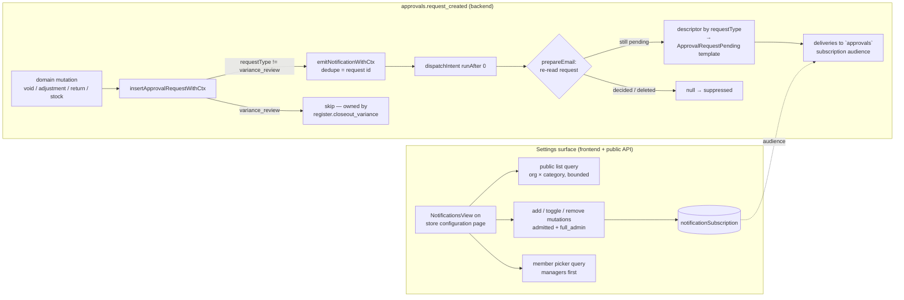

# feat: Notification subscription settings surface and approval-request emails

## Summary

Give operators a product surface to configure who receives admin notifications, and put approval requests on the notifications rail: a `NotificationsView` on the store configuration page manages `notificationSubscription` rows per category (backed by the rail's first public Convex functions), and a new `approvals.request_created` kind emails subscribed managers whenever an approval request is created that needs asynchronous manager approval — with per-`requestType` template differentiation and suppression for requests already decided.

---

## Problem Frame

The notifications rail (PR #710) centralized delivery mechanics but left audience configuration as data-tool-only (`seedAdminSubscriptions` via dashboard) and shipped no product UI; recipients are effectively the hardcoded `ADMIN_EMAILS` pair. Separately, approval requests that need a manager's asynchronous decision (cashier-initiated voids, adjustments, returns, stock adjustments) notify nobody — managers discover pending work only by opening the operations queue. Requests created and decided in the same flow by a present manager need no notification; the async-pending ones do.

---

## Requirements

- R1. Operators with `full_admin` can view, add, enable/disable, and remove notification recipients per category (`cash_controls`, `eod`, `system_health`, `approvals`) from the store configuration page.
- R2. The UI makes the rail's audience-resolution semantics legible: three distinct category states — fallback active (zero rows → `ADMIN_EMAILS`), active recipients, and silenced (rows exist but none enabled) — with distinct confirmation copy for remove-last-row (re-arms fallback broadcast) vs disable-last-enabled (silences category).
- R3. Recipients can be added from an org-member picker (managers surfaced first via `operationalRoles`) or as free-form email addresses.
- R4. All new public Convex functions are server-side authorized (`full_admin` membership) and admitted through the operation-admission rail; client route gating is not the security boundary.
- R5. Creating an approval request that is (and remains) pending emits a `approvals.request_created` notification; requests decided before send time are suppressed, not sent stale.
- R6. Approval emails differentiate content by `requestType` (subject and body fields), with a generic fallback for unknown types, and link to the operations approvals queue.
- R7. `variance_review` requests are excluded from the new kind — closeout variance alerting stays owned by `register.closeout_variance` (POS sync lane), so no drawer moment double-notifies.
- R8. Subscription writes enforce integrity server-side: normalized-email uniqueness per (org, category, channel), email-format validation, the 200-row category cap, `email` channel only, and demo-store guards.
- R9. Rolling out the new category cannot break domain mutations: the schema validator, registry union, and emit sites land in an order where `emitNotificationWithCtx` can never throw a validator error inside POS commands or closeout mutations.
- R10. Adding the kind follows the rail contract: one registry entry + one template; call sites only gain a single shared insert helper; no dispatch/transport changes.

---

## Scope Boundaries

- No in-app notification channel or inbox UI — `readAt` and the `in_app` channel enum stay stubbed (deferred from PR #710; still deferred). The UI does not offer the `in_app` channel.
- No store-scoped subscription rows in v1: the UI reads and writes org-wide rows only (`storeId` unset). Exposing per-store scoping requires UX for the cross-store fallback hazard (a store-scoped row kills the org-wide fallback for every other store) and is deferred.
- No per-kind dispatch delay, digesting, or batching. Routine POS approvals that resolve within a minute will still email (decided: ship as-is; template carries "may already be resolved" copy).
- No automatic subscription sync when manager roles change — recipients are explicit rows managed via the UI.
- No change to `seedAdminSubscriptions` / `SEED_CATEGORIES` themselves: the existing seed keeps covering only the original three categories. The `approvals` category is instead seeded per-org from manager `operationalRoles` by a separate one-time mutation (U5) — without it, every org's approval emails would land on the hardcoded `ADMIN_EMAILS` pair at approval-request frequency while managers got nothing.
- No changes to the `register.closeout_variance` / `register.closeout_match` lanes, their dedupe keys, or the one-release cutover guards from PR #710.
- No porting of other admin emails (new-order admin email, walkthrough notifications).

### Deferred to Follow-Up Work

- Admin-side (non-POS-sync) variance reviews notify nobody today; the exclusion in R7 perpetuates this pre-existing gap. Decided out of scope — file a follow-up to emit `register.closeout_variance` from the admin cash-controls closeout flow once the PR #710 cutover markers age out.
- Folding `variance_review` into the generalized kind (retiring the sync-lane emit) after the cutover release.
- Per-store subscription scoping with explicit cross-store audience UX.
- Manager-role auto-sync or "no longer a member" badges on subscription rows (rows carry `recipientUserId`, so detection is possible later).

---

## Context & Research

### Relevant Code and Patterns

- `packages/athena-webapp/convex/notifications/` — the rail: `registry.ts` (kind catalog, `prepareEmail` render-at-send), `emit.ts` (`emitNotificationWithCtx`, in-transaction, idempotent by dedupe key), `dispatch.ts` (`resolveRecipients` fallback semantics at lines 48–84, `SUBSCRIPTION_RESOLUTION_CAP = 200`), `deliveryPolicy.ts`, `seed.ts`. All currently internal — this plan adds the rail's first public functions.
- `packages/athena-webapp/convex/schemas/notifications.ts` — `notificationCategoryValidator` closed union; `notificationSubscription` with `by_organizationId_and_category` index.
- `packages/athena-webapp/convex/operations/approvalRequestHelpers.ts` — `buildApprovalRequest` (always `status: "pending"`). Live insert sites: `cashControls/closeouts.ts:1365` and `pos/infrastructure/repositories/localSyncRepository.ts:866` (both `variance_review`, excluded), `stockOps/adjustments.ts:1588`, `storeFront/onlineOrder.ts:1689`, `pos/application/commands/completeTransaction.ts:1797`, `pos/application/commands/adjustTransactionItems.ts:484`, `pos/application/commands/correctTransaction.ts:156`, and `operations/approvalRequests.ts:602` (`createApprovalRequest`, currently no non-test callers — wrapped anyway so future callers can't bypass notification).
- `packages/athena-webapp/convex/operationAdmission/` — `admitPublicMutation`/`admitPublicQuery`; operation definitions + `convex/platform/capabilityCatalog.ts`; static checker `scripts/convex-operation-admission-check.ts`.
- `packages/athena-webapp/convex/lib/athenaUserAuth.ts` — `requireOrganizationMemberRoleWithCtx(["full_admin"], …)`; mirror `convex/reports/access.ts` posture, not `inventory/stores.ts:patchConfigV2Command` (which lacks a membership check).
- `packages/athena-webapp/convex/operations/registerCloseoutVarianceEmail.ts` — the payload-query + template + `resolveAppUrl()` link pattern the new kind mirrors (org slug precedent: `organization?.slug ?? store.slug`).
- `packages/athena-webapp/src/components/store-configuration/` — view composition (`index.tsx` grid), `FeesView.tsx` (pure helpers + hook + `View` wrapper), `hooks/useStoreConfigUpdate.ts` (`runCommand` → `presentCommandToast` / `toast.success`, no optimistic updates).
- `packages/athena-webapp/src/components/organization-members/` — table/list management precedent for the recipients list; `src/components/PermissionGate.tsx` for UI gating.
- `packages/athena-webapp/convex/inventory/organizationMembers.ts` — `getAll` join shape to model the picker query on; do not reuse (no auth, no `operationalRoles`, projected validator).
- Tests: `convex/notifications/rail.test.ts` (convexTest harness, module glob, seed helpers), `convex/emails/RegisterCloseoutVarianceAlert.test.tsx` (render + string assertions), `src/components/store-configuration/hooks/useStoreConfigUpdate.test.tsx` (renderHook + mocked `convex/react`).

### Institutional Learnings

- `docs/solutions/architecture-patterns/athena-admin-notifications-rail-2026-07-29.md` — kind = registry entry + template; `prepareEmail` null (unsendable) vs throw (transient) is load-bearing; fallback fires only on zero org rows; percent-encode dedupe components; derive enumerations from schema, never hand-list; falsify every new test.
- `docs/solutions/architecture-patterns/athena-operation-admission-rail-2026-07-21.md` — new public writes need operation definitions (`module/path:exportName`), run the admission checker, test the exported `_handler`.
- `docs/solutions/architecture-patterns/athena-manager-gated-operational-surfaces-2026-07-07.md` — policy writes are full-admin-only and enforced in the mutation; UI controls must read/write the exact field dispatch consumes.
- `docs/solutions/performance/athena-convex-read-amplification-2026-06-29.md` — bounded index-shaped queries mounted only on the settings route; probe one past the budget and report `N+` completeness; never let a truncated read fall through to a positive branch.
- `docs/solutions/architecture-patterns/athena-eod-automation-manager-report-emails-2026-07-04.md` — payload from the record that owns the message via internal query at send time; I/O out of mutations; test emit policy and template seams separately.
- `docs/solutions/architecture/athena-manager-approval-authority-standard-2026-07-01.md` + `docs/solutions/logic-errors/athena-approval-requester-binding-2026-07-02.md` — attribute the requester from server-validated fields (`requestedByStaffProfileId`/`requestedByUserId`); never trust client-supplied requester identity in rendered content.
- `docs/solutions/workflow-issues/athena-cross-layer-delivery-contracts-2026-07-18.md` — sibling `assertConformsToExportedReturns(...)` contract test for every new public return validator; Graphify rebuild in the commit; `bun run pr:athena` at the merge-ready boundary.
- `docs/solutions/design-patterns/athena-register-closeout-variance-alerts-and-ops-ia-2026-07-08.md` — subject lines carry store + subject identity for triage; money strings through the shared review-reason formatter with store currency; templates self-previewable with dummy data.
- `docs/solutions/workflow-issues/athena-env-local-leaks-into-vitest-pin-with-env-test-2026-07-23.md` — pin env in vitest for transport-adjacent tests.

### External References

- None — the rail, admission, and settings patterns are all local and current; external research skipped.

---

## Key Technical Decisions

- **Org-wide subscription rows only (no `storeId`) in v1**: a store-scoped row would kill the org-wide `ADMIN_EMAILS` fallback for every other store in the org (fallback keys on zero rows per org+category), silently silencing them. Org-wide rows keep the mental model matching the UI copy. (Resolved with user.)
- **Server auth mirrors `reports/access.ts`, not the sibling config mutation**: `patchConfigV2Command` has no membership check; copying it would let any authenticated user rewrite alert audiences. All new functions call `requireOrganizationMemberRoleWithCtx(["full_admin"])` plus demo guards.
- **Ship approval emails with immediate dispatch and "may already be resolved" copy**: no per-kind delay knob exists; adding one touches the rail's tested core. Volume is judged in production first. (User-confirmed.)
- **`variance_review` excluded via helper-level skip, not `prepareEmail` suppression**: registry-level suppression would burn an intent row plus a suppression operational event per closeout — colliding with the low-DB-reads rule and polluting operational events. The skip is an explicit, tested carve-out in the insert helper.
- **Emit inside the insert helper's transaction, suppress at `prepareEmail` when no longer pending**: render-at-send already re-reads the request; `null` = genuinely unsendable (decided/deleted), throw = transient. This is the rail's documented mechanism and needs no new machinery.
- **Dedupe key = kind-prefixed joined form (`joinKeyComponents` with the kind name + percent-encoded approval request id)**: idempotent across sync replays and retries, and cross-kind collision-safe (matters for the deferred variance fold-in); this is the exact shape every existing registry recipe uses.
- **Descriptor map derived for exhaustiveness, with generic fallback**: `requestType` is an open string in the schema; the map covers exactly the seven live non-variance queue types — `pos_transaction_void`, `pos_item_adjustment`, `pos_item_adjustment_review`, `payment_method_correction`, `online_order_return_review`, `service_deposit_review`, `inventory_adjustment_review` — each with its own descriptor. Everything else, including `register_sync_review` (a work-item-only type that never appears as an approval request today) and any future type, renders via the required generic fallback descriptor — a new type can never crash or silently skip rendering. Note `pos_item_adjustment` vs `pos_item_adjustment_review` are distinct live values.
- **Wrap the caller-less `createApprovalRequest` internal mutation too**: it is the declared generic creation point; leaving it unwrapped invites a future caller that silently bypasses notification.
- **Category union lands schema-first (single unit, ordered edits)**: `emitNotificationWithCtx` inserts `definition.category` into a validated table inside domain transactions; a registry/schema mismatch would break voids, closeouts, and returns — not just notifications.
- **New public read is bounded and settings-route-only**: `.take(cap)` on `by_organizationId_and_category` per category, probe-one-past for completeness, mounted only from the configuration route — per the read-amplification learning.

---

## Open Questions

### Resolved During Planning

- Email volume for fast-resolved POS approvals: ship as-is with template copy; revisit with a delay knob only if production volume warrants. (User-confirmed.)
- Admin-side variance review notification gap: out of scope, documented as follow-up. (User-confirmed.)
- Subscription row scoping: org-wide only in v1 (see Key Technical Decisions).
- Auth pattern for new public functions: `reports/access.ts`-style full_admin membership check.
- Seeding for `approvals` category: seed per-org rows from manager `operationalRoles` at rollout (revised during document review — the `ADMIN_EMAILS` fallback bridge was designed for low-volume alert categories; at approval-request frequency it would route every org's operational detail to two personal inboxes while the intended manager audience got nothing).
- Orphan `createApprovalRequest`: wrapped, not deleted.

### Deferred to Implementation

- Exact descriptor copy (labels, which metadata fields render per type): drafted at template time following `docs/product-copy-tone.md`; the plan fixes the mechanism, not the strings.
- Whether the recipients list needs pagination beyond the bounded `.take()` + `N+` completeness signal: decided when the real row counts are visible in tests.
- Exact operation-definition names and capability-catalog entries: follow `convex/operationAdmission/README.md` naming at implementation time.

---

## High-Level Technical Design

> *This illustrates the intended approach and is directional guidance for review, not implementation specification. The implementing agent should treat it as context, not code to reproduce.*

---

## Implementation Units

- U1. **`approvals` category across schema, registry, and seed boundary**

**Goal:** Extend the category closed unions in lockstep so the new category is valid everywhere before anything emits into it.

**Requirements:** R9

**Dependencies:** None

**Files:**
- Modify: `packages/athena-webapp/convex/schemas/notifications.ts`
- Modify: `packages/athena-webapp/convex/notifications/registry.ts`
- Test: `packages/athena-webapp/convex/notifications/rail.test.ts` (extend)

**Approach:**
- Add `approvals` to `notificationCategoryValidator` and the `NotificationCategory` union in the same change; leave `SEED_CATEGORIES` in `seed.ts` untouched (fallback is the bridge — assert that explicitly in a test so a future seed change is deliberate).
- Derive any category enumeration used by later units (UI list, validators) from the schema union rather than hand-listing, per the rail learning.

**Test scenarios:**
- Happy path: an intent inserted with category `approvals` passes schema validation.
- Edge case: `seedAdminSubscriptions` still seeds exactly the original three categories.

**Verification:** Typecheck and rail suite pass; no emit site can hit a validator mismatch because the union lands before U3/U4.

---

- U2. **`ApprovalRequestPending` email template with per-type descriptors**

**Goal:** One parameterized React Email template whose subject and body differentiate by `requestType`.

**Requirements:** R6

**Dependencies:** None

**Files:**
- Create: `packages/athena-webapp/convex/emails/ApprovalRequestPending.tsx`
- Test: `packages/athena-webapp/convex/emails/ApprovalRequestPending.test.tsx`

**Approach:**
- Descriptor map keyed by `requestType`: human label, subject fragment, and which payload fields render (amount, register, requester name, reason). Required generic descriptor as fallback — unknown types must render, never throw or skip.
- Subject convention `${storeName} approval needed - <type label> - <identifier/date>`; store + subject identity in both subject and header for inbox triage.
- Body includes requester (from server-validated fields only), created time, reason, a queue link, and the "may already be resolved" line (user-confirmed noise posture).
- Money strings pre-formatted server-side with store currency via the shared review-reason formatting approach; template stays presentation-only and self-previewable with exported `PreviewProps`.

**Patterns to follow:** `convex/emails/RegisterCloseoutVarianceAlert.tsx` + its test; `docs/product-copy-tone.md` for copy.

**Test scenarios:**
- Happy path: each live descriptor type renders its label and expected fields (`toContain` on rendered html).
- Edge case: unknown `requestType` renders via the generic descriptor.
- Edge case: non-GHS currency amount renders with the correct currency string.
- Happy path: rendered html contains the queue link and the may-already-be-resolved copy.

**Verification:** Template test passes; `email:dev` preview renders with `PreviewProps`.

---

- U3. **Payload query and `approvals.request_created` registry entry**

**Goal:** The kind exists on the rail: send-time payload loading, suppression semantics, and dedupe recipe.

**Requirements:** R5, R6, R10

**Dependencies:** U1, U2

**Files:**
- Create: `packages/athena-webapp/convex/operations/approvalRequestEmail.ts`
- Modify: `packages/athena-webapp/convex/notifications/registry.ts`
- Test: `packages/athena-webapp/convex/notifications/rail.test.ts` (extend)
- Test: `packages/athena-webapp/convex/notifications/registry.test.ts` (extend)

**Approach:**
- Internal payload query loads the approval request plus store/org display data; returns `null` when the request is missing or `status !== "pending"` (genuinely unsendable → suppress); throws on transient read failure (retryable). Bounded reads only; if anything pages, refuse rather than fall through to a positive branch.
- Registry entry: category `approvals`, email channel, `dedupeKey` = percent-encoded approval request id, `prepareEmail` renders `ApprovalRequestPending` function-call style with the descriptor output.
- Queue link built via the `resolveAppUrl()` pattern with the `organization?.slug ?? store.slug` precedent, targeting the operations approvals queue (no per-request deep link — new route work, out of scope).

**Patterns to follow:** `convex/operations/registerCloseoutVarianceEmail.ts` payload query; existing registry entries.

**Test scenarios:**
- Happy path: pending request → prepared email with subject containing store name and type label.
- Happy path: decided request at send time → `prepareEmail` null → delivery suppressed, suppression operational event recorded.
- Edge case: emit twice with same request id → one intent row.
- Error path: payload query throw is treated as retryable (delivery goes `retryable_failure`, not suppressed).
- Integration: end-to-end emit → dispatch → delivery rows for the `approvals` audience; zero subscription rows → `ADMIN_EMAILS` fallback recipients.

**Verification:** Rail suite passes including the new kind; falsify at least the suppression test against intentionally broken behavior (e.g. temporarily sending on decided status) per the rail learning.

---

- U4. **`insertApprovalRequestWithCtx` helper and call-site migration**

**Goal:** One choke point that inserts a pending approval request and emits the notification in the same transaction, wrapping all live insert sites.

**Requirements:** R5, R7, R10

**Dependencies:** U3

**Files:**
- Modify: `packages/athena-webapp/convex/operations/approvalRequestHelpers.ts` (or sibling module if helpers must stay pure)
- Modify: `packages/athena-webapp/convex/stockOps/adjustments.ts`
- Modify: `packages/athena-webapp/convex/storeFront/onlineOrder.ts`
- Modify: `packages/athena-webapp/convex/pos/application/commands/completeTransaction.ts`
- Modify: `packages/athena-webapp/convex/pos/application/commands/adjustTransactionItems.ts`
- Modify: `packages/athena-webapp/convex/pos/application/commands/correctTransaction.ts`
- Modify: `packages/athena-webapp/convex/operations/approvalRequests.ts` (`createApprovalRequest`)
- Modify: `packages/athena-webapp/convex/cashControls/closeouts.ts`, `packages/athena-webapp/convex/pos/infrastructure/repositories/localSyncRepository.ts` (switch to the helper with the variance skip, so the carve-out is visible at the choke point rather than by omission)
- Test: `packages/athena-webapp/convex/operations/approvalRequests.test.ts` (extend or create)

**Approach:**
- Helper: insert via `buildApprovalRequest`, then `emitNotificationWithCtx` unless `requestType === "variance_review"` (explicit, tested carve-out — owned by `register.closeout_variance`). Explicit table names on db ops per the lint contract.
- All eight sites migrate, including the caller-less `createApprovalRequest` so future callers can't bypass notification.
- Emit stays in-transaction; U1's ordering guarantees the category validator can't throw here.

**Test scenarios:**
- Happy path: helper insert with a non-variance type creates the request and exactly one intent.
- Edge case: `variance_review` insert creates the request and no intent (both the closeouts and localSyncRepository lanes).
- Integration: a POS void command that inserts a pending request yields an `approvals.request_created` intent; the POS sync variance lane still yields only `register.closeout_variance`.
- Error path: none new — emit idempotence covered in U3.

**Verification:** No remaining direct `ctx.db.insert("approvalRequest", buildApprovalRequest(...))` outside the helper (grep-clean); rail + approvals suites pass.

---

- U5. **Public subscription API (list, add, toggle, remove)**

**Goal:** The rail's first public Convex surface: read and manage subscription rows, correctly authorized and integrity-checked.

**Requirements:** R1, R4, R8

**Dependencies:** U1

**Files:**
- Create: `packages/athena-webapp/convex/notifications/subscriptions.ts`
- Modify: `packages/athena-webapp/convex/notifications/seed.ts` (one-time `approvals` manager seed mutation)
- Modify: `packages/athena-webapp/convex/operationAdmission/definitions.ts` (mutation operation definitions)
- Modify: `packages/athena-webapp/convex/operationAdmission/readDefinitions.ts` (read operation definitions for the subscription list query and the U6 member picker query — public queries are admitted via `OPERATION_READ_ADMISSION_DEFINITIONS`, a separate file from `definitions.ts`)
- Modify: `packages/athena-webapp/convex/platform/capabilityCatalog.ts`
- Test: `packages/athena-webapp/convex/notifications/subscriptions.test.ts`

**Approach:**
- List query: per category, bounded `.take(cap)` over `by_organizationId_and_category`, probe one past the cap and return a completeness flag (`N+`), project to an explicit return validator (no raw docs; no `normalizedEmail`-style leaks).
- Mutations (`add`, `setEnabled`, `remove`): `admitPublicMutation` with operation definitions; `requireOrganizationMemberRoleWithCtx(["full_admin"])`; demo guards (`requireNonDemoFoundationMutation` + shared-demo capability) matching sibling policy mutations.
- Row-to-org binding: `setEnabled`/`remove` load the target row first and authorize full_admin membership against the row's own `organizationId` — never a caller-supplied org (mirrors how `reports/access.ts` derives the org from the target record). `list`/`add` authorize against the org argument they operate on.
- Rollout seeding: a one-time internal mutation (sibling to `seedAdminSubscriptions`, same idempotent shape) that seeds org-wide `approvals` subscription rows from `organizationMember` rows whose `operationalRoles` include `manager` (email from `athenaUser`), run once at rollout so the day-one `approvals` audience is each org's managers rather than the `ADMIN_EMAILS` fallback absorbing every org's approval emails.
- Add: normalize email, validate format, reject duplicates per (org, category, channel, email) using the index; enforce the 200-row category cap server-side (count includes disabled rows); `email` channel only — reject `in_app`; org-wide rows only (`storeId` never set).
- Return-contract tests via `assertConformsToExportedReturns(...)` for each public function.

**Patterns to follow:** `convex/reports/access.ts` auth posture; `convex/operationAdmission/README.md`; bounded-read named-cap convention (`SUBSCRIPTION_RESOLUTION_CAP`).

**Test scenarios:**
- Happy path: full_admin lists rows grouped by category; add → row visible to dispatch's `resolveRecipients`.
- Error path: non-member and `pos_only` member are rejected by each mutation and the query (test the exported `_handler`).
- Error path: a full_admin of a different org is rejected when toggling or removing another org's row (cross-org row binding).
- Happy path: the manager seed mutation creates org-wide `approvals` rows for members with the `manager` operational role, is idempotent on re-run, and skips orgs that already have `approvals` rows.
- Error path: duplicate normalized email rejected; invalid email format rejected; `in_app` channel rejected; add at 200-row cap refused with a clear command error.
- Edge case: cap count includes disabled rows; list reports `N+` completeness when rows exceed the read budget.
- Error path: demo-store actor cannot add recipients.
- Integration: after adding one `approvals` row, dispatch resolves that audience instead of `ADMIN_EMAILS`; after disabling it, the intent suppresses `no_recipients` (fallback does not re-arm).

**Verification:** `bun scripts/convex-operation-admission-check.ts` passes; subscriptions suite and contract tests pass.

---

- U6. **Member picker query**

**Goal:** An authorized query the picker uses to list org members with emails and `operationalRoles`, so managers can be surfaced first.

**Requirements:** R3, R4

**Dependencies:** U5 (extends `subscriptions.ts` and `subscriptions.test.ts` created in U5)

**Files:**
- Modify: `packages/athena-webapp/convex/notifications/subscriptions.ts` (or `convex/inventory/organizationMembers.ts` as a new sibling export)
- Test: `packages/athena-webapp/convex/notifications/subscriptions.test.ts` (extend)

**Approach:**
- New query (do not widen `getAll` — its validated projection is consumed elsewhere, and it has no auth): join `organizationMember` → `athenaUser` via the existing index, bounded, returning name, email, `role`, `operationalRoles`, `userId`, projected through a return validator.
- Full_admin-gated like U5 — this query exposes member emails (PII); per-endpoint org authorization per the POS public-surface learning.
- Manager-first ordering happens client-side; the query just carries `operationalRoles`.

**Test scenarios:**
- Happy path: returns members with `operationalRoles` populated.
- Error path: non-full_admin caller rejected.
- Edge case: member without `operationalRoles` returns an empty list, not undefined-crash.

**Verification:** Contract test passes; no unauthenticated path returns member emails.

---

- U7. **`NotificationsView` on the store configuration page**

**Goal:** The operator-facing surface: category cards with recipients, three-state semantics banner, add/toggle/remove flows.

**Requirements:** R1, R2, R3

**Dependencies:** U5, U6

**Files:**
- Create: `packages/athena-webapp/src/components/store-configuration/components/NotificationsView.tsx`
- Create: `packages/athena-webapp/src/components/store-configuration/hooks/useNotificationSubscriptions.ts`
- Modify: `packages/athena-webapp/src/components/store-configuration/index.tsx`
- Test: `packages/athena-webapp/src/components/store-configuration/components/NotificationsView.test.tsx`
- Test: `packages/athena-webapp/src/components/store-configuration/hooks/useNotificationSubscriptions.test.tsx`

**Approach:**
- One card per category (list derived from the schema union), each showing its state banner: fallback active ("sent to platform defaults — adding a recipient takes over this category"), active recipients, or silenced ("all recipients disabled — nothing is sent, the fallback does not apply"). Copy per `docs/product-copy-tone.md`; present operator-ready context, not raw policy values.
- Loading is a fourth, visually and logically distinct state: while the subscription list query is unresolved (`undefined`), cards render a skeleton — unresolved query data must never satisfy the zero-rows fallback-active branch (the read-amplification learning's "never let an incomplete read fall through to a positive branch" applied to loading).
- Recipients list mirrors the `organization-members` table idiom inside the store-configuration `View` wrapper; enable/disable via `Switch`, remove with confirm.
- Distinct confirmation copy: removing the last row (re-arms the platform-defaults broadcast) vs disabling the last enabled row (silences the category).
- Add flow: a single combobox listing org members managers-first (via `operationalRoles`), with a "use this email" free-form row when the input matches no member (client-side format check; server remains authoritative). Already-subscribed members appear disabled with an "already added" hint rather than being filtered out or bounced off the server duplicate rejection. At the 200-row category cap the add control is disabled with the cap stated inline.
- Writes via the `runCommand` → `presentCommandToast` / `toast.success` convention; no optimistic updates; reads mounted only on this route.

**Patterns to follow:** `FeesView.tsx` (view/hook split, exported pure helpers), `organization-members/` (list management), `useStoreConfigUpdate.ts` (write hook shape), `PermissionGate`.

**Test scenarios:**
- Happy path: renders four category cards; rows list name/email/enabled state.
- Edge case: zero rows → fallback banner; all-disabled → silenced banner; mixed → active state.
- Edge case: unresolved (loading) query renders the skeleton state — the fallback-active banner must not appear while data is undefined.
- Edge case: an already-subscribed member appears disabled in the picker with the "already added" hint.
- Happy path: add via picker calls the mutation with normalized email; free-form path validates format before submit.
- Edge case: remove-last vs disable-last show their distinct confirmation copy.
- Error path: mutation command errors surface via `presentCommandToast` (hook test with mocked `convex/react`).

**Verification:** Component and hook tests pass; manual check on the configuration route shows the three states with seeded data.

---

- U8. **Docs, artifacts, and delivery gates**

**Goal:** Keep the repo's knowledge artifacts and generated outputs in sync with the new surface.

**Requirements:** R10 (contract hygiene)

**Dependencies:** U1–U7

**Files:**
- Modify: `docs/solutions/architecture-patterns/athena-admin-notifications-rail-2026-07-29.md` (append: public surface now exists; `approvals` category; UI supersedes dashboard-only seeding note)
- Modify: `packages/athena-webapp/docs/agent/code-map.md` (new modules), plus Graphify artifacts via rebuild

**Approach:**
- Update the rail solution note's "known gaps" (manual-seeding-only is no longer true); regenerate Graphify (`bun run graphify:rebuild`) and generated-artifact checks; regenerate Convex client artifacts with `bunx convex dev --once` after schema/union changes.

**Test scenarios:**
- Test expectation: none — documentation and generated artifacts only.

**Verification:** `bun run pr:athena` passes from repo root (merge-ready authority), including admission checker, lint (`no-collect`, explicit table names), architecture boundaries, tsc, and coverage.

---

## System-Wide Impact

- **Interaction graph:** Six domain command paths (POS void/adjust/correct, stock adjustments, online-order returns, generic creation) gain an in-transaction emit; the rail's dispatch/sweeper handle everything downstream unchanged. The configuration page gains its first view backed by non-`store.config` data.
- **Error propagation:** Emit failures inside domain mutations would fail the domain transaction — mitigated by U1's schema-first ordering and idempotent dedupe; `prepareEmail` null vs throw keeps decided-request suppression separate from transient faults.
- **State lifecycle risks:** Subscription rows outlive org membership (documented, deferred badge); duplicate/cap integrity enforced at the mutation; intent rows for fast-resolved approvals end `suppressed` with operational events — expected and bounded by dedupe (one per request).
- **API surface parity:** The new public functions are the rail's first; their auth posture (full_admin + admission) becomes the template for any future notifications surface (e.g. per-store scoping).
- **Integration coverage:** End-to-end tests must cover emit → dispatch → audience resolution against real subscription rows, and the fallback/silence transitions the UI claims — these cross the mutation/action boundary and are not provable by unit tests.
- **Unchanged invariants:** `register.closeout_variance`/`closeout_match`/EOD/terminal-health lanes, their dedupe keys, cutover guards, transport, delivery policy, and sweeper are untouched. `ADMIN_EMAILS` fallback semantics are unchanged — the UI only makes them visible.

---

## Risks & Dependencies

| Risk | Mitigation |
|------|------------|
| Category union mismatch breaks domain mutations at deploy boundary | Single unit (U1) lands schema+registry together, ordered before any emit site; rail test asserts validity |
| Approval email volume annoys managers (no digest/delay) | User-accepted; template copy sets expectations; dedupe caps at one email per request; follow-up delay knob if production volume warrants |
| New public surface under-authorized (sibling config mutation precedent is weak) | Explicit decision to mirror `reports/access.ts`; per-mutation `_handler` auth tests; admission checker in CI |
| Operator silences a category believing fallback still applies | Three-state banners with distinct remove-last/disable-last confirms; integration test pins the no-fallback-when-disabled behavior |
| Suppression event noise from fast-resolved requests | Bounded to one intent per request by dedupe; operational events are the designed audit trail; revisit only with data |
| Descriptor map drifts from live request types | Generic fallback descriptor required by test; map derived against the queue-listed types with an exhaustiveness check |

---

## Documentation / Operational Notes

- After landing, watch `operationalEvent` volume for `payload_unavailable`-style suppressions on `approvals.request_created` to validate the accepted noise posture.
- Rollout ordering: run the one-time `approvals` manager seed mutation at deploy, before the first approval-request emit, so no org's approval emails ever route to the `ADMIN_EMAILS` fallback.
- Operators should be told (release note) that store managers now receive approval-request emails by default and the recipients are editable on the store configuration page.
- Delivery gates per repo memory: landed-change report, solution note, Convex return-contract tests, diff fingerprint before push; CI flake and `--no-verify` quirk documented in memory.

---

## Sources & References

- Related code: `packages/athena-webapp/convex/notifications/`, `packages/athena-webapp/convex/operations/approvalRequests.ts`, `packages/athena-webapp/src/components/store-configuration/`
- Related plan: `docs/plans/2026-07-29-002-feat-notifications-rail-plan.md` (PR #710 — origin of the rail and the deferred follow-ups this plan picks up)
- Related PR: #710
