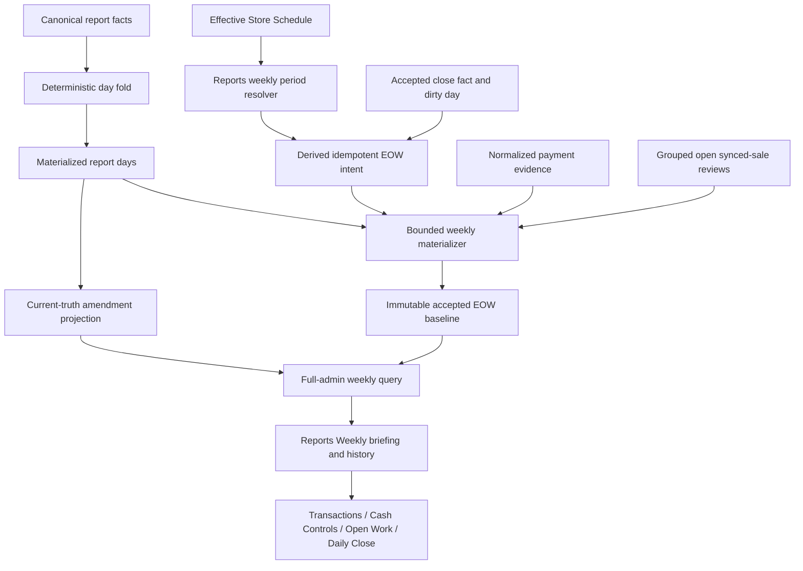
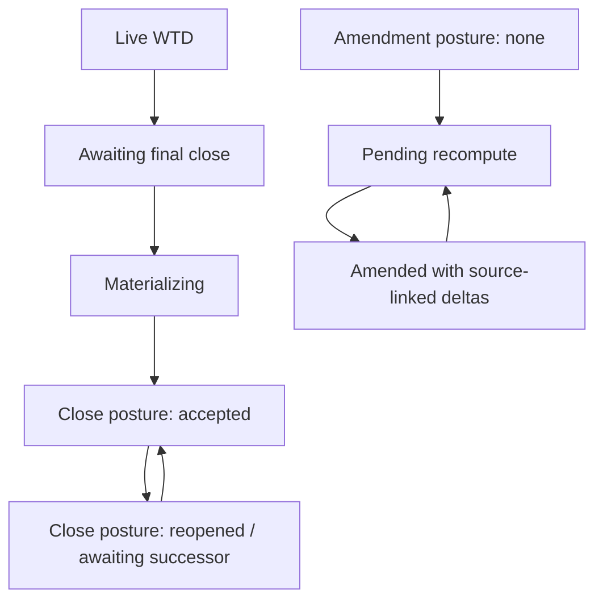
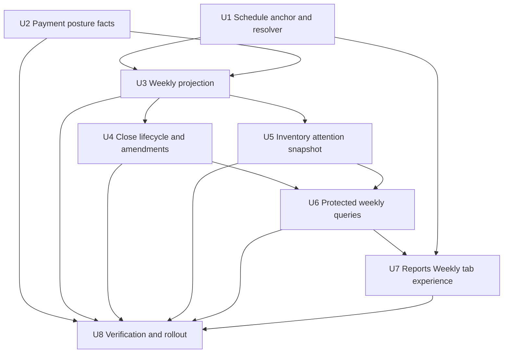
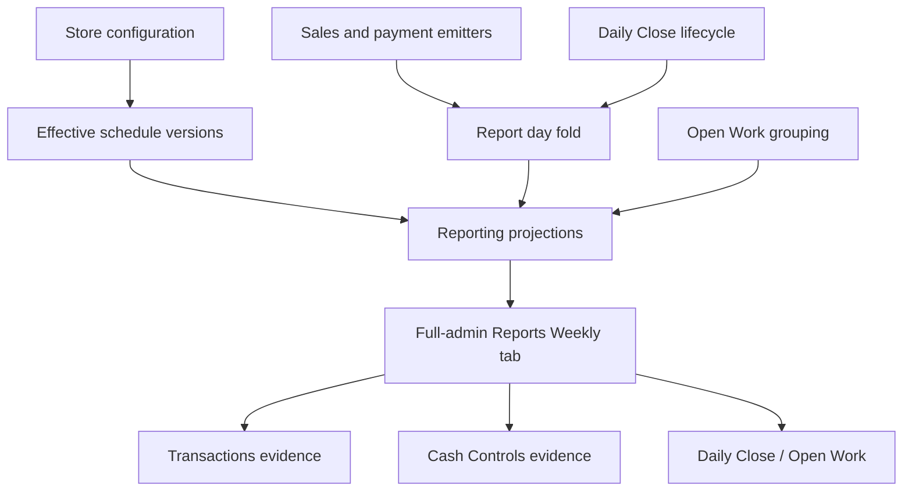

# feat: Add schedule-aware end-of-week reporting

## Summary

Extend Athena's deterministic report-day read model into a schedule-aware weekly briefing for full administrators. Store Schedule will own an effective-dated reporting-cycle start weekday, while a Reports-owned resolver will use that anchor, operational weekdays, and date exceptions—never operating hours—to construct live and preserved weekly periods. The final scheduled date's accepted Daily Close will be discovered from its durable close fact/dirty day; a bounded acceptance-time fold will preserve what Athena knew at that cutoff, while current report-day truth exposes later changes as amendments. A new Weekly tab in the Reports workspace will present financial performance, units moved, payment and variance posture, and grouped open synced-sale inventory reviews while leaving the current Overview experience unchanged.

---

## Problem Frame

Operators currently calculate the business's weekly performance manually because the necessary facts are distributed across Reports, payments, Daily Close, Cash Controls, and Open Work. The implementation must replace that reconciliation work without turning Reports into an accounting system or allowing schedule hours to exclude legitimate financial activity. Product behavior and metric boundaries are defined in the [origin requirements](../../docs/brainstorms/2026-07-09-reports-workspace-requirements.md).

---

## Requirements

### Schedule and weekly lifecycle

- R75–R78, R84, R84a. Store Schedule owns an effective-dated cycle-start weekday (default Monday); Reports resolves included store-local dates from operational weekdays and date exceptions, never opening or closing hours.
- R79–R83. Live and completed periods compare equivalent scheduled positions using each period's effective schedule, show scheduled zero-activity dates, and disclose outside-schedule activity separately without reassignment.
- R85–R91. The weekly briefing progresses from live WTD to an automatically accepted, historical EOW record after the final scheduled date's Daily Close; accepted values remain immutable and later truth is an explicit amendment.

### Performance and operational attention

- R92–R95. Unified net sales leads gross sales, recognized sales refunds, merchandise profit/margin, and sold/returned/net unit movement; current and prior values travel together, and incomplete cost basis withholds profit conclusions.
- R96–R98. Payment collection, payment refunds, allocation, unsettled value, register variance, and accepted-close-to-current deltas stay semantically distinct and disclose incomplete evidence. Payment-method mix is deferred from V1.
- R99–R103. Inventory attention snapshots existing open `synced_sale_inventory_review` logical groups, separates new-this-week from carried-forward, links to Open Work, and never mutates stock or work records.
- R104. Add Weekly as a sibling tab to the existing Overview and Items tabs. Preserve the current Overview route, default selection, period controls, query behavior, and visual hierarchy without folding EOW into it.
- UI craft constraint. Before designing or implementing the Weekly tab, the UI owner must read and apply `.agents/skills/apple-design/SKILL.md`; implementation review must verify its relevant principles of purpose, familiarity, simplicity, spatial consistency, immediate feedback, typography, responsive adaptation, and reduced-motion/reduced-transparency support.

### Access, evidence, and projection integrity

- R1–R3, R12, R39, R42, R46. Every list, detail, and history query remains store-scoped and full-admin protected; values use store currency, disclose trust limitations, and preserve evidence routes.
- F-R55–F-R58, F-R61, F-R65, F-R66, F-R86. Weekly reads must consume reusable verified projections, stay index-backed and bounded, meet the two-second overview p95 target, paginate stable evidence/history, retain last verified truth during rebuilds, expose coverage/cap states, and prove read cost, latency, and store isolation at least ten times the largest observed production-store cardinality.
- The implementation must retain the current fact-ledger and deterministic day-fold authority rather than reviving the superseded generation/read-bundle reporting architecture. In normal business operation, fact identity and business measures remain append-only; the one-time verified `observedAt` metadata backfill and the already-explicit destructive source-reconstruction workflow are the only maintenance exceptions.
- All projection and evidence reads must be index-backed and explicitly bounded. A breached bound returns an incomplete or lower-bound posture instead of a falsely exact result.

**Origin actors:** A1 (full administrator), A2 (Athena), A3 (owning operational workflow)

**Origin flows:** F7 (review and preserve the operating week), F8 (review weekly controls and inventory uncertainty), with F1 and F4 governing the balanced overview and investigation routes

**Origin acceptance examples:** AE14–AE19 are the primary EOW scenarios; AE3, AE5, AE9, and AE10 continue to constrain cost, evidence, synchronization, and accounting language

---

## Scope Boundaries

### Deferred for later

- Organization-wide rollups and cross-store comparisons.
- Manager-elevated or `pos_only` report access.
- Service labor or delivery cost and combined product-and-service profitability.
- Operator-configurable goals, thresholds, forecasting, generic low-stock alerts, velocity, or days-of-cover signals in the EOW briefing.
- Payment-method mix and method-level reporting fact expansion; V1 answers aggregate payment posture first.

### Outside this product's identity

- General accounting, bank reconciliation, payroll, rent, utilities, tax filing, accounting net profit, or cash-flow reporting.
- Mutating payments, register sessions, stock, Daily Close, or operational work from Reports.
- Reassigning outside-schedule activity into an adjacent week or rejecting a sale because it occurred outside configured hours.
- Treating a preserved EOW record as a replacement for source transaction, close, payment, or inventory evidence.

### Deferred to Follow-Up Work

- Reworking the current Overview, its Today/trailing/custom presets, or item-performance windows to use schedule-aware cycles. Weekly is an additive sibling tab, so existing Overview and Items contracts do not change implicitly.
- Generic notification or email delivery of the EOW report. V1 is an in-product briefing and history.
- Remediating pre-existing report facts whose payment metadata cannot be reconstructed with trustworthy source evidence; rollout reports these as legacy coverage gaps.

---

## Context & Research

### Relevant Code and Patterns

- `packages/athena-webapp/convex/reports/foldDay.ts`, `packages/athena-webapp/convex/reports/sweeper.ts`, and `packages/athena-webapp/convex/schemas/reports/derived.ts` establish the deterministic fact-to-day fold, declarative dirty work, and metric-as-field read models. Weekly projections must compose materialized day truth rather than introduce a second aggregation authority.
- `packages/athena-webapp/convex/reports/overview.ts` and `packages/athena-webapp/shared/reportsContract.ts` keep reporting arithmetic and completeness on the server and give the UI a required, typed result.
- `packages/athena-webapp/convex/lib/storeScheduleTime.ts`, `packages/athena-webapp/convex/inventory/storeSchedule.ts`, and `packages/athena-webapp/convex/storeTime/operatingPeriods.ts` demonstrate effective-dated, store-local schedule resolution. The shared schedule domain remains consumer-neutral; EOW membership belongs in a Reports adapter.
- `packages/athena-webapp/convex/operations/dailyClose.ts` already persists immutable close snapshots, emits a close report fact/dirty day, and models completion, reopen, and successor closes. Those existing records are the durable handoff; EOW adds no new close-transaction dependency, and all weekly resolution/materialization remains retryable.
- `packages/athena-webapp/convex/operations/logicalOperationalWork.ts` and `packages/athena-webapp/convex/operations/operationalWorkItems.ts` are the authoritative grouping and open-state semantics for synced-sale inventory reviews.
- `packages/athena-webapp/src/components/reports/ReportsLayout.tsx` owns the existing Overview/Items workspace navigation, `packages/athena-webapp/src/components/reports/ReportsOverviewView.tsx` is the current Overview surface that must remain unchanged, and `packages/athena-webapp/src/components/store-configuration/components/StoreHoursView.tsx` owns schedule configuration.

### Institutional Learnings

- `docs/solutions/architecture/athena-reporting-read-optimized-redesign-2026-07-28.md`: retain the append-only ledger, deterministic day fold, metric-as-field projections, one bounded server-shaped read, and independent source verification.
- `packages/athena-webapp/convex/reports/queries.ts` and `packages/athena-webapp/convex/reports/overview.ts`: document worst-case reads beside each handler/materializer, keep the most-subscribed summary on a singleton document, and separate interactive read budgets from sweep/rebuild budgets.
- `docs/solutions/architecture/athena-store-schedule-foundation-2026-06-27.md`: keep Store Schedule consumer-neutral, persist resolved schedule lineage, and never use schedule windows to reject financial facts.
- `docs/solutions/architecture-patterns/athena-report-prior-period-comparisons-2026-08-01.md`: resolve current and prior windows on the server, carry both values in the contract, preserve unknown versus zero, and keep read caps explicit.
- `docs/solutions/architecture-patterns/athena-reporting-period-focus-and-lifecycle-authority-2026-08-01.md`: reporting lifecycle—not browser time—owns open, accepted, and amended presentation, and stale values must remain paired with their settled period labels.
- `docs/solutions/logic-errors/athena-daily-close-history-snapshots-2026-05-09.md`: preserve historical operational snapshots rather than reconstructing past acceptance from mutable present-day state.

### External References

- None. Current repo patterns directly cover Convex materialization, effective-dated schedules, Daily Close history, and grouped Open Work; external patterns would not override Athena's established domain contracts.

---

## Key Technical Decisions

| Decision | Chosen approach and rationale |
| --- | --- |
| Weekly ownership | Add only `reportingCycleStartsOn` to the effective-dated Store Schedule contract. A Reports-owned weekly resolver derives cycle bounds, included dates, final scheduled date, comparison positions, and outside-schedule dates. This keeps the schedule domain reusable while giving Reports deterministic weekly semantics. |
| Date membership | For each local date, the effective schedule version decides membership: a date exception's `closed` value overrides the recurring `weeklyClosedDays` posture. Window arrays are ignored for financial inclusion. Store-local fact dating continues to use reporting time authority. |
| Historical stability | Persist the resolved cycle anchor, included dates, per-date schedule lineage, comparison dates, timezone lineage, and metric version on acceptance. Later schedule changes affect future resolution only and never reinterpret accepted periods. |
| Projection authority | Weekly values are a bounded composition of `reportDay` rows plus reporting-owned snapshots for weekly-only posture. The normally append-only `reportFact` ledger and deterministic day fold remain the financial source of truth; controlled metadata migration and explicitly invoked source reconstruction do not authorize ordinary in-place fact rewriting. |
| Anchor-change boundary | A reporting-cycle anchor edit becomes effective at the next cycle boundary calculated from the previously effective anchor. A Store Hours submission that changes the anchor stages the entire submitted schedule version for that boundary; immediate operational-day edits require a separate submission. This prevents overlapping or orphaned cycles and keeps final-close triggering deterministic. |
| Active/pending schedule coexistence | A future replacement is inserted as an effective-dated active version while the current version is truncated with `effectiveTo` at the boundary but not prematurely marked superseded. Resolution by effective range keeps the current version available before the boundary and activates the future version even if later status cleanup is delayed. |
| Acceptance sequencing | Daily Close keeps its existing transaction boundary: its immutable `close_snapshot` report fact and dirty-day record are the durable reporting signal, with no new weekly write required for close success. After the final day folds, the sweeper derives an idempotent weekly intent; a bounded reconciliation pass finds accepted closes with no intent. Weekly resolution/materialization failures therefore cannot roll back or block Daily Close. |
| Accepted-baseline cutoff | The intent records the close acceptance timestamp as the immutable knowledge cutoff. Reporting ingestion stamps immutable `observedAt` from server time; callers and reseed cannot supply or backdate it. Baseline materialization folds facts across all seven frame dates whose `observedAt` is at or before the cutoff, then partitions headline from outside-schedule values. Existing facts receive `observedAt` from Convex `_creationTime` before activation. |
| Fact fingerprint transition | Payment dimensions join a bumped fingerprint version for new facts. Replay compares an existing identity with the field set for that row's stored version, so a valid legacy replay neither quarantines nor pretends to have new allocation coverage. Legacy rows remain coverage-unknown during projection-only repair; only separately named, source-proven maintenance may reconstruct or enrich them. |
| Reopen and amendment | The first successfully materialized EOW snapshot is the immutable baseline. Close posture (`awaiting_final_close`, `accepted`, `reopened`, `awaiting_successor`) and amendment posture (`none`, `pending_recompute`, `amended`) are orthogonal so late facts cannot hide a reopened close. A successor accepted close and late facts produce source-linked amendment deltas after affected days refold. |
| Prior-period comparison | Match elapsed scheduled positions within the configured seven-day frame. Each period resolves through its own effective schedule. Live partial-date money compares through the same store-local wall-clock instant; changed membership or incomplete source coverage is disclosed and material comparisons are withheld when the periods are not comparable. |
| Payment posture | Extend normalized payment reporting facts/read models only with source-derived dimensions required to derive collected, payment-refunded, net allocated, and unsettled aggregate values. Recognized sales refunds and payment refunds are separately named; sales recognition never depends on settlement. Payment-method mix is deferred so it does not make the core briefing depend on method-level fact expansion. |
| Inventory posture | Reuse the existing logical group key and open-state projection for `synced_sale_inventory_review`. A group is carried-forward when any still-open member predates the week; otherwise it is new-this-week. Live/current posture uses bounded Open Work; accepted posture derives from the final accepted Daily Close's frozen logical carry-forward snapshot and completeness evidence, so retry timing and later resolution cannot rewrite history. |
| UI placement | Add Weekly as a sibling Reports workspace tab beside Overview and Items, integrating live WTD and accepted EOW history within that tab. Keep Overview as the existing default route and preserve its Today/trailing/custom analysis, search state, query behavior, and hierarchy. Weekly summary queries return compact posture and route parameters; detailed evidence remains lazy and belongs to existing owning workflows. |
| Cross-tab route state | Extract the existing Overview search validator into a shared Reports route-search module without changing its fields or defaults. When navigating Overview → Weekly, map only the validated Overview fields into namespaced optional Weekly return-search fields; when the Overview tab is selected from Weekly, reconstruct only those known Overview fields. Direct Weekly entry carries no snapshot and returns to default Overview. Never accept or construct a raw return URL, and never allow Weekly selection fields to enter the Overview query contract. |
| UI design method | UI implementation must consult `.agents/skills/apple-design/SKILL.md` before component design and record that consultation in the implementation/PR evidence. Apply the skill selectively: prioritize calm hierarchy, familiar tab navigation, direct labels, immediate control feedback, spatially consistent transitions, deliberate typography, responsive layouts, and accessible reduced-motion/transparency/contrast fallbacks; do not add decorative motion, glass, or gesture mechanics that do not serve the briefing. |
| Current Reports model | Extend the existing simple pipeline: canonical `reportFact` ledger, deterministic `reportDay` fold, metric-as-field weekly documents, declarative dirty marks, and the one Reports sweeper. Add one live weekly singleton plus bounded accepted-history rows. Do not introduce generations, candidate/activation tables, a second scheduler, client-side aggregation, or direct operational-source subscriptions. |
| Read-budget contract | Each new public query and weekly build path documents its indexes and worst-case document reads. The Weekly screen reads stored reporting projections only; it never hydrates from facts, payments, Store Schedule, or Open Work. Caps come from observed volumes and must pass one representative, non-empty 10× scale fixture plus the foundation's two-second p95 read target before rollout. If that fixture cannot fit safely, implementation stops for a focused architecture revision rather than adding unplanned chunking machinery or weakening the cap. |
| Subscription lifecycle | Overview and Items mount no Weekly query. Weekly mounts one summary/detail query; opening history may add one bounded paginated query, for a maximum of two. Historical detail replaces the live summary query, and leaving or closing a surface disposes its query. Owner evidence stays in owning routes. |
| Atomic replacement | Weekly rebuilds compute from bounded inputs and replace the stored projection in one mutation. A failed mutation leaves the previous verified projection intact; accepted historical baselines are inserted only after their bounded cutoff fold completes and remain immutable afterward. Independent source verification is a rollout/repair gate, not a second publication pipeline on every refresh. |

---

## Open Questions

### Resolved During Planning

- Where is the reporting-cycle anchor configured? Store Schedule owns an effective-dated weekday with a Monday default, alongside operational-day configuration.
- Does Sunday require special behavior? No. Any outside-schedule date is treated consistently; Sunday is excluded only when the effective schedule says it is non-operational.
- What finishes a report? The accepted Daily Close for the final scheduled local date leaves durable close-fact/dirty-day evidence; after the deterministic day fold catches up, the sweeper derives an idempotent intent and materializes the cutoff-bounded baseline.
- What happens when a final close is reopened? The original accepted report remains immutable, current posture discloses the reopen, and a later accepted successor close contributes an amendment.
- When does an anchor change take effect? At the next boundary under the currently effective anchor; the staged schedule version cannot split or overlap an in-progress reporting cycle.
- Which inventory items require attention? Only open, logically grouped synced-sale inventory review work, separated into new and carried-forward groups.
- Does the report calculate payment settlement from sales? No. Payment posture is derived from normalized payment/allocation evidence and shown separately from recognized sales.
- Is a dedicated Weekly tab needed? Yes. Weekly is an additive sibling to Overview and Items; Overview remains the default and retains its existing period analysis unchanged.

### Deferred to Implementation

- Exact names and field packing for the weekly snapshot, acceptance-intent, and amendment validators may change while preserving the lifecycle and immutable-baseline contracts in this plan.
- Exact numeric caps must be selected from de-identified observed volumes. The implementation records the simple read formula for each path and must pass a representative non-empty 10× fixture; if that supported fixture cannot fit safely, rollout remains blocked pending a focused plan revision.
- Legacy payment rows may expose different reconstructable allocation metadata by source. Implementation must characterize each existing emitter before finalizing the coverage taxonomy; it must not infer missing allocation semantics.
- The smallest reusable UI component breakdown should follow the existing Reports component vocabulary after the contract shape is fixed; this plan does not prescribe component granularity.

---

## High-Level Technical Design

> *This illustrates the intended approach and is directional guidance for review, not implementation specification. The implementing agent should treat it as context, not code to reproduce.*

The weekly lifecycle uses two independent postures so close evidence and current-truth deltas cannot mask each other:

No configured schedule, no scheduled dates, or missing timezone authority makes weekly membership/automatic acceptance unavailable rather than indefinitely “live.” Recognized financial facts remain intact, but the briefing must disclose the blocked weekly classification instead of guessing.

---

## Implementation Units

- U1. **Add the effective-dated reporting anchor and weekly period resolver**

**Goal:** Let operators configure the cycle start in Store Schedule and give Reports a deterministic, historical-safe resolver for included, final, comparison, zero-activity, and outside-schedule dates.

**Requirements:** R75–R84a; F7; AE14, AE15

**Dependencies:** None

**Files:**
- Modify: `packages/athena-webapp/convex/schemas/inventory/storeSchedule.ts`
- Modify: `packages/athena-webapp/convex/inventory/storeSchedule.ts`
- Modify: `packages/athena-webapp/convex/lib/storeScheduleTime.ts`
- Create: `packages/athena-webapp/convex/reports/weeklyPeriods.ts`
- Create: `packages/athena-webapp/convex/reports/weeklyPeriods.test.ts`
- Modify: `packages/athena-webapp/convex/inventory/storeSchedule.test.ts`
- Modify: `packages/athena-webapp/src/components/store-configuration/components/StoreHoursView.tsx`
- Modify: `packages/athena-webapp/src/components/store-configuration/components/StoreHoursView.test.tsx`
- Modify: `packages/athena-webapp/src/components/store-configuration/hooks/useStoreScheduleUpdate.ts`
- Modify: `packages/athena-webapp/src/components/store-configuration/hooks/useStoreScheduleUpdate.test.tsx`

**Approach:**
- Widen first: add the weekday field as optional in persisted, mutation, and return validators; default legacy reads and all new writes to Monday. U8 backfills and verifies existing schedules before a later deployment narrows the field to required.
- Stage an anchor-changing schedule version at the next cycle boundary resolved under the previous anchor. Because the schedule is one versioned aggregate, all fields submitted with that anchor change share the future effective instant; the UI explains that an immediate operational-day change must be saved separately before changing the anchor.
- For a future-effective replacement, keep both non-overlapping versions resolvable: patch the current version's `effectiveTo` to the boundary without immediately changing its active status, and insert the future version with `effectiveFrom` at that boundary. Effective-range resolution, not scheduler timing, switches authority; an internal cleanup may mark the expired version superseded afterward.
- Before saving a combined anchor/schedule edit, show a confirmation naming the effective local date and stating that every submitted change is staged. Let the operator cancel, save immediate operational changes separately, and then stage the anchor. After saving, Store Hours shows both the active anchor and pending anchor/effective date until activation.
- Keep the shared resolver's vocabulary consumer-neutral. The Reports adapter accepts a store-local reference instant and resolves a seven-date frame, each date's effective schedule version, operational membership, final scheduled date, prior-frame positions, and outside-schedule fact dates.
- Apply date-exception closure state before recurring closed-day membership. Ignore all configured windows for weekly inclusion and financial totals.
- Match prior periods by scheduled position, not by blindly subtracting seven days from an included-date list. Return explicit comparability reasons for changed membership, unavailable schedule lineage, and missing timezone authority.

**Patterns to follow:**
- Effective schedule versioning in `packages/athena-webapp/convex/inventory/storeSchedule.ts`
- Store-local parsing and historical resolution in `packages/athena-webapp/convex/storeTime/operatingPeriods.ts`
- Store Hours form/update separation in `packages/athena-webapp/src/components/store-configuration/hooks/useStoreScheduleUpdate.ts`

**Test scenarios:**
- Covers AE14. Happy path: a Monday-anchored Monday–Saturday schedule resolves those six dates, includes a Saturday sale after configured closing time, and classifies Sunday activity outside schedule.
- Covers AE14. Schedule change: a future effective version opens Sunday or changes the anchor; only future frames change, while a period resolved against the earlier version retains its original membership.
- Anchor boundary: changing the anchor mid-cycle stages the new version at the next old-anchor boundary; the active frame retains one anchor/final scheduled date, and no date belongs to two accepted cycles or falls between cycles.
- Combined configuration: submitting operational-day edits with an anchor change stages the full update; saving the operational edit separately can make that change immediately without splitting the anchor transition.
- Pending coexistence: before the boundary, current-date queries return the truncated current version and Store Hours shows the future version as pending; at/after the boundary, queries return the new version even if superseded-status cleanup has not run.
- Failure: a future version insert or current-version truncation fails atomically, leaving the prior schedule unchanged rather than creating an effective-range gap.
- Covers AE15. Zero activity: an operational Wednesday with no `reportDay` row remains an included date with a zero-activity state rather than disappearing.
- Edge case: a recurring closed day opened by a date exception becomes included; an operational weekday closed by exception is excluded and can move the final scheduled date backward.
- Edge case: a cross-midnight or split window changes no membership result.
- Edge case: all seven dates are closed, schedule history is missing, or timezone authority is absent; the resolver returns no automatic-finalization date and a specific unavailable reason.
- Comparison: different effective schedules in current and prior frames return their own included dates and a comparability qualification instead of silently pairing unlike periods.
- UI: changing the reporting-cycle weekday submits the effective-dated schedule update, preserves existing windows/closed days, and uses restrained copy explaining that hours do not constrain report sales.
- UI staging: a combined edit confirmation names the effective date and staged fields; cancel returns to editing; after save, active and pending configurations are distinguishable; a separately saved operational edit can take effect before the staged anchor.

**Verification:**
- The same pure period fixture drives current, comparison, and acceptance membership without a Sunday constant or window-time predicate.
- Existing Store Schedule consumers continue to receive their current operational context, and legacy schedule documents resolve with Monday as the anchor.

- U2. **Normalize payment posture for weekly reporting**

**Goal:** Make collected, payment-refunded, net allocated, and unsettled aggregate posture derivable from canonical payment evidence without changing recognized sales or recognized sales refunds.

**Requirements:** R92, R93, R96–R98, R103; F8; AE17

**Dependencies:** None

**Files:**
- Modify: `packages/athena-webapp/convex/schemas/reports/facts.ts`
- Modify: `packages/athena-webapp/convex/schemas/reports/derived.ts`
- Modify: `packages/athena-webapp/convex/reports/ingest.ts`
- Modify: `packages/athena-webapp/convex/reports/fingerprint.ts`
- Modify: `packages/athena-webapp/convex/reports/fingerprint.test.ts`
- Modify: `packages/athena-webapp/convex/reports/foldDay.ts`
- Modify: `packages/athena-webapp/convex/reports/sweeper.ts`
- Modify: `packages/athena-webapp/shared/reportsContract.ts`
- Modify: `packages/athena-webapp/convex/reports/contract.test.ts`
- Modify: `packages/athena-webapp/convex/reports/ingest.test.ts`
- Modify: `packages/athena-webapp/convex/reports/foldDay.test.ts`
- Modify: `packages/athena-webapp/convex/operations/paymentAllocations.ts`
- Modify: `packages/athena-webapp/convex/operations/paymentAllocations.test.ts`
- Modify: `packages/athena-webapp/convex/cashControls/paymentAllocationAttribution.ts`
- Modify: `packages/athena-webapp/convex/cashControls/paymentAllocationAttribution.test.ts`

**Approach:**
- Characterize every current payment emitter and allocation path first. Extend facts only with immutable source-derived dimensions needed for recognition direction, coverage, and net allocation; do not add method identity or copy mutable payment records into weekly projections.
- Bump the fact fingerprint version for new payment dimensions. On replay, select the fingerprint field set from the existing fact's stored version; legacy rows validate under the legacy hash and expose allocation coverage as unknown rather than being quarantined or silently upgraded.
- Define unsettled as the uncovered portion of collected value after payment refunds and eligible net allocation, with explicit coverage/invalid-state flags. Do not derive settlement by subtracting sales or recognized sales refunds, and do not let over-allocation or mixed currency become a negative unsettled value.
- Keep drawer/register variance in its existing Cash Controls/close evidence lane rather than deriving it from aggregate weekly payment posture.
- Roll aggregate payment totals through the day fold so weekly composition stays bounded. Method-level mix and tender composition remain outside this unit.
- Keep new persisted fields rollout-compatible while the public reporting contract normalizes a required posture and identifies legacy-unknown evidence.

**Execution note:** Add characterization tests for each existing payment source before changing fact emission or allocation attribution.

**Patterns to follow:**
- Structural identity, replay, and quarantine handling in `packages/athena-webapp/convex/reports/ingest.ts`
- Deterministic replacement fold in `packages/athena-webapp/convex/reports/foldDay.ts`
- Allocation source attribution in `packages/athena-webapp/convex/cashControls/paymentAllocationAttribution.ts`

**Test scenarios:**
- Covers AE17. Happy path: recognized sales, a partially allocated payment, and a register variance produce independent sales, collected, allocated, unsettled, and variance values with routes to their owners.
- Payment math: full allocation yields zero unsettled; partial allocation yields the uncovered amount; a payment refund reduces the relevant payment posture without changing the separately reported recognized sales refund metric.
- Edge case: over-allocation, duplicate replay, correction, or payment refund greater than eligible collected value is quarantined or flagged and never rendered as a negative unsettled amount.
- Edge case: mixed currency prevents a combined payment posture while preserving per-day trust flags.
- Legacy coverage: a fact without reconstructable allocation metadata contributes only where aggregate meaning is trustworthy, records omitted value/coverage, and never invents allocation.
- Integration: an allocation mutation emits/replays the canonical payment evidence once, dirties the correct store-local report date, and a refold deterministically replaces the day posture.
- Fingerprint transition: a legacy payment fact replays under its stored version without quarantine and remains coverage-unknown; a new-version replay includes allocation dimensions, while a true same-version mismatch still quarantines.
- Contract: schema metric fields and the shared report contract stay in parity through optional-field rollout.

**Verification:**
- Day folds reproduce identical aggregate payment posture regardless of event arrival order, and disclosed covered plus omitted values reconcile to the eligible payment universe.
- No payment change alters the definition or eligibility of recognized net sales.

- U3. **Materialize bounded weekly projections and immutable baselines**

**Goal:** Persist compact live/current weekly posture and accepted EOW baselines from schedule membership plus materialized report days.

**Requirements:** R79–R95, R98, R103; F-R55–F-R57, F-R61, F-R65, F-R66, F-R86; F7, F8; AE15–AE17

**Dependencies:** U1, U2

**Files:**
- Modify: `packages/athena-webapp/convex/schemas/reports/derived.ts`
- Modify: `packages/athena-webapp/convex/schemas/reports/index.ts`
- Modify: `packages/athena-webapp/convex/schema.ts`
- Create: `packages/athena-webapp/convex/reports/weekly.ts`
- Create: `packages/athena-webapp/convex/reports/weekly.test.ts`
- Modify: `packages/athena-webapp/convex/reports/sweeper.ts`
- Modify: `packages/athena-webapp/convex/reports/sweeper.test.ts`
- Modify: `packages/athena-webapp/shared/reportsContract.ts`
- Modify: `packages/athena-webapp/convex/reports/contract.test.ts`

**Approach:**
- Add indexed, store-scoped weekly projection records for the resolved cycle and an idempotent acceptance-intent/dirty-work record. Keep metric fields explicit and versioned; do not store metric-per-row evidence.
- Add immutable optional-then-required `observedAt`, stamped only inside reporting ingestion from server time, plus a report-fact index ordered by store, operating date, and `observedAt`. Caller payloads and reseed cannot set it. This lets the one-time acceptance fold enforce its knowledge cutoff before the cap.
- Build a pure weekly fold from resolved membership plus bounded `reportDay` rows. Synthesize scheduled zero-activity slots, aggregate outside-schedule activity separately, and propagate day trust, cost coverage, payment coverage, and cap status.
- For live/current truth, compose resolved membership from the bounded materialized `reportDay` universe and keep the Weekly tab on one Reports-owned singleton subscription boundary rather than subscribing to source domains. At EOW acceptance, persist the close acceptance timestamp as a cutoff and perform a separate one-time deterministic fold of `reportFact` rows across every date in the seven-date frame with server-stamped `observedAt` at or before that cutoff. Partition the result into included headline and outside-schedule baseline values, then persist those original values and lineage once.
- Put a short worst-case read-budget comment beside the live compositor and acceptance materializer: indexes used, maximum documents by table, and the single global seven-date fact cap plus overflow probe. The cap is shared across the frame, not multiplied per date.
- Compute and replace the live/current singleton atomically from its bounded inputs so failure leaves the prior verified document intact. Insert an accepted baseline only after the bounded cutoff fold succeeds; a cap breach publishes nothing and returns explicit incomplete posture.
- Maintain exactly one current-truth/amendment projection whose deltas are computed against the immutable baseline after relevant day refolds; late-recorded facts can never enter the baseline even if initial materialization retries.
- Resolve prior-period values through that period's schedule versions and include current/prior values and comparability posture together. For live final-date comparisons, use the same store-local wall-clock cutoff without referencing configured opening minutes.
- Use a declarative dirty marker drained by the existing sweeper. Failure remains retryable and visible, never publishes a partial exact snapshot, and cannot replace the prior verified live projection.

**Patterns to follow:**
- Metric-as-field validators in `packages/athena-webapp/convex/schemas/reports/derived.ts`
- Pure fold plus bounded replacement in `packages/athena-webapp/convex/reports/foldDay.ts`
- Dirty-marker retry and cap handling in `packages/athena-webapp/convex/reports/sweeper.ts`

**Test scenarios:**
- Covers AE15. Live WTD includes each scheduled slot through the current position, represents a missing row as zero activity only when source posture supports that conclusion, and compares the same scheduled positions in the prior frame.
- Covers AE16. Acceptance stores schedule/timezone/close/metric lineage and an immutable baseline; a late included-date sale changes current truth and creates an explicit delta without changing accepted values.
- Cutoff race: an event occurs before close but Athena observes/ingests its fact after the acceptance cutoff and before the first successful weekly materialization; it is excluded from the baseline and included in current truth/amendment regardless of retry timing.
- Reseed race: a fact with pre-close business time is inserted by reseed after acceptance; its server-stamped `observedAt` is after the cutoff, so it remains amendment-only even though `occurredAt` and legacy `recordedAt` predate acceptance.
- Retry determinism: repeated baseline attempts use the stored cutoff and produce the same fingerprint even after newer facts and report-day folds exist.
- Financials: net/gross/recognized-sales-refunds/payment collection expose prior values and basis-point or unavailable changes; merchandise profit/margin remain null when cost coverage is insufficient.
- Units: sold, returned/corrected, and net units compose across included days and stay separate from financial refund timing.
- Outside schedule: facts on excluded dates appear in a separately labeled total, never in headline or adjacent-week totals.
- Outside-schedule cutoff: an excluded-date fact with `observedAt` before the acceptance cutoff enters the accepted outside-schedule baseline; the same fact observed afterward appears only in current outside-schedule truth/amendment.
- Edge case: current and prior membership differ; raw values remain inspectable, but affected comparisons carry a qualification or are withheld according to comparability rules.
- Edge case: all dates closed, missing schedule/timezone, mixed currency, a missing day fold, or a global cap breach returns its specific unavailable/incomplete state without publishing partial values.
- Idempotency: replaying the same weekly dirty mark or acceptance intent produces one baseline and stable current values.
- Failure: weekly materialization throws after intent creation; the intent remains retryable, no partial baseline becomes visible, and the already-completed Daily Close is unaffected.
- Shared weekly budget: facts skewed to one date and spread across seven dates both stay within one global cap plus one overflow probe; the per-date loop cannot multiply the declared budget.
- Read budget: instrumented tests account for every indexed read and probe for live composition, acceptance, and retry; actual counts remain within the documented formula.
- Scale: one representative, non-empty fixture at least 10× the largest de-identified observed weekly volume completes within the declared cap and meets the two-second p95 read target. A separate beyond-cap fixture returns incomplete without scanning further.

**Verification:**
- Live/current weekly posture can be rebuilt from schedule lineage and current `reportDay` documents, while the accepted baseline rebuild uses its stored cutoff and bounded facts to retain the original fingerprint.
- Bounded-read tests assert the index path, successful supported-scale completion, and the operator-visible incomplete result beyond the cap.
- Cutoff-fold tests assert the store/date/`observedAt` index is used and that cap probing occurs inside the cutoff-bounded range.
- The U3 read budget matches instrumented counts at empty, normal, cap-edge, representative 10×, and beyond-cap cardinalities; a failed rebuild leaves the previous live singleton unchanged.

- U4. **Connect Daily Close, reopen, and late facts to the weekly lifecycle**

**Goal:** Trigger EOW acceptance after the final scheduled close and keep reopen, successor-close, and late-fact behavior auditable and retryable.

**Requirements:** R82, R85–R91, R98, R103; F7; AE16

**Dependencies:** U3

**Files:**
- Modify: `packages/athena-webapp/convex/operations/dailyClose.ts`
- Modify: `packages/athena-webapp/convex/operations/dailyClose.test.ts`
- Modify: `packages/athena-webapp/convex/reports/ingest.ts`
- Modify: `packages/athena-webapp/convex/reports/ingest.test.ts`
- Modify: `packages/athena-webapp/convex/reports/sweeper.ts`
- Modify: `packages/athena-webapp/convex/reports/sweeper.test.ts`
- Modify: `packages/athena-webapp/convex/reports/weekly.ts`
- Modify: `packages/athena-webapp/convex/reports/weekly.test.ts`

**Approach:**
- Preserve the existing Daily Close transaction only: its immutable `close_snapshot` report fact and report dirty-day entry are sufficient durable handoff evidence. Do not add a weekly schema/write dependency to close completion.
- After the dirty final day folds, let the sweeper resolve whether the accepted close date is final, derive the cycle identity and acceptance cutoff, and idempotently create/materialize the weekly intent. Any resolution, fold, or projection failure remains retryable and cannot unwind the completed close.
- Add a bounded internal reconciliation pass over recent accepted closes/final dates to recreate a missing weekly intent when dirty-work processing was skipped, failed, or rolled back during deployment. Structural store/cycle/close identity makes rediscovery harmless.
- Require the final `reportDay` to reference the accepted close and its latest fold before writing the baseline. This makes close acceptance and reporting visibility converge without relying on best-effort scheduling order.
- On reopen, dirty the affected report day and weekly projection and change only close posture to reopened/awaiting successor. Preserve the accepted baseline, original close link, and any independent amendment posture.
- On successor completion, fold against the latest non-superseded accepted close and record the resulting difference as an amendment with source close lineage. Late facts dirty both their day and every materialized weekly frame whose included or outside-schedule range contains that date.
- Maintain exactly one current-truth amendment projection per accepted weekly report. Its fingerprint, last-change metadata, and bounded source lineage explain the latest difference and make retries idempotent; V1 does not add a multi-entry amendment history.

**Patterns to follow:**
- Immutable completion snapshot and successor close behavior in `packages/athena-webapp/convex/operations/dailyClose.ts`
- Best-effort report side effects and dirty-day recovery in `packages/athena-webapp/convex/reports/ingest.ts`
- Latest accepted non-superseded close selection in `packages/athena-webapp/convex/reports/sweeper.ts`

**Test scenarios:**
- Covers AE16. A completed non-final close leaves normal close-fact/day-fold evidence but produces no EOW; the final scheduled close produces one derived intent after its day fold catches up.
- Exception boundary: a date-specific closure moves the final scheduled date earlier; a normally closed day opened by exception can become the final trigger.
- Idempotency: repeated close-completion side effects and sweeper retries preserve one acceptance baseline.
- Recovery: remove or skip the first derived weekly intent, then run bounded accepted-close reconciliation; it recreates the same intent/baseline identity without changing Daily Close.
- Reopen: reopening the accepted final close retains the baseline, marks the current posture as reopened, and dirties the day/week even before a successor exists.
- Ordering: a late fact while the close is reopened leaves close posture reopened and independently marks amendment recomputation/current deltas; neither state hides the other.
- Successor: accepting a replacement close produces a source-linked amendment after refold and does not overwrite original accepted values.
- Late included activity: a fact with `observedAt` after acceptance updates current truth and the accepted-close variance delta.
- Late outside activity: a fact on an excluded date updates only outside-schedule disclosure/amendment posture.
- Failure: schedule resolution, intent creation, or weekly materialization fails after Daily Close; Daily Close remains completed, normal close evidence remains durable, and dirty work plus bounded reconciliation can retry without an operator re-closing the day.

**Verification:**
- Every lifecycle transition is recoverable from durable close, fact, dirty-work, and projection records without manually finalizing or deleting a report.
- Reopen and late-fact behavior is visible in both backend contract tests and the eventual UI contract, with baseline values unchanged.

- U5. **Snapshot grouped synced-sale inventory attention**

**Goal:** Add inventory levels requiring attention by reusing open synced-sale inventory review groups and preserving new-versus-carried-forward posture at EOW acceptance.

**Requirements:** R99–R103; F-R55, F-R56, F-R61, F-R65, F-R66, F-R86; F8; AE18

**Dependencies:** U3

**Files:**
- Modify: `packages/athena-webapp/convex/operations/logicalOperationalWork.ts`
- Modify: `packages/athena-webapp/convex/operations/operationalWorkItems.ts`
- Modify: `packages/athena-webapp/convex/operations/operationalWorkItems.test.ts`
- Create: `packages/athena-webapp/convex/reports/weeklyInventory.ts`
- Create: `packages/athena-webapp/convex/reports/weeklyInventory.test.ts`
- Modify: `packages/athena-webapp/convex/reports/weekly.ts`
- Modify: `packages/athena-webapp/convex/reports/weekly.test.ts`
- Modify: `packages/athena-webapp/shared/reportsContract.ts`

**Approach:**
- Extract or reuse a bounded, store-scoped logical projection that returns only open `synced_sale_inventory_review` groups using the same group key, canonical SKU, member precedence, and lifecycle rules as Open Work.
- Document the Open Work projection's worst-case group/member read budget, index ranges, probe read, and rebuild invalidation source. Select its caps from observed cardinalities and prove the supported 10× fixture completes exactly; only beyond-contract input may return the lower-bound/incomplete posture.
- Classify at group level: any still-open member created before the reporting frame makes the group carried-forward; otherwise it is new-this-week. Record whether a carried-forward group also had new weekly activity without counting it twice.
- Derive the accepted inventory baseline from the final accepted Daily Close's frozen logical carry-forward snapshot: group/member identity, SKU identity, oldest actionable time, counts/affected units where trustworthy, and membership completeness. Classify new versus carried-forward against the resolved frame. If the close snapshot lacks sufficient evidence, mark the accepted inventory lane unavailable rather than querying mutable Open Work later.
- Use the bounded current Open Work projection for live WTD and current/amendment posture only. Persist the accepted classification and canonical route alongside the report; historical acceptance never changes when work is later created or resolved.
- Enforce an indexed cap. When more groups exist than the bound, show lower-bound counts and an incomplete state with the Open Work route rather than selecting an arbitrary exact subset.

**Patterns to follow:**
- Group keys and representative selection in `packages/athena-webapp/convex/operations/logicalOperationalWork.ts`
- Bounded open-work reads and incompleteness in `packages/athena-webapp/convex/operations/operationalWorkItems.ts`

**Test scenarios:**
- Covers AE18. Two current-week items for one SKU collapse to one new group; an earlier still-open group remains one carried-forward group.
- Group precedence: a carried-forward group receiving a new member this week stays carried-forward, is counted once, and records new activity.
- Lifecycle: resolved or superseded members do not make a group open unless another authoritative member remains open.
- Historical stability: resolving a group after EOW acceptance changes live Open Work but leaves the accepted weekly snapshot unchanged.
- Retry stability: work is created or resolved after close acceptance but before a delayed weekly materialization; accepted inventory comes from the frozen close snapshot, while current posture reflects the later Open Work state.
- Missing evidence: a legacy final-close snapshot lacks logical group membership/completeness; the accepted inventory lane is unavailable and current Open Work is not substituted as historical truth.
- Edge case: missing SKU identity follows existing fallback grouping and carries an evidence limitation rather than merging unrelated work.
- Bound breach: exceeding the group/member cap returns lower-bound counts and an incomplete flag while retaining the Open Work route.
- Read budget: empty, normal, cap-edge, supported 10×, and beyond-cap fixtures keep instrumented Open Work reads within the documented budget; the supported fixture returns exact logical groups, while only the beyond-cap fixture is incomplete.
- Integration: weekly materialization and the Open Work query produce the same logical group keys for the same fixture.

**Verification:**
- Inventory-attention totals reconcile to the existing Open Work grouping universe at acceptance time and never write to operational work or inventory tables.

- U6. **Expose protected weekly briefing and history contracts**

**Goal:** Provide compact, server-shaped live/current/accepted weekly results and historical selection for the active store, with lazy routes to source evidence.

**Requirements:** R1–R3, R12, R39, R42, R46, R84, R89–R103; F-R55–F-R58, F-R61, F-R65, F-R66, F-R86; F7, F8; AE16–AE18

**Dependencies:** U4, U5

**Files:**
- Modify: `packages/athena-webapp/convex/reports/access.ts`
- Modify: `packages/athena-webapp/convex/reports/access.test.ts`
- Modify: `packages/athena-webapp/convex/reports/queries.ts`
- Modify: `packages/athena-webapp/convex/reports/queries.test.ts`
- Modify: `packages/athena-webapp/shared/reportsContract.ts`
- Modify: `packages/athena-webapp/convex/reports/contract.test.ts`

**Approach:**
- Add three bounded public Convex read functions—active weekly briefing, paginated weekly history, and historical weekly detail—rather than several reactive subscriptions to operational source tables. Each validates arguments, authorizes full-admin membership before data access, scopes every lookup by store-prefixed indexes, and returns indistinguishable not-found behavior across stores.
- Put a short read-budget comment beside each handler, following the current Reports query convention: authorization path, projection/index reads, page-size-plus-probe behavior, and maximum documents. Active, history, and detail read only stored weekly documents and must meet the existing two-second overview p95 target at the representative 10× fixture.
- Keep history store-scoped, newest-first, indexed, and paginated. Resolve a selected historical record by stable report identity, never by recomputing its schedule membership from current configuration.
- Include deterministic owner routes for Transactions, Daily Close, Cash Controls/register evidence, and filtered Open Work. Detailed rows remain lazy and use each owner's existing protected query.
- Apply the existing full-admin guard independently to active briefing, history list, historical detail, and any evidence endpoint. Return not-found across stores rather than revealing record existence.
- Keep acceptance marking/materialization, dirty-work sweeping, reseed, verification, migration, expiry, and deletion as internal Convex functions or unregistered helpers invoked only by trusted domain mutations, scheduled jobs, and authorized operator tooling. Actor/store identity is server-derived; any unavoidable public maintenance mutation must be named explicitly and carry full-admin plus store-scope guards.
- Normalize optional persisted rollout fields into one required shared client contract and preserve unknown, incomplete, stale, provisional, reopened, and amended states distinctly.

**Patterns to follow:**
- Full-admin store access in `packages/athena-webapp/convex/reports/access.ts`
- Server-shaped overview results in `packages/athena-webapp/convex/reports/overview.ts`
- Bounded list and detail contracts in `packages/athena-webapp/convex/reports/queries.ts`

**Test scenarios:**
- Covers AE16. Active query transitions from live WTD to accepted EOW and returns baseline plus current amendment without relabeling the baseline.
- Covers AE17. Payment/variance summaries keep sales recognition and settlement separate, disclose incomplete coverage, and carry owner routes.
- Covers AE18. Inventory summary returns new/carried-forward logical group counts and a filtered Open Work route.
- Authorization: full admin for Store A can list and view Store A records; manager elevation, `pos_only`, unauthenticated users, and a full admin scoped to another store cannot retrieve them.
- Input/abuse boundary: malformed report IDs, invalid cursors, oversized page requests, and forged store IDs are rejected before reads; repeated public reads remain within the same explicit caps.
- Read budget: empty, maximum-page, continuation-probe, not-found, cross-store, and malformed-input cases remain within each handler's documented maximum; invalid inputs fail before projection reads.
- Scale: at least 10× the largest observed accepted-history cardinality still returns one bounded page and stable continuation, while active/detail document reads remain constant.
- Internal boundary: public callers cannot invoke acceptance, sweep, reseed, verify, migration, expiry, or purge operations, and domain/scheduler paths derive store and actor context server-side.
- History: pagination is deterministic and bounded; selecting an accepted record uses stored membership and comparison labels after a later schedule change.
- Rollout: an older projection missing newly optional fields is normalized to explicit unavailable states rather than zero.
- Failure: a missing projection returns unavailable/rebuild posture. Supported scale must complete in one bounded atomic build; a cap or transaction-headroom failure preserves the prior verified projection and publishes no partial result. If the representative 10× fixture cannot fit safely, rollout remains disabled until the plan is revised. Explicitly beyond-contract volume returns a bounded capacity/incomplete state naming the affected lane and authorized support action. None falls back to source reads.
- Currency: all amounts remain in the stored store currency and mixed-currency posture withholds invalid combined totals.

**Verification:**
- The Weekly route never exceeds two compact, projection-backed subscriptions; history/detail remain lazy and bounded. The Overview route starts no weekly query and retains its existing query timing.

- U7. **Build the weekly briefing and history in a Reports Weekly tab**

**Goal:** Replace manual weekly calculation with a calm, scannable full-admin briefing that makes lifecycle, comparisons, exceptions, and next investigation steps clear.

**Requirements:** R7–R12, R81, R84–R104; A1, A3; F1, F4, F7, F8; AE14–AE19

**Dependencies:** U1, U6

**Files:**
- Modify: `packages/athena-webapp/src/components/reports/ReportsLayout.tsx`
- Modify: `packages/athena-webapp/src/components/reports/ReportsLayout.test.tsx`
- Create: `packages/athena-webapp/src/components/reports/reportRouteSearch.ts`
- Create: `packages/athena-webapp/src/components/reports/reportRouteSearch.test.ts`
- Create: `packages/athena-webapp/src/components/reports/ReportsWeeklyView.tsx`
- Create: `packages/athena-webapp/src/components/reports/ReportsWeeklyView.test.tsx`
- Create: `packages/athena-webapp/src/components/reports/ReportWeeklyBriefing.tsx`
- Create: `packages/athena-webapp/src/components/reports/ReportWeeklyBriefing.test.tsx`
- Create: `packages/athena-webapp/src/components/reports/ReportWeeklyHistory.tsx`
- Create: `packages/athena-webapp/src/components/reports/ReportWeeklyHistory.test.tsx`
- Modify: `packages/athena-webapp/src/components/reports/reportFormat.ts`
- Modify: `packages/athena-webapp/src/components/reports/reportFormat.test.ts`
- Modify: `packages/athena-webapp/src/routes/_authed/$orgUrlSlug/store/$storeUrlSlug/reports/index.tsx`
- Modify: `packages/athena-webapp/src/routes/_authed/$orgUrlSlug/store/$storeUrlSlug/reports/index.test.ts`
- Create: `packages/athena-webapp/src/routes/_authed/$orgUrlSlug/store/$storeUrlSlug/reports/weekly.tsx`
- Create: `packages/athena-webapp/src/routes/_authed/$orgUrlSlug/store/$storeUrlSlug/reports/weekly.test.ts`
- Verify unchanged: `packages/athena-webapp/src/components/reports/ReportsOverviewView.tsx`
- Verify unchanged: `packages/athena-webapp/src/components/reports/ReportsOverviewView.test.tsx`

**Approach:**
- Add a directly labeled `Weekly` tab to `ReportsLayout` after Overview and before Items, backed by a dedicated `/reports/weekly` route. Keep `/reports` as the default Overview route and do not alter `ReportsOverviewView`, its Today/trailing/custom period selector, search fields/defaults, query timing, or visual hierarchy; the only production change in `reports/index.tsx` is importing its unchanged search schema from the shared route-search module.
- Move the existing Overview search schema unchanged into `reportRouteSearch.ts`. Define the Weekly selection schema there plus optional, namespaced return fields corresponding exactly to Overview's `window`, day range/table range/page, and selected-day fields. Provide pure field-by-field mapping helpers; do not serialize arbitrary objects or accept a path/URL.
- On Overview → Weekly tab selection, carry the current validated Overview search values into those Weekly return fields. On Weekly → Overview tab selection, restore the mapped Overview search object. Direct entry to Weekly and invalid/absent return fields lead to Overview defaults. Weekly report/history selection remains independent and is never copied into Overview search.
- Extend the existing `ReportsLayout` navigation tests to cover Overview/Weekly/Items ordering, exact active-state matching, preservation of Overview as the base/default route, an Overview non-default-search → Weekly → Overview tab round trip, and unchanged SKU-detail suppression. Add an Overview route regression assertion that no Weekly query starts while Overview is active.
- Before UI design or implementation begins, read and apply `.agents/skills/apple-design/SKILL.md`. Capture the relevant decisions in implementation evidence and include an explicit UI review against the skill before completion. Use familiar workspace navigation and restrained, purpose-led interaction; motion or material effects must clarify state or hierarchy rather than decorate the report.
- Integrate live WTD and historical EOW selection in one hierarchy within the Weekly tab. Weekly route search state owns the selected report identity; Overview search state remains independent and unchanged.
- Show close posture (live, awaiting final close, materializing, accepted, reopened/awaiting successor) independently from amendment posture (none, recomputing, amended). Show resolved included date labels and separately disclose outside-schedule activity.
- Lead with unified net sales and prior-period change. Follow with gross sales/recognized sales refunds, merchandise profit/margin plus cost coverage, units sold/returned/net, payment collection/payment refunds/allocation/unsettled, variance posture, and new/carried-forward inventory attention.
- Render scheduled zero-activity dates distinctly from missing or unsettled dates. Keep accepted values visually stable and put amendment deltas/current truth beside—not in place of—the baseline.
- Use restrained operator language from `docs/product-copy-tone.md`; avoid accounting claims, alarmist labels, and raw backend error strings.
- Add bounded historical selection within Weekly. Keep stale-while-refresh data paired with its settled report identity so values never appear under the wrong date or lifecycle label.
- Model history as a bounded newest-first week selector. Store the selected weekly report identity in validated Weekly-route search state so browser back/forward and owner-route return context restore the same view; user-facing labels show dates, never internal IDs.
- Keep the query lifecycle small: Weekly mounts one summary or selected-detail query, and opening history may add one paginated query. Overview/Items mount none; closing history or leaving Weekly disposes the extra query. Do not prefetch owner evidence.
- On compact screens, preserve the same priority order, stack metric sections without horizontal page scrolling, keep accepted/current-amendment values adjacent, keep comparison labels readable, and make history and workspace-tab controls plus owner links touch-sized. Heading and keyboard order remain identical across breakpoints.
- When historical selection changes, keep focus on the initiating selector and use one polite, non-duplicative status region to announce loading and then the settled reporting dates plus lifecycle posture. Do not expose a new period label beside stale values or force focus into refreshed content.
- Give tab, history, disclosure, and owner-route controls immediate press/focus feedback. Any state transition must be interruptible where user-driven, preserve spatial origin, and reduce to a short cross-fade or static update under `prefers-reduced-motion`; translucent treatments require solid/high-contrast fallbacks and must not be stacked.
- Build hierarchy through deliberate type size, weight, tracking, leading, proximity, and whitespace rather than a grid of equally prominent KPI cards. Net sales is the singular visual headline; supporting metrics explain it, and attention lanes remain subordinate but discoverable.
- Complete a browser-based Apple-design review matrix before handoff: representative live, accepted, amended, and incomplete fixtures at desktop and compact viewports; keyboard-only navigation; touch-target inspection; 200% zoom/large text; reduced motion; reduced transparency; and increased contrast. Record the completed PR evidence checklist without requiring screenshots. Mark motion/material checks not applicable only when the implementation contains none, with that restraint recorded as the design decision.
- Route all action links to existing owning workflows with origin/return context. The briefing itself has no mutation controls.

**Patterns to follow:**
- Metric presentation and comparison behavior in `packages/athena-webapp/src/components/reports/ReportPeriodMetrics.tsx`
- Trust language in `packages/athena-webapp/src/components/reports/ReportTrustStrip.tsx`
- Stable query/context pairing in `packages/athena-webapp/src/components/reports/useStableReportQuery.ts`
- Existing Reports route/search handling in `packages/athena-webapp/src/routes/_authed/$orgUrlSlug/store/$storeUrlSlug/reports/index.tsx`
- Reports workspace tab navigation in `packages/athena-webapp/src/components/reports/ReportsLayout.tsx`
- Pure validated cross-tab search mapping in `packages/athena-webapp/src/components/reports/reportRouteSearch.ts`
- Required UI design guidance in `.agents/skills/apple-design/SKILL.md`

**Test scenarios:**
- Covers AE14. A Monday–Saturday report labels the six included dates, keeps after-hours Saturday sales in headlines, and labels Sunday activity as outside schedule without Sunday-specific copy.
- Covers AE15. Live Thursday view shows Wednesday as scheduled zero activity and displays current/prior values for the equivalent elapsed positions.
- Covers AE16. Accepted view retains baseline numbers after a late sale and renders a clearly labeled amendment/current-truth delta; a report that is both amended and reopened shows both conditions and explains that revised close evidence is pending.
- Covers AE17. Partial allocation and register variance appear in separate payment and variance sections with incomplete-evidence copy and correct owner links.
- Covers AE18. New and carried-forward inventory-review group counts render once per logical group and link to filtered Open Work.
- Covers AE19. Overview remains the unchanged default route, Weekly is a sibling route with independent search state, and Overview starts no weekly query.
- Cost: incomplete cost coverage withholds margin/change and explains why without substituting zero.
- Loading/stability: changing history selection keeps the prior result paired with its prior period label until the new result settles; focus remains on the selector, and a polite status announcement names loading followed by the settled reporting dates and lifecycle posture without duplicating visible headings.
- Existing Overview preservation: `/reports` remains the default, its rendered hierarchy and Today/trailing/custom interactions remain unchanged, and visiting or returning from Weekly does not rewrite Overview search state.
- Information hierarchy: Weekly has one net-sales headline followed by financial explanation, units, payment posture, variance, inventory attention, and disclosures; it does not render the existing Overview analysis summary inside the Weekly route.
- Navigation: the workspace renders Overview, Weekly, and Items in that order with correct `aria-current`; selecting a historical week updates Weekly route search state, browser back restores the previous week or tab, and returning from an owning workflow restores the same store/report selection.
- Subscription lifecycle: query-spy tests prove Overview/Items mount no Weekly query, Weekly mounts one summary/detail query, opening history raises the maximum to two, and leaving/closing disposes the extra query. No payment, Open Work, or source-evidence query is mounted by Weekly.
- Cross-tab state: starting from every supported non-default Overview search field, selecting Weekly through the workspace tab carries only validated namespaced return fields; selecting Overview through its tab reconstructs the original Overview search and query behavior. Direct Weekly entry returns to default Overview, and malformed/unknown return fields are rejected or stripped without becoming a redirect.
- Responsive: narrow viewports introduce no horizontal page scrolling; baseline and amendment values remain adjacent; history, workspace-tab, and owner-link controls meet existing touch-target conventions; semantic and keyboard order matches desktop.
- Empty/unavailable: no schedule, no scheduled dates, no report activity, materializing, cap-exceeded, and mixed-currency states each provide a specific next step without fabricated totals.
- Accessibility: section headings, lifecycle status, comparison direction, amendment meaning, and action-link purpose remain understandable without color; keyboard navigation reaches history and owner routes in logical order.
- Apple-design review: interaction feedback is immediate, state changes preserve spatial consistency, typography and grouping communicate the intended hierarchy, unnecessary motion/material effects are absent, and reduced-motion, reduced-transparency, high-contrast, keyboard, touch, and large-text checks pass.
- Browser evidence: the completed PR checklist records functional review of desktop and compact layouts, keyboard order, touch targets, 200% zoom, horizontal overflow, and reduced-motion/transparency/contrast results for every supported browser signal. No screenshots are required. Semantic and route-state assertions remain in Vitest.
- Authorization integration: route-level full-admin protection remains in place and no weekly data query fires for an excluded role.

**Verification:**
- A full administrator can answer how much the business brought in, units moved, payment posture, variances, and inventory uncertainty from the Weekly tab, and can distinguish accepted values from later truth.
- The existing Overview remains behaviorally and visually unchanged except for the additive Weekly workspace tab in its shared layout.
- The UI performs no weekly arithmetic beyond display formatting and offers no corrective mutation.
- The focused Reports component, route, route-search, briefing, and history suites pass, including the existing Overview component/route suites as unchanged-behavior regression gates.
- Run the repo-local browser-testing workflow against `/reports` and `/reports/weekly`; verify Overview has no behavioral or visual changes beyond the shared additional tab, and attach the Apple-design review matrix evidence before U7 is complete.

- U8. **Add independent verification, compatibility backfill, and staged rollout**

**Goal:** Prove weekly values against source truth, bring existing stores forward safely, and make incomplete rollout states observable before broad enablement.

**Requirements:** R42, R82–R89, R93–R103; F-R55, F-R56, F-R58, F-R61, F-R65, F-R66, F-R86; AE14–AE18

**Dependencies:** U2, U3, U4, U5, U6, U7

**Files:**
- Modify: `packages/athena-webapp/convex/migrations/backfillStoreSchedules.ts`
- Create: `packages/athena-webapp/convex/migrations/backfillReportingCycleStart.ts`
- Create: `packages/athena-webapp/convex/migrations/backfillReportingCycleStart.test.ts`
- Create: `packages/athena-webapp/convex/migrations/backfillReportFactObservedAt.ts`
- Create: `packages/athena-webapp/convex/migrations/backfillReportFactObservedAt.test.ts`
- Create: `packages/athena-webapp/convex/reports/weeklyRepair.ts`
- Create: `packages/athena-webapp/convex/reports/weeklyRepair.test.ts`
- Create: `packages/athena-webapp/convex/reports/weeklyScale.test.ts`
- Modify: `packages/athena-webapp/convex/reports/reseed.ts`
- Modify: `packages/athena-webapp/convex/reports/reseed.test.ts`
- Modify: `packages/athena-webapp/convex/reports/verify.ts`
- Modify: `packages/athena-webapp/convex/reports/verify.test.ts`
- Modify: `packages/athena-webapp/convex/platform/capabilityCatalog.ts`
- Modify: `packages/athena-webapp/convex/reports/contract.test.ts`
- Modify: `packages/athena-webapp/convex/inventory/stores.ts`
- Modify: `packages/athena-webapp/convex/inventory/stores.test.ts`
- Modify: `packages/athena-webapp/convex/inventory/organizations.ts`
- Modify: `docs/brainstorms/2026-07-09-reports-workspace-requirements.md`
- Modify: `docs/brainstorms/2026-07-09-reports-foundation-requirements.md`

**Approach:**
- Follow widen–migrate–verify–narrow for the anchor. U1 deploys optional persisted/input/output validators with Monday compatibility reads and required values on new writes; U8 dry-runs, resumes, and completes the idempotent backfill; a completion check gates a later schema-narrowing deployment. Do not rewrite historical accepted weekly membership.
- Apply the same widen–migrate–verify–narrow sequence to `reportFact.observedAt`: ingestion immediately server-stamps new facts; an idempotent migration fills legacy facts from immutable Convex `_creationTime`; a completion check and cutoff-index verification gate both field narrowing and weekly capability activation. Reseed never supplies business time as `observedAt`.
- Add an internal projection-only weekly repair that rebuilds live/current weekly projections from existing `reportFact`/`reportDay` data without deleting or recreating facts. Accepted EOW history begins when this lifecycle ships; pre-feature weeks remain unavailable rather than manufacturing retrospective acceptance-time context.
- Keep the existing broad `reports/reseed.ts` explicitly separate: it remains a destructive, operator-invoked source reconstruction that purges/re-emits facts. It is never the routine weekly repair path; reconstructed facts receive new server `observedAt` values and versioned fingerprints, so they affect current/amendment truth but never an earlier accepted cutoff.
- Extend independent verification to recompute selected store/week totals from domain source records through code separate from the reporting fold. Check schedule membership; net/gross/recognized sales refunds/units; payment collection, payment refunds, eligible net allocation, covered and omitted value, invalid over-allocation, and unsettled value; close lineage/deltas; and Open Work group reconciliation.
- Gate rollout store-by-store using the existing capability/allowlist pattern. Start with a known development store, compare accepted/current/report-source results, exercise reopen and late-sync scenarios, then widen only after mismatches and cap posture are clean.
- Capture de-identified maximum weekly fact, Open Work, and history-page volumes; keep any store-linked measurement only in access-controlled 30-day diagnostics. Build one representative, non-empty fixture at least 10× those maxima and record only aggregate maxima, selected caps, and headroom in PR evidence.
- Require the normal bounded implementation—weekly build, public reads, history pagination, Open Work grouping, repair, and independent verifier—to stay within its documented read formulas on that fixture, preserve store isolation, and meet the existing two-second p95 overview-read target. If it does not, keep the capability disabled and return to planning; do not add a second projection framework during implementation.
- Before widening beyond the initial enabled stores, run operator acceptance with representative full administrators using realistic live, accepted, amended/reopened, and incomplete weeks. Require accurate answers to the five weekly questions without manual cross-workspace arithmetic; record misunderstandings and whether participants still rely on their manual calculations.
- Record only store-scoped, access-controlled diagnostic reason codes, counts, timestamps, and non-reversible identifiers. Exclude customer/payment PII, credentials, raw provider payloads, and unredacted source records; restrict access to the existing authorized support/operations boundary and expire diagnostic records after 30 days.
- Retain accepted weekly baselines/amendments while their store exists, delete settled transient intent/dirty records, and include every new weekly/diagnostic table in store and organization deletion coverage. Deletion tests must prove cross-store records are untouched.
- Update requirements docs only for any implementation-confirmed contract clarification; do not rewrite product decisions during delivery.

**Execution note:** Treat independent source verification and a store-scoped development rollout as release gates, not optional follow-up checks.

**Patterns to follow:**
- Source-independent checks in `packages/athena-webapp/convex/reports/verify.ts`, projection replacement patterns in `packages/athena-webapp/convex/reports/sweeper.ts`, and the explicitly destructive source reconstruction in `packages/athena-webapp/convex/reports/reseed.ts`
- Idempotent schedule migration in `packages/athena-webapp/convex/migrations/backfillStoreSchedules.ts`
- Capability rollout in `packages/athena-webapp/convex/platform/capabilityCatalog.ts`

**Test scenarios:**
- Migration: schedules missing the anchor gain Monday once; reruns are no-ops; schedules already carrying a non-Monday anchor are unchanged.
- Fact-time migration: legacy facts receive `observedAt === _creationTime`, new facts retain their ingestion-stamped value, reruns are no-ops, and caller/reseed attempts cannot set or backdate the field.
- Deployment ordering: old documents remain valid during the widened schema, the migration completion check fails while any eligible document lacks a persisted anchor, and narrowing is rejected until the check passes.
- Activation ordering: the weekly capability stays disabled while any eligible report fact lacks `observedAt` or the cutoff index/verification is incomplete.
- Weekly repair: the active week reconstructs current projection without changing fact IDs, fingerprints, or `observedAt`; a pre-feature closed week does not gain an accepted baseline.
- Explicit source reconstruction: the existing destructive reseed remains separately named/authorized, stamps reconstructed facts with new server observation time, preserves accepted baselines, and produces current/amendment changes rather than backdating accepted truth.
- Verification: source-derived totals match a valid weekly projection and identify mismatches independently for financial, payment, schedule-membership, variance, and inventory-group lanes.
- Payment verification: source-side recomputation independently proves the eligible allocation universe, covered/omitted reconciliation, invalid over-allocation posture, and unsettled equation rather than reusing U2's fold helpers.
- Lifecycle verification: a late fact and successor close produce expected baseline/current differences without a false baseline rewrite.
- Bounds: query, weekly build, repair, verifier, and Open Work cap/probe tests stay within their documented formulas and return incomplete rather than partial exact values beyond the cap.
- Ten-times scale: the representative non-empty 10× fixture produces exact weekly results, stable multi-page history, bounded reads, p95 ≤2-second public reads, and store isolation using the planned simple model.
- Rollout: a store outside the capability gate keeps the existing Reports experience; an enabled store receives weekly data without changing route authorization.
- Operator acceptance: representative admins can answer money, units, payments, variances, and inventory-attention questions for live/accepted/amended/incomplete fixtures; unresolved ambiguity or continued manual arithmetic blocks wider rollout.
- Compatibility: optional stored fields during deployment normalize to unavailable posture until migration/weekly materialization fills them.
- Retention/deletion: settled transient work is removed, 30-day diagnostics expire, and store/organization deletion removes weekly baselines, amendments, intents, and diagnostics without touching another store.

**Verification:**
- The selected development store reconciles weekly projections to source truth for representative live, accepted, amended, reopened, outside-schedule, partial-payment, and grouped-inventory cases.
- The documented read formulas match instrumented counts and the representative 10× fixture passes bounded-read, pagination, exactness, two-second p95 public-read, and store-isolation gates before rollout widens.
- Representative full administrators complete the five-question acceptance exercise accurately without cross-workspace calculation before the capability gate widens.
- The repository's merge-ready validation passes after Convex generation and Graphify rebuild, and rollout can be paused without corrupting accepted reports or Daily Close.

---

## System-Wide Impact

- **Interaction graph:** Store Schedule writes affect future weekly resolution; sales/payment emitters and Daily Close dirty report days; day folds dirty weekly projections; Open Work contributes grouped snapshots; Reports routes back to the owning evidence surfaces.
- **Read and invalidation graph:** Overview/Items mount no Weekly read. Weekly's base query reads one active reporting projection after bounded authorization and can re-execute when either that projection/status or an authorization/capability dependency changes. Writes to report facts/days, payments, schedule, and Open Work do not directly invalidate it. History/detail subscriptions follow the explicit two-subscription maximum; internal day-fold, Open Work, acceptance, repair, and verification reads use separate indexed ledgers and never become client-reactive fanout.
- **Error propagation:** Financial source mutations and Daily Close remain authoritative through their existing atomic records. EOW derives work from the existing close fact/dirty day; later schedule resolution, folding, and materialization failures create durable retry/incomplete posture and cannot unwind or block the close. Queries never fall back to unbounded source scans, and UI copy normalizes technical failures into operational states.
- **State lifecycle risks:** Acceptance intent, final-day fold, baseline creation, reopen, successor close, and late facts can arrive in different orders. Structural identities, immutable baseline fields, orthogonal close/amendment postures, versioned folds, dirty markers, and fingerprints make every transition idempotent and reconstructable.
- **API surface parity:** Shared validators, backend results, Weekly-tab components, Store Hours configuration, reseed, verification, and capability rollout must agree on the anchor, lifecycle, metric, and completeness vocabulary. No HTTP or third-party API is added; three new public Convex read functions are part of the application attack surface and receive explicit validation, authorization, store scoping, and read caps. Lifecycle and maintenance functions remain internal.
- **Integration coverage:** Unit tests alone cannot prove close-completion-to-fold-to-week acceptance, allocation-to-payment posture, or Open Work grouping parity. Each has an explicit integration scenario in U2, U4, U5, and U8.
- **Unchanged invariants:** During normal business operation, report fact identity and business measures remain append-only; the verified `observedAt` metadata migration and explicit source reconstruction are narrow maintenance exceptions. `reportDay` remains the trust/rebuild unit; Store Schedule windows remain operational context; Daily Close completion is never contingent on EOW; Open Work retains mutation ownership; report access stays full-admin/store-scoped.

---

## Alternative Approaches Considered

- Hard-code Monday–Saturday and treat Sunday specially: rejected because it contradicts effective Store Schedule ownership and fails for Sunday-opening or irregular stores.
- Filter sales by schedule windows: rejected because valid sales can occur before opening, after closing, or across midnight; schedule membership is date-based only.
- Infer whether a date is operational from the presence of schedule windows: rejected because `weeklyClosedDays` and exception `closed` are the explicit day settings selected for this product contract. An open day with no windows remains included, while windows never become a hidden proxy for membership.
- Compute the weekly report ad hoc in the browser: rejected because it duplicates financial semantics, creates unbounded reactive reads, and cannot preserve an immutable accepted baseline.
- Materialize synchronously inside Daily Close completion: rejected because reporting work could delay or roll back an operationally authoritative close and can race the final day fold.
- Rewrite an accepted report after late facts or reopen: rejected because it destroys the evidence of what was accepted at EOW and makes variance investigation impossible.
- Subscribe Reports directly to payments and Open Work: rejected because it multiplies reactive read surfaces and lets grouping/settlement semantics drift from their owners.
- Reintroduce the prior reporting generation/read-bundle architecture: rejected because the current deterministic day-fold design deliberately removed its row fanout, activation complexity, and vacuous verification gates.
- Add candidate generations, multi-stage activation, or resumable chunk orchestration preemptively: rejected because the representative 10× gate should first prove whether the current bounded single-fold model is insufficient. If it is, rollout stops and that narrower scaling problem gets a focused plan rather than burdening V1 now.
- Compose all weekly states ad hoc from source tables: rejected for the Weekly tab's live subscription and accepted baseline because Reports should retain a singleton projection boundary and acceptance needs point-in-time preservation. The implementation should still use bounded seven-date `reportDay` composition inside the reporting materializer and a one-time cutoff fact fold, rather than introduce a general weekly evidence fanout.

---

## Success Metrics

- A full administrator can answer the five requested weekly questions—money brought in, units moved, payment posture, variances, and inventory uncertainty—without manual cross-workspace arithmetic.
- Representative full administrators demonstrate that outcome on live, accepted, amended/reopened, and incomplete fixtures before rollout widens; any answer ambiguity or continued manual calculation is a release-blocking finding.
- Schedule fixtures with different anchors, recurring closed days, exceptions, split windows, and after-hours facts produce correct, non-hard-coded membership and labels.
- An accepted report's baseline fingerprint and values never change after late activity, reopen, schedule edits, reseed, or retry.
- Current/prior values reconcile to independently derived source truth for enabled stores, with zero unexplained verification mismatches before rollout widens.
- Aggregate payment covered plus omitted value reconciles to its eligible universe; unsettled never becomes negative or substitutes for recognized sales.
- Inventory attention counts exactly one logical group per authoritative Open Work key and preserved history does not change after later resolution.
- Missing lineage produces an explicit unavailable result. Supported scale completes exactly in one bounded atomic build; a cap or transaction-headroom failure preserves the prior verified projection and blocks rollout pending plan revision. Only explicitly beyond-contract cardinality produces lane-specific capacity/incomplete posture, and no bounded failure is presented as an exact zero.
- Every new query/build path has a short worst-case read budget that matches instrumented counts; Weekly never exceeds two projection-backed subscriptions; and the representative non-empty 10× fixture passes exactness, pagination, store isolation, and the two-second p95 public-read target using the current Reports model.

---

## Dependencies / Prerequisites

- Current report facts and report-day folds must already cover the relevant sale, recognized-sales-refund, unit, cost, payment, and payment-refund sources for the rollout store.
- Store timezone authority and effective Store Schedule history must be trustworthy enough to resolve local dates and schedule versions.
- Daily Close completion/reopen/successor records must retain stable source identity and accepted snapshots.
- Open Work's logical synced-sale inventory review projection must remain the canonical grouping and lifecycle definition.
- Existing capability-gate and diagnostics patterns must be available for store-scoped rollout and repair visibility.

---

## Risk Analysis & Mitigation

| Risk | Likelihood | Impact | Mitigation |
| --- | --- | --- | --- |
| Close acceptance races the final report-day fold | Medium | High | Derive intent only after the folded day references the accepted close, persist the acceptance cutoff, materialize through retryable dirty work, and test both arrival orders. |
| Reseed/backfill backdates accepted knowledge | Medium | High | Use server-only `observedAt`, backfill it from `_creationTime`, index the cutoff on that field, and block activation until migration verification passes. |
| Schedule edits reinterpret historical weeks | Medium | High | Persist per-date schedule/timezone lineage and included dates in the baseline; historical detail never resolves membership from current schedule. |
| Mid-cycle anchor edits create overlapping or orphaned frames | Medium | High | Stage anchor-changing schedule versions at the next prior-anchor boundary, stage all fields in that submission together, and test exact boundary membership. |
| Payment semantics overstate collection or settlement | Medium | High | Characterize each emitter, store source-derived recognition metadata, distinguish allocation from sales, flag invalid states, and independently verify totals. |
| New payment dimensions quarantine legacy replays | Medium | High | Version fingerprint field sets, compare each existing row under its stored version, leave legacy coverage unknown, and reserve enrichment for explicit source-proven migration. |
| Reopen or late facts overwrite accepted truth | Medium | High | Make baseline fields immutable, maintain separate current/amendment state, fingerprint writes, and verify baseline stability after every lifecycle transition. |
| Weekly queries or Open Work grouping exceed Convex read budgets | Medium | High | Keep reads on stored projections, document simple per-path maxima, share one global seven-date fact cap, keep at most two lazy UI queries, and block rollout if the representative non-empty 10× fixture does not fit the current model safely. |
| Scale proof passes vacuously | Medium | High | Use de-identified observed maxima and a representative non-empty fixture that exercises weekly facts, grouped Open Work, and multiple history pages; verify exactness, read counts, pagination, p95 public-read latency, and store isolation before widening. |
| Legacy schedules/payment facts lack required lineage | High | Medium | Default only the anchor, never invent allocation metadata or accepted history, expose coverage gaps, and use projection-only weekly repair for routine recovery. |
| Cross-store data leaks through history or evidence routes | Low | High | Apply the full-admin/store guard on every endpoint, use store-prefixed indexes, return not-found across stores, and add negative authorization tests. |
| Mixed currency or incomplete cost creates false comparisons | Low | High | Preserve unknown/null and mixed-currency flags, withhold invalid aggregates and changes, and explain the limitation in server-shaped copy state. |
| Reporting failure affects Daily Close availability | Low | High | Reuse the already-required close fact/dirty day, add no weekly write to the close transaction, and reconcile missing intents from accepted close evidence. |
| Inventory work changes after acceptance | High | Medium | Snapshot group identity/classification at acceptance while live WTD remains current; do not rebuild historical posture from mutable Open Work. |

---

## Phased Delivery

### Phase 1 — Widened domain contracts and deterministic projections

- Deliver U1–U3 behind a disabled capability: widened optional schedule-anchor and fact-`observedAt` validators, compatibility defaults/server stamping, schedule resolver, payment fingerprint characterization/normalization, weekly schemas, pure folds, and contract tests.

### Phase 2 — Lifecycle and operational posture

- Deliver U4–U6: close acceptance/reopen/amendments, inventory attention snapshots, and protected live/history query contracts.

### Phase 3 — Migration, operator experience, and proof

- Deliver U7–U8: additive Weekly tab/history, anchor and fact-`observedAt` backfills/completion verification, projection-only weekly repair, independent source verification, operator acceptance, observability, and store-scoped rollout. Narrow widened fields only in a later deployment after migration verification.

Each phase leaves existing Reports and Daily Close behavior operational. No phase should expose a partial weekly UI before its server contract can represent unavailable and incomplete states honestly.

---

## Documentation / Operational Notes

- Update `docs/product-copy-tone.md` only if implementation identifies a reusable weekly reporting vocabulary; feature-specific copy belongs in tests/components.
- Keep the origin requirements and companion HTML synchronized if implementation resolves a product-contract ambiguity, but do not backfill execution details into the requirements.
- Add operator/support diagnostics for schedule lineage, acceptance intent status, last weekly fold, retry reason, cap posture, payment coverage, and source verification mismatch.
- Diagnostics are minimized store-scoped operational records, not financial evidence exports: authorized support/operations access only, reason codes/counts rather than raw source data, no PII/provider payloads, and 30-day expiry. Accepted weekly records remain until store/organization deletion, whose purge coverage includes every new weekly table.
- Run the repo-owned Convex generation, Graphify rebuild, and merge-ready validation during implementation; the plan intentionally leaves exact command choreography to `ce-work` and repository guidance.
- Rollback is capability-gate first: hide the weekly UI and stop new acceptance materialization while retaining accepted baselines/amendments and any unsettled intent records needed for diagnosis. Settled transient intent/dirty records retain their normal cleanup policy; do not delete historical baselines as a rollback mechanism.

---

## Reviewer Alignment

- Unanimous alignment was reached on this simplified revision across coherence, feasibility, database-read performance, scope, product/adversarial, and UI/design lenses. Reviewers returned no findings on the same Markdown revision.
- The aligned design deliberately extends the current Reports model—fact ledger, deterministic day fold, metric-as-field projections, one sweeper, and bounded projection reads—without introducing a second reporting framework.
- The companion HTML review artifact is generated only from this aligned revision and remains local; no public serving is part of this revision.

---

## Sources & References

- **Origin document:** [docs/brainstorms/2026-07-09-reports-workspace-requirements.md](../../docs/brainstorms/2026-07-09-reports-workspace-requirements.md)
- **Foundation requirements:** [docs/brainstorms/2026-07-09-reports-foundation-requirements.md](../../docs/brainstorms/2026-07-09-reports-foundation-requirements.md)
- [packages/athena-webapp/convex/reports/foldDay.ts](../../packages/athena-webapp/convex/reports/foldDay.ts)
- [packages/athena-webapp/convex/reports/sweeper.ts](../../packages/athena-webapp/convex/reports/sweeper.ts)
- [packages/athena-webapp/convex/inventory/storeSchedule.ts](../../packages/athena-webapp/convex/inventory/storeSchedule.ts)
- [packages/athena-webapp/convex/operations/dailyClose.ts](../../packages/athena-webapp/convex/operations/dailyClose.ts)
- [packages/athena-webapp/convex/operations/logicalOperationalWork.ts](../../packages/athena-webapp/convex/operations/logicalOperationalWork.ts)
- [docs/solutions/architecture/athena-reporting-read-optimized-redesign-2026-07-28.md](../../docs/solutions/architecture/athena-reporting-read-optimized-redesign-2026-07-28.md)
- [docs/solutions/architecture/athena-store-schedule-foundation-2026-06-27.md](../../docs/solutions/architecture/athena-store-schedule-foundation-2026-06-27.md)
- [docs/solutions/architecture-patterns/athena-report-prior-period-comparisons-2026-08-01.md](../../docs/solutions/architecture-patterns/athena-report-prior-period-comparisons-2026-08-01.md)
- [docs/solutions/architecture-patterns/athena-reporting-period-focus-and-lifecycle-authority-2026-08-01.md](../../docs/solutions/architecture-patterns/athena-reporting-period-focus-and-lifecycle-authority-2026-08-01.md)
