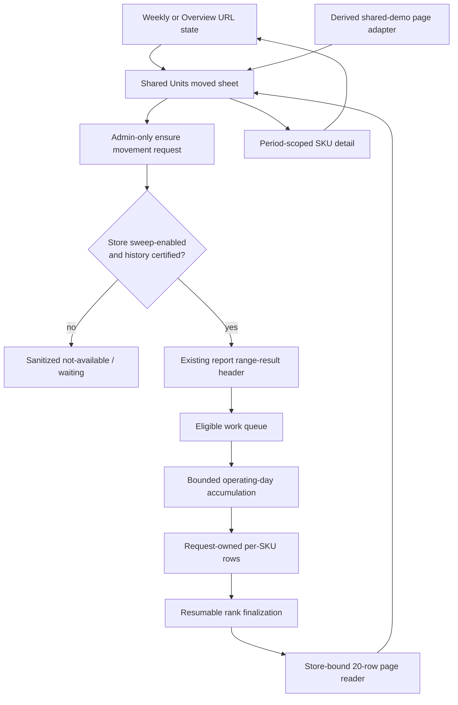
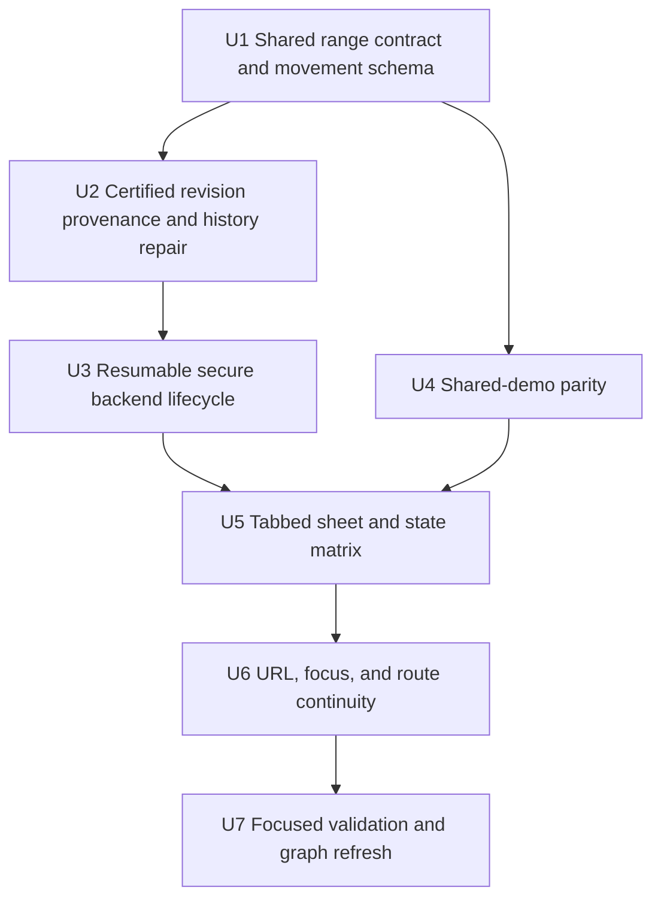
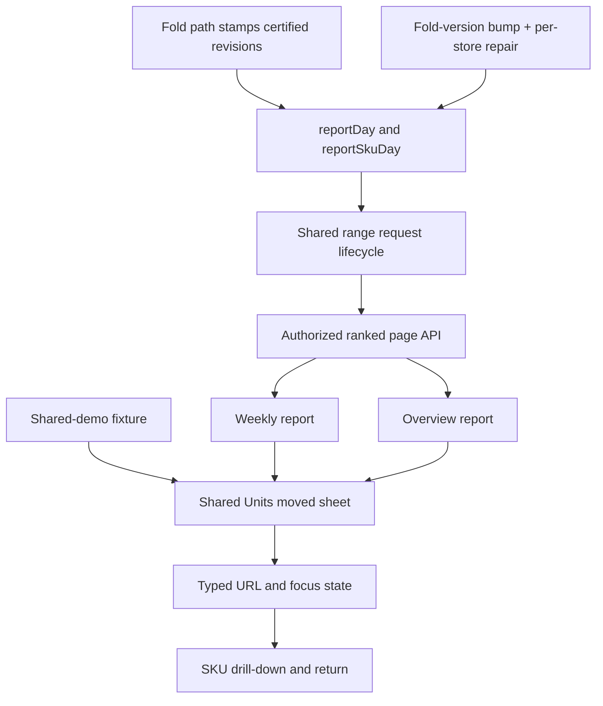

# feat: Scale Units moved into top-mover and granular tabs

## Summary

Extend Athena's existing asynchronous range-result lifecycle with resumable per-SKU movement snapshots, then consume bounded 20-row pages in a shared two-tab sheet. Every range accepted by the current Units moved surfaces—up to 92 inclusive days—can complete without the existing SKU-count or single-read capacity failures.

The snapshot trust model depends on certified fold-revision metadata that does not exist on any row today. Delivering it is therefore a two-part change: stamp revisions in the fold path going forward, and migrate existing history through a fold-version bump plus the existing `foldVersionRepair` mechanism. Until a store's history is repaired, movement requests over that history cannot be admitted, so the migration is an explicit rollout step, not an incidental detail.

---

## Problem Frame

The current sheet aggregates a full range inside one Convex query, rejects more than 100 distinct SKUs, and also fails when more than 5,000 SKU-day rows are needed. A normal trailing-30-day period can therefore fail even though the canonical reporting projections contain the evidence. Removing only the 100-SKU check would move the failure to the next ceiling and would still require shipping or hydrating the complete result.

---

## Requirements

### Tabs and presentation

- R1. Provide Top movers and Granular tabs for the same active date range or selected operating day.
- R2. Open Top movers by default when no prior sheet state exists.
- R3. Show at most 20 individual SKUs in Top movers.

### Movement semantics and paging

- R4. Rank movement by the absolute value of net units moved.
- R5. Preserve signed net movement so outbound movement and net returns remain distinguishable.
- R6. Make every SKU with movement in the selected period reachable through granular pagination, including a SKU whose sold and returned units cancel to zero net movement.
- R7. Return at most 20 individual SKU rows per granular page.
- R8. Use the same deterministic absolute-net ordering in both tabs, with stable SKU identity as the tie-break.

### Navigation continuity

- R9. Preserve the existing period-scoped SKU drill-down route for every visible row.
- R10. Restore sheet-open state, active tab, granular page, and originating-item focus from navigation state.
- R11. Restore the originating report period, sheet context, and underlying report scroll position when returning from SKU detail.

### Completeness and scale

- R12. Do not reject a valid period because more than 100 distinct SKUs moved.
- R13. Disclose the complete moving-SKU count and when Top movers is a subset.
- R14. Once a valid Units moved range is admitted for processing, SKU count, backend batch size, and queue execution capacity must remain bounded resumable work rather than terminal unavailable reasons. Unexpected defects may enter a sanitized terminal error and require a new attempt; they must never publish a partial snapshot.

**Origin actors:** A1 (Full administrator), A2 (Athena Reports)  
**Origin flows:** F1 (Review top movers), F2 (Browse granular movement), F3 (Return to analysis context)  
**Origin acceptance examples:** AE1 (top 20 of 146), AE2 (−24 ranks ahead of +18 while retaining direction), AE3 (all 146 reachable), AE4 (return to granular page 4), AE5 (large valid range completes across backend batches)

---

## Scope Boundaries

- The supported range is the current Units moved contract of at most 92 inclusive days; this does not expand the Reports date picker or the separate 366-day custom-range summary feature. The shared lifecycle must express per-kind span limits explicitly: 92 for movement, 366 for the existing summary.
- Do not combine remaining SKUs into an “Other” segment.
- Do not transmit the complete live movement result to the browser. The shared demo may derive a requested page from its small transaction fixture already present in the browser, but the sheet still receives only its active 20-row view.
- Do not add search, filters, alternate sorting, or cursor navigation to this sheet.
- Do not replace the Items workspace or change SKU-detail report semantics.
- Do not guarantee indefinite admission under abusive request volume. Authorized requests may receive retryable backpressure before any work row is written; after admission, capacity is pending work rather than an unavailable result.
- Movement generation is only available for stores enabled for reporting sweeps (`REPORTS_SWEEP_STORE_ALLOWLIST`). A store outside the allowlist can never produce certified revisions, so its requests receive an explicit sanitized "not available for this store" state rather than an indefinite pending state.
- Do not run the repository's heavy merge gate in this requested local workflow.

### Deferred to Follow-Up Work

- Generalizing the shared range lifecycle beyond the existing custom-summary and SKU-movement consumers.
- Reworking the separate custom-range summary pipeline's existing 20,000-row behavior.
- Bespoke dashboards or alerts for movement-job latency; this delivery uses existing backend logging plus correctness-focused instrumentation.
- Retiring the sweeper's dirty-day-only liveness model for the existing custom-summary consumer (its pending rows still compute only when the store folds; movement gets the new global eligible-work backstop, the summary keeps its current behavior).

---

## Context & Research

### Relevant Code and Patterns

- `packages/athena-webapp/convex/reports/customRange.ts`, `packages/athena-webapp/convex/reports/sweeper.ts`, and `reportRangeResultSchema` already provide range validation, request deduplication, TTL results, and declarative background work. This plan extends that lifecycle instead of creating a parallel request framework.
- `packages/athena-webapp/convex/reports/queries.ts` contains the direct movement aggregation, current ceilings, access checks, period validation, deterministic pagination examples, and visible-row identity hydration. Note: its `requireValidDateRange` does not validate date *format* (malformed strings ride on the `Number.isFinite` span check); the new ensure path must use the strict `YYYY-MM-DD` calendar validation already present in `customRange.ts`.
- `reportSkuDay` remains the canonical sparse movement source and is already bounded to at most 2,000 rows per operating day by report folding. It currently carries only `foldedAt` — no `foldVersion` and no revision field of any kind.
- `packages/athena-webapp/convex/reports/foldVersionRepair.ts` is the existing operator-driven mechanism for marking historically folded days stale after a `REPORTS_FOLD_VERSION` bump. It is per-store, keys entirely off `reportDay.foldVersion`, and is the vehicle this plan uses to backfill revision metadata.
- `packages/athena-webapp/convex/reports/sweeper.ts` documents an explicit design stance (its header comment) against best-effort scheduling chains in favor of declarative dirty marks, and its `computePendingRanges` runs only for `touchedStores` — stores whose dirty marks were drained that tick. The movement lifecycle deliberately departs from both; the departure must be written down, not silent.
- `packages/athena-webapp/src/components/reports/ReportUnitsMovedChartSheet.tsx` owns the shared sheet, diverging-chart foundation, dot grid, delayed animation, in-mount scroll preservation, and SKU links used by Weekly and Overview. Its scroll preservation is a module-level in-memory map that survives only within a single mount and is deleted on close — it cannot satisfy R11 across a navigation to SKU detail and back.
- `ListPagination`, `useStableReportQuery`, and `reportRouteSearch.ts` provide numbered paging, settled-context rendering, and typed URL-state conventions.
- `sharedDemoReportsFixture.ts` derives report claims from the shared transaction fixture and must retain parity without opening live reads.
- There is no generic admission/rate-limit helper in the codebase. The only precedent is the shared-demo fixed-window bucket (`sharedDemo/admission.ts`), reusable as a pattern only; movement admission introduces its own small tables and constants.
- There are no `internalAction`s, retry counters, backoff fields, fences, or leases anywhere in `convex/reports/`. The closest precedents are the self-scheduling mutation chains in `reseed.ts` and `foldVersionRepair.ts`. U3 is therefore a first-of-its-kind durable worker pattern for this module, not an incremental extension.

### Institutional Learnings

- `docs/solutions/architecture-patterns/athena-reports-workspace-read-model-boundary-2026-07-11.md` requires server-shaped report meaning, bounded indexed reads, coherent continuation context, and explicit trust boundaries.
- `docs/solutions/architecture-patterns/athena-reports-sku-mix-aggregation-2026-07-30.md` requires complete server-owned aggregation and identity hydration only after the visible subset is known.
- `docs/solutions/architecture-patterns/athena-shared-demo-client-derived-reports-and-honesty-boundary-2026-08-03.md` requires derived demo data and server-side protection independent of client demo gating.
- `packages/athena-webapp/convex/_generated/ai/guidelines.md` requires indexed pagination, validators on every Convex function, private internal workers, and bounded child rows rather than unbounded arrays.
- The reports refold gap: changing fold semantics never refolds existing `reportDay` rows on its own. Any new fold-time metadata is invisible on historical rows until a fold-version bump plus repair run makes the sweeper rewrite them.

### External References

- None. The implementation can stay within Athena's established Convex and Reports patterns.

---

## Key Technical Decisions

| Decision | Rationale |
| --- | --- |
| Extend the existing range-result lifecycle | Units moved is the second asynchronous range consumer. Reusing the request header, validation, expiry, and cron conventions prevents duplicate infrastructure while keeping movement-specific rows separate. |
| Define one admitted request as one immutable movement snapshot | A movement request identity includes request kind, contract/fold version, range, and a bounded revision vector for its included operating days. Working child rows remain private until completion; reopening after an included day revision changes creates or reuses a different snapshot. |
| Process source evidence by operating day | `reportSkuDay` is bounded per day. Reading and accumulating one day at a time avoids a store-wide mutable watermark, lets busy current periods finish, and records which canonical day revision contributed to the snapshot. |
| Admit and publish only clean source revisions | Ensure waits when an included day is dirty or lacks certified revision metadata. Each source batch verifies the expected day revision, and final publication rechecks the bounded revision vector and dirty markers so known-stale evidence cannot become complete. |
| Stamp certified revisions in the fold path and migrate history explicitly | Revision metadata does not exist today on `reportDay` or `reportSkuDay`. The fold stamps it going forward; a `REPORTS_FOLD_VERSION` bump plus a per-store `foldVersionRepair` run marks all historical days dirty so the sweeper rewrites them with revisions. Without the repair, no historical range is admissible — so the repair is a hard rollout prerequisite, not an optimization. |
| Gate movement generation on the sweeper store allowlist | A store outside `REPORTS_SWEEP_STORE_ALLOWLIST` never folds, so it can never produce certified revisions and its requests would wait forever. The ensure mutation checks enablement and returns a distinct sanitized "not available for this store" outcome instead of an indistinguishable pending state. |
| Do not use `reportOverview.updatedAt` as a correctness watermark | The current sweeper can advance it after contained fold failures, and unrelated dates can change it. It may be a refresh hint, never proof that a movement snapshot is coherent. |
| Persist one movement child row per request and SKU | Indexed child rows avoid document-size limits, support resumable accumulation, and keep the browser payload bounded. |
| Finalize deterministic ordinal ranks | Absolute net units descending plus stable SKU identity gives both tabs one meaning and lets numbered pages address a direct 20-row rank interval. |
| Separate admission from execution capacity | Equivalent requests deduplicate. When per-principal, per-store, or global work budgets are saturated, the mutation writes and schedules nothing and returns retryable backpressure. Once admitted, SKU count, batch size, and queue capacity cannot terminate the request; only an unexpected sanitized defect may require a new attempt. Admission counters are new tables modeled on the shared-demo fixed-window bucket; no reusable helper exists. |
| Combine prompt continuations with a durable cron backstop | Scheduled internal continuations keep first results responsive; a globally indexed eligible-work queue lets the reporting cron recover a dropped continuation without waiting for an unrelated dirty-day fold. This is a deliberate, documented departure from the sweeper's dirty-marks-only stance and from its `touchedStores` coupling; the sweeper's design comment is revised alongside. |
| Fence retries and sanitize failures | Phase/version fencing prevents duplicate batches. Retry metadata and eligibility time isolate poison jobs, while the public lifecycle exposes only generic error codes and an opaque correlation id. None of this machinery exists in the module today; it is built new, with its constants named and tested. |
| Separate atomic work from failure recording | A private action invokes one batch mutation that lets defects escape and roll back aggregates, cursor, and fence together; the action then records retry/backoff in a separate mutation. This introduces the module's first `internalAction`s. |
| Poll while waiting, subscribe once admitted | Waiting states (dirty source, saturation) intentionally write nothing durable, so there is no row to subscribe to. The open sheet polls the idempotent ensure mutation on the server-supplied retry interval, then switches to a subscription on the returned request once admitted. |
| Hydrate only visible identities | The page reader resolves no more than 20 catalog identities after rank selection and verifies that header, child rows, and SKUs belong to the authorized store. |
| Keep APIs additive during rollout | New request and page readers land beside the legacy movement query so already-open clients retain the old response shape until the new UI is deployed and verified. Legacy custom-summary rows keep their exact current semantics, including failed-row reuse until TTL. |
| Keep one shared sheet contract | Weekly, Overview, and shared demo vary only in period/data source, not in tab hierarchy, chart meaning, paging, or navigation restoration.
| Carry scroll context through navigation state | The sheet's existing scroll map survives only within one mount, so R11 needs a new mechanism: the underlying report scroll offset is captured into sheet-owned navigation state when drilling into SKU detail and restored on return. |

---

## Open Questions

### Resolved During Planning

- **Can the direct query simply remove its caps?** No. The 5,000-row ceiling remains, full identity hydration is unnecessary, and the supported range can exceed one transaction's safe read budget.
- **What is the persisted hierarchy?** A backward-compatible `reportRangeResult` row is the admitted request and snapshot header. Its canonical identity includes request kind, store, range, contract/fold version, and included-day revision vector. Movement child rows belong to that header; no separate logical-header/published-generation pointer is introduced.
- **What makes the source snapshot trustworthy?** Ensure reads at most 92 `reportDay` rows, requires no included `reportDirtyDay`, and derives a revision vector from date, fold version, folded revision, and the explicit empty-day sentinel. Each batch verifies that expected clean day revision before accumulating its SKU rows; publication rechecks the vector and dirty markers. The result is a materialized request-time snapshot, not a store-wide timestamp claim.
- **How do existing folded rows acquire revision metadata?** They cannot acquire it passively — clean days never refold. The delivery bumps `REPORTS_FOLD_VERSION` when revision stamping lands and runs `foldVersionRepair` per allowlisted store, which marks every stale-version day dirty (`fold_version_bump`) so the sweeper rewrites `reportDay` and its `reportSkuDay` rows with revisions. The repair rides on the existing day-rewrite path because folds already replace a day's SKU rows wholesale. Movement admission treats a missing revision as "waiting" only while the day is marked dirty or stale-versioned (repair pending); the operator runbook makes the repair a pre-UI rollout step.
- **What about stores outside the sweep allowlist?** Their days never fold and never certify, so waiting would be forever. The ensure mutation checks store enablement first and returns a sanitized, non-retrying "not available for this store" outcome. Enabling a store means: add to allowlist, let folds catch up, run the repair, then the feature works.
- **What if canonical reporting projections themselves are incomplete?** This feature does not manufacture missing evidence. Existing report trust/fold invariants remain upstream prerequisites; worker defects never publish partial rows.
- **What happens during saturation?** The request boundary returns retryable backpressure with no write or schedule. The open sheet retries calmly; capacity never masquerades as a completed empty or terminal unavailable result.
- **How does the client observe a request that wrote nothing?** It cannot subscribe to a row that does not exist. The ensure mutation returns either the admitted request reference or a waiting outcome with a retry interval; the sheet polls ensure on that interval while open (bounded, cancelled on close) and subscribes to the request document once admitted.
- **What happens during a genuine backend defect?** Retryable worker states back off and remain queued. A terminal unexpected defect exposes generic retry UI and a correlation id, while internal details stay in backend logs.
- **How does a failed batch both roll back and persist retry state?** The atomic batch mutation does not catch unexpected exceptions. A private action catches the failed call after Convex rolls back the batch, then invokes a separate mutation to record attempt, eligibility time, error class, and correlation id.
- **When does a completed request refresh?** A reopened sheet runs ensure again. The same request-kind/range/revision-vector identity reuses the completed snapshot; any included-day revision change produces a successor request. An already-open sheet remains pinned to its completed snapshot until it is reopened or its period context changes.
- **Is the per-open ensure cost acceptable?** Computing the revision vector reads up to 92 `reportDay` rows plus dirty markers on every ensure call, including every waiting-state poll. This is bounded and indexed, and polling intervals are server-controlled, so the cost is accepted; the constants live beside the lifecycle and scale tests assert the read budget.
- **Should the granular surface use cursors?** No. Finalized rank and authoritative count make numeric pages inexpensive and restore page context directly.

### Deferred to Implementation

- **Exact source-day, ranking, cleanup, and retry batch constants:** Tune against Convex document, byte, and transaction-time limits using scale fixtures; keep them named and independently tested.
- **Exact per-principal, per-store, and global admission thresholds:** No existing helper fits (the operation-admission layer is capability admission, not rate limiting); introduce the smallest local constants and fixed-window counters with deterministic tests, modeled on the shared-demo bucket.
- **Exact ensure polling intervals and backoff shape:** Server-supplied; tune so many simultaneously open sheets cannot create a retry storm.

---

## High-Level Technical Design

> *This diagram and lifecycle table are directional planning guidance, not implementation specifications.*

| Request state | Legal next states | Reader behavior |
| --- | --- | --- |
| Waiting for admission/source | Admitted, retry later | No durable work row while capacity is saturated or any included day is dirty/uncertified; UI polls ensure after the returned interval. |
| Not available (store) | — | Store is outside the sweep allowlist; sanitized non-retrying outcome, no write. |
| Queued | Aggregating, retry-wait | Durable request is eligible for a scheduled worker and cron recovery. |
| Aggregating | Aggregating, ranking, retry-wait | Source-day cursor and phase/version fence advance transactionally with aggregate writes. |
| Ranking | Ranking, completed, retry-wait | Absolute-net index is traversed in bounded order and assigned stable ordinal ranks. |
| Retry-wait | Aggregating, ranking, terminal error | Eligibility time and capped attempts prevent one poison request from monopolizing work. |
| Completed | Cleaning after expiry | Totals, count, completion time, lineage, and ranked pages are authoritative and immutable. |
| Terminal error | Manual retry, cleaning | Public response is sanitized; retry creates a new fenced attempt rather than returning the same failed state. |
| Cleaning | Cleaning, deleted | Children are deleted in bounded batches before the request header is removed. |

The existing range-result schema gains a backward-compatible request kind and movement lifecycle fields; legacy custom-summary rows normalize to their current behavior, including their existing failed-row-reused-until-TTL semantics and 366-day span limit. Request kind and source revision identity participate in the canonical request key, so a summary and movement request for identical dates cannot collide. Movement child rows carry store id, request/header id, product SKU id, signed totals, sort key, rank, and cleanup ownership. Public reads authorize the store before resolving the header and use store-prefixed indexes throughout.

---

## Implementation Units

- U1. **Extend the range contract with bounded movement rows**

**Goal:** Reuse the existing request/result header while adding the minimum movement-specific lifecycle and child projection needed for complete ranked pages.

**Requirements:** R4–R8, R12–R14; F1, F2; AE1–AE3, AE5

**Dependencies:** None

**Files:**
- Modify: `packages/athena-webapp/shared/reportsContract.ts`
- Modify: `packages/athena-webapp/convex/schemas/reports/derived.ts`
- Modify: `packages/athena-webapp/convex/schema.ts`
- Modify: `packages/athena-webapp/convex/reports/contract.test.ts`
- Modify: `packages/athena-webapp/convex/reports/reseed.ts`

**Approach:**
- Add a backward-compatible range-request kind and movement phase/retry/lineage metadata to the existing result header without changing legacy custom-summary semantics; include request kind and revision identity in movement key/index lookups. Kind-absent rows keep the exact current request-key shape and lifecycle, including failed-row reuse until TTL.
- Make per-kind span limits explicit in shared validation: 92 inclusive days for movement, 366 for the legacy summary. Movement date validation uses the strict `YYYY-MM-DD` calendar check from `customRange.ts`, not the loose span-only check in `queries.ts`.
- Add the revision fields to `reportDay` and `reportSkuDay` schemas as optional (stamping and backfill are U2's job; the schema must tolerate both generations).
- Add a child table with store-bound uniqueness by request and SKU, deterministic absolute-net ordering, direct ordinal-rank lookup, eligible cleanup lookup, and no unbounded arrays. Register the child table in `RESEED_PURGE_TABLES` beside `reportRangeResult`.
- Define validators for admitted lifecycle states and a public discriminated lifecycle that excludes internal exception text, cursors, fences, and source details, and includes the waiting/not-available/backpressure outcomes the ensure mutation returns without writing.

**Execution note:** Characterize legacy custom-range rows before widening their schema — including the current failed-row and expiry behavior — then add movement contract tests.

**Test scenarios:**
- Compatibility: legacy custom-summary rows and readers retain their current behavior when the new discriminator is absent, including failed-row reuse until TTL and the 366-day limit.
- Identity: custom-summary and SKU-movement requests for identical store/dates remain distinct in either creation order.
- Revision: missing or mismatched day/SKU revision metadata cannot validate as an admissible movement source.
- Validation: movement rejects malformed date strings that the legacy loose check would have passed.
- Direction: negative net units retain sign while sharing an absolute sort measure with positive rows.
- Ownership: two stores can use equivalent ranges without colliding or addressing one another's headers/children.
- Lifecycle: partial aggregation/ranking fields cannot validate as a completed public result.
- Cleanup: children are addressable by request without storing their ids on the header; reseed purges them.

**Verification:** Contracts can represent a complete movement snapshot and bounded page while existing range summaries remain backward compatible.

- U2. **Stamp certified revisions in the fold and repair history**

**Goal:** Give every newly folded day and SKU row a certified revision, and make existing history acquire one through the established fold-version repair path — because clean days never refold on their own.

**Requirements:** R14 (trustworthy snapshots); prerequisite for AE5

**Dependencies:** U1

**Files:**
- Modify: `packages/athena-webapp/convex/reports/sweeper.ts`
- Modify: `packages/athena-webapp/convex/reports/sweeper.test.ts`
- Modify: `packages/athena-webapp/convex/reports/foldVersionRepair.ts`
- Modify: `packages/athena-webapp/convex/reports/foldVersionRepair.test.ts`
- Modify: `packages/athena-webapp/shared/reportsContract.ts`

**Approach:**
- Extend `foldAndReplaceDay` to stamp the same certified revision on the written `reportDay` and every `reportSkuDay` row it replaces (the fold already rewrites a day's SKU rows wholesale, so SKU rows ride along with no extra passes).
- Bump `REPORTS_FOLD_VERSION` in the same change, so `foldVersionRepair`'s staleness predicate (`day.foldVersion !== REPORTS_FOLD_VERSION`) sees every pre-revision day as stale. Without the bump, existing rows are invisible to the repair.
- Keep `foldVersionRepair` operator-driven and per-store as it is today; extend its counters/output only as needed to report revision coverage. Add a read-only coverage query the rollout runbook can use to confirm a store's history is fully certified before the UI is enabled for it.
- Document the ordering as a hard sequence in the runbook: deploy schema (U1) → deploy fold stamping + version bump (this unit) → run repair per allowlisted store and let the sweeper drain → verify coverage → only then enable the movement UI. A fold-version bump refolds every historical day for every repaired store; the runbook must note the sweeper-tick throughput (dirty-batch constants) so the drain window is predictable rather than surprising.

**Execution note:** The repair mechanism itself already exists and already handles queued-day fairness; this unit's risk is sequencing, not novelty. Do not add a second fold authority.

**Test scenarios:**
- Stamping: a fold writes matching revisions on the day and all its SKU rows; refolding changes them together.
- Staleness: after the version bump, previously folded days are counted stale and a repair run marks them dirty without touching already-queued days.
- Backfill: draining the repair marks leaves every day and SKU row revision-certified; coverage query reports complete.
- Mixed generations: a store mid-repair has both certified and uncertified days; the coverage query and (later) movement admission see the store as not-yet-ready.
- Fairness: a bulk repair cannot starve a pending `close_accepted` fold (existing behavior, re-asserted).

**Verification:** New folds always certify; a repaired store's entire history is certified; an unrepaired store is detectably uncertified rather than silently admissible.

- U3. **Build an authorized, resumable movement lifecycle**

**Goal:** Admit, compute, rank, read, retry, and expire complete movement snapshots without a SKU-count or single-query ceiling.

**Requirements:** R3–R8, R12–R14; F1, F2; AE1–AE3, AE5

**Dependencies:** U2

**Files:**
- Create: `packages/athena-webapp/convex/reports/skuMovementRange.ts`
- Create: `packages/athena-webapp/convex/reports/skuMovementRange.test.ts`
- Modify: `packages/athena-webapp/convex/reports/customRange.ts`
- Modify: `packages/athena-webapp/convex/reports/queries.ts`
- Modify: `packages/athena-webapp/convex/reports/queries.test.ts`
- Modify: `packages/athena-webapp/convex/reports/sweeper.ts`
- Modify: `packages/athena-webapp/convex/reports/sweeper.test.ts`
- Modify: `packages/athena-webapp/convex/platform/capabilityCatalog.ts`

**Scope note:** This unit introduces the reports module's first `internalAction`s, retry metadata, backoff, and phase/version fencing — none of which exist anywhere in `convex/reports/` today — and it departs from the sweeper's documented dirty-marks-only stance and `touchedStores` coupling. Budget it as the largest unit in the plan, and revise the sweeper's header design comment to state the new, deliberate division: declarative dirty marks own folds; the movement lifecycle owns its own globally indexed eligible-work queue with a cron backstop.

**Approach:**
- Add an idempotent ensure mutation for validated 92-day-or-shorter movement ranges. Require the full-admin/report-generation capability and reject shared-demo generation server-side; keep page reads behind the Reports read boundary.
- Check store sweep enablement first: a store outside `REPORTS_SWEEP_STORE_ALLOWLIST` receives the sanitized not-available outcome with no write.
- Read the bounded included-day revision vector before admission. If any included day is dirty or lacks certified revision metadata, return waiting/retry with a server-chosen interval; otherwise deduplicate by request kind, range, contract/fold version, and revision vector. This read (≤92 `reportDay` rows plus dirty markers) runs on every ensure call including polls; assert its budget in scale tests.
- Process one expected operating-day revision at a time, verifying its clean marker and matching day/SKU revision before accumulating request-owned totals.
- Use a private internal action as the continuation wrapper. It invokes an atomic batch mutation that advances source cursor, phase/version fence, aggregates, and scheduling intent and lets unexpected defects escape for rollback. The action catches failure and calls a separate mutation to persist retry/backoff or terminal metadata.
- Promptly schedule the next internal action and let a globally indexed cron scan schedule eligible wrappers independently of dirty-day stores; the broad sweep mutation never performs aggregation directly. The existing custom-summary `computePendingRanges` keeps its current `touchedStores` behavior (generalizing it is deferred).
- Build admission counters as new fixed-window tables modeled on the shared-demo bucket; name the per-principal, per-store, and global constants beside the lifecycle.
- Rank request rows by absolute net units and SKU identity in bounded batches, assign ordinal rank, and mark the header complete only after totals/count/rank finalization succeeds and a final bounded recheck finds the same clean included-day revision vector.
- Validate public page input as a finite positive safe integer, canonicalize it against the completed count, and hydrate at most 20 identities after verifying store ownership.
- Use capped backoff and retry eligibility to isolate poison jobs. Public errors expose a generic code and opaque correlation id; logs contain redacted internal detail.
- Keep the legacy `listRangeSkuMovement` response available during rollout. Add new request/page functions, deploy the new UI against them, and remove the legacy reader only in later cleanup.
- Delete expired child rows before their unreferenced headers through resumable, fair cleanup batches. Size the cleanup budget against realistic accumulation (headers × up-to-2,000 children each under a 7-day TTL) and assert in tests that steady-state cleanup throughput exceeds steady-state creation.

**Execution note:** Start with scale and failure fixtures; the lifecycle state machine is the unit under test, not merely its final arithmetic.

**Patterns to follow:**
- Existing custom-range request validation, capability registration, deterministic reuse, TTL, and public result lookup.
- Reporting sweeper's durable-work principle, with a global eligible-work index rather than `touchedStores` coupling.
- `listPeriodSkus` deterministic ordering and visible-row hydration.
- `reseed.ts`/`foldVersionRepair.ts` self-scheduling continuation chains (extended with fencing and retry metadata, which they lack).

**Test scenarios:**
- Scale: a 30-day range with 146 moving SKUs and more than 5,000 SKU-day rows completes over multiple source/rank batches, returns the correct top 20, and exposes all pages.
- Freshness: reopening with an unchanged revision vector reuses the completed movement request; changing any included day creates a distinct request, while a custom-summary request for the same dates remains independent.
- Enablement: a store outside the sweep allowlist receives the sanitized not-available outcome with zero writes; an allowlisted but not-yet-repaired store reports waiting, not available-then-wrong.
- Dirty source: ingestion immediately before folding causes waiting/retry, not publication of the older day; completion becomes possible after the clean certified fold.
- Publication race: an included day becomes dirty or changes revision after its batch but before completion, so the request does not publish as complete.
- Direction: −24 ranks before +18 and both retain their signed values.
- Cancellation: a SKU with equal sold and returned units remains in the count and ranking at net zero.
- Idempotency: duplicate ensure calls and StrictMode effects reuse one request and do not double-count or double-schedule.
- Concurrency: duplicate scheduled workers cannot apply the same day or rank interval twice.
- Rollback: an injected mid-batch defect rolls back aggregates/cursor/fence, then records retry metadata in a separate transaction; retry cannot double-count.
- Liveness: a dropped continuation is recovered by the global cron scan even when the store has no dirty-day marker.
- Fairness: a poison job and a large cleanup cannot consume the whole worker budget or starve day/weekly reporting work.
- Admission: saturation returns retryable backpressure with zero writes/schedules; an admitted request remains queued until executed.
- Ensure budget: the pre-admission revision-vector read stays within its asserted row budget at the 92-day maximum.
- Retry: retrying an unexpired terminal request produces a new fenced attempt rather than returning the failed row.
- Authorization: shared-demo/direct read-only callers cannot generate work; full administrators can; workers are private.
- Isolation: cross-store request/header/child/SKU substitution returns no data.
- Validation: malformed dates and non-finite, fractional, non-positive, unsafe, or huge page values are rejected or canonically bounded as appropriate.
- Error hygiene: an injected sensitive worker exception never appears in the public result.
- Cleanup: interrupted child-first cleanup resumes, distributes work fairly, deletes the header only after no children remain, and keeps pace with steady-state request creation.
- Rollout: the legacy reader preserves its original response while the additive lifecycle APIs are present.

**Verification:** Every admitted range in the current Units moved contract completes through bounded work unless an unexpected sanitized defect requires a new attempt; SKU count, batch size, and queue capacity never become terminal reasons. Every public boundary remains authorized, tenant-bound, validated, and payload-bounded.

- U4. **Mirror the completed page contract in the shared demo**

**Goal:** Keep the read-free public demo behaviorally aligned without granting it generation authority.

**Requirements:** R1–R8, R13; F1, F2; AE1–AE3

**Dependencies:** U1

**Files:**
- Modify: `packages/athena-webapp/src/components/shared-demo/sharedDemoReportsFixture.ts`
- Modify: `packages/athena-webapp/src/components/shared-demo/sharedDemoReportsFixture.test.ts`

**Approach:**
- Derive signed movement from the existing demo transaction fixture, then apply the live ordering, stable tie-break, totals, count, canonical page, and 20-row slicing.
- Return an immediately completed public lifecycle. The fixture may inspect its already-local finite dataset, but the shared sheet receives only the selected page.
- Preserve the three-state demo gate and prove the demo cannot invoke the live ensure mutation or movement query.

**Test scenarios:**
- Parity: Top movers and granular pages match live ordering/count/total semantics.
- Direction: net returns retain their sign and rank by magnitude.
- Pagination: later pages remain deterministic and bounded to 20.
- Security: demo context opens no live subscription and direct demo generation is rejected by U3.

**Verification:** One sheet contract serves live and demo data without making the client gate an authorization boundary.

- U5. **Refine the sheet into an explicit tab and lifecycle hierarchy**

**Goal:** Present quick prioritization and exhaustive browsing consistently across every request state.

**Requirements:** R1–R9, R13–R14; F1, F2; AE1–AE3, AE5

**Dependencies:** U3, U4

**Files:**
- Modify: `packages/athena-webapp/src/components/reports/ReportUnitsMovedChartSheet.tsx`
- Create: `packages/athena-webapp/src/components/reports/ReportUnitsMovedChartSheet.test.tsx`
- Modify: `packages/athena-webapp/src/components/reports/ReportsWeeklyView.tsx`
- Modify: `packages/athena-webapp/src/components/reports/ReportsWeeklyView.test.tsx`
- Modify: `packages/athena-webapp/src/components/reports/ReportDaysPanel.test.tsx`

**Approach:**
- Keep a persistent sheet shell in this order: title/date, tabs, lifecycle or count message, then active-tab content. Top movers orders chart before item rows; Granular orders table before pagination. Note: this is the codebase's first Tabs-inside-Sheet composition; verify Radix focus and keyboard interplay explicitly rather than assuming it.
- On initial open, call the idempotent ensure mutation. While it returns a waiting outcome, poll it on the server-supplied interval with a bounded, close-cancelled effect; once admitted, subscribe to the returned request and stop polling. StrictMode duplicate effects must reuse the same admitted request and must not stack polling timers.
- Render Top movers as a symmetric zero-centered horizontal chart with signed values, direction-aware outer corners, accessible text, the softened dot grid, and animation held until sheet entry completes.
- Render Granular as a 20-row table using `ListPagination`. Bind visible rows, page label, link origin, and interactions to the same settled `{request, page}` context; do not label retained page-N rows as page N+1.
- Use the following explicit state contract.

| UI state | Content and controls | Accessibility behavior |
| --- | --- | --- |
| Waiting/admitted pending | Persistent shell and tabs; neutral “Preparing units moved” status; no partial chart/table or pagination. Retryable admission happens automatically after the supplied interval. | Polite `role=status`; do not announce every retry. |
| Not available (store) | Persistent shell; calm “not available for this store” message; no retry loop. | Announce once, politely. |
| Page transition | Keep the settled page label, rows, and links together with busy styling; disable overlapping page actions until the new page settles. | Mark the content region busy; announce the new “Showing X–Y of N” only when settled. |
| Completed empty | Persistent shell; calm no-movement message in either tab; no pagination. | Announce completion once. |
| Completed success | Count/subset disclosure plus chart/rows or table/pagination. | Tabs use native keyboard semantics; chart has a textual period/count/subset/signed-value summary. |
| Retrying worker | Persistent shell; no partial rows; neutral retrying status. | Polite status announcement only when state changes. |
| Retryable terminal error | Persistent shell; generic message, correlation id, and explicit Retry action; never blame range size. | Move focus to the error heading after a user-triggered retry fails; announce the state assertively once. |

- At narrow widths, use a full-width sheet, preserve signed values, wrap or truncate secondary identity metadata without hiding the SKU, avoid horizontal clipping, and keep controls at least 44px. Preserve visible focus, arrow-key tab behavior, reduced motion, and a text alternative to the chart.
- Keep the existing in-mount underlying-page scroll preservation (cross-navigation restore is U6's job). Remove the sheet's console diagnostics (`traceReportUnitsSheet`) after focused tests replace them, and remove the companion tracers `traceWeeklyUnitsSheet` (ReportsWeeklyView) and `traceWeeklyHistoryMotion` (weekly route) in the same pass rather than leaving them half-orphaned.

**Test scenarios:**
- Hierarchy: title/date and tabs remain present across pending, not-available, empty, success, retrying, and error states.
- Polling: waiting outcomes poll on the supplied interval, stop on close/unmount, and collapse under StrictMode double effects.
- Top movers: correct subset disclosure, signed chart values, item metadata, and links render in rank order.
- Granular paging: only one 20-row interval is requested and settled rows/page/link origins cannot disagree during a transition.
- Loading/error: no partial set appears as complete; admission retry, worker retry, and manual retry follow their distinct states.
- Responsive: narrow layout preserves SKU and signed values without clipped controls.
- Accessibility: tabs, status announcements, chart summary, paging, focus visibility, and item links are keyboard/screen-reader operable — including tab focus order inside the sheet dialog.
- Motion/scroll: chart waits for sheet entry, reduced motion suppresses it, and remounting open preserves the underlying report position.

**Verification:** The sheet remains understandable and operable throughout long-running work, not only after data arrives.

- U6. **Persist tab, page, focus, and scroll continuity in both routes**

**Goal:** Make the analysis context deep-linkable and restore it after SKU investigation on Weekly and Overview.

**Requirements:** R2, R9–R11; F3; AE4

**Dependencies:** U5

**Files:**
- Modify: `packages/athena-webapp/src/components/reports/reportRouteSearch.ts`
- Modify: `packages/athena-webapp/src/components/reports/reportRouteSearch.test.ts`
- Modify: `packages/athena-webapp/src/components/reports/ReportDaysPanel.tsx`
- Modify: `packages/athena-webapp/src/components/reports/ReportsWeeklyView.tsx`
- Modify: `packages/athena-webapp/src/routes/_authed/$orgUrlSlug/store/$storeUrlSlug/reports/index.tsx`
- Modify: `packages/athena-webapp/src/routes/_authed/$orgUrlSlug/store/$storeUrlSlug/reports/index.test.ts`
- Modify: `packages/athena-webapp/src/routes/_authed/$orgUrlSlug/store/$storeUrlSlug/reports/weekly.tsx`
- Modify: `packages/athena-webapp/src/routes/_authed/$orgUrlSlug/store/$storeUrlSlug/reports/weekly.test.tsx`

**Approach:**
- Add validated state for non-default tab, non-default granular page, and originating SKU focus beside the existing `units` flag in both route schemas.
- Unify the sheet open/close navigation convention first: Overview uses `replace: true` for `units` today while Weekly does not, which yields different history stacks for browser Back. Pick one convention (replace for open/close and intra-sheet state changes; a real history entry only for the drill-down navigation itself) and apply it to both routes before adding the new keys, so AE4's Back behavior is deterministic.
- Build the cross-navigation scroll restore that R11 actually requires: the sheet's existing module-map preservation survives only within one mount and is deleted on close, and navigating to SKU detail unmounts the whole reports route. Capture the underlying report scroll offset into sheet-owned navigation state (alongside the existing `o` origin mechanism) when a SKU link is activated, and restore it after return once the settled report content has laid out. No repo precedent exists for this; treat it as new, tested machinery, not an adjustment.
- Omit Top movers and page one defaults. Switching to Top movers clears the granular page; switching back begins at page one. A period/day change also resets page and focus.
- Canonicalize an out-of-range page only after a completed request supplies an authoritative count.
- Preserve the current URL as the detail origin. Both the report Back affordance and browser Back restore the sheet, tab, canonical page, underlying report scroll, and originating SKU-link focus.
- If changed data removes the originating SKU or canonicalizes its page, focus the Granular heading and announce the updated result/page rather than focusing a different item.

**Test scenarios:**
- Default: `units=true` alone opens Top movers without redundant keys.
- Convention: both routes produce the same history-stack shape for open, tab switch, page change, close, and drill-down.
- Serialization: Granular page 4 and originating SKU focus are represented in both routes.
- Return: browser Back and report Back restore period, sheet, page 4, scroll, and the source link.
- Scroll: the captured offset restores after the report content settles, and a missing/invalid offset degrades to top without error.
- Changed data: missing source SKU or page contraction falls back to the Granular heading with an announcement.
- Transition: page one/default tab clean their keys; closing cleans all sheet-owned state; period changes preserve unrelated Reports state.

**Verification:** Returning from SKU detail restores the operator's visual, navigation, and keyboard context rather than merely reopening the sheet.

- U7. **Run focused validation and refresh repository knowledge**

**Goal:** Prove scale, lifecycle, security, UI, and navigation behavior without invoking the excluded heavy gate, then update Graphify after code changes.

**Requirements:** R1–R14; F1–F3; AE1–AE5

**Dependencies:** U6

**Files:**
- Modify: `graphify-out/GRAPH_REPORT.md`
- Modify: `graphify-out/graph.json`
- Modify: `graphify-out/wiki/index.md`
- Modify: any additional generated Graphify wiki files selected by the rebuild

**Approach:**
- Run the focused Vitest suites named by U1–U6 and the smallest relevant type/lint checks for changed contracts.
- Cover scale beyond 100 SKUs and 5,000 SKU-day rows, revision stamping and repair coverage, lifecycle/fencing/admission failures, enablement gating, tenant isolation, sanitized errors, demo no-live-read behavior, both route integrations, and scroll/animation/focus regressions.
- Run `bun run graphify:rebuild` after the final code edit.
- Leave in-app browser validation to the user, as requested.

**Verification:** Focused evidence passes, no movement capacity-unavailable branch remains, and Graphify reflects the final implementation.

---

## System-Wide Impact

- **Interaction graph:** Opening the sheet calls the generation-capability mutation, polls while waiting, then subscribes to the returned request. Scheduled private workers and the cron backstop advance it; the shared reader supplies one page; URL state closes the drill-down loop.
- **Fold-path impact:** Revision stamping changes `foldAndReplaceDay`, and the accompanying fold-version bump makes every historical day stale. Repairing a store refolds its entire history through the normal sweeper lanes — a one-time, per-store drain whose duration is governed by the existing dirty-batch constants.
- **Error propagation:** Invalid periods and unauthorized generation fail before writes. Non-enabled stores get a sanitized not-available outcome. Admission saturation returns retryable backpressure. Worker defects retry with backoff or become sanitized terminal errors; partial children are never a public success.
- **State lifecycle risks:** Duplicate effects, continuations, poison jobs, partial rank passes, abandoned requests, and interrupted cleanup require fencing, eligibility indexes, fair budgets, and child-first deletion — all newly built in this delivery; the sweeper's documented invariant is revised to name the new division of responsibility.
- **API surface parity:** Legacy clients keep the old query during rollout. New live and demo adapters share public lifecycle/page semantics; both Reports routes share search keys and one history convention.
- **Integration coverage:** Request-to-completion publication, cron recovery, repair-then-admission sequencing, direct demo denial, cross-tenant substitution, page-context honesty, and focus/scroll restoration require cross-layer tests.
- **Unchanged invariants:** Canonical report projections remain the truth; date selection stays route-owned; SKU detail keeps its period contract; Items remains the richer workspace; no complete live SKU set reaches the browser.

---

## Risks & Dependencies

| Risk | Mitigation |
| --- | --- |
| Historical rows never acquire revision metadata (clean days never refold) | Bump `REPORTS_FOLD_VERSION` with the stamping change and run the existing per-store `foldVersionRepair` before enabling the UI; verify with the coverage query. Admission treats uncertified history as waiting only while repair/dirty marks exist, so a forgotten repair is visible, not silent. |
| A non-allowlisted store waits forever | Ensure checks sweep enablement first and returns a distinct sanitized not-available outcome; the rollout runbook ties UI enablement to allowlist membership plus completed repair. |
| The repair drain takes long on large stores | Runbook documents expected throughput from sweeper batch constants; the coverage query makes progress observable; movement UI enablement is per-store and waits for coverage. |
| Source volume exceeds one transaction | Process canonical evidence by bounded operating day and rank/clean in separate resumable batches. |
| A busy current day changes during construction | Require clean certified revisions at admission and publication, process promptly, and retry against the successor revision; reopening uses the bounded revision vector to request fresh data. |
| Duplicate, failed, or lost continuations | Fence every phase transition, let atomic batch failures escape for rollback, record retry in a separate mutation, schedule promptly, and retain a global eligible-work cron backstop. |
| New worker machinery conflicts with the sweeper's documented stance | Revise the sweeper design comment deliberately; keep folds under declarative dirty marks and give movement its own queue; never let the broad sweep mutation aggregate. |
| An authorized caller amplifies range work | Require generation capability, deduplicate, apply per-principal/store/global admission before writes, and return retryable backpressure. |
| Many open sheets polling ensure create load | Server-supplied intervals with jitter/backoff; bounded, close-cancelled client effects; the per-poll revision-vector read budget is asserted in tests. |
| Poison retries starve other reporting work | Index by eligibility time, cap attempts/backoff, budget work fairly, and isolate terminal failures. |
| Tenant identifiers are substituted | Prefix lookups with authorized store id and verify header, child, and hydrated SKU ownership. |
| Published exceptions disclose internals | Return generic codes/correlation ids and keep redacted detail server-side. |
| Final ranking or cleanup becomes unbounded, or cleanup falls behind creation | Resume by indexed sort/request cursor, assert document/byte/time budgets in scale tests, and test steady-state cleanup throughput against steady-state request creation. |
| Old clients call the legacy reader during rollout | Keep additive functions and original response behavior until the new client is deployed and verified. |
| Settled rows and URL page diverge | Bind rows, label, controls, and link origin to settled context until the new page resolves. |
| Negative bars are misread | Use symmetric zero axis, signed values, textual summary, and direction-aware bar geometry. |
| Weekly and Overview diverge | Centralize search validation, sheet props, and the history-entry convention; require mirrored route tests. |

---

## Documentation / Operational Notes

- **Rollout runbook (hard sequence):** deploy U1 schema → deploy U2 fold stamping and fold-version bump → run `foldVersionRepair` for each allowlisted store and let the sweeper drain → confirm revision coverage with the coverage query → deploy U3 backend APIs → deploy the new UI. The fold-version bump refolds every repaired store's history; schedule the drain window accordingly.
- Movement snapshots themselves are request-driven and need no data backfill — but the revision-metadata repair above **is** a required one-time migration; the earlier claim that no backfill is needed applied only to snapshot rows, not to source certification.
- Legacy range rows remain readable through backward-compatible normalization, keeping their current failed-row and TTL semantics.
- Retain only correctness-oriented instrumentation: request reuse, phase, completion latency, retry/backpressure classification, and opaque correlation ids. Do not log product names, SKUs, raw request keys, source lineage, or exception text in browser-visible output.
- Use existing backend logs to diagnose stalled or failed work; bespoke dashboards/alerts are deferred.
- Document named batch, admission, polling, and cleanup constants beside the lifecycle and assert their behavior in focused tests.
- Update the sweeper's header design comment when U3 lands so the module's stated invariant matches the shipped division of responsibility.

---

## Sources & References

- **Origin document:** [docs/brainstorms/2026-08-03-report-units-moved-tabs-requirements.md](../brainstorms/2026-08-03-report-units-moved-tabs-requirements.md)
- [docs/solutions/architecture-patterns/athena-reports-workspace-read-model-boundary-2026-07-11.md](../solutions/architecture-patterns/athena-reports-workspace-read-model-boundary-2026-07-11.md)
- [docs/solutions/architecture-patterns/athena-reports-sku-mix-aggregation-2026-07-30.md](../solutions/architecture-patterns/athena-reports-sku-mix-aggregation-2026-07-30.md)
- [docs/solutions/architecture-patterns/athena-shared-demo-client-derived-reports-and-honesty-boundary-2026-08-03.md](../solutions/architecture-patterns/athena-shared-demo-client-derived-reports-and-honesty-boundary-2026-08-03.md)
- Convex guidance: `packages/athena-webapp/convex/_generated/ai/guidelines.md`
- Current range lifecycle: `packages/athena-webapp/convex/reports/customRange.ts`
- Current movement reader: `packages/athena-webapp/convex/reports/queries.ts`
- Fold-version repair mechanism: `packages/athena-webapp/convex/reports/foldVersionRepair.ts`
- Current shared sheet: `packages/athena-webapp/src/components/reports/ReportUnitsMovedChartSheet.tsx`

---

## Alternative Approaches Considered

| Approach | Why not selected |
| --- | --- |
| Remove only the 100-SKU check | The 5,000 SKU-day ceiling and unbounded identity/browser costs remain. |
| Raise the synchronous query cap | Correctness remains coupled to a larger arbitrary ceiling and cannot cover the supported range contract safely. |
| Return only Top movers and send “View all” to Items | Contradicts the confirmed granular-sheet requirement. |
| Rank by total sold-plus-returned activity | Contradicts the confirmed absolute-net ranking semantics. |
| Materialize only the top 20 | Cannot provide authoritative count, later pages, or one consistent ordering. |
| Create a second request/generation framework | Duplicates the existing range-result lifecycle and creates a later consolidation burden. |
| Use a store-wide overview timestamp as a source watermark | It can advance after contained fold failures, invalidates historical ranges for unrelated activity, and can starve busy stores. |
| Admit uncertified legacy days as-is (skip the migration) | Publishes snapshots with unverifiable lineage; a later refold would silently invalidate them with no revision to compare. The repair path already exists and is bounded. |
| Backfill revisions with a bespoke in-place writer instead of the repair | Creates a second fold authority, which the module explicitly forbids; the repair reuses the sweeper's single rewrite path. |
| Keep a prior generation visible during every refresh | Adds publication pointers and retention complexity that the confirmed requirements do not demand; a clear pending state is sufficient. |

---

## Success Metrics

- A trailing-30-day fixture with 146 moving SKUs opens successfully, shows the correct top 20, and exposes all 146 through eight bounded pages.
- A valid clean fixture exceeding 5,000 SKU-day rows completes through multiple source/rank batches without truncation or a capacity-unavailable result.
- Top movers and Granular use identical absolute-net ordering, retain negative signs, and include nonzero sold/returned activity even when net units equal zero.
- A store repaired per the runbook admits historical ranges; an unrepaired or non-allowlisted store reports a truthful waiting or not-available state instead of hanging or failing opaquely.
- Each public live page hydrates and returns no more than 20 store-owned SKU identities.
- Duplicate effects/workers do not duplicate requests, schedules, movement totals, or ranks; duplicate polls do not stack timers.
- Demo mode opens no live reads or generation work, and direct demo generation is denied server-side.
- Weekly and Overview restore period, sheet, tab, page, source focus, and underlying scroll context after drill-down, with one shared history convention.

---

## Dependencies / Prerequisites

- `reportDay` and `reportSkuDay` remain the canonical, bounded per-day projections. Revision certification is introduced by this delivery (U2): new folds stamp it, and existing history acquires it only through the fold-version bump plus per-store repair. Known-dirty, missing-revision, or mismatched-revision days wait for refold rather than becoming an apparently complete movement snapshot.
- Movement generation requires the store to be in `REPORTS_SWEEP_STORE_ALLOWLIST` and to have completed the revision repair; both are rollout gates, not runtime assumptions.
- Existing full-administrator/report-generation and Reports-read capability boundaries are available for the split request/read APIs.
- Convex schema and additive API deployment precede frontend activation, in the runbook order above.
- Existing user changes in the dirty worktree remain authoritative and must not be reverted.
