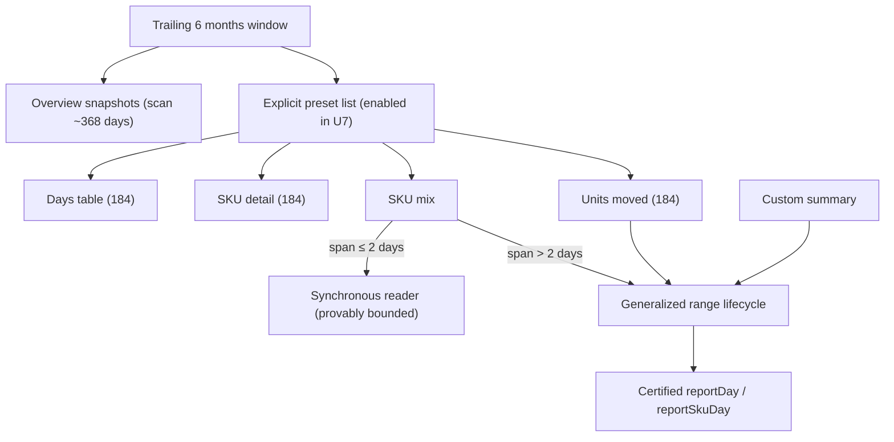
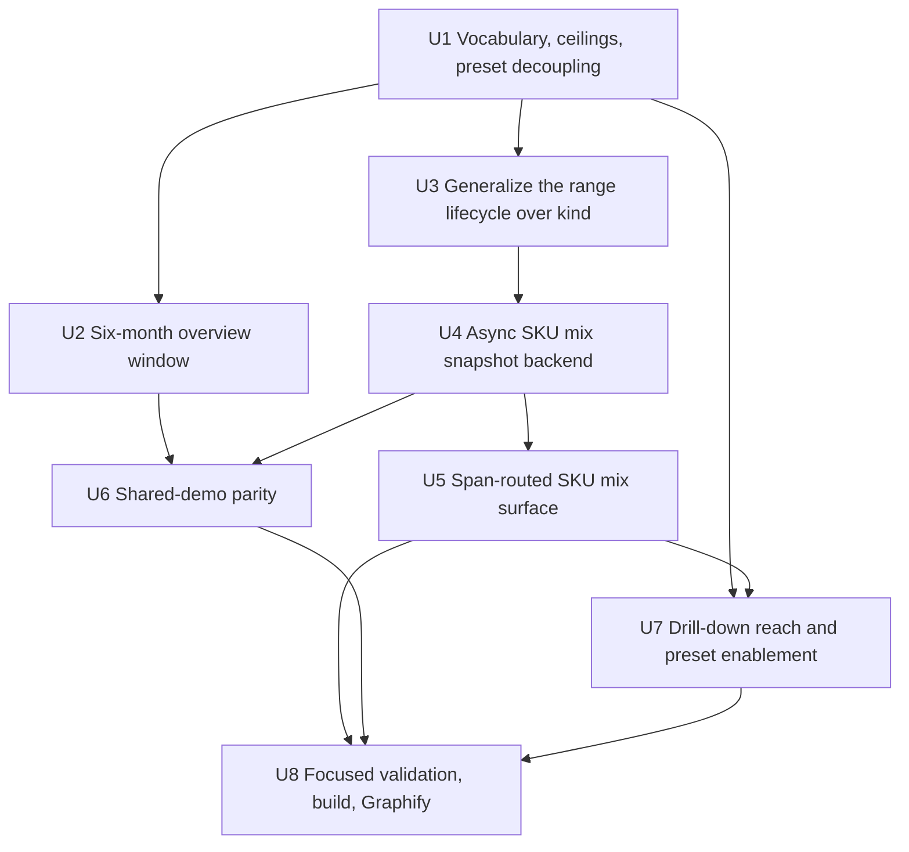

# feat: Add a trailing six-month period to the Reports workspace

## Summary

Add a Trailing 6 months period to Reports as a first-class window, raise the drill-down span ceiling so that period is actually explorable, and move multi-day SKU mix off its synchronous 5,000-row read onto the bounded resumable range-snapshot lifecycle that Units moved uses. The three parts ship together because a six-month window that cannot be drilled into, or that reliably fails the mix chart, is worse than no window at all.

Two shape-defining facts from review:

- **The span ceiling is 184 days, not 183.** `trailingThreeMonthsStart` is calendar-month aligned rather than a day count ([reportsContract.ts:718](../../packages/athena-webapp/shared/reportsContract.ts:718)), and its six-month analogue inherits that. The longest six calendar months (Mar–Aug, May–Oct, Jul–Dec, Aug–Jan) span 184 inclusive days. A 183-day ceiling would fail on those windows only — an intermittent, date-dependent failure.
- **Mix is ambient, movement is on-demand.** The mix chart is the Overview's default content: it fires on every workspace visit and on every day click. It cannot inherit movement's on-demand admission model or its page-oriented ranking machinery. Mix gets a span-routed design: single-day and two-day selections stay on the synchronous reader forever (provably under the row cap, because the fold bounds `reportSkuDay` at 2,000 rows per day), and only multi-day ranges use the async snapshot — which needs no ranking phase at all, because mix only ever shows top 5 plus Other.

---

## Problem Frame

Reports offers four periods: Today, Week to date, Trailing 30 days, Trailing 3 months ([reportPeriodKeys.ts:12](../../packages/athena-webapp/src/components/reports/reportPeriodKeys.ts:12)). Owners reviewing seasonality or half-year performance have no period longer than a quarter.

Three things block simply adding a fifth window:

1. **The overview cannot see far enough.** Every snapshot is an in-memory filter over one descending read of `OVERVIEW_DAY_SCAN_LIMIT = 184` `reportDay` rows ([overview.ts:32](../../packages/athena-webapp/convex/reports/overview.ts:32)). A current six-month window alone can consume all 184; its prior-period comparison needs roughly 368.
2. **The window list drives two UI surfaces at once.** [ReportDateRangeField.tsx:21](../../packages/athena-webapp/src/components/reports/ReportDateRangeField.tsx:21) derives range-picker presets from `REPORT_OVERVIEW_WINDOWS`, and [ReportsOverviewView.tsx](../../packages/athena-webapp/src/components/reports/ReportsOverviewView.tsx) derives the overview tabs from the same list. Adding the enum value before the surfaces are ready ships a preset that predictably errors and a tab with no snapshot behind it.
3. **SKU mix fails at that scale by design.** `listRangeSkuMix` reads `reportSkuDay` with a 5,000-row cap and *throws* past it ([queries.ts:741](../../packages/athena-webapp/convex/reports/queries.ts:741)). Production moved 391 distinct SKUs in 30 days (~1,033 rows); a 92-day range is already near the wall and a six-month range will exceed it routinely.

---

## Requirements

### Period vocabulary

- R1. Provide a Trailing 6 months period alongside the existing four, with a prior-period comparison.
- R2. Derive the window from calendar months, consistent with Trailing 3 months, and admit its full 184-day maximum everywhere it can be selected.
- R3. No preset or tab may exist before every surface it reaches can serve it; the six-month preset and tab appear only when the whole delivery is wired.

### Drill-down reach

- R4. The days table, SKU detail, and Units moved must accept the full six-month span.
- R5. Raising a ceiling must not widen a surface past what that surface can actually serve; per-surface ceilings may differ during rollout.

### SKU mix at scale

- R6. SKU mix must produce a complete, correct result for every admitted period, with SKU count and read budget becoming pending work rather than terminal failures.
- R7. Preserve the current mix presentation contract: top 5 visible SKUs, an aggregated Other SKUs bucket, share basis points, authoritative total and SKU count, and SKU detail links on identified rows only.
- R8. Async mix failures must expose a sanitized code and correlation id, not a raw message.
- R11. Single-day and two-day mix selections remain synchronous and instant. Spans of ≤2 days are provably under the 5,000-row cap (fold bounds `reportSkuDay` at 2,000 rows/day), so the synchronous reader is a permanent, principled path — not a transitional one.
- R12. Multi-day mix may be pending on the first computation after a data change. The pending state is calm, repeats are free through snapshot dedupe, and normal browsing (day clicks, revisits) never consumes async admission budget.

### Continuity and parity

- R9. The settled-context guarantee must hold: on-screen rows, labels, and links always describe the same range.
- R10. Shared demo must serve the new window and the mix lifecycle without opening a live read or gaining generation authority.

---

## Scope Boundaries

- Calendar-month alignment is the definition of the window. This does not introduce arbitrary multi-month ranges or a "last N months" control.
- Do not raise `ITEMS_PERIOD_MAX_DAYS = 31` ([queries.ts:62](../../packages/athena-webapp/convex/reports/queries.ts:62)). The Items tab is day/week/month scoped and is unaffected.
- Do not change the custom-summary pipeline's existing 366-day ceiling or its 20,000-row behavior.
- Do not add a fold-version bump. Certified fold provenance (`certifiedFoldRevision`, `REPORTS_FOLD_VERSION = 3`) is already deployed and production history is fully certified, so the new request kind reuses existing provenance. **This must be verified before U4 lands, not assumed.**
- Do not extend the shared-demo fixture horizon. It is `SHARED_DEMO_HISTORY_DAYS = 21` ([sharedDemoOperationsFixture.ts:44](../../packages/athena-webapp/src/components/shared-demo/sharedDemoOperationsFixture.ts:44)); demo's Trailing 3 months already renders from 21 days by convention, and Trailing 6 months behaves identically.
- The synchronous `listRangeSkuMix` reader is **retained permanently** as the ≤2-day path, not scheduled for cleanup. Its server-side validation is unchanged.
- Do not transmit a complete mix result to the browser; the chart receives its visible rows plus authoritative totals.
- Do not run the repository's heavy merge gate or open a PR in this delivery. The finish line is focused tests passing and the app building cleanly.

### Deferred to Follow-Up Work

- Generalizing the range lifecycle beyond its three consumers.
- Moving the custom-summary consumer onto the generalized worker seams introduced in U3.
- A "trailing 12 months" or arbitrary-months period.
- Any warm-ahead scheme that precomputes the default range's mix snapshot after each fold (would eliminate the daily first-visit pending state; not required now). Ticketed as [V26-1170](https://linear.app/v26-labs/issue/V26-1170/warm-ahead-mix-snapshot-for-the-overview-landing-range).

---

## Context & Research

### Relevant Code and Patterns

- [skuMovementRange.ts](../../packages/athena-webapp/convex/reports/skuMovementRange.ts) is the reference lifecycle: gate ordering in `ensureMovementRangeCore` (allowlist → validate → revision vector → dedupe → admission → insert + schedule), phase/fence machine, atomic batch mutation with a separate failure recorder, cron backstop, child-first cleanup.
- The lifecycle's *shape* is generic but its *code* is bound to the `sku_movement` literal. Every core function guards on it (`runMovementBatchCore` :703, `retryTerminalMovementRequest` :540, `recordMovementWorkerFailureCore` :1028, `scheduleEligibleMovementWork` :1138, `cleanupExpiredMovement` :1203, `readableMovementHeader` :1245). Constants are values, not logic, so a per-kind config record generalizes them cleanly.
- `REPORT_RANGE_MAX_DAYS_BY_KIND` is declared `satisfies Record<ReportRangeKind, number>` ([reportsContract.ts:936](../../packages/athena-webapp/shared/reportsContract.ts:936)), so adding a kind is compile-forced to declare a ceiling.
- `reportRangeMovementSku` is movement-shaped: `netUnits` and `absNetUnitsSortKey` encode signed movement semantics ([derived.ts:610](../../packages/athena-webapp/convex/schemas/reports/derived.ts:610)).
- `buildOverviewData` computes trailing-3-month windows via `trailingThreeMonthsStart(anchor)` then derives the prior window as "start minus one day, re-apply the helper" ([overview.ts:190](../../packages/athena-webapp/convex/reports/overview.ts:190)). The six-month analogue mirrors this exactly.
- `reportOverview` rolls out new snapshots as optional stored fields + required contract types + a read-time backfill in `getOverview` ([queries.ts:454](../../packages/athena-webapp/convex/reports/queries.ts:454)), which currently uses a hard-coded `.take(184)` at :503. Singletons refresh only for `touchedStores` (dirty-day stores), so a quiet store's singleton may never be rewritten — the read-time backfill is that store's only source of the new fields.
- Admission buckets are 10-minute fixed windows (`MOVEMENT_ADMISSION_WINDOW_MS = 600_000`, [skuMovementRange.ts:86](../../packages/athena-webapp/convex/reports/skuMovementRange.ts:86)); rows age out within minutes of any key change.
- `useStableReportQuery` supplies the settled `{data, dataContext}` pair that keeps labels and links honest during refresh; `settledSkuMixContext` also feeds the Units moved sheet's `periodStartDate`/`periodEndDate`/`scrollContextKey` ([ReportDaysPanel.tsx:180](../../packages/athena-webapp/src/components/reports/ReportDaysPanel.tsx:180)).
- The mix chart already tolerates `undefined` data and animates on identity change ([ReportSkuMixChart.tsx](../../packages/athena-webapp/src/components/reports/ReportSkuMixChart.tsx)); its behavior is currently tested through `ReportDaysPanel.test.tsx`, and it has no dedicated test file.

### Institutional Learnings

- [athena-certified-fold-provenance-and-bounded-resumable-range-snapshots-2026-08-03.md](../solutions/architecture-patterns/athena-certified-fold-provenance-and-bounded-resumable-range-snapshots-2026-08-03.md) — the snapshot-identity, fencing, and atomic-batch-vs-failure-record pattern this plan reuses.
- [athena-reports-workspace-read-model-boundary-2026-07-11.md](../solutions/architecture-patterns/athena-reports-workspace-read-model-boundary-2026-07-11.md) — server-shaped meaning, bounded indexed reads, coherent continuation context.
- [athena-shared-demo-client-derived-reports-and-honesty-boundary-2026-08-03.md](../solutions/architecture-patterns/athena-shared-demo-client-derived-reports-and-honesty-boundary-2026-08-03.md) — derived demo data with server-side protection independent of the client gate.
- Shipped reference: PR #730 (`8d18b242`).

---

## Key Technical Decisions

| Decision | Rationale |
| --- | --- |
| Ceiling is 184 days, not 183 | Six calendar months span up to 184 inclusive days (Mar–Aug, May–Oct, Jul–Dec, Aug–Jan). A 183 ceiling fails only on those windows — a date-dependent bug that looks random in production. Documented at the constant with the arithmetic so nobody "simplifies" it. |
| Route mix by span at the client | Spans of ≤2 days are provably under the 5,000-row cap (2,000 rows/day fold bound), so single-day selection — the dominant interaction — stays on the synchronous reader forever and never touches async admission. Multi-day ranges use the snapshot lifecycle. This kills the ambient request volume at the source rather than tuning budgets around it. |
| Accept a calm pending state on multi-day first computation | After each day folds, the default range's revision vector changes and the first visit mints a new snapshot. Dedupe makes every subsequent visit instant. The pending state is explicit, designed, and bounded (a 14-day aggregation is a handful of worker batches); a warm-ahead scheme is deferred, not needed. |
| Mix has no ranking phase | Mix only ever shows top 5 + Other; there are no numbered pages and no ordinal addressing. Aggregate into child rows with a units-sold sort key, accumulate totals and SKU count on the header during aggregation, and read top 5 via the sort-key index at read time. The rank field, rank pass, and rank index from movement are dropped entirely. Mix phases: queued → aggregating → completed. |
| Per-surface ceilings during rollout | Raising one shared `RANGE_MAX_SPAN_DAYS` to 184 would widen the synchronous mix reader past what it can serve. Ceilings are named per surface in U1 and applied per surface in U5/U7. |
| Decouple presets and tabs from the window enum's landing | The enum drives both the range-picker presets and the overview tabs. U1 introduces an explicit preset list (the current four); the enum value, label, tab, and snapshots land together in U2; the six-month preset is appended only in U7 when every surface it reaches serves 184. R3 holds at every unit boundary, not just at ship time. |
| Generalize the lifecycle over kind before adding a third consumer | Copy-pasting `skuMovementRange.ts` would triple the fencing, admission, cleanup, and backstop logic and guarantee divergence. Extract the kind-generic seams first, then add mix as configuration. |
| Sibling child table, not a reused movement table | `reportRangeMovementSku`'s `netUnits` and `absNetUnitsSortKey` mean signed movement. A sibling `reportRangeMixSku` reuses the index *pattern* with honest names. |
| Admission budget keyed by kind, sized for ambient use, no migration | A third consumer must not eat Units moved's budget, and mix's budgets must reflect ambient (not on-demand) usage — though span routing removes most of the volume. Buckets are 10-minute fixed windows, so old rows age out within one window of the key change; no migration machinery. |
| No fold-version bump | Certified provenance is already stamped at fold version 3 across production history. Verified as a U4 precondition, not assumed. |
| Mix totals are header state; Other is derived | The Other bucket has no natural durable row. Header totals (`totalUnitsSold`, `skuCount`) let the reader derive Other as total minus visible. |
| The overview backfill computes; no empty-preference | Singletons refresh only for dirty-day stores, so a quiet store may never be rewritten. With the scan constant widened and the hard-coded `.take(184)` at [queries.ts:503](../../packages/athena-webapp/convex/reports/queries.ts:503) routed through it, the read-time backfill can compute the six-month fields correctly — so it does. Short-history stores show partial totals, exactly as Trailing 30 and Trailing 3 months already do; no special understatement guard. |
| `comparisonFor()` gains an explicit case and a defensive fallback | Today its fallback silently yields `priorTrailing3Months` for any unrecognized window ([ReportsOverviewView.tsx:35](../../packages/athena-webapp/src/components/reports/ReportsOverviewView.tsx:35)) — a wrong number, not a visible error. |

---

## Open Questions

### Resolved During Planning

- **Is the ceiling 183 or 184?** 184. Calendar-aligned six-month windows reach 184 inclusive days.
- **Does this need a fold-version bump?** No; verified as a U4 precondition.
- **Can the mix snapshot reuse `reportRangeMovementSku`?** Mechanically yes, honestly no. Sibling table.
- **Does mix need ranking/pages?** No. Top-5 via sort-key index at read time; totals and count on the header. No rank field, no rank pass.
- **How does mix avoid throttling normal browsing?** Span routing: ≤2-day selections (including every day click) stay synchronous and never touch admission; multi-day snapshots dedupe by range + revision vector so revisits are free; only genuinely new multi-day ranges consume budget.
- **Does the admission key change need a migration?** No. Buckets are 10-minute fixed windows; old rows age out within one window.
- **How do quiet stores get the new overview fields?** The read-time backfill computes them via the widened scan constant. No empty-preference; short-history partials follow the existing convention.
- **What is the demo horizon?** 21 days (`SHARED_DEMO_HISTORY_DAYS`). Demo's six-month window renders from the same 21 days its three-month window already does. No extension, no clamping design.
- **Does the mix rework move the Units moved sheet?** Indirectly — `settledSkuMixContext` supplies the sheet's range source. The settled contract must be preserved exactly and the coupling tested.

### Deferred to Implementation

- **Exact mix batch and cleanup constants.** Tune against Convex limits with scale fixtures; keep them named and independently tested. Admission constants sized for ambient multi-day usage (higher than movement's), with the reasoning documented beside them.
- **Whether U3's generalization is a config record in place or an extracted module.** Decide against the real diff once the movement-specific surface is enumerated; behavioral identity is the constraint either way.

---

## High-Level Technical Design

> *Directional planning guidance, not implementation specification.*

Request kinds become three: `custom_summary`, `sku_movement`, `sku_mix`. Kind-generic machinery — admission (kind-keyed), fencing, scheduling, backstop, cleanup, sanitized errors — is shared. Kind-specific behavior is the source projection, the child row shape, the totals struct, the phase set (mix omits ranking), and the constants.

---

## Implementation Units

### U1. Period vocabulary, named ceilings, and preset decoupling

**Goal:** Define the six-month calendar math and the per-surface ceilings as named constants, and decouple the range-picker presets from the window enum — without changing any surface's behavior yet.

**Requirements:** R2, R3, R5 (enabling)

**Dependencies:** None

**Files:**
- Modify: `packages/athena-webapp/shared/reportsContract.ts`
- Modify: `packages/athena-webapp/src/components/reports/reportPeriodKeys.ts`
- Modify: `packages/athena-webapp/src/components/reports/ReportDateRangeField.tsx`
- Modify: `packages/athena-webapp/convex/reports/contract.test.ts`
- Modify: `packages/athena-webapp/src/components/reports/reportRouteSearch.test.ts`

**Approach:**
- Add `trailingSixMonthsStart(anchorDate)` beside `trailingThreeMonthsStart`, calendar-aligned to the first day of the month five months back.
- Introduce the named 184-day maximum with the calendar arithmetic documented at the constant (why 184, with the four longest windows named), plus named per-surface ceilings that are **declared here but applied in U5/U7**. Do not change any query's enforced value in this unit. Keep `REPORT_RANGE_MAX_DAYS_BY_KIND` exhaustive so the compiler forces a ceiling when U4 adds `sku_mix`.
- Decouple presets: `ReportDateRangeField` maps over a new explicit preset list (initialized to the current four windows) instead of `REPORT_OVERVIEW_WINDOWS`. The overview tabs continue to derive from the window enum — the enum itself does not change in this unit.

**Test scenarios:**
- Calendar math: `trailingSixMonthsStart` returns the first of the month five months back across year boundaries and leap years.
- Ceiling arithmetic: the four longest six-month windows each span exactly 184 inclusive days; 185 is rejected by the named maximum.
- Preset decoupling: the preset list renders exactly the current four presets, and adding a hypothetical window to the enum does not change the presets.
- No behavior change: existing route schemas, window tabs, and query ceilings are untouched (characterize before and after).

**Verification:** The math and ceilings exist as tested, documented constants; presets no longer track the enum; nothing user-visible changed.

### U2. Six-month overview window

**Goal:** Land the window end to end on the overview: enum value, label, tab, snapshots, comparison, and a backfill that computes for stores the sweeper never touches.

**Requirements:** R1, R2

**Dependencies:** U1

**Files:**
- Modify: `packages/athena-webapp/src/components/reports/reportPeriodKeys.ts`
- Modify: `packages/athena-webapp/convex/schemas/reports/derived.ts`
- Modify: `packages/athena-webapp/convex/reports/overview.ts`
- Modify: `packages/athena-webapp/convex/reports/overview.test.ts`
- Modify: `packages/athena-webapp/convex/reports/queries.ts`
- Modify: `packages/athena-webapp/convex/reports/queries.test.ts`
- Modify: `packages/athena-webapp/shared/reportsContract.ts`
- Modify: `packages/athena-webapp/src/components/reports/ReportsOverviewView.tsx`
- Modify: `packages/athena-webapp/src/components/reports/ReportsOverviewView.test.tsx`
- Modify: `packages/athena-webapp/src/components/reports/reportRouteSearch.test.ts`

**Approach:**
- Add `"trailing6Months"` to `REPORT_OVERVIEW_WINDOWS` with its label and `dateRangeForOverviewWindow` case. Both route schemas inherit it via `z.enum`; assert that. Because U1 decoupled the presets, the enum landing here adds the overview tab (backed by this unit's snapshots) without touching the range pickers.
- Add `trailing6Months` and `priorTrailing6Months` as optional stored fields (existing "optional while singletons refresh" convention), required on the contract type; compute both in `buildOverviewData` mirroring the three-month derivation, including the "start minus one day, re-apply the helper" prior window.
- Raise `OVERVIEW_DAY_SCAN_LIMIT` to cover both windows (368; document the derivation as 2 × 184) and replace the hard-coded `.take(184)` in `getOverview` with the exported constant so the two cannot drift.
- The read-time backfill **computes** the six-month fields when a singleton lacks them — this is the only source for quiet stores whose singletons the sweeper never rewrites. Short-history stores show partial totals, matching the existing convention for every other window; no special guard.
- Give `comparisonFor()` an explicit `trailing6Months` case and make the fallback defensive (fail visibly in dev, not silently compare against the wrong period).

**Execution note:** Characterize the current backfill behavior before widening it.

**Test scenarios:**
- Computation: six-month and prior-six-month spans are calendar-correct at month, year, and leap boundaries.
- Scan sufficiency: a store with ≥368 days of history produces a complete prior-period comparison; the widened read and the backfill read use the same constant.
- Quiet store: a singleton lacking the new fields, never rewritten by the sweeper, still serves correct six-month values through the backfill.
- Short history: a store with fewer days than the window shows partial totals consistent with how trailing3Months behaves today.
- Comparison routing: Trailing 6 months compares against `priorTrailing6Months`; an unrecognized window cannot silently receive a three-month comparison.
- Enum inheritance: both route schemas accept the new window value.
- Tabs: the fifth tab renders with a real snapshot behind it.

**Verification:** The overview serves the window with the correct comparison for active, quiet, and short-history stores alike.

### U3. Generalize the range lifecycle over request kind

**Goal:** Make the shipped movement lifecycle host a third consumer without duplicating its fencing, admission, scheduling, or cleanup — with movement behavior provably unchanged.

**Requirements:** R6, R8 (enabling)

**Dependencies:** U1

**Files:**
- Modify: `packages/athena-webapp/convex/reports/skuMovementRange.ts`
- Modify: `packages/athena-webapp/convex/reports/skuMovementRange.test.ts`
- Create: `packages/athena-webapp/convex/reports/rangeSnapshotLifecycle.ts` (or parameterize in place — decide against the real diff; behavioral identity is the constraint)
- Create: `packages/athena-webapp/convex/reports/rangeSnapshotLifecycle.test.ts` (if extracted)
- Modify: `packages/athena-webapp/convex/reports/sweeper.ts`
- Modify: `packages/athena-webapp/convex/reports/sweeper.test.ts`
- Modify: `packages/athena-webapp/convex/schemas/reports/derived.ts`

**Approach:**
- Extract the kind-generic seams: gate ordering, phase/fence transitions, retry and backoff, eligible-work scheduling, backstop scan, child-first cleanup, sanitized error mapping. Kind-specific behavior stays behind a small per-kind configuration: source projection, child writer, totals accumulator, phase set, and constants.
- Key the admission bucket by kind. **No migration:** buckets are 10-minute fixed windows; old rows age out within one window of the key change. Accept one window of slightly-off counting at deploy.
- Replace the hard-coded `kind !== "sku_movement"` guards with kind-aware dispatch, and make the sweeper's legacy custom-summary loops skip exhaustively (any kinded row) rather than movement-specifically, so a third kind cannot leak into the legacy compute path.
- **This is a refactor of shipped, production-deployed behavior.** Movement semantics must not change; the existing movement suite is the safety net and must pass unweakened. A reviewer will see refactor churn and feature churn interleaved in the delivery diff — the movement suite passing unchanged is the line between them.

**Execution note:** `characterization-first`. Any movement test that has to change is a signal to re-examine the extraction, not to update the assertion.

**Test scenarios:**
- Behavioral identity: the full movement suite passes against the generalized lifecycle without weakening assertions.
- Budget isolation: a second kind's admissions do not consume the first kind's per-principal, per-store, or global budget.
- Dispatch exhaustiveness: an unknown or newly added kind cannot fall into the legacy custom-summary compute or expiry path.
- Fence generality: fencing, retry, and cleanup behave identically regardless of kind.
- Phase-set flexibility: a kind may omit the ranking phase (mix will).

**Verification:** Movement behavior is provably unchanged, and a third kind is configuration rather than duplication.

### U4. Async SKU mix snapshot backend

**Goal:** Compute complete SKU mix for any admitted multi-day period as a bounded resumable snapshot — with no ranking phase.

**Requirements:** R6, R7, R8

**Dependencies:** U3

**Files:**
- Create: `packages/athena-webapp/convex/reports/skuMixRange.ts`
- Create: `packages/athena-webapp/convex/reports/skuMixRange.test.ts`
- Modify: `packages/athena-webapp/convex/schemas/reports/derived.ts`
- Modify: `packages/athena-webapp/convex/schema.ts`
- Modify: `packages/athena-webapp/shared/reportsContract.ts`
- Modify: `packages/athena-webapp/convex/reports/reseed.ts`
- Modify: `packages/athena-webapp/convex/platform/capabilityCatalog.ts`
- Modify: `packages/athena-webapp/convex/operationAdmission/migrationInventory.ts`

**Approach:**
- **Open by verifying the no-bump premise:** confirm history is certified at the current fold version and the mix projection needs nothing beyond `certifiedFoldRevision`. If that fails, stop and re-plan.
- Add the `sku_mix` kind and its 184-day ceiling (compile-forced), and a sibling child table `reportRangeMixSku`: store id, request id, SKU id, `unitsSold`, a descending units-sold sort key, `expiresAt`. No rank field. Indexes mirror the movement pattern minus the rank index; register the table for reseed purge.
- Lifecycle phases: queued → aggregating → completed (plus the shared retry/terminal/cleaning states). Accumulate `unitsSold` per SKU one bounded certified operating day at a time; accumulate `totalUnitsSold` and `skuCount` on the header during aggregation; publish only after the final revision recheck. There is no rank pass.
- Reader: after completion, take the top 5 via the sort-key index, hydrate at most those 5 identities after verifying store ownership, and derive the Other bucket as header total minus visible. Preserve `shareBasisPoints` semantics and the "no `productSkuId` on Other" rule.
- Public API: an idempotent ensure mutation behind the generation capability (shared-demo denied server-side), a header subscription, and the visible-rows reader. Errors expose a sanitized code and correlation id. Register both public mutations in the operation-admission migration inventory in the same change.
- Admission constants sized for ambient multi-day usage, documented beside the lifecycle; span routing (U5) means day clicks never reach here.
- The synchronous `listRangeSkuMix` is untouched.

**Test scenarios:**
- Provenance precondition: an uncertified or stale-revision day makes the request wait rather than publish.
- Scale: a 184-day range far exceeding 5,000 SKU-day rows completes across bounded batches with correct totals and no truncation.
- Presentation parity: visible rows, share basis points, Other bucket, total, and SKU count match the synchronous reader on a range both can serve.
- Other bucket: correct when zero, when it dominates, and when exactly five SKUs moved.
- No-rank reader: top-5 selection via the sort-key index is deterministic with the SKU-id tie-break, without any rank field.
- Isolation, error hygiene, idempotency/fencing, cleanup pace, registry inventory: mirror the movement suite's scenarios.

**Verification:** Every admitted multi-day period yields a complete, correct mix snapshot through bounded work, with the presentation contract preserved and no ranking machinery.

### U5. Span-routed SKU mix surface

**Goal:** Route mix by span — synchronous for ≤2-day selections, snapshot lifecycle for multi-day — without breaking the settled-context guarantee that also feeds the Units moved sheet.

**Requirements:** R3, R6, R7, R9, R11, R12

**Dependencies:** U4

**Files:**
- Modify: `packages/athena-webapp/src/components/reports/ReportDaysPanel.tsx`
- Modify: `packages/athena-webapp/src/components/reports/ReportDaysPanel.test.tsx`
- Modify: `packages/athena-webapp/src/components/reports/ReportSkuMixChart.tsx`
- Create: `packages/athena-webapp/src/components/reports/ReportSkuMixChart.test.tsx`
- Modify: `packages/athena-webapp/src/components/reports/reportPeriodKeys.ts`

**Approach:**
- Route by span: selections of ≤2 inclusive days (every day click, and the smallest ranges) call the synchronous `listRangeSkuMix` exactly as today — instant, no admission, no lifecycle. Multi-day ranges adopt the poll-then-subscribe pattern: idempotent ensure on range change, bounded unmount-cancelled polling while waiting, subscription once admitted. Put the span threshold beside the per-surface ceilings from U1 with the provability argument (2 × 2,000 < 5,000) documented.
- **Preserve `settledSkuMixContext` semantics exactly** across both paths: the settled pair must always describe the range the on-screen data came from, regardless of which path served it, because it also supplies the Units moved sheet's range source. A lifecycle state is never settled data.
- Give the chart calm pending, empty, and sanitized-error states consistent with the Units moved sheet's state matrix, leaning on the chart's existing `undefined` tolerance rather than adding a competing skeleton. The pending state is expected on the first multi-day visit after a data change (R12) — make it look intentional.
- Raise the mix surface's effective ceiling to 184 for the async path only. The sync path keeps its current validation.
- Do not add the six-month preset yet (U7).

**Test scenarios:**
- Routing: a single-day selection and a two-day range call the synchronous reader and never invoke ensure; a three-day range uses the lifecycle. Day-clicking through many days triggers zero admission consumption.
- Settled coherence: rows, labels, share percentages, and detail links never describe a different range than the data shown, across sync→async and async→sync transitions; the Units moved sheet's range source stays consistent throughout.
- Lifecycle states: pending, empty, success, and sanitized error each render without a partial result appearing complete.
- Polling: waiting states poll on the supplied interval, stop on unmount, collapse under StrictMode double effects.
- Dedupe: revisiting a completed multi-day range renders without a pending state.
- Other bucket: renders without a detail link, as today.

**Verification:** Day-to-day browsing is indistinguishable from today; multi-day ranges complete truthfully with a designed pending state; the sheet coupling holds.

### U6. Shared-demo parity

**Goal:** Serve the new window and the mix contract in demo mode within the fixture's existing 21-day horizon.

**Requirements:** R10

**Dependencies:** U2, U4

**Files:**
- Modify: `packages/athena-webapp/src/components/shared-demo/sharedDemoReportsFixture.ts`
- Modify: `packages/athena-webapp/src/components/shared-demo/sharedDemoReportsFixture.test.ts`

**Approach:**
- Add `trailing6Months` and `priorTrailing6Months` to the demo overview using the same calendar helper. The fixture holds 21 days (`SHARED_DEMO_HISTORY_DAYS`), so the six-month window renders from the same partial data the three-month window already does — the established demo convention; no horizon change, no clamping design.
- Add a demo mix adapter for the multi-day path returning an immediately completed lifecycle with identical visible-rows/Other/totals semantics; the ≤2-day path reuses the existing `createSharedDemoReportSkuMix`.
- Prove demo cannot invoke the live ensure mutation and that server-side denial holds independently of the client gate.

**Test scenarios:**
- Parity: demo mix (both paths) matches live ordering, totals, count, and Other semantics.
- Horizon convention: the six-month demo snapshot equals what 21 days of data produce, consistent with the three-month snapshot's existing behavior.
- Security: demo opens no live subscription; direct demo generation is denied server-side.

**Verification:** One contract serves live and demo without the client gate becoming the authorization boundary.

### U7. Drill-down reach and preset enablement

**Goal:** Apply the 184-day ceiling to the days table, SKU detail, and Units moved, then — as the final wiring step — enable the six-month preset everywhere.

**Requirements:** R3, R4, R5

**Dependencies:** U1, U5

**Files:**
- Modify: `packages/athena-webapp/convex/reports/queries.ts`
- Modify: `packages/athena-webapp/convex/reports/queries.test.ts`
- Modify: `packages/athena-webapp/convex/reports/skuMovementRange.ts`
- Modify: `packages/athena-webapp/convex/reports/skuMovementRange.test.ts`
- Modify: `packages/athena-webapp/src/components/reports/reportPeriodKeys.ts`
- Modify: `packages/athena-webapp/src/components/reports/ReportDateRangeField.tsx` (preset list entry)

**Approach:**
- Raise `listDays` and `getSkuDetail` to 184, including `getSkuDetail`'s two range reads (period and prior comparison — its budget roughly doubles).
- Raise the movement ceiling to 184 and the client-side `REPORT_DAYS_MAX_SPAN`. Movement's per-day resumable design already handles the span; re-assert the pre-admission revision-vector read budget at 184 (it runs on every ensure call including waiting-state polls) and confirm poll cadence keeps it cheap.
- Append Trailing 6 months to the explicit preset list — the last change, made only when every surface the preset reaches serves the span.

**Test scenarios:**
- Days table: a 184-day range returns a complete day set; 185 is rejected.
- SKU detail: both the period and prior-comparison reads stay within budget at the ceiling.
- Movement ensure budget: the revision-vector read is asserted at 184.
- Movement scale: a 184-day range with production-like SKU breadth completes across bounded batches.
- Client scope: day-table scope expansion honors the new span without resetting to the bare selection.
- Preset reach: selecting the Trailing 6 months preset succeeds on the days table, SKU detail, Units moved, and mix (async path).

**Verification:** Every drill-down surface serves the full window within an asserted budget, and the preset exists only now that it works everywhere.

### U8. Focused validation, build, and Graphify refresh

**Goal:** Prove the delivery with focused evidence, a clean production build, and refreshed generated knowledge. No merge gate, no PR.

**Requirements:** R1–R12

**Dependencies:** U5, U6, U7

**Files:**
- Modify: `graphify-out/GRAPH_REPORT.md`, `graphify-out/graph.json`, `graphify-out/wiki/index.md`, plus any generated wiki files selected by the rebuild

**Approach:**
- Run the focused Vitest suites named by U1–U7 plus targeted type and changed-file lint checks.
- Run the app build (`vite build` via the package's build script) and require zero errors.
- Cover calendar-boundary math, overview scan sufficiency and quiet-store backfill, lifecycle generalization identity, mix scale/parity/no-rank reader, span routing, demo parity, and drill-down budgets.
- Run `bun run graphify:rebuild` after the final code edit.
- The heavy merge gate and PR are explicitly deferred.

**Verification:** Focused evidence passes, the app builds cleanly, and Graphify reflects the shipped implementation.

---

## System-Wide Impact

- **Interaction graph:** The window drives the overview tabs and snapshots (U2); an explicit preset list drives the range pickers (enabled U7); mix routes by span between a permanent synchronous path and the shared kinded lifecycle.
- **Refactor blast radius:** U3 touches production-deployed movement behavior; its safety property is behavioral identity via the existing suite.
- **Ambient-usage boundary:** day clicks and short ranges never enter the async lifecycle, so admission and worker load scale with deliberate multi-day exploration, not with routine browsing.
- **Error propagation:** the async mix path uses sanitized codes with correlation ids; the synchronous path keeps its current messages.
- **Rollout:** no fold-version bump and no repair drain, given the U4 precondition holds. Schema and additive APIs land before UI activation within the delivery; the preset is the last wire connected.
- **Unchanged invariants:** canonical projections remain the truth; certified provenance is reused, not re-derived; Items keeps its 31-day scope; the custom-summary pipeline is untouched; the demo horizon stays 21 days.

---

## Risks & Dependencies

| Risk | Mitigation |
| --- | --- |
| 183-vs-184 off-by-one fails only on certain months | Ceiling is 184, documented with the calendar arithmetic, pinned by a test over the four longest windows. |
| Ambient mix usage exhausts admission or floods the worker | Span routing keeps day clicks and short ranges synchronous; dedupe makes revisits free; ambient-sized budgets are documented beside the constants. |
| Daily first-visit pending state reads as breakage | The pending state is designed and calm (U5), bounded by a short aggregation; warm-ahead is a named follow-up if it ever matters. |
| Generalizing the lifecycle regresses shipped movement behavior | Characterization-first; the movement suite must pass unweakened; any needed assertion change re-opens the extraction. |
| A third kind consumes Units moved's admission budget | Kind-keyed buckets; old rows age out within one 10-minute window (no migration). |
| Quiet stores never materialize the new overview fields | The read-time backfill computes them via the widened shared constant; tested explicitly. |
| Preset or tab appears before its surfaces work | Presets decoupled in U1; enum+tab+snapshots land together in U2; preset enabled last in U7. R3 holds at every unit boundary. |
| Mix settle-context change destabilizes the Units moved sheet | The settled contract is preserved across both mix paths and the coupling is tested. |
| Per-ensure revision-vector read doubles at 184 days | Budget re-asserted at 184; poll intervals stay server-controlled. |
| Legacy custom-summary path absorbs a third kind | Sweeper skip clauses become exhaustive over kinded rows. |

---

## Documentation / Operational Notes

- **No repair drain is expected.** Certified provenance is deployed at fold version 3 and production history is certified; U4 opens by verifying this. If the check fails, the rollout gains a repair step and the plan needs revisiting.
- The span-routing threshold and its provability argument (2 days × 2,000 rows/day < 5,000) live beside the per-surface ceilings, so the sync path's permanence is legible.
- Document mix batch, admission, and cleanup constants beside the lifecycle with the ambient-usage sizing rationale.
- Keep instrumentation correctness-oriented: request reuse, phase, completion latency, retry and backpressure classification, opaque correlation ids. No product names, SKUs, raw request keys, or exception text in browser-visible output.
- Delivery finish line: focused tests + clean app build. Merge gate, PR, and deploy are follow-on steps outside this delivery.

---

## Sources & References

- [docs/solutions/architecture-patterns/athena-certified-fold-provenance-and-bounded-resumable-range-snapshots-2026-08-03.md](../solutions/architecture-patterns/athena-certified-fold-provenance-and-bounded-resumable-range-snapshots-2026-08-03.md)
- [docs/solutions/architecture-patterns/athena-reports-workspace-read-model-boundary-2026-07-11.md](../solutions/architecture-patterns/athena-reports-workspace-read-model-boundary-2026-07-11.md)
- [docs/solutions/architecture-patterns/athena-shared-demo-client-derived-reports-and-honesty-boundary-2026-08-03.md](../solutions/architecture-patterns/athena-shared-demo-client-derived-reports-and-honesty-boundary-2026-08-03.md)
- Prior delivery: [docs/plans/2026-08-03-001-feat-report-units-moved-tabs-plan.md](2026-08-03-001-feat-report-units-moved-tabs-plan.md), shipped as PR #730 (`8d18b242`)
- Reference lifecycle: `packages/athena-webapp/convex/reports/skuMovementRange.ts`
- Convex guidance: `packages/athena-webapp/convex/_generated/ai/guidelines.md`

---

## Alternative Approaches Considered

| Approach | Why not selected |
| --- | --- |
| Add the overview window only | The window list drives presets and tabs; a period you can total but not explore is a half-feature. |
| Use a 183-day ceiling | Calendar-aligned six-month windows reach 184 days; 183 fails intermittently by month. |
| Day-count window (last 183 days) | Inconsistent with the Trailing 3 months definition; the two periods would be incomparable. |
| Move ALL mix reads to the async lifecycle | Mix is ambient: every day click and workspace visit would mint requests, exhausting on-demand-sized admission and adding latency to the landing view. Span routing keeps routine browsing synchronous and provably safe. |
| Rank the mix snapshot like movement | Mix has no pages; top-5 via the sort-key index at read time makes the rank field, rank pass, and rank index dead weight. |
| Copy `skuMovementRange.ts` for mix | Triples fencing, admission, cleanup, and backstop logic; guarantees divergence. |
| Reuse `reportRangeMovementSku` for mix rows | Field names would lie: `netUnits`/`absNetUnitsSortKey` encode signed movement semantics mix does not have. |
| Just raise the mix row cap from 5,000 | Moves the ceiling without removing it, exactly as with the 100-SKU movement cap. |
| Store the Other bucket as a sentinel child row | Pollutes the visible interval; deriving from header totals cannot drift. |
| Special "understatement guard" for short-history six-month snapshots | Trailing 30 and Trailing 3 months already render partial totals by convention (as does the 21-day demo). Widening the scan constant removes the only real truncation bug. |
| Migrate admission rows to the kind-keyed shape | Buckets are 10-minute windows; rows age out before a migration could matter. |
| Extend the demo fixture toward ~370 days | An ~18× browser-resident fixture increase to change nothing the demo convention doesn't already accept. |

---

## Success Metrics

- Trailing 6 months appears alongside the existing periods with a correct prior-period comparison, for active, quiet, and short-history stores.
- The longest six-calendar-month windows (184 days) validate and complete on the days table, SKU detail, Units moved, and multi-day SKU mix.
- Day clicks and ≤2-day selections render mix instantly with zero async admission consumption.
- A six-month SKU mix with production-like breadth (well over 5,000 SKU-day rows) completes with correct totals, visible rows, and Other bucket.
- Movement behavior is unchanged after the lifecycle generalization, proven by the existing suite passing unweakened.
- Admission budgets are isolated per kind.
- Demo serves the window and both mix paths with no live read and no generation authority.
- Focused suites pass and the app builds with zero errors; the merge gate and PR are deferred.

---

## Dependencies / Prerequisites

- Certified fold provenance (`certifiedFoldRevision`, fold version 3) remains deployed and production history certified — verified at the start of U4.
- `reportDay` and `reportSkuDay` remain the canonical bounded per-day projections; the fold's 2,000-rows-per-day cap is the basis of the sync path's provability.
- Existing report-generation and Reports-read capability boundaries serve the split request/read APIs.
