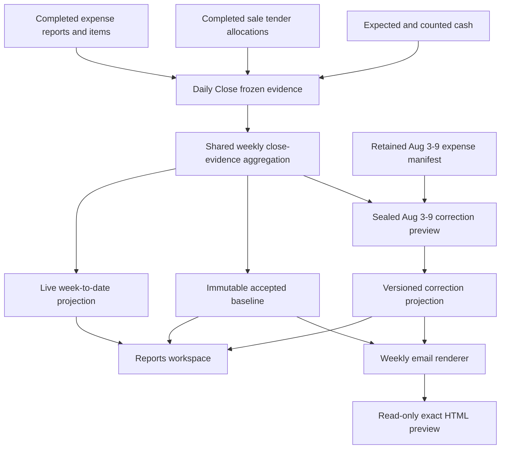
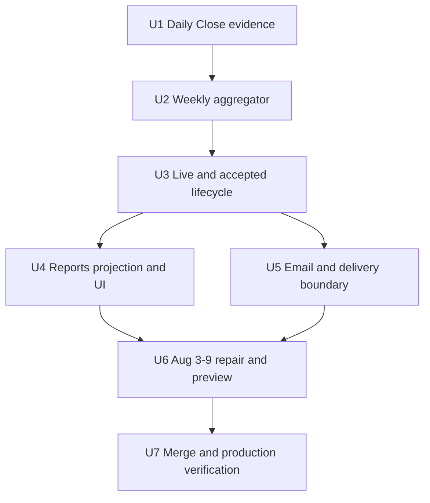
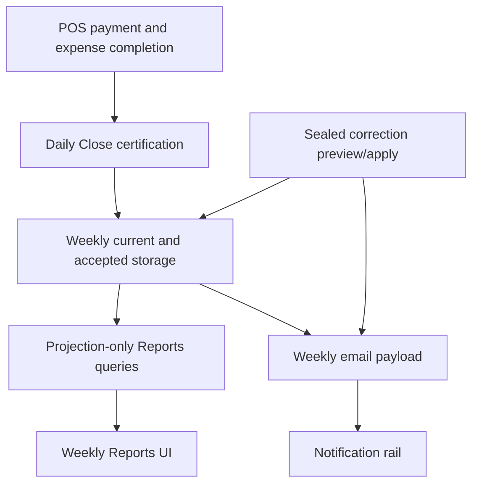

# feat: Add weekly payment and expense evidence

## Summary

Extend the existing Daily Close-to-weekly projection pipeline with expense-product evidence and one shared close-evidence aggregator. Persist one contract shape for live, accepted, and corrected projections, keep the original automatic email aligned with its accepted baseline, make the explicit corrected preview match corrected Reports, preserve the original accepted baseline through the existing amendment-style projection pattern, and render the correction without entering notification scheduling.

---

## Problem Frame

Wigclub's first production weekly report for Aug 3-9 froze schedule lineage from a fold that could not know close state and displayed sales-fold reconciliation as though it were counted-cash variance. The accepted report also lacks tender-method composition and the product-level expense evidence needed to explain weekly operating consumption. Existing accepted history is designed to remain immutable, while normal acceptance schedules email immediately, so correcting the first report requires a narrow evidence and delivery boundary rather than an in-place replay of acceptance.

---

## Requirements

- R1. Use resolved Daily Close lineage for scheduled-day status and keep sales-fold close variance distinct from counted-versus-expected cash variance. (See origin R1-R2, F2, AE1.)
- R2. Produce value-first payment mix from frozen Daily Close method allocations, including tender value, value share, and tender-use count. (See origin R3-R5, AE2.)
- R3. Freeze product/SKU identity, quantity, spend, and completeness for products consumed through completed expense reports. (See origin R6.)
- R4. Produce independent top-five expense rankings by spend and by quantity, each with deterministic ordering and a reconciling remainder. (See origin R7-R8, AE3.)
- R5. Materialize one section-specific close-evidence contract for live weeks, accepted history, corrected history, Reports, and email. (See origin R9-R10, F1-F2, AE4-AE5.)
- R6. Preserve accepted baseline fields while applying an exact, audited correction projection for Wigclub Aug 3-9 from retained production evidence. (See origin R11, F3, AE6.)
- R7. Render exact corrected email HTML without delivery. Corrected sending remains outside this delivery and requires a later explicit user decision. (See origin R12, AE6.)
- R8. Implement feature behavior test-first, address all merge-gate findings, obtain unanimous multi-lens review, merge, and deploy the affected Convex and Athena web surfaces. (See origin R13.)

**Origin actors:** A1 (store manager or owner), A2 (Athena reporting system), A3 (authorized operator)

**Origin flows:** F1 (live weekly review), F2 (weekly acceptance and delivery), F3 (Aug 3-9 correction preview)

**Origin acceptance examples:** AE1-AE6

---

## Scope Boundaries

- Do not add week-over-week payment-mix or expense-product comparisons.
- Do not add expense categories, vendors, staff rankings, or report-level expense detail.
- Do not redesign payment capture, split-tender allocation, expense entry, or inventory consumption.
- Do not reconstruct accepted rendering from mutable POS, expense, or catalog data.
- Do not mutate operational payment, expense, catalog, Daily Close, or report-ledger source records during repair.
- Do not send a corrected email until the user has reviewed and explicitly approved the rendered report in a later step.
- Do not add approval-token, corrected-send, or multi-revision workflow machinery in this delivery.
- Do not repair unrelated accepted weeks.

### Deferred to Follow-Up Work

- Payment-mix and expense-product prior-week comparisons remain a separate product iteration.

---

## Context & Research

### Relevant Code and Patterns

- `packages/athena-webapp/convex/operations/dailyClose.ts` is the store-day certification boundary. It already freezes payment totals, cash variance, and expense total, but reads expense items only for an item count and does not certify product completeness.
- `packages/athena-webapp/convex/operations/paymentTotals.ts` owns split-tender allocation, legacy fallback, and cash-net-of-change behavior. Weekly payment mix must consume its frozen Daily Close output rather than reimplement transaction semantics.
- `packages/athena-webapp/convex/operations/dailyOperations/frozenMetricAuthority.ts` demonstrates explicit frozen-summary validation and fail-closed source completeness.
- `packages/athena-webapp/convex/reports/weekly.ts` owns bounded live and accepted materialization. The active branch already corrects accepted schedule lineage and adds accepted cash variance, but live materialization, projection, repair, and Reports rendering remain incomplete.
- `packages/athena-webapp/convex/reports/queries.ts` keeps public weekly reads projection-only: one current row, at most one accepted row, and accepted history paginated to 24 rows. New evidence must remain stored on these projections rather than hydrated from source tables.
- `packages/athena-webapp/convex/notifications/registry.ts` renders weekly email lazily from the accepted row. Normal delivery dedupes only by accepted-week ID, so corrected delivery needs a distinct revision identity.
- `packages/athena-webapp/convex/reports/weeklyRepair.ts` intentionally refuses to mutate accepted history. The exceptional production correction therefore needs its own sealed preview/apply protocol and audit evidence.

### Institutional Learnings

- `docs/solutions/architecture-patterns/athena-schedule-day-driven-weekly-report-projection-lifecycle-2026-08-01.md`: accepted baseline facts and cutoff lineage remain immutable; later truth is represented orthogonally.
- `docs/solutions/logic-errors/athena-daily-close-history-snapshots-2026-05-09.md`: historical reporting renders stored close snapshots, never mutable operational tables.
- `docs/solutions/logic-errors/reports-fold-fields-need-an-explicit-write-and-a-version-nobody-has-seen-2026-08-05.md`: new projection fields require explicit writers, persisted-row tests, and a real rollout path.
- `docs/solutions/architecture-patterns/athena-cross-lane-metric-in-a-frozen-snapshot-email-2026-08-04.md`: missing asynchronous evidence must remain unavailable or partial, never default to zero.
- `docs/solutions/architecture/athena-historic-eod-auto-close-2026-06-29.md`: historical mutation must be exact, bounded, dry-run-first, idempotent, and abort on incomplete or drifting evidence.

### Production Evidence

- Target accepted week: Wigclub, `week:2026-08-03`, labelled Aug 3-9 with six scheduled operating days.
- Expected close result: 6 of 6 scheduled days closed.
- Expected counted-cash result: four non-zero daily variances net to GH₵320 over.
- Expected tender mix: GH₵25,025 total; Mobile Money GH₵16,580 / 63 tender uses, Cash GH₵5,020 / 26, Card GH₵3,425 / 10.
- Expected expense evidence: GH₵705 across 10 reports, 16 consumed units, and 11 SKUs; the retained expense lines reconcile exactly to the accepted week's expense total.

### External References

- None. Athena has recent, direct patterns for every affected layer; generic external guidance would be weaker than the repository's established projection and repair invariants.

---

## Key Technical Decisions

| Decision | Resolution and rationale |
|---|---|
| Daily evidence versioning | Add an independently versioned expense-product evidence sub-contract without changing the broader Daily Close snapshot version, so existing Daily Operations and Opening authority checks remain valid. |
| Expense completeness | Rely on the existing atomic expense writers, read item children with cap-plus-one completeness, validate safe numeric evidence, and reconcile spend to the frozen expense total. Overflow, invalid evidence, or spend mismatch makes only the product lane unavailable. A completed day with no expenses is explicitly covered with an empty product set. |
| Weekly aggregation | Introduce one pure, server-owned close-evidence aggregator used by live materialization, acceptance, repair preview, and verification. UI and email perform formatting only. |
| Coverage | Cash, payment, and expense lanes each store `complete`, `partial`, or `unavailable` plus their own usable-day and scheduled-day counts. A zero-value certified close counts as covered; absent legacy evidence does not. |
| Accepted immutability | Keep original accepted values and fingerprint intact. Store one set-once bounded correction projection plus provenance as an orthogonal accepted-row field, following the existing amendment storage pattern. An identical rerun no-ops; a different existing correction rejects and requires separately planned work. Current/amendment truth never consumes it. |
| Display identity | Freeze product name and SKU label with the evidence. Accepted expense rankings and existing top-sales leaders must not hydrate mutable catalog identity at render time. |
| Reopen behavior | Accepted evidence remains visible as the baseline. Current truth excludes a reopened date until a successor completed close supplies new frozen evidence; no lifecycle transition resends email. |
| Scheduled scope | Close-backed cash, payment, and expense sections use scheduled included dates only; outside-schedule activity remains outside these rankings and coverage. |
| Repair protocol | A fixed-purpose, production-only internal command resolves the closed Wigclub organization/store/cycle through existing indexed identifiers and exposes no caller-selected target IDs or committed production Convex IDs. It verifies relationships, dates, census, and expected baseline fingerprint before work. Stateless dry run returns that fingerprint plus one canonical candidate fingerprint covering target, source manifest, corrected evidence, reconciliation, and contract version. Apply re-derives and compares the candidate in one mutation, patches only a previously absent correction projection, and no-ops on an identical rerun. No repair-run tables or general migration framework are introduced. |
| Historical reconstruction | The Aug 3-9 product composition is an explicit operator-reviewed reconstruction from retained rows, immutable reporting evidence where available, accepted close windows, and exact aggregate reconciliation. The plan does not claim unavailable point-in-time item history; the sealed source manifest and this limitation are part of the correction audit. |
| Notification safety | Existing automatic weekly intents always render the original baseline, including delayed retries. A read-only preview action explicitly renders the correction and creates no notification state. Corrected-send and approval machinery are deferred until the user approves the report shape. |
| Presentation hierarchy | Reuse the existing Weekly hierarchy: week state and the two distinctly named variance facts remain in the summary flow; payment mix follows; both expense rankings live under one expense-products section; correction status stays in report metadata rather than becoming another metric card. |
| Shared coverage copy | Reports and email use the same manager-facing formatter: “6 of 6 scheduled days,” “Based on 3 of 6 scheduled days,” “Not available — no completed Daily Closes contain this information,” and for certified zero, “GH₵0 · based on 3 of 6 scheduled days.” Corrected history uses “Report corrected” with original accepted and corrected times. |
| Ranking remainder | Render each list's complement as an unnumbered summary row, “1 other product” or “N other products,” not a sixth ranked product. Spend rank emphasizes spend then quantity; quantity rank reverses that emphasis. Omit an empty remainder and provide a complete accessible label. |

### Evidence precedence

| Consumer/state | Evidence selected |
|---|---|
| Original automatic weekly email, including delayed retry | The existing intent payload remains unchanged; preparation uses a baseline-only builder that ignores the correction field. |
| Accepted historical Reports | Latest effective applied correction, otherwise original baseline. |
| Live current and amendment presentation | Latest resolved completed-close lineage only; never an accepted correction. |
| Corrected preview | One exact applied correction revision and its sealed renderer contract. |
| Future corrected send | Not implemented in this delivery; it must explicitly select the correction and use a distinct dedupe identity if later approved. |

### Original notification-state policy

Preview and correction apply never create, cancel, reschedule, or modify notification state. The existing automatic intent payload remains unchanged, while its preparation path is made baseline-only so a pending retry cannot pick up corrected content. Dry run reports malformed, duplicate, or unusual notification state for audit; it blocks apply only if baseline-only rendering cannot be proven.

---

## Open Questions

### Resolved During Planning

- **How should legacy Daily Closes be treated?** Absence of independently versioned evidence is unavailable, not zero. The one approved Aug 3-9 correction may reconstruct evidence only through its sealed repair manifest.
- **Should the accepted row be overwritten?** No. Original baseline fields remain intact; a versioned correction projection becomes the explicit effective rendering.
- **How should repeated frozen identities be resolved?** Aggregate by stable SKU ID and choose display identity deterministically from the latest covered close, with stable close/SKU tie-breaking. No catalog lookup occurs during accepted rendering.
- **What is a payment count?** One tender use per participating method per sale, including split tender; never label it a sales or transaction count in weekly presentation.
- **What happens after a reopen?** The accepted baseline is unchanged; current evidence drops that day until a completed successor replaces it.
- **How is corrected sending authorized?** It is not implemented or deployed in this delivery. The workflow stops after corrected Reports and email preview; a later explicit user decision will define and invoke the smallest safe resend path.
- **Does preview need persisted HTML attestation?** No. The read-only action returns exact subject/HTML from the applied correction and the production handoff records the artifact. Persisted evidence and renderer versions remain sufficient to reproduce or detect later drift without adding attestation state.

### Deferred to Implementation

- Exact helper and component names may follow the closest local conventions discovered while editing, provided the shared aggregation and immutable correction boundaries remain intact.
- Final compact layout within the existing Weekly view and React Email primitives may be tuned during browser/email rendering review without changing the two rankings, value-first order, or coverage semantics.

---

## High-Level Technical Design

> *This illustrates the intended approach and is directional guidance for review, not implementation specification. The implementing agent should treat it as context, not code to reproduce.*

Public Reports reads remain projection-only. Source-domain reads occur only at Daily Close certification, bounded weekly materialization, or the exact repair preview.

---

## Implementation Units

- U1. **Certify expense-product evidence in Daily Close**

**Goal:** Freeze a bounded, reconciled product-consumption snapshot for every newly completed Daily Close without changing existing payment or expense-entry semantics.

**Requirements:** R3, R5; origin R6, R9-R10; F1-F2; AE3-AE5

**Dependencies:** None

**Files:**
- Modify: `packages/athena-webapp/convex/operations/dailyClose.ts`
- Modify: `packages/athena-webapp/convex/schemas/operations/dailyClose.ts`
- Test: `packages/athena-webapp/convex/operations/dailyClose.test.ts`

**Approach:**
- Add an optional, independently versioned expense-product evidence object to the frozen report snapshot.
- Read expense item children with a shared bounded budget and overflow probe; the existing Convex expense creation mutations remain the atomic parent/child write rail.
- Validate safe-integer, non-negative quantity and minor-unit cost plus checked multiplication/sums; aggregate by stable SKU identity, freeze display name/SKU label, and reconcile aggregate spend exactly to the certified expense total.
- Represent a completed zero-expense day as complete empty evidence. Represent truncated, invalid, or mismatched evidence as lane-level unavailable without adding it to the existing global close-blocking source-completeness gate.
- Preserve the existing broader snapshot contract version so current frozen-metric consumers continue to recognize the close.

**Execution note:** Begin with failing persisted-snapshot tests before changing Daily Close construction.

**Patterns to follow:**
- Source-cap and completeness handling in `packages/athena-webapp/convex/operations/dailyClose.ts`
- Frozen authority validation in `packages/athena-webapp/convex/operations/dailyOperations/frozenMetricAuthority.ts`

**Test scenarios:**
- Happy path: repeated SKU lines across several completed expense reports aggregate quantity and spend into one frozen row whose total reconciles to `expenseTotal`.
- Happy path: a completed day with no expenses stores complete empty evidence with zero spend and quantity.
- Edge case: the same SKU carries different source names; the deterministic frozen identity rule chooses one result and remains stable.
- Edge case: item reads reach the allowed bound exactly and still certify; one additional item triggers overflow and unavailable evidence rather than truncation.
- Error path: nonfinite, fractional, unsafe, negative, or overflowing quantity/cost/spend and a one-minor-unit spend mismatch refuse certified product evidence.
- Integration: product-evidence overflow makes only that lane unavailable and does not block an otherwise valid Daily Close.
- Integration: catalog rename or deletion after close does not change the stored snapshot.

**Verification:**
- Every new completed close has explicit versioned expense-product presence and completeness, and certified spend equals the frozen expense total.

- U2. **Aggregate shared weekly close evidence**

**Goal:** Produce one deterministic weekly contract for cash variance, value-first payment mix, and both expense-product rankings using only scheduled completed-close snapshots.

**Requirements:** R1-R5; origin R1-R10; F1-F2; AE1-AE5

**Dependencies:** U1

**Files:**
- Create: `packages/athena-webapp/convex/reports/weeklyCloseEvidence.ts`
- Test: `packages/athena-webapp/convex/reports/weeklyCloseEvidence.test.ts`
- Modify: `packages/athena-webapp/convex/schemas/reports/derived.ts`
- Modify: `packages/athena-webapp/shared/reportsContract.ts`
- Test: `packages/athena-webapp/convex/reports/contract.test.ts`

**Approach:**
- Accept the resolved seven-date period, its report-day close lineage, and at most seven directly loaded Daily Close documents.
- Read only frozen report snapshots from completed, nonsuperseded, scheduled closes.
- Preserve independent cash, payment, and expense coverage; distinguish a certified empty array from an absent legacy field.
- Validate payment rows as unique nonblank canonical methods with non-negative safe-integer amounts and tender-use counts; malformed or overflowing evidence makes the payment lane unavailable rather than being silently normalized.
- Normalize method labels while preserving method identity; sort payment rows by tender value descending and stable method key, and persist integer basis points plus covered tender value so Reports and email share one rounding result. Independently rounded rows may differ from 100% by one basis point; no renderer redistributes rounding residue.
- Aggregate expense products before ranking. Sort spend rank by spend, quantity, then SKU ID; sort quantity rank by quantity, spend, then SKU ID. Give each list its own remainder carrying product count, spend, and quantity.
- Exclude outside-schedule dates and unclosed or reopened dates from close-backed evidence.

**Execution note:** Implement the pure aggregation contract test-first using a production-shaped six-day fixture.

**Patterns to follow:**
- Weekly posture functions in `packages/athena-webapp/convex/reports/weekly.ts`
- Payment allocation semantics in `packages/athena-webapp/convex/operations/paymentTotals.ts`

**Test scenarios:**
- Happy path: six covered closes yield the Wigclub payment values/counts, GH₵320 cash overage, and two independently ordered expense lists.
- Happy path: a split-tender sale contributes value and one tender use to each participating method; repeated same-method entries within one sale remain one frozen tender use.
- Edge case: payment percentages use covered tender value rather than net sales and use stable rounding; equal values use the method-key tie-break.
- Error path: blank/duplicate payment methods, fractional/negative/unsafe amounts or use counts, and seven-close aggregate overflow make the payment lane unavailable.
- Edge case: one-third allocations produce the same integer-basis-point labels in projection and email even when independently rounded rows do not sum to exactly 100%.
- Edge case: six or more products produce top-five rows whose list-specific remainder reconciles both quantity and spend.
- Edge case: equal product spend or quantity follows the deterministic secondary metrics and SKU-ID tie-break.
- Edge case: three payment-covered, two expense-covered, and four cash-covered days report independent coverage in one six-day frame.
- Edge case: a certified zero-sales or zero-expense day increments coverage; an absent legacy field does not.
- Error path: no usable days produces unavailable without a fabricated zero or percentage.
- Integration: an outside-schedule Sunday or adjacent-week close does not affect values or coverage.

**Verification:**
- One serializable weekly evidence shape accounts for all supported sections, deterministic ranking, and independent coverage without source queries.

- U3. **Materialize live, accepted, amended, and corrected evidence**

**Goal:** Persist the shared evidence contract through the weekly lifecycle while preserving the original accepted baseline and closing the active branch's live cash-variance gap.

**Requirements:** R1-R6; origin R1-R11; F1-F3; AE1, AE4-AE6

**Dependencies:** U2

**Files:**
- Modify: `packages/athena-webapp/convex/reports/weekly.ts`
- Test: `packages/athena-webapp/convex/reports/weekly.test.ts`
- Test: `packages/athena-webapp/convex/reports/weeklyScale.test.ts`
- Modify: `packages/athena-webapp/convex/reports/verify.ts`
- Test: `packages/athena-webapp/convex/reports/weeklyVerify.test.ts`
- Modify: `packages/athena-webapp/convex/schemas/reports/derived.ts`

**Approach:**
- Load at most one resolved close per period date and feed the same aggregator from live rebuild, normal first acceptance, correction preview, and verification.
- Use resolved current lineage for live truth and accepted close lineage only during initial baseline creation. Subsequent accepted refresh updates close/amendment lifecycle projections but never recomputes baseline evidence or fingerprint. A reopened date reduces current coverage until a completed successor supplies evidence.
- Store the new evidence in both current and accepted projections and include it in new baseline fingerprints; preserve compatibility normalization for legacy rows.
- Replace mutable top-level cash-summary reads with validated frozen report-snapshot evidence.
- Freeze accepted top-sales display identity during acceptance so email retries do not hydrate current catalog data.
- Add one set-once bounded correction projection and provenance field, without replacing original accepted metrics, accepted time, cutoff, source close, or baseline fingerprint.

**Execution note:** Extend the existing failing schedule-lineage and cash-variance characterization first, then add persisted live/accepted lifecycle tests before implementation.

**Patterns to follow:**
- `materializeAcceptedWeek`, `rebuildCurrentWeek`, and accepted amendment handling in `packages/athena-webapp/convex/reports/weekly.ts`
- Legacy posture normalization in `packages/athena-webapp/convex/reports/queries.ts`

**Test scenarios:**
- Covers F2 / AE1. Six scheduled completed closes persist six-of-six lineage and GH₵320 counted-cash variance separately from sales-fold variance.
- Covers F1 / AE4. Three completed closes in a six-day live frame persist partial close-backed evidence with three-day payment coverage.
- Edge case: current rebuild with no completed closes stores unavailable lanes rather than zero conclusions.
- Edge case: reopening a covered day leaves accepted evidence byte-stable and removes that day from current coverage; a successor restores it exactly once and excludes the superseded close.
- Edge case: an identical correction rerun no-ops; a different correction on an already corrected row rejects without changing current/amendment truth.
- Edge case: legacy top-sales leaders without frozen display identity omit that section without catalog reads; the Aug 3-9 correction freezes its retained top-sales identity if the section remains present.
- Edge case: legacy accepted and current rows without the new fields normalize to unavailable without breaking public reads.
- Integration: normal first acceptance stores all evidence and schedules exactly one original weekly notification.
- Integration: late mutable expense/catalog changes without a successor do not alter accepted or current close-backed evidence.
- Scale: weekly reads remain bounded by the seven-date frame and do not add source-domain scans.
- Verification: verifier detects missing, malformed, or inconsistent persisted evidence without claiming complete coverage.

**Verification:**
- Live and accepted records contain the same contract, accepted baseline fields remain immutable, and reopen/successor transitions affect only current truth and explicit lifecycle projections.

- U4. **Project and render weekly Reports evidence**

**Goal:** Expose payment mix, cash-count variance, and both expense rankings in live and accepted Reports without client-side business arithmetic.

**Requirements:** R1-R6; origin R1-R11; A1; F1-F3; AE1-AE6

**Dependencies:** U3

**Files:**
- Modify: `packages/athena-webapp/convex/reports/queries.ts`
- Test: `packages/athena-webapp/convex/reports/queries.test.ts`
- Modify: `packages/athena-webapp/src/components/reports/ReportsWeeklyView.tsx`
- Test: `packages/athena-webapp/src/components/reports/ReportsWeeklyView.test.tsx`
- Test: `packages/athena-webapp/src/routes/_authed/$orgUrlSlug/store/$storeUrlSlug/reports/weekly.lifecycle.test.tsx`

**Approach:**
- Project current evidence only from current/amendment truth; project accepted history from the latest effective correction or original baseline according to the precedence table, without loading Daily Close, expense, payment, or catalog records in public reads.
- Add a cash-count variance presentation beside the existing sales-fold close variance and make their labels and explanatory copy unambiguous.
- Render value-first payment rows with formatted value/share and “tender uses.”
- Place payment mix after the existing summary/variance flow. Group “Highest expense spend” and “Most consumed expense products” under one expense-products section, including each unnumbered remainder and section-specific coverage.
- Make each partial section's covered denominator visible beside its subtotal, so covered tender value and covered product spend are not mistaken for the full-week financial headline.
- Preserve the current weekly page's accepted-baseline preference and lifecycle language while showing both truths after reopen: the accepted report stays labelled as accepted, and current status states the reduced close-backed coverage until a successor completes.
- Label a correction as “Report corrected” with correction-applied time while retaining the original accepted time; do not add a correction-history or diff UI.

**Execution note:** Start with failing projection and component tests for accepted, live-partial, unavailable, and corrected states.

**Patterns to follow:**
- Projection-only reads and rollout normalization in `packages/athena-webapp/convex/reports/queries.ts`
- Existing weekly metrics, variance, and inventory sections in `packages/athena-webapp/src/components/reports/ReportsWeeklyView.tsx`
- Product copy guidance in `docs/product-copy-tone.md`

**Test scenarios:**
- Happy path: accepted Wigclub projection renders method values/shares/uses, both expense lists, GH₵320 cash overage, and six-of-six coverage.
- Happy path: live three-of-six projection labels every lane with its own coverage and does not imply the full week is complete.
- Edge case: partial payment and expense subtotals remain visibly qualified when headline sales/expenses cover more days.
- Edge case: zero-value certified evidence renders as covered zero; unavailable evidence renders an unavailable explanation with no fabricated rows.
- Edge case: spend and quantity lists have different memberships and distinct reconciling remainders.
- Edge case: corrected history resolves the correction while retaining accepted timestamps and correction provenance.
- Edge case: a repaired accepted week followed by reopen/successor changes current truth but not the historical correction.
- Integration: after reopen, the view simultaneously labels the accepted report and “current close-backed evidence covers 5 of 6”; successor completion restores current coverage without relabeling the baseline.
- Integration: corrected history visibly states “Report corrected” and its applied time while preserving the original accepted timestamp.
- Integration: active briefing, accepted detail, and history remain source-free and bounded; route selection preserves the chosen historical report.
- Accessibility: section headings, list semantics, value labels, and partial/unavailable status are understandable without color and remain readable at compact width and 200% zoom.
- Accessibility: remainder rows expose a complete accessible label and are not announced as ranked products.

**Verification:**
- Reports displays the server-owned evidence consistently across live, accepted, legacy, reopened, successor, and corrected states.

- U5. **Render weekly email and side-effect-free preview**

**Goal:** Give each weekly email state the same contract and wording rules as Reports: the original automatic email matches the accepted baseline, while the exact read-only corrected HTML preview matches corrected Reports, without adding a corrected-send workflow.

**Requirements:** R1-R2, R4-R5, R7; origin R1-R5, R7-R10, R12; F2-F3; AE1-AE6

**Dependencies:** U3

**Files:**
- Modify: `packages/athena-webapp/convex/operations/weeklyManagerReportEmail.ts`
- Test: `packages/athena-webapp/convex/operations/weeklyManagerReportEmail.test.ts`
- Modify: `packages/athena-webapp/convex/emails/DailyManagerReport.tsx`
- Test: `packages/athena-webapp/convex/emails/DailyManagerReport.test.tsx`
- Modify: `packages/athena-webapp/convex/emails/WeeklyManagerReport.tsx`
- Test: `packages/athena-webapp/convex/emails/WeeklyManagerReport.test.tsx`
- Modify: `packages/athena-webapp/convex/notifications/registry.ts`
- Test: `packages/athena-webapp/convex/notifications/registry.test.ts`

**Approach:**
- Keep existing automatic intent payloads unchanged and route their preparation through a baseline-only builder that ignores the correction field, so pending or retried intents never select corrected content. The explicit preview path calls a correction-only builder and fails closed if correction evidence is absent or fingerprint-mismatched.
- Replace mutable catalog hydration for accepted top-sales leaders with frozen identity.
- Extend reusable email primitives with a neutral tender-use label and compact ranked-list sections; keep daily email behavior unchanged unless explicitly supplied those props.
- Qualify partial payment and expense subtotals with their exact covered-day denominator, and add restrained rounding disclosure only when independently rounded payment shares do not total exactly 100%.
- Make correction preview subject/preheader visibly distinct from the original accepted email without implying it was sent.
- Reuse existing responsive React Email primitives with heading → coverage → rows → remainder reading order; product identity wraps rather than truncates, and labels/values remain associated without relying on columns alone.
- Reuse the registry's existing preparation/rendering helpers for an internal read-only preview action that returns correction subject and HTML without creating rail state. Return a digest covering both for production verification, but do not persist new preview or approval state.
- Do not add or invoke corrected-send behavior in this delivery.

**Execution note:** Begin with failing runtime-payload and rendered-email tests; preview tests must assert notification and provider side effects explicitly.

**Patterns to follow:**
- Fresh notification preparation in `packages/athena-webapp/convex/notifications/registry.ts`
- Preview-data isolation tests in `packages/athena-webapp/convex/emails/DailyManagerReport.test.tsx`
- Delivery idempotency in `packages/athena-webapp/convex/notifications/deliveryPolicy.ts`

**Test scenarios:**
- Happy path: runtime-built weekly props and rendered HTML contain the same method totals, expense rows/remainders, cash variance, and coverage as Reports.
- Edge case: split tender is labeled as tender uses, never transactions or sales; daily email retains its existing transaction wording.
- Edge case: omitted legacy evidence does not fall back to sample preview data.
- Edge case: partial section subtotals state their exact coverage even when the full-week financial headline is larger.
- Edge case: one-third payment shares use identical approximate/rounding disclosure in Reports and email.
- Edge case: original and corrected artifacts have visibly distinct status/preheader copy while retaining the same accepted week and original acceptance time.
- Accessibility: narrow email rendering preserves product identity, value, quantity, and remainder reading order; semantic text output associates every label and value.
- Integration: exact preview returns the registry-rendered subject/HTML and creates no intent, delivery, scheduled function, or provider call.
- Integration: a pending original weekly intent dispatched after correction still renders baseline HTML without payload migration; preview renders only the explicit correction and missing/mismatched correction refuses rather than falling back.
- Static boundary: repair and preview modules import no notification emit, schedule, dispatch, delivery, or provider functions.
- Integrity: the preview digest covers subject and HTML and is recorded in deployment evidence; a later renderer or store-metadata change may produce a new digest and therefore requires renewed user review before any future send.

**Verification:**
- The original automatic email agrees with the accepted baseline, the corrected preview agrees with corrected Reports, preview is side-effect free, and no corrected delivery path is created or invoked.

- U6. **Seal and apply the Aug 3-9 correction**

**Goal:** Reconstruct the exact Wigclub week from retained evidence, prove reconciliation in a stateless dry run, apply one orthogonal correction projection idempotently, and expose both corrected surfaces for review without sending.

**Requirements:** R6-R7; origin R11-R12; A3; F3; AE6

**Dependencies:** U4, U5

**Files:**
- Create: `packages/athena-webapp/convex/reports/weeklyAcceptedRepair.ts`
- Test: `packages/athena-webapp/convex/reports/weeklyAcceptedRepair.test.ts`
- Modify: `packages/athena-webapp/convex/schemas/reports/derived.ts`
- Test: `packages/athena-webapp/convex/reports/queries.test.ts`
- Test: `packages/athena-webapp/convex/notifications/registry.test.ts`

**Approach:**
- Expose no public wrapper. Resolve the exact Wigclub organization/store/Aug 3-9 cycle through existing indexed identifiers; require their relationships, the expected accepted cycle/baseline fingerprint, and the known census. Commit no production Convex IDs. Existing internal-function access plus an explicit production Convex invocation is the authorization boundary, and the caller supplies only the dry-run baseline and candidate fingerprints. Do not introduce an application environment detector.
- Validate the seven-date frame, six accepted close IDs, source lifecycle/window membership, original baseline fingerprint, and original notification state against the state policy.
- Reconstruct product evidence from retained expense transactions/items only within this exact repair because legacy closes lack the new product sub-contract. Cross-check immutable reporting evidence and historical timestamps/status where available, hash exact transaction/item IDs and evidence-bearing fields, and explicitly report that unavailable point-in-time item history is an operator-reviewed reconstruction limitation.
- Reconcile every authority seam before weekly aggregation: each day's retained item spend must equal that accepted close snapshot's expense total; each day's weekly payment rows come directly from its frozen payment totals; each cash value comes directly from its frozen net cash variance. Only then require the GH₵705 weekly expense reconciliation.
- Use the same bounded evidence reader for dry run and apply: exactly seven dates/six named closes, index-backed completed expense ranges with cap-plus-one, exact transaction-ID item reads with cap-plus-one, and conservative shared transaction/item budgets derived from the known 10-report/16-item census. Any overflow aborts.
- Dry run returns the accepted baseline fingerprint, one canonical candidate fingerprint, corrected projection, per-day/weekly reconciliation, and human-readable warnings without writing database or notification state.
- Apply re-derives the same exact bounded candidate inside one mutation, compares the caller-supplied baseline and candidate fingerprints, and patches only the previously absent correction projection and provenance. Identical reruns no-op; changed evidence or a different existing correction rejects before writes.
- The single correction field follows the existing amendment-style rail rather than adding run/candidate tables or a generalized migration framework.
- After apply, the read-only preview action renders the correction and returns subject/HTML plus digest. Do not create attestation, approval, or corrected-delivery state.

**Execution note:** Implement dry-run, drift refusal, idempotent apply, and zero-notification assertions test-first before any production command exists.

**Patterns to follow:**
- Preview/apply sealing in `packages/athena-webapp/convex/migrations/backfillAthenaUserNormalizedEmail.ts`
- Historic bounded mutation policy in `docs/solutions/architecture/athena-historic-eod-auto-close-2026-06-29.md`

**Test scenarios:**
- Covers F3 / AE6. Dry run reconstructs only Wigclub Aug 3-9, proves six closes, GH₵25,025 tender value, GH₵705 expenses, 16 units/11 SKUs, and GH₵320 cash overage without any write to accepted or notification state; the human-readable result exposes exact member IDs and the historical-reconstruction limitation.
- Happy path: apply stores one correction projection and audit record; original accepted fields and original intent/deliveries remain unchanged.
- Edge case: identical apply rerun is a no-op; concurrent applies using the same expected fingerprints produce one correction and one no-op or clean drift refusal.
- Error path: wrong fixed target/baseline, incomplete item read, per-day or weekly reconciliation mismatch, superseded source close, or inability to prove baseline-only original rendering prevents dry-run validation or apply.
- Error path: replacing a SKU at equal totals, voiding/recreating an equal-value expense, mutating an item field, or including an out-of-window transaction changes the source manifest and prevents apply.
- Integration: accepted Reports resolves corrected evidence, exact email preview resolves the same correction version, and their values/remainders match.
- Safety: preview and apply create no notification intent, delivery, scheduled job, or provider request.
- Static boundary: repair source contains no production Convex IDs or caller-selectable store/week target.

**Verification:**
- The corrected Aug 3-9 Reports page and exact email HTML are reviewable from one audited correction version, with no email sent.

- U7. **Complete merge-grade and production verification**

**Goal:** Resolve all merge-gate and reviewer findings, merge the plan's implementation, deploy only affected surfaces, run the verified correction dry-run/apply sequence, and hand back the rendered report before any send decision.

**Requirements:** R8; origin R13

**Dependencies:** U1-U6

**Files:**
- Modify as generated: `packages/athena-webapp/convex/_generated/api.d.ts`
- Modify as generated if route generation changes: `packages/athena-webapp/src/routeTree.gen.ts`
- Modify as generated: `graphify-out/GRAPH_REPORT.md`
- Modify as generated: `graphify-out/graph.json`
- Modify as generated: `graphify-out/wiki/index.md`
- Create: `docs/reports/` landed-change HTML report selected by the repo-local execution workflow

**Approach:**
- Run focused suites during implementation, rebuild deterministic generated artifacts, and use `bun run pr:athena` as the authoritative merge gate.
- Resolve every gate failure in scope, rerun relevant focused tests, and rerun the full gate on the final staged tree after syncing with `origin/main`.
- Loop correctness, data-integrity, security/reliability, testing, and product/design reviewers until every lens reports no blocking or actionable findings.
- Merge the PR, fast-forward the root checkout, and deploy Convex plus Athena web because the final diff changes both backend and Reports UI.
- Verify production schema/functions before applying the exact repair dry run and apply. Inspect the corrected Reports page and exact email HTML, compare them to the sealed expected totals, and return the preview to the user.
- Stop after preview. Sending remains a separate explicit user decision and follow-up action after preview review and any requested tweaks.

**Test expectation:** none -- this unit coordinates generated artifacts, review, merge, deployment, and production verification after U1-U6 provide behavioral coverage.

**Verification:**
- Merge gate and all reviewers are green, the PR is merged, production is on the merged revision, the correction is applied, the report preview is supplied, and notification state proves no corrected email was sent.

---

## System-Wide Impact

- **Interaction graph:** POS and expense source records feed Daily Close once; weekly materializers load bounded close snapshots; Reports and email consume stored projections; repair writes only a correction projection; only normal acceptance enters the notification rail in this delivery.
- **Error propagation:** Source cap, invalid values, or reconciliation failure becomes lane-specific unavailable evidence. Weekly materialization remains available for other lanes, while repair refuses to seal/apply. Rendering never converts absence into zero.
- **State lifecycle risks:** Reopen/successor transitions, duplicate repair apply, stale source manifests, existing notification intents, and catalog mutation are explicitly tested. Original accepted evidence and delivery history remain intact.
- **API surface parity:** Current, accepted detail, accepted history, email payload, and HTML preview share the same stored contract. No public mutation or corrected-send surface is added; repair remains internal.
- **Integration coverage:** Tests cross Daily Close persistence, weekly storage, projection, React rendering, email rendering, repair sealing/apply, and notification side effects. Production verification compares the accepted page and exact email digest.
- **Unchanged invariants:** Existing report facts, payment allocation semantics, Daily Close currentness, accepted cutoff facts, daily emails, normal weekly automatic delivery, and source-domain public-read isolation remain unchanged.

---

## Risks & Dependencies

| Risk | Mitigation |
|---|---|
| Expense item reads silently truncate | Use a shared bounded allowance with cap-plus-one and explicit source completeness; fail the lane closed on overflow. |
| Expense line spend does not equal certified expense total | Require exact minor-unit reconciliation before marking the day or repair dry run covered. |
| Accepted history is rewritten | Preserve original accepted fields and store correction evidence/provenance orthogonally; assert byte-stability in tests. |
| A pending original email sends corrected content | Make the existing automatic payload resolution explicitly baseline-specific and test delayed retry after correction. |
| Public weekly reads exceed query budgets | Persist evidence at materialization and keep public queries projection-only; add scale/query-observer tests. |
| Existing Daily Operations rejects a new close snapshot | Version only the expense evidence sub-contract and retain the recognized parent snapshot version. |
| Legacy closes appear as zero activity | Normalize absent versioned evidence to unavailable and disclose independent coverage. |
| Email and Reports drift | Use one evidence contract and shared wording rules; compare original email with accepted baseline and corrected preview with corrected Reports in integration tests. |
| Merge or deploy changes generated artifacts | Rebuild graphify and Convex/route artifacts before the authoritative final gate; rerun after rebase. |

---

## Documentation / Operational Notes

- Update Linear issue V26-1183 with the expanded requirements, plan link, repair target, no-send boundary, and final verification evidence.
- The implementation changes Convex and the Athena web application; use the combined deploy surface unless the final diff proves one surface unnecessary.
- Production repair sequence is exact stateless dry run, inspect source/evidence digests and reconciliation, apply with those expected digests, inspect Reports and exact email HTML, then stop.
- Keep exact Convex IDs, the rendered subject/HTML, and detailed product/financial reconciliation in operator-only command output and the private user handoff.
- Durable repo/PR artifacts record the deployed revision, counts, pass/fail outcomes, redacted notification state, and non-reversible baseline/candidate/evidence digests. Do not persist raw production IDs or full email HTML in the repository.
- Exact Wigclub financial figures in this plan are investigation fixtures for the private workspace; avoid repeating them in PR descriptions or broader public-facing artifacts.

---

## Sources & References

- **Origin document:** [docs/brainstorms/2026-08-09-weekly-report-payment-expense-requirements.md](../brainstorms/2026-08-09-weekly-report-payment-expense-requirements.md)
- Existing weekly-report plan: `docs/plans/2026-08-01-002-feat-end-of-week-report-plan.md`
- Weekly materialization: `packages/athena-webapp/convex/reports/weekly.ts`
- Weekly projections: `packages/athena-webapp/convex/reports/queries.ts`
- Daily Close certification: `packages/athena-webapp/convex/operations/dailyClose.ts`
- Weekly email payload: `packages/athena-webapp/convex/operations/weeklyManagerReportEmail.ts`
- Notification registry: `packages/athena-webapp/convex/notifications/registry.ts`
- Production issue: [V26-1183](https://linear.app/v26-labs/issue/V26-1183/fix-accepted-weekly-close-status-and-surface-weekly-cash-variance)
