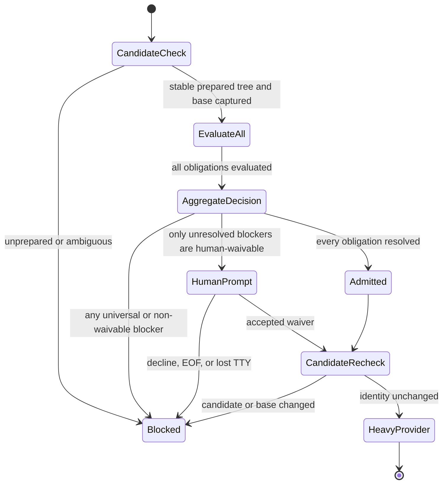
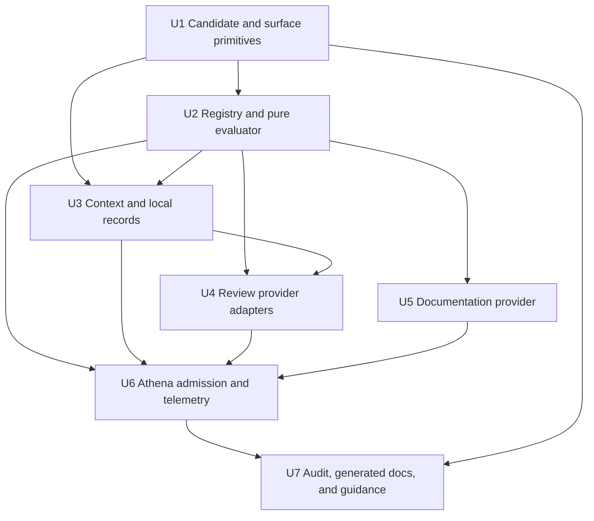
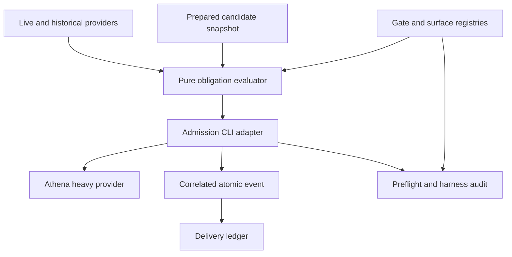

# feat: Add reusable harness gate obligations

## Summary

Add a typed, read-only obligation evaluator plus an effectful admission adapter so public harness gates can declare prerequisites and resolve them from current facts, candidate-bound evidence, human waivers, or explicit CI delegation. The first adoption will place one shared admission boundary in front of Athena's expensive validation provider, require current green review for qualifying agent work, and express documentation currentness through the same decision model without changing its policy.

---

## Problem Frame

Athena can already prepare an exact candidate, validate it, record reusable proof, and report delivery spans, but it cannot enforce that judgment-bearing review happened before expensive validation. The implementation must add that enforcement without confusing a waiver with evidence, duplicating product-surface registries, or making interactive human use unnecessarily rigid (see origin: `docs/brainstorms/2026-08-11-harness-gate-obligations-requirements.md`).

---

## Requirements

**Gate obligation model**

- R1. Define one typed gate-policy registry containing stable gate and obligation IDs, activation, acceptable providers, freshness, exception policy, remediation, and cost class.
- R2. Make every registered public entry point reach prerequisite evaluation before guarded work, including direct invocation of Athena's validation provider.
- R3. Keep evaluation read-only and deterministic, aggregate all applicable failures, and return a structured decision usable by CLI adapters, tests, audits, and telemetry.
- R4. Represent current facts, evidence, waivers, CI delegation, and non-applicability as distinct outcomes; never report a waiver or delegation as green provider evidence.

**Candidate identity and evidence**

- R5. Bind historical evidence and waivers to a bounded stable capture of the complete prepared candidate tree, resolved base ref and SHA, gate, obligation, schema, and worktree-local storage context.
- R6. Accept a provider-owned, machine-readable final-green manifest from the approved `ce-code-review` and `execute` pre-validation review workflows only when the exact final candidate has no blocking or unresolved actionable findings and the recorder independently matches that reviewed candidate.
- R7. Persist evidence and waivers atomically under a Git-private, worktree-scoped path. Corrupt, unsupported, ambiguous, or stale records never authorize; a malformed applicable record blocks unless a separately valid record satisfies the obligation's explicit existential-provider policy.

**Review activation**

- R8. Activate `review.green` at an inclusive threshold of 50 relevant added-plus-deleted lines, excluding tests, generated artifacts, and lockfiles, or for any matching review-sensitive scenario regardless of line count.
- R9. Add immutable scenario IDs and an explicit required review-sensitivity boolean to every existing harness app registry scenario and generated validation map; do not create a second sensitive-path catalog or silently default an omitted policy decision.

**Execution context and exceptions**

- R10. Classify execution context centrally with precedence `repository-authorized CI policy > recognized agent > interactive human > unknown`; CI requires a recognized runner plus an allowlisted workflow, job, event, and registry policy for the exact gate and obligation, while terminal interactivity never overrides a positive agent signal.
- R11. Require fresh approved review evidence for recognized agents and disallow their use of human waivers.
- R12. Allow an interactive human to deliberately create or reuse a waiver only for the same worktree, gate, obligation, candidate, and base; declined input, EOF, lost TTY, or a changed candidate blocks without writing one.
- R13. Allow CI delegation only through a recognized, explicitly declared repository policy; generic CI-like environment values are insufficient, and deterministic obligations remain binding.

**Initial integration and auditability**

- R14. Evaluate obligations after cheap preparation has stabilized the candidate, before any expensive provider starts, and recheck candidate identity immediately before the first heavy spawn.
- R15. Refactor documentation currentness into structured live evidence shared by the obligation evaluator and the existing standalone CLI without changing its thresholds, messages, exit behavior, or evaluating it twice in `pr:athena`.
- R16. Record structured obligation decisions for outer and direct-child runs, and audit registry references, public gate wiring, aliases, approved providers, sensitive scenario IDs, and validation-fingerprint coverage.

**Origin actors:** A1 delivery agent, A2 human developer, A3 CI runner, A4 harness maintainer.

**Origin flows:** F1 guarded agent validation, F2 candidate-changing review, F3 interactive human waiver, F4 deterministic obligation evaluation.

**Origin acceptance examples:** AE1-AE10 are preserved in the unit tests and integration verification below.

---

## Scope Boundaries

- Do not migrate every existing harness gate in this increment.
- Do not turn the obligation evaluator into a scheduler, repair engine, or replacement delivery orchestrator.
- Do not use tracked markers or treat waivers and delegation as successful review evidence.
- Do not add cryptographic human identity or attempt to resist a caller deliberately modifying the harness or fabricating local state.
- Do not broaden or relax current documentation policy merely to fit the abstraction.
- Do not guard raw internal commands such as `test:coverage` unless they become registered public gates; the supported package-script entry points define the contract.

### Deferred to Follow-Up Work

- Migrate additional harness gates and obligations after the review and documentation exemplars establish a stable contract.
- Generalize CI-policy adapters beyond Athena's explicitly supported repository CI environment.
- Retire any newly redundant workflow-order prose only after the enforced path has been observed in normal use.

---

## Context & Research

### Relevant Code and Patterns

- `scripts/pre-push-validation-proof.ts` already resolves `origin/main`, captures the staged tree with `git write-tree`, distinguishes clean from staged-index candidates, stores proof through `git rev-parse --git-path`, and fingerprints validation wiring. Extract or share these primitives rather than using the delivery-documentation fingerprint, whose exclusions are unsuitable for evidence freshness.
- `scripts/pr-athena-delivery-run.ts` owns `prepare -> preflight -> validate -> record-proof -> scorecard`. `package.json` routes heavy validation through `pr:athena:validate-provider`; the guard belongs at that provider boundary after preparation, with public-parent wiring audited.
- `scripts/harness-review.ts` and the delivery runner already use same-tree provider evidence. Their provider-ownership rules are the nearest precedent for a common evidence envelope and fail-closed reuse.
- `scripts/harness-app-registry.ts` is the source of validation scenarios and touched paths; `scripts/harness-generate.ts` emits package validation maps. Stable scenario IDs and sensitivity belong there.
- `scripts/delivery-documentation-check.ts` already aggregates solution-note and landed-change-report failures. Its policy result should become structured while its CLI remains an adapter over the same evaluation.
- `scripts/harness-delivery-run-ledger.ts` records command spans and provider skips. Obligation decisions should extend that structured event model rather than inventing unrelated reporting.
- `.agents/skills/ce-code-review/SKILL.md` and `.agents/skills/execute/SKILL.md` are the approved provider boundaries. Receipt issuance belongs after their final-green decisions, not at dispatch time.

### Institutional Learnings

- `docs/solutions/harness/pr-athena-prepare-validate-proof-2026-06-13.md`: preserve preparation before validation, support the staged-index candidate, and fail closed on ambiguous tracked or untracked state.
- `docs/solutions/harness/proof-aware-delivery-run-metrics-2026-06-18.md`: separate proof state from gate success and preserve structured statuses such as stale, base-changed, and validation-wiring-changed.
- `docs/solutions/harness/repo-validation-rerun-policy-2026-05-07.md`: provider ownership is explicit proof, not an implicit skip; standalone public gates remain fail closed.
- `docs/solutions/harness/ci-duplicate-test-pruning-2026-05-10.md`: CI delegation must identify one authoritative provider and the exact sensor set it owns.
- `docs/solutions/workflow-issues/static-harness-contract-preflight-before-provider-validation-2026-07-13.md`: aggregate cheap deterministic failures before expensive providers and make prevented provider work observable.
- `docs/solutions/harness/registry-owned-generated-doc-stale-paths-2026-04-30.md`: registry source is authoritative; generated output cannot repair stale source intent.
- `docs/solutions/harness/generated-artifact-repair-full-tracked-diff-2026-05-02.md`: preparation may stage tracked repair, but untracked ambiguity and later repair must invalidate proof rather than silently continue.
- `docs/solutions/developer-experience/athena-docs-contracts-target-focused-docs-2026-07-18.md`: assert stable workflow tokens and ownership rather than freezing narrative prose.

### External References

- None. Existing Athena proof, registry, audit, and delivery-ledger patterns provide stronger and more specific grounding than an external framework.

---

## Key Technical Decisions

| Decision | Rationale and tradeoff |
|---|---|
| Treat admission as a pure evaluation followed by an effectful adapter | The same decision can drive CLI output, prompting, tests, direct-child telemetry, and outer-ledger ingestion without hiding state changes inside policy evaluation. |
| Use full prepared tree plus base-tip identity for freshness, merge-base identity for scope | Any candidate or resolved base-tip change invalidates review, including generated or documentation files excluded from activation. Activation and reviewer scope instead diff the merge base to the candidate so an out-of-date branch is not charged for upstream-only changes. |
| Keep activation identity separate from freshness identity | Relevance filtering can avoid review for test/generated/lockfile-only churn without weakening exact-candidate attestation once review is required. |
| Store append-only, immutable, discriminated record files | Evidence and waivers share a versioned worktree-local directory. Each record has a deterministic identity and is published once with an atomic create-if-absent primitive; corruption stays local, concurrent writers converge on the same valid identity, and deterministic discovery distinguishes applicable malformed records from irrelevant files. |
| Make `pr:athena:validate-provider` a long-lived guarded wrapper | Both the outer delivery run and `pr:athena:validate` delegate to this wrapper. It requires a fresh candidate-bound preparation receipt, blocks direct unprepared calls with `pr:athena:prepare` remediation, evaluates admission, performs the final stable capture, and directly spawns wrapper-owned heavy command metadata without returning to a shell `guard && heavy` seam or exposing a post-admission package script. |
| Evaluate universal deterministic blockers before offering a waiver | Fixing stale documentation can change the candidate and immediately invalidate a waiver. Aggregate review and documentation findings, but prompt only after universal blockers are clear. |
| Introduce explicit scenario IDs before policy references | Generated names currently derive from mutable titles. Immutable IDs make gate cross-references auditable and keep review sensitivity in the existing surface registry. |
| Record review evidence only from finalized provider-owned manifests | Dispatch-time metadata, textual “Ready” output, or a generic caller-supplied verdict cannot prove the resulting candidate was reviewed. The recorder validates the approved provider's complete run manifest, exact final-pass snapshot, reviewer completion, finding dispositions, and fresh candidate equality; an identical replay returns the same evidence identity idempotently. |
| Split `execute` review into pre-validation and merge-ready stages | The current `execute` review loop follows `pr:athena` and depends on PR checks, so it cannot satisfy a pre-gate obligation unchanged. Add an independent candidate review/fix/re-review checkpoint before heavy validation; retain the later PR/CI loop as a separate merge-ready concern. |
| Use repository-authorized context precedence | A PTY is a capability, not proof of a human. CI delegation requires matching runner, workflow, job, event, registry policy, gate, and obligation; a policy-like environment value alone is inert. Otherwise recognized agent signals override interactive presentation and unknown contexts block. |
| Keep authorization independent from telemetry | Evaluation and final candidate equality authorize the spawn. Correlated telemetry records that decision and is required before an admitted spawn, but stale or unrelated events can neither grant admission nor be ingested into another run. |

---

## High-Level Technical Design

> *This illustrates the intended approach and is directional guidance for review, not implementation specification. The implementing agent should treat it as context, not code to reproduce.*

The evaluator returns a required resolution discriminant for each obligation: `satisfied_live_fact`, `satisfied_evidence`, `waived`, `delegated`, `not_applicable`, or `blocked`. Each variant carries only its valid provenance: live provider/run facts, historical record and candidate identity, waiver record identity, CI policy identity, or blocking findings. Registry `allowedResolutionKinds` checks this discriminant directly.

The review lifecycle is deliberately acyclic: `prepare candidate -> independent review -> [fix -> prepare resulting candidate -> complete re-review] -> finalize provider manifest -> recorder equality check -> store evidence -> admission -> heavy validation -> later merge-ready review`. Every review mutation reruns preparation before the next complete review pass, so the final preparation receipt and review evidence bind the same candidate. The admission CLI owns prompting, record writes, correlated telemetry, the final stable capture, and direct spawning of the private heavy command list.

---

## Implementation Units

- U1. **Establish canonical candidate and review-sensitive surface primitives**

**Goal:** Share exact prepared-candidate identity, define activation-diff semantics, and give validation scenarios stable policy-facing identities before the gate registry consumes them.

**Requirements:** R5, R8, R9, R14; F1, F2; AE2-AE4, AE9.

**Dependencies:** None.

**Files:**
- Create: `scripts/harness-candidate.ts`
- Create: `scripts/harness-candidate.test.ts`
- Create: `scripts/pr-athena-prepare.ts`
- Create: `scripts/pr-athena-prepare.test.ts`
- Modify: `package.json`
- Modify: `scripts/pre-push-validation-proof.ts`
- Modify: `scripts/pre-push-validation-proof.test.ts`
- Modify: `scripts/harness-app-registry.ts`
- Modify: `scripts/harness-app-registry.test.ts`
- Modify: `scripts/harness-generate.ts`
- Modify: `scripts/harness-generate.test.ts`
- Modify generated package maps: `packages/athena-webapp/docs/agent/validation-map.json`, `packages/storefront-webapp/docs/agent/validation-map.json`, `packages/valkey-proxy-server/docs/agent/validation-map.json`

**Approach:**
- Extract the staged-tree/base snapshot behavior used by pre-push proof into a reusable candidate module while preserving clean and staged-index support and fail-closed base resolution. Make capture a bounded stability protocol: bracket the full HEAD/index-tree/base-tip/merge-base/status/untracked observation, accept only two matching observations, retry finitely, and otherwise return `candidate_ambiguous`.
- Replace the shell preparation chain with one `pr:athena:prepare` wrapper that directly owns the Bun-version, dependency, generated-artifact, readiness, and receipt-publication sequence. Expose no independent receipt-minting command. Only after every prerequisite succeeds may the wrapper publish a worktree-local receipt bound to the stable candidate, base tip, preparation command fingerprint, and schema; any later tree/base/wiring change stales it.
- Preserve three identities: the full candidate tree SHA, `baseTipSha` resolved from the configured base ref for evidence freshness, and `diffBaseSha` derived with the repository's merge-base rule for activation and provider review scope. Derive activation from accepted `diffBaseSha` and tree objects, never from a later mutable working-directory read.
- Make `scripts/harness-candidate.ts` the single activation-classification owner. Reuse exported sources for generated paths, and explicitly classify repository test directories, `.test`, `.spec`, `.e2e`, fixtures/setup helpers, generated validation maps, Convex `_generated`, Graphify output, generated route trees, and `bun.lockb` rather than copying partial lists across gates.
- Count relevant additions plus deletions inclusively at 50. Review-sensitive matching is an independent activation branch and therefore still activates when the touched path itself is a test or generated file under that sensitive scenario; exclusions affect only the line-count branch.
- Define explicit policy for rename old/new paths, deletions, mixed included/excluded files, and binary relevant changes. Treat a relevant binary change as activating review because its risk cannot be represented safely as zero lines.
- Add immutable `id` and required boolean `reviewSensitive` fields to every `HarnessValidationScenario`; emit both into validation maps. Runtime activation reads the source registry directly; generated maps expose the metadata for agents and audits but are not policy authority. Registry validation fails when either field is absent or malformed.

**Initial review-sensitive scenarios:**

| Stable scenario ID | Exact existing registry title | Sensitive |
|---|---|---|
| `athena.shared-demo-admission` | Shared demo admission, restore, and orientation edits | Yes |
| `athena.cash-controls` | Cash-controls workflow edits | Yes |
| `athena.pos-item-adjustment` | POS transaction item-adjustment reporting edits | Yes |
| `athena.pos-mixed-checkout` | POS service mixed-checkout edits | Yes |
| `athena.auth-staff-store-configuration` | Auth, staff, and store-configuration edits | Yes |
| `athena.omnichannel-order-refund` | Omnichannel order, refund, review, and customer-history edits | Yes |
| `athena.pos-app-session-continuity` | POS hub app-session continuity edits | Yes |
| `athena.pos-offline-route-access` | POS offline route access and app-shell edits | Yes |
| `storefront.checkout-auth-boundary` | Checkout or auth route-boundary edits | Yes |
| `storefront.payment-redirect-journeys` | Full browser journeys and payment redirects | Yes |

Every other scenario receives an explicit stable ID and `reviewSensitive: false`; no omission is normalized into a policy decision.

**Execution note:** Add characterization coverage for current proof snapshots and generated-map shape before extracting shared behavior.

**Patterns to follow:**
- `scripts/pre-push-validation-proof.ts` candidate readiness and Git-private path resolution.
- `scripts/delivery-diff-fingerprint.ts` numstat parsing techniques, but not its deliverable exclusions.
- Registry-source and generated-output checks in `scripts/harness-app-registry.ts` and `scripts/harness-generate.ts`.

**Test scenarios:**
- Happy path: a clean candidate and a staged-index-only candidate resolve to the same tree that the existing pre-push proof records.
- Happy path: successful full preparation writes a receipt accepted only for the same stable tree/base and unchanged preparation wiring; a merely clean direct invocation with no receipt is unprepared.
- Error path: a prerequisite command failure or an attempt to invoke a lower-level readiness/receipt helper cannot publish a preparation receipt.
- Covers AE2: changing any tracked candidate content, including generated or documentation content excluded from activation, changes freshness identity; changing only the resolved base changes the base identity.
- Edge case: a branch behind `origin/main` excludes upstream-only changes from activation and review scope by diffing `diffBaseSha -> candidate`, while a moved `baseTipSha` still stales prior evidence.
- Covers AE4: 200 changed test/generated/lockfile lines and no sensitive scenario produce a non-qualifying activation projection.
- Edge case: a test or generated file that also matches one of the explicit sensitive scenarios activates through sensitivity even though its lines are excluded from the threshold branch.
- Edge case: table-driven classification covers every listed test, generated, and lockfile form in the repository and mixed relevant/excluded diffs.
- Edge case: 49 relevant added-plus-deleted lines do not activate; exactly 50 activate; 49 relevant plus 500 excluded lines remain below threshold.
- Edge case: relevant deletions count, rename matching checks both old and new paths, and a relevant binary change activates.
- Covers AE3: parameterized tests use every stable sensitive ID, including overlapping prefixes, deleted paths, and both sides of renames.
- Error path: unresolved base, unstaged tracked content, or untracked content yields an explicit ambiguous/unprepared result rather than a zero-line or reusable candidate.
- Error path: missing, corrupt, stale, or wiring-mismatched preparation receipt blocks direct provider admission with `pr:athena:prepare` remediation.
- Error path: index, status, untracked files, HEAD, base tip, or merge base changes during the bounded capture return `candidate_ambiguous` after finite retries.
- Integration: generated validation maps retain scenario IDs and sensitivity consistently for every registered app.
- Integration: adding a scenario without an explicit boolean `reviewSensitive` fails source registry and generated-map contract tests.

**Verification:**
- Existing pre-push proof semantics remain green, generated validation maps carry stable IDs, and activation/freshness identities are demonstrably separate.

- U2. **Define the typed obligation registry and pure evaluator**

**Goal:** Create the reusable kernel that resolves registered gate obligations from immutable inputs without prompting, persistence, command spawning, or telemetry side effects.

**Requirements:** R1-R6, R8-R9, R13, R15; F1, F4; AE1, AE7, AE8, AE10.

**Dependencies:** U1.

**Files:**
- Create: `scripts/harness-gate-registry.ts`
- Create: `scripts/harness-gate-registry.test.ts`
- Create: `scripts/harness-gate-obligations.ts`
- Create: `scripts/harness-gate-obligations.test.ts`

**Approach:**
- Register stable public gate IDs, obligation IDs, activation rules, acceptable provider IDs, freshness requirements, allowed resolution kinds, remediation, and prevented cost class in one typed source.
- Model evaluator input as captured candidate facts, execution context, deterministic-provider results, and discovered local records. Return an aggregate gate decision with per-obligation tagged outcomes and machine/human remediation.
- Make `review.green` historical and candidate-bound; make documentation currentness a live deterministic provider. Use the explicit resolution discriminants from the technical design so provenance is mandatory rather than inferred from optional metadata.
- Define resolution precedence: fresh approved evidence satisfies review before considering an eligible human waiver; agent contexts ignore waiver records; CI delegation is a live authorized policy result and is never persisted as a record.
- Evaluate only recognized record slots deterministically. Malformed records never authorize. Under an explicitly existential provider policy, any separately fresh valid record permitted by that obligation for the exact candidate satisfies it and demotes malformed neighboring records to diagnostics; without such a valid record, malformed applicable records block. Multiple fresh valid records with incompatible semantics block as `ambiguous_records`.

**Execution note:** Implement evaluator behavior test-first as a pure decision table before adding adapters.

**Patterns to follow:**
- Typed registries and exhaustive audits in `scripts/harness-app-registry.ts` and `scripts/harness-audit.ts`.
- Structured proof status distinctions in `scripts/pre-push-validation-proof.ts`.

**Test scenarios:**
- Happy path: a qualifying candidate plus one fresh approved green receipt satisfies `review.green`; either approved provider produces the same semantic outcome.
- Happy path: a non-qualifying candidate produces `not_applicable` while a green documentation fact remains independently satisfied.
- Covers AE7: stale solution notes and a stale landed-change report appear together as deterministic failures and cannot be waived by any actor.
- Covers AE8: receipts from `ce-code-review` and `execute` with the same candidate/base contract are accepted without provider-specific branching in the gate policy.
- Edge case: a stale record plus a fresh valid record in a different approved existential provider slot admits; malformed applicable slots and incompatible fresh duplicates block with stable remediation.
- Error path: unsupported schema, unknown provider, non-green verdict, unresolved actionable count, missing candidate/base, corrupt record without a separately satisfying existential-provider record, and failed live provider all become structured blocks rather than crashes.
- Integration: a policy reference to an unknown obligation or sensitive scenario fails registry validation.

**Verification:**
- Evaluator tests cover every tagged resolution and prove identical inputs yield identical decisions without filesystem or process effects.

- U3. **Classify execution context and persist local resolution records**

**Goal:** Centralize actor precedence and provide safe worktree-local evidence/waiver discovery and atomic writes for CLI and review adapters.

**Requirements:** R4-R7, R10-R13; F2, F3; AE2, AE5, AE6.

**Dependencies:** U1, U2.

**Files:**
- Create: `scripts/harness-execution-context.ts`
- Create: `scripts/harness-execution-context.test.ts`
- Create: `scripts/harness-obligation-records.ts`
- Create: `scripts/harness-obligation-records.test.ts`
- Reference and audit: `.github/workflows/athena-pr-tests.yml`

**Approach:**
- Establish a fixture-backed inventory of supported automation signals. Initial recognized-agent signals are `CODEX_THREAD_ID`, `CODEX_INTERNAL_ORIGINATOR_OVERRIDE`, `CODEX_CI` (agent signal only, never CI delegation), and `CLAUDE_CODE`; `CURSOR_TRACE_ID` and `TERM_PROGRAM` remain presentation/IDE hints and are insufficient to classify an agent. CI authorization requires `GITHUB_ACTIONS=true`, workflow `Athena PR Tests`, job `harness-validation`, event `pull_request`, a registry-owned `athena-pr-tests` policy ID, and a policy mapping for the exact gate and `review.green`. An environment policy value, `CI`, `CODEX_CI`, inherited CI variables, or TTY alone cannot grant delegation.
- Apply precedence `repository-authorized CI policy > recognized agent > interactive human > unknown`. Unsupported or contradictory automation markers classify as unknown rather than falling through to human.
- Resolve a versioned Git-private directory through `git rev-parse --git-path`. Store append-only immutable files under implementation-controlled namespaces keyed by schema/gate/obligation/provider-or-waiver/worktree identity, with a unique record ID in each filename and deterministic sorted discovery; unknown neighbor files are diagnostics, not candidate records.
- Derive record IDs deterministically from their semantic identity (for review evidence: provider/run/final-pass/candidate; for waivers: worktree/gate/obligation/candidate/base). Publish a restrictive-permission, synced same-directory temporary file with an atomic create-if-absent primitive such as a hard link; on an existing destination, validate and return the identical record rather than overwrite it. V1 performs no authorization-path pruning; later housekeeping may remove only records already proven stale/irrelevant without changing the current decision.
- Bind records to gate, obligation, stable full-tree capture, base ref/SHA, provider or waiver kind, final outcome, and provider-manifest identity where applicable.

**Execution note:** Add failure-path tests before wiring any prompt or provider to persistence.

**Patterns to follow:**
- Git-private proof storage and schema handling in `scripts/pre-push-validation-proof.ts`.
- Existing agent/IDE detection references only where a signal is already supported and can be fixture-tested.

**Test scenarios:**
- Covers AE6: a recognized agent with a PTY remains an agent and is ineligible for human waiver.
- Covers AE6: a noninteractive process without recognized agent or declared CI policy is unknown and fails closed.
- Happy path: a recognized CI run with an explicit Athena delegation policy classifies as CI; a generic CI flag without that policy does not.
- Error path: forged or stale policy values, `GITHUB_ACTIONS` outside the allowlisted workflow/job/event, inherited local CI variables, unsupported events, contradictory automation markers, and a valid policy for the wrong gate all fail to delegate.
- Covers AE5: an interactive human waiver round-trips with kind `waiver` and exact gate/obligation/tree/base binding, never provider-green fields.
- Edge case: candidate- or base-mismatched records are stale and records from another worktree are undiscoverable.
- Error path: partial JSON, unsupported schema, invalid discriminant, unknown provider, and interrupted publication fail closed without altering an existing valid record.
- Error path: concurrent writers and crashes before or after atomic create-if-absent publication yield only complete uniquely named records, never a partially authorized state; incompatible exact-slot records block.
- Integration: multiple local records are read in deterministic order and passed to the pure evaluator without one malformed record hiding a valid one.

**Verification:**
- Context fixtures prove precedence for every actor class, and record tests prove atomic, worktree-scoped, schema-validated behavior.

- U4. **Issue review evidence from approved final-green workflows**

**Goal:** Adapt both approved review workflows to the shared evidence contract only after the prepared final candidate has received a qualifying review outcome.

**Requirements:** R5-R7, R11, R14; F1, F2; AE1, AE2, AE8, AE9.

**Dependencies:** U2, U3.

**Files:**
- Create: `scripts/harness-review-evidence.ts`
- Create: `scripts/harness-review-evidence.test.ts`
- Modify: `package.json`
- Modify: `.agents/skills/ce-code-review/SKILL.md`
- Modify: `.agents/skills/execute/SKILL.md`
- Modify: `scripts/pr-athena-guidance-contract.test.ts`

**Approach:**
- Add one stable package-script recorder entrypoint, but do not let it accept a caller-supplied verdict/count bundle. It accepts only a finalized manifest path under the manifest's approved provider-owned run root, validates the manifest and required reviewer artifacts, independently performs a stable current-candidate capture, exact-matches the provider's final reviewed tree/base/worktree, and publishes or returns the same evidence record idempotently for the same provider/run/final-pass/candidate tuple.
- Define the provider manifest contract: unique run and final-pass IDs; provider/schema; originating worktree identity and resolved provider-run root; review base tip, merge base, and tree captured for the final dispatch; selected, completed, failed, and timed-out required reviewers; merged actionable findings and each disposition; mutation/re-review sequence; final tree/base identities; verdict; unresolved actionable count; and whether any edit occurred after the final pass.
- Update Athena delivery guidance so preparation stabilizes the candidate before an evidence-bearing review pass. Ordinary report-only review may run without evidence. Headless/autofix review that changes the tree must perform another complete review pass of the resulting tree before finalizing a manifest.
- For `ce-code-review`, extend the provider-owned final artifact rather than trusting current dispatch-time `metadata.json`. After every fix, rerun `pr:athena:prepare` for the resulting candidate before dispatching the complete next review pass. Finalize only when that prepared pass leaves no blocking or unresolved actionable findings and all required reviewers completed successfully.
- For `execute`, add an explicit independent candidate review/fix/prepare/re-review checkpoint before `pr:athena` and use that checkpoint's provider manifest. Retain its existing post-validation PR/check review loop as a different merge-ready stage.

**Execution note:** Characterize current final-decision metadata before changing skill instructions, then add adapter tests before enabling receipt writes.

**Patterns to follow:**
- Existing code-review findings classification and final review metadata under `.agents/skills/ce-code-review/`.
- Existing `review_iteration`, internal decision, and critical/important count contract in `.agents/skills/execute/SKILL.md`.

**Test scenarios:**
- Covers AE8: each provider's actual finalized manifest records the same common contract for an identical candidate/base and is accepted by the recorder and U2.
- Error path: unresolved manual/gated actionable findings, ignored actionable findings, failed required reviewers, or an exhausted re-review loop produces no evidence.
- Covers AE2: a provider applies a fix and reports green without reviewing the resulting tree; the recorder rejects the claim.
- Happy path: a provider applies a fix, re-reviews the resulting prepared tree, and reaches the required final green; evidence binds that resulting tree.
- Integration: every provider mutation stales the prior preparation receipt, runs preparation again, and only then dispatches the complete evidence-bearing review pass.
- Covers AE9: preparation changes the candidate after an earlier review; the earlier receipt is stale and the workflow must review the prepared result.
- Error path: copied manifest from another worktree, wrong provider/run, missing reviewer artifact, degraded reviewer set, text-only “Ready” output, direct recorder invocation without a finalized manifest, or edit after final review issues no evidence.
- Edge case: repeated or concurrent submission of the same valid provider/run/final-pass/candidate tuple returns one idempotent evidence identity; crashes around publication yield either no complete record or that same complete record, never conflicting authorization.
- Integration: skill contract tests assert preparation-before-evidence and final-green-only ordering using stable command/artifact tokens rather than prose sentences.
- Integration: `execute` proves the evidence-bearing independent review precedes `pr:athena`, while its later merge-ready review remains after validation.

**Verification:**
- Both workflows can produce interchangeable accepted evidence, and every non-green or candidate-changing terminal path is proven unable to issue it.

- U5. **Expose documentation currentness as live structured evidence**

**Goal:** Make documentation policy a deterministic obligation provider while preserving its existing standalone behavior and single evaluation per gate run.

**Requirements:** R3-R4, R13, R15; F4; AE7.

**Dependencies:** U2.

**Files:**
- Modify: `scripts/delivery-documentation-check.ts`
- Modify: `scripts/delivery-documentation-check.test.ts`

**Approach:**
- Extract a side-effect-free result containing the solution-note and landed-change-report findings in stable order. Retain `assertDeliveryDocumentationCheck` and the public `delivery:documentation-check` CLI as formatting/exit adapters over that result.
- Expose the result as the live-provider input for U6 without changing package-script wiring in this unit.
- Preserve threshold/base options, aggregate wording, and unexpected-error propagation.

**Execution note:** Lock current CLI output and exit semantics with characterization tests before extracting the structured result.

**Patterns to follow:**
- Current aggregation in `scripts/delivery-documentation-check.ts`.
- All-settled static preflight behavior described by `scripts/harness-contract-preflight.ts`.

**Test scenarios:**
- Covers AE7: solution-note and landed-change-report failures are both returned in stable order and block agents, humans, and delegated CI.
- Happy path: current documentation yields green live evidence without persisted state.
- Error path: an unexpected provider exception remains distinguishable from a normal policy finding and preserves standalone failure behavior.
- Integration: `delivery:documentation-check` retains its current CLI success/failure contract while the consuming gate evaluates the underlying policy once.

**Verification:**
- Existing documentation tests remain green, and the structured provider result is equivalent to the standalone assertion/CLI for success, aggregated findings, and unexpected errors.

- U6. **Guard Athena heavy validation and emit obligation telemetry**

**Goal:** Add the effectful admission adapter at the one heavy-provider boundary, including aggregate output, human prompting, final candidate recheck, and structured decision events.

**Requirements:** R2-R4, R10-R16; F1, F3, F4; AE1, AE5-AE7, AE9-AE10.

**Dependencies:** U2-U5.

**Files:**
- Create: `scripts/harness-gate-admission.ts`
- Create: `scripts/harness-gate-admission.test.ts`
- Modify: `package.json`
- Modify: `scripts/pr-athena-delivery-run.ts`
- Modify: `scripts/pr-athena-delivery-run.test.ts`
- Modify: `scripts/harness-delivery-run-ledger.ts`
- Modify: `scripts/harness-delivery-run-ledger.test.ts`
- Modify: `scripts/pre-push-review.test.ts`
- Modify: `scripts/harness-inferential-review.test.ts`

**Approach:**
- Make `pr:athena:validate-provider` invoke only the long-lived shared admission wrapper. Move the current heavy command chain into wrapper-owned structured command metadata with no package-script alias; do not implement a shell `admission && heavy` tail or expose a discoverable post-admission command.
- Keep `pr:athena:validate` delegating immediately to the guarded child so the public parent does not duplicate decisions or prompts. Direct provider invocation must verify a fresh preparation receipt without mutating the candidate and block with `pr:athena:prepare` remediation when it is missing, stale, or invalid.
- Capture candidate/context/facts/records, evaluate all obligations, print all blockers together, and only then offer a waiver to an eligible interactive human when no universal deterministic blocker remains.
- Treat prompt acceptance as an invocation-scoped in-memory waiver. Recheck the candidate after the prompt; if it changed, record the block and publish no reusable waiver. After the guarded heavy provider completes successfully, recheck the same candidate/base and only then publish a reusable candidate-bound waiver. A failed or raced invocation remains accurately recorded as `waived` for that attempted run but leaves no reusable authorization record.
- Do no awaitable filesystem or telemetry work after the successful final capture and before the first direct spawn; block on any instability or difference.
- Evaluate documentation through U5 once inside admission, and remove the old standalone call from the heavy chain in this same unit so there is no intermediate weakening.
- Mint an invocation ID in the outer delivery runner and pass it to the child it launches. Bind each unique atomic event to schema, run/invocation ID, gate, tree/base, invocation mode, parent identity/start token, and timestamp. Ingest only the expected current event once, then mark it consumed. A standalone direct invocation mints its own ID and can never be adopted by a later outer run.
- Decide telemetry failure behavior explicitly: a blocked decision always remains blocked; inability to persist an admitted decision fails closed before expensive work because auditability is part of this enforcement contract.

**Execution note:** Start with mocked-spawn integration tests proving zero heavy commands begin on every blocking path.

**Patterns to follow:**
- Phase spawning and structured provider-skip parsing in `scripts/pr-athena-delivery-run.ts`.
- Ledger schemas and command spans in `scripts/harness-delivery-run-ledger.ts`.
- CLI dependency injection patterns in existing script tests.

**Test scenarios:**
- Covers AE1: qualifying agent work without evidence blocks `pr:athena`, `pr:athena:validate`, and direct `pr:athena:validate-provider` before coverage or any other heavy command starts.
- Covers AE5: an interactive human sees aggregate remediation, accepts only after deterministic facts are green, proceeds under an invocation-scoped waiver, and receives a reusable record only after successful guarded completion; decline, EOF, loss of TTY, provider failure, or prompt-time drift leaves no reusable waiver.
- Covers AE6: agent-plus-TTY never prompts; unknown noninteractive context blocks; declared CI delegation admits review but cannot bypass documentation failure.
- Covers AE7: missing review plus stale documentation reports both, starts no heavy provider, and does not prompt until documentation is repaired.
- Covers AE9: preparation or a prompt-time race changes the tree/base between evaluation and spawn; the guard reports stale state, starts zero heavy commands, and leaves no reusable waiver for the failed admission.
- Error path: telemetry persistence failure cannot convert a block into admission and fails closed before an otherwise admitted heavy provider.
- Integration: standalone direct execution emits one local decision under its own invocation ID; an outer-launched child uses the passed outer invocation ID, and the outer delivery run ingests exactly that event once.
- Integration: stale, partial, duplicate, wrong-candidate, wrong-invocation, retried-child, and already-consumed events cannot enter the current ledger or affect authorization; concurrent worktrees/runs remain isolated.
- Integration: an instrumented run proves documentation policy is evaluated exactly once before any heavy spawn.
- Integration: each registered public alias runs against sentinel lightweight provider commands and proves the sentinel heavy command is unreachable on admission failure; static script assertions remain drift sensors rather than the sole AE1 proof.
- Error path: candidate/base mutation at the final injectable boundary immediately before spawn starts zero heavy processes.
- Integration: non-qualifying agent work with green documentation passes through without requiring review and records `not_applicable` distinctly from `satisfied`.

**Verification:**
- All supported public Athena paths demonstrably converge on one admission decision, blocking cases start zero expensive commands, and ledger artifacts distinguish pass, block, waiver, delegation, non-applicable, stale, and declined-prompt outcomes.

- U7. **Audit the contract and document the reusable posture**

**Goal:** Make omissions and drift detectable, update generated artifacts, and explain how maintainers add obligations or guarded gates without inventing bypasses.

**Requirements:** R1-R2, R9, R16; A4; AE10.

**Dependencies:** U1, U6.

**Files:**
- Modify: `scripts/harness-audit.ts`
- Modify: `scripts/harness-audit.test.ts`
- Modify: `scripts/harness-contract-preflight.ts`
- Modify: `scripts/harness-contract-preflight.test.ts`
- Modify: `scripts/pre-push-validation-proof.ts`
- Modify: `scripts/pre-push-validation-proof.test.ts`
- Modify: `docs/harness.md`
- Modify generated Graphify output under: `graphify-out/`
- Create: `docs/solutions/architecture-patterns/candidate-bound-gate-obligations-before-expensive-validation-2026-08-11.md`

**Approach:**
- Audit unique gate, obligation, provider, CI-policy, and scenario IDs; valid cross-references; allowed resolution discriminants; public package-script aliases; declared shared wrapper; allowlisted CI workflow/job/event mappings; and one guarded path before the registered cost boundary.
- Prefer declarative wrapper/entrypoint metadata over brittle prose matching. Keep stable token assertions for package scripts and skill adapters as defense in depth.
- Add the registry, evaluator, context policy, record schema, approved adapters, and admission wiring to the existing validation fingerprint so changes stale reusable `pr:athena` proof.
- Document the distinction between fact, obligation, evidence, waiver, delegation, and non-applicability; the provider-adapter final-green rule; human/agent/CI posture; public-gate registration; and the documentation exemplar.
- Rebuild generated validation maps and Graphify only after source registries and docs are final.

**Execution note:** Add failing audit fixtures for each omitted reference or wrapper before tightening the production audit.

**Patterns to follow:**
- Referential integrity checks in `scripts/harness-audit.ts`.
- Validation-wiring fingerprint coverage in `scripts/pre-push-validation-proof.ts`.
- Canonical-detail and stable-token guidance in `docs/harness.md` and the documentation-contract learning.

**Test scenarios:**
- Covers AE10: a registered public gate with no admission wrapper, an alias that performs work first, or a cost boundary reachable outside the wrapper fails audit with actionable remediation.
- Error path: duplicate/unknown gate, obligation, provider, or sensitive-scenario IDs fail deterministically.
- Error path: unknown or mismatched CI workflow/job/event policy and a public alias exposing the private post-admission provider fail deterministically.
- Error path: removing the gate registry, evaluator, context policy, record schema, approved adapter, or wrapper from validation-fingerprint inputs makes existing proof non-reusable.
- Happy path: the complete registry and all public Athena aliases pass audit, generated validation maps are current, and documentation contains required stable concepts and commands.
- Integration: the static preflight catches wiring drift before provider validation and the later harness audit remains defense in depth.

**Verification:**
- Self-audit fixtures catch every supported bypass class, generated artifacts match registry source, Graphify is current, and canonical harness documentation explains extension and remediation paths.

---

## System-Wide Impact

- **Interaction graph:** Candidate preparation feeds the evaluator; validation scenarios feed activation; review skills and documentation policy feed providers; the CLI adapter controls the heavy provider; direct events and the delivery runner feed the ledger; preflight and audit verify wiring.
- **Error propagation:** Unstable candidate capture, provider-manifest parsing, deterministic-policy failure, context ambiguity, record conflicts, prompt failure, final recheck drift, and correlated-event persistence all become explicit pre-spawn blocks with aggregated remediation. Unexpected internal exceptions remain distinguishable from policy findings.
- **State lifecycle risks:** Historical records are immutable, atomic, and worktree-local. Candidate or base changes make them stale. Corruption is isolated by record; a fresh valid record can recover an existential provider slot, while contradictory fresh records block. Identical provider-manifest replay returns the same evidence identity. Generated repair between review and validation invalidates admission.
- **API surface parity:** `pr:athena`, `pr:athena:validate`, and `pr:athena:validate-provider` share one long-lived guarded wrapper. The post-admission heavy command is private and cannot be invoked through a public alias. The standalone documentation CLI remains public; other raw internal commands remain outside the registered public-gate contract.
- **Integration coverage:** Mocked process-spawn tests must prove no expensive command starts before admission; package-script and audit tests prove every public route converges; ledger tests prove direct and outer events are not duplicated.
- **Unchanged invariants:** Preparation is the only candidate-mutating phase inside the validation gate. The preceding independent review workflow may fix the candidate but must re-review it before issuing evidence; admission and heavy validation are read-only. Existing documentation thresholds/messages remain, and pre-push proof still represents successful merge-grade validation rather than review waiver or delegation.

---

## Alternative Approaches Considered

- **Tracked marker committed after review:** Rejected because it mutates the candidate it claims to attest, can be copied or left stale, and pollutes product history with worktree state.
- **Guard only the outer `pr:athena` runner:** Rejected because direct invocation of registered validation children would bypass the prerequisite.
- **Guard both parent and provider with separate evaluations:** Rejected because it duplicates prompts and telemetry. A registered parent should delegate immediately to one guarded cost boundary and be audited for that wiring.
- **Require review for every actor:** Rejected because the goal is structural enforcement for agents while preserving deliberate, accurately labeled human autonomy and explicit CI ownership.
- **Use the delivery-documentation diff fingerprint for review freshness:** Rejected because its deliberate path exclusions would allow candidate content to change without invalidating review.
- **Persist all prerequisites as receipts:** Rejected because deterministic facts such as documentation currentness are better recomputed from current state and should not be satisfiable by stale history.
- **Create a second sensitive-path registry:** Rejected because sensitivity is a property of existing validation scenarios and duplicate ownership would drift.

---

## Success Metrics

- Every tested qualifying agent path without fresh review starts zero expensive provider commands.
- Every review-requested candidate or base change makes prior evidence stale until the resulting prepared candidate receives final green review.
- Interactive humans can proceed with one deliberate candidate-bound waiver when universal facts are green, and telemetry never labels it as evidence.
- The existing documentation CLI remains behaviorally compatible while Athena evaluates documentation policy once.
- The v1 contract is demonstrably free of Athena-specific policy in its evaluator and registry types, while operational reusability remains proven only at Athena until a follow-up second-gate adoption exercises the maintainer extension path.
- Delivery telemetry distinguishes admission outcomes and records the cost class prevented by a block.
- Initial adoption telemetry can compare qualifying runs, prevented heavy starts, review-requested candidate changes, waiver rate, and end-to-end review-plus-validation elapsed time so maintainers can judge net workflow savings rather than enforcement alone.

---

## Risks & Dependencies

| Risk | Likelihood | Impact | Mitigation |
|---|---|---|---|
| Caller-controlled or inherited CI signal grants delegation | Medium | High | Require recognized runner plus registry-authorized workflow/job/event/policy mapping for the exact gate and obligation; forged, stale, contradictory, or generic signals fail closed. |
| Textual or cross-worktree provider output is accepted as final-green evidence | Medium | High | Provider-owned atomic manifest, required reviewer/finding lifecycle, exact candidate/worktree equality, idempotent same-pass issuance, and no generic verdict arguments. |
| Candidate changes during capture or between admission and heavy spawn | Low | High | Bounded double-observation stable capture, activation derived from accepted tree/base objects, final equality check, and direct spawn with no awaitable seam. |
| Two guards cause duplicate prompts or telemetry | Medium | Medium | One provider-bound guard; public parents declare immediate delegation and audit it. |
| Activation exclusions diverge from generated/test classifications | Medium | Medium | Reuse registry-owned classifications, test mixed and rename cases, and audit generated output. |
| Generic abstraction expands beyond the immediate need | Medium | Medium | Limit v1 to review plus documentation and one Athena cost boundary; defer broad migration. |
| Telemetry becomes confused with authorization | Low | High | Evaluator decision is authoritative; event writing records it but never changes block to pass. Fail closed before expensive work if an admitted decision cannot be recorded. |
| Skill-only provider wiring is fragile | Medium | High | Shared recorder validates independently, contract tests pin stable tokens, and validation fingerprint includes approved adapters. |
| Existing staged-index proof behavior regresses | Low | High | Characterize before extraction and retain current pre-push proof suite as a compatibility gate. |
| Record collision, corruption, or concurrent publication creates ambiguous authorization | Low | High | Deterministic IDs, atomic create-if-absent publication, identical-record validation, deterministic conflict rules, restrictive permissions, and crash/concurrency fixtures. |
| Stale direct-child telemetry is attributed to another run | Medium | Medium | Unique invocation correlation, candidate binding, atomic events, exact-current ingestion, and consumed-state tests; events never authorize. |

---

## Dependencies / Prerequisites

- The approved review workflows must retain a structured final outcome that can distinguish blocking/actionable findings and identify their final pass.
- The current `pr:athena:prepare` contract must remain the only mutating phase and continue to reject unstaged/untracked ambiguity.
- Supported agent and CI signals must be enumerated from observed repo/harness environments and fixture-tested; unsupported callers intentionally classify as unknown.

---

## Open Questions

### Resolved During Planning

- **Canonical candidate:** Share the complete staged-tree plus exact resolved base identity from pre-push proof; do not reuse the exclusion-heavy documentation fingerprint.
- **Public admission boundary:** Guard `pr:athena:validate-provider`; declare and audit that `pr:athena` and `pr:athena:validate` reach it before other guarded work.
- **Human waiver reuse:** Reuse only for the identical worktree, gate, obligation, tree, and base; it remains a waiver in decisions and telemetry.
- **CI precedence:** An explicit recognized Athena CI-policy context wins; otherwise a recognized agent wins over TTY, then interactive human, then unknown.
- **Documentation integration:** Extract one structured evaluator, keep the standalone adapter, and remove duplicate execution from the heavy provider chain.
- **Binary activation:** Any relevant binary change activates review because line magnitude cannot be established safely.
- **Telemetry failure:** Fail closed before heavy work if an admitted decision cannot be persisted; a block never becomes an admission because telemetry failed.

### Deferred to Implementation

- **Exact module and symbol names:** The paths above define ownership; names may adjust to existing TypeScript conventions if implementation reveals a clearer fit.

---

## Phased Delivery

### Phase 1: Pure primitives and contracts

- Land U1-U3 so candidate identity, activation, registry decisions, actor context, and local records are testable without changing the merge gate.

### Phase 2: Evidence providers

- Land U4-U5 so approved reviews and documentation policy can produce the common inputs without yet controlling expensive work.

### Phase 3: Enforcement and self-audit

- Land U6-U7 together so admission, telemetry, audit, documentation, generated artifacts, and proof invalidation become active as one coherent boundary.

---

## Documentation / Operational Notes

- Update `docs/harness.md` as the canonical explanation; keep entrypoint guidance concise and token-based elsewhere.
- Block messages must name the gate, activated obligation, freshness or context reason, all deterministic findings, prevented cost class, and exact remediation path.
- Observe early delivery-run ledgers for false agent classification, repeated waiver prompts, unexpected stale evidence, duplicate decision events, and documentation double execution.
- Review the first meaningful adoption window (target: 20 qualifying agent runs, or the first release interval if volume is lower) for prevented heavy starts, review-driven candidate changes, total review-plus-validation time, and human waiver friction. Use that evidence to tune activation and prioritize the deferred second-gate adoption; do not claim generic operational maturity from the Athena exemplar alone.
- No data migration or cleanup is required because records are Git-private and schema-versioned; unsupported records fail closed until any separately valid record permitted by the obligation's explicit existential-provider policy is issued for the exact candidate.
- Rebuild generated validation maps and run `bun run graphify:rebuild` after source and documentation changes, then verify generated state through existing harness checks.

---

## Sources & References

- **Origin document:** `docs/brainstorms/2026-08-11-harness-gate-obligations-requirements.md`
- **Delivery ordering:** `scripts/pr-athena-delivery-run.ts`, `package.json`
- **Candidate and proof:** `scripts/pre-push-validation-proof.ts`, `scripts/pre-push-validation-proof.test.ts`
- **Provider evidence:** `scripts/harness-review.ts`, `scripts/harness-review.test.ts`
- **Surface registry and generation:** `scripts/harness-app-registry.ts`, `scripts/harness-generate.ts`
- **Documentation policy:** `scripts/delivery-documentation-check.ts`, `scripts/delivery-documentation-check.test.ts`
- **Telemetry:** `scripts/harness-delivery-run-ledger.ts`, `scripts/pr-athena-delivery-run.ts`
- **Audit:** `scripts/harness-audit.ts`, `scripts/harness-contract-preflight.ts`
- **Review providers:** `.agents/skills/ce-code-review/SKILL.md`, `.agents/skills/execute/SKILL.md`
- **Institutional learnings:** `docs/solutions/harness/pr-athena-prepare-validate-proof-2026-06-13.md`, `docs/solutions/harness/proof-aware-delivery-run-metrics-2026-06-18.md`, `docs/solutions/harness/repo-validation-rerun-policy-2026-05-07.md`, `docs/solutions/harness/ci-duplicate-test-pruning-2026-05-10.md`, `docs/solutions/workflow-issues/static-harness-contract-preflight-before-provider-validation-2026-07-13.md`, `docs/solutions/harness/registry-owned-generated-doc-stale-paths-2026-04-30.md`, `docs/solutions/harness/generated-artifact-repair-full-tracked-diff-2026-05-02.md`, `docs/solutions/developer-experience/athena-docs-contracts-target-focused-docs-2026-07-18.md`
