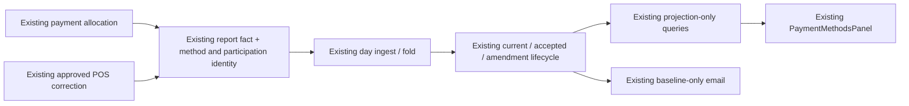

# feat: Align weekly payment mix with live payments

## Summary

Move weekly Payment mix onto Athena's existing payment-allocation report-fact rail so it covers the same full reporting frame as Payments received. Add only the method and participation identity needed by the existing fact, day-fold, weekly-projection, query, and email paths. Existing accepted and corrected reports retain their frozen close-backed mix.

This plan intentionally adds no new table, worker, repair queue, taxonomy registry, rollout framework, public endpoint, or UI component.

---

## Problem Frame

Payments received already updates from payment-allocation report facts as payments arrive. Payment mix still aggregates completed Daily Closes, so the adjacent sections can describe different scopes and totals. The required outcome is straightforward: current Payment mix should answer how the week's gross payments were received, using the same included and outside-schedule frame as Payments received.

This supersedes only the close-backed payment-mix decision in origin R3-R5 and the prior plan. Daily Close remains authoritative for close status, cash variance, completed POS transaction count, and expense-product evidence.

---

## Requirements

- R1. Current Payment mix uses the same payment-allocation facts, operating dates, currency, and full labelled week as Payments received, including open-day and outside-schedule payments.
- R2. Method values represent gross payments received before refunds and reconcile exactly to `paymentsCollectedMinor`; refunds and reconciliation remain separate metrics.
- R3. Each recorded inbound allocation contributes its value to its normalized method. Tender uses match Daily Close semantics for POS: count each distinct POS transaction and normalized method pair once, even when the transaction carries multiple same-method allocations. Non-POS allocations without a POS transaction use allocation identity as the participation fallback.
- R4. Newly accepted reports freeze fact-backed mix from the same cutoff-bounded facts as accepted Payments totals. Later facts or supported POS method corrections flow through the existing amendment lifecycle without rewriting the baseline.
- R5. Current, accepted, and amendment reads remain projection-only. Reports and automatic email consume the selected stored revision; delayed automatic email remains baseline-only.
- R6. Existing accepted history and the Wigclub correction retain their frozen close-backed mix. Missing new fields on those records are legacy authority, not permission to reconstruct them.
- R7. A positive Payments received total without complete method evidence renders Payment mix unavailable, never partial or zero. Zero gross receipts is a known empty mix.
- R8. Implementation reuses existing report facts, fingerprinting, dirty-day marks, sweeper/refold, weekly acceptance/amendment, allowlists, verifier, `PaymentMethodsPanel`, and email payload rails.

**Origin actors:** A1 (store manager or owner), A2 (Athena reporting system), A3 (authorized operator)

**Origin flows:** F1 (live weekly review), F2 (weekly acceptance and delivery), F3 (Aug 3-9 correction preview)

**Origin acceptance examples:** AE2 and AE4 are revised to use payment-allocation facts rather than completed Daily Closes. AE5-AE6 continue to protect legacy accepted/corrected evidence. AE1 and AE3 are unchanged.

---

## Scope Boundaries

- Do not add a taxonomy table, outbox, pending-envelope table, repair worker, participation ledger, feature-flag system, or new operational alert type.
- Do not add per-source participation contracts or a separate participation ledger. Derive the optional stable participation identity centrally from fields already present on `paymentAllocation`.
- Do not add net-settlement, processor-fee, dispute, chargeback, or refund-method mix.
- Do not rewrite or backfill existing report facts, accepted reports, or the Wigclub correction.
- Do not make automatic email consume amendment/current truth or add corrected-report delivery.
- Do not add source hydration to public queries or a new Payment mix UI interaction.
- Do not change payment capture, allocation, refund, or void workflows beyond the existing report dimensions they emit. The sole workflow-level change is that the existing approved POS method-correction command must fail atomically when its required reclassification fact cannot be recorded.

### Deferred to Follow-Up Work

- Cross-domain payment-event identity beyond the agreed POS transaction/method rule and non-POS allocation fallback.
- Store-configurable payment-method aliases or taxonomy governance if real methods beyond Athena's existing `cash`, `card`, and `mobile_money` conventions require it.
- Additional correction domains beyond the existing approved same-amount, single-payment POS correction.

---

## Existing Rails to Reuse

| Need | Existing authority |
|---|---|
| Payment source | `paymentAllocation` and `convex/operations/paymentAllocations.ts` |
| Idempotent immutable evidence | `reportFact`, structural identity, existing fact fingerprint versions, and `recordFacts` |
| Responsive/current day | `reports/ingest.ts` and `reportDay` |
| Authoritative repair | `reports/foldDay.ts`, dirty-day marks, `reports/sweeper.ts`, and fold-version repair |
| Current/accepted/amended week | `reports/weekly.ts` and existing projection documents |
| Legacy frozen mix | `closeEvidence.payments` |
| Presentation | `reports/queries.ts`, existing `PaymentMethodsPanel`, weekly email payload and component |
| Method correction | Existing manager approval, operational event, lifecycle journal, and zero-value correction fact in `correctTransaction.ts` |
| Rollout/verification | Existing report sweep/weekly allowlists and allocation verifier |

---

## Key Technical Decisions

| Decision | Resolution |
|---|---|
| Minimal fact change | Add normalized method plus one optional stable participation identity to the existing payment-mix contribution. POS facts use `posTransactionId`; non-POS facts use allocation identity. The existing correction fact retains that identity while carrying old/new method reclassification. No new table or persistence model. |
| Method normalization | Reuse Athena's current conventions: trim, lowercase, normalize spaces/hyphens/underscores, and map `momo`/`mobile money` to `mobile_money`. Supported keys are `cash`, `card`, and `mobile_money`; blank/unsupported values make only mix unavailable. Reuse the existing display formatter. |
| Tender-use meaning | Count distinct `(participation identity, normalized method)` pairs. For POS-backed allocations, participation identity is `posTransactionId`, matching `buildPaymentTotals` and Daily Close. Multiple same-method allocations still sum all value but contribute one use. For non-POS allocations, participation identity falls back to allocation identity. Structural fact identity keeps replay a no-op. |
| Refunds and voids | They do not reduce gross method values or tender uses. Existing refund/allocation posture continues separately. |
| Correction | Extend the correction fact already emitted by the approved POS correction flow. Set its business time to the original allocation's `recordedAt`, keep server-stamped observation time, and carry a signed move from old to new method. If `recordFacts` returns `contained_failure`, throw so Convex rolls back the correction transaction; no outbox is introduced. |
| Projection | Add the same small optional `paymentMix` union to existing day/current/accepted/amendment documents. New writers persist `complete` or `unavailable`; field absence is reserved for legacy rows. Known zero is `complete` with total zero and no rows. |
| Lifecycle | Current composes existing day projections. Acceptance folds the existing cutoff fact read. Amendment includes mix in the existing weekly truth fingerprint. Queries select totals and mix from the same revision. |
| Compatibility | Keep fingerprint v1/v2 readers, add the new fields to the next fact fingerprint version, bump the existing fold version, and never rewrite accepted history. The existing full reseed remains purge-then-rebuild: it reconstructs a corrected allocation directly in its final persisted method and does not synthesize a second payment-mix reclassification from correction audit history. |
| Rollout | Widen tolerant readers first, then emit/fold. Use existing allowlists and stale-fold repair. Mixed legacy/current frames are unavailable until fully attributable; no new gates. |

---

## High-Level Design

Revision selection:

| State | Payment mix |
|---|---|
| Current week | Stored current fact-backed mix |
| New accepted baseline | Stored cutoff-frozen fact-backed mix |
| Accepted week with amendment in Reports | Amendment totals and amendment mix together |
| Automatic email retry | Accepted baseline only |
| Existing accepted/corrected history | Frozen `closeEvidence.payments` |
| Mixed legacy/current fact frame | Explicit unavailable |

---

## Implementation Units

- U1. **Extend existing payment facts**

**Goal:** Carry the minimum method value and Daily Close-aligned participation identity through the fact rail already emitted for every payment allocation.

**Files:**
- Modify: `packages/athena-webapp/shared/reportsContract.ts`
- Modify: `packages/athena-webapp/convex/schemas/reports/facts.ts`
- Modify: `packages/athena-webapp/convex/reports/fingerprint.ts`
- Modify: `packages/athena-webapp/convex/operations/paymentAllocations.ts`
- Modify: `packages/athena-webapp/convex/reports/reseed.ts`
- Modify: `packages/athena-webapp/convex/pos/application/commands/correctTransaction.ts`
- Test: `packages/athena-webapp/convex/reports/fingerprint.test.ts`
- Test: `packages/athena-webapp/convex/operations/paymentAllocations.test.ts`
- Test: `packages/athena-webapp/convex/reports/reseed.test.ts`
- Test: `packages/athena-webapp/convex/pos/application/correctTransactionPaymentMethod.test.ts`

**Approach:**
- Extend `paymentAllocationReportingDimensions` and `ensurePaymentAllocationReportingWithCtx`; all payment domains already pass through this one emitter, so no caller-wide redesign is needed.
- For recorded inbound allocations, store the normalized method and a stable participation identity on the existing payment fact. Use `posTransactionId` when a POS transaction is present; otherwise fall back to allocation identity. The fold combines that identity with the normalized method. Refund/reversal shapes contribute neither gross mix value nor a use.
- Extend the existing fact fingerprint and retain exact v1/v2 matching. Keep the payment-allocation reseed mapper aligned with the emitter, but preserve reseed's existing full purge-then-rebuild contract: a corrected allocation rebuilds directly with its final persisted method and stable participation identity. Do not add payment-method-correction reconstruction to the existing `pos_correction` reseed phase; the rebuilt final allocation already contains that state, so correction audit history must not apply the reclassification twice. Do not use reseed as a rollout backfill or to manufacture accepted history.
- Add the unchanged participation identity, old/new method, and amount to the existing POS correction fact. Use the original allocation time for its operating date and the correction's normal `observedAt` for cutoff behavior.
- Require the correction's `recordFacts` outcome to be `recorded`; otherwise throw and let the existing Convex transaction roll back allocation, approval, audit, and fact writes atomically.

**Focused scenarios:**
- Cash, card, and mobile-money inbound allocations emit their method, gross value, and participation identity; duplicate allocation replay remains a no-op.
- Two Cash allocations for one POS transaction sum both values but share one `(transaction, Cash)` pair and therefore produce one Cash tender use, matching Daily Close.
- Two different methods on one POS transaction share one participation identity but produce two identity/method pairs and two method uses; two non-POS allocations retain two allocation-backed identities and uses.
- Blank/unsupported method preserves Payments totals but marks mix evidence unavailable.
- Refund, timed void, undated legacy void, and voided refund preserve their existing totals and add no gross mix/use.
- Existing v1/v2 facts still validate and are not enriched or quarantined.
- A full reseed after an approved method correction rebuilds one receipt fact in the allocation's final method, emits no second payment-mix move from correction audit history, reaches the same current mix as live pre-correction receipt-plus-correction folding, and leaves accepted projections untouched.
- Approved cash-to-card correction moves the original amount/use on the original operating day, is excluded from an earlier cutoff, and rolls back fully when fact recording is contained.

**Verification:** New payment and correction evidence uses existing identity, transaction, audit, and replay behavior.

- U2. **Fold mix through the existing day projection**

**Goal:** Add one small derived field to the current incremental and authoritative day paths.

**Files:**
- Modify: `packages/athena-webapp/shared/reportsContract.ts`
- Modify: `packages/athena-webapp/convex/schemas/reports/derived.ts`
- Modify: `packages/athena-webapp/convex/reports/ingest.ts`
- Modify: `packages/athena-webapp/convex/reports/foldDay.ts`
- Modify: `packages/athena-webapp/convex/reports/sweeper.ts`
- Test: `packages/athena-webapp/convex/reports/contract.test.ts`
- Test: `packages/athena-webapp/convex/reports/ingest.test.ts`
- Test: `packages/athena-webapp/convex/reports/foldDay.test.ts`
- Test: `packages/athena-webapp/convex/reports/sweeper.test.ts`

**Approach:**
- Reuse the current payment-row shape: covered gross total plus `{ method, amountMinor, shareBasisPoints, tenderUseCount }` rows.
- Fold receipts and correction moves alongside existing payment posture. Sum every allocation's value, but count distinct `(participation identity, normalized method)` pairs. Corrections retain the identity while moving its method membership. Recompute shares after aggregation and require the row sum to equal `paymentsCollectedMinor`.
- Keep the bounded identity/method participation state needed by incremental ingest on the existing day projection, within the existing fact cap; authoritative refold rebuilds the same state from facts. Do not add a participation table, index, or query-time source read.
- Persist `complete` or `unavailable` from every new day writer. Use existing fact/read caps, safe-integer helpers, dirty marks, sweeper, and a never-published fold-version bump; add no new caps or repair process.

**Focused scenarios:**
- Incremental open day and authoritative refold produce the same cash/card/mobile-money rows and distinct identity/method participation counts.
- Same-method allocations for one POS transaction count once while preserving their full combined value; split tender counts once for each method.
- Zero receipts produces a complete empty mix; positive received with methodless/quarantined/mixed-currency evidence produces unavailable.
- A method correction refolds the original day and changes only method values/uses, not Payments totals.
- Existing stale-fold repair republishes mutable days with the new field.

**Verification:** Each complete day mix reconciles exactly to its existing Payments received total.

- U3. **Carry mix through the existing weekly lifecycle**

**Goal:** Persist the matching mix on current, accepted, and amendment revisions without creating another authority layer.

**Files:**
- Modify: `packages/athena-webapp/shared/reportsContract.ts`
- Modify: `packages/athena-webapp/convex/schemas/reports/derived.ts`
- Modify: `packages/athena-webapp/convex/reports/weekly.ts`
- Test: `packages/athena-webapp/convex/reports/weekly.test.ts`
- Test: `packages/athena-webapp/convex/reports/weeklyScale.test.ts`
- Test: `packages/athena-webapp/convex/reports/weeklyAcceptedRepair.test.ts`

**Approach:**
- Extend `foldWeekFromDays` with the same included/outside-schedule frame already used by Payments totals.
- Extend `foldWeekFromAcceptedFacts` using the existing cutoff-bounded fact read; do not query mutable allocations during acceptance.
- Persist mix on the existing current/baseline/amendment shapes and include it in `weekTruthFingerprint`, so method-only correction uses the established amendment path.
- If any contributing day/fact lacks complete method evidence, persist unavailable for that revision. Never borrow a baseline/legacy mix for amended totals.

**Focused scenarios:**
- Open-day and outside-schedule payments appear in both received total and mix.
- New acceptance freezes split-tender rows, distinct transaction-method use counts, and percentages through `cutoffObservedAt`.
- A post-cutoff payment or supported correction changes current/amendment mix while baseline bytes remain unchanged.
- Legacy accepted/corrected records remain byte-identical; a mixed fact-version frame is unavailable.
- Existing fact and day caps retain their current refusal behavior without partial mix.

**Verification:** Every complete weekly revision's mix equals that revision's Payments received total.

- U4. **Reuse existing Reports and email presentation**

**Goal:** Select and explain the stored mix without adding a component or interaction.

**Files:**
- Modify: `packages/athena-webapp/convex/reports/queries.ts`
- Modify: `packages/athena-webapp/src/components/reports/ReportsWeeklyView.tsx`
- Modify: `packages/athena-webapp/convex/operations/weeklyManagerReportEmail.ts`
- Modify: `packages/athena-webapp/convex/emails/WeeklyManagerReport.tsx`
- Test: `packages/athena-webapp/convex/reports/queries.test.ts`
- Test: `packages/athena-webapp/src/components/reports/ReportsWeeklyView.test.tsx`
- Test: `packages/athena-webapp/convex/operations/weeklyManagerReportEmail.test.ts`
- Test: `packages/athena-webapp/convex/emails/WeeklyManagerReport.test.tsx`

**Approach:**
- In query projection, select the effective revision's `paymentMix`. Fall back to frozen `closeEvidence.payments` only for a legacy accepted/corrected revision whose new field is absent.
- Reuse `PaymentMethodsPanel` and render all rows. Fact-backed copy says `Gross payments received by method.` Known empty says `No payments were received in this period.` Unavailable says `Payment method details aren't available for this period.` Legacy copy keeps its Daily Close coverage wording.
- Reuse `getAcceptedWeeklyManagerReportPayload`: new baselines use stored fact-backed mix; delayed retries remain baseline-only; existing correction preview remains on its frozen correction evidence.
- Reuse existing report/email authorization and React text escaping.

**Focused scenarios:**
- Current, new accepted, amended, legacy accepted, and corrected-preview states select the expected stored revision.
- Known empty and unavailable remain distinct without sample or source fallback.
- Reports and email share ordering, values, percentages, uses, and wording for the same baseline.
- Public queries add no paymentAllocation, reportFact, POS, or Daily Close reads.

**Verification:** The existing panel and email render the same selected financial revision with accurate live or legacy wording.

- U5. **Verify and roll out on existing rails**

**Goal:** Extend current verification and repair paths without adding rollout machinery.

**Files:**
- Modify: `packages/athena-webapp/convex/reports/verify.ts`
- Modify: `packages/athena-webapp/convex/reports/verificationClassify.ts`
- Modify: `packages/athena-webapp/convex/reports/verificationSweep.ts`
- Test: `packages/athena-webapp/convex/reports/verify.test.ts`
- Test: `packages/athena-webapp/convex/reports/verificationClassify.test.ts`
- Test: `packages/athena-webapp/convex/reports/verificationSweep.test.ts`

**Approach:**
- Extend the existing bounded allocation census to compare gross method values and Daily Close-aligned distinct transaction-method use counts, using allocation identity only for non-POS rows. Reuse the same closed method normalizer; independence remains at the source-read and arithmetic boundary.
- Deploy optional validators/readers first, then producers and fold writers. Use existing sweep/weekly allowlists and stale-fold repair to republish mutable current truth.
- Do not invoke the destructive full reseed merely to enrich existing methodless facts, and never touch accepted rows. Without an independently authorized disaster-recovery reseed, mixed frames remain unavailable until naturally replaced by fully attributable facts.
- Rollback disables new presentation before any new baseline is accepted; after that, retain compatible readers and roll forward, as with other accepted-report schema evolution.

**Focused scenarios:**
- Verifier detects wrong method value/use and distinguishes mismatch from unavailable legacy evidence.
- Existing republish changes no accepted ids, fingerprints, corrections, or notification ids.
- Non-allowlisted stores retain legacy/unavailable behavior and existing verification performs no unintended writes.

**Verification:** Existing operational rails prove current mix reconciliation and preserve immutable history.

---

## System-Wide Impact

- **Interaction graph:** Existing payment emitter adds method and stable participation identity; existing ingest/fold sums allocation values and counts distinct identity/method pairs; existing weekly lifecycle freezes current/baseline/amendment mix; existing query/email surfaces render it.
- **Error propagation:** Ordinary payment reporting retains current containment. The already-sensitive method-correction command fails atomically if its reclassification fact cannot be recorded.
- **API parity:** Shared contract, validators, fact fingerprint, day projection, weekly projections, query projection, Reports, and email change together.
- **Unchanged invariants:** Payments totals keep their current meaning; Daily Close retains its other evidence lanes; public reads remain projection-only; automatic email stays baseline-only; accepted history is not rewritten.

---

## Risks & Mitigations

| Risk | Mitigation using existing rails |
|---|---|
| Method rows do not reconcile to Payments received | Persist unavailable unless row sum equals the selected revision's `paymentsCollectedMinor`. |
| Legacy facts have no method | Preserve them and show mixed frames unavailable; never backfill immutable identity. |
| Method correction changes an accepted week | Existing observation cutoff preserves baseline; existing amendment fingerprint carries later truth. |
| Correction fact cannot be recorded | Throw on `contained_failure` so the existing Convex mutation rolls back atomically. |
| Incremental and refold output drift | Share fold arithmetic and use existing dirty-day/sweeper convergence. |
| Multiple same-method allocations overcount tender uses | Derive the stable POS transaction participation identity centrally, count its normalized method pair once, retain every allocation's value, and test incremental/refold/verifier parity against Daily Close's `buildPaymentTotals` rule. |
| Existing accepted/corrected output changes | New field remains optional; absent legacy rows use frozen `closeEvidence.payments`. |
| Reseed observes a corrected allocation's final method | Preserve the existing purge-before-walk contract; rebuild the final receipt state directly, keep payment-method correction history audit-only during reseed, verify it matches live receipt-plus-correction folding, and never use reseed to rewrite accepted projections. |
| Scope grows into payment-domain redesign | Limit stable participation identity to existing `posTransactionId`, with allocation identity as the non-POS fallback, and combine it with normalized method only inside reporting arithmetic; defer broader cross-domain identity and configurable taxonomy. |

---

## Verification Boundary

- Planning only: no implementation tests or browser validation are run here.
- During execution, run focused Vitest files listed above; do not add new test files unless implementation reveals an uncovered contract boundary.
- Browser validation remains user-owned, per request.
- After code changes, run the repository-required Graphify rebuild. Broader merge-gate execution is outside the user's focused-test boundary unless separately requested.

---

## Sources & References

- **Origin:** `docs/brainstorms/2026-08-09-weekly-report-payment-expense-requirements.md`
- Prior plan: `docs/plans/2026-08-09-001-feat-weekly-payment-expense-evidence-plan.md`
- Payment emitter: `packages/athena-webapp/convex/operations/paymentAllocations.ts`
- Fact ingress: `packages/athena-webapp/convex/reports/ingest.ts`
- Day fold: `packages/athena-webapp/convex/reports/foldDay.ts`
- Weekly lifecycle: `packages/athena-webapp/convex/reports/weekly.ts`
- Projection reads: `packages/athena-webapp/convex/reports/queries.ts`
- Reports UI: `packages/athena-webapp/src/components/reports/ReportsWeeklyView.tsx`
- Email payload: `packages/athena-webapp/convex/operations/weeklyManagerReportEmail.ts`
- Existing correction rail: `packages/athena-webapp/convex/pos/application/commands/correctTransaction.ts`
- Existing verifier: `packages/athena-webapp/convex/reports/verify.ts`
- Daily Close payment-count authority: `packages/athena-webapp/convex/operations/paymentTotals.ts`
