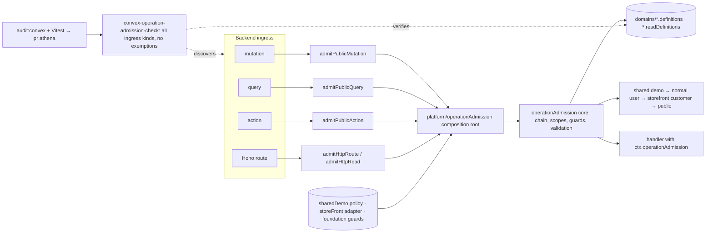
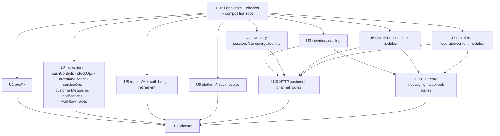

# feat: Complete backend migration onto the operation admission rail

## Summary

Make `operationAdmission` the single admission boundary for every backend ingress: all exported public Convex mutations, queries, and actions and all Hono HTTP routes declare an operation definition and run through one canonical wrapper per ingress kind; actor policy lives only in adapters registered at a platform composition root (shared demo, normal user, storefront customer, public), so the rail core imports no policy module; the structural checker discovers every ingress kind, has no exemption path, and runs inside the merge gate; every legacy or transitional construct is deleted rather than preserved. Delivery is one integration branch (`codex/backend-operations-admission-migration`) validated by `bun run pr:athena`; no PR is opened.

---

## Problem Frame

The write rail (2026-07-21) and read rail (2026-07-22) proved the model but stopped at demo-reachable surfaces. On `origin/main` (406d6777) the checker's own AST discovery finds 246 public mutations of which 189 are raw (57 admitted; the exemption list holds 189 entries; the checker also flags 2 action-targeting definitions it cannot match), plus 184 raw public queries and 38 raw public actions (411 unadmitted Convex exports), and the Hono router registers 93 HTTP ingress routes (55 customer channel incl. the paystack webhook, 34 core, 2 messaging, 1 MTN MoMo `.on()` webhook, 1 `/health`) plus the Convex Auth route family via `auth.addHttpRoutes` — none admitted — the storefront webapp reaches the backend exclusively through those routes, which call `internal.storeFront.*` and `api.storeFront.*` directly with a bare cookie id as identity. What remains is transitional by construction: the 189-entry mutation exemption list, no read/action/route inventory, a checker that only understands mutations (and exits non-zero on two definitions that target actions), two wrapper names per kind, the rail core importing `sharedDemo`, a shared-demo `reports.read` bridge in generic auth, handler-local `requireSharedDemoCapability*` loops and `requireNonDemoFoundation*` guards spread over ~50 call sites, and four hand-maintained registries (`classifyAthenaPublicWrite`, `SHARED_DEMO_PUBLIC_FUNCTION_INVENTORY`, `SHARED_DEMO_GATEWAY_ENFORCEMENT_BINDINGS`, `sharedDemoCapabilityValidator`) that duplicate what definitions should own. Until this closes, "capability declared ⇒ admission installed" holds for a quarter of the backend and the customer channel is not covered at all.

---

## Assumptions

*Authored without synchronous user confirmation. The user's stated direction is "best long-term solution, do not keep legacy behavior"; these are the agent's bets under that direction.*

- Scope is every backend ingress: exported public `mutation`/`query`/`action` under `packages/athena-webapp/convex/**` and every Hono route under `convex/http/**`. Internal Convex functions stay outside the boundary (origin Non-Goals); a route or public function is the boundary that admits them.
- Storefront customers become a first-class actor kind `storefront_customer` resolved by a storefront-owned adapter from the cookie claim (`user_id` / `guest_id`) **only at the HTTP ingress** (`http`/`http_read` definitions; validation rejects it on Convex-function kinds because a plain argument is not a claim boundary), with `assurance: "bearer_id"` recorded in provenance. It clamps to the store derived from the claim row (the `store_id` cookie is only cross-checked), confers no trust beyond possession of the id, and every storefront-reachable route (and every internal callee reachable from it) that takes a caller-supplied resource id must have an ownership assertion — established where missing, not merely preserved. Because the claim cookie is `SameSite=None` and today's CORS reflects any origin, customer **write** routes (`kind: "http"` with `storefrontCustomer: "admit"`) must also declare `ingressVerification: { kind: "origin_allowlist" }` enforced inside `admitHttpRoute` against the configured storefront origin set, and the router's CORS middleware becomes a fixed allowlist (U11) sourced from a U1a platform config (`convex/platform/storefrontOrigins.ts`, env-backed, fail-closed when unset; exact-string match, no wildcard with credentials, `Vary: Origin`; absent, `null`, or unlisted `Origin` denies, no `Referer` fallback); on `http` writes `storefrontCustomer: "admit"` and `public: "admit"` are mutually exclusive (a cookieless request to a customer write route is a terminal denial); `http_read` may admit both only for genuinely non-customer browse reads — on `http` and `http_read` alike, any identity/owner argument passed to an internal callee comes from the admitted actor in `ctx.operationAdmission`, never from the request body/query (exemplar: `bagItem.addItemToBag.storeFrontUserId`), and any `http_read` returning customer-scoped rows is claim-only. Internal callees have no `ctx.operationAdmission`, so the admitted identity is propagated as a dedicated `owner: { storeFrontUserId? | guestId?, storeId }` parameter — the U1b caller table fixes that signature per callee (marking each id column as client-supplied vs admitted-actor) so U6/U7 land the callee signature and U10/U11 the call sites; this is safe only because admitted bodies may call `internal.*` exclusively. Public non-webhook `http` writes (marketing/tracking events) are unauthenticated by design: they must not read or clamp on any claim cookie and rely on the fixed CORS allowlist plus domain-side rate/shape limits. Guests: `guest.storeId` becomes required (U6 ships the backfill migration + schema tightening; a guest row without `storeId` is a terminal denial). Upgrading assurance to a signed `storeFrontSession` proof later changes only the adapter (deferred).
- Admitted bodies (routes, actions, and any handler) call only `internal.*`; a public function is never invoked from inside the backend. Public functions whose only callers are HTTP routes or other backend code become `internal*`; functions also called by the Athena webapp stay public (normal-user/public admission) and gain an internal sibling for backend callers. U1 generates the repo-wide caller table (`docs/plans/2026-08-16-002-backend-caller-table.md`, from checker `--callers`) that every unit applies; the checker forbids `run(Query|Mutation|Action)(api.` anywhere under `convex/**` (tests excluded).
- Shared-demo reach is decided by shared-demo policy (closed capability grant set for writes; a closed read-intent grant set for reads, introduced here), enforced by the shared-demo adapters regardless of what a definition declares.
- Action and HTTP-write admission runs in its own transaction and records "admitted and started"; HTTP-read admission (`http_read`, GET/browse) resolves through an internal query with no write and no capture (repo low-DB-work rule). Those kinds may not declare `store_write` readiness; instead a demo-admitted action/route declares `readiness: { kind: "store_ready" }` (admission-time restore fence without write semantics — required whenever such a definition declares a protected gateway), and any demo-reachable write it performs lands in an internal mutation that re-applies readiness with the admitted store id.
- Provider dispatch modules are not refactored; gateways are declared on definitions using the canonical ids from `SHARED_DEMO_EFFECT_CLASSIFICATIONS`.
- Principal minting is outside the rail by design: `convex/auth.ts` (`convexAuth` with EmailOTP, PosRecoveryCode, SharedDemoTicket providers) is the trust root that creates the actors the adapters later resolve; it is named in `FRAMEWORK_ENTRY_POINTS`, not admitted.
- Finish line is `bun run pr:athena` green on the integration branch. The change exceeds both changed-source-line thresholds (150 → solution note with required frontmatter/sections + agent-doc discovery link + `delivery_diff_fingerprint`; 300 → v2 landed-change report with `data-athena-report-diff-fingerprint`, quiz + `data-quiz-pass-threshold`, required sections), and `review.green` and `telemetry.recorded` activate; U12 satisfies them. No PR, no deploy. Operational prerequisite before any later deploy: run the guest `storeId` backfill.

---

## Requirements

- R1. Every exported public mutation declares an operation definition and its handler is wrapped by the canonical `admitPublicMutation`; `withOperationMutationAdmission` is deleted.
- R2. Every exported public query declares a read definition and its handler is wrapped by the canonical `admitPublicQuery`; `withOperationReadAdmission` is deleted.
- R3. Every exported public action declares an operation definition and is wrapped by `admitPublicAction`, with protected gateways declared using canonical ids (`payment.collect`, `payment.refund`, `customer_message.send`, `order_notification.send`, `export.deliver`, `integration.dispatch`).
- R4. Every Hono route declares an operation definition (`kind: "http"` for writes, `kind: "http_read"` for reads) and is wrapped by `admitHttpRoute` / `admitHttpRead`; the wrapper resolves the storefront claim (cookies) or Athena identity from the request and passes it as admission args; webhook routes are `public` and must declare `ingressVerification` (a registered verifier such as paystack/mtn-momo/whatsapp signature; verifiers fail closed when the secret is absent and use constant-time comparison) — validation rejects a `public` webhook definition without one, and U10/U11 implement any verifier that is currently missing (paystack's is commented out); customer write routes must declare `ingressVerification: { kind: "origin_allowlist" }` (see Assumptions).
- R5. `scripts/convex-operation-admission-check.ts` discovers public `mutation`/`query`/`action` exports, destructured framework registrar exports (`convex/auth.ts` `convexAuth` → `auth`, `signIn`, `signOut`, `store`), and Hono route registrations (`.get/.post/.put/.patch/.delete/.all` and `.on(methods, path, handler)`, router recognized by its `Hono`/`HonoWithConvex` initializer or type, `.use` middleware excluded, including `app.get("/health")` in `http.ts`); recognizes only the canonical wrappers imported from the composition root; classifies definitions by kind; forbids any `api.*` reference reached from `run(Query|Mutation|Action)` or `ctx.scheduler.runAfter/runAt` under `convex/**` (resolved through the AST binding, alias/destructuring fixtures included; tests excluded); asserts the router's CORS middleware uses a fixed origin allowlist (the only `.use` it inspects); has **no exemption or inventory concept** — the only non-admitted ingress allowed is a typed `FRAMEWORK_ENTRY_POINTS` constant naming each framework-generated export/route family with a reason (`auth:auth`, `auth:signIn`, `auth:signOut`, `auth:store`, and the `auth.addHttpRoutes` HTTP family asserted to be registered exactly once from `http.ts`), failing if an entry is missing, extra, or a new registrar export appears; it runs in `audit:convex` (new bare invocation, cwd-independent) and Vitest.
- R6. Rail contract additions: (a) set-valued dynamic capability (`{ kind: "dynamic", candidates, resolve(args) → readonly AthenaCapability[] }`, all-of semantics); (b) `admitPublicAction`, `admitHttpRoute` (write, via internal mutation with the injected capture port) and `admitHttpRead` (read, via internal query, no capture) returning the admitted context projection into the body; `admitHttpRoute` evaluates `ingressVerification` (origin allowlist, signature verifiers) on the raw request **before** invoking the admission mutation — a verification failure is a terminal denial with no admission row and no capture — and reads the raw body once, exposing it as `ingress.rawBody` (the handler consumes the value parsed from that same string; the `Request` body is never re-read) so verifiers HMAC exactly what the handler acts on; `readiness: { kind: "store_ready" }` for action/http kinds; (c) `storefront_customer` actor kind + adapter valid only for `http`/`http_read` definitions; (d) `AthenaReadIntent` union and `SHARED_DEMO_ALLOWED_READ_INTENTS`; (e) `{ kind: "unauthenticated" }` adapter outcome and a fail-closed chain that falls through only on that outcome; (f) `target` resource guards declared on definitions as bound specs — `protectDemoFoundation: true | { athenaUserIdArg?, organizationIdArg?, storeIdArg? } | { resolve(ctx, args, constraints) → { athenaUserId?, organizationId?, storeId? } }` and `protectDemoFoundationExternalRefs: { arg } | { resolve }` — validated (every binding names a real arg/resolver) and evaluated by the rail for every actor kind and every write/action/http definition kind after scope (read definitions carry no `target`); on action/http kinds the rail guarantee is ingress-time only — the internal mutation that performs a body-derived write re-applies the foundation guard and readiness with the admitted store id; (g) `actors.public` required on every definition and `actors.storefrontCustomer` required on `http`/`http_read` definitions (absent = deny elsewhere); (h) per-domain definition modules under `operationAdmission/domains/` composed by `definitions.ts` / `readDefinitions.ts`, with shape helpers in `operationAdmission/domains/_shapes.ts`.
- R7. Rail core (`convex/operationAdmission/**`) imports only files under `convex/operationAdmission/**`, `convex/_generated/**`, and the named catalogs `convex/platform/{capabilityCatalog,readIntentCatalog,storefrontOrigins}.ts` (path-prefix allowlist lint, not a denylist; importing the composition root or any other `platform/*` module fails, with a fixture) — so today's imports of `../sharedDemo/*` and `../contextTracking/sharedDemoActionCapture` both disappear; shared-demo admitted-action capture becomes an injected `capture` port on `createAdmissionRail({ adapters, resourceGuards, capture })`. The registered admission entry points (the write-path internal mutation, formerly `internal.operationAdmission.actionAdmission.admitOperationForAction`, and the new read-path internal query) move to `convex/platform/admissionEntrypoints.ts` next to the composition root, so the rail core exports only factories and pure logic and no import cycle exists at module init. Domain definition modules under `operationAdmission/domains/` may import only `types`, `_shapes`, `platform/*` catalogs, and `_generated/dataModel` (resolvers use `ctx.db` directly). Adapters, resource guards, and the capture port are registered at the composition root `convex/platform/operationAdmission.ts`, which exports the canonical wrappers.
- R8. Normal-user behavior is unchanged for every migrated function (origin R5, R6); each unit records exported-handler parity tests for its files.
- R9. Recognized shared-demo and recognized storefront-customer denials are terminal (never fall through to a lower-trust adapter) and carry typed reasons (e.g. `session_expired`, `demo_disabled`, `scope_denied`, `unknown_claim`) instead of message text; anonymous callers are admitted only on `actors.public: "admit"`; unexpected adapter errors propagate; a valid same-store customer claim never reaches another customer's rows (ownership assertions established per U6/U7/U10 inventory).
- R10. Legacy constructs deleted: `migrationInventory.ts` (+test); `withOperation*Admission`; the `{ sharedDemoCapability }` option, `SHARED_DEMO_ATHENA_USER_READ_CAPABILITIES`, `isSharedDemoAthenaUserReadCapability` in `lib/athenaUserAuth.ts`; handler-local `requireSharedDemoCapability`, `requireSharedDemoCapabilityIfApplicable`, `requireSharedDemoStoreCapabilityIfApplicable`, `getSharedDemoActorWithCtx`, `requireAuthenticatedNonDemoEffect`, `requireNonDemoFoundationMutation`, `requireNonDemoFoundationExternalRefs` calls inside public handlers (the last two are re-expressed as bound `target` guards, not dropped, with a per-unit mapping table from each retired call site to its binding), `enforceSharedDemoActionCapability`, `denySharedDemoEffectIfApplicable`, and every `(internal as any).sharedDemo.actor.*` reference across all ten owning files (`cloudflare/stream.ts`, `storeFront/{auth,paystackActions,checkoutSession,payment}.ts`, `storeFront/helpers/orderUpdateEmails.ts`, `inventory/{productUtil,auth,productSku,stores}.ts`) — successor is `actors.sharedDemo: "deny"` (or a declared protected gateway) on the owning definition, recorded in the same per-unit retired-call-site → binding mapping table required for `requireNonDemoFoundation*`, each with a per-site test that a demo principal is denied at the converted path; the `reports.read` capability id; `classifyAthenaPublicWrite` and its map (and the `operationAdmission/capabilities.ts` re-export); `SHARED_DEMO_PUBLIC_FUNCTION_INVENTORY`, `classifySharedDemoPublicFunction`, `SHARED_DEMO_GATEWAY_ENFORCEMENT_BINDINGS` (their invariants re-derived from definitions); the hand-listed `sharedDemoCapabilityValidator` (derived from `SHARED_DEMO_ALLOWED_CAPABILITIES`); error-message substring classification in adapters.
- R11. Docs reflect the new standing: `operationAdmission/README.md`, `packages/athena-webapp/docs/shared-demo-backend-coverage.md`, `packages/athena-webapp/docs/agent/architecture.md` (+ discovery link), supersession pointers in the 2026-07-21 and 2026-07-22 solution notes, a new `docs/solutions/` note, and a v2 landed-change report.

**Origin acceptance criteria carried forward:** capability declaration installs admission automatically; enabling a capability for shared demo needs no handler patch; shared-demo actors get admission or explicit denial; normal users unchanged; scope + readiness enforced before domain execution; new public functions cannot be added without a declaration and boundary.

---

## Scope Boundaries

- No redesign of roles, organization/store membership, staff credentials, approval or terminal proof, or domain-specific authorization (origin Non-Goals). Admission permits entry; domain code keeps deciding.
- No general-purpose policy language, dynamic plugin/config system, or central authorization engine.
- No change to shared-demo fixtures, seeding, restore implementation, or presentation.
- Internal Convex functions are not forced through the public boundary.
- Provider/gateway dispatch modules, credentials, scheduled jobs, and network calls are not refactored.
- Convex exports stay direct `mutation({...})`/`query({...})`/`action({...})` declarations with explicit validators; Hono routes stay Hono routes.
- Public function names, args (other than additive optional demo-epoch args), and return contracts do not change **except** that storefront public functions reachable only via HTTP routes become internal (their only caller is updated in the same delivery). HTTP route paths and payloads do not change.
- Storefront customer assurance stays cookie-bearer in this delivery; the adapter records `assurance: "bearer_id"`.
- No PR, no deploy.

### Deferred to Follow-Up Work

- Storefront session-proof assurance (`storeFrontSession` token → `assurance: "session"`), changing only the storefront adapter — tracked as a Linear follow-up issue created alongside this plan's tickets so the bearer posture cannot become permanent by default.
- Provider dispatch through the effect rail (origin follow-on).
- Additional actor adapters (automation, integration credential, support session): only when a consumer exists.

---

## Context & Research

### Relevant Code and Patterns

- Rail core: `packages/athena-webapp/convex/operationAdmission/{types,definitions,readDefinitions,publicMutation,publicQuery,actionAdmission,adapters,readAdapters,scopes,effects,actors,capabilities,migrationInventory}.ts`, tests, `README.md`. Today `publicMutation.ts` and `readAdapters.ts` import from `../sharedDemo/*` (the R7 violation).
- Wrapper exemplars: `convex/cashControls/deposits.ts` (mutation), `convex/inventory/products.ts` (read), `convex/operations/openWorkInventoryReviews.ts` (explicit adapters), `convex/storeFront/onlineOrderUtilFns.ts` / `convex/storeFront/reviews.ts` (`ctx.runMutation(internal.operationAdmission.actionAdmission.admitOperationForAction, …)`).
- Definition helpers: `storeWriteOperation`, `transactionStoreWriteOperation`, `orderStoreWriteOperation` (`definitions.ts`, module-private), `define*Read` helpers (`readDefinitions.ts`); resource-derived scope resolvers.
- Adapters: `createNormalUserOperationAdapter`, `createPublicOperationAdapter`, `resolveOperationAdmission` (`adapters.ts`, catches any throw and falls through — the fail-open R9 targets); read equivalents; `sharedDemo/operationAdapter.ts` (gateway enforcement, restore fence, `isRecognizedSharedDemoActorError` message sniffing); `sharedDemo/foundation.ts` (`requireNonDemoFoundationMutation`, `requireNonDemoFoundationExternalRefs` — target-row protection for all actors); `sharedDemo/actor.ts` (`requireAuthenticatedNonDemoEffect`, `sharedDemoCapabilityValidator`).
- Policy: `convex/platform/capabilityCatalog.ts` (55 capabilities, `SHARED_DEMO_ALLOWED_CAPABILITIES`, `classifyAthenaPublicWrite`); `convex/sharedDemo/policy.ts` (`SHARED_DEMO_EFFECT_CLASSIFICATIONS`, `SHARED_DEMO_PUBLIC_FUNCTION_INVENTORY`, `enforcedCapabilities` invariant, `SHARED_DEMO_GATEWAY_ENFORCEMENT_BINDINGS`, `classifySharedDemoPublicFunction`).
- HTTP ingress: `convex/http.ts` (Hono router, ~30 `app.route` groups), `convex/http/utils.ts` (`getStorefrontUserFromRequest` = `user_id`/`guest_id` cookies), `convex/http/domains/{customerChannel,core,customerMessaging,moneyMovement}/routes/*.ts` (92 route registrations under `http/domains/**` plus `/health` in `http.ts`; 37 `api.*` and 35 `internal.*` calls).
- Framework entry points: `convex/auth.ts` (`export const { auth, signIn, signOut, store } = convexAuth(...)`).
- Checker: `scripts/convex-operation-admission-check.ts` (+test; discovery requires `export const X = kind(...)` from `_generated/server`; repo root from `process.cwd()`); `packages/athena-webapp/scripts/convex-audit.sh` (registered gate command; `set -euo pipefail`; precedent `check-register-session-authority-writers.ts`); `scripts/harness-app-registry.ts` scenario `athena.shared-demo-admission` (`touchedPaths` pins `publicMutation.ts`; asserted by `scripts/harness-app-registry.test.ts` and `scripts/harness-audit.test.ts`).
- Legacy bridge: `convex/lib/athenaUserAuth.ts` (`getOperationAdmissionActorUserId` narrows on `kind === "public"`); callers `convex/inventory/athenaUser.ts`, `convex/reports/access.ts`.
- Gate obligations: `scripts/harness-gate-registry.ts` (`review.green`, `documentation.current`, `telemetry.recorded`; private provider commands incl. `audit:convex`, `test:coverage`, `architecture:check`, `lint:*:changed`).

### Institutional Learnings

- `docs/solutions/architecture-patterns/athena-operation-admission-rail-2026-07-21.md`, `…/athena-shared-demo-read-admission-rail-2026-07-22.md`, `…/athena-public-operation-admission-2026-07-24.md` — definition alone is not coverage; test exported handlers; read intents ≠ write capabilities; anonymous callers need an explicit actor.
- `docs/solutions/security-issues/pos-public-surface-authz-and-rejected-sale-loss-2026-07-15.md`; `docs/solutions/workflow-issues/static-harness-contract-preflight-before-provider-validation-2026-07-13.md`; `docs/solutions/harness/review-evidence-deliverable-identity-2026-08-12.md`; `docs/solutions/harness/scope-disciplined-review-and-durable-run-telemetry-2026-08-13.md`.

### External References

- None.

---

## Key Technical Decisions

- **Composition root outside the rail core.** `convex/platform/operationAdmission.ts` imports the rail core factories plus the policy adapters (`sharedDemo/operationAdapter.ts`, `sharedDemo/readOperationAdapter.ts`, `storeFront/operationAdapter.ts`) resource guards (`sharedDemo/foundation.ts`), and the shared-demo capture port (`contextTracking/sharedDemoActionCapture.ts`), and exports the canonical `admitPublicMutation`, `admitPublicQuery`, `admitPublicAction`, `admitHttpRoute`, `admitHttpRead`. The rail core exports `createAdmissionRail({ adapters, resourceGuards, capture })` and no policy; `convex/platform/admissionEntrypoints.ts` registers the internal admission mutation/query the action/http wrappers call. Rationale: origin R3 ("generic rail must not import from sharedDemo") becomes structural, and a future adapter is a one-line registration.
- **Adapter chain and outcomes.** Order: shared demo → normal user → storefront customer → public. Adapters return `admitted | denied(recognized, reason) | unauthenticated | not_applicable`; the chain falls through only on `unauthenticated`/`not_applicable`; `denied` throws with its typed reason (shared-demo session expiry and env-disabled become `denied` reasons, never `unauthenticated`); any thrown error propagates — the current `catch (error) { … publicAdapter.resolve … }` block in `resolveOperationAdmission` (and its read twin), which routes any throw including scope-resolver failures to the public adapter, is deleted. Identity is resolved before scope so a scope-resolver failure can never fall through. No adapter classifies outcomes by error-message text.
- **`storefront_customer` actor.** Adapter lives in `storeFront/operationAdapter.ts`; only `http`/`http_read` definitions may declare `actors.storefrontCustomer: "admit"` (validation rejects it on `mutation`/`query`/`action` kinds and requires `scope.kind === "store"`); `admitHttpRoute`/`admitHttpRead` read the `user_id`/`guest_id` cookies as the claim; the adapter loads the `storeFrontUser`/`guest` row, derives the store from the row (cross-checking the `store_id` cookie), and returns `{ kind: "storefront_customer", storeFrontUserId | guestId, storeId, assurance: "bearer_id" }`. Unknown id, foreign store, a guest without `storeId`, or a missing claim on a customer write route is a terminal denial. Validation (U1, tested): on `kind: "http"`, `storefrontCustomer: "admit"` and `public: "admit"` are mutually exclusive and `storefrontCustomer: "admit"` requires `ingressVerification: { kind: "origin_allowlist" }`; `http_read` may admit both. `public` http scope is untrusted input that clamps nothing. README states it is proof of possession, not authentication. Ownership assertions: U1b's caller table lists, per route, every internal callee reachable from it and its caller-supplied id arguments; the owning B1 unit (U6/U7 for `storeFront/**`) establishes the missing assertions in the callee (verification contract: "every internal callee reachable from a customer route asserts ownership of caller-supplied ids against the admitted actor"), and U10/U11 own the route-level inventory sign-off and route tests (known gaps: `bagItem.addItemToBag` patches/inserts into any `bagId`; `updateItemInBag`/`deleteItemFromBag` act on a bare `itemId`).
- **Set-valued dynamic capability**, all-of semantics; resolved sets outside `candidates` deny; `pos/public/sync.ts` normalizes denial to its `CommandResult` `user_error` shape at the boundary with a test pinning the client-visible shape.
- **Target resource guards.** Bound specs (see R6f) on definitions of every kind; guards are registered at the composition root and evaluated for every actor after scope; `true` means "use resolved scope constraints"; arg/resolver bindings cover the call sites that guard non-scope ids (`createdByUserId`, looked-up `category.storeId`, `subscription.organizationId`, `args.imageUrls`). Each unit ships a mapping table from every retired `requireNonDemoFoundation*` call site to its binding and a per-site test that a normal full-admin still cannot mutate demo foundation rows. Rationale: these guards protect demo fixture rows from all actors and cannot be expressed by actor policy.
- **Read intents are a typed catalog.** `convex/platform/readIntentCatalog.ts` defines `AthenaReadIntent` (closed union, fixed in U1 for all units after a full sweep of every query and route) and `SHARED_DEMO_ALLOWED_READ_INTENTS` lives in `sharedDemo/policy.ts`, enforced by the shared-demo read adapter (net-new enforcement: U1 derives the seed from the intents of currently `sharedDemo: "admit"` read definitions and asserts the derivation so no demo read narrows silently). Units reference intents and capabilities; they never coin them — U1's sweep also closes the capability catalog for all 93 routes.
- **Definitions are the only capability/gateway source.** `sharedDemo/policy.ts` derives "every allowed capability has an admitted representative" and "every gateway binding" from `OPERATION_ADMISSION_DEFINITIONS`; static tests also assert the reverse: every definition with `sharedDemo: "admit"` declares a granted capability/intent.
- **Action/HTTP admission semantics.** `admitPublicAction`/`admitHttpRoute` call the rail's internal admission mutation (capture for shared demo; broadened `returns` validator; serializable projection of `OperationAdmissionContext`); `admitHttpRead` calls an internal admission query (no write, no capture); both inject `ctx.operationAdmission` (cloned ctx, same form as `admitPublicMutation`). Validation rejects `readiness.store_write` on `action`/`http`/`http_read` kinds and requires `readiness.store_ready` on any demo-admitted action/http definition that declares a protected gateway (the existing `sendOrderUpdateEmail`/`sendFeedbackRequest` definitions convert to `store_ready`; the definitions.ts invariant is amended accordingly); a test proves a demo action is denied while the store is restoring, and that an action admitted for store A cannot write store B through the injected constraints; downstream demo-reachable writes land in internal mutations that re-apply `requireReadySharedDemoWriteWithCtx` with the admitted store id, and each unit lists them.
- **HTTP routes as ingress kinds.** `admitHttpRoute` / `admitHttpRead` wrap Hono handlers using the U1-owned claim/store extraction helpers in `convex/http/utils.ts`; the checker discovers every registration form listed in R5 and requires the handler argument to be one of the two wrappers. Admitted bodies call only `internal.*` (checker-enforced); the U1 caller table decides internalization/siblings for every `api.*` self-call (37 route sites plus intra-backend sites such as `storeFront/payment.ts`, `storeFront/rewards.ts`).
- **Checker without exemptions; framework entry points named honestly.** `FRAMEWORK_ENTRY_POINTS` (typed, with reason) covers the four `convexAuth` registrar exports and the `auth.addHttpRoutes` HTTP family (asserted registered exactly once from `http.ts`); everything else raw is a high finding. Discovery adds destructured registrar exports so the list is verified both ways. `--path <prefix>` filters for unit progress; `--partition` prints the per-unit ownership table from this plan's appendix so orphans surface in Phase A. Invoked from `convex-audit.sh` as a bare `"$BUN_EXECUTABLE" "$ROOT_DIR/../../scripts/convex-operation-admission-check.ts"`; repo root from `import.meta.url`.
- **Per-unit domain modules pre-created in U1; single-writer codegen.** U1 creates one module pair per Phase B unit — `operationAdmission/domains/u2_pos_definitions.ts` / `u2_pos_readDefinitions.ts` … `u11_httpCore_*` (empty arrays; unit-named because U3/U4, U6/U7, U10/U11 share directories) — wires all composing imports, extracts shape helpers to `domains/_shapes.ts`, closes the capability catalog and read-intent catalog for all units, seeds `SHARED_DEMO_ALLOWED_READ_INTENTS`, lands the final `http/utils.ts` helper signatures, and runs codegen once — so Phase B units touch only their own two domain modules plus their owned files; `definitions.ts`, `policy.ts`, `capabilityCatalog.ts`, `http/utils.ts` are never edited in Phase B. `_generated/**` is tracked and single-writer: Phase B units never run codegen; when a unit internalizes a function it requests a codegen run from the orchestrator, which serializes it.
- **Units partition by file ownership** (appendix table is authoritative; every public export file belongs to exactly one unit; any file not listed is a Phase A blocker). Phase B runs in two waves: B1 = U2–U9 (Convex modules), B2 = U10–U11 (routes) after B1, because route bodies switch to internal siblings that B1 units create.
- **Reporting reads on `reports.view`; generic auth becomes shared-demo-unaware.**

---

## Open Questions

### Resolved During Planning

- Queries, actions, and HTTP routes in scope? Yes — the storefront webapp only uses HTTP.
- Keep two wrapper names? No. Exemption path? No (framework entry points named explicitly instead). Customer channel via `public`? No — `storefront_customer` with bearer assurance.
- Where does the checker gate? `audit:convex` + Vitest.
- Dev/harness exports: `devPatchBadTransaction:patchBadTransaction` and `inventory/productUtil:clearAllCache` become `internalMutation`/`internalAction` (no client caller — U9/U3 verify with grep before internalizing; if a caller exists they are admitted as `administration.maintenance` instead). `harnessWaiver/*` stays public and admitted (`identity.authenticate`/`administration.maintenance`) because the harness client calls it.
- Backend `api.*` self-calls → internal siblings per the U1-generated caller table (`docs/plans/2026-08-16-002-backend-caller-table.md`); U10/U11 switch routes to them.

### Deferred to Implementation

- Exact resource-scope resolvers per function (which id resolves the owning store).
- Frontend touch points for additive demo-epoch args.
- None that affect cross-unit contracts: U1 closes the capability and read-intent catalogs after sweeping every query and route, and the U1b caller table (incl. the `owner` parameter convention) is the contract across the B1→B2 boundary.

---

## High-Level Technical Design

> *Directional guidance for review, not implementation specification.*



Definition sketch (directional):

```
OperationDefinition {
  kind: "mutation" | "action" | "http" | "http_read",   // read definitions (query) are a sibling type with access.intent: AthenaReadIntent
  functionName | route, operationId,
  capability: AthenaCapability | { kind: "dynamic", candidates, resolve(args) → AthenaCapability[] },
  scope: none | store(storeIdArg | resolve) | organization | resource-resolved,
  readiness: none | store_write (mutation only) | store_ready (action/http only), effects { gateways },
  target?: { protectDemoFoundation?: true | { ...IdArg } | { resolve }, protectDemoFoundationExternalRefs?: { arg } | { resolve } },
  ingressVerification? (http webhooks),
  actors: { normalUser, sharedDemo, storefrontCustomer ("admit" only on http kinds), public }   // all required
}
```

---

## Implementation Units



Graph edges into B2 are illustrative; the binding constraint is the wave boundary (all of B1 complete before B2). Internalization is two-step so the tree always typechecks: B1 owners add the internal sibling and keep the public export; B2 (U10/U11) flips routes to `internal.*` and then deletes the orphaned public export in the B1-owned file (safe post-B1); U12 asserts zero orphan public exports via the caller table. Late-discovered ownership-assertion gaps in B1-owned files are likewise patched by U10/U11 post-B1 under the same per-site test contract. Ownership rule: each unit owns the files in the appendix table in full (all mutations, queries, actions, or routes in them) plus its unit-named `domains/uN_<name>_definitions.ts` / `uN_<name>_readDefinitions.ts` pair (underscored: Convex module path components allow only alphanumerics, underscores, periods); it edits nothing else and never runs codegen (request it from the orchestrator). Wave B2 (U10, U11) starts after wave B1 (U2–U9) because route bodies switch to internal siblings created by U3/U4/U6/U7 (dispositions come from the U1 caller table). No Phase B unit runs `bun run pr:athena` (`audit:convex` is red by design until U12); each unit's sensors are its focused suites plus `bun scripts/convex-operation-admission-check.ts --path <owned prefixes>` reporting zero findings.

- U1. **Rail end-state, composition root, and checker** — delivered as three sub-units: **U1a** rail core + composition root + wrappers/adapters/guards + per-unit domain scaffolds + `http/utils.ts` + codegen (publishes the API Phase B compiles against); then in parallel **U1b** checker rewrite (`scripts/**` only, incl. `--partition`/`--callers`, gate + harness wiring) and **U1c** mechanical canonical rename (134 sites / 34 files) + catalog/read-intent sweep closure (`convex/**` only). Phase B starts after all three.

**Requirements:** R5, R6, R7, R9, R10 (rename/aliases), R11 (README)

**Dependencies:** None (U1b, U1c depend on U1a)

**Files (create):** `convex/platform/operationAdmission.ts` (composition root), `convex/platform/admissionEntrypoints.ts`, `convex/platform/readIntentCatalog.ts`, `convex/operationAdmission/{rail,publicAction,httpRoute,httpRead,resourceGuards}.ts`, `docs/plans/2026-08-16-002-backend-caller-table.md` (generated), `convex/operationAdmission/domains/_shapes.ts` and the ten unit-named pairs `domains/{u2_pos,u3_inventoryCatalog,u4_inventoryIdentity,u5_operations,u6_storefrontCustomer,u7_storefrontOperator,u8_reports,u9_platform,u10_httpCustomer,u11_httpCore}_{definitions,readDefinitions}.ts` (empty arrays wired), `convex/platform/storefrontOrigins.ts`, `convex/sharedDemo/readOperationAdapter.ts` (moved from rail core), `convex/storeFront/operationAdapter.ts`, tests for each.
**Files (modify)** — U1a unless tagged: `convex/operationAdmission/{types,definitions,readDefinitions,publicMutation,publicQuery,adapters,readAdapters,actionAdmission,actors,scopes,README}.ts`; `convex/sharedDemo/{operationAdapter,policy,foundation,actor}.ts` (dynamic set evaluation, `SHARED_DEMO_ALLOWED_READ_INTENTS`, guard registration, remove message sniffing); [U1c] `convex/platform/capabilityCatalog.ts` (add missing ids after the route/query sweep — rg/AST-script driven, independent of U1b's checker); `convex/http/utils.ts` (final claim/store extraction helpers consumed by both wrappers); `convex/lib/athenaUserAuth.ts` (exhaustive actor-kind switch only); [U1c] every existing wrapper call site (134 sites / 34 files) renamed to canonical imports from the composition root, `convex/storeFront/onlineOrderUtilFns.ts`, `convex/storeFront/reviews.ts` (adopt `admitPublicAction`), catalog/read-intent sweep closure; [U1b] `scripts/convex-operation-admission-check.ts` (+test), `scripts/harness-app-registry.ts` (+`harness-app-registry.test.ts`, `harness-audit.test.ts`), `packages/athena-webapp/scripts/convex-audit.sh`; [U1a] `_generated/api.*` via codegen.
**Files (delete):** `convex/operationAdmission/migrationInventory.ts` (+test), replaced by `coverage.test.ts` asserting zero checker findings (red during Phase B, green at U12).

**Approach (ordered by sub-unit):** U1a — (1) default adapter registration and fail-closed chain with `unauthenticated` outcome — regression test that a demo principal on a `sharedDemo: "deny"` definition is denied by the demo adapter and never admitted as `normal_user` (today `admitPublicMutation`'s default resolver registers only the normal adapter); (3) composition root + capture port + rail-core allowlist import lint; (4) dynamic set capability, bound target guards, storefront-customer adapter (http kinds only), `store_ready` readiness, `admitPublicAction`/`admitHttpRoute`/`admitHttpRead` with broadened internal `returns`, `rawBody` pass-through, origin_allowlist verifier (absent/null/unlisted Origin denies), restore-fence test and store-confinement test; (6) unit-named domain modules pre-created, shapes extracted, `http/utils.ts` helpers, `platform/storefrontOrigins.ts`, single codegen. U1c — (2) canonical rename with a demo-actor test per pre-existing `admitPublicMutation`/`admitPublicQuery` site; (5) full sweep of every query and route → close `AthenaReadIntent` and the capability catalog, derive and seed `SHARED_DEMO_ALLOWED_READ_INTENTS` from current demo-admitted reads. U1b — (7) checker: query/action/route (all forms)/registrar discovery, `FRAMEWORK_ENTRY_POINTS`, kind classification, `api.*` self-call ban, `--path`, `--partition`, `--callers` (writes the caller table incl. route → internal callee → id-arg rows), `--downstream-writes` (writes `docs/plans/2026-08-16-002-downstream-writes.md`, asserted by the coverage test), `import.meta.url` root, no exemptions; (8) gate wiring (new invocation in `convex-audit.sh`) + harness touchedPaths; (9) publish the baseline via `--partition` and confirm file assignment matches the appendix exactly (a mismatch is a Phase A failure; counts are updated from the run).

**Test scenarios:** as listed per decision above, plus: unexpected throw in the normal adapter propagates and does not admit `public`; storefront-customer definition without store scope fails validation; recognized customer denial does not fall through to `public`; action definition with `store_write` readiness fails validation; checker reports raw `query`/`action`/route fixtures and a missing/extra framework entry point; `--partition` output has no orphan file.

**Verification:** rail suites, checker `--partition` clean, `audit:convex` red only on the baseline set, typecheck; every previously admitted function still admitted under canonical names.

- U2. **`pos/**`** — owns `pos/public/{catalog,customers,posRecoveryCodes,register,sync,telemetry,terminalAppSessions,terminals,transactions}.ts` (29 raw mutations, 12 raw queries). Capabilities `pos.*`, `workspace.telemetry.write`; `pos.view` reads; sync → dynamic set with `user_error` denial contract; characterization-first for `terminals`, `customers`.

- U3. **inventory catalog** — owns `inventory/{bannerMessage,bestSeller,catalogImport,categories,colors,complimentaryProduct,featuredItem,inventoryImportCostOverlay,productSku,productUtil,products,promoCode,skuSearch,stockValidation,storeSchedule,subcategories}.ts` (47 m, 40 q, 3 a). Capabilities `catalog.*`, `inventory.import`, `administration.maintenance`; `inventory.catalog.view` and sibling intents; `target.protectDemoFoundation` on every write that previously called `requireNonDemoFoundationMutation`; `productUtil:clearAllCache` internalized after caller check.

- U4. **inventory sessions/stores/orgs/identity** — owns `inventory/{auth,expenseSessionItems,expenseSessions,expenseTransactions,inviteCode,organizationMembers,organizations,posSessionItems,posSessions,stores}.ts` (39 m, 18 q, 5 a). Capabilities `pos.session.manage`, `expense.manage`, `store.configure`, `integrations.manage`, `administration.*`, `organization.manage`, `identity.authenticate` (pre-auth `public: "admit"`); `organization.view`; `target` guards where foundation guards existed; store provider actions via `admitPublicAction`.

- U5. **operations · cashControls · stockOps · inventoryLedger · serviceOps · customerMessaging · notifications · workflowTraces** — owns `operations/{dailyClose,dailyManagerReportEmail,dailyOperationsAutomation,managerElevations,operationalEvents,serviceIntake,staffCredentials,staffProfiles}.ts`, `cashControls/closeouts.ts`, `stockOps/{adjustments,purchaseOrders,receiving,replenishment,vendors}.ts`, `inventoryLedger/corrections.ts`, `serviceOps/{appointments,catalog,serviceCases}.ts`, `customerMessaging/public.ts`, `notifications/subscriptions.ts`, `workflowTraces/public.ts` (36 m, 18 q, 3 a; `temporaryDeleteStockAdjustmentScopeSkus` is internalized or admitted as `administration.destructive` per caller table). Gateways `customer_message.send`, `order_notification.send`; `target` guards for notifications foundation checks.

- U6. **storeFront customer modules** — owns `storeFront/{auth,bag,bagItem,checkoutSession,customerBehaviorTimeline,guest,homepageSnapshot,offers,payment,paystackActions,rewards,savedBag,supportTicket,user,users}.ts` (11 m, 37 q, 9 a). Applies the U1 caller table: route-only functions become internal, webapp-called functions stay public (normal-user admission) with internal siblings; payment actions declare `payment.collect`/`payment.refund` and drop `enforceSharedDemoActionCapability`; ships the guest `storeId` backfill (derive only from an authoritative related row — bag/checkoutSession/onlineOrder — leave unresolvable rows unset so they deny; never default to a store) + schema tightening in `convex/schema.ts` (U6-owned); establishes ownership assertions for its id-taking functions.

- U7. **storeFront operator/content modules** — owns `storeFront/{analytics,onlineOrder,onlineOrderItem,onlineOrderUtilFns,reviews}.ts` and `storeFront/helpers/orderUpdateEmails.ts` (14 m, 30 q). Operator paths admit normal users (`reviews.manage`, `storefront.analytics.write`, `orders.*`); customer-side review create/markHelpful become internal per caller table (route-admitted); deletes the handler-local demo check in `onlineOrder.ts` and the `enforceSharedDemoActionCapability` reference; ownership assertions inventoried/established for id-taking functions.

- U8. **reports + auth bridge** — owns `reports/{customRange,liveDay,queries,skuMixRange,skuMovementRange,access}.ts`, `inventory/athenaUser.ts`, `lib/athenaUserAuth.ts` (Phase B; U1a touches it in Phase A for the actor-kind switch only), `sharedDemo/authBoundary.test.ts`, `lib/athenaUserAuth.test.ts`, `reports/skuMixRange.test.ts`, `reports/skuMovementRange.test.ts` (5 m, 19 q). `reports.view` intent (demo-granted); `reporting.*` capabilities; deletes the bridge and `reports.read`.

- U9. **platform/misc** — owns `app.ts`, `cloudflare/stream.ts`, `contextTracking/{athenaWebappEvents,sharedDemoEvents}.ts`, `devPatchBadTransaction.ts`, `harnessWaiver/{passkeys,registrationAuthorization}.ts`, `intelligence/{capabilities/actions,runs}.ts`, `llm/{storeInsights,userInsights}.ts`, `otp/appLoginEmailAllowlist.ts`, `remoteAssist/{public,transport}.ts`, `sharedDemo/{admission,public}.ts` (7 m, 10 q, 18 a). Internalizes `devPatchBadTransaction` after caller check; `integration.dispatch` for stream; `demo.lifecycle` for demo ticket/context.

- U10. **HTTP customer channel** — owns `convex/http/domains/customerChannel/**` (55 routes incl. the paystack webhook). Each route wrapped with `admitHttpRoute` (writes) or `admitHttpRead` (reads) and a definition (`storefrontCustomer` where a claim exists, `public` for browse); route bodies switch to `internal.*` per the caller table; implements paystack `ingressVerification` (signature check currently commented out; fail closed without secret, constant-time compare) as a deliverable; declares `origin_allowlist` on every customer write route; signs off the route-level ownership inventory (assertion changes in `storeFront/**` callees land in U6/U7) and writes route tests incl. the bag route gaps.

- U11. **HTTP core · messaging · money movement** — owns `convex/http/domains/{core,customerMessaging,moneyMovement}/**`, `convex/http.ts`, and `convex/http/**/*.test.ts` incl. `routerComposition.test.ts` (38 routes: 34 core, 2 messaging, 1 MTN MoMo `.on()` webhook, 1 `/health`; webhooks `public` with declared `ingressVerification`; harness waivers, marketing/tracking events, auth routes; `auth.addHttpRoutes` stays a framework entry point; replaces the reflect-any-origin CORS callback in `http.ts` with the `platform/storefrontOrigins.ts` allowlist (`Vary: Origin`; note `auth.addHttpRoutes` is registered before the middleware and stays outside it by design).

- U12. **Closure** — owns `sharedDemo/{policy,coverage}.test.ts` + `sharedDemo/policy.ts` deletions/derivations, `platform/capabilityCatalog.ts` (`classifyAthenaPublicWrite`, `reports.read`), `operationAdmission/capabilities.ts`, `sharedDemo/actor.ts` (`sharedDemoCapabilityValidator` derived), docs (`operationAdmission/README.md`, `packages/athena-webapp/docs/shared-demo-backend-coverage.md`, `packages/athena-webapp/docs/agent/{architecture,code-map,testing}.md` discovery links, supersession pointers in the two prior solution notes), `docs/solutions/architecture-patterns/athena-complete-operation-admission-migration-2026-08-16.md` (repo `ce-compound` template, `delivery_diff_fingerprint` stamped last), v2 landed-change report under `docs/reports/` (via `.agents/skills/ce-landed-change-report`, `data-athena-report-diff-fingerprint` = final deliverable diff, all required sections), `bun run pre-commit:generated-artifacts`, `bun run graphify:rebuild`, then the gate sequence: `bun run pr:athena:prepare` → review evidence → `bun run pr:athena` → `bun run delivery:telemetry-record` → commit telemetry. Re-stamp fingerprints after any rebase. Verification: checker exits 0 with zero findings and no exemption construct; `rg` proves no rail-core policy imports and no handler-local demo helpers; `pr:athena` green.

**Per-unit verification contract (U2–U11):** for each migrated function/route — normal-user parity at the exported handler; anonymous denied unless `public`; storefront-customer admitted only with a valid same-store claim, never beyond `public` trust, a valid claim for customer A cannot reach customer B's rows, and a cookieless or foreign-origin request to a customer write route is denied; shared demo admitted/denied per grant sets with clamp/readiness (`store_ready` fence for demo-admitted actions/routes; downstream write list emitted as a generated artifact and asserted by the coverage test); `target` guards mapped site-by-site with a full-admin-cannot-mutate-foundation test; every internal callee reachable from a customer route asserts ownership of caller-supplied ids against the admitted actor (B1 owner); no `api.*` self-calls; return/route contracts unchanged; `--path` zero findings.

---

## System-Wide Impact

- **Interaction graph:** every ingress gains an admission hop; actions/routes gain a preceding admission mutation call; frontends change only for additive demo-epoch args; storefront webapp unaffected (routes unchanged).
- **Error propagation:** anonymous on non-public functions keep "Sign in again to continue."; recognized denials are stable policy errors; command boundaries normalize to `user_error`; unexpected adapter errors propagate.
- **State lifecycle:** action/HTTP admission records "admitted and started"; demo readiness fences run in the writing mutation; batch operations classify capability sets once per call.
- **API surface parity:** Convex export names/args/returns unchanged except storefront functions internalized with their sole (route) callers updated; route paths/payloads unchanged; `_generated/api.*` churns for new modules.
- **Integration coverage:** checker + coverage test (all ingress kinds); per-unit exported-handler tests; provider guard tests; derived policy invariants (both directions); rail-core import lint.
- **Unchanged invariants:** domain authorization local; internal functions untouched; role/membership model unchanged.

---

## Risk Analysis & Mitigation

| Risk | Likelihood | Impact | Mitigation |
|------|-----------|--------|------------|
| Normal-user regression on weakly tested modules | Medium | High | Characterization-first; exported-handler parity per unit; U12 blocked until evidence recorded |
| Demo foundation rows become mutable by normal users | Medium | High | `target` guards evaluated by the rail for all actors; per-site test that full-admin still cannot mutate foundation rows |
| Storefront-customer provenance over-trusted downstream | Medium | High | `assurance: "bearer_id"` in provenance; README contract; U6/U7/U10 must not remove ownership assertions; test that a valid same-store id grants nothing beyond `public` |
| Customer channel breaks (routes) | Medium | High | Route paths/payloads unchanged; route tests per group; internalization only with caller table |
| Demo reach shifts silently | Low | High | Grant sets; adapters enforce regardless; both-direction static invariants |
| Parallel units conflict | Low | Medium | Pre-created domain modules, closed catalogs, grant seeds, `http/utils.ts` helpers, and codegen in U1; strict file ownership; single-writer codegen during Phase B |
| Checker false negatives (aliasing, registrar, routes) | Medium | High | AST discovery of all ingress kinds incl. destructured registrar exports and every Hono registration form; fixtures; zero-findings end state |
| Per-request admission cost on browse traffic | Medium | Medium | `http_read` admits via an internal query with no write/capture; only writes and demo captures use the mutation path |
| Gate obligations block closure | High | Medium | U12 sequence: docs + report + fingerprints last → prepare → review evidence → gate → telemetry |
| Branch red mid-delivery | High | Low | Expected in Phase B; `--path` is each unit's sensor |

---

## Phased Delivery

- **A — U1a**, then U1b ∥ U1c.
- **B1 — U2–U9** in parallel by ownership; **B2 — U10, U11** after B1.
- **C — U12** closure and `pr:athena` green.

---

## Success Metrics

- `bun scripts/convex-operation-admission-check.ts` exits 0 with zero findings: every discovered public mutation, query, action, and Hono route is covered by a definition and canonical wrapper; `FRAMEWORK_ENTRY_POINTS` matches discovery exactly; no exemption construct exists.
- the rail-core allowlist import lint passes (`convex/operationAdmission/**` imports only `./*`, `../_generated/*`, `../platform/*`); `lib/athenaUserAuth.ts` is shared-demo-unaware; `rg 'sharedDemo\.(actor|foundation|policy)|enforceSharedDemoActionCapability|requireNonDemoFoundation'` returns nothing outside `sharedDemo/`, the adapters, and the composition root — for all files, not only public handlers; no `api.*` self-call exists under `convex/**`.
- `withOperation*Admission`, `migrationInventory.ts`, `classifyAthenaPublicWrite`, `SHARED_DEMO_PUBLIC_FUNCTION_INVENTORY`, `SHARED_DEMO_GATEWAY_ENFORCEMENT_BINDINGS`, `classifySharedDemoPublicFunction`, hand-listed `sharedDemoCapabilityValidator`, and `reports.read` no longer exist.
- Every unit has recorded exported-handler parity evidence per the verification contract.
- `audit:convex`, module suites, and `bun run pr:athena` pass; telemetry record committed.

---

## Appendix — Ownership partition (authoritative; exactly one Phase B owner per public-export file; U1c's canonical rename is a Phase A pass over the enumerated fully-admitted set; U1b `--partition` must reproduce the file assignment)

| Unit | Files (convex/) | raw m/q/a |
|---|---|---|
| U2 | pos/public/{catalog,customers,posRecoveryCodes,register,sync,telemetry,terminalAppSessions,terminals,transactions}.ts | 29/12/0 |
| U3 | inventory/{bannerMessage,bestSeller,catalogImport,categories,colors,complimentaryProduct,featuredItem,inventoryImportCostOverlay,productSku,productUtil,products,promoCode,skuSearch,stockValidation,storeSchedule,subcategories}.ts | 47/40/3 |
| U4 | inventory/{auth,expenseSessionItems,expenseSessions,expenseTransactions,inviteCode,organizationMembers,organizations,posSessionItems,posSessions,stores}.ts | 39/18/5 |
| U5 | operations/{dailyClose,dailyManagerReportEmail,dailyOperationsAutomation,managerElevations,operationalEvents,serviceIntake,staffCredentials,staffProfiles}.ts, cashControls/closeouts.ts, stockOps/{adjustments,purchaseOrders,receiving,replenishment,vendors}.ts, inventoryLedger/corrections.ts, serviceOps/{appointments,catalog,serviceCases}.ts, customerMessaging/public.ts, notifications/subscriptions.ts, workflowTraces/public.ts | 36/18/3 |
| U6 | storeFront/{auth,bag,bagItem,checkoutSession,customerBehaviorTimeline,guest,homepageSnapshot,offers,payment,paystackActions,rewards,savedBag,supportTicket,user,users}.ts, convex/schema.ts + guest backfill migration | 11/37/9 |
| U7 | storeFront/{analytics,onlineOrder,onlineOrderItem,onlineOrderUtilFns,reviews}.ts, storeFront/helpers/orderUpdateEmails.ts | 14/30/0 |
| U8 | reports/{access,customRange,liveDay,queries,skuMixRange,skuMovementRange}.ts, inventory/athenaUser.ts, lib/athenaUserAuth.ts (Phase B; U1a touches it in Phase A for the actor-kind switch only) | 5/19/0 |
| U9 | app.ts, cloudflare/stream.ts, contextTracking/{athenaWebappEvents,sharedDemoEvents}.ts, devPatchBadTransaction.ts, harnessWaiver/{passkeys,registrationAuthorization}.ts, intelligence/{capabilities/actions,runs}.ts, llm/{storeInsights,userInsights}.ts, otp/appLoginEmailAllowlist.ts, remoteAssist/{public,transport}.ts, sharedDemo/{admission,public}.ts | 7/10/18 |
| U10 | http/domains/customerChannel/** | 55 routes |
| U11 | http/domains/{core,customerMessaging,moneyMovement}/**, http.ts | 38 routes |
| U1 (Phase A) | http/utils.ts, convex/platform/**, convex/operationAdmission/** (incl. `domains/uN_*` scaffolds handed to their units in Phase B), sharedDemo adapters/policy seeds (policy.ts/actor.ts handed to U12 in Phase C), storeFront/operationAdapter.ts, checker, harness registry; canonical rename only in the fully-admitted files: cashControls/{deposits,registerSessionActivity}.ts, operations/{approvalRequests,dailyOpening,dailyOperations,openWorkInventoryReviews,operationalWorkItems,skuActivity,staffMessages}.ts, stockOps/cycleCountDrafts.ts, inventory/inventoryImportCostOverlay.ts (U3 owns its raw exports), storeFront/{onlineOrderItem,onlineOrderUtilFns,reviews}.ts (U7 owns their raw exports; U1c only adopts `admitPublicAction` at the existing action admission sites), notifications/subscriptions.ts and workflowTraces/public.ts (U5) | — |
| — | Framework entry points: auth.ts (`auth`, `signIn`, `signOut`, `store`), `auth.addHttpRoutes` HTTP family | named in `FRAMEWORK_ENTRY_POINTS` |

Totals: 188 raw mutations (file-verified per-unit rows; the checker's headline says 189 because it cannot yet classify the two action-targeting definitions — U1b's kind classification reconciles it) / 184 raw queries / 38 raw actions / 93 routes. File assignment, not the count, is the hard Phase A gate. Fully admitted files (listed in the U1 row; some via hoisted `*AdmittedHandler` consts the checker resolves) are touched only by U1c's canonical rename.

---

## Sources & References

- **Origin document:** [docs/brainstorms/2026-07-21-operation-admission-rail-requirements.md](../brainstorms/2026-07-21-operation-admission-rail-requirements.md)
- Prior plans: [2026-07-21-001](2026-07-21-001-feat-operation-admission-rail-plan.md), [2026-07-22-001](2026-07-22-001-feat-shared-demo-read-admission-rail-plan.md)
- Solutions: `docs/solutions/architecture-patterns/athena-operation-admission-rail-2026-07-21.md`, `…/athena-shared-demo-read-admission-rail-2026-07-22.md`, `…/athena-public-operation-admission-2026-07-24.md`
- Related code: `packages/athena-webapp/convex/operationAdmission/`, `convex/platform/`, `convex/sharedDemo/`, `convex/http/`, `scripts/convex-operation-admission-check.ts`
- Prior tracking: V26-1093–V26-1102; V26-1097 superseded by U8/U12
