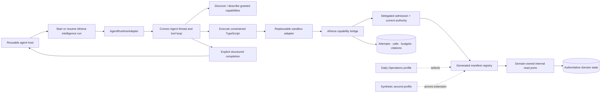
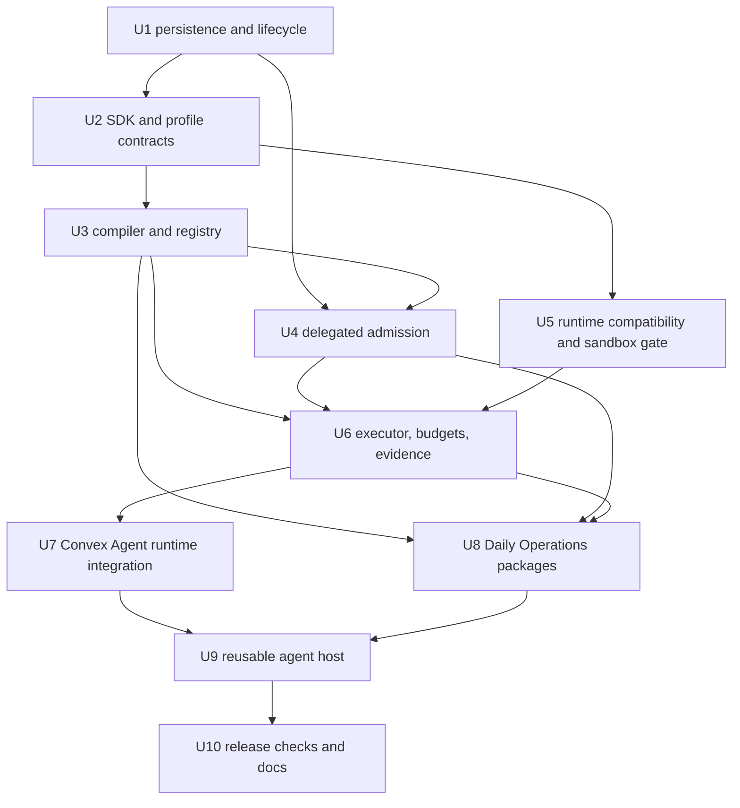

# feat: Establish Athena's agent harness foundation

## Summary

Build a read-only, domain-neutral agent harness on top of Athena's existing admission, intelligence, evidence, and domain-read rails. Convex Agent is the only first-release conversational runtime and owns threads, model turns, and the tool loop through an Athena-owned `AgentRuntimeAdapter`; Athena owns delegated authority, authorized history, semantic capability publication, constrained TypeScript execution, budgets, citations, durable run evidence, and all business truth. Daily Operations is the first product profile, implemented as an adapter that selects reusable capability packages rather than as logic in the harness kernel. A synthetic second profile and runtime contract fake prove that later surfaces—and a future runtime implementation if ever justified—can reuse the same Athena contracts without changing the kernel.

The first release lets an authorized operator ask open-ended questions across the full Daily Operations surface—not only “what needs attention”—and receive a source-linked answer that is explicit about freshness, truncation, and unavailable data. It does not mutate state.

## Problem Frame

Athena is structurally close to agent-capable: public ingress is governed by operation admission; intelligence runs already model captured context, provider work, artifacts, and source references; automation and workflow traces preserve deterministic execution evidence; and domain commands already own preconditions and approvals. What is missing is the governed composition layer between a model and those authoritative primitives.

Hand-authoring one model tool per question would couple the agent to screens, duplicate policy, consume context, and prevent useful cross-domain composition. Direct Convex/database access would bypass Athena's semantics and authority. The foundation therefore publishes semantic, domain-owned read packages into a generated Athena SDK, grants a task-specific intersection of those packages, and lets the model submit bounded TypeScript to one mediated execution tool.

## Requirements Traceability

This plan carries every actor, flow, requirement, acceptance example, success criterion, boundary, decision, and deferred item from the [origin requirements](../brainstorms/2026-08-21-athena-agent-harness-foundation-requirements.md).

| Origin requirement | Plan response |
|---|---|
| R1–R4, R21: authority, provider, read-only, reusable runtime foundation | U1 establishes Athena-owned run state; U2 defines the runtime contract; U5 validates the sole first-release Convex Agent adapter; U7 integrates it without moving business truth; U8 makes Daily Operations a profile adapter. |
| R5–R11: composable semantic SDK and governed publication | U2 defines package/profile contracts; U3 compiles and publishes immutable registries with progressive discovery. |
| R12–R18: grants, execution, budgets, results, conformance, evidence | U4 implements delegated admission; U6 implements the executor, budget rail, citations, and call evidence; U10 closes adversarial and conformance coverage. |
| R19: full Daily Operations surface | U8 publishes the semantic package matrix; U9 hosts the reusable experience on Daily Operations. |
| R20: future commands remain separate | The command rail is explicitly deferred; U2 reserves a distinct namespace without making it executable. |

### Acceptance-example mapping

- AE1 and AE9: U2, U8, and U10 prove multi-package composition and a second profile without kernel changes.
- AE2 and AE3: U3 and U4 prove progressive disclosure and per-operator fail-closed grants.
- AE4 and AE5: U5 and U6 prove resource limits, honest partial results, and sandbox rejection.
- AE6 and AE7: U3, U6, and U10 prove evidence lineage and publication conformance.
- AE8: deferred command execution remains behind existing Athena proposal, approval, precondition, and domain-command rails.

## Scope

### In scope

- Convex Agent threads and read-only orchestration behind an Athena-owned runtime adapter.
- Browser-neutral capability/profile contracts plus an Athena-owned agent-runtime contract with a Convex Agent v1 implementation.
- Domain-owned semantic read capability manifests and agent profiles.
- Generated declarations, validators, discovery metadata, conformance fixtures, and immutable registry digests.
- Delegated agent identity and grant evaluation on every capability call.
- One constrained, import-free TypeScript execution tool with bounded async reads and local transforms.
- Run, attempt, call, budget, citation, scratch, and completion evidence under Athena's intelligence ledger.
- A full Daily Operations profile assembled from reusable product-domain packages.
- A reusable agent host UI mounted on Daily Operations.
- A synthetic second adapter/profile proving the extension seam.

### Out of scope

- Mutations, schedules, credentials, arbitrary network access, filesystem access, imports, ambient clock/randomness, raw Convex APIs, tables, document IDs, or server function registries.
- Replacing deterministic automation, approvals, operational events, workflow traces, or domain commands.
- RAG, general long-term memory, background autonomy, self-modification, subagent product behavior, shell access, or a persistent interpreter.
- Making Convex Workflow or Workpool a prerequisite. Add them later only if durable orchestration or deployment-wide shaping is demonstrated.
- Additional product surfaces beyond the synthetic extension proof.
- Alternate production agent runtimes or an agent-SDK bake-off; the contract fake is the only non-Convex runtime implementation in v1.
- Unrelated cleanup of Daily Operations or intelligence code.

## Existing Foundations and Seams

- `packages/athena-webapp/convex/platform/operationAdmission.ts` and `packages/athena-webapp/convex/operationAdmission/**` are the only authorization/admission rail; the harness must extend, not bypass, them.
- `packages/athena-webapp/convex/platform/readIntentCatalog.ts` provides the closed read-intent vocabulary that capability bindings should reference.
- `packages/athena-webapp/convex/intelligence/**` and `packages/athena-webapp/convex/schemas/intelligence.ts` remain the business parent for runs, artifacts, providers, and source evidence.
- `packages/athena-webapp/convex/automation/**`, operational events, and workflow traces remain separate authority/evidence lanes.
- `packages/athena-webapp/convex/intelligence/providers/tanstack.ts` remains the one-shot structured-generation adapter; the agent model registry is additive.
- `packages/athena-webapp/convex/operations/dailyOperations.ts` and `packages/athena-webapp/src/components/operations/DailyOperationsView.tsx` contain the first surface, but their UI-shaped methods are not the SDK contract.
- `scripts/pre-commit-generated-artifacts.ts` is the pattern for checked-in generated artifact drift checks.

## Key Technical Decisions

### 1. One harness kernel, many profiles and packages

The kernel knows only manifests, grants, attempts, capability invocations, budgets, evidence, and completion. Product packages own semantic resources. A profile selects packages, lifecycle stages, scope policy, prompt/context policy, budgets, presentation schema, and evaluation scenarios. `daily_operations` is the first real profile; it does not introduce conditionals or imports into the kernel.

### 2. Athena intelligence remains the durable parent

Keep `intelligenceRun` as the operator-visible business run and add child records for the immutable run grant/profile/digest, program attempts, capability invocations, budget accounting, citation/source binding, and bounded scratch metadata. Do not overload `intelligenceProviderInvocation`; provider calls and capability calls answer different audit questions.

### 3. Delegation is not identity substitution

An agent run records the initiating operator and a derived `agent_delegation` grant. Every bridge call validates the pinned manifest eligibility plus current membership/role/store scope, the live shrink-only revocation/disable overlay, run policy, and registry binding. The effective authority is their intersection. The executor calls domain-owned internal read ports and never re-enters public `api.*` functions as a server-side pseudo-user.

### 4. Manifests are domain-owned; the registry is generated

Each product domain colocates full manifests with its authoritative read code. A build-time compiler validates capability identity, operation-admission binding, semantic schema, sensitivity, field omission, evidence, freshness, completeness, cost, examples, and lifecycle. It emits one privileged checked-in registry/runtime schema, read-port dispatch binding, immutable compatibility digest, and old/new comparison metadata; those full artifacts are never model-visible. The compatibility digest covers manifests plus explicit harness protocol, admission-policy, generated-binding, and registered read-port implementation version tokens. Behavioral read-port changes require a version bump. At run start, Athena projects a grant-specific declaration/facade whose types omit unauthorized resources, projections, and fields. Publication is atomic; collisions, invalid bindings, or conformance failure prevent a capability from being enabled. A run pins the current compatibility epoch and digest, while a live kill switch may only shrink access. V1 avoids a drain protocol: immediately before an incompatible deploy, one atomic mutation disables the profile and advances the durable epoch. Every tool dispatch, result release, and completion compares the run epoch with the current epoch, so late old-version work is denied; a bounded repair pass terminally marks old-epoch runs canceled without delaying deployment. Fence failure aborts the deploy. After deploy, automated smoke invokes the harness contracts directly while the profile remains disabled; it does not create an operator/profile turn. Passing smoke enables the new epoch broadly through the same switch, and the first real turns are monitored. Audit metadata retains the old digest and epoch.

### 5. The TypeScript protocol is stable; the sandbox is replaceable

The agent sees a generated `athena.<package>.<resource>` facade and one execution tool. Programs are import-free, deterministic, asynchronous, and stateless; they can branch, iterate, transform, and use bounded concurrency. They cannot access host context, Convex context, network, filesystem, dynamic evaluation, timers, clock, randomness, credentials, or commands. Athena-owned validation and enforcement sit outside the sandbox adapter.

`@ai-sdk/code-mode` is the leading first spike because its QuickJS boundary supplies async host tools and explicit memory/time/source/result/tool-call/in-flight limits. It remains experimental, exposes `tools.*`, and strips rather than type-checks TypeScript, so U5 must prove it behind an Athena adapter and retain direct QuickJS or an external microVM as a contingency. `node:vm` is rejected as a security boundary.

### 6. Explicit run/attempt/call state machines

- Run: `queued → context_captured → running → completed | failed | canceled`.
- Program attempt: `submitted → validating → executing → result_produced | rejected | failed | canceled`.
- Capability call: `requested → admitted → executing → succeeded | partial | unavailable | denied | failed | canceled`.

Terminal transitions are monotonic. A successful attempt produces exactly one `programResult`; it does not complete the run. After one or more attempts, the Convex Agent runtime adapter invokes `completeRun` once with the successful attempt IDs whose results support the final response. Completion citations may come only from that explicit allowed set within the active turn. Compile/validation failures create diagnostic attempts but consume no read budget. Hard budgets apply across the run with attributable per-attempt caps, so retries cannot reset authority or spend.

### 7. Honest results and citations are protocol obligations

Every capability read returns a common envelope containing sanitized data, observed/captured time, freshness classification, pagination, per-source completeness, warnings, and opaque source references. Unauthorized fields are absent, never replaced with sentinel zeroes. Citations are minted only from data actually returned, bound to run/attempt/call/result hash, and accepted by `completeRun` only from the explicit successful-attempt set for the active turn. Evidence lookup reauthorizes the viewer and resolves internal lineage without exposing raw identifiers.

### 8. Convex Agent orchestrates through a narrow Athena runtime adapter

Convex Agent owns runtime thread/message mechanics, model turns, internal streaming, and tool-loop progression, but only its `agentRuntime/` adapter directory may import component APIs or expose their native identifiers. That directory contains the `ConvexAgentRuntimeAdapter`, adapter-specific tests, and a registration-only composition shim; root `convex.config.ts` imports only the local shim. The Athena-owned `AgentRuntimeAdapter` uses opaque runtime references and normalized lifecycle, tool-call, usage, cancellation, completion, projection, and cleanup events. Its bidirectional tool contract carries Athena-owned tool IDs, descriptions, input validators, normalized call and turn identity, idempotency keys, and typed handler outcomes; the adapter converts only at the runtime edge and never owns capability or executor semantics. Capability packages, grants, the executor, evidence, completion, and the reusable host depend only on that contract. Convex Agent's `userId` is correlation metadata, not authorization. Before every turn, Athena reauthorizes prior terminal artifacts and constructs a minimized history projection that omits/redacts content beyond current operator/store/profile authority or retention. Raw runtime history is never replayed by default. If Convex Agent cannot operate over an explicitly projected history or satisfy the adapter's persistence/egress contract safely, that is a non-completion outcome requiring requirements/plan amendment; v1 does not add or compare another agent SDK. The model receives only fixed discovery, describe, execute-program, scratch, and completion tools; individual backend reads do not become model tools. A mutation records user intent and schedules an internal action, allowing the UI to reactively follow the same Athena run/runtime-thread binding. TanStack AI and the Convex Agent model path remain separate provider adapters normalized into Athena evidence.

### 9. Daily Operations is semantic, not screen-shaped

The first profile composes packages for store-day lifecycle, sales/pulse/week metrics, payments/top items, operational work/approvals/queue, registers/cash, activity/timeline, automation evidence, and inventory/stock. Packages preserve the existing performance split and frozen-versus-live authority while returning consistent freshness/completeness. They do not mirror component query names.

### 10. Thread, turn, run, and artifact cardinality is explicit

One opaque runtime thread contains many user turns. Each user turn creates exactly one Athena `intelligenceRun`; an active turn may resume that run, but a later prompt on the same runtime thread creates a new run. One run owns one immutable, long-lived context-metadata snapshot—initiating identity, projected grant, profile version, registry digest, runtime-adapter version, budget policy, and a hash/reference to a separately stored short-lived prompt payload—plus many provider invocations, program attempts, capability calls, and source references, and exactly one terminal output artifact. Dynamic read evidence is appended as child records and never rewrites the context metadata or a terminal artifact. Expiring the prompt payload after 30 days leaves the 365-day audit metadata and its hash intact without mutating the snapshot.

Cross-runtime setup and completion are not atomic. A durable turn binding advances idempotently through `intent_recorded → runtime_thread_bound → runtime_input_saved → scheduled → running → completion_prepared → athena_committed → runtime_projected`. Each transition records only an opaque runtime reference, adapter version, and idempotency key before the next step. `completion_prepared` remains private; one Athena transaction reauthorizes and commits evidence, terminal artifact, run state, and `operator_release_committed` (authorized/query-visible, not proof of browser receipt); only afterward does an outbox ask the adapter to project the committed authorized artifact into runtime history. Every UI/history query reauthorizes before returning it. An optional `operatorViewedAt` acknowledgment records actual authorized fetch separately; absent that acknowledgment, the system never claims browser delivery. Missing runtime thread/input, scheduling/projection failure, duplicate submission, orphan runtime state, and queued-without-work are repaired by resume-on-read plus a bounded sweeper; repair may retry an incomplete transition but never duplicate a prompt/artifact or reopen a terminal run. Future model history is constructed from reauthorized Athena artifacts, so runtime projection failure cannot become business truth.

### 11. Hard budgets reserve before work and settle afterward

Concurrent calls cannot merely charge after returning. Admission transactionally reserves the declared worst-case call, row, byte, and cost units against run-wide counters using the invocation idempotency key; execution then settles actual usage and applies a bounded refund. Denied calls consume call-attempt budget but no row/byte/provider budget; unavailable/upstream-failed calls consume the call and elapsed-time budget, then refund unused row/byte allocation; timeout or cancellation settles conservatively when actual usage is unknown. No retry or attempt receives a new run budget.

### 12. Cross-run admission, provider egress, and data governance are first-class policy

Run creation transactionally enforces simple per-operator active-run and provider-spend ceilings before creating Agent/provider work. Overload returns a typed retryable denial without partial thread creation; one profile kill switch blocks new turns and cancels active ones.

Every prompt, context field, capability result field, summary, and artifact carries an egress class. The profile allowlists provider/model/region combinations for those classes; no automatic failover may cross to a less-trusted provider. Server-only, environment-specific least-privilege provider credentials are startup-validated, redacted, rotated/revoked by named operational ownership, and never enter Agent messages, sandbox inputs, or evidence payloads. Provider invocation evidence records model, region, policy class, retention mode, and redaction—not secrets. Enabled providers require approved residency, retention, and no-training terms.

Egress classification is conservative under arbitrary program transforms: an attempt, its `programResult`, and every derived summary inherit the maximum egress class of every capability input read, even if values are renamed, aggregated, filtered, joined, or inferred. Any future declassification requires a registered deterministic reducer with its own tests; model-authored code cannot declassify. Before every turn, Athena reauthorizes/minimizes historical artifacts and selects a provider authorized for the maximum egress class across the current prompt/context, projected history, and every capability reachable through the projected grant. If none exists, admission rejects before runtime/provider work or offers a profile-defined narrower grant/history that the operator explicitly accepts. V1 never switches provider mid-turn. Immediately before a `programResult` is attached to a provider-visible tool response, Athena revalidates the authorization epoch and records an irreversible `provider_egress_committed` boundary. Revocation before that boundary withholds the result. Revocation after it cannot recall provider exposure: Athena cancels the turn, suppresses operator release and citation minting, asks the adapter to delete eligible runtime payloads, and records the prior egress truthfully for investigation. V1 buffers the model-authored narrative server-side; only non-sensitive server-authored progress milestones stream to the browser. `completeRun` prepares privately, then one Athena transaction reauthorizes citations, promotes evidence, commits the terminal artifact/run, and records `operator_release_committed`, making the answer eligible for reauthorized query. A separate idempotent outbox projects the committed artifact through the runtime adapter. Revocation after commit but before an authorized fetch still suppresses the answer; only a recorded `operatorViewedAt` means prior browser receipt cannot be recalled.

Treat all retrieved domain text as untrusted data, not instructions. Prompt assembly separates policy/instructions from labeled data; retrieved strings cannot change grants, tool policy, output schema, or citation rules, and are output-encoded for their destination. Reuse Athena's existing retention classes and bounded cleanup patterns: prompts/messages, bounded scratch, provisional program source/AST, and complete bounded sanitized citation-candidate call outputs are `short_lived` and expire after 30 days. On `completeRun`, only finally cited attempts promote their exact validated source/AST, structured `programResult`, normalized call arguments/metadata, result hashes, source/version references, and manifest-extracted minimal claim-support slices into the existing intelligence/`standard` class with a 365-day ceiling; complete call outputs do not promote by default. A manifest evidence extractor must be deterministic and conformance-tested; where none can substantiate an arbitrary transform, the citation becomes explicitly `provenance_only` after its short-lived replay payload expires. A profile may opt into longer complete-output retention only through a separately approved evidence mode with tighter authorization and retention, not the default harness path. Existing store/organization deletion flows gain narrow agent-record/component-mapping cleanup hooks so exposed content is not orphaned. Existing platform backup and tenant-lifecycle policy continues to apply; this plan does not create a new legal-hold, backup, export, or generic compliance framework.

## High-Level Design

> Directional architecture for review, not implementation specification.

## Implementation Units

### U1. Establish durable harness state and lifecycle

**Requirements:** R1, R15, R18; F1–F2; AE6.

**Dependencies:** None.

**Files (create):**

- `packages/athena-webapp/shared/agentHarness/execution.ts`
- `packages/athena-webapp/convex/schemas/agentHarness.ts`
- `packages/athena-webapp/convex/agentHarness/lifecycle.ts`
- `packages/athena-webapp/convex/agentHarness/turnBindings.ts`
- `packages/athena-webapp/convex/agentHarness/retention.ts`
- `packages/athena-webapp/convex/agentHarness/lifecycle.test.ts`
- `packages/athena-webapp/convex/agentHarness/turnBindings.test.ts`
- `packages/athena-webapp/convex/agentHarness/retention.test.ts`

**Files (modify):**

- `packages/athena-webapp/convex/schema.ts`
- `packages/athena-webapp/convex/schemas/intelligence.ts`
- `packages/athena-webapp/convex/intelligence/runs.ts`
- `packages/athena-webapp/convex/crons.ts`
- `packages/athena-webapp/convex/inventory/stores.ts`
- `packages/athena-webapp/convex/inventory/organizations.ts`

**Approach:** Extend the existing intelligence aggregate with child tables for turn bindings, short-lived prompt/content payloads, run grants, program attempts, capability calls, budget counters/reservations, citation bindings, short-lived bounded replay payloads, long-lived minimal claim-support slices, and bounded scratch descriptors. Enforce one opaque runtime thread to many turns/runs, one turn to one run, one immutable context-metadata snapshot and terminal artifact per run, and many attempts/calls per run. Persist adapter kind/version, compatibility epoch/digest, and opaque runtime references without making runtime-native IDs or records authoritative. The context snapshot stores only the prompt payload hash/reference, allowing prompt expiry without rewriting audit metadata. Define monotonic run/turn/attempt/call transitions, idempotent terminalization, stale-run recovery, resume-on-read repair, retention-class metadata, evidence-access audit, and the `reconstructible | provenance_only | evidence_expired | evidence_deleted_by_lifecycle` evidence states. Extend Athena's existing cursor-bounded cleanup and store/organization removal patterns for agent rows rather than creating a generic retention/export system; register the short-lived cleanup in `convex/crons.ts`, and make runtime cleanup a retryable adapter hook keyed by the binding. Keep provider invocations separate. Index every child by run and the minimal investigation keys; avoid unbounded embedded arrays on the parent.

**Test scenarios:**

1. Legal transitions succeed once; repeated terminal transitions are idempotent.
2. Illegal regression from any terminal state is rejected.
3. Cancellation races with completion without producing two terminal outcomes.
4. A stale executing attempt is recovered without reopening the run budget.
5. Child evidence is tenant/store/run isolated and queryable without scanning.
6. Duplicate submission and failures after thread creation, message save, or scheduling resume the same binding without duplicating a prompt, run, or job.
7. A later prompt on an existing thread creates a new run; reloading an active turn resumes its existing run; terminal runs and artifacts never reopen.
8. Prompt/content expiry deletes the short-lived payload while preserving immutable audit metadata/hash; existing store/organization deletion hooks remove scoped agent content and evidence access is audited.
9. The bounded retention batch resumes after partial failure and respects batch limits; runtime-adapter cleanup failures retry without re-deleting Athena rows.
10. A compatibility-epoch advance immediately fences old-epoch runs even before their terminal status repair completes.

### U2. Define the Athena capability SDK, agent-runtime, package, and profile contracts

**Requirements:** R1, R4–R9, R13, R16–R17, R21; F2–F3; AE1, AE2, AE9, AE10.

**Dependencies:** U1.

**Files (create):**

- `packages/athena-webapp/shared/agentHarness/values.ts`
- `packages/athena-webapp/shared/agentHarness/results.ts`
- `packages/athena-webapp/shared/agentHarness/manifest.ts`
- `packages/athena-webapp/shared/agentHarness/profile.ts`
- `packages/athena-webapp/shared/agentHarness/bridge.ts`
- `packages/athena-webapp/shared/agentHarness/readPort.ts`
- `packages/athena-webapp/shared/agentHarness/agentRuntime.ts`
- `packages/athena-webapp/shared/agentHarness/contracts.test.ts`
- `packages/athena-webapp/shared/agentHarness/agentRuntime.contract.test.ts`
- `packages/athena-webapp/convex/agentHarness/registry.ts`
- `packages/athena-webapp/convex/agentHarness/profiles/syntheticSecondSurface.ts`
- `packages/athena-webapp/convex/agentHarness/profileConformance.test.ts`

**Approach:** Define canonical values, opaque refs, standard read verbs, typed filters/projections, collection bounds, the uniform result envelope, full domain manifest, immutable capability IDs, lifecycle states, the `AgentReadPortDefinition`/explicit registration-index contract, and the profile adapter contract. Define a separate `AgentRuntimeAdapter` contract for opaque thread/input/turn references; normalized lifecycle/progress/tool/usage/completion events; projected-history input; cancellation; completion projection; retention cleanup; and bidirectional tool dispatch. Runtime-neutral tool definitions carry Athena-owned IDs, descriptions, input schemas/validators, and result envelopes; invocations carry normalized call IDs, opaque turn references, canonical validated arguments, and idempotency keys bound to an immutable fingerprint of adapter version, turn, tool, arguments hash, and call identity. Exact replay returns the recorded outcome; any fingerprint mismatch is a typed protocol violation that invokes no handler and returns no prior result. Athena handlers return success, typed failure, denial, or cancellation. Normalized usage carries provider-invocation identity, sequence/idempotency, token categories, retry attribution, and one immutable delta-or-cumulative mode per provider-invocation/retry stream. Delta events deduplicate and sum; cumulative events reconcile monotonically. A terminal total or conservative timeout/cancel estimate settles charging once; late usage is evidence-only and cannot lower settled spend. Athena owns cost calculation. The contract never exposes a native component client, provider message/tool/usage type, session object, or runtime database record, and the adapter never owns capability discovery, admission, executor, or spend-policy semantics. A deterministic contract fake proves kernel behavior without implementing another production runtime. Reserve a separate future command namespace but do not implement it. Make the synthetic profile deliberately non-isomorphic to Daily Operations while staying within v1: organization-scoped rather than store-scoped, a different context/thread key, a different package mix, a single-snapshot `get` plus cursor `list`, different presentation metadata, and different source destinations. This proves only that additions expressible within the v1 contracts require no kernel edits; genuinely new runtime events, scope/verb/lifecycle primitives, or persistence semantics require a versioned contract evolution and migration plan.

**Test scenarios:**

1. Two authorized packages compose into one collision-free SDK view.
2. Namespace collisions, raw IDs, unsupported verbs, missing bounds, or incomplete metadata fail validation.
3. Unknown/unavailable/stale/partial/unauthorized have distinct typed semantics; unauthorized fields are structurally absent.
4. The synthetic second profile passes manifest, read-port-index, profile-selection, and import-boundary contract conformance with no kernel dependency on either profile; U10 owns its end-to-end proof.
5. A core import-boundary test rejects Daily Operations or other product-domain imports under `convex/agentHarness` kernel modules.
6. The non-isomorphic synthetic profile passes the v1 contract with organization scope, different context/thread/presentation behavior, and mixed `get`/`list`; an unsupported primitive fails with a versioned-extension error rather than encouraging a kernel special case.
7. The runtime contract fake drives start/resume/cancel, normalized progress, bidirectional tool dispatch, tool-loop completion, usage, projection, and cleanup without importing Convex Agent or runtime-native types.
8. Static import-boundary coverage permits Convex Agent/component imports only within the U5 `agentRuntime/` adapter directory (implementation, registration shim, and adapter-specific tests), requires root `convex.config.ts` to import only the local registration shim, and rejects runtime-native identifiers in capability, admission, executor, evidence, completion, and presentation contracts.
9. The fake contract suite covers invalid arguments, exact replay, same-key/different-tool, same-key/different-arguments, reused call ID across turns, parallel calls, out-of-order results, handler failure, cancellation during execution, and late results after terminalization.
10. Usage parity covers duplicate, delta, cumulative, mode-change rejection, out-of-order, retried-provider, canceled, missing-final, and late events; charging settles once to an attributable conservative Athena total, and late events are evidence-only and cannot reduce it.

### U3. Compile manifests into an immutable, progressively discoverable registry

**Requirements:** R9–R11, R17; F3; AE2, AE7.

**Dependencies:** U2.

**Files (create):**

- `scripts/agent-sdk-generate.ts`
- `scripts/agent-sdk-generate.test.ts`
- `scripts/agent-sdk-check.ts`
- `packages/athena-webapp/convex/agentHarness/_generated/registry.ts`
- `packages/athena-webapp/convex/agentHarness/_generated/schemas.ts`
- `packages/athena-webapp/convex/agentHarness/discovery.ts`
- `packages/athena-webapp/convex/agentHarness/discovery.test.ts`

**Files (modify):**

- `scripts/pre-commit-generated-artifacts.ts`
- `package.json`
- `packages/athena-webapp/package.json`

**Approach:** Discover domain manifests from explicit registration points and validate the explicit agent-capability binding index: every published capability maps to one admitted read intent and registered internal port, and every entry in that agent-only index maps back to a manifest; unrelated admitted operations are not orphans. Generate one privileged registry/runtime schema, read-port dispatch binding, compact catalog summaries, grant-projection machinery, and compatibility digest. Digest inputs include versioned harness protocol, `AgentRuntimeAdapter` protocol and selected adapter version, admission policy, generated bindings, and each registered read-port implementation token. The privileged registry is never sent to the model. Default model context exposes compact grant-filtered summaries only; detailed declarations and the `athena.*` facade are projected per run and omit unauthorized packages, operations, projections, examples, and fields. Add the reusable conformance harness here and make it a blocker for enabling a capability. V1 lifecycle is intentionally small: unpublished, enabled, or disabled, with a live shrink-only kill switch. Generated drift joins the existing artifact check and merge gate; U7 invalidates incompatible active runs on deployment rather than introducing a separate drain protocol.

**Test scenarios:**

1. Identical manifests produce byte-stable output and digest.
2. Namespace collisions, schema drift, missing admitted operation bindings, and orphan bindings fail atomically.
3. Discovery, describe output, accepted projection schemas, and the model-visible facade omit unauthorized packages, fields, projections, and examples; the privileged full registry is unreachable from the model/runtime bridge.
4. Detailed declarations appear only after authorized describe calls.
5. Enabled schema semantics remain pinned for an active run; disabling a capability or profile denies even under a pinned digest.
6. A capability cannot be enabled until generated schema, scope, omission, pagination, freshness, evidence, determinism, and budget conformance passes.
7. A changed compatibility digest causes U7 to terminally invalidate nonterminal runs pinned to the old digest; a retry creates a fresh run.
8. A behavioral read-port/harness/admission change with an unchanged manifest still changes compatibility identity or fails the required implementation-version check and requires the U7 pre-deploy epoch fence.
9. A manifest evidence extractor is deterministic, field-minimizing, authorization-preserving, hash-bound, and sufficient for its declared claim shapes; unsupported arbitrary transforms downgrade to provenance-only after replay payload expiry.

### U4. Add delegated agent admission and domain-owned internal read ports

**Requirements:** R3, R6, R12, R17; F1–F3; AE3, AE7.

**Dependencies:** U1, U3.

**Files (create):**

- `packages/athena-webapp/convex/agentHarness/grants.ts`
- `packages/athena-webapp/convex/agentHarness/delegatedAdmission.ts`
- `packages/athena-webapp/convex/agentHarness/readPorts.ts`
- `packages/athena-webapp/convex/agentHarness/delegatedAdmission.test.ts`

**Files (modify):**

- `packages/athena-webapp/convex/operationAdmission/types.ts`
- `packages/athena-webapp/convex/platform/operationAdmission.ts`
- `packages/athena-webapp/convex/platform/readIntentCatalog.ts`

**Approach:** Implement the U2 `AgentReadPortDefinition` contract and compiled registration index at the operation-admission composition root rather than forcing internal action-originated reads through public ingress wrappers or widening every existing public actor definition. Each port binds one capability ID and internal-query reference to existing read intent(s), a scope resolver, field policy, declared worst-case cost, and evidence/completeness rules. Extract and reuse the existing normal-user/shared-demo policy ports, preserving their fail-closed outcomes. At run start, record delegated-agent provenance, materialize the grant intersection, pin profile/registry identities, and generate the model-visible facade. At every capability call, validate operator membership and scope plus the live shrink-only revocation/disable overlay before dispatch and again at result release, citation minting, and run completion. Bind reservations/results to the observed authorization epoch; a result invalidated by later shrink is evidence-only and never model-visible. The coverage invariant applies only to the explicit agent read-port index: every grantable manifest maps to one port and every indexed port maps back to a manifest. Ordinary public reads need not be agent-exposed. Ban `api.*`, raw database handles, and unregistered internal functions from the bridge.

**Test scenarios:**

1. Same program under different operators returns only each operator's authorized records and fields.
2. Revoked membership, narrowed store scope, disabled capability, or canceled run denies the next call immediately.
3. Program text, requested projection, opaque refs, and concurrent calls cannot widen a grant.
4. The bridge rejects public API re-entry and any unregistered internal target.
5. Domain admission failure is typed, recorded once, and never falls through to a weaker actor.
6. Adding the delegated seam does not change actor coverage or admission behavior for existing public ingress definitions.
7. Revocation between dispatch and result release prevents the result, citations, summaries, and completion from reaching the sandbox/model while preserving only redacted investigation evidence.

### U5. Implement the Convex Agent adapter and select the program sandbox

**Requirements:** R1–R3, R13–R15, R21; AE5, AE10.

**Dependencies:** U2.

**Files (create):**

- `packages/athena-webapp/convex/agentHarness/agentRuntime/convexAgent.ts`
- `packages/athena-webapp/convex/agentHarness/agentRuntime/convexAgent.config.ts`
- `packages/athena-webapp/convex/agentHarness/agentRuntime/convexAgent.contract.test.ts`
- `packages/athena-webapp/convex/agentHarness/agentRuntime/convexAgentPersistence.test.ts`
- `packages/athena-webapp/convex/agentHarness/programRuntime/types.ts`
- `packages/athena-webapp/convex/agentHarness/programRuntime/codeMode.ts`
- `packages/athena-webapp/convex/agentHarness/programRuntime/runtimeSpike.test.ts`
- `packages/athena-webapp/docs/agent/agent-harness-runtime.md`
- `packages/athena-webapp/convex.json`

**Files (modify):**

- `packages/athena-webapp/package.json`
- `bun.lockb`
- `packages/athena-webapp/convex/convex.config.ts`

**Approach:** Set Convex Node actions to Node 22; add and exact-pin `@convex-dev/agent`, its AI SDK/provider dependencies, and the selected program-sandbox version in `package.json`/`bun.lockb`; resolve the direct Zod peer constraint without casually migrating unrelated application schemas. Register the Agent component through `agentRuntime/convexAgent.config.ts`; root `convex.config.ts` imports only that local registration shim. Confine every package-native component import and native thread/message/session/tool type to the `agentRuntime/` adapter directory. Implement the U2 runtime contract by translating projected history, opaque references, lifecycle/progress/tool/usage events, cancellation, completion projection, cleanup, and Athena-owned tool definitions/handler outcomes at that boundary. The adapter converts the fixed Athena tool catalog to runtime-native tool objects and routes normalized invocations to Athena handlers without learning capability discovery, admission, or executor semantics. Do not compare or implement OpenAI Agents SDK, Claude Agent SDK, Deep Agents, or another production runtime in v1. Inspect actual Convex Agent component persistence and provider requests across success, retry, cancellation, and failure; only explicitly permitted prompt content, summaries, opaque bindings, and hashes may remain, never full intermediate capability bodies. Run the same focused runtime contract suite against the deterministic fake and Convex implementation. Document the exact-version upgrade and rollback path without creating a separate promotion process. If Convex Agent cannot accept Athena-projected history or otherwise satisfy R1/R21 safely, stop for a requirements amendment rather than leaking component semantics into the kernel. Separately spike `@ai-sdk/code-mode` behind the program-runtime interface, prepend the generated `athena.*` facade, and layer Athena-owned static TypeScript/AST validation and explicit-output rules around it. Choose between code-mode and direct QuickJS based on deployability, isolation, async bridge support, cancellation, limits, and maintenance; keep external microVM as a later fallback and never use `node:vm`. Initial safety ceilings are 60 seconds per turn, 3 program attempts, 24 capability calls, 4 in flight, 5,000 returned rows, 2 MiB sanitized bridge/evidence data per run, 240 KiB encoded sanitized output per capability call including evidence-record metadata headroom, 32 KiB program source, 256 KiB program result, 64 MiB sandbox heap, and a provider token/cost ceiling. A call that would cross 240 KiB must stop at its declared page/collection boundary and return typed truncation before persistence—v1 does not chunk call evidence. These are safety limits, not release benchmarks; tune them from observed use. Do not proceed to U6 until the adapter and sandbox smoke suites pass.

**Test scenarios:**

1. A deployed Node 22 Convex action can run a Convex Agent turn through the adapter and an Agent tool through the sandbox bridge without exposing component types outside the adapter.
2. Multi-package async calls and bounded `Promise.all` work through `athena.*`.
3. Imports, host globals, network, filesystem, eval, timers, clock, randomness, mutation handles, and prototype escape attempts fail before domain reads.
4. Source, time, memory, output, tool-call, and in-flight limits terminate cleanly and record a diagnostic attempt.
5. Type-invalid programs and missing/multiple explicit outputs are rejected by Athena validation despite sandbox type stripping.
6. Cancellation terminates work and late bridge results cannot revive the attempt.
7. Benchmarks record p50/p95 first-progress and completion latency, sandbox startup, model turns, attempts, calls, concurrency, rows, bytes, heap, and provider tokens/cost; the initial release gate and hard ceilings pass.
8. Actual component persistence and provider requests contain only allowlisted content across success/retry/cancel/stream/failure; the adapter can supply Athena-projected history without automatic raw-component replay; exact-version upgrades fail the contract suite until schema migration and rollback evidence is supplied.
9. Encoded sanitized call output, multibyte text, validators/index fields, and evidence metadata remain within the 240 KiB persisted-record ceiling; exact-boundary overflow returns typed truncation before a write.
10. The deterministic fake and Convex Agent adapter produce the same normalized start/resume/cancel/progress/tool/usage/completion/projection/cleanup event semantics. The shared suite also proves invalid arguments, duplicate/parallel calls, out-of-order results, handler failure, in-flight cancellation, and late-result suppression. A static check permits package-native imports only in the `agentRuntime/` implementation, registration shim, and adapter-specific tests; root `convex.config.ts` imports only the local shim.

### U6. Implement the program executor, budgets, evidence, and citations

**Requirements:** R13–R18; F1–F2; AE4–AE6.

**Dependencies:** U1, U3, U4, U5.

**Files (create):**

- `packages/athena-webapp/convex/agentHarness/executor.ts`
- `packages/athena-webapp/convex/agentHarness/budgets.ts`
- `packages/athena-webapp/convex/agentHarness/evidence.ts`
- `packages/athena-webapp/convex/agentHarness/citations.ts`
- `packages/athena-webapp/convex/agentHarness/executor.test.ts`
- `packages/athena-webapp/convex/agentHarness/evidence.test.ts`

**Approach:** Validate source, create an attempt, run the selected adapter, and expose one async bridge that schedules admitted reads under run-wide and per-attempt budgets. Before dispatch, transactionally reserve the registered worst-case call/row/byte/cost units against the run-wide counter using the invocation idempotency key; on completion, settle actual usage and refund only known-unused capacity. Deduplicate identical reads only inside an attempt. Normalize every invocation, hash sanitized results, propagate the maximum input egress class through all transforms, mint opaque citations, derive aggregate completeness, and require exactly one structured `programResult`. Immediately before provider-visible return, revalidate the authorization epoch and record `provider_egress_committed`; a later revocation cancels/suppresses but is recorded as prior exposure. Producing the result terminalizes only the attempt, not the run. V1 does not claim general field-level taint: at attempt completion, persist the complete bounded sanitized output of each citation-candidate call plus source versions and the exact validated program source/AST under the 30-day short-lived class; every call record must fit the 240 KiB encoded ceiling including metadata, and larger logical results truncate at the declared resource boundary before persistence. An immutable authoritative revision reference may replace a copied call output. `completeRun` promotes the exact validated source/AST and `programResult` of finally cited attempts plus normalized calls, hashes, source/version refs, and only deterministic manifest-extracted minimal claim-support slices. Complete call outputs do not promote by default. During the replay window, investigators can replay arbitrary branch/join/aggregate code against the complete short-lived inputs. After replay payload expiry, a citation with an immutable revision or sufficient extracted slice remains `reconstructible`; otherwise it is honestly `provenance_only`. Lifecycle deletion and TTL remain distinct terminal evidence states. The total stays inside the 2 MiB run bridge/evidence ceiling. Expected partial/unavailable results remain program-visible; policy, validation, sandbox, and interpreter failures abort.

**Test scenarios:**

1. Retries and new attempts share the original hard run budget and cannot reset spend.
2. Concurrent reads respect global/package/operation limits and do not double-charge deduplicated calls.
3. Collection truncation and mixed source freshness downgrade completion accurately.
4. Citations can reference only sanitized data returned by their bound successful attempt and are tied to result hashes.
5. Forged, stale-attempt, cross-run, or unauthorized citations are rejected; evidence lookup reauthorizes the viewer.
6. Failures persist normalized diagnostics without full intermediate datasets or secrets.
7. Exactly one explicit output is accepted; missing, duplicate, oversized, or schema-invalid output fails safely.
8. Concurrent reservations cannot overdraw a hard limit; denial, unavailability, upstream failure, timeout, and cancellation settle according to the documented charge/refund policy.
9. Renames, aggregates, joins, filters, branches, and inferred values inherit the maximum input egress class; model code cannot declassify them.
10. Revocation races before and after sandbox result, `provider_egress_committed`, provider response, `operator_release_committed`, authorized view acknowledgment, cancellation, and kill switch produce truthful exposure state and never conflate query visibility with browser receipt.
11. During the 30-day replay window an investigator can replay the exact validated program/AST against complete bounded citation-candidate inputs; after that, immutable revisions or deterministic claim slices remain reconstructible and other citations explicitly become provenance-only, with expired/lifecycle-deleted states distinct.
12. Attempt completion stores bounded short-lived complete sanitized outputs for citation-candidate calls; `completeRun` promotes final program/result/metadata/hashes/source refs and conformance-tested minimal claim slices, never complete call outputs by default.
13. Per-call evidence stays below 240 KiB including encoded multibyte content and metadata; exact-limit rejection/truncation, promotion, cleanup, and replay work without a Convex document-limit failure.

### U7. Integrate Convex Agent through the Athena runtime contract

**Requirements:** R1–R3, R11, R15, R18, R21; F1; AE2, AE6, AE10.

**Dependencies:** U6.

**Files (create):**

- `packages/athena-webapp/convex/agentHarness/runtimeHost.ts`
- `packages/athena-webapp/convex/agentHarness/modelRegistry.ts`
- `packages/athena-webapp/convex/agentHarness/egressPolicy.ts`
- `packages/athena-webapp/convex/agentHarness/runAdmission.ts`
- `packages/athena-webapp/convex/agentHarness/deploymentState.ts`
- `packages/athena-webapp/convex/agentHarness/egressPolicy.test.ts`
- `packages/athena-webapp/convex/agentHarness/runAdmission.test.ts`
- `packages/athena-webapp/convex/agentHarness/deploymentState.test.ts`
- `packages/athena-webapp/convex/agentHarness/tools.ts`
- `packages/athena-webapp/convex/agentHarness/turns.ts`
- `packages/athena-webapp/convex/agentHarness/runtimeRetention.ts`
- `packages/athena-webapp/convex/agentHarness/historyProjection.ts`
- `packages/athena-webapp/convex/agentHarness/completionOutbox.ts`
- `packages/athena-webapp/convex/agentHarness/turns.test.ts`
- `packages/athena-webapp/convex/agentHarness/runtimeRetention.test.ts`
- `packages/athena-webapp/convex/agentHarness/historyProjection.test.ts`
- `packages/athena-webapp/convex/agentHarness/completionOutbox.test.ts`

**Files (modify):**

- `packages/athena-webapp/convex/intelligence/providers/index.ts`
- `packages/athena-webapp/convex/crons.ts`

The compatibility fence is intentionally one command, not a rollout subsystem. Before an incompatible deploy it atomically disables the profile and advances the durable epoch; failure aborts deployment. Run resume, attempt dispatch, capability dispatch, result release, and `completeRun` all compare pinned and current epochs. The existing bounded repair/sweeper path terminalizes idle old-epoch runs. Deploy or smoke failure leaves the new epoch disabled; rollback code still runs under the advanced epoch and must pass automated direct-harness smoke before the same switch is re-enabled. That smoke bypasses profile admission only as a test harness invocation and cannot create an operator turn or expose an answer.

**Approach:** Configure Convex Agent only through the U5 adapter and keep a separate model registry governed by profile/provider egress policy. `runtimeHost.ts`, turns, history projection, completion, retention, UI queries, and deployment controls accept only the U2 contract, opaque runtime references, and normalized events; they never import `@convex-dev/agent`, component APIs, native messages/tools, or provider-specific session types. `tools.ts` owns the fixed Athena tool catalog and handlers as runtime-neutral definitions. It validates and canonicalizes arguments, binds each idempotency key to an immutable adapter-version/turn/tool/arguments-hash/call-identity fingerprint, and returns typed success/failure/denial/cancellation envelopes through `AgentRuntimeAdapter`; exact replay returns the recorded outcome and any mismatch fails without invoking a handler or returning cached data. The adapter only translates this protocol to and from Convex Agent tool objects. Before run/runtime-thread creation, validate the operator prompt as UTF-8 text: nonempty after normalization, at most 16 KiB and 4,000 provider-counted tokens, valid Unicode with disallowed control/bidi characters rejected or normalized by an explicit policy, and no partial persistence on failure. Reauthorize candidate history for current role/store/profile/retention, produce an Athena-authored minimized projection, and calculate the maximum egress class across prompt/context/history and reachable capability projections. Select an authorized provider/model/region, then admit the run against operator scope, the profile kill switch, active-run limit, and provider-spend ceiling. Never pass raw runtime history to the model. On incompatible digest or adapter deployment, use the existing kill-switch/cancellation path to terminally invalidate nonterminal old-version runs; do not wait for a drain or add a dedicated deploy workflow. Expose only fixed discovery, describe, `executeProgram`, scratch, and `completeRun` tools. `executeProgram` returns one `programResult` and may be called more than once within a bounded turn; immediately before attaching it to a provider-visible tool response, U6 revalidates and records `provider_egress_committed`. Model narrative is buffered server-side. `completeRun` prepares privately, then one Athena transaction validates authority/citations, promotes the final structured evidence, commits the terminal artifact/run and `operator_release_committed`, and makes the answer eligible for a reauthorized query. An idempotent outbox projects only that committed, currently authorized artifact through `AgentRuntimeAdapter`; repair retries without duplicating or reopening the run. If authority shrinks after provider egress but before an authorized answer fetch, suppress release, ask the adapter to purge eligible payloads, and preserve an exposure audit. Only a successful authorized view records `operatorViewedAt`. Only normalized, non-sensitive server-authored progress streams before completion. Intent/thread/input creation remains resumable and idempotent through opaque runtime references; U1 repair resumes incomplete bindings. Prompt assembly labels product fields as untrusted data and enforces provider egress policy. Invoke adapter cleanup from existing retention/store/organization removal flows. Runtime user metadata is never authorization. Usage updates identify the provider invocation, declare delta or cumulative mode, deduplicate/order by sequence, attribute retries separately, reconcile terminal totals, and conservatively settle cancellation or missing-final cases; Athena calculates cost from normalized totals. Keep TanStack structured generation unchanged and normalize both provider paths through common Athena evidence contracts.

**Test scenarios:**

1. Starting and resuming a turn preserves one Athena run/thread mapping and initiating operator provenance.
2. Forged Convex Agent or normalized runtime user metadata cannot create or widen authority.
3. Only granted discovery/detail is sent to the model; capability result bodies remain outside message history. Any summary admitted into a prompt/message is freshly authorized, egress-classified, minimized, labeled as untrusted data, and citation-bound.
4. Tool-loop completion requires `completeRun`; its allowed attempt IDs belong to the active turn, are successful, and contain every cited source.
5. Provider failure, model retry, cancellation, and client disconnect produce monotonic Athena states and attributable usage.
6. Existing TanStack provider tests remain unchanged and passing.
7. Empty prompts fail without provider spend; missing/disabled profiles fail closed; zero granted packages terminalize as `no_granted_capabilities`; missing thread/message/schedule state repairs or terminalizes without duplication.
8. When all reads legitimately yield no usable sources, the agent may complete with a typed, source-aware `no_usable_sources` result rather than fabricating an answer.
9. The per-operator active-run limit and provider-spend ceiling reject overload before Agent/provider work; the single profile kill switch blocks new turns and cancels active work while ordinary tenant/store authorization remains separate.
10. Provider region/model/retention mismatch, unclassified fields, secret exposure, or less-trusted failover fails closed and is auditable without logging credentials.
11. Adversarial instructions embedded in product names, staff notes, approvals, or activity text remain labeled data and cannot alter grants, tools, schemas, or citation policy.
12. Runtime messages obey the same 30-day content ceiling, existing store/organization removal follows the Athena binding, and cleanup is idempotent across partial adapter/component failures.
13. Revocation before `provider_egress_committed` withholds the tool result; between provider and `operator_release_committed` it suppresses release while recording provider exposure; after release but before authorized fetch it still suppresses the answer; only `operatorViewedAt` establishes browser receipt that cannot be recalled.
14. The one-command pre-deploy fence disables the profile and advances the epoch atomically; old provider/tool results arriving afterward fail at dispatch/release/completion checkpoints, the sweeper terminalizes idle old-epoch runs, fence failure aborts deploy, and deploy/rollback failure leaves the profile disabled.
15. Oversized, over-token, malformed Unicode, invalid control/bidi, non-text, and empty prompts fail before any run/thread/message/provider work and leave no partial record.
16. Provider selection covers the maximum egress class reachable through the grant, including optional sensitive projections and multi-package joins; no-compatible-provider fails early or uses an explicitly accepted narrower grant, never a mid-turn switch.
17. Existing-thread turns reauthorize and minimize history after role downgrade, store loss, provider trust reduction, profile narrowing, retention expiry, or lifecycle deletion; raw runtime history is never replayed and UI history obeys the same authorization.
18. Completion failure before Athena commit exposes nothing; failure after commit repairs runtime projection through the outbox without duplicating history or reopening the run; revocation between prepare and commit wins.
19. The same U7 orchestration, history, completion, retention, and release tests pass against the deterministic runtime contract fake and the Convex Agent adapter; only adapter conformance tests inspect component-native state.
20. Runtime-neutral tool dispatch rejects invalid arguments before a handler, replays only an exact request fingerprint, rejects same-key/different-tool or arguments and cross-turn call-ID reuse, correlates parallel and out-of-order results, propagates typed handler failure/denial/cancellation, and ignores late terminal results.
21. Normalized usage fixes mode per provider-invocation/retry stream, settles charging once across duplicate, delta, cumulative, out-of-order, provider-retry, cancellation, and missing-final cases, and records late events as evidence-only without lowering spend or exposing a Convex-native usage object.

### Daily Operations v1 capability matrix

This is the first public SDK surface. U8 may refine field names during type-driven implementation, but changing a resource identity, supported verb, authority rule, sensitivity boundary, or maximum requires a plan amendment. All resources are store-scoped, use opaque refs in agent-visible results, support an optional authorized projection, and return the standard envelope. `get` means one semantic snapshot; `list` means cursor-bounded collection access.

| Package/resource (v1) | Verb and required filters | Maximum | Existing authoritative seam | Read intent | Sensitive projection | Freshness, completeness, and citation |
|---|---|---:|---|---|---|---|
| `operations.storeDay` | `get({ operatingDate })` | One day | `buildDailyOperationsSnapshotWithCtx` / daily opening and close records in `operations/dailyOperations.ts`; server derives the operating window through `storeTime` | `daily_operations.view`, `daily_close.view` | Manager review evidence omitted unless full admin | Live for current day; accepted close/open records authoritative for historical state; completeness is conjunction of lifecycle and close-source coverage; cite source record versions plus capture time. |
| `operations.attention` | `list({ operatingDate, status?, cursor? })` | 100 items/page, 2 pages/run | Attention items and lanes from `buildDailyOperationsSnapshotWithCtx` | `daily_operations.view`, `operations.workItems.view` | Manager-only reasons/evidence omitted by role | Live queue snapshot; completeness derives from every contributing lane/page rather than one boolean; cite work/approval opaque refs and capture time. |
| `operations.approvals` | `list({ operatingDate, state: "pending", cursor? })` | 100/page, 2 pages/run | `listPendingApprovalRequestsSnapshot` / `getDailyOperationsStoreRequestsSnapshot` | `daily_operations.view`, `operations.workItems.view` | Approval proof and reviewer details full-admin only | Live; complete only when all pages consumed; cite request refs and current state versions. |
| `reports.daySales` | `get({ operatingDate })` | One day, top 50 items/payment groups | Daily compact/detail snapshots and accepted report/live-day helpers | `reports.view`, `pos.view` | Revenue, payments, variance, and top-item value full-admin only; unauthorized fields absent | Accepted/frozen report authoritative after close, live operating-day read otherwise; each sub-source carries its own capture time; cite report revision/fingerprint or live snapshot hash. |
| `reports.weekPerformance` | `get({ weekEndOperatingDate })` | Seven days plus prior boundary | `buildWeekMetricsForDates` / `getDailyOperationsWeekAnalyticsSnapshot`; server derives all boundaries through `storeTime` | `reports.view` | All financial metrics full-admin only | Per-day accepted report when available, otherwise explicitly live/partial; completeness lists missing/truncated days; cite each day revision. |
| `reports.storePulse` | `get({ operatingDate, window: "today" | "week" })` | One bounded summary | `getStorePulseSummaryForWindow` / `getDailyOperationsStorePulseSnapshot` | `reports.view` | Financial pulse fields full-admin only | Mixed-time sources allowed and individually timestamped; aggregate completeness is minimum input completeness; cite constituent summary sources. |
| `cash.registerSessions` | `list({ operatingDate, status?, cursor? })` and `get({ sessionRef })` | 100/page, 2 pages/run | `getDailyOperationsOpenRegisterSessionsSnapshot`, `listRegisterSessionsForDashboard`, `getRegisterSessionSnapshot` | `cash_controls.view` | Cash totals, variance, deposits, reviewer evidence full-admin only | Live session state; complete only after status partitions/pages are exhausted; cite session and closeout versions without raw IDs. |
| `operations.activity` | `list({ operatingDate, before?, cursor? })` | 100/page, 3 pages/run | `listTimelineEvents` / timeline snapshot and preview queries | `daily_operations.view`, `workflow_traces.view` | Manager review and financial event details role-filtered | Event-time ordered but separately captured; completeness reflects page boundary and source-family coverage; cite normalized event/source refs. |
| `automation.dailyOperations` | `list({ operatingDate, action? })` | 50 runs/policies | `listDailyOperationsAutomationStatuses`, `listAutomationRunsForStoreDayActionWithCtx`, policy reads | `daily_operations.view` | Policy thresholds and review evidence full-admin only | Automation ledger is evidence, not domain truth; cite policy version and run idempotency/outcome refs; completeness reports missing scheduled windows. |
| `inventory.positions` | `list({ category?, stockState?, cursor? })`, `get({ skuRef })` | 100/page, 3 pages/run | `listInventorySnapshotPage`, `listInventorySnapshotWithCtx`, `getInventoryUnitSummaryWithCtx` | `inventory.stock.view`, `inventory.cost_overlay.view` | Unit cost/value omitted without cost-overlay authority | Live stock position; page exhaustion determines collection completeness; cite SKU snapshot hashes and capture time. |
| `inventory.replenishment` | `list({ continuityStatus?, cursor? })` | 100/page, 2 pages/run | `listReplenishmentRecommendationsWithCtx` | `procurement.view`, `inventory.stock.view` | Supplier cost/commitment fields full-admin only | Live recommendation derived from stock/procurement inputs; expose input freshness and derivation version; cite recommendation plus constituent opaque refs. |

### U8. Publish the Daily Operations semantic packages and first profile adapter

**Requirements:** R4–R9, R12, R16–R19; F1–F3; AE1, AE3, AE4, AE7, AE9.

**Dependencies:** U3, U4, and U6.

**Files (create):**

- `packages/athena-webapp/convex/operations/agentCapabilities/storeDay.ts`
- `packages/athena-webapp/convex/operations/agentCapabilities/work.ts`
- `packages/athena-webapp/convex/operations/agentCapabilities/activity.ts`
- `packages/athena-webapp/convex/reports/agentCapabilities/sales.ts`
- `packages/athena-webapp/convex/cashControls/agentCapabilities/registers.ts`
- `packages/athena-webapp/convex/automation/agentCapabilities/evidence.ts`
- `packages/athena-webapp/convex/stockOps/agentCapabilities/inventory.ts`
- `packages/athena-webapp/convex/agentHarness/profiles/dailyOperations.ts`
- `packages/athena-webapp/convex/agentHarness/profiles/dailyOperations.test.ts`

**Files (modify):**

- `packages/athena-webapp/convex/operations/dailyOperations.ts`
- Relevant domain-owned bounded read helpers discovered while implementing the package matrix.

**Approach:** Publish the full Daily Operations capability matrix and one `daily_operations.v1` profile through the reusable contracts. Maintain a UI-field-to-resource coverage fixture so every operator-visible datum maps to an authoritative resource or an explicit presentation-only exclusion. Reuse existing bounded read bodies where their contracts are sound; otherwise add domain-owned internal ports with the matrix's limits, cursors, captured time, and per-source completeness. Omit unauthorized financial/sensitive fields instead of returning zero. Each manifest must pass U3's focused conformance suite before it can be enabled. The `daily_operations` adapter only selects package versions, scope, budgets, prompt/presentation policy, and a small set of representative smoke tasks; there is no separate pilot profile or staged package expansion.

**Test scenarios:**

1. The profile covers every operator-visible Daily Operations information area through semantic resources.
2. A cross-domain question composes store readiness, register activity, work queue, sales, automation, and stock in one run.
3. Frozen historical sources and live current-day sources report different authority/freshness correctly.
4. Each `take(...)`/page boundary emits truthful cursor and completeness metadata.
5. Operators lacking financial or store access do not discover or receive those fields/resources.
6. Unavailable sources, mixed capture times, and source failures yield useful typed partial answers.
7. No Daily Operations import or special case appears in executor, registry, grants, bridge, or agent-loop modules.
8. The UI-field coverage fixture fails when a new Daily Operations data area is added without a semantic resource mapping or explicit presentation-only exclusion.
9. Agent-callable filters cannot supply timezone offsets or raw time windows; server-side `storeTime` handles operating-day boundaries and DST, and adversarial offsets are rejected by schema.
10. A small representative direct-harness smoke set covers at least one cross-package task, one role-restricted task, and one partial/no-data task without enabling the profile or creating an operator turn.

### Reusable host experience contract

The host is an operational evidence experience, not a generic chat drawer. Its persistent hierarchy is: **authorized context → conversation/turn → answer status and quality → answer → source details on demand**. Raw traces and diagnostics never appear as operator copy.

The runtime-neutral presentation adapter provides `profileId`, an opaque authorized context binding, human-readable context label, entry label/location, mount mode, optional evidence-backed starter intents, source-destination resolver, and thread-key policy. The host owns submission, state transitions, cancellation, completion quality, evidence display, responsive behavior, and accessibility. For Daily Operations:

- A restrained **Ask Athena** entry sits in the Daily Operations header, closed by default; opening it focuses the prompt and visibly shows store plus operating date before any question is sent.
- Desktop uses a resizable docked panel (default 420 px, surface remains usable); widths below 768 px use a full-screen dialog/sheet with an explicit return-to-Daily-Operations action. The prompt draft and scroll position survive layout changes.
- Thread key is `daily_operations + store`. Operating date is snapshotted in every turn. Changing store detaches the old thread and offers a new store-scoped thread; changing date never mutates an active turn and requires visible confirmation before the next turn.
- One active turn per thread. A second submission is blocked—not queued—in v1; the operator may cancel and then submit. Follow-ups create new runs on the same authorized thread. **New thread** is always available outside an active submission.
- If context changes during execution, the answer remains labeled with its original store/date and a context-changed notice; follow-up stays disabled until the operator returns to that context or starts/continues under the new context.

| Host state | Operator-facing intent | Enabled controls and transition | Focus / retained content |
|---|---|---|---|
| First use / idle | Explain bounded read-only help; show a few profile-provided starter intents | Submit, choose starter, open history | Prompt receives focus on open; current context always visible. |
| Submitting / queued | “Starting your request…” without claiming model progress | Cancel only; prevent duplicate submit | Focus stays on status/cancel; prompt draft retained. |
| Reconnecting / no text yet | “Reconnecting…” or “Checking the requested sources…” | Cancel when server confirms active; retry connection only | No duplicate turn; keep prior output and draft visible. |
| Running | Stream only batched, server-authored non-sensitive milestones; model narrative remains buffered until authorized completion | Cancel; sources disabled until minted | Live region announces milestones, never model tokens or partial narrative. |
| Cancellation requested | “Stopping…” as a nonterminal state | No retry/new turn until terminal acknowledgment | Keep partial output visibly provisional. |
| Completed / partial / no usable sources | Distinguish complete, useful-but-partial, and no-source outcomes; expose freshness/completeness before source drawer | Follow-up, new thread, inspect source, return | Focus moves to answer heading; partial output stays visible with its limits. |
| Rate/budget/profile/authority terminal | Calm reason-specific state without raw errors | Retry only when safe; new turn/context where allowed | Focus error heading; never reopen the terminal run. |
| Source authorization failure | “This source is no longer available to you.” | Close source; answer remains with downgraded evidence state | Focus returns to invoking citation. |
| Expired prompt payload / missing runtime state | Explain that the old content cannot be restored; preserve permitted audit summary | Start new turn; no replay of erased content | Focus recovery action; never fabricate history. |

Accessibility requirements: minimum 44×44 px touch targets; one scroll owner per layout; logical order context → history → transcript → composer → controls; focus moves deliberately after open, submit, cancellation, terminal error, completion, and source open/close; citations, freshness, partiality, and cancellation have semantic labels independent of color; progress announcements are batched server-authored milestones; reduced motion removes panel/progress animations without removing state cues; full-screen/narrow layouts trap focus correctly and restore it to the entry control on exit.

### U9. Add the reusable agent host and mount the Daily Operations profile

**Requirements:** R1, R4, R18–R19, R21; F1; AE1, AE6, AE9, AE10.

**Dependencies:** U7 and U8.

**Files (create):**

- `packages/athena-webapp/src/components/agent/AthenaAgentPanel.tsx`
- `packages/athena-webapp/src/components/agent/useAthenaAgentRun.ts`
- `packages/athena-webapp/src/components/agent/AthenaAgentPresentationAdapter.ts`
- `packages/athena-webapp/src/components/agent/AthenaAgentPanel.test.tsx`

**Files (modify):**

- `packages/athena-webapp/src/components/operations/DailyOperationsView.tsx`

**Approach:** Implement the reusable host once through the presentation-adapter contract: visible authorized context, prompt/one-active-turn behavior, server-authored progress, reauthorized final release, cancellation, cited sources, reconnect, responsive behavior, accessibility, and evidence interactions. The host consumes Athena run/query contracts and normalized runtime state only; it never imports Convex Agent or component-native types. Buffer the final model narrative server-side until `completeRun`; never stream model-authored answer fragments to the browser. Query conversation history through Athena's reauthorized artifact projection on every view; never render raw runtime history, and remove/redact prior answers after role/store/profile/retention/lifecycle changes. Treat the completed narrative as untrusted: assemble under the output-size cap and render through a safe Markdown/text pipeline with raw HTML, remote images, embeds, previews, CSS resources, autolinks, and automatic URL fetching disabled. In v1, server-minted internal citation/source destinations are the only interactive links; every model-authored URL is inert text. Daily Operations supplies its profile ID, authorized store/date context label, header entry metadata, a few starter intents, source destinations, and thread-key policy; the host contains no surface-specific branching. Persist enough authorized URL/local view state to reconnect to the same active turn across navigation or reload without retaining erased prompt content. Project internal lifecycle details into calm operator language while retaining full diagnostics in evidence records.

**Test scenarios:**

1. The operator can ask varied questions across the surface, not only a prescribed daily-attention prompt.
2. Reload/navigation reconnects to the same authorized run without duplicating the turn.
3. Cancellation, partial completion, stale data, source unavailability, and hard failure have distinct operator states.
4. Source links open only after viewer reauthorization and show freshness/completeness context.
5. A synthetic profile renders through the same host without component changes.
6. Keyboard, focus, screen-reader announcements, progress updates, atomic answer release, and reduced-motion behavior are accessible.
7. Store/date changes, active-turn submission blocking, new-thread/follow-up behavior, context mismatch, permission loss, profile disablement, disconnected streaming, and expired prompt recovery follow the normative flow/state table.
8. Desktop docked and narrow full-screen modes preserve context, prompt draft, scroll, touch targets, focus, and return-to-surface behavior.
9. Import-boundary tests prove the panel/hook do not import Daily Operations; a synthetic profile supplies different context labels, thread policy, starter intents, and source destinations without host changes.
10. Stored/reflected HTML/script, remote image/embed/preview/CSS, autolink, encoded URL, unsafe protocol, malformed link, and chunk-split payloads render inert and cause no network request; only server-minted internal citations are interactive.
11. Revocation before first progress, during progress, before `completeRun`, after `operator_release_committed` but before authorized fetch, and after `operatorViewedAt` follows the exposure contract; no partial model narrative reaches the browser and release is never mislabeled as receipt.
12. History rendering after role/store/profile changes or content expiry uses the reauthorized Athena projection and never leaks raw runtime/component messages.

### U10. Run release checks, enable the profile, and document the extension path

**Requirements:** R1–R19, R21, and the negative boundary of R20; F1–F3; AE1–AE7, AE9, and AE10. F4/AE8 are covered only by tests and documentation proving the read harness cannot execute the deferred command flow.

**Dependencies:** U1–U9.

**Files (create):**

- `packages/athena-webapp/convex/agentHarness/conformance.test.ts`
- `packages/athena-webapp/convex/agentHarness/security.test.ts`
- `packages/athena-webapp/convex/agentHarness/dataGovernance.test.ts`
- `packages/athena-webapp/convex/agentHarness/evals/dailyOperations.ts`
- `packages/athena-webapp/convex/agentHarness/evals/dailyOperations.test.ts`
- `packages/athena-webapp/docs/agent/capability-authoring.md`

**Files (modify):**

- `packages/athena-webapp/docs/agent/architecture.md`
- `packages/athena-webapp/docs/agent/intelligence.md`
- `packages/athena-webapp/docs/agent/testing.md`
- `packages/athena-webapp/docs/agent/code-map.md`
- `packages/athena-webapp/convex/operationAdmission/coverage.test.ts`
- `scripts/harness-audit.test.ts`

**Approach:** Run the focused U3 capability conformance suite, runtime-adapter fake/real contract suite, import-boundary checks, registry/admission coverage, sandbox escape checks, and a small deterministic Daily Operations direct-harness smoke set. Integrate U1 retention cleanup with U7 adapter cleanup and existing store/organization deletion. Ship `daily_operations.v1` behind one default-off profile switch. While it is off, automated smoke invokes the harness contracts directly and cannot create an operator turn or release an answer. Then enable broadly with the same switch, monitor the first real turns, and use the switch for immediate rollback. Do not require canary cohorts, operator sample quotas, formal scorecards, staged profile versions, or a bespoke deploy gate. Track basic completion, citation, denial, latency, cost, cancellation, and errors so product learning drives iteration after release. Document capability authoring, runtime-adapter ownership, profile creation, authority, incident investigation, and the separate future command rail. R20/F4/AE8 remain a negative boundary: the read runtime cannot propose/apply commands. R21/AE10 use the deterministic contract fake plus static import boundaries; no second production runtime is involved.

**Test scenarios:**

1. Every enabled capability passes schema, scope, omission, pagination, freshness, evidence, determinism, and budget conformance.
2. Tenant/store/operator isolation holds under guessed refs, forged citations, concurrent calls, retries, revoked authority, and disabled manifests.
3. The small fake-model smoke matrix covers one cross-domain question, one role-restricted result, one partial/no-data result, cancellation, and citation resolution; U3/U8 focused suites own exhaustive per-capability behavior.
4. The synthetic second profile passes the same generated suite with no core diff.
5. The profile kill switch stops new calls immediately, cancels active work, and preserves permitted evidence.
6. Operation-admission coverage and generated registry drift fail the merge gate.
7. Record-class expiry, store/organization deletion cascade, component-message cleanup, and evidence access auditing satisfy the documented reuse of Athena retention/lifecycle policy without introducing a parallel compliance framework.
8. Prompt-injection fixtures in product, staff, approval, automation, and activity fields cannot alter policy/tools/schema/citations, and their rendered content is destination-encoded.
9. A direct-harness smoke pass covers cross-package composition, role-restricted output, partial/no-data handling, cancellation, citation resolution, and kill-switch behavior without creating an operator turn; the first broadly enabled turns are monitored.
10. An incompatible deploy terminally invalidates old-version runs, which can be retried under the new digest without mixed execution.

## System-Wide Impact

### Data and lifecycle

One user intent creates an Athena intelligence run and immutable grant/profile binding, then binds through the adapter to an existing authorized opaque runtime thread or creates one when none is supplied. Each submitted program creates an attempt; each bridge read creates a capability call and budget charge; completion binds citations and an output artifact. Prompts/messages, scratch, provisional program/AST, and complete bounded provisional call outputs use Athena's 30-day `short_lived` class. `completeRun` promotes only finally cited attempts' exact validated program/AST, structured result, normalized calls, hashes, source/version refs, and deterministic minimal claim slices to the intelligence/`standard` class with a 365-day ceiling; complete call outputs do not promote by default and all other program source expires short-lived. Existing store/organization deletion and platform backup/lifecycle policy apply through narrow adapter cleanup hooks. No business record is reconstructed from runtime-native or Convex Agent component state.

### Transactions and consistency

Each Convex read runs in a separate transaction, so the executor must never imply snapshot consistency across calls. Every envelope records its own observation/capture time; aggregate answers report mixed-time sources. Pinned manifest eligibility and the live shrink-only revocation/disable overlay are validated on each bridge call and again before result release/citation/completion. Budget reservation/settlement and terminal transitions use transactional compare-and-set/idempotency keys to survive retries and concurrent completions.

### Failure propagation

Expected domain absence remains typed and composable. Grant, sandbox, validation, interpreter, and invariant failures terminate the attempt. Provider failure does not alter business truth. Cancellation clamps future calls immediately; late results may add investigation evidence but cannot change a terminal run. Capability disable is a runtime deny even when a run pins an older registry digest.

### Observability

Correlate run, thread, message, program attempt, capability call, provider invocation, source reference, artifact, and completion. Keep low-level tool calls in the invocation ledger rather than operational events; emit operational events only for meaningful operator-visible state changes. Logs and metrics must not contain full intermediate datasets, secrets, or omitted fields.

## Sequencing and Delivery

1. **Contracts and authority (U1–U4):** land persistence, SDK/profile contracts, generated publication, and delegated admission before a model can execute code.
2. **Runtime and kernel (U5–U7):** prove the Convex Agent adapter and sandbox boundary, then implement executor, evidence, and orchestration.
3. **First adapter and host (U8–U9):** publish the complete Daily Operations profile and mount it in the reusable host.
4. **Release (U10):** run focused security/conformance/smoke checks, document the extension path, then enable through one reversible profile switch.

U1–U4 may be developed in the dependency order shown; U8 package inventory can be prepared after U2 but cannot be enabled before U3/U4/U6. U9 waits for both orchestration and profile readiness.

## Risks and Mitigations

| Risk | Mitigation |
|---|---|
| Experimental sandbox package changes or fails in Convex | U5 is a hard decision gate behind the program-runtime adapter; direct QuickJS and external microVM are explicit fallbacks. |
| Agent delegation launders operator identity | Separate delegated actor provenance; immutable grant plus current-authority revalidation on every call; never trust runtime-native or Convex Agent `userId`. |
| Convex Agent types leak into the kernel | One adapter directory owns component imports; opaque refs, normalized events, a contract fake, and static import-boundary checks protect capability, execution, evidence, completion, and UI code. |
| Generated code obtains raw backend reach | One mediated bridge, import/host bans, registered internal ports only, static validation, runtime caps, adversarial escape suite. |
| Retries evade budgets or duplicate evidence | Run-wide atomic counters, per-attempt attribution, idempotency keys, monotonic state machines. |
| Daily Operations hard-codes the kernel | Domain manifests plus profile selection only; import-boundary test and synthetic second adapter proof. |
| Answers overstate completeness | Per-source envelopes, derived completion rules, citation binding, eval cases for truncation/mixed freshness/unavailability. |
| Registry evolution breaks active runs | Immutable digest pins semantics; incompatible deploys cancel old-version runs; the kill switch stays an immediate clamp. |
| Provider/framework upgrade destabilizes TanStack flows | Isolate Node/AI SDK/Zod compatibility work; preserve the existing TanStack adapter and its regression suite. |
| Excessive persistence exposes sensitive data | Persist normalized calls, hashes, and bounded scratch metadata; omit full intermediate datasets by default; reauthorize evidence reads. |

## Alternatives Considered

- **Handwritten model tool per backend read:** rejected because it couples the model to screen/query shapes, bloats context, and makes cross-domain composition require continual tool work.
- **Direct Convex/database query access:** rejected because it bypasses semantic contracts, admission, field omission, budgets, and evidence.
- **Direct Convex Agent coupling throughout the harness:** rejected because native component types, message storage, and lifecycle semantics would become expensive kernel contracts; use one Athena runtime adapter while keeping Convex Agent as the sole v1 implementation.
- **Alternate agent SDK bake-off in v1:** deferred; OpenAI Agents SDK, Claude Agent SDK, Deep Agents, and other runtimes are neither implemented nor compared in this plan. The contract fake proves separation without expanding first-release scope.
- **TanStack AI as the agent loop:** keep it for existing structured provider work; Convex Agent remains the selected first-release runtime because it matches Athena's Convex-resident thread/tool orchestration and reactive UI.
- **LangChain Deep Agents as the foundation:** borrow progressive disclosure, code interpretation, explicit scratch, and completion patterns; do not add LangGraph/LangChain as a second orchestration or truth system.
- **One package per run:** rejected because it prevents the cross-domain questions that make the harness valuable; the grant selects multiple packages safely.
- **Persistent interpreter or shell sandbox:** deferred/rejected for the first release because durable hidden state and broad host access weaken replay, isolation, and auditability.
- **Convex Workflow/Workpool immediately:** deferred until long-running orchestration or deployment-wide shaping is an observed need.

## Success Metrics

- The direct-harness smoke set produces useful, correctly cited results for cross-package, role-restricted, partial/no-data, and cancellation scenarios while the operator profile remains disabled.
- Any authority/data leak, mutation reach, or sandbox escape blocks enablement. Product-quality misses are fixed iteratively and do not trigger a formal gate process.
- Latency, provider cost, cancellation, denial, and error rates are observable from day one; targets are set from real usage rather than prerelease sample quotas.
- Grounded citations resolve to authorized returned data; forged or stale citations resolve zero times.
- Partial, stale, truncated, and unavailable inputs are never reported as complete in evaluation.
- Capability/package/profile additions require no kernel changes; the synthetic second profile proves structural kernel independence, not that every future surface will be inexpensive or valuable.
- The deterministic runtime contract fake and Convex Agent adapter pass the same normalized lifecycle, tool-dispatch, and usage-settlement suite, and no Convex Agent/component import exists outside the adapter directory.
- No security test obtains omitted fields, raw database/backend access, host facilities, mutation reach, or authority beyond the initiating operator.
- Every run has attributable provider and capability usage, bounded spend, monotonic completion, and an investigation trace without retaining full intermediate datasets by default.
- Existing TanStack provider, automation, approval, command, admission, and domain behavior remain green.

## Documentation and Rollout

- Update the agent architecture, provider contract, testing guide, and code map as part of U10.
- Publish a capability-authoring guide covering domain ownership, admission binding, semantic naming, completeness, sensitivity, evidence, lifecycle, and profile selection.
- Gate merge on generated registry drift, capability/admission coverage, focused conformance/security tests, and the repository-owned `bun run pr:athena` validation.
- Ship `daily_operations.v1` behind one default-off profile switch, run automated direct-harness smoke while disabled, then enable broadly and monitor the first real turns. Roll back with the same switch; add staged rollout machinery only when product scale or incidents justify it.
- Future command work begins from a separate requirements/plan artifact and must use proposal, fresh precondition, Athena-native approval, and admitted domain-command rails.

## Resolved Planning Questions

- **Sandbox:** spike `@ai-sdk/code-mode` first, but make U5 a hard evidence gate and preserve replaceability.
- **Persistence:** existing intelligence run is the business parent; attempts/calls/budgets/citations are child ledgers.
- **Manifest ownership:** colocate with domains; compile through explicit registrations into one immutable generated registry.
- **Runtime ownership:** Convex Agent is the sole first-release orchestration implementation, accessed only through `AgentRuntimeAdapter`; no alternate runtime bake-off is included.
- **Provider ownership:** the Convex Agent adapter uses its compatible AI SDK model path; TanStack AI remains a separate existing adapter.
- **Daily Operations coverage:** the first profile covers the whole surface through semantic domain packages, not a single “attention today” use case.

## Deferred Questions

- Which additional product surface should become the first real second adapter after the synthetic proof?
- When observed workloads justify durable workflow orchestration, deployment-wide work pools, long-term memory, RAG, or background agent work?
- What proposal/approval UX should accompany the future command rail?

## Multi-Lens Review Outcome

The original comprehensive plan reached unanimous alignment on 2026-08-21. After the release path was streamlined, fresh coherence, scope, and adversarial reviews also reached alignment: no material P0/P1/P2 blocker remains. Lower-severity implementation observations remain subject to normal delivery review.

| Lens | Verdict | Final focus |
|---|---|---|
| Coherence | ALIGN | Dependencies, lifecycle semantics, one-command compatibility fencing, direct-harness smoke, evidence retention/replay, and the one-switch release path agree end to end. |
| Feasibility | ALIGN | Convex limits, component orchestration, concurrency, bounded evidence persistence, and the adapter boundary remain implementable. |
| Security | ALIGN | Delegated admission, egress/revocation, history projection, output release, sandboxing, and browser rendering fail closed. |
| Product | ALIGN | The foundation serves Daily Operations directly while preserving the multi-surface extension thesis and learning from real usage. |
| Design | ALIGN | The first host has sufficient information architecture, responsive behavior, progressive states, accessibility, and safe evidence presentation. |
| Scope | ALIGN | Read-only v1, one profile version/switch, focused smoke, no rollout cohorts or deploy-drain subsystem, and explicit deferrals remain appropriately lean. |
| Adversarial | ALIGN | Request-fingerprinted tools, usage settlement, compatibility-epoch races, authority, evidence, and retention failures are bounded and testable. |

## References

### Repository

- `docs/brainstorms/2026-08-21-athena-agent-harness-foundation-requirements.md`
- `packages/athena-webapp/docs/agent/architecture.md`
- `packages/athena-webapp/convex/platform/operationAdmission.ts`
- `packages/athena-webapp/convex/platform/readIntentCatalog.ts`
- `packages/athena-webapp/convex/schemas/intelligence.ts`
- `packages/athena-webapp/convex/intelligence/providers/tanstack.ts`
- `packages/athena-webapp/convex/operations/dailyOperations.ts`
- `packages/athena-webapp/src/components/operations/DailyOperationsView.tsx`

### External

- [Convex Agent getting started](https://docs.convex.dev/agents/getting-started)
- [Convex Agent usage](https://docs.convex.dev/agents/agent-usage)
- [Convex Agent tools](https://docs.convex.dev/agents/tools)
- [Convex Agent threads](https://docs.convex.dev/agents/threads)
- [Convex Agent usage tracking](https://docs.convex.dev/agents/usage-tracking)
- [Convex Agent changelog](https://github.com/get-convex/agent/blob/main/CHANGELOG.md)
- [AI SDK 7 providers and models](https://ai-sdk.dev/v7/docs/foundations/providers-and-models)
- [AI SDK provider management](https://ai-sdk.dev/v7/docs/ai-sdk-core/provider-management)
- [AI SDK code mode](https://ai-sdk.dev/v7/docs/ai-sdk-core/code-mode)
- [AI SDK code-mode source](https://github.com/vercel/ai/tree/main/packages/code-mode)
- [Convex runtimes](https://docs.convex.dev/functions/runtimes)
- [Convex actions](https://docs.convex.dev/functions/actions)
- [Convex limits](https://docs.convex.dev/production/state/limits)
- [Convex Agent workflows](https://docs.convex.dev/agents/workflows)
- [Convex Workflow](https://github.com/get-convex/workflow)
- [Convex Workpool](https://github.com/get-convex/workpool)
- [Node `vm` documentation](https://nodejs.org/api/vm.html)
- [LangChain Deep Agents overview](https://docs.langchain.com/oss/javascript/deepagents/overview)
- [Deep Agents interpreters](https://docs.langchain.com/oss/javascript/deepagents/interpreters)
- [Deep Agents subagents](https://docs.langchain.com/oss/javascript/deepagents/subagents)
