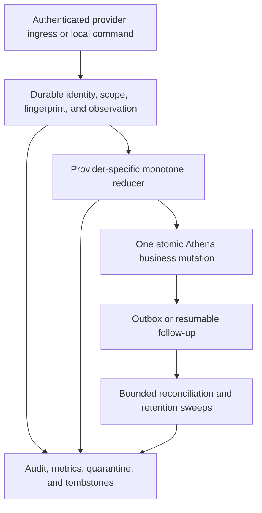
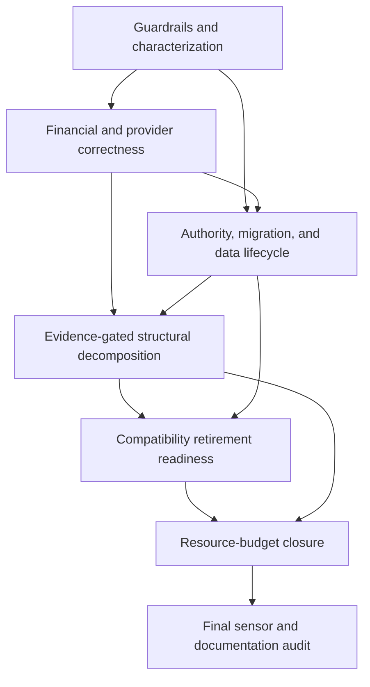
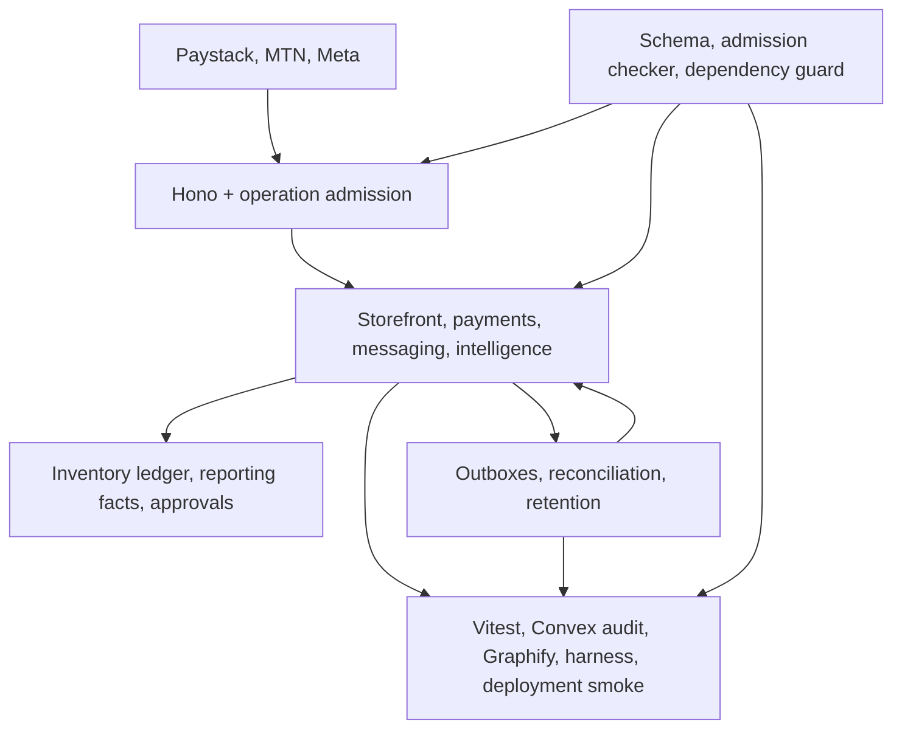

# refactor: Harden backend reliability and reduce change cost

## Summary

Deliver the backend audit as a phased reliability and maintainability program: close replay and partial-commit gaps first, make authority and data-lifecycle ownership explicit next, then shrink large change units behind stable Convex facades. Preserve Athena's monolith, public operation paths, and one-transaction domain model throughout.

---

## Problem Frame

Athena's backend has strong architectural foundations but has become expensive to change safely. The non-generated Convex backend is roughly 245,000 lines across 199 tables and 617 admitted operations, with 57 source files over 1,000 lines and several high-churn orchestration modules above 3,000–6,000 lines. The test surface is similarly large and includes layout-sensitive source assertions.

The audit found that complexity is not uniformly accidental. Inventory effects, reporting facts, Daily Close commits, approval proofs, and admission checks deliberately encode business invariants. The highest risks instead appear where provider work crosses transaction boundaries without first-class intermediate state, where two modules can mutate the same lifecycle, where payload/retention contracts are open, and where stable facades contain too many unrelated readers, translators, and policies.

---

## Requirements

- R1. Preserve Athena's Convex monolith, existing registered function paths, direct `*WithCtx` cross-domain composition, one-transaction business actions, inventory-ledger authority, reporting fact ledger, and in-transaction approval-proof consumption.
- R2. Make money-moving workflows exactly replay-safe at Athena's boundary, with immutable business identity, semantic fingerprints, partial-state healing, and no duplicate value delivery.
- R3. Ingest provider callbacks as immutable, scope-bound observations and derive current state through provider-specific monotone reducers; quarantine conflicts, orphans, and illegal transitions without hiding transient infrastructure failures.
- R4. Represent ambiguous external outcomes explicitly and reconcile them without unsafe automatic retries.
- R5. Establish one enforceable lifecycle owner for every shared durable aggregate, including `intelligenceRun`.
- R6. Bound every audited, newly introduced, or materially changed high-cardinality transaction, document, embedded collection, sweep, and generated payload below platform ceilings with conservative application budgets; exhaustively inventory the remaining legacy surface and ratchet owned, time-bounded waivers by risk.
- R7. Give audited, newly introduced, materially changed, and program-blocking asynchronous/content-bearing tables concrete redaction, retention, tombstone, scope-deletion, retry, and poison-row enforcement; exhaustively inventory remaining legacy surfaces under owned, telemetry-backed, expiring, shrink-only waivers.
- R8. Replace stringly or `v.any()`-backed ingress and event contracts incrementally with shared constants, runtime validators, discriminated outcomes, and safe error envelopes.
- R9. Replace mutable email as the primary authenticated-user link through an additive, collision-safe migration with bounded compatibility fallback and explicit cutover evidence.
- R10. Reduce change amplification in schema, operation admission, crons, and hotspot modules without weakening fail-closed checks or moving registered Convex exports.
- R11. Prevent new backend dependency cycles while allowing today's baseline to shrink and preserving legitimate same-transaction domain composition.
- R12. Retire compatibility seams only after bounded production censuses, shadow/parity evidence, rollback criteria, and explicit exit gates.
- R13. Prefer executable behavioral, validator, import-boundary, and schema-parity sensors over formatting-sensitive source assertions while retaining high-value AST security checks.
- R14. Keep agent docs, generated inventories, validation maps, Graphify artifacts, solution notes, and operational diagnostics aligned with each delivered architecture change.
- R15. Every quarantine, ambiguous outcome, deletion obligation, or poison state that requires human action must enter a named operational workflow with an accountable role, least-privilege authority, action/escalation SLO, required context, and capacity fallback before its cutover is enabled.
- R16. Provider evidence must be authenticated before persistence/application, bounded before writes, and scope-fenced against deletion; client-provided fields are lookup hints only until server-to-provider verification succeeds.

---

## Scope Boundaries

- No migration away from Convex, service split, event-bus architecture, or scheduled-job substitute for direct transactional composition.
- No public Convex/Hono path moves during facade extraction; registered exports remain in their current modules.
- No generic provider framework that erases provider-specific delivery, acknowledgement, timestamp, or retry semantics.
- No mass rename of `storeFront`, `sesionId`, legacy source-domain vocabulary, or embedded fields without an additive compatibility migration.
- No removal of verifier independence, admission grammar checks, approval ceremony, or agent-harness authority checkpoints merely because they look duplicative.
- No claim that sequential `convex-test` scenarios prove real races; concurrency safety continues to rely on serializability, compare-and-set transitions, idempotency, deployment smoke, and provider reconciliation.

### Deferred to Follow-Up Work

- Rewards reversal/redemption behavior after partial or full refund requires a product-policy decision; this program makes awards idempotent and leaves a typed extension point without inventing that policy.
- Splitting `intelligenceRun` into separate tables is deferred. A required owner discriminator and writer guard are sufficient unless later evidence shows the tagged union is still costly.
- Child-table migrations for every embedded history are deferred until document-size censuses justify them; immediate work adds conservative caps and retirement gates.

---

## Context & Research

### Relevant Code and Patterns

- `packages/athena-webapp/convex/inventoryLedger/effects.ts` is the single inventory/valuation aggregate boundary and a model for cohesive transaction kernels.
- `packages/athena-webapp/convex/storeFront/onlineOrder.ts` return/exchange processing demonstrates item, inventory, settlement, facts, and trace effects committed together.
- `packages/athena-webapp/convex/notifications/emit.ts`, `dispatch.ts`, and `sweeper.ts` provide durable intent, lease, terminalization, and recovery patterns.
- `packages/athena-webapp/convex/agentHarness/retention.ts` provides retention classes, bounded sweeps, scope deletion, and lifecycle cleanup patterns.
- `packages/athena-webapp/convex/operations/dailyClose/` demonstrates facade-preserving extraction without moving registered exports.
- `packages/athena-webapp/convex/operationAdmission/` and `scripts/convex-operation-admission-check.ts` form a complete fail-closed ingress boundary whose semantics must remain unchanged.

### Institutional Learnings

- `docs/solutions/architecture-patterns/athena-convex-facade-preserving-module-split-2026-07-06.md`: keep registered exports stable and extract plain helpers/policies/read models.
- `docs/solutions/architecture/athena-reporting-fact-projection-boundary-2026-07-09.md`: exact replay is a no-op; conflicting replay quarantines rather than overwrites.
- `docs/solutions/architecture-patterns/athena-admin-notifications-rail-2026-07-29.md`: intent and delivery are separate; leases need fencing tokens and a sweeper safety net.
- `docs/solutions/architecture-patterns/athena-answering-a-non-human-caller-2026-08-22.md`: lifecycle, retention, completion, release, and provider runtime are distinct authority checkpoints.
- `docs/solutions/architecture-patterns/athena-complete-operation-admission-migration-2026-08-16.md`: admission remains complete and fail-closed; declared argument scope is a clamp, not handler-owned domain authorization.
- `docs/solutions/harness/the-sensor-ladder-what-a-green-suite-cannot-see-2026-08-22.md`: Vitest alone does not prove Convex bundling, generated references, import boundaries, or deployment behavior.

### External References

- [Convex actions](https://docs.convex.dev/functions/actions) and [OCC/atomicity](https://docs.convex.dev/database/advanced/occ): action calls are separate transactions; related local effects belong in one mutation.
- [Convex platform limits](https://docs.convex.dev/production/state/limits): transaction/document ceilings are platform maximums, not safe application budgets.
- [Convex scheduled functions](https://docs.convex.dev/scheduling/scheduled-functions) and [cron jobs](https://docs.convex.dev/scheduling/cron-jobs): scheduled actions may permanently fail and cron executions may be skipped while a prior run is active, so recovery work must be resumable.
- [Paystack webhooks](https://paystack.com/docs/payments/webhooks/), [payment verification](https://paystack.com/docs/payments/verify-payments/), and [refunds](https://paystack.com/docs/payments/refunds/): delivery is replayable, refund creation is asynchronous, and ambiguous refund submission has no documented idempotency-key guarantee.
- [MTN MoMo callback guidance](https://momoapi.mtn.com/content/html_widgets/dpq3s.html): callbacks are sent once without retry; polling is the required fallback.
- [Meta WhatsApp status notifications](https://www.postman.com/meta/whatsapp-business-platform/request/rgtfq23/message-status-update-notifications): status callbacks may arrive out of chronological order.
- [AWS transactional outbox](https://docs.aws.amazon.com/prescriptive-guidance/latest/cloud-design-patterns/transactional-outbox.html) and [Microsoft duplicate-delivery guidance](https://learn.microsoft.com/en-us/azure/service-bus-messaging/service-bus-message-loss-and-duplicates): lease/outbox delivery still requires consumer idempotency and explicit ambiguous outcomes.

---

## Key Technical Decisions

| Decision | Chosen posture | Rationale |
|---|---|---|
| Unit of decomposition | Ownership boundary, not line count | Cohesive transaction kernels are valuable; readers, translators, reducers, policies, and registries cause most change amplification. |
| Provider event design | Shared minimum envelope, provider-owned reducers and tables | Identity, scope, redaction, and processing outcomes are common; transition and retry semantics differ materially by provider. |
| External-call recovery | Durable intent/observation before or immediately after the provider boundary, then one atomic local apply mutation | External I/O cannot join a Convex transaction. First-class intermediate state prevents invisible partial completion. |
| Outbox boundary | Only external I/O or explicitly non-authoritative follow-up may be deferred, and its intent is inserted in the owning transaction | Inventory, settlement, reporting facts, approvals, entitlement, and other local invariants remain direct `*WithCtx` work; outboxes must not become an internal event bus. |
| Callback acknowledgement | Acknowledge only durably applied, duplicate, or quarantined semantic events; preserve non-success for transient storage faults | Prevents provider retry storms without dropping recoverable infrastructure failures. |
| Facade extraction | Keep registered exports and transaction kernels in place | Preserves generated API paths, admission linkage, and one-transaction semantics. |
| Migration posture | Expand, census/shadow, cut over, contract | Athena indexes are not uniqueness constraints and legacy data cannot be assumed clean. |
| Structural enforcement | Shrink-only baselines plus executable parity checks | A blanket layering rewrite would reject legitimate transactional composition; source-string checks would be too weak or brittle. |
| Validation posture | Test-first for correctness work; characterization-first for legacy extraction/migration; sensor-only only for derived docs/artifacts | Makes expected behavior and preserved legacy semantics explicit before structural movement. |
| Governance metadata | One canonical metadata-only surface record, projected into lifecycle and resource-budget checks | Ownership, waiver identity, risk evidence, telemetry, and review expiry cannot drift across two catalogs; domain reducers and enforcement remain separate. |

---

## Open Questions

### Resolved During Planning

- Should the backend be split into services? No. The audit supports a Convex monolith with smaller ownership units and stable facades.
- Should refund item disposition be an untracked best-effort step? No. It is either part of the atomic provider-success application or a first-class resumable state created by that transaction.
- Should callbacks share a universal ordinal status model? No. Branching provider state machines need provider-specific transition rules.
- Can maintenance work move registered Convex functions? No. Public/internal function paths remain stable unless a separate compatibility migration explicitly authorizes a move.
- Can legacy paths be removed based on code inspection alone? No. Retirement requires bounded data/caller census and exit evidence.

### Deferred to Implementation

- Exact conservative transaction budgets: derive from encoded fixture sizes and transaction metrics, staying materially below current Convex ceilings rather than matching them.
- Provider-specific sanitized envelope fields: finalize from the installed SDK payloads and documented identifiers while excluding raw secrets and unnecessary PII.
- Migration batch sizes and feature-flag granularity: tune from preview counts and deployment metrics without changing the expand–migrate–contract posture.

---

## High-Level Technical Design

> *This illustrates the intended approach and is directional guidance for review, not implementation specification. The implementing agent should treat it as context, not code to reproduce.*

The core distinction is between immutable evidence and current materialized state. Provider observations may be duplicated, stale, or conflicting; the reducer decides whether they advance state, while the owning business mutation commits all local effects of an accepted transition together.

| Provider surface | Durable acknowledgement/recovery policy |
|---|---|
| Paystack charge/refund | Acknowledge only after durable apply, exact duplicate, or sanitized quarantine; transient storage failure remains retryable. Reconcile missing success by reference and ambiguous refunds by provider refund records. |
| MTN collection | Treat callback as an acceleration hint because it is one-shot; durable pending work always has bounded status polling. |
| Meta WhatsApp | Reduce provider-timestamped observations monotonically; ambiguous sends require callback/provider evidence or an audited operator safe-to-retry decision. |

### Operational workflow routing

| Human-actionable state | Existing surface and owning files | Authority and resolution | SLO and capacity fallback |
|---|---|---|---|
| Paystack charge/reward/refund or disposition exception | Typed lanes in `operations/operationalWorkItems.ts` and `schemas/operations/operationalWorkItem.ts`; queue read through `operations/operationalWorkItems:getQueueSnapshot`; admitted resolution in the owning storefront module plus `operationAdmission/domains/{operations,storefrontOperator}_definitions.ts` | Store-bound `full_admin`; money reapplication, disposition override, or retry consumes the applicable manager approval proof in the same transaction | Acknowledge within 15 minutes and resolve/reconcile within 4 hours; capacity breach pauses the affected refund/fulfillment path and pages the accountable operations owner. |
| MTN collection exception | Typed Operations lane and queue snapshot; admitted resolution in `mtn/collections.ts` plus `operationAdmission/domains/operations_definitions.ts` | Store-bound `full_admin`; reconcile from authenticated provider evidence, never a caller-supplied status | Acknowledge within 15 minutes and reconcile within 4 hours; capacity breach holds new affected collection submissions and invokes provider escalation. |
| Ambiguous WhatsApp delivery | Typed Operations lane and queue snapshot; admitted resolution in `customerMessaging/public.ts` plus `operationAdmission/domains/operations_definitions.ts` | Store-bound `full_admin`; safe-to-retry requires a manager approval proof and current lease generation | Acknowledge within 1 business hour and resolve within 1 business day; capacity breach pauses automatic sends for the affected channel/scope. |
| Notification poison or scope-deletion obligation | Typed Operations lane and queue snapshot; requeue/verify command in `notifications/sweeper.ts` plus `operationAdmission/domains/operations_definitions.ts` | Organization-bound `full_admin`; requeue preserves the deletion fence and cannot restore expired content | Acknowledge within 1 hour and resolve within 1 business day; capacity breach pauses affected delivery kinds while the scope fence remains active and pages the operations owner. |
| POS local-sync conflict review | Existing typed work lane and `operations/operationalWorkItems:getQueueSnapshot`; existing resolution paths including `cashControls/deposits:resolveRegisterSessionSyncReview` | Store-bound admitted operator under the existing role/proof rules; U20 preserves rather than redesigns this contract | Acknowledge within 1 business hour and resolve within 1 business day; capacity breach pauses projection for the affected register, not unrelated registers. |
| Catalog-import identity/fingerprint conflict | Existing catalog import review/finalization surface in `inventory/catalogImport.ts`; conflict evidence stays attached to the draft/import version | Store-bound `full_admin`; correct the draft or start a new explicit import identity—never mutate the conflicting fingerprint in place | Acknowledge within 1 business day and escalate after 2 business days; finalization remains blocked until corrected, while capacity pressure does not pause unrelated catalog work. |
| Legacy-intelligence cleanup poison/deletion obligation | Typed Operations lane and queue snapshot; requeue/verify command in `intelligence/retention.ts` plus `operationAdmission/domains/operations_definitions.ts` | Organization-bound `full_admin`; command preserves ownership and scope-deletion fences | Acknowledge within 1 hour and resolve within 1 business day; capacity breach pauses affected legacy capture and holds deletion completion while the fence remains active. |
| Auth-link or intelligence-owner migration conflict | Preview/query and manifest-bound remediation commands in `migrations/athenaUserAuthIdentity.ts` or `migrations/intelligenceRunOwnership.ts`; immutable audit output retained with the migration checkpoint | Deployment-security dual control: two named release operators review the exact manifest, one applies, the other verifies; no broad in-product resolver | Review every deployment day and block cutover at any unresolved row; capacity fallback is to hold the migration/cutover, not weaken matching rules. |

Each owning unit must add, or explicitly preserve and verify where the row names an existing workflow, the queue kind/query/resolution command, its operation-admission definition where public, intended-operator smoke, backlog/age metrics, and the pause/hold switch before enabling cutover.

---

## Phased Delivery

### Milestone A — Guardrails and high-risk correctness

- U1, U2, and U14 establish thin executable guardrails in parallel; U44 follows U1/U2 to establish the shared resource inventory. U5 hardens reward replay; U3, U4, U6, and U7 then close Paystack, refund, MTN, and WhatsApp gaps without waiting for the governance catalog's legacy closure or broad structural cleanup. Each provider unit registers its own liveness jobs when it lands.

### Milestone B — Authority, contracts, and bounded operations

- U8–U13, U15, U26–U28, and U39–U42 enforce lifecycle ownership through deployment-gated stages, transaction budgets, typed payload/error/approval contracts, stable auth identity, domain retention, and async-governance closure while ratcheting owned lower-risk legacy waivers.

### Milestone C — Structural decomposition

- U16–U23, U29–U34, and U43 modularize admission/schema in independent batches and extract stable seams from the largest orchestration facades without changing public paths or transaction kernels.

### Milestone D — Retirement readiness

- U24 and U35–U38 produce per-seam keep-or-contract evidence and exit gates. Approved contractions are separately tracked and are not implied by this program.

### Milestone E — Program closure

- U45 runs after the structural and embedded-collection work to close the finite blocking resource-budget set and ratchet lower-risk debt; U25 then modernizes residual sensors/docs and performs the final program audit.

### Milestone exit gates

- Milestone A cannot exit with unexplained provider-paid/order gaps, an unapplied processed refund, a confirmed duplicate reward/message, or a callback regression. Ambiguous work may remain only inside a named SLO with a bounded backlog and an operator-owned reconciliation path.
- Milestone B cannot exit with unowned lifecycle rows, unresolved auth-identity collisions at cutover, an expired-content/deletion-obligation backlog above SLO, an invisible poison obligation, or a human-actionable queue without an exercised owner/workflow.
- Every authoritative-writer cutover names the pause/hold switch, reconciliation query or dashboard, accountable operator, deployment-overlap window, and forward-recovery procedure. Rollback never re-enables a writer known to duplicate or partially apply value.
- Operational labels use scoped opaque references and bounded cardinality; raw provider IDs, customer PII, tokens, and message content stay out of metrics and ordinary logs.
- Before each listed Milestone C facade extraction, record a representative-change baseline for files/domains touched, focused-sensor runtime, review findings, and regression history. These first-wave hotspot pilots may proceed independently under their authoritative unit dependencies. After each extraction, repeat the same representative change: require non-regression on every dimension and material improvement on at least one named dimension. Record a keep/revert/redirect decision; no follow-on extraction in that hotspot/domain, and no expansion beyond this listed pilot portfolio, may proceed after a missed gate until the approach changes.

The `Dependencies` field on each implementation unit is the authoritative execution graph. This milestone view is intentionally non-exhaustive.

---

## Implementation Units

- U1. **Install a shrink-only backend dependency guard**

**Goal:** Snapshot current backend cycles and fail only on new dependency violations while protecting stable kernels.

**Requirements:** R1, R10, R11, R13

**Dependencies:** None

**Files:**
- Create: `scripts/convex-backend-dependency-check.ts`
- Create: `scripts/convex-backend-dependency-check.test.ts`
- Modify: `package.json`
- Modify: `scripts/harness-app-registry.ts`

**Approach:** Define protected kernel rules for inventory ledger and agent harness, prevent leaf-to-facade imports, and generate a baseline of exact violating edges/SCC identities rather than counts. Baseline drift fails until regeneration contracts it; a removed edge cannot pay for a new cycle elsewhere. Keep narrowly owned direct domain helper imports legal.

**Execution note:** Characterization-first: capture today's graph and prove the guard is green before adding failure fixtures.

**Patterns to follow:** `packages/athena-webapp/convex/agentHarness/importBoundary.test.ts`; `scripts/convex-operation-admission-check.ts` fail-closed diagnostics.

**Test scenarios:**
- Happy path: the current baseline produces zero new-cycle findings.
- Error path: a fixture adds a product-domain import into `inventoryLedger` and reports the exact edge.
- Edge case: removing a baseline edge makes the generated baseline stale; regeneration contracts it, and reintroducing the edge then fails.
- Error path: removing one known cycle while adding a different cycle still fails.
- Integration: facade-preserving helper imports remain accepted while leaf-to-facade imports fail.

**Verification:** The check is deterministic, harness-owned, and blocks only new violations.

- U2. **Install a thin async data-governance coverage contract**

**Goal:** Inventory every async/content table and make all new entries name their domain owner and concrete enforcement without introducing shared provider storage or reducers.

**Requirements:** R3, R4, R7, R8

**Dependencies:** None

**Files:**
- Create: `packages/athena-webapp/convex/platform/governanceSurfaceRegistry.ts`
- Create: `packages/athena-webapp/convex/platform/governanceSurfaceRegistry.test.ts`
- Create: `packages/athena-webapp/convex/platform/asyncDataGovernance.ts`
- Create: `packages/athena-webapp/convex/platform/asyncDataGovernance.test.ts`
- Modify: `packages/athena-webapp/convex/schema.ts`

**Approach:** Establish one canonical metadata-only record per governed surface containing surface identity, domain owner, waiver identity, risk evidence/disposition, decision owner, telemetry, review expiry, and escalation trigger. Derive the async/content projection with lifecycle-specific class, expiry/redaction/scope-deletion/retry/poison policy, and concrete enforcement export; U44 later derives the budget projection from the same records. Unknown, unmeasured, disputed, confidentiality/privacy/credential exposure, externally reachable resource exhaustion, money movement, authorization, data loss, platform ceilings, active-incident, or measured hotspot-change-cost risk is program-blocking. The currently audited lifecycle blockers map to U3/U4/U6/U7/U15/U27. Any newly discovered blocker pauses delivery for an explicit plan/Linear amendment rather than silently expanding U28. Only evidence-supported lower-risk legacy waivers may remain as owned, telemetry-backed, time-bounded follow-ups; no new or changed surface may use a waiver. Provider identity, schema, reducer, acknowledgement, and storage remain domain-owned.

**Execution note:** Test-first for coverage failures; characterize existing agent-harness policies as the reference case.

**Patterns to follow:** `packages/athena-webapp/convex/agentHarness/retention.ts`; notification delivery policy registry.

**Test scenarios:**
- Happy path: every table is inventoried; existing gaps are explicit evidence-backed ratcheted waivers and every new/changed table declares a complete policy.
- Disposition: unknown/disputed risk, missing decision evidence/owner/expiry/escalation trigger, PII/credential exposure, or public resource-exhaustion risk cannot be classified lower-risk.
- Error path: a new async table without expiry or poison ownership fails coverage.
- Edge case: audit-only tombstones may outlive short-lived content but cannot retain raw payload fields.
- Integration: domain policy registration does not import product domains into platform kernels.

**Verification:** No new governance gap can land; every current waiver has a risk disposition, owner, telemetry, and review expiry; and U28 owns closure of the finite audited blocking set without auto-importing lower-risk follow-ups.

- U3. **Unify Paystack charge settlement**

**Goal:** Make order creation/reuse, checkout payment state, provider evidence, and partial-state repair one idempotent transaction used by webhook, client verification, and reconciliation.

**Requirements:** R1–R4, R6, R8, R15, R16

**Dependencies:** U5, U14

**Files:**
- Modify: `packages/athena-webapp/convex/http/domains/customerChannel/routes/paystack.ts`
- Modify: `packages/athena-webapp/convex/storeFront/payment.ts`
- Modify: `packages/athena-webapp/convex/storeFront/onlineOrder.ts`
- Modify: `packages/athena-webapp/convex/storeFront/checkoutSession.ts`
- Modify: `packages/athena-webapp/convex/schemas/storeFront/onlineOrder/onlineOrder.ts`
- Modify: `packages/athena-webapp/convex/schemas/storeFront/index.ts`
- Modify: `packages/athena-webapp/convex/schema.ts`
- Modify: `packages/athena-webapp/convex/crons.ts`
- Modify: `packages/athena-webapp/convex/crons.test.ts`
- Modify: `packages/athena-webapp/convex/automation/cronRegistry.ts`
- Create: `packages/athena-webapp/convex/storeFront/paystackChargeObservations.ts`
- Create: `packages/athena-webapp/convex/storeFront/paystackChargeObservations.test.ts`
- Create: `packages/athena-webapp/convex/storeFront/paystackRetention.ts`
- Create: `packages/athena-webapp/convex/storeFront/paystackRetention.test.ts`
- Modify: `packages/athena-webapp/convex/operations/operationalWorkItems.ts`
- Modify: `packages/athena-webapp/convex/schemas/operations/operationalWorkItem.ts`
- Modify: `packages/athena-webapp/convex/operationAdmission/domains/storefrontOperator_definitions.ts`
- Test: `packages/athena-webapp/convex/storeFront/payment.test.ts`
- Test: `packages/athena-webapp/convex/storeFront/onlineOrder.test.ts`
- Test: `packages/athena-webapp/convex/storeFront/checkoutSession.test.ts`

**Approach:** Add domain-owned sanitized charge-observation/replay-tombstone rows with indexed semantic keys for both Paystack transaction identity and merchant reference, plus bounded recovery and redaction/expiry/scope-deletion exports registered by this unit in the existing cron surface and U14 registry. Authenticate signed callbacks before persistence; client verification supplies lookup hints and trusts only a server-to-Paystack verification response. Bind amount, currency, domain/account, store, and checkout session before materialization. Exact replay returns the existing outcome; historical order/session disagreement heals inside the same transaction; conflicting reuse quarantines. The settlement mutation invokes U5's canonical reward helper directly and inserts notification intent before commit; only external delivery runs afterward. Store-scoped exceptions create typed Operations work items and expose admitted full-admin reconciliation commands through the routing contract above.

**Execution note:** Test-first with failpoints at the current mutation boundary.

**Patterns to follow:** `packages/athena-webapp/convex/storeFront/helpers/onlineOrder.ts`; reporting fact replay conflict handling.

**Test scenarios:**
- Happy path: one callback creates the order, marks the session paid/completed, and records evidence atomically.
- Replay: webhook, client verification, and cron arrive in every order and create one order/payment outcome.
- Concurrency: two ingress paths read the same semantic key and OCC permits one logical insert/apply outcome.
- Repair: an existing order with a missing session marker is healed without duplicate items or facts.
- Conflict: wrong reference, amount, currency, domain, or store quarantines without fulfillment.
- Security: invalid/stale signature, forged client result, key rotation, provider verification failure, oversized payload, and deleted-scope callback cannot create or advance business state.
- Recovery: quarantined evidence records schema/reducer version and supports bounded audited reprocessing after a binding/reducer fix.
- Retention: replay remains rejected after raw observation expiry through the minimal keyed/versioned tombstone or durable aggregate identity.
- Error path: transient transaction failure remains retryable and no partial state commits.
- Integration: a lost action response after settlement still leaves durable notification/reward work or a deterministically discoverable reconciliation candidate.

**Verification:** No reachable state has a provider-accepted order without the corresponding settled checkout, except an explicit quarantined/reconciliation state.

- U4. **Make gateway refunds durable through item disposition**

**Goal:** Represent refund intent, ambiguous submission, provider state, financial application, item disposition, inventory effects, facts, and traces as one recoverable workflow.

**Requirements:** R1–R4, R6–R8, R15, R16

**Dependencies:** U3

**Files:**
- Modify: `packages/athena-webapp/convex/schemas/storeFront/onlineOrder/onlineOrder.ts`
- Modify: `packages/athena-webapp/convex/schemas/storeFront/onlineOrder/onlineOrderItem.ts`
- Modify: `packages/athena-webapp/convex/schemas/storeFront/index.ts`
- Modify: `packages/athena-webapp/convex/schema.ts`
- Modify: `packages/athena-webapp/convex/storeFront/payment.ts`
- Modify: `packages/athena-webapp/convex/storeFront/onlineOrder.ts`
- Modify: `packages/athena-webapp/convex/http/domains/customerChannel/routes/paystack.ts`
- Modify: `packages/athena-webapp/convex/services/paystackService.ts`
- Modify: `packages/athena-webapp/convex/crons.ts`
- Modify: `packages/athena-webapp/convex/crons.test.ts`
- Modify: `packages/athena-webapp/convex/automation/cronRegistry.ts`
- Modify: `packages/athena-webapp/convex/storeFront/paystackRetention.ts`
- Modify: `packages/athena-webapp/convex/operations/operationalWorkItems.ts`
- Modify: `packages/athena-webapp/convex/schemas/operations/operationalWorkItem.ts`
- Modify: `packages/athena-webapp/convex/operationAdmission/domains/storefrontOperator_definitions.ts`
- Modify: `packages/athena-webapp/src/components/orders/RefundsView.tsx`
- Modify: `packages/athena-webapp/src/components/orders/OrderView.tsx`
- Create: `packages/athena-webapp/src/lib/refundCommandIdentity.ts`
- Create: `packages/athena-webapp/convex/storeFront/refundOperations.ts`
- Create: `packages/athena-webapp/convex/storeFront/refundOperations.test.ts`
- Test: `packages/athena-webapp/convex/storeFront/payment.test.ts`
- Test: `packages/athena-webapp/convex/storeFront/returnExchangeOperations.test.ts`
- Test: `packages/athena-webapp/convex/storeFront/onlineOrderTracing.test.ts`
- Test: `packages/athena-webapp/src/components/orders/RefundsView.test.tsx`
- Test: `packages/athena-webapp/src/components/orders/OrderView.test.tsx`
- Test: `packages/athena-webapp/src/lib/refundCommandIdentity.test.ts`

**Approach:** Require a cryptographically unpredictable caller-generated `refundRequestId` created once when the operator confirms a refund intent and pass it as a required `refundPayment` argument. A shared client helper stores the opaque ID plus a canonical fingerprint digest in session-scoped durable browser state before dispatch; both caller components adopt it, reuse it through transport ambiguity/reopen/retry while the fingerprint is unchanged, and clear it only after a definitive terminal result or explicit cancellation. Treat the ID only as untrusted correlation: reserve/index it under organization, store, and order with the complete semantic fingerprint, and independently re-run existing admitted refund authorization on every create/status/resume/cancel path. Status returns only a safe scoped projection and never accepts requester identity from the client. If browser state is lost, the durable order lock and Operations work item prevent a new submission from bypassing an ambiguous operation. This retry-stable business identity is distinct from optional provider refund identity, which is never synthesized when absent. Add domain-owned observations/tombstones and register recovery/retention jobs in this unit. Freeze order, currency, amount/tax/delivery allocations, selected item IDs/quantities, remaining refundable balance, disposition, and policy version in the fingerprint. Track provider finality, internal financial application, and disposition completion separately. Release only after definitive pre-acceptance rejection; timeout, connection reset after write, provider 5xx, malformed success, or lost response become submission-ambiguous. Extend the configured provider client to query refund records and add a bounded scheduled reconciliation action whose result is consumed by the same atomic application mutation. Provider-confirmed application records financial value and either performs required inventory effects or creates a fenced resumable disposition obligation that cannot reapply money. Ambiguous or disposition-blocked cases create typed Operations work items; admitted full-admin resolution consumes any required manager proof with the financial/disposition transition.

**Execution note:** Test-first with provider-boundary failpoints and characterization of current partial-refund behavior.

**Patterns to follow:** atomic return/exchange processing in `storeFront/onlineOrder.ts`; inventory ledger commerce effects.

**Test scenarios:**
- Happy path: processed refund atomically applies finance, selected item state, stock disposition, facts, and trace.
- Ambiguity: timeout after provider acceptance enters reconciliation and cannot issue a second refund blindly.
- Failure classification: definitive provider 4xx, known pre-send failure, post-send timeout, provider 5xx, malformed success, and accepted-then-local-failure reach distinct safe states.
- Replay: duplicate reserve/finalize/callback is a no-op; conflicting fingerprint quarantines.
- Retry identity: a lost create-operation response followed by a newly delivered command with the same `refundRequestId` resumes the original operation; reuse with a different fingerprint quarantines before provider submission.
- Ordering: processed followed by pending/failed cannot regress state or append amount twice.
- Error path: wrong-order item IDs or restock failure leave explicit resumable disposition without partial hidden success.
- Edge case: multiple partial refunds respect remaining refundable amount and closed item validators.
- Reconciliation: missing webhook, absent provider refund ID, provider unavailability, exact record match, conflicting match, and quarantined-event reprocessing remain bounded and exactly-once.
- Security/bounds: provider evidence is authenticated, request/observation sizes are capped, deleted scopes cannot recreate content, and replay stays blocked after payload expiry.
- Authorization: wrong organization/store/order/actor, guessed ID, and cross-tenant ID collision cannot observe, resume, or cancel another refund operation.

**Verification:** Every provider-confirmed refund is either fully applied internally or visibly recoverable from durable state.

- U5. **Make reward awards canonically idempotent**

**Goal:** Give current, recovered, webhook, client, and cron award paths one replay policy and one atomic balance update.

**Requirements:** R2, R6, R8, R15

**Dependencies:** None

**Files:**
- Modify: `packages/athena-webapp/convex/storeFront/rewards.ts`
- Modify: `packages/athena-webapp/convex/schemas/storeFront/rewards.ts`
- Modify: `packages/athena-webapp/convex/storeFront/payment.ts`
- Modify: `packages/athena-webapp/convex/operations/operationalWorkItems.ts`
- Modify: `packages/athena-webapp/convex/schemas/operations/operationalWorkItem.ts`
- Modify: `packages/athena-webapp/convex/operationAdmission/domains/storefrontOperator_definitions.ts`
- Test: `packages/athena-webapp/convex/storeFront/rewards.test.ts`
- Test: `packages/athena-webapp/convex/storeFront/payment.test.ts`

**Approach:** Use order and award kind as the stable value-delivery identity; freeze policy version and awarded points inside the semantic fingerprint/evidence. Compare fingerprints on replay; write transaction, balance, and milestone evidence together. Expose the canonical `*WithCtx` helper used by U3. Run a bounded duplicate census before relying on logical uniqueness, and route conflicting identities into the Paystack/reward Operations lane without automatically merging or issuing value. U5 owns an admitted store-bound full-admin resolution command that consumes a manager proof to select canonical evidence only after balance reconciliation, plus backlog/age metrics and a hold switch that disables new awards for the affected scope when the SLO is breached.

**Execution note:** Test-first; leave refund reversal behavior explicitly deferred.

**Patterns to follow:** existing recovery-path order check; reporting fact semantic replay checks.

**Test scenarios:**
- Happy path: verified order creates one award and increments balance once.
- Replay: webhook/client/cron repeats return the same outcome without a second increment.
- Replay: a policy-version change between first award and recovery cannot create a second value-delivery identity.
- Conflict: same identity with different points or policy fingerprint quarantines.
- Migration: duplicate historical rows are reported, never silently merged.
- Edge case: guest/account identity resolution remains store-bound and signed.

**Verification:** No admitted award path can bypass the canonical replay helper.

- U6. **Make MTN collection requests and callbacks monotone**

**Goal:** Reuse one business request identity, prevent scope/status regression, and recover when MTN's one-shot callback never arrives.

**Requirements:** R2–R4, R6–R8, R15, R16

**Dependencies:** U14

**Files:**
- Modify: `packages/athena-webapp/convex/mtn/collections.ts`
- Modify: `packages/athena-webapp/convex/schemas/payments/mtnCollections.ts`
- Modify: `packages/athena-webapp/convex/http/domains/moneyMovement/routes/mtnMomo.ts`
- Modify: `packages/athena-webapp/convex/crons.ts`
- Modify: `packages/athena-webapp/convex/automation/cronRegistry.ts`
- Modify: `packages/athena-webapp/convex/operations/operationalWorkItems.ts`
- Modify: `packages/athena-webapp/convex/schemas/operations/operationalWorkItem.ts`
- Modify: `packages/athena-webapp/convex/operationAdmission/domains/operations_definitions.ts`
- Test: `packages/athena-webapp/convex/crons.test.ts`
- Create: `packages/athena-webapp/convex/mtn/retention.ts`
- Test: `packages/athena-webapp/convex/mtn/retention.test.ts`
- Test: `packages/athena-webapp/convex/mtn/foundation.test.ts`
- Test: `packages/athena-webapp/convex/http/domains/moneyMovement/routes/mtnMomoWebhookBody.test.ts`

**Approach:** Persist a domain-owned sanitized observation/tombstone and stable business identity before request submission, authenticate callback or verify suspicious outcomes through the configured provider client, mark ambiguous outcomes, bind provider references to the stored store/account, and reduce one indexed observation against current state without rescanning history. Unknown callbacks quarantine with versioned evidence and bounded audited reprocessing. This unit registers the named bounded pending-collection and retention sweeps in the existing cron surface and U14 registry as the liveness path. Store-scoped exceptions create typed Operations work items and expose an admitted full-admin reconciliation command through the routing contract above.

**Execution note:** Test-first using callback/poll permutations.

**Patterns to follow:** existing pending-before-provider-call flow; provider observation contract from U2.

**Test scenarios:**
- Happy path: request, callback, and poll converge on one terminal collection.
- Replay: action retry returns the existing provider reference.
- Ordering: poll success followed by callback pending cannot regress.
- Scope: same provider reference with another store/account quarantines.
- Failure: missing callback is recovered by bounded poll; timeout stays ambiguous rather than failed.
- Edge case: orphan or unknown provider status cannot become authoritative business state.
- Security: forged/oversized/deleted-scope callbacks cannot persist content or advance state; replay remains rejected after payload expiry.

**Verification:** MTN finality does not depend on callback delivery and cannot be overwritten by stale observations.

- U7. **Add a fenced WhatsApp delivery outbox and callback reducer**

**Goal:** Prevent duplicate customer messages after ambiguous send outcomes and prevent out-of-order callbacks from regressing delivery state.

**Requirements:** R3, R4, R6–R8, R15, R16

**Dependencies:** U14

**Files:**
- Modify: `packages/athena-webapp/convex/customerMessaging/public.ts`
- Modify: `packages/athena-webapp/convex/customerMessaging/repository.ts`
- Modify: `packages/athena-webapp/convex/http/domains/customerMessaging/routes/whatsapp.ts`
- Modify: `packages/athena-webapp/convex/inventory/stores.ts`
- Modify: `packages/athena-webapp/convex/inventory/organizations.ts`
- Modify: `packages/athena-webapp/convex/schemas/customerMessaging/customerMessageDelivery.ts`
- Create: `packages/athena-webapp/convex/schemas/customerMessaging/customerMessagingScopeFence.ts`
- Create: `packages/athena-webapp/convex/schemas/customerMessaging/whatsappCallbackParent.ts`
- Create: `packages/athena-webapp/convex/schemas/customerMessaging/whatsappCallbackChunk.ts`
- Modify: `packages/athena-webapp/convex/schemas/customerMessaging/index.ts`
- Modify: `packages/athena-webapp/convex/schema.ts`
- Modify: `packages/athena-webapp/convex/operations/operationalWorkItems.ts`
- Modify: `packages/athena-webapp/convex/schemas/operations/operationalWorkItem.ts`
- Modify: `packages/athena-webapp/convex/operationAdmission/domains/operations_definitions.ts`
- Modify: `packages/athena-webapp/convex/crons.ts`
- Modify: `packages/athena-webapp/convex/crons.test.ts`
- Modify: `packages/athena-webapp/convex/automation/cronRegistry.ts`
- Create: `packages/athena-webapp/convex/customerMessaging/retention.ts`
- Test: `packages/athena-webapp/convex/customerMessaging/retention.test.ts`
- Test: `packages/athena-webapp/convex/customerMessaging/whatsappClient.test.ts`
- Test: `packages/athena-webapp/convex/http/domains/customerMessaging/routes/whatsappWebhookBody.test.ts`

**Approach:** Lease pending deliveries with a generation token, record attempts before network I/O, and finalize only under the active lease. Treat timeouts after submission as ambiguous. Create a typed Operations work item and provide an admitted, store-bound, full-admin reconciliation command that consumes a manager approval proof in the same transaction before resolving the current fenced generation to confirmed-sent or safe-to-retry with immutable evidence. Register delivery/reconciliation/retention liveness jobs in this unit. Add a domain-owned `customerMessagingScopeFence`/deletion-obligation row whose generation is inserted or advanced inside the authoritative store/organization removal transaction before cleanup. Send, callback staging, chunk application, finalization, and the sweeper all consult the same helper/generation; failed cleanup remains fenced, visible, and requeueable. Authenticate callbacks and enforce a hard byte/field cap that is proven at least as large as the provider's documented delivery maximum before cutover. Use explicit `whatsappCallbackParent` and `whatsappCallbackChunk` tables. A parent stores a keyed request fingerprint, resolved organization/store or terminal `unknown_scope`, captured scope-fence generation, `staging|applying|applied|quarantined|deletion_terminal` state, chunk/terminal counts, next-attempt time, attempts, and timestamps; indexes cover fingerprint lookup, state-plus-next-attempt sweeping, and store-plus-state cleanup. A chunk stores parent ID, ordinal, keyed event fingerprint, sanitized event, state/terminal outcome, and timestamps; indexes cover parent-plus-ordinal and parent-plus-state. Authenticated unknown-scope input stores only a minimal digest/reason and terminal quarantine—never raw event content. Every known-scope chunk must match the parent's fence generation before persistence/application. Requests within the provider envelope are sanitized into idempotent bounded chunks, then each chunk applies atomically through the monotone reducer. Return provider success only after every child is applied, proven duplicate, durably quarantined, or deletion-terminal; complete staging alone is never acknowledgement. A retry or independent bounded parent sweeper resumes missing/stuck chunks by fingerprint/index, so an oversized legitimate batch cannot loop, strand, or double-apply. Scope deletion during staging/application terminalizes the parent, redacts remaining content, and prevents further state advancement. If no provider maximum can be established, cutover is blocked until provider-status reconciliation supplies a bounded terminal recovery path.

**Execution note:** Test-first; characterize current receipt-token and operator feedback contracts.

**Patterns to follow:** notification intent/delivery leases, adjusted for the absence of a documented Meta idempotency key.

**Test scenarios:**
- Happy path: send returns provider ID; callbacks advance sent → delivered → read.
- Ambiguity: network timeout leaves one non-retryable-automatic ambiguous attempt.
- Concurrency: stale lease holder cannot finalize after a newer generation claims work.
- Ordering: read before sent, duplicate statuses, and late failed callbacks never regress current state.
- Scope: unknown message callbacks remain bounded orphan observations.
- Integration: every chunk is applied atomically, provider success waits for terminal child outcomes rather than staging, and operator-safe status remains stable.
- Recovery: stale manual decisions are refused and the ambiguous backlog can be drained without unreviewed resend.
- Boundary: exact chunk cap succeeds; chunk-cap-plus-one stages another resumable chunk, a repeated parent resumes idempotently, and only requests outside the proven provider envelope fail before writes.
- Liveness: failure after any staged chunk followed by the identical provider retry resumes the parent, persists every remaining chunk once, and reaches a terminal acknowledgement without double application.
- Failure/race: final staging followed by worker failure, permanently failing application, and scope deletion between chunks remain visible, swept or quarantined/deletion-terminal, and never acknowledge an unapplied nonterminal child.
- Storage: empty callback, authenticated unknown scope, stuck-parent due index, parent/chunk ordinal replay, and deleted-scope cleanup stay bounded and schema-valid.
- Deletion fence: delete-before-stage, stage-before-delete, delete-between-chunks, and failed-cleanup/requeue cannot bypass or roll back the durable generation.
- Security: wrong role/store/subject, stale or reused proof, forged callback, and late deleted-scope callback fail closed.

**Verification:** A lost response cannot silently create an automatic duplicate send, and status never regresses.

- U8. **Widen `intelligenceRun` ownership and stamp new writes**

**Goal:** Add the optional owner discriminator and ensure all newly created rows are classified without breaking old deployments or existing documents.

**Requirements:** R5, R7, R12, R13

**Dependencies:** None

**Files:**
- Modify: `packages/athena-webapp/convex/schemas/intelligence.ts`
- Modify: `packages/athena-webapp/convex/intelligence/runs.ts`
- Modify: `packages/athena-webapp/convex/agentHarness/lifecycle.ts`
- Create: `packages/athena-webapp/convex/intelligence/runOwnership.test.ts`
- Test: `packages/athena-webapp/convex/intelligence/lifecycle.test.ts`
- Test: `packages/athena-webapp/convex/agentHarness/lifecycle.test.ts`

**Approach:** Widen the schema with an optional owner discriminator, stamp all agent and legacy creation paths, and add read-only diagnostics for missing/ambiguous ownership. Existing rows and old-version writers remain tolerated during this deployment stage; no required-field narrowing or historical guessing occurs here.

**Execution note:** Characterization-first around row creation and old-version compatibility.

**Patterns to follow:** agent-harness lifecycle compare-and-set and import-boundary tests.

**Test scenarios:**
- Happy path: every new agent/legacy row is stamped with the correct owner.
- Compatibility: existing missing-owner rows remain readable during the widened stage.
- Deployment: an old-version writer can still land a missing-owner row, and diagnostics expose it for the later delta pass.
- Integration: agent and legacy creation paths preserve current lifecycle behavior and return contracts.

**Verification:** The widened schema is deployable over current data and every current-version creation path stamps ownership.

- U9. **Bound agent completion aggregate writes**

**Goal:** Reject or compact oversized completion results before any partial write while preserving all-or-nothing answer release.

**Requirements:** R6, R7, R13

**Dependencies:** None

**Files:**
- Modify: `packages/athena-webapp/convex/agentHarness/lifecycle.ts`
- Modify: `packages/athena-webapp/convex/agentHarness/tools.ts`
- Modify: `packages/athena-webapp/shared/agentHarness/contracts.ts`
- Test: `packages/athena-webapp/convex/agentHarness/lifecycle.test.ts`
- Test: `packages/athena-webapp/convex/agentHarness/runtimeHost.test.ts`

**Approach:** Deduplicate citations/claims, enforce count and encoded-byte budgets before writes, and record sanitized refusal diagnostics. Use conservative application budgets derived from fixtures and transaction metrics, not platform maxima.

**Execution note:** Test-first at cap, cap-plus-one, and oversized payload boundaries.

**Patterns to follow:** existing harness budget charging and completion outbox.

**Test scenarios:**
- Happy path: a bounded multi-citation answer commits and releases normally.
- Boundary: exact cap succeeds; cap-plus-one or byte overflow refuses with zero partial rows.
- Edge case: duplicate references compact without changing evidence semantics.
- Error path: oversized claim slices cannot create an artifact or release.
- Integration: fake and real runtime adapters observe the same normalized terminal outcome.

**Verification:** Completion has measurable headroom and no oversized request can partially commit.

- U10. **Type notification payloads by kind**

**Goal:** Replace manual `v.any()` payload parsing with a kind-indexed TypeScript/runtime contract at every emission boundary.

**Requirements:** R7, R8, R13

**Dependencies:** U2

**Files:**
- Modify: `packages/athena-webapp/convex/notifications/registry.ts`
- Modify: `packages/athena-webapp/convex/notifications/emit.ts`
- Modify: `packages/athena-webapp/convex/schemas/notifications.ts`
- Test: `packages/athena-webapp/convex/notifications/registry.test.ts`
- Test: `packages/athena-webapp/convex/notifications/rail.test.ts`

**Approach:** Define payload validators beside notification kinds, infer TypeScript types from them, validate before persistence, and keep broad stored compatibility only during migration. Apply redaction/retention classification per kind.

**Execution note:** Test-first for invalid emissions and registry completeness.

**Test scenarios:**
- Happy path: every registered kind accepts its valid payload and renders unchanged.
- Error path: missing, extra-sensitive, or wrong-type fields fail before intent creation.
- Compatibility: historical broad rows remain readable through bounded adapters.
- Coverage: adding a kind without payload, renderer, delivery policy, or retention fails registry tests.

**Verification:** Producers and renderers share one executable contract; no new unvalidated payload is persisted.

- U11. **Add the stable auth identity key and close writers**

**Goal:** Add an indexed stable auth identity link and ensure all Athena-user/auth-sync writers maintain it safely.

**Requirements:** R6, R8, R9, R12, R15

**Dependencies:** None

**Files:**
- Modify: `packages/athena-webapp/convex/schemas/inventory/athenaUser.ts`
- Modify: `packages/athena-webapp/convex/lib/athenaUserAuth.ts`
- Modify: `packages/athena-webapp/convex/inventory/auth.ts`
- Modify: `packages/athena-webapp/convex/inventory/inviteCode.ts`
- Modify: `packages/athena-webapp/convex/sharedDemo/provision.ts`
- Test: `packages/athena-webapp/convex/lib/athenaUserAuth.test.ts`
- Test: `packages/athena-webapp/convex/inventory/athenaUserIdentityWriters.test.ts`

**Approach:** Widen the schema with optional `authUserId` linked to the Convex Auth users table and an indexed lookup populated through the installed auth package's stable user-ID helper; never use the session-scoped token identifier as the durable key. Classify every insert/patch as auth-linked, pre-auth invitation, or intentionally authless demo provisioning, and add a structural inventory test that rejects unclassified writers. Automatic linking is permitted only when auth user and Athena user are provably one-to-one and unclaimed; all other cases block cutover and enter the deployment-security migration workflow defined below. Once created, the stable link remains authoritative even during rollback.

**Execution note:** Characterization-first, then widen–migrate–narrow with preview/apply/verify/rollback sensors.

**Patterns to follow:** existing normalized-email migration and the installed Convex Auth helper that resolves the durable auth users-table ID.

**Test scenarios:**
- Happy path: authenticated identity resolves through the stable indexed link.
- Conflict: duplicate stable identifiers fail closed and never auto-merge accounts.
- Edge case: email change does not change authorization identity.
- Edge case: identical emails across issuers, session rotation, disabled/deleted auth users, concurrent first sign-ins, and two identities claiming one Athena user cannot misbind.

**Verification:** Every new/updated user writer preserves a unique stable link or emits a quarantined conflict.

- U12. **Pilot typed HTTP problems on customer checkout**

**Goal:** Establish the canonical runtime-validation/problem contract on checkout, plus a ratchet preventing new generic JSON casts and broad exception-to-400 mappings.

**Requirements:** R3, R8, R13

**Dependencies:** None

**Files:**
- Modify: `packages/athena-webapp/convex/http/domains/customerChannel/routes/admittedCustomer.ts`
- Create: `packages/athena-webapp/convex/http/lib/problemResponse.ts`
- Create: `packages/athena-webapp/convex/http/lib/problemResponse.test.ts`
- Modify: `packages/athena-webapp/convex/http/domains/customerChannel/routes/checkout.ts`
- Modify: `packages/athena-webapp/convex/http.ts`
- Test: `packages/athena-webapp/convex/http/domains/customerChannel/routes/checkoutRoutes.test.ts`

**Approach:** Parse `unknown` through named runtime schemas, map only closed expected outcomes, rethrow unknown faults to the fixed root 500, and keep provider acknowledgement policy separate from storefront JSON problems. Preserve request/correlation headers without allowing sub-router error handlers to bypass the root contract.

**Execution note:** Characterization-first for current route/status behavior, then test-first per migrated route family.

**Patterns to follow:** customer merge routes that rethrow unknown faults; shared `CommandResult` safe-copy rules.

**Test scenarios:**
- Happy path: valid payload reaches the admitted domain handler unchanged.
- Validation: malformed JSON and schema-invalid JSON return the canonical safe problem.
- Error path: unexpected type/index/mutation faults reach fixed 500 without leaked messages.
- Authorization: 401/403 admission responses remain distinct and cannot be reshaped by route catches.
- Integration: provider semantic quarantine acknowledges per provider policy while transient storage failure remains retryable.

**Verification:** Checkout is fully migrated, the root contract is preserved, and the ratchet prevents new unsafe patterns while other route families migrate independently.

- U13. **Close approval and command-result catalogs**

**Goal:** Derive approval actions/request types and shared result validators from closed constants, eliminating message-text classification and incremental `v.any()` use.

**Requirements:** R1, R8, R13

**Dependencies:** None

**Files:**
- Modify: `packages/athena-webapp/shared/approvalPolicy.ts`
- Modify: `packages/athena-webapp/shared/commandResult.ts`
- Modify: `packages/athena-webapp/convex/lib/commandResultValidators.ts`
- Modify: `packages/athena-webapp/convex/operations/approvalRequests.ts`
- Test: `packages/athena-webapp/convex/operations/approvalProofs.test.ts`
- Test: `packages/athena-webapp/convex/lib/commandResultValidators.test.ts`

**Approach:** Use closed catalogs and typed handler registry entries while retaining direct in-transaction domain calls. Preserve the distinction between manager elevation and single-use proof. Migrate concrete result validators as commands are touched.

**Execution note:** Characterization-first around approval consumption/audit, then test-first for typed failures.

**Test scenarios:**
- Happy path: a cataloged request consumes the matching proof and commits the command/audit once.
- Authorization: wrong action, subject, store, requester, expiry, or reused proof fails without protected writes.
- Contract: TS result codes and Convex validators remain in parity.
- Error path: downstream typed failure maps without matching message text.
- Coverage: unknown action/request/result kinds fail registry tests.

**Verification:** Approval routing has no open string catalog or behavior-affecting message parsing.

- U14. **Create one typed cron registry and telemetry envelope**

**Goal:** Replace unsupported local cron helper usage and metadata drift with one static registration catalog consumed by telemetry.

**Requirements:** R6–R8, R10, R13

**Dependencies:** None

**Files:**
- Modify: `packages/athena-webapp/convex/crons.ts`
- Modify: `packages/athena-webapp/convex/crons.test.ts`
- Modify: `packages/athena-webapp/convex/automation/scheduledRunLedger.ts`
- Create: `packages/athena-webapp/convex/automation/cronRegistry.ts`
- Test: `packages/athena-webapp/convex/automation/scheduledRunLedger.test.ts`

**Approach:** Keep explicit top-level static `crons.interval`/`crons.cron` calls in `crons.ts`. Establish a metadata-only typed registry for owner, cadence, reference, telemetry family, and retention class, with parity tests against the jobs that exist when U14 lands. Every later unit that introduces a job must update both the explicit registration and registry in its own PR, so the core has no provider dependency or order-sensitive follow-up. Use off-hour minutes unless business boundaries require `:00`; keep runtime telemetry bounded.

**Execution note:** Characterization-first for exact cadence and job identity.

**Test scenarios:**
- Happy path: registry renders every expected job with unchanged business cadence.
- Contract: metadata and scheduled-run telemetry consume the same job identity.
- Error path: duplicate name, unsupported helper, missing owner, or missing retention fails.
- Edge case: long-running resumable sweep records continuation/skipped-run evidence without unbounded payload.

**Verification:** `crons.hourly` is absent and source-format assertions are replaced by registry behavior plus a narrow unsupported-API guard.

- U15. **Add notification retention and tombstones**

**Goal:** Close the known unbounded notification intent/delivery lifecycle with bounded cleanup, redaction, replay tombstones, scope deletion, and visible poison obligations.

**Requirements:** R6, R7, R12–R15

**Dependencies:** U2, U10, U14

**Files:**
- Modify: `packages/athena-webapp/convex/notifications/sweeper.ts`
- Modify: `packages/athena-webapp/convex/notifications/emit.ts`
- Modify: `packages/athena-webapp/convex/notifications/dispatch.ts`
- Modify: `packages/athena-webapp/convex/inventory/stores.ts`
- Modify: `packages/athena-webapp/convex/inventory/organizations.ts`
- Modify: `packages/athena-webapp/convex/schemas/notifications.ts`
- Modify: `packages/athena-webapp/convex/automation/cronRegistry.ts`
- Modify: `packages/athena-webapp/convex/operations/operationalWorkItems.ts`
- Modify: `packages/athena-webapp/convex/schemas/operations/operationalWorkItem.ts`
- Modify: `packages/athena-webapp/convex/operationAdmission/domains/operations_definitions.ts`
- Test: `packages/athena-webapp/convex/notifications/rail.test.ts`
- Test: `packages/athena-webapp/convex/notifications/retention.test.ts`

**Approach:** Insert a durable scope-deletion obligation and fence at the authoritative store/organization removal boundary before parent cleanup. Notification emit/dispatch/finalization consult the fence. Use selective expiry/scope indexes and bounded resumable batches. Preserve minimal replay tombstones keyed by opaque IDs or keyed/versioned digests, never low-entropy plain hashes. Poison stops hot-loop retry but creates the typed Operations lane defined above; its admitted requeue/verify command preserves the fence, emits backlog/age metrics, and never counts poison as completed cleanup.

**Execution note:** Test-first for expiry and scope-deletion transitions; characterize existing retention before changing TTLs.

**Test scenarios:**
- Happy path: expired content is deleted/redacted and required tombstones remain replay-safe.
- Scope deletion: a durable deletion manifest fences new work before content cleanup and preserves legally required financial/audit evidence.
- Poison: repeated failure pauses hot-loop retry, remains visible/reprocessable, and does not block healthy rows.
- Security: expired/redacted payloads cannot reconstruct tokens, phone numbers, message bodies, or provider secrets.
- Integration: a cron-triggered batch schedules its continuation atomically and remains within budgets.

**Verification:** Notification expiry/deletion obligations remain measurable until complete and replay protection survives payload expiry without retaining PII.

- U16. **Decompose the admission checker behind its golden contract**

**Goal:** Split the 8,000-line checker and 5,000-line test into discovery, resolution, grammar, policy, and reporting modules without semantic drift.

**Requirements:** R1, R10, R13

**Dependencies:** U1

**Files:**
- Modify: `scripts/convex-operation-admission-check.ts`
- Modify: `scripts/convex-operation-admission-check.test.ts`
- Create: `scripts/convex-operation-admission-check/` modules and fixtures

**Approach:** Preserve the executable CLI, frozen normalized finding contract, and closed grammar; reuse one checker result in coverage tests and keep every historical escape fixture. U16 owns extraction only—no grammar, type, caller-output, or policy change.

**Execution note:** Characterization-first with byte-for-byte normalized finding sets and observed failing fixtures.

**Patterns to follow:** static-check symbol-resolution learning; current admission fixture corpus.

**Test scenarios:**
- Happy path: all 617 admitted operations still produce zero findings.
- Parity: modular and pre-split fixtures produce the same sorted findings and exit status.
- Security: every historical raw-ingress/symbol-alias/privileged-reference escape still fails.
- Performance: coverage tests execute one shared checker pass rather than repeating the full scan.

**Verification:** No admission grammar or policy changes; harness script tests and zero-finding admission check remain authoritative.

- U17. **Reduce operation-admission authoring tax**

**Goal:** Make ingress-to-definition-to-handler ownership discoverable and invalid definition states less representable without weakening centralized review.

**Requirements:** R1, R8, R10, R13, R14

**Dependencies:** U16

**Files:**
- Modify: `packages/athena-webapp/convex/operationAdmission/types.ts`
- Modify: `packages/athena-webapp/convex/operationAdmission/domains/`
- Modify: `packages/athena-webapp/convex/operationAdmission/README.md`
- Modify: `scripts/convex-operation-admission-check.ts`
- Regenerate: `docs/plans/2026-08-16-002-backend-caller-table.md` through the checker caller-table mode

**Approach:** Against U16's stable module API, introduce ingress-kind discriminated definitions, split large domain definition modules behind stable registries, generate a searchable ingress/definition/handler inventory, label caller provenance as syntactic (`derived/unknown` where needed), and document definition fields by actor as classify/clamp/authorize. Keep handler-owned membership explicit.

**Execution note:** Characterization-first for registry/linkage output; test-first for impossible definition combinations.

**Test scenarios:**
- Happy path: a definition kind requires only its valid route/function/readiness fields.
- Coverage: registry split preserves all operation IDs and deep-freeze behavior.
- Security: declared scope remains a clamp and cannot replace domain membership/role checks.
- Documentation: caller inventory never labels syntactic inference as authorization proof.
- Integration: adding a representative Hono route produces one discoverable path through the generated index.

**Verification:** Zero admission findings remain, while authoring and review require fewer manual searches.

- U18. **Establish schema composition and migrate a pilot domain**

**Goal:** Prove the domain-table-map pattern and parity harness on one representative domain before independent domain batches continue the migration.

**Requirements:** R1, R6, R10, R12, R13

**Dependencies:** U1

**Files:**
- Modify: `packages/athena-webapp/convex/schema.ts`
- Create: `packages/athena-webapp/convex/schemas/marketing/index.ts`
- Modify: `packages/athena-webapp/convex/schemas/marketing/landingFunnelEvent.ts`
- Modify: `packages/athena-webapp/convex/schemas/marketing/walkthroughRequest.ts`
- Create: `packages/athena-webapp/convex/schemaComposition.test.ts`

**Approach:** Build the table/index manifest and duplicate/import-cycle guard, keep `defineSchema` only at the root, and migrate the two-table marketing domain as the exact pilot. Later domain batches use the same harness and remain independently mergeable; U34 excludes marketing because U18 already owns it, and no compatibility rename is coupled to composition work.

**Execution note:** Characterization-first using a generated table/index manifest before moving definitions.

**Test scenarios:**
- Happy path: composed schema has the exact pre-change table/index inventory.
- Error path: duplicate table ownership or schema import cycle fails.
- Compatibility: existing documents and legacy index names remain valid.
- Integration: Convex schema bundling and representative indexed queries succeed after each domain move.

**Verification:** The marketing pilot is composed through the root with exact table/index parity; mixed root composition remains explicitly supported until U43 closes it.

- U19. **Split Daily Close read seams**

**Goal:** Reduce churn in the Daily Close facade while keeping snapshot/close command-grade invariants cohesive.

**Requirements:** R1, R10, R13

**Dependencies:** U1

**Files:**
- Modify: `packages/athena-webapp/convex/operations/dailyClose.ts`
- Create: focused sibling modules under `packages/athena-webapp/convex/operations/dailyClose/`
- Test: `packages/athena-webapp/convex/operations/dailyClose.test.ts`

**Approach:** Extract source readers, pure snapshot assembly, hydration/formatting, and carry-forward policy behind unchanged exports. Keep recomputation plus close commit, facts, work, lineage, and evidence together.

**Execution note:** Characterization-first with snapshot fixtures and representative public-return validation.

**Test scenarios:**
- Happy path: representative opening/close/read outputs remain byte-for-byte semantically equivalent.
- Edge case: missing source, late facts, carry-forward work, and adjusted totals preserve current classification.
- Error path: close commit failure produces no partial close/facts/work state.
- Integration: reports, cash controls, POS, and automation callers keep existing paths and semantics.

**Verification:** Transaction kernels and public exports remain; extracted modules have focused tests and lower fan-in.

- U20. **Split the POS local-event projector by event family**

**Goal:** Decompose the 5,000-line projector into decoding, per-family planning/application, and conflict policy while preserving ordered idempotent projection.

**Requirements:** R1, R2, R6, R10, R13, R15

**Dependencies:** U1

**Files:**
- Modify: `packages/athena-webapp/convex/pos/application/sync/projectLocalEvents.ts`
- Create: sibling modules under `packages/athena-webapp/convex/pos/application/sync/projectors/`
- Test: `packages/athena-webapp/convex/pos/application/sync/projectLocalEvents.test.ts`
- Test: `packages/athena-webapp/convex/pos/application/sync/ingestLocalEvents.test.ts`

**Approach:** Keep one ordered projector facade and transaction. Extract pure validation/planning plus event-family projectors for register lifecycle, sales, expenses, and close/reopen. Preserve inventory effects, settlement, reporting, traces, mappings, and the existing admitted POS conflict-review workflow named above. Freeze a decision table for projected, conflict-terminalized, replayed, and thrown outcomes so domain effects, mappings/conflict evidence, and the cursor decision commit together; prove existing role, SLO, backlog metrics, and affected-register pause behavior rather than inventing a second queue.

**Execution note:** Characterization-first using the existing local-sync event matrix.

**Test scenarios:**
- Happy path: mixed ordered event stream produces identical cloud records and mappings.
- Replay: exact local event replay remains a no-op; conflicting identity creates review work.
- Error path: data-shaped conflict advances/records exactly as characterized, while infrastructure faults roll back the event's domain effects and cursor decision.
- Integration: sale projection commits transaction, payments, inventory, reporting, and traces together.
- Boundary: batch/document caps reject oversized inputs before writes.

**Verification:** Public sync contract and ordering semantics remain unchanged while event-family ownership becomes discoverable.

- U21. **Split catalog import staging from commit kernels**

**Goal:** Separate payload hydration, normalization, provisional review, and trusted finalization behind the existing catalog-import facade.

**Requirements:** R1, R6, R10, R13, R15

**Dependencies:** U1

**Files:**
- Modify: `packages/athena-webapp/convex/inventory/catalogImport.ts`
- Create: sibling modules under `packages/athena-webapp/convex/inventory/catalogImport/`
- Test: `packages/athena-webapp/convex/inventory/catalogImport.test.ts`

**Approach:** Extract pure parsing/normalization and bounded preview/read helpers; keep final product/SKU/inventory effects and review-version commits cohesive. Cap payload/history arrays and preserve cost-overlay/inventory-ledger authority. Keep conflicting fingerprints attached to the existing import draft/review workflow: full admins must correct the draft or create a new import identity before finalization, while unrelated imports remain available and conflict-age metrics make stuck drafts visible.

**Execution note:** Characterization-first around accepted fixtures and failure summaries.

**Test scenarios:**
- Happy path: representative import preview/finalization produces equivalent products, SKUs, inventory effects, and review evidence.
- Boundary: maximum rows/payload bytes succeed; over-limit input fails before persistence.
- Replay: same import/version is idempotent; conflicting fingerprint quarantines.
- Error path: invalid cost/identity/visibility cannot partially finalize trusted inventory.

**Verification:** Registered paths and commit semantics remain stable; pure stages are independently testable.

- U22. **Consolidate cash-control leaf helpers and read projections**

**Goal:** Remove duplicated access, actor, trace-link, and staff-hydration logic while preserving deposit/closeout transaction boundaries.

**Requirements:** R1, R10, R11, R13

**Dependencies:** U1

**Files:**
- Modify: `packages/athena-webapp/convex/cashControls/deposits.ts`
- Modify: `packages/athena-webapp/convex/cashControls/closeouts.ts`
- Create: `packages/athena-webapp/convex/cashControls/access.ts`
- Create: `packages/athena-webapp/convex/cashControls/registerSessionTraceLink.ts`
- Test: `packages/athena-webapp/convex/cashControls/deposits.test.ts`
- Test: `packages/athena-webapp/convex/cashControls/closeouts.test.ts`

**Approach:** Characterize parity, move exact duplicates into leaf modules, import closeout-gate helpers from their owner, and extract bounded dashboard/read projections. Keep deposit, repair, proof, trace, and closeout commits intact.

**Execution note:** Characterization-first with access/trace parity tests.

**Test scenarios:**
- Happy path: authorized deposit and closeout flows retain identical outcomes.
- Authorization: organization/store/role mismatches fail identically across both facades.
- Error path: trace-link best effort remains non-authoritative and cannot hide command failure.
- Integration: closeout gate, payment allocations, local sync, Daily Close, and reporting maintain their existing contracts.

**Verification:** Duplicate sensitive helpers have one owner without a new general cash-controls framework.

- U23. **Extract online-order reducers and read assembly after financial hardening**

**Goal:** Shrink the order facade only after payment/refund ownership is explicit, and retire generic item patching in favor of closed commands.

**Requirements:** R1, R8, R10, R13

**Dependencies:** U3, U4

**Files:**
- Modify: `packages/athena-webapp/convex/storeFront/onlineOrder.ts`
- Create: sibling modules under `packages/athena-webapp/convex/storeFront/onlineOrder/`
- Test: `packages/athena-webapp/convex/storeFront/onlineOrder.test.ts`
- Test: `packages/athena-webapp/convex/storeFront/helperOrchestration.test.ts`

**Approach:** Extract lookups/hydration, pure order/refund reducers, fact builders, and trace builders. Keep creation, refund, return/exchange, and fulfillment transaction kernels together. Replace open `v.record(..., v.any())` item updates one command at a time.

**Execution note:** Characterization-first after U3/U4 land; test-first for each closed transition command.

**Test scenarios:**
- Happy path: creation, fulfillment, return/exchange, and refund outputs remain compatible.
- Contract: closed item commands reject unrelated fields and wrong-order items.
- Replay: reducers preserve terminal/monotone states and exact duplicate behavior.
- Integration: inventory, settlement, rewards, facts, traces, and notifications remain linked to the same transaction/outbox boundary.

**Verification:** The facade owns registered functions and kernels only; generic durable-state patches are gone from admitted paths.

- U24. **Census the legacy LLM seam and define its exit gate**

**Goal:** Determine whether the public `llm` compatibility seam and its shared analytics utility can be retired, without deleting them in this delivery.

**Requirements:** R6, R12–R14

**Dependencies:** U17, U41

**Files:**
- Modify: `packages/athena-webapp/convex/llm/`
- Modify: `packages/athena-webapp/convex/intelligence/capabilities/insights.ts`
- Create: bounded LLM caller/operation census module and tests

**Approach:** Inventory public/internal callers, operation definitions, generated references, shared analytics imports, deployment traffic, and replacement parity. Use high-watermark/epoch, durable checkpoint, writer telemetry, unknown/unscannable counts, and a final delta pass. Require two complete censuses across the relevant business cycle, zero writers/callers from every deployed version/cron, zero unexplained parity divergence, and tested forward-safe rollback before a separately tracked contraction.

**Execution note:** Characterization-first and expand–migrate–contract; no deletion in the census PR.

**Test scenarios:**
- Census: traversal is indexed/bounded, resumable, and reports unknown/conflict separately from zero.
- Shadow: replacement and legacy results compare without changing authoritative reads.
- Rollback: cutover can restore the legacy reader while widened data remains valid.
- Contract: removal is blocked while any caller, writer, undefined field, or unexplained divergence remains.
- Boundary: missing telemetry or unscannable callers remain unknown, never zero.

**Verification:** The LLM seam has snapshot-complete evidence, owner, replacement dependency, exit criteria, and a separately trackable contraction decision; no deletion occurs in this unit.

- U25. **Modernize backend sensors and standing documentation**

**Goal:** Run a final completeness audit after each delivery has already updated its own tests, docs, and generated artifacts.

**Requirements:** R13, R14

**Dependencies:** Every implementation unit other than U25 (U1–U24 and U26–U45)

**Files:**
- Modify: affected `packages/athena-webapp/convex/**/*.test.ts`
- Modify: `packages/athena-webapp/docs/agent/architecture.md`
- Modify: `packages/athena-webapp/docs/agent/testing.md`
- Modify: `scripts/harness-app-registry.ts`
- Create: relevant `docs/solutions/` notes
- Regenerate: Graphify, validation guide/map, caller table, and Convex client artifacts through their owning tools

**Approach:** Each implementation unit owns its focused tests, agent-doc changes, solution note decision, and generated artifacts before merge. This unit audits the finished program for residual layout-sensitive checks, validation-map gaps, stale docs, and generated drift; it is not an integration branch for unrelated work.

**Execution note:** Sensor-only for generated artifacts/docs; characterization-first when replacing a structural assertion.

**Test scenarios:**
- Parity: each removed source assertion has an executable sensor that fails when the protected behavior is reverted.
- Coverage: validation map and agent docs name every new runtime/structural surface.
- Generated drift: owned generators reproduce committed artifacts with no manual edits.
- Integration: merge-ready gate recognizes the new checks and no stale Graphify/harness/admission artifact remains.

**Verification:** The final repo explains its standing architecture and proves it through maintainable sensors rather than incidental source layout.

- U26. **Backfill stable auth identity and cut over reads**

**Goal:** Complete the stable identity migration and remove the full-table email fallback only after zero-gap evidence.

**Requirements:** R6, R8, R9, R12, R15

**Dependencies:** U11

**Files:**
- Create: `packages/athena-webapp/convex/migrations/athenaUserAuthIdentity.ts`
- Modify: `packages/athena-webapp/convex/lib/athenaUserAuth.ts`
- Test: `packages/athena-webapp/convex/lib/athenaUserAuth.test.ts`
- Test: `packages/athena-webapp/convex/migrations/athenaUserAuthIdentity.test.ts`

**Approach:** Preview and quarantine ambiguous links, perform bounded replay-safe `authUserId` backfill, verify zero missing/duplicate claims, cut reads stable-first, observe compatibility usage, then contract the full collect. Its internal preview query and manifest-bound remediation command form the deployment-security queue: two named release operators review the immutable candidate manifest, one applies it, and the other verifies the postcondition before cutover. There is no broad in-product identity resolver. Rollback never makes mutable email authoritative again once a stable link exists.

**Execution note:** Characterization-first, then widen–migrate–narrow.

**Test scenarios:**
- Migration: preview is read-only and apply resumes from a durable cursor.
- Conflict: issuer/email/account ambiguity remains quarantined for manual resolution.
- Cutover: stable link wins over changed email and compatibility counters reach zero.
- Rollback: widened data remains safe and authorization never reverts to a conflicting email match.

**Verification:** The full-table fallback is removed only after a complete zero-gap census and overlap window.

- U27. **Add legacy intelligence retention and deletion governance**

**Goal:** Apply explicit retention/redaction/scope-deletion policy to legacy context snapshots, artifacts, and provider summaries without weakening agent-harness rules.

**Requirements:** R5–R7, R12–R15

**Dependencies:** U2, U14, U41

**Files:**
- Create: `packages/athena-webapp/convex/intelligence/retention.ts`
- Modify: `packages/athena-webapp/convex/schemas/intelligence.ts`
- Modify: `packages/athena-webapp/convex/intelligence/runs.ts`
- Modify: `packages/athena-webapp/convex/inventory/stores.ts`
- Modify: `packages/athena-webapp/convex/inventory/organizations.ts`
- Modify: `packages/athena-webapp/convex/crons.ts`
- Modify: `packages/athena-webapp/convex/crons.test.ts`
- Modify: `packages/athena-webapp/convex/automation/cronRegistry.ts`
- Modify: `packages/athena-webapp/convex/operations/operationalWorkItems.ts`
- Modify: `packages/athena-webapp/convex/schemas/operations/operationalWorkItem.ts`
- Modify: `packages/athena-webapp/convex/operationAdmission/domains/operations_definitions.ts`
- Test: `packages/athena-webapp/convex/intelligence/retention.test.ts`

**Approach:** Keep legacy and agent retention classes distinct, insert/follow the durable scope-deletion fence at authoritative removal and every legacy context/artifact/provider writer, use bounded indexed cleanup, redact provider/context content, preserve minimal audit tombstones, and maintain the deletion obligation until verified complete. Register the cleanup export explicitly in `crons.ts` and in U14's registry with parity coverage. Poison/deletion failures create the typed Operations lane above; the admitted requeue/verify command preserves the ownership/deletion fences, emits backlog/age metrics, and pauses affected legacy capture when capacity exceeds SLO.

**Execution note:** Characterization-first for current content classes and lifecycle exits.

**Test scenarios:**
- Happy path: each legacy content class expires according to its declared owner/policy.
- Scope deletion: active and terminal runs cannot recreate content after the deletion fence.
- Concurrency: context capture, artifact completion, provider summary, and cleanup racing scope deletion cannot recreate governed content.
- Poison: failed cleanup stays visible/requeueable and does not block healthy rows.
- Boundary: agent-harness retention and deletion-cascade tests remain unchanged.

**Verification:** Legacy intelligence is governed without merging or weakening agent-harness authority.

- U28. **Close blocking async-governance gaps and ratchet the remainder**

**Goal:** Remove every audited program-blocking async-governance gap after provider, notification, and intelligence domains have concrete enforcement, while preserving explicit lower-risk legacy dispositions.

**Requirements:** R3, R6, R7, R14

**Dependencies:** U3, U4, U6, U7, U15, U27, U44

**Files:**
- Modify: `packages/athena-webapp/convex/platform/asyncDataGovernance.ts`
- Modify: `packages/athena-webapp/convex/crons.ts`
- Modify: `packages/athena-webapp/convex/crons.test.ts`
- Test: `packages/athena-webapp/convex/platform/asyncDataGovernance.test.ts`

**Approach:** Verify every new/changed and program-blocking table resolves to a reachable domain enforcement export, and every remaining lower-risk legacy waiver has evidence, decision owner, telemetry, review expiry, escalation trigger, and separately tracked follow-up. Unknown, unmeasured, disputed, security-sensitive, unowned, expired, risk-escalated, or newly introduced waivers fail closed. Project from the canonical governance surface records and cross-check the U44 budget projection for identical owner/waiver/risk metadata. The platform catalog stays metadata-only and imports no product reducer.

**Execution note:** Sensor-only; all behavioral cleanup lives in owning domains.

**Test scenarios:**
- Coverage: every new/changed or blocking async/content table has concrete enforcement; lower-risk legacy waivers remain explicit, owned, and unexpired.
- Reachability: every enforcement export is registered in `crons.ts`/U14 metadata or proves its named self-continuing scheduler path.
- Boundary: platform metadata cannot import or dispatch product-domain cleanup/reducers.
- Drift: a newly added uncovered table fails immediately.
- Parity: lifecycle and resource-budget projections cannot disagree on owner, waiver identity, risk disposition, telemetry, or review expiry for the same surface.

**Verification:** The finite audited blocking set is closed, lower-risk legacy debt is bounded and shrink-only, and no unowned/new waiver exists.

- U29. **Split Daily Operations composite reads**

**Goal:** Reduce churn in `dailyOperations.ts` without moving command-grade posture or weakening Daily Close/reporting ownership.

**Requirements:** R1, R10, R13

**Dependencies:** U1

**Files:**
- Modify: `packages/athena-webapp/convex/operations/dailyOperations.ts`
- Create: focused sibling modules under `packages/athena-webapp/convex/operations/dailyOperations/`
- Test: `packages/athena-webapp/convex/operations/dailyOperations.test.ts`

**Approach:** Extract composite read builders, hydration, and formatting behind unchanged registered exports. Keep command-grade readiness/posture decisions with their invariant reads until contract tests prove a safe seam.

**Execution note:** Characterization-first with representative opening, close, staffing, cash, analytics, and automation snapshots.

**Test scenarios:**
- Happy path: composite outputs remain semantically identical across representative store days.
- Edge case: missing/partial source domains preserve current unknown/readiness classification.
- Integration: agent capabilities, Daily Close, cash controls, and UI callers retain paths and field semantics.

**Verification:** Registered exports remain stable and extracted read modules have focused tests.

- U30. **Migrate platform, auth, observability, and migration schemas**

**Goal:** Move the first post-pilot schema ownership batch into domain table maps using U18's parity harness.

**Requirements:** R10, R13

**Dependencies:** U18

**Files:**
- Modify: `packages/athena-webapp/convex/schema.ts`
- Modify: corresponding `packages/athena-webapp/convex/schemas/{observability,migrations}/index.ts` and platform/auth schema owners
- Test: `packages/athena-webapp/convex/schemaComposition.test.ts`

**Approach:** Move validators and indexes only; preserve exact table/index names and reject duplicate ownership/import cycles.

**Execution note:** Characterization-first through the generated table/index manifest.

**Test scenarios:** Exact manifest parity; representative indexed auth/trace queries; Convex schema bundle over existing fixtures.

**Verification:** This batch is independently mergeable and leaves no moved table defined at the root.

- U31. **Migrate agent, intelligence, automation, and notification schemas**

**Goal:** Move lifecycle/async platform tables into their owning schema maps without changing contracts.

**Requirements:** R5–R8, R10, R13

**Dependencies:** U18, U28, U42

**Files:**
- Modify: `packages/athena-webapp/convex/schema.ts`
- Modify: `packages/athena-webapp/convex/schemas/{agentHarness,intelligence,automation,notifications}.ts`
- Test: `packages/athena-webapp/convex/schemaComposition.test.ts`

**Approach:** Composition-only movement after lifecycle/retention schemas settle; preserve generated table/index manifest exactly.

**Execution note:** Characterization-first.

**Test scenarios:** Manifest parity; agent/intelligence/cron/notification representative indexed queries; import-cycle rejection.

**Verification:** The async/lifecycle schema batch is independently mergeable with no behavior change.

- U32. **Migrate inventory, POS, ledger, and stock schemas**

**Goal:** Move stock-related tables and indexes into domain-owned maps while preserving inventory-ledger authority and compatibility fields.

**Requirements:** R1, R6, R10, R13

**Dependencies:** U18, U20, U21

**Files:**
- Modify: `packages/athena-webapp/convex/schema.ts`
- Modify: `packages/athena-webapp/convex/schemas/{inventory,pos,inventoryLedger,stockOps}/index.ts`
- Test: `packages/athena-webapp/convex/schemaComposition.test.ts`

**Approach:** Move definitions/indexes only; do not rename `sesionId`, authority modes, or embedded fields in this batch.

**Execution note:** Characterization-first.

**Test scenarios:** Manifest parity; inventory-effect replay/index reads; POS sync/index fixtures; stock receiving/adjustment schema bundle.

**Verification:** The stock schema batch is independently mergeable and behavior-neutral.

- U33. **Migrate operations, cash, and reporting schemas**

**Goal:** Move operational/reporting tables and indexes into their owners without altering fact, close, proof, or trace semantics.

**Requirements:** R1, R10, R13

**Dependencies:** U18, U19, U22, U29

**Files:**
- Modify: `packages/athena-webapp/convex/schema.ts`
- Modify: `packages/athena-webapp/convex/schemas/{operations,reports}/index.ts` and cash-control owners
- Test: `packages/athena-webapp/convex/schemaComposition.test.ts`

**Approach:** Composition-only move with exact table/index parity and representative approval/report query proof.

**Execution note:** Characterization-first.

**Test scenarios:** Manifest parity; Daily Close/report facts; approval request/proof; register/cash-control indexed reads.

**Verification:** The operations schema batch is independently mergeable and behavior-neutral.

- U34. **Migrate commerce, messaging, service, and support schemas**

**Goal:** Move remaining customer-facing/support tables into domain-owned maps after provider/order contracts settle.

**Requirements:** R3, R7, R8, R10, R13

**Dependencies:** U18, U3, U4, U6, U7, U23

**Files:**
- Modify: `packages/athena-webapp/convex/schema.ts`
- Modify: remaining `packages/athena-webapp/convex/schemas/{storeFront,customerMessaging,payments,serviceOps,remoteAssist,sharedDemo}/` owners; marketing is already owned by U18
- Test: `packages/athena-webapp/convex/schemaComposition.test.ts`

**Approach:** Composition-only move; provider/commerce schemas are stable prerequisites, not reworked here.

**Execution note:** Characterization-first.

**Test scenarios:** Manifest parity; checkout/order/message/service plus MTN/payment representative indexed reads; storefront/payment schema bundle.

**Verification:** The remaining domain batch is independently mergeable and behavior-neutral.

- U35. **Census inventory authority compatibility**

**Goal:** Determine whether `compatibility_shadow` and authoritative-mode branches have any deployed writers/readers or activation path.

**Requirements:** R1, R6, R12–R14

**Dependencies:** U1

**Files:**
- Modify: `packages/athena-webapp/convex/inventoryLedger/effects.ts`
- Create: bounded authority-mode census module and tests

**Approach:** Use snapshot-complete cursor/epoch, writer telemetry, unknown counts, final delta, two completed cycles, and reconciliation criteria; no mode removal occurs.

**Execution note:** Characterization-first.

**Test scenarios:** No-row, active-row, conflicting-mode, concurrent-writer, unknown/unscannable, resume, and final-delta cases.

**Verification:** The seam has a named owner and evidence-backed keep-or-contract decision.

- U36. **Census checkout session-key compatibility**

**Goal:** Establish the safe additive path for `sesionId`, index use, and any dual-read/backfill contract.

**Requirements:** R6, R10, R12–R14

**Dependencies:** U3

**Files:**
- Modify: `packages/athena-webapp/convex/storeFront/checkoutSession.ts`
- Modify: `packages/athena-webapp/convex/schemas/storeFront/checkoutSessionItem.ts`
- Create: bounded session-key census module and tests

**Approach:** Measure legacy field/index coverage and scan bypasses, define dual-write/backfill/cutover/rollback gates, and immediately document/use the existing legacy index where valid; no destructive rename occurs.

**Execution note:** Characterization-first.

**Test scenarios:** Missing/both/conflicting fields, index parity, resumable census, concurrent writes, and unknown counts.

**Verification:** A separately tracked migration can proceed without guessing live field/index use.

- U37. **Census embedded order histories and collection bounds**

**Goal:** Measure embedded items/refunds/transitions and batch/history sizes before choosing child-table retirement or caps.

**Requirements:** R6, R12–R14

**Dependencies:** U4, U23

**Files:**
- Modify: `packages/athena-webapp/convex/schemas/storeFront/onlineOrder/onlineOrder.ts`
- Create: bounded embedded-order census module and tests

**Approach:** Record size/cardinality distributions, live readers/writers, unknown counts, and forward-safe cap/migration gates. Land conservative request/write/document caps for every measured collection that remains embedded, using encoded-byte and cardinality fixtures below the observed safe budget. If a collection cannot accept a behavior-preserving cap, block program closure and create the separately tracked child-table migration; no child-table contraction is otherwise implied.

**Execution note:** Characterization-first.

**Test scenarios:** Near-limit documents, legacy-only/current-only/mixed readers, concurrent growth, resume/final delta, and cap preview.

**Verification:** Each embedded collection is either protected by an executable conservative cap or has a blocking, separately tracked child-table migration with an owner; the program cannot close on an uncapped embedded collection.

- U38. **Census legacy reporting branches and vocabulary**

**Goal:** Separate stale guidance/naming from live compatibility behavior before removing branches or renaming source-domain types.

**Requirements:** R1, R8, R12–R14

**Dependencies:** U19, U29

**Files:**
- Modify: `packages/athena-webapp/convex/reports/verify.ts`
- Modify: relevant report/inventory source-domain type owners
- Create: reporting compatibility census/conformance tests

**Approach:** Fix factually stale sign guidance with conformance evidence; census live legacy branches and type consumers; define independent rename/contract follow-ups without merging verifier logic into producers.

**Execution note:** Characterization-first.

**Test scenarios:** Sale/void/refund/return/correction sign matrix, legacy branch telemetry, source-domain mapping parity, and unknown consumers.

**Verification:** Stale guidance is corrected and every live compatibility branch has an evidence-backed decision.

- U39. **Centralize intelligence lifecycle transitions and guard writers**

**Goal:** Make a discriminator-aware coordinator the only lifecycle mutation entry point while the discriminator remains optional.

**Requirements:** R5, R12, R13

**Dependencies:** U8

**Files:**
- Create: `packages/athena-webapp/convex/intelligence/runLifecycleCoordinator.ts`
- Modify: `packages/athena-webapp/convex/intelligence/runs.ts`
- Modify: `packages/athena-webapp/convex/agentHarness/lifecycle.ts`
- Test: `packages/athena-webapp/convex/intelligence/runOwnership.test.ts`

**Approach:** Delegate owner-specific legal transitions through one coordinator and structurally reject direct lifecycle patches elsewhere, while tolerating only explicitly known missing-owner legacy rows during overlap.

**Execution note:** Characterization-first, then test-first for cross-owner refusal.

**Test scenarios:** Both owner tables, every terminal transition, stale recovery, harness child clamp, old missing-owner row, and direct-writer fixture.

**Verification:** Current-version lifecycle writes have one guarded entry point.

- U40. **Backfill and quarantine intelligence ownership**

**Goal:** Classify historical rows in bounded resumable batches without guessing ambiguous ownership.

**Requirements:** R5–R7, R12, R15

**Dependencies:** U39

**Files:**
- Create: `packages/athena-webapp/convex/migrations/intelligenceRunOwnership.ts`
- Test: `packages/athena-webapp/convex/migrations/intelligenceRunOwnership.test.ts`

**Approach:** Preview deterministic classification, quarantine ambiguity, apply from durable checkpoints, and run a deployment-overlap delta pass. The internal preview query and manifest-bound remediation command use the deployment-security dual-control workflow; unresolved ambiguity blocks cutover rather than accepting an owner guess.

**Execution note:** Widen–classify–guard migration.

**Test scenarios:** Agent/legacy deterministic rows, ambiguous row, old-version insertion during scan, resume, replay, and final delta.

**Verification:** All classifiable rows are owned and every remaining gap is quarantined and operator-visible.

- U41. **Cut over and observe intelligence ownership**

**Goal:** Enforce cross-owner refusals and prove zero unowned writes across the deployment overlap window before narrowing.

**Requirements:** R5, R12–R15

**Dependencies:** U40

**Files:**
- Modify: `packages/athena-webapp/convex/intelligence/runLifecycleCoordinator.ts`
- Modify: `packages/athena-webapp/convex/intelligence/runs.ts`
- Modify: `packages/athena-webapp/convex/agentHarness/lifecycle.ts`
- Test: corresponding lifecycle/ownership suites

**Approach:** Enable guarded authority, monitor missing/cross-owner attempts, exercise pause/forward-recovery, and block completion while ambiguous rows or old writers remain.

**Execution note:** Test-first cutover with an observed deployment gate.

**Test scenarios:** Wrong owner, old writer, stale recovery, cancel/fail/complete, compatibility fence, pause/rollback-forward, and zero-gap window.

**Verification:** One enforceable lifecycle owner exists for every row and cutover telemetry remains clean.

- U42. **Require the intelligence owner discriminator**

**Goal:** Narrow the schema only after ownership cutover evidence is complete.

**Requirements:** R5, R12, R13

**Dependencies:** U41

**Files:**
- Modify: `packages/athena-webapp/convex/schemas/intelligence.ts`
- Test: `packages/athena-webapp/convex/intelligence/runOwnership.test.ts`

**Approach:** Require the discriminator, remove missing-owner compatibility, and retain quarantine evidence/forward recovery for historical anomalies.

**Execution note:** Sensor-first narrow stage.

**Test scenarios:** Existing-data schema validation, new writes, rejected missing owner, owner-specific transitions, and rollback-forward.

**Verification:** No runtime path or stored row depends on optional ownership.

- U43. **Close root schema composition**

**Goal:** Remove the last root-owned table/index definitions after every domain batch lands.

**Requirements:** R10, R13, R14

**Dependencies:** U30–U34

**Files:**
- Modify: `packages/athena-webapp/convex/schema.ts`
- Test: `packages/athena-webapp/convex/schemaComposition.test.ts`

**Approach:** Compose domain maps only, regenerate the authoritative manifest, and reject any residual root table/index ownership or import cycle.

**Execution note:** Sensor-only closure.

**Test scenarios:** Full table/index parity, duplicate ownership, import-cycle failure, Convex schema bundle, and representative domain query smoke.

**Verification:** `schema.ts` is composition-only and exactly matches the authoritative expected manifest after all approved behavior-bearing migrations; a separate composition delta proves U30–U34/U43 introduced no table/index change beyond those approved migrations.

- U44. **Install an exhaustive backend resource-budget coverage contract**

**Goal:** Make every audited, new, changed, or program-blocking resource-growth surface declare an owner, conservative budget, and executable enforcement sensor, while exhaustively inventorying remaining legacy surfaces under owned, evidence-backed, expiring, shrink-only waivers.

**Requirements:** R6, R10, R13, R14

**Dependencies:** U1, U2

**Files:**
- Modify: `packages/athena-webapp/convex/platform/governanceSurfaceRegistry.ts`
- Create: `packages/athena-webapp/convex/platform/backendResourceBudgets.ts`
- Create: `packages/athena-webapp/convex/platform/backendResourceBudgets.test.ts`
- Modify: `scripts/harness-app-registry.ts`

**Approach:** Generate a structural inventory of array/record growth, `.collect()`/bounded-take sites, cursor batches, aggregate writes, scheduled sweeps, and generated payload builders. Extend the canonical U2 surface records with encoded fixture/cardinality budget, enforcement export or focused sensor, and observable headroom; derive the specialized budget projection rather than duplicating owner/waiver/risk metadata. Begin with exact ratcheted waivers for legacy gaps; a removed waiver cannot pay for a new surface. Use the same blocking-risk categories and fail-closed unknown/disputed disposition as U2. The finite audited blocking set is U3/U4/U6/U7/U9/U15/U20/U21/U27/U37; U37 owns the order-document/embedded-collection bounds after U23's extraction prerequisite. A newly discovered blocker requires explicit plan/Linear amendment, while evidence-supported lower-risk legacy gaps receive owned, telemetry-backed, time-bounded follow-ups without expanding this program automatically.

**Execution note:** Characterization-first; the structural inventory is conservative and owners may explicitly prove a candidate bounded rather than adding meaningless limits.

**Test scenarios:** Current baseline, new unowned collection, new unbounded `.collect()`, encoded-byte overflow, exact-cap/cap-plus-one fixture, waiver removal/reintroduction, and domain-import boundary.

**Verification:** Every potential resource-growth surface is covered, explicitly proven bounded, or represented by a ratcheted waiver with an atomic owner.

- U45. **Close blocking backend resource-budget gaps and ratchet the remainder**

**Goal:** Close the finite audited blocking budget set and make remaining lower-risk legacy budget debt explicit, owned, time-bounded, and shrink-only.

**Requirements:** R6, R13, R14

**Dependencies:** U3, U4, U6, U7, U9, U15, U20, U21, U27, U28, U37, U44

**Files:**
- Modify: `packages/athena-webapp/convex/platform/backendResourceBudgets.ts`
- Test: `packages/athena-webapp/convex/platform/backendResourceBudgets.test.ts`

**Approach:** Verify every audited blocking entry resolves to an executable cap/budget sensor and observable headroom. Fail on unknown/unmeasured/disputed risk, security-sensitive exposure, missing evidence/decision owner/escalation trigger, or an unowned, expired, risk-escalated, or newly introduced waiver. Retain only evidence-supported lower-risk legacy dispositions with owner, telemetry, review expiry, escalation trigger, and separately tracked follow-up. Enforce cross-projection parity with U28 for shared surfaces. This is a closure sensor; behavior changes stay in the named finite prerequisite units.

**Execution note:** Sensor-only closure after the fixed prerequisite units and any explicitly approved plan amendments finish.

**Test scenarios:** Zero-blocking-gap inventory, exact-cap/cap-plus-one fixtures for each in-scope budget family, unknown/disputed classification, missing evidence/decision owner/expiry/escalation trigger, security-risk misclassification, cross-projection drift, stale enforcement reference, and a newly introduced unbounded candidate.

**Verification:** R6 is executable for every audited/new/changed surface, the finite blocking set is closed, and remaining legacy debt cannot grow or hide.

---

## Expected Sensor Matrix

Every code-bearing unit runs its listed focused tests plus the standard Convex ladder: changed Convex lint/audit, webapp typecheck, Graphify rebuild/check, and merge-ready `bun run pr:athena`. Each unit also owns any agent-doc, solution-note, validation-map, and generated-artifact update required by its landed architecture; those are not postponed to U25.

| Unit | Additional expected sensors |
|---|---|
| U1 | `scripts/convex-backend-dependency-check.test.ts`, `bun run harness:test`, harness registry generation/check |
| U2 | Canonical governance surface registry/parity tests, `convex/platform/asyncDataGovernance.test.ts`, schema bundle/codegen |
| U3 | Storefront payment/order/session tests, customer-channel HTTP/admission tests, provider sandbox charge replay smoke, schema/codegen |
| U4 | Payment/refund/return-exchange/tracing tests, inventory-ledger/reporting integration slice, Paystack refund reconciliation smoke, schema/codegen |
| U5 | Rewards and payment verification tests, duplicate-census preview sensor, schema/codegen |
| U6 | MTN foundation/body/retention tests, money-movement HTTP/admission tests, MTN callback-plus-poll sandbox smoke, schema/codegen |
| U7 | WhatsApp client/body/retention tests, customer-messaging HTTP/admission tests, ambiguous-send/operator-resolution smoke, schema/codegen |
| U8 | Intelligence and agent-harness creation/lifecycle compatibility suites, ownership diagnostics, schema/codegen |
| U9 | Agent-harness lifecycle/runtime host/contracts/security suites, transaction-budget fixture report, agent SDK check |
| U10 | Notification registry/rail/render/delivery tests, schema/codegen |
| U11 | Auth, Athena-user writer, session index, and stable-link conflict tests, schema/codegen |
| U12 | Checkout route/problem/root composition tests and operation-admission check |
| U13 | Shared result parity, approval proof/audit/request, and affected command tests; operation-admission check when signatures change |
| U14 | Cron registry, `crons.test.ts`, scheduled-run ledger tests, Convex bundle proof |
| U15 | Notification rail/retention/scope-deletion tests, cron continuation test, schema/codegen |
| U16 | Full admission fixture/golden suite, zero-finding checker, `bun run harness:test` |
| U17 | Operation-admission definition/coverage/import/HTTP/platform suites, regenerated caller table, zero-finding checker, `bun run harness:test` |
| U18 | Schema composition/table-index manifest test, pilot-domain query tests, Convex bundle/codegen |
| U19 | Daily Close focused suite, reporting/cash/POS owning slices, representative returns conformance |
| U20 | POS ingest/project/public sync and workflow-trace slices, local-first behavior scenarios, representative returns conformance |
| U21 | Catalog import/cost-overlay/inventory-ledger tests, batch-limit fixtures, representative returns conformance |
| U22 | Deposit/closeout/register-session trace and Daily Close integration tests, authorization parity fixtures |
| U23 | Online-order/helper/return/refund/tracing tests, storefront composition/failure-visibility scenarios, operation-admission check for rewrapped exports |
| U24 | LLM caller/operation census preview/checkpoint/final-delta, replacement parity, admission/generated-reference inventory; no deletion sensor |
| U25 | Harness check/review/audit, generated-artifact freshness, Graphify check, source-test inventory, final `pr:athena` |
| U26 | Stable-auth migration preview/apply/verify/rollback tests, auth/login sync focused slice, schema/codegen |
| U27 | Intelligence retention/scope-deletion/security tests plus unchanged agent-harness retention/data-governance suites, schema/codegen |
| U28 | Async-governance zero-blocking-gap/waiver-ratchet coverage and import-boundary test |
| U29 | Daily Operations focused suite, Daily Close/cash/POS/agent-capability integration slices, representative returns conformance |
| U30 | Schema manifest parity, platform/auth/observability indexed-query tests, Convex schema bundle/codegen |
| U31 | Schema manifest parity, agent/intelligence/automation/notification suites, Convex schema bundle/codegen |
| U32 | Schema manifest parity, inventory/POS/ledger/stock suites, Convex schema bundle/codegen |
| U33 | Schema manifest parity, operations/cash/reporting suites, Convex schema bundle/codegen |
| U34 | Schema manifest parity, storefront/messaging/service/support suites, Convex schema bundle/codegen |
| U35 | Inventory authority census preview/checkpoint/final-delta, writer telemetry, reconciliation report |
| U36 | Checkout key/index census, bounded migration preview, representative checkout index tests |
| U37 | Embedded-order cardinality/byte census, reader/writer inventory, cap preview tests |
| U38 | Reporting sign conformance, compatibility telemetry, verifier-independence and source-domain mapping tests |
| U39 | Intelligence/agent lifecycle suites, structural writer inventory, agent import/admission checks |
| U40 | Ownership migration preview/apply/resume/quarantine/final-delta tests, schema/codegen |
| U41 | Cross-owner cutover/overlap/pause/forward-recovery tests, agent lifecycle/security suites, deployment diagnostics |
| U42 | Required-owner schema validation, lifecycle suites, Convex schema bundle/codegen |
| U43 | Full table/index manifest parity, import-cycle/duplicate guard, Convex schema bundle/codegen |
| U44 | Resource-budget inventory/waiver manifest, encoded fixture budgets, structural coverage test, `bun run harness:test` |
| U45 | Resource-budget zero-blocking-gap closure, lower-risk waiver ratchet, cap/headroom conformance, stale-enforcement/new-candidate fixtures |

---

## System-Wide Impact

- **Interaction graph:** Provider HTTP routes, actions, internal mutations, domain helpers, outboxes, crons, schema composition, generated API references, and agent/runtime boundaries are affected in separate milestones.
- **Error propagation:** Expected domain and semantic provider failures become typed/quarantined outcomes; unexpected infrastructure failures continue to reach root error handling and provider retry behavior.
- **State lifecycle risks:** Dual writes, partial historical rows, ambiguous provider acceptance, out-of-order callbacks, retention during retry, store deletion during active work, and deploy-version overlap all require explicit tests and rollout metrics.
- **API surface parity:** Existing public/internal Convex module paths, operation definitions, Hono paths, `CommandResult` browser contracts, and agent capability paths stay stable. U24 and U35–U38 only produce evidence and exit gates; any approved contraction is separately planned and tracked.
- **Integration coverage:** Provider sandbox smoke, deployment bundling, operation admission, schema push, generated registries, authority revocation, retention/scope deletion, and cross-domain transaction effects cannot be proven by isolated unit tests alone.
- **Unchanged invariants:** Inventory changes still route through `inventoryLedger`; reporting still records append-only facts; approval proofs are consumed with commands; agent runs never become normal-user ingress actors.

---

## Success Metrics

- Zero known crash windows that can leave Paystack-accepted payment/refund value without an explicit applied or reconciliation state.
- Duplicate/conflict/stale/scope-mismatch/quarantine metrics exist per provider; no terminal materialized state regresses under callback permutations.
- No lifecycle writer can mutate an aggregate owned by another subsystem.
- Completion, sweep, batch, and embedded-document limits are enforced below measured safe budgets.
- Every async/content table is inventoried; new, changed, and program-blocking surfaces have reachable bounded cleanup, while lower-risk legacy waivers are owned, telemetry-backed, unexpired, and shrink-only.
- Admission remains at zero findings across all operations after checker/definition decomposition.
- U43 makes `schema.ts` composition-only with table/index parity proof after independently mergeable domain batches.
- New backend dependency violations are blocked and the baseline can only shrink.
- Hotspot public paths and transaction semantics remain stable while extracted leaf modules gain focused tests.
- Each completed hotspot extraction repeats its pre-change representative maintenance exercise, regresses on no recorded dimension, improves at least one named change-cost dimension, and records the keep/revert/redirect decision before any follow-on in that hotspot/domain or expansion beyond the first-wave portfolio.
- Each compatibility seam reaches an evidence-backed keep-or-contract decision with zero-use/zero-divergence gates and tested forward-safe rollback; actual contraction is separately tracked after approval.

---

## Risk Analysis & Mitigation

| Risk | Likelihood | Impact | Mitigation |
|---|---|---|---|
| Provider semantic assumptions are wrong | Medium | High | Use provider-specific reducers, sandbox smoke, immutable observations, and quarantine rather than universal state ranks. |
| Migration exposes duplicate or conflicting historical identity | High | High | Preview first, fail closed, quarantine, batch, verify, and keep rollback/compatibility reads until zero-gap evidence. |
| Refactor accidentally moves a registered Convex path | Medium | High | Facade-preserving rule, generated API check, admission coverage, and representative wrapper tests. |
| New abstractions centralize domain policy | Medium | High | Share only minimum contracts/catalogs; keep reducers, retention hooks, authorization, and business mutations domain-owned. |
| Retention deletes evidence needed for replay/audit | Medium | High | Separate content from audit tombstones; document category-specific retention and test replay after payload expiry. |
| Sequential tests overstate concurrency safety | High | Medium | Use permutation/failpoint tests, compare-and-set/idempotency review, transaction metrics, and deployment/provider smoke; state the limitation explicitly. |
| Generated artifacts create merge conflicts across parallel tickets | High | Medium | Rebase and regenerate owned artifacts in every independently mergeable PR; use a coordinated integration branch only when a deliberately declared same-surface batch has one owner. |
| Program becomes an endless cleanup initiative | Medium | High | Milestone exit criteria, independent shippable units, explicit deferrals, and evidence-based compatibility gates. |

---

## Alternative Approaches Considered

- **Split the backend into services:** rejected because it would weaken Athena's strongest invariant—one business action in one Convex transaction—and replace import complexity with distributed consistency complexity.
- **One generic webhook/outbox framework:** rejected because Paystack retries, MTN one-shot callbacks, and Meta out-of-order statuses require distinct acknowledgement and recovery policies.
- **Refactor the largest files first:** rejected because moving unstable payment/refund ownership would increase risk. Correctness contracts land before structural extraction.
- **Rewrite all schemas and legacy fields together:** rejected in favor of composition-only extraction plus independent widen–migrate–narrow retirements.
- **Delete source-reading tests wholesale:** rejected. Security AST checks remain; only layout-sensitive assertions are replaced when an executable sensor preserves the intent.

---

## Dependencies / Prerequisites

- Access to deployment/provider sandbox diagnostics for Paystack, MTN, and WhatsApp reconciliation smoke.
- Production-safe, read-only census paths for legacy identity, reward duplicates, inventory modes, embedded fields, and old operation callers.
- The installed Convex version supports current transaction metrics; if code relies on APIs added in 1.41, raise the package manifest floor from its current `^1.38.0` declaration.
- Product decision on reward reversal after refunds before any reversal behavior is implemented.

---

## Operational / Rollout Notes

- Use shadow reducers and dual-recording before provider-state cutovers; report divergence without changing authoritative reads.
- Observe at least each provider's retry/reconciliation horizon plus one agreed business cycle before contracting legacy writes/reads.
- Required provider diagnostics: event outcomes, duplicates, conflicts, stale transitions, scope mismatch, quarantine, acknowledgement latency, oldest unapplied event, reconciliation backlog, payment-to-order gap, refund-to-internal-apply lag, MTN poll recovery, ambiguous WhatsApp sends, and suspected duplicates.
- Required retention diagnostics: oldest expired-but-unpurged row, purge failures, poison rows, tombstone counts, and scope-deletion backlog.
- Before enabling any human-actionable queue, connect it to an existing operational work or approval surface, name the accountable role and least-privilege permission, publish its action/escalation SLO and capacity fallback, and complete a smoke exercise with an intended operator.
- Every provider quarantine path records a sanitized reason, versioned evidence, and an authorized bounded reprocessing or reconciliation path; replay after content expiry relies on keyed/versioned tombstones rather than retained secrets or payload bodies.
- Every Convex change uses focused Vitest plus `audit:convex`, changed Convex lint, typecheck, Graphify rebuild, and merge-ready `bun run pr:athena`; public ingress changes also require the operation-admission check, script changes require `harness:test`, and generated Convex references refresh through `bunx convex dev --once`.
- Land dependency-ordered, independently mergeable PRs. U16 precedes U17; U30–U34 precede U43; each schema/domain facade batch regenerates its own Graphify, harness, caller, and client artifacts; U25 runs last. No umbrella integration branch is planned.

---

## Documentation Plan

- Update `packages/athena-webapp/docs/agent/architecture.md` when provider state, lifecycle ownership, schema composition, or facade boundaries become standing architecture.
- Update `packages/athena-webapp/docs/agent/testing.md` and `scripts/harness-app-registry.ts` when new sensors or runtime scenarios land.
- Add focused solution notes for provider observation/reconciliation, lifecycle writer ownership, shrink-only dependency guards, and compatibility exit gates when those patterns are proven in delivery.
- Regenerate, never hand-edit, Graphify, validation map/guide, caller inventories, route/client artifacts, and other owned derived files.

---

## Sources & References

- Audit evidence: `packages/athena-webapp/convex/` and `scripts/convex-operation-admission-check.ts`
- Architecture: `packages/athena-webapp/docs/agent/architecture.md`
- Testing: `packages/athena-webapp/docs/agent/testing.md`
- Convex guidance: `packages/athena-webapp/convex/_generated/ai/guidelines.md`
- Institutional notes listed under Context & Research
- External provider/framework documentation linked under Context & Research
