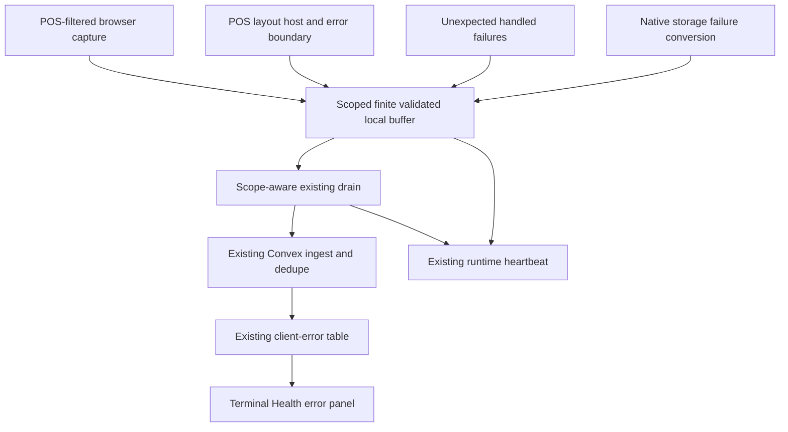
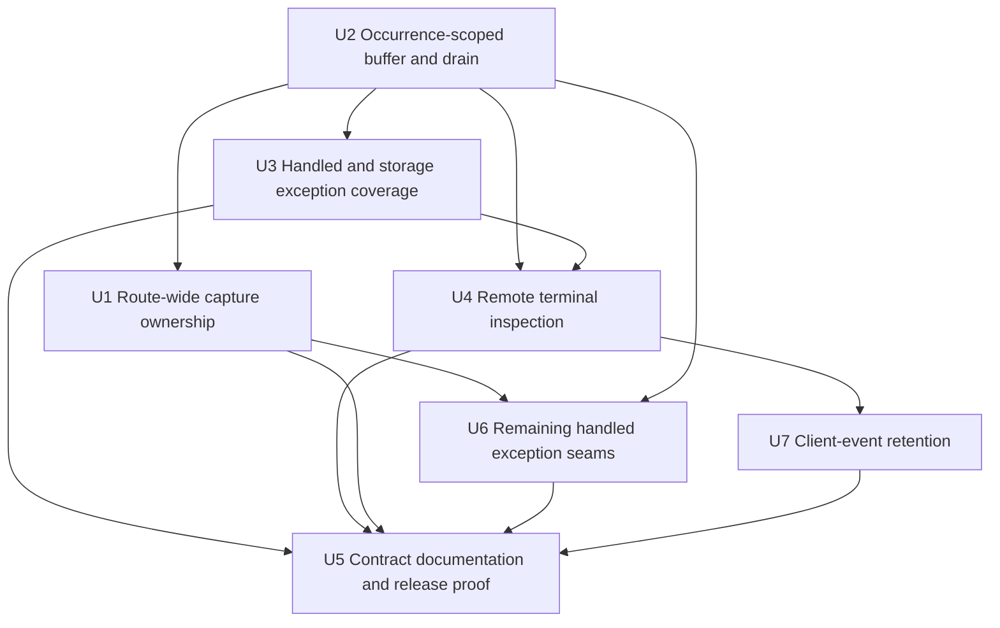
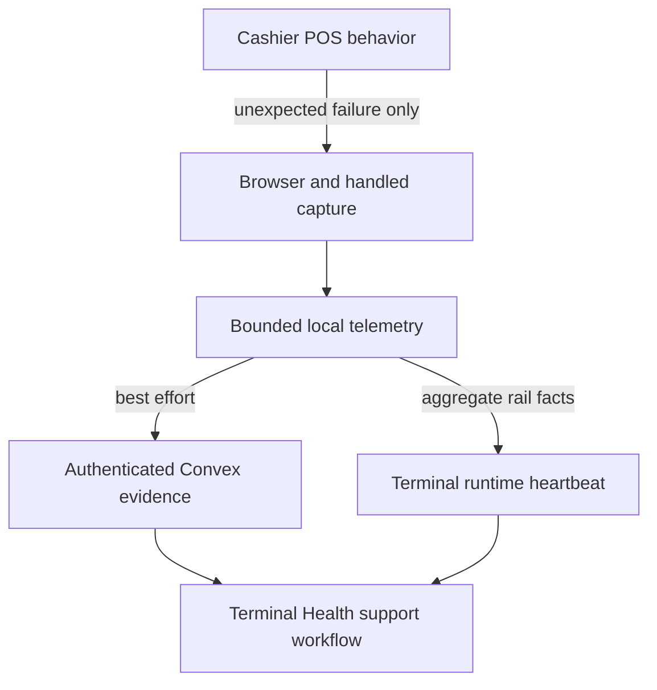

# fix: Close POS frontend telemetry gaps

## Summary

Extend Athena's existing offline POS telemetry, Convex ingest, runtime heartbeat, and Terminal Health surfaces so unexpected frontend failures can be diagnosed remotely with the store, client-reported terminal, closed route ID, build, register-session correlation, operation, and finite failure classification that existed when they occurred. The implementation repairs disconnected ownership and capture seams; it does not add a telemetry vendor, a parallel event system, or a general application-logging framework.

---

## Problem Frame

The M Supplies Register 1 drawer incident exposed a mismatch between the POS's local-first failure behavior and its remote evidence. The operator received “The drawer could not open locally,” but the native IndexedDB failure had already been flattened into a safe local-store result and no corresponding `posClientEvent` was available remotely. A full frontend audit found the same class of gap across the POS surface:

- the telemetry host is mounted only on the POS hub and register routes, leaving settings, terminals, sessions, transactions, expenses, and reports uncovered;
- the documented POS logging tee exists but is not consumed, while handled exceptions generally reach only the browser console;
- local-store failure conversion discards native error identity before the presentation layer replaces it with calm operator copy;
- buffered events acquire the current store and terminal when drained rather than the scope in which they occurred;
- route/render failures and telemetry-rail failures are not remotely visible;
- the store-wide client-event list is warning-dominated and cannot isolate one terminal; and
- raw client diagnostics have no bounded server retention policy.

The existing rail is otherwise sound: it is offline-durable, bounded, authenticated, redacted server-side, deduplicated on replay, indexed by terminal, and already surfaced in Terminal Health. This plan closes the gaps by reconnecting those rails.

---

## Requirements

- R1. Every production `/pos/**` route must share one telemetry owner and one POS error boundary, including routes added later, while the authored `?fixture=` mode remains side-effect free.
- R2. Unexpected unhandled, route-render, handled infrastructure, and typed local-storage failures must produce one bounded diagnostic event without changing the operator-facing failure copy or making telemetry a prerequisite for POS work.
- R3. Expected validation, authorization, sign-in/provisioning, conflict, offline, and ordinary command-result outcomes must not be promoted into remote exceptions.
- R4. Each new buffered event must retain its occurrence-time org/store route identity for scoping, a closed POS route ID with dynamic segments removed for diagnosis, server-authorized store when resolved, client-reported terminal/fingerprint correlation, local register session when known, online state, flow/operation, and deployed build identity across reloads, reconnects, and store or terminal changes.
- R5. Every newly buffered or ingested v2 event must use a mechanically finite diagnostic envelope with two explicit groups: (a) strictly formatted occurrence/correlation fields from R4—event ID/time, org/store scope, client-reported terminal/fingerprint/session, online state, flow/operation, build identity, and closed route ID—and (b) strictly finite failure-detail fields—a closed classification with derived copy, allowlisted standard/DOM error name with `UnknownError` fallback, recognized build asset/source identifiers plus line/column, and source-specific bounded primitive metadata keys. No v2 client message text, custom error name, dynamic route path, thrown message/stack header, business payload, customer/product/receipt text, staff proof, token, URL credential/query/fragment, or local-ledger record may be stored. Existing server rows remain schema-compatible but their raw legacy fields are suppressed from reads until retention removes them.
- R6. Scoped draining must preserve acknowledge-before-remove and replay dedupe behavior, avoid cross-store or cross-terminal attribution, isolate rejected scopes with per-scope backoff, attempt at most one oldest eligible scope per wakeup, and never create a mutation flood.
- R7. Existing runtime heartbeat evidence must distinguish an empty healthy rail, degraded storage/upload, pending scope, and absent/not-reported evidence without recursively reporting telemetry failures as client events or changing terminal authority/health solely because one event failed.
- R8. The existing authorized POS telemetry roles must be able to start from errors, isolate one client-reported terminal, and inspect enough structurally safe context to diagnose a frontend failure remotely; warnings remain available as a secondary view.
- R9. Local rows older than 30 days must be logically expired and removed on the next buffer load/enqueue/drain; persisted server diagnostics must be removed by a bounded 30-day cleanup on the existing Convex cron/self-continuation rail.
- R10. Focused tests must prove the drawer-style IndexedDB failure path end to end and protect the route, capture taxonomy, scoping, redaction, retry, remote-inspection, and retention contracts.

---

## Scope Boundaries

- Do not fix the underlying local-ledger purge or drawer reconciliation mismatch in this work; telemetry must reveal that failure, not alter its authority or recovery behavior.
- Do not introduce an external error-reporting SDK, a second transport/table, a new alert or notification system, a signature/grouping service, a sampling engine, or a general-purpose application logger replacement.
- Do not instrument every `catch`. Capture at shared raw-error boundaries and a deliberately reviewed set of exceptional seams.
- Do not capture raw business payloads, arbitrary thrown-object serialization, browser URLs with query strings, auth material, or IndexedDB records.
- Do not require lossless exactly-once behavior across concurrent tabs. The required contract is best-effort local durability, no duplicate persisted IDs, no cross-scope relabeling, and no impact on POS operation.
- Do not make telemetry or heartbeat availability an input to drawer authority, sign-in, local event append, sync, checkout, closeout, or recovery verification.

### Deferred to Follow-Up Work

- Private source-map symbolication: evaluate whether build identity plus bounded stacks are insufficient after the repaired rail has produced real production evidence.
- Fleet-level aggregation, alerting, grouping, and sampling: add only if observed volume and support workflow justify them.
- Broader non-POS frontend exception coverage: this plan deliberately preserves a POS-only ownership boundary.

---

## Context & Research

### Relevant Code and Patterns

- `packages/athena-webapp/src/routes/_authed/$orgUrlSlug/store/$storeUrlSlug/reports.tsx` demonstrates the nested TanStack layout pattern that can structurally own all child routes.
- `packages/athena-webapp/src/components/pos/PosClientTelemetryHost.tsx` and `packages/athena-webapp/src/lib/pos/infrastructure/telemetry/usePosClientTelemetryDrain.ts` already own the application error sink, browser listeners, cadence, reconnect wakeup, and backoff.
- `packages/athena-webapp/src/lib/pos/infrastructure/telemetry/telemetryBuffer.ts` provides the bounded local ring and acknowledge-after-upload lifecycle.
- `packages/athena-webapp/src/lib/pos/infrastructure/telemetry/loggerGateway.ts` already expresses the intended console-plus-remote boundary but currently has no consumers.
- `packages/athena-webapp/src/lib/pos/application/results.ts` reports unexpected thrown use-case failures before returning generic copy.
- `packages/athena-webapp/src/lib/pos/infrastructure/local/posLocalStore.ts` is the last engine-specific boundary that still sees native storage exceptions before safe conversion.
- `packages/athena-webapp/convex/pos/public/telemetry.ts` provides authenticated, redacted, replay-deduplicated ingest and level-filtered reads.
- `packages/athena-webapp/src/lib/pos/infrastructure/telemetry/runtimeCounters.ts` already rides bounded diagnostic counters through `usePosLocalSyncRuntime` into the terminal heartbeat.
- `packages/athena-webapp/src/components/pos/terminals/PosClientErrorsPanel.tsx` and `POSTerminalDetailView.tsx` are the existing support surfaces to extend.
- `packages/athena-webapp/convex/marketing/landingFunnelRetention.ts` and `packages/athena-webapp/convex/crons.ts` demonstrate bounded, self-continuing retention on the shared cron rail.

### Institutional Learnings

- `docs/solutions/architecture-patterns/athena-pos-observability-write-riding-telemetry-2026-07-19.md` requires reuse of the bounded offline buffer, FIFO-prefix replay dedupe, server redaction, and write-riding heartbeat while avoiding polling and duplicate event systems.
- `docs/solutions/design-patterns/athena-pos-browser-lifecycle-diagnostics-2026-08-08.md` requires primitive-only bounded metadata, non-perturbing capture, explicit correlation, and protection of error capacity from noisy warnings.
- `docs/solutions/architecture-patterns/athena-pos-storage-engine-neutral-boundary-2026-07-10.md` keeps native IndexedDB mechanics below the local-store facade while allowing semantic failures and allowlisted health evidence upward.
- `docs/solutions/design-patterns/athena-pos-storage-health-actionability-2026-08-13.md` separates individual exception evidence from aggregate rail health and forbids treating a diagnostic fact as authority.
- `docs/solutions/architecture/athena-pos-terminal-health-visibility-2026-05-20.md` and `docs/solutions/architecture/athena-pos-runtime-decoupling-boundaries-2026-06-15.md` require best-effort observability to remain independent of register commands and recovery.

### External References

- None. The repository contains recent, direct patterns for all affected layers; external patterns would add little and risk pulling the plan away from Athena's local-first and Convex read-budget constraints.

---

## Key Technical Decisions

| Decision | Chosen approach | Why |
| --- | --- | --- |
| POS ownership | Add one POS parent layout with the host, outlet, and POS-specific error component | Structurally covers current and future POS routes without coupling diagnostics to the whole authenticated shell |
| Early browser capture | Install one idempotent POS-path-filtered browser listener from app bootstrap; keep the route boundary for React-caught errors | Closes the pre-effect gap while retaining the current buffer and recovery UI |
| Context timing | Stamp immutable query-free org/store route identity at enqueue; attach store/terminal context only while an owner-tokened host registry matches that route | Prevents bootstrap and mount/unmount races from relabeling earlier failures |
| Terminal correlation | Stamp the local seed's cloud terminal ID and fingerprint at occurrence time; retain the existing server check that the reported terminal belongs to the store and label the evidence client-reported | Fixes drain-time relabeling without adding a credential-sensitive upload protocol |
| Drain shape | Attempt one oldest eligible recorded scope per wakeup, preserve order within that scope, use per-scope backoff, and remove sent IDs only after a full accepted-or-duplicate acknowledgement | Preserves mutation cadence and the ingest prefix-replay invariant while preventing head-of-line blocking across scopes |
| Handled failures | Use the existing POS telemetry gateway only for unexpected exceptions and a small reviewed set of broken-continuity warnings | Repairs the documented contract without turning normal POS outcomes into noise |
| Storage failures | Report at the local-store conversion seam while the native cause exists, with an internal operation label supplied by the caller | Preserves engine-neutral safe results and generic drawer copy without instrumenting dozens of catches independently |
| Privacy | Strictly validate R4 occurrence/correlation fields; for failure-detail content persist only closed classifications, allowlisted error names, recognized build-source identifiers, line/column, and source-specific primitive metadata, with display copy derived outside the event input | Makes the privacy guarantee validator-enforceable without dropping the context required for diagnosis |
| Rail health | Add bounded counters/status facts to the existing runtime heartbeat | Avoids recursive telemetry and a new health document |
| Remote workflow | Extend the existing panel/query/role contract, default to errors, add terminal filtering with a terminal+level index, and reuse the existing detail sheet | Closes the support gap without a second read API, new permission model, dashboard, or grouping system |
| Retention | Expire local rows during the existing buffer lifecycle and add bounded 30-day server cleanup on the existing cron rail | Bounds dormant/local evidence on next use and server evidence continuously without a new scheduler |

### Capture taxonomy

| Outcome | Remote client event? | Evidence owner |
| --- | --- | --- |
| Unexpected thrown use-case or infrastructure exception | Yes | Lowest shared boundary with raw cause and operation context |
| IndexedDB initialization/commit/corruption/quota failure | Yes | Local-store safe-conversion boundary |
| Route-render error | Yes, once | POS route error component |
| `window.error` / unhandled rejection on a POS path | Yes | Bootstrap listener |
| Expected validation, authorization, conflict, offline, or ordinary command-result failure | No | Existing typed result, readiness state, toast, or operator UI |
| Telemetry buffer/drain failure | No recursive event | Runtime counters/heartbeat |

---

## Open Questions

### Resolved During Planning

- How should a permanently rejected old scope behave? It remains bounded by the 200-event ring, receives per-scope backoff, is reflected in rail-health facts, and is skipped while other valid scopes drain. It is not silently relabeled or allowed to cause head-of-line blocking.
- How should legacy v1 unscoped rows behave? They are decoded as quarantined v1 rows and never uploaded because v1 stored no trustworthy tenant route. They share ring pressure with v2 events, increment a quarantine gauge, and are removed locally at the 30-day boundary rather than guessed into a store.
- How should a new bootstrap event captured before host resolution behave? It records the immutable query-free org/store route pair and remains pending-scope until an owner-tokened host resolves that exact pair to an authorized store. Navigation to another pair cannot claim it.
- What is the trust level of terminal attribution? The occurrence envelope records the local seed's cloud terminal ID/fingerprint as client-reported correlation. The server still requires authenticated org access and verifies that a reported terminal belongs to the submitted store; the UI/docs never present it as proof of terminal authorship.
- Who may inspect diagnostics? Preserve the current backend role contract (`full_admin` and `pos_only`) and the existing panel/detail behavior. Because the new envelope excludes arbitrary thrown/business text structurally, this work does not introduce a second authorization model or summary/detail API.
- What guarantee is required across concurrent tabs? Best-effort durability with server-side ID dedupe, no cross-scope attribution, and no removal of unrelated IDs. A new cross-tab coordination protocol is not justified.
- How are routes retained without record identifiers? The envelope maps current POS paths to a closed route ID (`hub`, `register`, `sessions`, `transactions`, `transaction_detail`, `expense`, `expense_reports`, `expense_report_detail`, `settings`, `terminals`, `terminal_detail`, or `unknown_pos_route`). The exact org/store route pair is held separately for pending-scope matching and is never presented as a diagnostic pathname.
- How do old clients and stored rows survive rollout? Ingest temporarily accepts a separate legacy wire branch, discards all legacy message/error/stack/dynamic-path text, and persists a derived `legacy_client_event` classification. Existing stored rows keep their current required schema fields plus optional new classification/source fields; reads suppress legacy raw fields and label them “Legacy client event.” No backfill is required, and U7 ages them out. Remove the compatibility branch only after production evidence shows no legacy-client ingests across the supported client-adoption window.
- Should warnings remain visible? Yes, behind an explicit secondary level filter. Store and terminal views start from errors so warning volume cannot displace the primary support workflow.
- Should one client exception change terminal health? No. Rail-health facts are diagnostic; only the existing actionable health predicates may affect the terminal's health classification.

### Deferred to Implementation

- The exact internal operation labels for local-store methods should be finalized while adding characterization tests; labels must be stable, bounded, and must not include record identifiers.
- If current build metadata exposes both app version and SHA, implementation may keep one in the existing `appVersion` field and the other in bounded metadata; no schema field is required solely for naming preference.

---

## High-Level Technical Design

*This illustrates the intended approach and is directional guidance for review, not implementation specification. The implementing agent should treat it as context, not code to reproduce.*

The exception-detail rail and health rail stay separate: individual errors drain through `posClientEvent`; aggregate evidence about buffer fallback, drops, rejection, and upload failure rides the existing terminal runtime heartbeat.

---

## Implementation Units

### Delivery sequence

1. **Incident vertical slice — U2, U3, U4:** establish the safe scoped envelope, capture the drawer/native-storage failure on the already-hosted register route, and prove an authorized support user can diagnose it remotely from the existing Terminal Health workflow.
2. **Surface-wide closure — U1, U6:** move ownership to the POS parent, cover early/render errors, and reconnect only the remaining exact handled seams identified by the audit.
3. **Operational completion — U7, U5:** enforce local/server retention, correct the observability contract, run the production-build support exercise, and finish repository validation.

- U2. **Stamp occurrence context and drain scoped batches safely**

  **Goal:** Establish the safe event envelope, immutable client-reported scope, and drain protocol before attaching new capture producers.

  **Requirements:** R4, R5, R6, R7, R10

  **Dependencies:** None

  **Files:**

  - Modify `packages/athena-webapp/src/components/pos/PosClientTelemetryHost.tsx`
  - Create `packages/athena-webapp/src/lib/pos/infrastructure/telemetry/telemetryContext.ts`
  - Create `packages/athena-webapp/src/lib/pos/infrastructure/telemetry/telemetryContext.test.ts`
  - Modify `packages/athena-webapp/src/lib/pos/infrastructure/telemetry/telemetryBuffer.ts`
  - Modify `packages/athena-webapp/src/lib/pos/infrastructure/telemetry/telemetryBuffer.test.ts`
  - Modify `packages/athena-webapp/src/lib/pos/infrastructure/telemetry/usePosClientTelemetryDrain.ts`
  - Modify `packages/athena-webapp/src/lib/pos/infrastructure/telemetry/usePosClientTelemetryDrain.test.ts`
  - Modify `packages/athena-webapp/src/lib/pos/infrastructure/telemetry/runtimeCounters.ts`
  - Modify `packages/athena-webapp/src/lib/pos/infrastructure/telemetry/runtimeCounters.test.ts`
  - Create `packages/athena-webapp/shared/posDiagnosticRedaction.ts`
  - Modify `packages/athena-webapp/convex/pos/application/diagnosticRedaction.ts`
  - Modify `packages/athena-webapp/convex/pos/public/telemetry.ts`
  - Modify `packages/athena-webapp/convex/pos/public/telemetry.test.ts`

  **Approach:** Introduce an in-place versioned decoder under the existing storage key: new records carry `version: 2`; valid unversioned v1 rows decode as `legacy_unscoped`; invalid individual rows are dropped and counted; invalid JSON/read failures retain the current memory fallback and count degradation. Normalize the stored array on the next successful write rather than adding a migration transaction. v1, pending, and scoped v2 rows share the 200-row cap and stable order. Every load/enqueue/drain removes rows strictly older than 30 days while retaining rows exactly at the boundary.

  Define a positive allowlisted v2 event envelope. At enqueue, record a query-free org/store route pair only for pending-scope matching, map the visible path to a closed POS route ID with all dynamic segments removed, and retain online state, initial build identity, explicit operation/session context, and only source-specific primitive metadata keys. An owner-tokened registry may add the server-authorized store plus the seed's client-reported cloud terminal ID/fingerprint only while its route pair is current; stale cleanup cannot clear a newer owner. Replace client `message` text with a closed classification validator shared by client/server; UI and server presentation derive restrained display copy from that classification. U2 owns the finite unhandled window/rejection/runtime classifications needed by the first production support exercise; U3 owns storage/drawer classifications and U6 owns its exact later seams. Map mutable `Error.name` through an explicit standard/DOM allowlist with `UnknownError` fallback. Reduce stack locations to recognized build asset/source identifiers plus bounded line/column—never a dynamic application route or stack header. Constrain IDs/build/operation to strict formats, drop unknown keys, and retain server validation/redaction as defense in depth. Do not serialize non-`Error` throws or arbitrary object values.

  Preserve brownfield compatibility. Keep existing required persisted fields and add optional `version`, `classification`, route ID, and bounded source-location fields so current rows remain schema-valid. New v2 ingest accepts classification rather than client message and derives the required stored `message` from the closed server mapping; it omits `errorMessage`/`errorStack`. During a bounded rollout window, a separate legacy wire-validator branch accepts old production clients, applies the same auth/dedupe, discards every legacy message/error/stack/metadata/dynamic-path value, and persists only `legacy_client_event` plus safe batch context. Existing classification-less rows are returned as derived legacy diagnostics with raw fields suppressed and age out through U7 without backfill. Track legacy-branch use through existing bounded runtime/operational evidence and remove the branch in follow-up only after no legacy ingest is observed across the supported client-adoption window.

  Drain grouping uses recorded `storeId + reportedCloudTerminalId-or-none + fingerprint-or-none`. Each wakeup selects at most one oldest eligible scope, preserves order within it, and submits at most 50 events. Reuse the current server contract: authenticate org access and verify that any reported terminal belongs to the submitted store, while treating fingerprint/session as client correlation. Backoff is per scope. Remove only submitted IDs after `accepted + duplicates` equals the submitted count; later events remain behind a rejected prefix. Legacy v1 rows are never uploaded. New pending-scope events may be released only when the exact recorded org/store route pair resolves to the authorized store.

  Extend the existing heartbeat map with bounded numeric gauges/timestamps: `telemetry.bufferDepth`, `telemetry.pendingScopeCount`, `telemetry.legacyQuarantineCount`, `telemetry.droppedCount`, `telemetry.storageFallbackCount`, `telemetry.uploadFailureCount`, `telemetry.lastAcceptedAt`, and `telemetry.lastFailureAt`. Add a best-effort setter beside the counter incrementer. Missing keys mean “Not reported,” never inferred zero; these values remain diagnostic and do not alter authority or health classification.

  **Patterns to follow:** Current error sink registry; `telemetryBuffer` never-throw contract; `localPosEntryContext`; current telemetry store/terminal membership validation; runtime build metadata; runtime counters; server diagnostic redaction; prefix-replay dedupe.

  **Test scenarios:**

  - An event captured offline includes its immutable org/store route pair for scoping, closed dynamic-free POS route ID for diagnosis, authorized store and client-reported terminal/fingerprint correlation when available, build, and `online=false`; reload/reconnect preserves those values.
  - A stale host unmount cannot clear a newer context owner, and navigation from Store A to Store B cannot attach Store A context to a Store B route event.
  - A pre-host event is quarantined and later released only by the exact org/store route pair; an ambiguous or changed route remains local.
  - The decoder preserves valid unversioned v1 rows as quarantined, writes new rows as v2, keeps mixed ordering/cap behavior, drops/counts invalid rows, and uses memory fallback for invalid JSON/read failure.
  - Local expiry retains rows exactly 30 days old and drops older legacy, pending, and scoped rows without upload.
  - Events before and after a store/terminal change drain separately with their original attribution.
  - Each wakeup sends only the oldest eligible scope; a rejected scope enters its own backoff while a later wakeup may service another scope.
  - Successful full acknowledgement removes only sent IDs; partial count, thrown mutation, user-error result, or lost acknowledgement retains the full prefix.
  - Replay of a grouped batch produces no duplicates and does not remove unrelated IDs; later events in a failed scope do not jump its prefix.
  - Concurrent-tab drains of the same IDs are harmless under server dedupe; no test claims perfect no-loss localStorage concurrency.
  - Reported terminal/store mismatch is rejected and retained with per-scope backoff; same-store terminal/fingerprint/session values persist only as clearly labeled client-reported correlation.
  - Client storage and server ingest accept only the closed classification set, allowlisted error names, recognized build-source identifiers, line/column, and source-specific metadata keys; client message text is not an input.
  - An interpolated producer message, custom mutable error name, same-origin dynamic transaction/customer path, thrown message/header, cross-origin frame, and URL credential/query/fragment never reach localStorage or Convex; they map to derived copy, `UnknownError`, or no source location.
  - An old message-bearing client can upload to the new server: authorization and dedupe still apply, all unsafe legacy fields are discarded, and the row is stored as `legacy_client_event` with derived copy.
  - Existing classification-less server rows and new v2 rows both validate/query; legacy reads suppress raw historical message/error/stack/metadata, the UI labels them legacy, and retention requires no backfill.
  - Oversized batches, identifiers, strings, keys, values, and non-`Error` thrown objects are rejected or bounded before expensive iteration and never persist raw values.
  - Buffer depth, pending/quarantine counts, drops, fallback, upload failure, last accepted, and last failure use the named heartbeat keys; missing evidence renders “Not reported,” while localStorage failure and overflow remain non-recursive and never break POS.

  **Verification:** Both client and server validators mechanically exclude open-ended diagnostic text before new producers use the envelope; events retain immutable authorized store and explicitly client-reported terminal correlation, retries preserve prefix dedupe/removal semantics, and rail degradation rides the existing heartbeat.

- U1. **Establish route-wide and early POS capture ownership**

  **Goal:** Ensure every POS route, route-render failure, and POS-path browser exception reaches one existing telemetry buffer without duplicate hosts or fixture side effects.

  **Requirements:** R1, R2, R10

  **Dependencies:** U2

  **Files:**

  - Create `packages/athena-webapp/src/routes/_authed/$orgUrlSlug/store/$storeUrlSlug/pos.tsx`
  - Create `packages/athena-webapp/src/routes/_authed/$orgUrlSlug/store/$storeUrlSlug/pos.route.test.tsx`
  - Modify `packages/athena-webapp/src/routes/_authed/$orgUrlSlug/store/$storeUrlSlug/pos/index.tsx`
  - Modify `packages/athena-webapp/src/routes/_authed/$orgUrlSlug/store/$storeUrlSlug/pos/register.index.tsx`
  - Modify `packages/athena-webapp/src/components/pos/PosClientTelemetryHost.tsx`
  - Create `packages/athena-webapp/src/lib/pos/infrastructure/telemetry/browserErrorCapture.ts`
  - Create `packages/athena-webapp/src/lib/pos/infrastructure/telemetry/browserErrorCapture.test.ts`
  - Create `packages/athena-webapp/src/lib/pos/application/expectedTelemetryOutcome.ts`
  - Create `packages/athena-webapp/src/lib/pos/application/expectedTelemetryOutcome.test.ts`
  - Modify `packages/athena-webapp/src/lib/pos/infrastructure/telemetry/usePosClientTelemetryDrain.ts`
  - Modify `packages/athena-webapp/src/main.tsx`
  - Regenerate `packages/athena-webapp/src/routeTree.gen.ts`

  **Approach:** Add a pathful POS parent layout that owns the outlet and telemetry composition. Reuse the existing development fixture resolver at the layout boundary: while a named fixture resolves, or when it resolves to an authored fixture, render the outlet without mounting the host, active-store hook, sink, or drain; absent and unknown fixture names preserve today's live behavior. Otherwise mount the host once and remove the hub/register mounts. Extract one code-first expected-outcome classifier from existing typed auth/session/offline/conflict semantics and use it at the route boundary, application sink, and bootstrap listeners. Coded expected outcomes delegate without telemetry; unknown or unstructured render/module-load/runtime failures report once before using the same recovery UI.

  Move `window.error` and `unhandledrejection` ownership into one idempotent bootstrap installer. The installed listener evaluates the current pathname and resolved fixture state on every event, so navigation into or out of POS changes capture immediately; it sanitizes browser filenames to a same-origin query-free pathname and sends pre-host events into U2's route-pair quarantine. The hook remains responsible for the Convex drain and application sink, not global listener lifetime.

  **Execution note:** Characterize fixture behavior and current route composition before moving ownership.

  **Patterns to follow:** The reports parent layout for route structure; `DefaultCatchBoundary` for recovery; current print-rejection enrichment for bounded browser metadata.

  **Test scenarios:**

  - Rendering the parent route mounts one telemetry host and the child outlet; hub and register children no longer mount additional hosts.
  - The current hub, register, sessions, transactions/detail, expenses/reports/detail, settings, terminals/detail route inventory all descend from the POS parent; a future route-tree change that bypasses it fails the route test.
  - A genuine child render/module-load error enqueues one POS event and still renders the established recovery UI; repeated boundary rendering does not duplicate it.
  - Coded shared-demo expiry and other classified auth/session outcomes use existing renewal/recovery behavior and produce no client event.
  - Pre-effect unhandled rejections carrying coded auth, session, offline, validation, or conflict outcomes produce no event; an unknown/unstructured rejection is captured.
  - A POS-path `window.error` and unhandled rejection occurring before React effects enqueue through the existing buffer.
  - Navigation non-POS→POS enables capture and POS→non-POS disables it without reinstalling listeners; resolved authored fixture mode remains excluded per event.
  - Cross-origin filenames and URLs containing credentials/query/fragment are reduced to safe bounded source metadata.
  - A resolving or valid authored fixture causes no host, store query, sink, event, or drain; absent/empty/unknown fixture names retain current live behavior.
  - Installing capture twice is idempotent and cleanup does not remove a newer owner.

  **Verification:** All POS route modules share one structural owner, early browser errors and React-caught errors are covered exactly once, and fixture/non-POS behavior remains unchanged.

- U3. **Capture drawer and native storage failures end to end**

  **Goal:** Prove the initiating drawer incident can retain safe native storage evidence remotely while keeping operator copy and local authority unchanged.

  **Requirements:** R2, R3, R5, R10

  **Dependencies:** U2

  **Files:**

  - Modify `packages/athena-webapp/src/lib/pos/application/errorTelemetry.ts`
  - Modify `packages/athena-webapp/src/lib/pos/application/results.ts`
  - Modify `packages/athena-webapp/src/lib/pos/application/results.test.ts`
  - Modify `packages/athena-webapp/src/lib/pos/application/posLocalStorePort.ts`
  - Modify `packages/athena-webapp/src/lib/pos/application/posLocalStorePort.test.ts`
  - Modify `packages/athena-webapp/src/lib/pos/infrastructure/local/posLocalStore.ts`
  - Modify `packages/athena-webapp/src/lib/pos/infrastructure/local/posLocalStore.test.ts`
  - Modify `packages/athena-webapp/src/lib/pos/infrastructure/local/localCommandGateway.ts`
  - Modify `packages/athena-webapp/src/lib/pos/infrastructure/local/localCommandGateway.test.ts`
  - Modify `packages/athena-webapp/src/lib/pos/presentation/register/useRegisterViewModel.ts`
  - Modify `packages/athena-webapp/src/lib/pos/presentation/register/useRegisterViewModel.test.ts`
  - Modify `packages/athena-webapp/src/lib/pos/presentation/register/registerDrawerPresentation.test.ts`

  **Approach:** Make the application error report flow-aware instead of hard-coding checkout. Add an optional, non-persisted diagnostic context argument to the local-store `appendEvent` port; `localCommandGateway.openDrawer` supplies static `flow=register` / `operation=openDrawer`, and the adapter consumes it only inside the append catch/safe-conversion report. It must never enter `PosLocalAppendEventInput` or the ledger record. Other local-store methods use fixed method-level labels at their own catch sites; caller overrides are reserved for composite commands where the storage method name is insufficient. At conversion, emit the closed local-storage classification, allowlisted error name/fallback, recognized build-source frames, storage engine, and access mode before returning the unchanged engine-neutral result. Never persist native free-text message, custom name, dynamic route, or stack header, and never report again after drawer presentation normalizes the copy.

  **Execution note:** Begin with the drawer failure characterization and a catch inventory that explicitly classifies each migrated site as unexpected or expected.

  **Patterns to follow:** `mapThrownError`'s raw-detail/generic-copy split; existing `loggerGateway`; local-store engine-neutral safe results; register drawer presentation normalization.

  **Test scenarios:**

  - An IndexedDB `AbortError` during `openDrawer` preserves the existing “drawer could not open locally” operator result and emits exactly one error event with storage/register flow, `openDrawer`, safe storage code, IndexedDB engine, `readwrite` access mode, native name, safe same-origin frames, and occurrence context—without its free-text message.
  - No ledger event, cart, receipt, customer, product, payment, staff proof, or record identifier appears in the captured drawer diagnostic.
  - The static drawer diagnostic context labels the emitted event but is absent from the append input and persisted local ledger record.
  - Schema-version, missing-store, quota/commit, and unknown native failures retain their existing safe result codes while producing the appropriate bounded unexpected diagnostic.
  - `mapThrownError` reports an unknown throw with the caller's flow/operation and still returns generic copy; known expected thrown messages return conflict without remote reporting.
  - Expected validation, missing sign-in/provisioning, authorization, conflict, and offline outcomes across reviewed seams produce zero client events.

  **Verification:** The drawer integration produces exactly one safely classified event with occurrence scope and unchanged copy; storage-engine neutrality and expected business outcomes remain intact.

- U4. **Make existing Terminal Health inspection actionable**

  **Goal:** Complete the first vertical support outcome by letting support isolate and understand a named terminal's recent frontend error.

  **Requirements:** R7, R8, R10

  **Dependencies:** U2, U3

  **Files:**

  - Modify `packages/athena-webapp/convex/schemas/pos/posClientEvent.ts`
  - Modify `packages/athena-webapp/convex/schema.ts`
  - Modify `packages/athena-webapp/convex/pos/public/telemetry.ts`
  - Modify `packages/athena-webapp/convex/pos/public/telemetry.test.ts`
  - Modify `packages/athena-webapp/src/components/pos/terminals/PosClientErrorsPanel.tsx`
  - Modify `packages/athena-webapp/src/components/pos/terminals/PosClientErrorsPanel.test.tsx`
  - Modify `packages/athena-webapp/src/components/pos/terminals/POSTerminalDetailView.tsx`
  - Modify `packages/athena-webapp/src/components/pos/terminals/POSTerminalDetailView.test.tsx`

  **Approach:** Preserve the existing authenticated `listClientEvents` query, `full_admin`/`pos_only` role contract, response shape, and in-panel selected-event detail. Add optional terminal/level filtering through `by_store_terminal_level_received` while preserving existing store/level paths. For classification-less historical rows, derive the legacy label and suppress raw stored message/error/stack/metadata in the returned projection. Default to a two-option Errors/Warnings `aria-pressed` group—remove All so warnings cannot crowd the primary window. Rows remain keyboard-operable buttons for existing authorized users and show severity, derived classification copy, terminal label when store-scoped, closed route ID/build when space allows, and occurred time; selection opens the existing detail state with full structurally safe context and restores focus to the originating row on Back/close.

  Preserve actionable health and recovery hierarchy. In terminal detail, place one “Client diagnostics” section after Attention/Conflict evidence and before Support notes; show a compact rail-health explanation above the list only when degraded or not reported. Keep the existing store-health metric-tile entry point opening the same sheet—no new cards or dashboard. Retain current full-width-mobile/right-sheet-desktop behavior, announce loading/query-failure/empty states, and use distinct “No client errors reported” / “No client warnings reported” copy. “Not reported” is distinct from zero and query failure.

  **Patterns to follow:** Existing terminal detail sheets/metric tiles; current operation-admitted telemetry read and role checks; indexed terminal reads.

  **Test scenarios:**

  - The store panel defaults to errors; warnings are available explicitly and cannot consume the initial error result window.
  - Terminal detail requests only the selected store/terminal and can isolate M Supplies Register 1-equivalent data.
  - Errors and Warnings are the only level choices; each has distinct empty copy and warnings cannot enter the default error window.
  - The existing authorized roles and list-to-detail interaction remain intact; unauthorized and cross-store terminal queries return no evidence.
  - Event detail renders the client-reported terminal/fingerprint/session as correlation—not proof—plus closed route ID, build, flow/operation, allowlisted error name/classification, occurred/received times, safe source locations, and allowlisted metadata.
  - Summary buttons, back/close focus restoration, announced loading/error/empty states, and existing mobile/desktop sheet behavior remain accessible.
  - Terminal detail keeps recovery/attention/conflict evidence ahead of Client diagnostics, while the store metric tile reuses the same sheet and no new dashboard surface appears.
  - A terminal with many warnings still returns recent errors through the terminal+level index without scanning warning history.
  - Rail-health counters display as diagnostic facts or `not reported`; a missing heartbeat is never presented as healthy and a single exception does not change terminal authority.
  - Against a production build, a drawer `AbortError` and one representative generic render/runtime exception allow support—using Terminal Health only—to identify flow/operation, build, client-reported terminal/session, and an actionable failure category.

  **Verification:** An existing authorized support user can diagnose the drawer failure and a generic production-build exception without browser access. If the finite U2 runtime/render classifications plus U3 storage classification and production source locations do not meet that bar, strengthen those closed classifications before completing U4; private symbolication remains a follow-up only if finite classifications still prove insufficient.

- U6. **Reconnect the remaining exact handled-exception seams**

  **Goal:** Route the audit's identified continuity-breaking handled exceptions through the existing POS telemetry facade without expanding into a general logger migration.

  **Requirements:** R2, R3, R5, R10

  **Dependencies:** U1, U2

  **Files:**

  - Modify `packages/athena-webapp/src/lib/pos/infrastructure/telemetry/loggerGateway.ts`
  - Modify `packages/athena-webapp/src/lib/pos/toastService.ts`
  - Create `packages/athena-webapp/src/lib/pos/toastService.telemetry.test.ts`
  - Modify `packages/athena-webapp/src/lib/pos/presentation/expense/useExpenseRegisterViewModel.ts`
  - Modify `packages/athena-webapp/src/lib/pos/presentation/expense/useExpenseRegisterViewModel.test.ts`
  - Modify `packages/athena-webapp/src/components/pos/expense-reports/ExpenseReportView.tsx`
  - Modify `packages/athena-webapp/src/components/pos/expense-reports/ExpenseReportView.test.tsx`
  - Modify `packages/athena-webapp/src/components/pos/settings/POSSettingsView.tsx`
  - Modify `packages/athena-webapp/src/components/pos/settings/POSSettingsView.test.tsx`
  - Modify `packages/athena-webapp/src/components/pos/NewTransactionView.tsx`
  - Create `packages/athena-webapp/src/components/pos/NewTransactionView.test.tsx`
  - Modify `packages/athena-webapp/src/components/pos/register/ExpenseCompletionPanel.tsx`
  - Modify `packages/athena-webapp/src/components/pos/register/ExpenseCompletionPanel.test.tsx`
  - Modify `packages/athena-webapp/src/components/pos/OrderSummary.tsx`
  - Modify `packages/athena-webapp/src/components/pos/OrderSummary.test.tsx`

  **Approach:** Use `loggerGateway` only in the exact files above for exception branches where persistence, printing, transaction start, settings recovery, or background continuity unexpectedly breaks. Keep ordinary failed results, validation warnings, authorization, conflicts, and offline outcomes on their existing typed/local paths. Each producer selects from the closed flow/operation/classification contract; display copy is derived, error names are allowlisted/fallback, and only recognized build-source locations survive. Do not add a directory-wide catch inventory, logger replacement, or source-policy test.

  **Patterns to follow:** U3's error normalization; the existing gateway's console-plus-buffer behavior; the shared expected-outcome classifier from U1.

  **Test scenarios:**

  - Each named exception branch logs locally and enqueues exactly one event with its closed flow/operation/classification and occurrence scope; UI copy is derived from classification.
  - Ordinary failed results and representative validation, authorization, offline, and conflict outcomes in the same files produce no client event.
  - Customer/product/receipt sentinels embedded in thrown messages do not reach buffered or persisted fields; allowlisted error name and recognized build-source location remain.
  - Print-specific unhandled rejection enrichment continues to correlate with the existing print attempt without duplicating the handled event.

  **Verification:** All exact audit-identified handled seams are remotely visible and quiet for expected outcomes, with no open-ended logging migration or policy framework.

- U7. **Expire local and server client-event evidence**

  **Goal:** Enforce the 30-day diagnostic retention boundary through the existing local buffer lifecycle and Convex cron rail.

  **Requirements:** R5, R9, R10

  **Dependencies:** U2, U4

  **Files:**

  - Modify `packages/athena-webapp/src/lib/pos/infrastructure/telemetry/telemetryBuffer.ts`
  - Modify `packages/athena-webapp/src/lib/pos/infrastructure/telemetry/telemetryBuffer.test.ts`
  - Modify `packages/athena-webapp/convex/schemas/pos/posClientEvent.ts`
  - Modify `packages/athena-webapp/convex/schema.ts`
  - Create `packages/athena-webapp/convex/pos/application/clientEventRetention.ts`
  - Create `packages/athena-webapp/convex/pos/application/clientEventRetention.test.ts`
  - Modify `packages/athena-webapp/convex/crons.ts`
  - Modify `packages/athena-webapp/convex/crons.test.ts`

  **Approach:** Keep U2's local expiry in the existing load/enqueue/drain lifecycle. Add one global received-time index and one bounded, self-continuing internal cleanup scheduled on the existing cron rail. Delete server rows where `receivedAt < fixedNow - 30 days` in capped batches and carry the same `fixedNow` through every continuation. A failed or interrupted chain leaves remaining rows for the next scheduled pass.

  **Patterns to follow:** Existing telemetry ring lifecycle; marketing bounded retention and shared cron registration.

  **Test scenarios:**

  - Local and server retention keep rows exactly at the 30-day boundary and remove only strictly older legacy, pending, scoped, and persisted rows.
  - Server cleanup deletes no more than the batch cap, schedules immediate continuation for a full batch, carries fixed `now`, and stops when complete.
  - Cron registration occurs once; an interrupted continuation is safely recovered by the next run.

  **Verification:** Local profiles and Convex cannot retain client diagnostics past the documented window once their bounded cleanup lifecycle runs, and cleanup adds no new scheduler or retention subsystem.

- U5. **Correct the observability contract and prove the integrated behavior**

  **Goal:** Make documentation match actual selective capture and finish with focused, cross-layer proof before repository gates.

  **Requirements:** R1, R2, R3, R4, R5, R6, R7, R8, R9, R10

  **Dependencies:** U1, U3, U4, U6, U7

  **Files:**

  - Modify `docs/operations/pos-observability-v1.md`
  - Add or update a reusable solution under `docs/solutions/` only if implementation uncovers a durable pattern not already captured by the cited observability notes
  - Regenerate Graphify-owned artifacts after code changes
  - No additional integration test file: this unit composes the named U1-U4, U6, and U7 suites as one focused cross-layer validation slice

  **Approach:** Replace the stale “every warning/error” and limited-route claims with the selective exception taxonomy, route/bootstrap ownership, occurrence-time scoping, structurally safe client/server envelope, rail-health counters, remote support workflow, and 30-day local/server retention policy. Compose the exact test files already named in U1-U4, U6, and U7 into a focused cross-layer validation slice; do not create a duplicate integration harness. Then follow the package validation ladder and root merge-ready authority; do not substitute a hand-built broad suite for `pr:athena`.

  **Patterns to follow:** Agent testing guide's focused-sensor ladder; POS observability operations guide; repository-owned Graphify and PR validation flow.

  **Test scenarios:**

  - Integrated drawer characterization: injected IndexedDB `AbortError` leads to unchanged generic operator copy and one redacted, scoped, remotely queryable error with native classification.
  - Integrated offline path: capture, reload, reconnect, acknowledged persistence, ID dedupe, and removal preserve occurrence context.
  - Integrated taxonomy: representative expected business outcomes create no client event while representative unexpected handled, unhandled, route-render, and storage failures each create one.
  - Integrated remote workflow: error-first store view and selected-terminal detail expose enough context to identify closed route ID/build/session/storage operation.
  - Generated route tree and Graphify artifacts reflect the new parent route and code dependencies without hand edits.

  **Verification:** Focused Vitest/Convex suites pass; changed Convex code passes `audit:convex`, `lint:convex:changed`, and operation-admission coverage; frontend changes pass the changed-frontend lint, typecheck, and production build; generated artifacts are fresh; `pr:athena` is the final merge-ready authority.

---

## System-Wide Impact

- **Cashiers:** Operator copy, command authority, and local-first continuation remain unchanged. Telemetry failure cannot block a sale or drawer operation.
- **Support and administrators:** Terminal Health gains error-first, terminal-scoped evidence with occurrence and receipt context; no new dashboard or notification channel is introduced.
- **POS developers:** Unexpected handled exceptions at the exact audited seams use an explicit facade; expected outcomes remain typed/local. The operations guide becomes the classification contract.
- **Local state:** The bounded buffer stores immutable scope and finite validated v2 fields. Legacy rows are quarantined, and both ring pressure and 30-day expiry bound local evidence.
- **Convex:** Existing ingest/read authorization, redaction, response shape, and dedupe remain authoritative. One terminal+level index and one retention index are added, and cleanup stays bounded.
- **Failure propagation:** Capture and upload are best effort. Failures become counters/backoff, never recursive events or user-facing command failures.
- **Privacy:** Client redaction reduces local-at-rest exposure; server redaction remains defense in depth. Tests use sentinels to prove forbidden data is absent.

---

## Risks & Dependencies

- **FIFO replay invariant under scoped batching:** Each wakeup must select one oldest eligible scope, preserve its prefix, and remove only after a full accepted-plus-duplicate acknowledgement. Protect with partial-ack, ack-loss, replay, mixed-scope, and unrelated-ID tests.
- **Global listener and sink ownership:** Bootstrap capture and React ownership can duplicate events or attach stale context. Gate every event by the current route, use owner tokens, and test navigation/remount/cleanup ordering.
- **Fixture side effects:** The authored POS hub fixture intentionally avoids live telemetry. Route ownership must preserve that contract explicitly.
- **Expected-outcome noise:** A mechanical logger replacement would flood the 200-event ring. Require a reviewed catch taxonomy and keep warnings local unless continuity is unexpectedly broken.
- **Client-side sensitive text:** Server redaction is too late for localStorage. Enforce the allowlisted envelope and URL stripping on every field before storage, retain server defense in depth, and keep arbitrary object serialization prohibited.
- **Stale scope blocking:** A removed terminal can be rejected by server validation. Scope isolation and bounded backoff must allow valid current scopes to continue.
- **Convex read amplification:** Use the terminal+level+received index for the primary error view; avoid post-index scans through warning history.
- **Retention workload:** Cleanup must be capped and self-continuing. A failed pass is safe because the next scheduled pass can resume from the received-time index.
- **Generated route/backend clients:** Parent route and Convex changes require owned regeneration; generated files must not be hand-edited.

---

## Alternative Approaches Considered

| Alternative | Why not chosen |
| --- | --- |
| Add Sentry or another browser SDK | Duplicates offline buffering, auth, redaction, storage, and support surfaces while adding vendor and privacy machinery |
| Mount telemetry in the whole authenticated shell | Broadens collection beyond POS and obscures the product boundary; a POS layout provides structural coverage |
| Replace the global application logger | Converts a targeted exception gap into a large refactor and risks reporting expected business outcomes |
| Instrument every POS `catch` | Creates duplicate events, inconsistent taxonomy, and high maintenance; shared raw-error seams cover more with less code |
| Attach current scope at drain time | Preserves current simplicity but is the source of cross-store/terminal misattribution |
| Build exact-once cross-tab coordination | Disproportionate to best-effort telemetry; server ID dedupe already protects the durable record |
| Add grouping, sampling, dashboards, or alerting now | The immediate support gap is terminal isolation and useful context; volume evidence should justify later machinery |
| Publish source maps and symbolicate stacks | Build identity and bounded stack evidence should be evaluated first; public maps add exposure and private symbolication adds a service |
| Keep client events indefinitely | Raw diagnostic text should be bounded; existing cron/continuation patterns make 30-day retention small and explicit |

---

## Success Metrics

- A drawer-style native storage failure is visible remotely for the correct store and client-reported terminal correlation with unchanged operator copy and no business payload.
- Every current POS route is structurally covered by one host/boundary, and the route inventory test protects future additions.
- Buffered events retain occurrence scope through offline/reload/reconnect and never move between stores or terminals.
- Expected business outcomes remain absent from client-error telemetry while reviewed unexpected seams report exactly once.
- Terminal Health's default error view can isolate a named terminal without warning displacement.
- Telemetry buffer/drain degradation is remotely distinguishable from “no errors occurred.”
- Client diagnostic rows older than 30 days are removed in bounded batches.

---

## Sources & References

- `docs/operations/pos-observability-v1.md`
- `docs/solutions/architecture-patterns/athena-pos-observability-write-riding-telemetry-2026-07-19.md`
- `docs/solutions/design-patterns/athena-pos-browser-lifecycle-diagnostics-2026-08-08.md`
- `docs/solutions/architecture-patterns/athena-pos-storage-engine-neutral-boundary-2026-07-10.md`
- `docs/solutions/design-patterns/athena-pos-storage-health-actionability-2026-08-13.md`
- `docs/solutions/architecture/athena-pos-terminal-health-visibility-2026-05-20.md`
- `docs/solutions/architecture/athena-pos-runtime-decoupling-boundaries-2026-06-15.md`
- `packages/athena-webapp/docs/agent/architecture.md`
- `packages/athena-webapp/docs/agent/testing.md`
