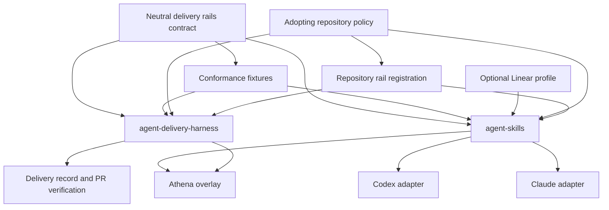
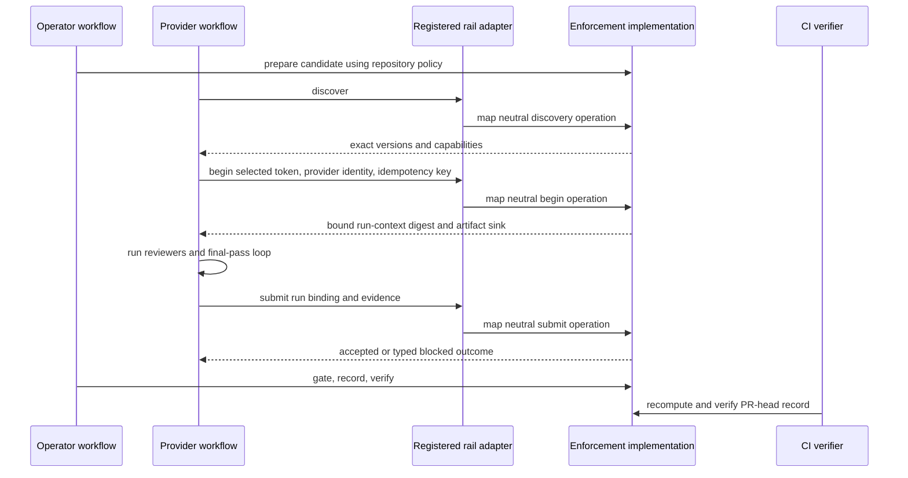
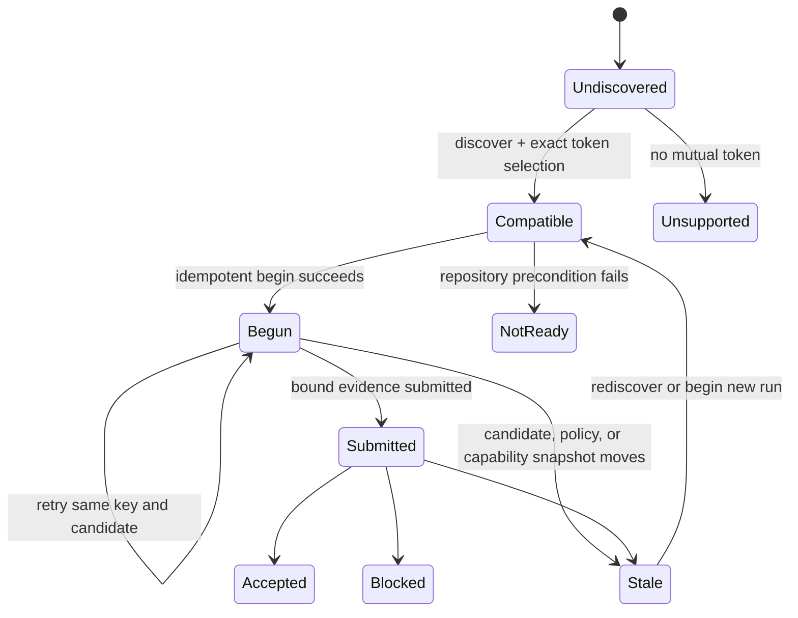
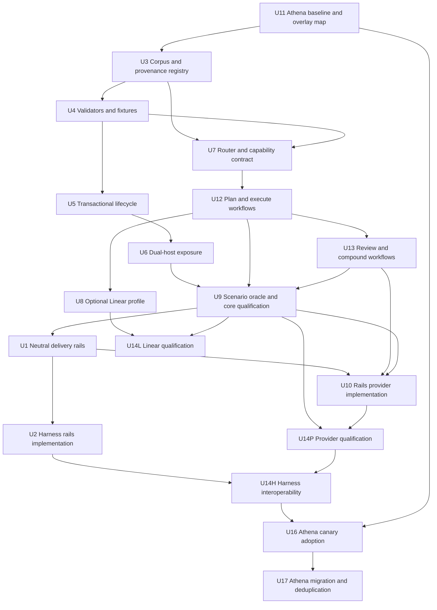

# feat: Cross-agent delivery rails and portable skills

**Target repositories:** `agent-skills` (portable workflow implementation and distribution), `agent-delivery-harness` (reference enforcement implementation and current incubation home for the neutral rails contract), and `athena` (reference adopter). Paths are prefixed `agent-skills:`, `delivery-harness:`, or `athena:` when they belong outside the repository containing this plan.

## Summary

Define a small implementation-neutral **delivery-rails protocol** for candidate-bound provider runs, then make `agent-skills` and `agent-delivery-harness` independent consumers on opposite sides of that contract. The protocol is a boundary, not a third product in v1. `agent-skills` will distribute a focused, safe-to-install, tracker-neutral workflow system for Codex and Claude Code, with independently optional Linear and delivery-rails provider profiles. `agent-delivery-harness` will continue to own deterministic evidence validation, admission, records, and CI verification while adding the missing machine-readable provider lifecycle. Athena adopts the composition last through a local policy overlay without weakening its existing delivery finish line.

The key architectural constraint is one-way dependency on the rails contract. `agent-skills` must not import harness internals, and `agent-delivery-harness` must not know about skills, prompts, reviewer selection, Codex, Claude, or Linear.

---

## Problem Frame

Athena has proven two complementary capabilities in one repository:

1. procedural workflows that tell an agent how to plan, implement, test, review, compound, and hand off work; and
2. deterministic enforcement that decides whether evidence for an exact candidate is admissible.

The first capability is entangled with Athena-specific instructions, connectors, commands, and locally vendored dependencies. The second has already been productized into the public `agent-delivery-harness` repository, but its provider interface currently exposes only a partial human-readable review context. A portable workflow provider must still import the harness kernel to obtain the complete candidate binding and an allocated run root.

Making `agent-skills` a workflow layer *inside* the harness product would replace one coupling with another. The durable boundary is lower: a transport-neutral, versioned protocol defining provider capability discovery, review-run initialization, candidate binding, artifacts, typed outcomes, and evidence submission. V1 proves that boundary through the real `agent-skills` provider, the harness implementation, and minimal contract fixtures; it does not build a separate rails product or ecosystem before external demand exists.

The current private `agent-skills` repository is not yet a safe distribution. Its sync script deletes all destination skills before verifying its sources, defaults to stale machine-local paths, has no ownership receipt or rollback, and contains unresolved dependencies. Athena, by contrast, contains 56 skills and 51 reviewer agents; exporting all of them would reproduce domain policy and a large transitive dependency graph rather than create a focused product.

### Product layers

| Layer | Owns | Must not own |
| --- | --- | --- |
| Delivery-rails protocol | Versioned schemas, minimal lifecycle semantics, outcome classes, fixtures | Product release train, workflow prompts, repository policy, host adapters, enforcement implementation |
| `agent-skills` | Delivery methodology, routing, host exposure, reviewer orchestration, optional tracker and rails-provider implementations | Candidate identity, admission authority, harness configuration, CI verification |
| `agent-delivery-harness` | Candidate capture, freshness, receipts, evidence validation, admission, records, waivers, Action verification | Skill installation, prompts, reviewer selection, tracker behavior |
| Adopting repository | Architecture facts, commands, sensors, policy, enabled profiles, trusted provider registrations | Hidden global workflow policy |
| Athena overlay | Athena-specific gates, Linear configuration, deployment, telemetry, reporting, generated artifacts | Forked copies of reusable workflow bodies |

---

## Requirements

The approved requirements remain canonical in the [origin brainstorm](../brainstorms/2026-08-27-cross-agent-delivery-skills-requirements.md). The implementation must preserve all 26:

- **R1-R5 — Canonical product and compatibility:** one canonical portable workflow source; Agent Skills compliance; verified Codex and Claude Code support; thin host adapters; declared compatibility and dependencies.
- **R6-R11 — Portable delivery:** routing across requirements, diagnosis, planning, implementation, review, and compounding; explicit test/review/handoff posture; optional tracking; repository-policy discovery; degraded optional capabilities; deterministic enforcement remains repository-owned.
- **R12-R18 — Profiles and lifecycle:** focused selectable profiles; pre-mutation validation; preservation of unrelated files; inspectable receipts; idempotent updates; owned-only removal and rollback; no machine-specific paths or secrets.
- **R19-R24 — Validation and evidence:** structural, reference, dependency, cross-host, optional-integration, lifecycle, leakage, provenance, and license validation.
- **R25-R26 — Athena extraction and adoption:** classify every candidate rule before porting; adopt only after parity proves Athena's finish line remains intact.

### Origin actors, flows, and acceptance examples

- **Actors:** A1 skill maintainer, A2 repository adopter, A3 delivery agent, A4 agent host, A5 integration owner, and A6 Athena maintainer remain the owners named by the origin. Installer and release units explicitly serve A1/A2/A4; U8 serves A5; Athena migration units serve A6.
- **F1 — Install a delivery profile:** realized by U3-U6 and core-release-qualified by U9.
- **F2 — Deliver ordinary software work:** realized by U7/U12/U13, with optional evidence submission in U10.
- **F3 — Activate optional Linear tracking:** realized by U8 and independently qualified in U14L.
- **F4 — Evolve and republish a workflow:** realized by U3/U4/U9/U14P/U14H and the post-adoption promotion scenario in U17.
- **F5 — Adopt the portable core in Athena:** realized by U11/U16/U17.
- **AE1-AE9:** preserved as executable expectations in the unit-level mappings and direct test scenarios below; the Acceptance Traceability table remains the summary index rather than the only trace.

### Approved planning decisions

These decisions extend the origin requirements and reflect the subsequent planning sign-off:

- **D1. Rails below products:** delivery rails are implementation-neutral; `agent-skills` and `agent-delivery-harness` independently conform to them.
- **D2. Dependency inversion:** neither product's release artifacts import, install, configure, or own the other. Both may depend on versioned protocol schemas/fixtures only. A disposable adopter fixture may configure both for point-in-time interoperability proof.
- **D3. Small contract, harness custody:** `agent-delivery-harness` publishes the v1 protocol bundle because the evidence spec and conformance machinery already live there. The bundle has neutral schema IDs/tokens and no harness imports, but shares the harness release train until a second real product justifies independent governance or extraction.
- **D4. Repository authority:** an absent rails implementation is an optional capability; once an adopting repository declares and configures a delivery gate, its typed blockers and remediation become mandatory and cannot be degraded away by a skill.
- **D5. Operator/provider separation:** skills may orchestrate both roles, but agents never waive. Preparation and final admission remain operator/enforcement operations; review execution and evidence assembly remain provider operations.
- **D6. Independent proof lanes:** no-secret CI proves structure, lifecycle safety, and protocol fixtures. Authenticated, fresh-session qualification targets exact authenticated lane path-group bytes from a packed release while retaining the whole-archive digest as provenance. Core, Linear, provider, and point-in-time harness-interoperability lanes qualify independently so an optional integration cannot block a valid core release.
- **D7. HTML last:** the Markdown plan is deepened and unanimously approved before its HTML counterpart is generated.
- **D8. Normative artifacts, not a language binding:** concise lifecycle prose, strict JSON Schemas, vectors, and expected outcomes are normative. Language bindings are non-normative conveniences checked against those bytes.
- **D9. Exact negotiation:** discovery is read-only; the client selects one exact mutually supported rail token. Begin-run echoes that token or rejects without silent downgrade, and binds a capability-snapshot digest plus an idempotent client run key to the candidate-specific context.
- **D10. Simplicity guardrail:** v1 adds machinery only where a stated safety or decoupling invariant cannot be proven with existing Git, Agent Skills, or harness primitives. No new service, repository, universal plugin framework, independent rails release train, or synchronized optional-profile gate is allowed without observed adopter need.
- **D11. Preconfigured transport trust:** repository policy may select only a named adapter and exact rail token. The host maps that name to a preconfigured MCP/host capability outside candidate-controlled files; v1 never executes a repository-declared executable or command line.

---

## Scope Boundaries

### Included

- A focused tracker-neutral delivery corpus, not Athena's entire skill directory.
- Safe repository-local installation, update, status, diff, rollback, and removal.
- Codex and Claude Code host exposure from one canonical installed body.
- V1 adopter environments with Git and Python 3.11+ on macOS, Linux, or Windows; the non-Athena pilot validates the documented prerequisite.
- Optional Linear and delivery-rails provider profiles.
- A neutral provider lifecycle contract and conformance fixtures.
- A reference implementation of that provider lifecycle in `agent-delivery-harness`.
- Athena migration after independent conformance and parity proof.

### Deferred

- Hosts beyond Codex and Claude Code.
- Trackers beyond Linear.
- Direct tracker HTTP/API or SDK transports; the v1 Linear adapter is MCP-first.
- Signed L1/L2 attestations, remote artifact upload, and non-filesystem provider runs.
- GitHub App, hosted approvals, fleet telemetry, and a hosted control plane.
- Guarded provider-command execution and multi-gate harness support.
- Remote rails transports and their authentication, TLS, replay, and availability policy.
- Public marketplace publication and organization-wide managed rollout.
- Moving the neutral rails to a separate repository; v1 must make that move mechanical, not require it.

### Explicitly excluded

- Copying all Athena skills or the full Compound Engineering corpus.
- Embedding `agent-delivery-harness` packages, source, or configuration in shipped `agent-skills` archives/profiles.
- Making `agent-delivery-harness` install or select skills, prompts, reviewers, hosts, or trackers.
- A universal repository validation or deployment engine.
- Bundling, provisioning, or persisting credentials, connector configuration, MCP installations, or maintainer-specific absolute paths in distribution or repository artifacts.
- Treating transcript wording or identical tool calls as cross-host equivalence.

---

## Context and Research

### `agent-skills` current state

- `agent-skills:skills/` contains five earlier extractions, including Linear-specific skills and workflow bodies with unresolved external references.
- `agent-skills:scripts/sync-local-skills.sh` clears the destination before validating every source and assumes a maintainer-local `$HOME/.codex/skills` tree.
- The repository has no tests, CI, profile manifest, provenance lock, ownership receipt, release metadata, or rollback contract.
- Recent history deliberately removed thousands of lines and several large skills, reinforcing a focused corpus rather than wholesale vendoring.

### `agent-delivery-harness` current state

- `delivery-harness:packages/kernel/` owns pure validation, candidate identity, preparation receipts, record storage, admission, and delivery-record verification.
- `delivery-harness:packages/conformance/` runs 89 golden `delivery-evidence/1` vectors in unit and integration modes.
- `delivery-harness:packages/cli/` exposes `prepare`, `review-context`, `submit-evidence`, `gate`, `record`, `verify`, and `check`.
- `delivery-harness:packages/mcp/` is a strict CLI-parity wrapper exposing only `review-context` and `submit-evidence` to providers.
- `delivery-harness:packages/action/` verifies a candidate-keyed tracked delivery record against the PR head.
- `delivery-harness:packages/cli/src/commands/review-context.ts` does not expose the complete candidate binding, accepted versions, workspace identity, or a recorder-allocated run root. The example provider therefore imports kernel APIs directly.
- V0.1.0 is release-checked and standalone-install tested, but packages are not yet published and the supported Action remains self-hosted.

### Athena sources and institutional patterns

- `athena:.agents/README.md` and root `AGENTS.md` establish repo-local skills as workflow policy while connectors remain runtime capabilities.
- `athena:.agents/skills/deliver-work/`, `compound-delivery-kernel/`, `ce-plan/`, `ce-work/`, `ce-code-review/`, `ce-compound/`, `track/`, and `execute/` contain the reusable delivery behavior and Athena-specific seams to classify.
- `athena:skills-lock.json` provides a starting point for source path, source type, and digest provenance, but lacks complete license, revision, modification, and classification fields.
- `athena:scripts/agent-sdk-generate.ts` and `agent-sdk-check.ts` demonstrate validate-then-generate and byte-stable committed-output checks.
- `athena:docs/solutions/workflow-issues/static-harness-contract-preflight-before-provider-validation-2026-07-13.md` requires complete cheap validation before expensive provider work.
- `athena:docs/solutions/architecture-patterns/candidate-bound-gate-obligations-before-expensive-validation-2026-08-11.md` and `harness/review-evidence-deliverable-identity-2026-08-12.md` require evidence to bind to the exact candidate and final pass.
- `athena:docs/solutions/harness/registry-owned-generated-doc-stale-paths-2026-04-30.md` requires generated exposure to derive from a canonical registry.
- `athena:docs/solutions/test-failures/athena-sensors-that-cannot-fail-2026-08-23.md` requires anti-vacuity and falsification for every sensor.

### External standards

- [Agent Skills specification](https://agentskills.io/specification) defines the portable `SKILL.md` contract and canonical frontmatter.
- [Codex skills documentation](https://developers.openai.com/codex/skills) establishes project-scoped `.agents/skills` discovery and optional `agents/openai.yaml` metadata.
- [Claude Code skills documentation](https://code.claude.com/docs/en/skills) establishes `.claude/skills` discovery and host extensions.
- Git's [`core.symlinks`](https://git-scm.com/docs/git-config#Documentation/git-config.txt-coresymlinks) behavior requires a deterministic managed-copy fallback rather than assuming committed symlinks work everywhere.
- [Agent Skills evaluation guidance](https://agentskills.io/skill-creation/evaluating-skills) supports scenario-based trigger and outcome evaluation rather than transcript equality.

---

## Key Technical Decisions

| Decision | Chosen approach | Consequence |
| --- | --- | --- |
| Rails custody | Publish a small neutral protocol bundle from `agent-delivery-harness` under the existing release train | Solves the real coupling seam now; independent governance waits for a second adopter implementation |
| Version model | Keep package SemVer, exact rail semantic tokens, and existing evidence/payload/identity/record tokens separate | Packaging releases cannot silently widen wire meaning or infer evidence compatibility |
| Normative source | Lifecycle/versioning prose + JSON Schemas + language-neutral vectors; generated language bindings are non-normative | Python and TypeScript implementations conform independently without sharing runtime validation code |
| Rail lifecycle | Read-only discovery → exact token selection → idempotent begin-run → write bound artifacts → submit → typed outcome | Gives any workflow implementation the complete machine contract missing from current CLI/MCP |
| Neutral registration | Adopting repositories select an exact rail token and a named, host-preconfigured adapter | Candidate-controlled files cannot introduce executable transport commands; installed binaries never become implicit policy |
| Canonical skill body | Repository source under `agent-skills:skills/`; installed generations under `.agent-skills/generations/<digest>/skills/` behind the active marker | Host discovery roots expose one authored body while retaining one rollback generation |
| Host exposure | Relative directory symlink when preflight proves support; deterministic digest-equal managed adapter/copy otherwise | Works across macOS, Linux, and Windows/Git symlink configurations while recording the chosen mode |
| Lifecycle implementation | Standard-library Python 3.11+ CLI with JSON schemas and stable JSON output | Avoids runtime package installation while retaining cross-platform filesystem and locking support |
| Skills release artifact | Deterministic self-contained archive containing the CLI, catalog, selected profiles, skills, schemas, and provider protocol bytes only when that optional group is present | Every install targets a publisher-declared SHA-256 before extraction; manifest path groups provide independent lane digests |
| Repository persistence | Active generation, receipt, and host exposures are tracked repository policy; journals and temporary backups stay git-private | A clone discovers the same skills, while interrupted local mutation state is not committed |
| Ownership | Versioned receipt plus expected digests and exposure metadata; path alone never proves ownership | Update/remove cannot destroy unowned or locally diverged artifacts |
| Mutation boundary | Resolve and validate, retain immutable generations, lock, stage, journal phased exposure changes, verify, then publish one active-generation/receipt commit marker | Multiple filesystem paths are recoverable and externally classified, without claiming impossible global rename atomicity |
| Corpus size | Self-contained delivery router and bounded planning/work/review/compound helpers; large CE skills remain upstream inspirations | Removes hidden dependencies and keeps the portable core inspectable |
| Tracker foundation | Core owns a tracker-neutral capability contract; optional profiles supply adapters | Planning/execution never imports Linear vocabulary, identifiers, auth, or failure semantics |
| Linear transport | V1 maps the neutral tracker contract to host-native Linear MCP tools | `agent-skills` ships no Linear HTTP client, SDK, OAuth flow, or credentials; another transport can implement the same contract later |
| Optional capabilities | Profiles add the Linear adapter and delivery-rails provider behavior without modifying core workflow bodies | Core delivery remains complete when integrations are absent |
| Cross-host proof | Normalized semantic checkpoints and scenario fixtures, not transcript or tool-call equality | Codex and Claude can differ operationally while preserving the same contract |
| Release proof | Structural CI on every change; authenticated qualification on an exact release candidate | Missing credentials cannot be misreported as behavioral parity |
| Athena migration | Characterize first, adopt last, retain local overlay and rollback snapshot | Portability cannot weaken Athena's established gates |

### Compatibility identity

Compatibility uses small independent lanes rather than a synchronized release tuple. The release manifest assigns every archive path to a lane input group and computes a digest for each group; the whole-archive digest remains provenance, not the invalidation key for every lane:

- the core lane binds the core path-group digest, core profile, scenario digest, and qualified host versions;
- the Linear lane binds the qualified core record plus the Linear path-group digest and controlled integration scenario;
- the provider lane binds the qualified core record plus the provider path-group digest and exact rail/evidence-family tokens;
- the harness-interoperability lane adds the tested harness release.

A declared input change invalidates only the affected lane; mutable host/service inputs also expire at the lane's recorded maximum age when no immutable snapshot exists. A shared rail schema/vector/token change invalidates provider and interoperability proof; an unrelated Linear change does not force a harness release. Unsupported tokens never negotiate down silently.

### Installation state model

Keep lifecycle state orthogonal to blockers:

| Lifecycle | Meaning | Default action |
| --- | --- | --- |
| `absent` | No valid owned installation | Install after preflight |
| `current` | Active receipt, body, and exposures agree | No-op |
| `outdated-clean` | Owned bytes agree but selected release differs | Update |
| `recovery-needed` | Journal exists without a completed marker | Idempotently restore or complete before any new mutation |
| `externally-transitioned` | Git changed tracked generations, receipt, or exposures without an installer journal | Recompute the fixed-root graph; accept only a complete valid generation or emit a reviewed reconciliation plan |

Independent blocker facts are `receipt-invalid`, `local-divergence`, `exposure-conflict`, and `source-unavailable`. Status reports all applicable facts; mutation is allowed only for the documented combinations. An invalid receipt never authorizes remove/adopt, divergence always requires explicit resolution, and source unavailability does not prevent rollback when the retained prior generation is valid. Lifecycle mutation is a maintainer-authorized repository-maintenance action, never an operation run from untrusted candidate/PR code or a provider session.

### Delivery-rails capability states

| State | Core workflow behavior |
| --- | --- |
| `absent` | Complete ordinary delivery without evidence submission; provide an evidence-backed handoff |
| `available` | Report the integration and compatibility but do not invent repository policy |
| `configured` | Run the declared preparation/provider/admission lifecycle; blockers are authoritative |
| `blocked` | Stop at the typed blocker and surface its repository-provided remediation; never silently downgrade |

---

## System-Wide Impact

There is deliberately no direct product-dependency edge between Skills and Harness. At runtime, the provider calls a repository-registered transport that implements the Rails contract; the harness is one possible implementation. Repository policy independently configures both sides: skills discover the finish line, while enforcement decides admission.

### Data and failure propagation

- Installation input flows from release/profile manifests into an immutable staged generation. A journal coordinates managed-body and host-exposure changes; only a verified active-generation/receipt marker classifies the new generation as current. Interruptions before that marker restore or complete idempotently on the next invocation.
- Review input flows from repository instructions and the rails provider context into host-specific orchestration; only normalized evidence artifacts cross into enforcement.
- Harness blockers flow back as stable codes, structured details, and repository-defined remediation. Skills may present them but must not reinterpret a block as success.
- No secrets or raw transcripts enter receipts, provenance locks, fixtures, run roots, logs, or qualification artifacts. Persist only schema-allowlisted bounded fields after redaction under owner-only roots. Terminal provider roots are deleted synchronously; bounded active/retryable context remains only until same-key resume, candidate/workspace movement, or operating-system temporary-file cleanup because automated force-release and guaranteed TTL reclamation are deferred. Qualification evidence has an explicit short retention period.
- Receipts, journals, archives, artifact handles, and retained generations are untrusted inputs. Every path is re-derived from fixed managed roots and profile data, then containment-checked; none can authorize deletion merely by naming a path.
- A release archive is trusted only after its SHA-256 matches immutable publisher metadata or protected adopter configuration. Extraction streams one supported archive format into bounded staging with entry-count, per-file, total-expanded-byte, path-depth, compression-ratio, and elapsed-time limits.
- The checked reachability graph is `catalog → managed generation → host exposure → overlay reference`. After every update or migration, every discoverable name resolves exactly once and no removed local body remains referenced.

---

## High-Level Technical Design

*Directional design only; the implementing agents should preserve the contracts and verification outcomes rather than reproduce illustrative names verbatim.*

The rails are the contract across the Provider/Adapter/Enforcement boundary, not a runtime service. They define messages and state transitions but do not prescribe prompts, models, reviewer sets, trackers, readiness mechanisms, or enforcement implementations. A harness preparation receipt is one implementation's readiness fact; the rail exposes only a stable `precondition/not-ready` class plus namespaced details and remediation.

The harness implementation composes its existing preparation, candidate-capture, artifact-allocation, evidence-record, and cleanup primitives. It persists only the bound retry context in the recorder-allocated run root; existing evidence records remain the authority for submission outcomes. A provider/workspace/candidate may hold at most one active allocation, and artifact count/bytes are bounded. A separate run-state subsystem, timeout reclaimer, or terminal database is deferred until observed failures require one.

---

## Implementation Units

### Delivery sequence

1. **Portable-core value gate — U11, U3-U7, U12, U13, U9:** capture the bounded Athena baseline, build the smallest safe tracker-neutral corpus, then require a no-skill improvement and unaided non-Athena adoption before any rails implementation work.
2. **Optional tracker proof — U8, U14L:** add and qualify Linear independently after the core passes.
3. **Small proven rails seam — U1, U2, U10:** publish only the missing neutral provider contract, then implement each side against packed protocol bytes.
4. **Independent provider proof — U14P/U14H:** qualify provider conformance and one exact-version harness interoperability point separately; do not establish a compatibility support program in v1.
5. **Reference adoption — U11, U16, U17:** characterize Athena, switch one canary with rollback proof, then migrate remaining workflows in independently reversible batches.

### U1. Define the implementation-neutral delivery rails

**Goal:** Specify the minimum provider lifecycle that workflow and enforcement products can implement independently.

**Requirements:** D1-D5, D8-D9; R3-R5, R10, R19-R22, R24; F2/F4; AE5/AE7

**Dependencies:** U9

**Files:**

- Create `delivery-harness:packages/conformance/provider-rails/delivery-provider-rails-1.md`
- Create `delivery-harness:docs/spec/delivery-provider-rails-1.md` as a pointer to the packaged normative document
- Create `delivery-harness:packages/conformance/provider-rails/compatibility.json`
- Create `delivery-harness:packages/conformance/provider-rails/compatibility.schema.json`
- Create `delivery-harness:packages/conformance/provider-rails/schemas/capabilities.schema.json`
- Create `delivery-harness:packages/conformance/provider-rails/schemas/provider-run.schema.json`
- Create `delivery-harness:packages/conformance/provider-rails/schemas/submit-request.schema.json`
- Create `delivery-harness:packages/conformance/provider-rails/schemas/provider-outcome.schema.json`
- Create `delivery-harness:packages/conformance/provider-rails/vectors/rails-kit.json`
- Create `delivery-harness:packages/conformance/provider-rails/vectors/accept/`
- Create `delivery-harness:packages/conformance/provider-rails/vectors/reject/`
- Create `delivery-harness:packages/conformance/src/provider-rails-runner.ts`
- Create `delivery-harness:packages/conformance/src/provider-rails-runner.test.ts`
- Modify `delivery-harness:scripts/check-import-boundaries.ts`
- Modify `delivery-harness:scripts/check-import-boundaries.test.ts`
- Modify `delivery-harness:scripts/check-release.ts`
- Modify `delivery-harness:scripts/check-release.test.ts`
- Modify `delivery-harness:packages/conformance/package.json`
- Modify `delivery-harness:.github/workflows/release.yml`

**Approach:** Define one concise protocol token for read-only discovery, candidate-specific begin-run, and a submit-request wrapper while reusing the existing `delivery-evidence/1`, `review.green/1`, identity, and `delivery-record/1` tokens unchanged. The wrapper carries the opaque run-context ID/digest plus a reference to the unchanged closed evidence manifest. Normative lifecycle prose and JSON Schemas define the contract; the runner is a non-normative convenience.

Discovery advertises exact rail tokens, callable operations, artifact-sink kinds, evidence formats, and optional capabilities—never harness config, executable transport bindings, preparation receipts, gate internals, candidate state, or implementation identity as authority. The client selects an exact token through its already configured adapter. Begin-run supplies provider identity plus a client-generated idempotency key; enforcement atomically checks its own readiness, captures the candidate, resolves active obligations, and allocates the sink. The response binds the selected token, capability-snapshot digest, opaque run-context ID/digest, complete candidate binding, active obligations, accepted evidence/payload/identity tokens, sink descriptor, and normalized policy/remediation surface. Stable rail outcome classes carry namespaced implementation details without standardizing the harness blocker registry.

Package SemVer, the exact rail token, and evidence-family tokens remain distinct through `compatibility.json`, but the bundle ships inside the existing conformance package for v1. The normative prose lives under the packed `provider-rails/` tree; the repository-level doc is only a pointer. The conformance manifest explicitly includes that tree, and the release workflow watches it. A strict meaning change requires a new rail token and updated vectors/compatibility notes. The protocol docs/schemas/vectors import no implementation code, and the conformance runner accepts an implementation port.

**Test scenarios:**

- Accept a minimal capability document and a complete ready provider-run context.
- Reject unknown members, unknown version tokens, incomplete candidate bindings, unsafe artifact handles, invalid provider/run identifiers, and contradictory capabilities.
- Prove discovery is read-only, exact selection never downgrades, capability drift requires rediscovery, and begin retry with the same key/candidate returns the same context while reuse after movement returns conflict/stale.
- Cover inactive/not-applicable obligations, no mutually supported token, concurrent begin, interruption after allocation, byte-identical submit retry, and candidate/base/policy movement at begin and submit.
- Prove stale-context and unsupported-version outcomes are distinct from usage errors and policy blockers.
- Run the language-neutral vectors through the harness implementation in U2 and native Python provider in U10; the U1 fixture only proves schema/vector consistency.
- Delete or rename a vector and prove kit counts and regeneration drift checks fail.
- Plant a kernel or CLI import in the rails package, prove the boundary sensor fails, then restore green.
- Pack the conformance package and verify the exact `provider-rails/` prose/schema/vector/compatibility paths are present with stable digests; a protocol-only change triggers release checks.
- Bump harness SemVer without changing the rail token, then change the rail token/schema; only the latter invalidates provider conformance.

**Verification:** Protocol schema/vector suite passes on Node 22/24 and Bun; the existing conformance package pack/install smoke contains the versioned bundle; every new rule is falsified by its test.

### U2. Implement the rails in `agent-delivery-harness`

**Goal:** Make the harness a complete reference enforcement implementation without exposing kernel internals to providers.

**Requirements:** D2-D5, D8-D9; R5, R10, R20-R22; F2/F4; AE5/AE7

**Dependencies:** U1

**Files:**

- Create `delivery-harness:packages/cli/src/commands/capabilities.ts`
- Create `delivery-harness:packages/cli/src/commands/begin-provider-run.ts`
- Modify `delivery-harness:packages/cli/src/boundary.ts`
- Modify `delivery-harness:packages/kernel/src/artifacts.ts`
- Modify `delivery-harness:packages/kernel/src/artifacts.types.ts`
- Modify `delivery-harness:packages/kernel/src/artifacts.test.ts`
- Modify `delivery-harness:packages/cli/src/commands/submit-evidence.ts`
- Modify `delivery-harness:packages/cli/src/index.ts`
- Modify `delivery-harness:packages/cli/src/cli.test.ts`
- Modify `delivery-harness:scripts/check-cli-inventory.ts`
- Modify `delivery-harness:packages/mcp/src/server.ts`
- Modify `delivery-harness:packages/mcp/src/server.test.ts`
- Modify `delivery-harness:packages/mcp/src/stdio.test.ts`
- Create `delivery-harness:packages/conformance/src/rails-implementation.test.ts`
- Modify `delivery-harness:docs/provider-guide.md`
- Modify `delivery-harness:docs/getting-started.md`
- Modify `delivery-harness:docs/docs-examples.test.ts`

**Approach:** Add machine-readable capability discovery and begin-provider-run commands backed by the existing command core. Extend successful command results with an optional schema-validated machine payload: the CLI serializes it as JSON and MCP carries the same value in `structuredContent`, while the seven existing commands keep their human summaries and compatibility. In this implementation, begin-run requires a current preparation receipt, but the rail reports only `precondition/not-ready` plus namespaced blocker/remediation details. It captures the candidate once through existing wiring, resolves active obligations and registered provider policy, allocates the run root through the recorder-owned artifacts port, and returns a rails-conforming bound context. Expose the same semantic operations through MCP at strict payload parity. Keep waiver prompts impossible over MCP and preserve current operator/provider separation.

Do not weaken or duplicate `review-context`; either make it a human rendering of the new response or retain it as a compatibility view. Implement begin-run as a thin composition of existing preparation, candidate-capture, recorder artifact-allocation, and record primitives. Extend the existing artifacts-port suite with one deterministic claim file per provider/workspace/candidate—not a run database. Derive context/run-root identifiers before allocation; write and fsync the complete owner-only claim to a unique temporary file in the same directory; publish it with an atomic same-filesystem hard-link to the fixed claim path, whose `EEXIST` behavior is the no-replace winner decision; unlink the temporary name; then idempotently create the deterministic run root. A crash before publication leaves only an inert bounded temporary file, ignored by readers and best-effort removed by its creator/OS cleanup; a crash after publication is resumed from the complete claim and idempotent root creation. Fault injection proves no empty/truncated fixed claim can be published.

The claim binds the client idempotency key and allocated context: same-key retries resume it; a different key receives a typed active-run conflict with no sink descriptor or context secret. Accepted, stale, and non-retryable terminal outcomes synchronously delete the claim and run root; retryable outcomes retain the bounded root. Candidate/workspace movement deletes obsolete retained context. V1 has no automated force-release operation; loss of the persisted client key is an explicit blocker rather than authority to steal or delete a live claim. Submission checks the rail wrapper/context binding, then passes the unchanged evidence manifest to the existing validator and recorder. Add a compatibility table declaring implemented rail and evidence-family tokens.

Apply simple resource bounds: one active allocation per provider/workspace/candidate, bounded artifact count and total bytes, owner-only permissions, and redaction before persistence/logging. Exceeding a bound returns a typed retryable blocker. The provider context and artifact sink expose no ambient credentials. Guaranteed time-based reclamation remains deferred with the run-state reclaimer.

**Test scenarios:**

- Configured prepared repository returns a complete, schema-valid provider context over CLI JSON and every supported MCP revision.
- Missing or stale receipt produces the existing typed preparation blockers and no run allocation.
- Inactive/not-applicable obligations return a context that does not request needless review; unregistered provider identity blocks begin.
- Candidate or wiring movement between prepare and begin-run blocks.
- Candidate movement after begin-run causes submission to reject as stale rather than permitting manifest repair.
- Same-key repeated/concurrent begin returns one context; transport interruption after allocation can recover it without an ambiguous second root. A different key gets an active-run conflict and no sink/context capability.
- Restart/concurrent begin resolves through complete-temp plus atomic no-replace claim publication to one deterministic allocation; terminal/root deletion, candidate/workspace-movement cleanup, and retryable retention are idempotent, with no parallel provider-run database, automated force-release, or unsupported TTL claim.
- Crash/fault injection at temporary write, fsync, hard-link publication, temporary unlink, and run-root creation proves the fixed claim is either absent or complete; competing publishers produce one winner and one read-only retry/conflict path.
- A second active allocation, excess artifact count/bytes, unsafe permissions, or an unredacted disallowed field fails with the typed resource/policy outcome.
- Missing/mismatched run-context wrapper blocks before the existing evidence validator; the unchanged `delivery-evidence/1` envelope remains valid.
- Run roots remain recorder-allocated, contained, private, and idempotently addressable.
- CLI JSON and MCP `structuredContent` carry byte-equivalent schema payloads despite different human envelopes; existing command summaries remain compatible.
- Agent execution context cannot reach any waiver path.
- Lost-key and different-key attempts remain blocked without exposing the sink; no operator/provider API can steal or force-release the claim in v1.
- Existing seven-command behavior remains compatible; command-inventory sensor catches unregistered additions.

**Verification:** Full harness check, conformance suite, executable docs, standalone package installation, and self-gating record verification pass.

### U3. Establish the canonical corpus, profiles, and provenance registry

**Goal:** Replace ad hoc synchronization with an explicit product manifest and rule-level classification before porting workflow bodies.

**Requirements:** R1-R5, R12, R15, R18, R24-R26; F1/F4/F5; AE1/AE4/AE7/AE8/AE9; A1/A2/A4/A6

**Dependencies:** U11

**Files:**

- Create `agent-skills:AGENTS.md`
- Rewrite `agent-skills:README.md`
- Create `agent-skills:catalog.json`
- Create `agent-skills:profiles/core.json`
- Create `agent-skills:profiles/linear.json`
- Create `agent-skills:provenance.lock.json`
- Create `agent-skills:schemas/catalog.schema.json`
- Create `agent-skills:schemas/profile.schema.json`
- Create `agent-skills:schemas/provenance.schema.json`
- Create `agent-skills:docs/classification.md`
- Create `agent-skills:docs/compatibility.md`
- Delete `agent-skills:scripts/sync-local-skills.sh`

**Approach:** Put source, revision, license, modification status, digest, and classification in one `provenance.lock.json` registry. Its bounded v1 closure contains every current `agent-skills` artifact plus only the explicitly selected Athena workflow bodies, dependency resources, and repository-policy obligations required for delivery parity. Record the remaining Athena discoverable inventory as a count and tree digest, not a rule-by-rule migration backlog. Catalog entries reference provenance IDs and declare dependencies, degraded behavior, supported hosts, external tools, and release status without repeating classification. Generate classification documentation from the lock. U7 may not begin until every member of the bounded closure has exactly one classification.

U3 seeds source classifications and an initially valid corpus. Every later content-bearing workflow unit atomically updates catalog membership, selected profile closure, provenance source/final-output digests, and validation-inventory entries for the bytes it introduces; no unit may leave the registry intentionally stale for a later cleanup pass.

Keep the initial core deliberately small: a delivery router plus self-contained requirements/plan, work, review, and compound helpers sufficient to preserve the delivery contract. Large Compound Engineering skills remain research sources unless their required subset can be extracted with explicit provenance and no unresolved graph. The bootstrap-agent-harness workflow becomes optional guidance, not a default profile.

**Test scenarios:**

- Every bounded-closure member, including explicit exclusions, has exactly one classification/provenance entry; changing a selected source or the recorded out-of-scope inventory digest without updating the lock fails.
- A dependency on an absent skill, reviewer prompt, script, connector, or profile is rejected unless explicitly optional with a tested degraded path.
- Duplicate names, case-fold collisions, path escapes, future schema versions, unknown profile members, and inconsistent licenses reject.
- Core profile closure contains no Linear, Athena, Compound plugin, private URL, or absolute machine path.
- Removing a provenance entry or changing a skill without updating its digest makes validation fail.

**Verification:** Catalog/profile/provenance schemas validate; the lock accounts for 100% of current target artifacts and the explicitly selected Athena closure, while the remaining inventory is visibly out of scope by count/digest.

### U4. Build structural validation and hostile fixture coverage

**Goal:** Fail closed on invalid skills, dependency gaps, unsafe paths, provenance drift, and repository-specific leakage before lifecycle mutation or model evaluation.

**Requirements:** R2-R5, R13, R18-R19, R21-R24; F1/F4; AE2/AE6/AE7/AE8

**Dependencies:** U3

**Files:**

- Create `agent-skills:pyproject.toml`
- Create `agent-skills:agent_skills/__init__.py`
- Create `agent-skills:agent_skills/validate.py`
- Create `agent-skills:agent_skills/catalog.py`
- Create `agent-skills:agent_skills/errors.py`
- Create `agent-skills:tests/test_validate.py`
- Create `agent-skills:tests/test_catalog.py`
- Create `agent-skills:tests/fixtures/valid-corpus/`
- Create `agent-skills:tests/fixtures/invalid-corpora/`
- Create `agent-skills:scripts/check-core-leakage.py`
- Create `agent-skills:scripts/build-release.py`
- Create `agent-skills:schemas/release-manifest.schema.json`
- Create `agent-skills:tests/test_release_archive.py`
- Create `agent-skills:validation-inventory.json`
- Create `agent-skills:.github/workflows/ci.yml`

**Approach:** Implement standard-library validators that aggregate all findings with stable artifact/rule IDs and exit classes. Validate Agent Skills frontmatter, name/path agreement, relative references, dependency closure, profile closure, shallow resource references, provenance/license coverage, forbidden sensitive literals, source symlink containment, case-fold uniqueness, and schema version support. Run the official/curated Agent Skills validator as a pinned conformance oracle in CI where available, while keeping the local validator authoritative and offline-capable.

Leakage rules reject Athena commands, V26 identifiers, deployment URLs, project IDs, secret-like literals, and undeclared host extensions from the core. A checked validation inventory binds every rule to scan roots, positive/negative fixtures, and required profile/host/scenario cells. It pins scenario IDs/counts; named skips fail when the skipped case disappears. The initial inventory covers only artifacts and capability states present in the core-only archive: every shipped core skill is selected by a routing scenario and every core exposure/capability state is exercised. U1 adds neutral rail outcome vectors; U10 extends the skills inventory with provider-group rail outcomes when that group exists.

Build one deterministic self-contained archive with a release manifest covering the Python module entry point, catalog, selected profiles, skills, and schemas. The first qualified archive is core-only; optional Linear and provider path groups are added only when U8 and U10 land. The manifest assigns paths to available input groups and records both whole-archive and group digests. Publish the expected SHA-256 through immutable release metadata; lifecycle commands verify it before parsing or extraction. Support one archive format and stream it to bounded staging with explicit entry-count, per-file, total-expanded-byte, path-depth, compression-ratio, and elapsed-time limits. No later unit reads neighboring checkout files.

**Test scenarios:**

- Valid minimal and complete corpora pass with stable zero-finding JSON.
- Malformed frontmatter, missing SKILL.md, broken relative references, deep reference chains, circular dependencies, and unresolved required skills report together.
- `../` escapes, absolute paths, source symlinks escaping the corpus, case-only collisions, and unsupported schemas reject.
- Each leakage class has positive and negative controls so ordinary words and public standards URLs survive.
- Empty scan roots and disabled rules fail anti-vacuity assertions.
- Same dirty source bytes produce the same validation result; validation never edits input.
- Rebuilding the same release is byte-identical; missing runtime/catalog/profile/skill/schema bytes, incorrect whole/group digests, archive path escapes, and extraction-limit violations fail before publication or install; the archive runs validation outside the source checkout.

**Verification:** Python unit suite and corpus validation pass on macOS, Linux, and Windows with Python 3.11+; CI artifact lists every checked root and rule count.

### U5. Replace sync with a transactional, receipt-owned lifecycle

**Goal:** Install, update, inspect, roll back, and remove selected profiles without damaging user-owned repository state.

**Requirements:** R12-R18, R22; F1/F4; AE2/AE6; A1/A2/A4

**Dependencies:** U4

**Files:**

- Create `agent-skills:agent_skills/cli.py`
- Create `agent-skills:agent_skills/lifecycle.py`
- Create `agent-skills:agent_skills/receipt.py`
- Create `agent-skills:agent_skills/locking.py`
- Create `agent-skills:agent_skills/fs.py`
- Create `agent-skills:agent_skills/generations.py`
- Create `agent-skills:agent_skills/journal.py`
- Create `agent-skills:schemas/receipt.schema.json`
- Create `agent-skills:tests/test_lifecycle.py`
- Create `agent-skills:tests/test_receipt.py`
- Create `agent-skills:tests/test_fault_injection.py`
- Create `agent-skills:tests/fixtures/adopting-repos/`
- Modify `agent-skills:validation-inventory.json`

**Approach:** Provide `validate`, `plan`, `status`, `diff`, `install`, `update`, `rollback`, and `remove` commands plus a read-only recovery plan. Resolve the profile/dependency graph from one authenticated release archive, validate it, classify lifecycle plus blocker facts, and show a deterministic plan before mutation. Retain only the active and immediately prior content-addressed generations; this is sufficient for one-step rollback without an unbounded local package store. Acquire a repository-local lock, stage the next generation, write a phased git-private recovery journal, invoke selected host exposure participants, verify the complete reachability graph, then publish one tracked active-generation/receipt marker as the observable success point. The tracked receipt records schema version, release source/ref and verified archive digest, profile/hosts/integrations, installed digests, exposure mode, overlay boundary, and retained prior generation—never credentials.

The journal phases are staged, generation-ready, exposing-host-N, verifying, marker-committed, and cleanup. This is failure-atomic and idempotently recoverable, not a claim that several filesystem paths share one atomic rename. A journal that has not reached `marker-committed` never classifies as current; after that marker, cleanup is idempotent housekeeping and does not invalidate the current generation. The next invocation either restores the prior verified exposures/generation, completes the new marker, or finishes post-marker cleanup; repeated recovery is safe. V1 does not infer adoption/ownership from names when a receipt is invalid—manual recovery may follow the generated plan, but destructive repair requires valid ownership evidence.

The active generation, receipt, and host exposures are tracked repository policy so a clone gets the same discovery layout; journals, locks, and temporary backups resolve under a git-private namespace. Mutation is allowed only from an explicit maintainer repository-maintenance invocation, never candidate CI or a provider session. Automatic deletion is limited to fixed `.agent-skills` roots and generated host exposures that carry the expected ownership marker and digest; an invalid marker or locally diverged managed copy produces a reviewed diff, not deletion. Re-derive every managed path from fixed roots and selected profile; treat receipts, journals, archives, and filesystem entries as untrusted. Validate containment and reject absolute/external paths, special files, unexpected hardlinks, duplicate archive entries, symlink swaps, and target mutation between preflight and commit. Removal preserves dependencies still selected by another profile. Non-interactive mode never prompts or assumes overwrite permission.

Git checkout, merge, and rebase are external transitions because they can replace tracked policy without the installer lock. `status` deterministically recomputes the fixed-root graph: a complete receipt/generation/exposure set becomes current; any mixed or conflicted set becomes `externally-transitioned` with a non-destructive reconciliation plan. No hidden hook is required.

**Test scenarios:**

- Clean install, same-version no-op, clean update, profile expansion/contraction, host add/remove, rollback, and owned-only removal.
- Existing unrelated skills and instructions survive every lifecycle operation byte-identically.
- Naming conflict is reported before mutation; an invalid new release leaves the current installation usable.
- Diverged managed body, diverged exposure, missing/corrupt/future receipt, orphan exposure, and unavailable source each enter the correct state.
- Update v1→v2, remove v1 from the source, then roll back exact v1 bytes/exposures/receipt from the retained generation; clean only unreferenced generations.
- Interrupt before and after every journal phase and the final marker; repeat recovery, remove the prior generation, and race recovery with install. Pre-marker interruption never becomes current; post-marker interruption remains current while cleanup completes idempotently.
- Concurrent installers serialize or one exits with a stable lock blocker; stale-lock/dead-process recovery is explicit.
- Forged/corrupt/future receipts, journals naming external paths, path traversal, case collision, symlink swaps, hardlinks, special files, duplicate archive entries, and target/source TOCTOU mutation never authorize writes or deletion.
- A forged receipt plus matching content digest cannot delete an exposure without the fixed-root ownership marker; candidate/PR/provider contexts cannot invoke mutation.
- Profile-changing branch switches, merge conflicts, linked worktrees, and clean clones classify or reconcile deterministically without an installer journal.
- Dirty repositories retain all unrelated tracked and untracked bytes through install, recovery, rollback, and removal.

**Verification:** Lifecycle matrix passes against disposable Git repositories; before/after tree digests prove unrelated-byte preservation and externally recoverable commit/rollback outcomes.

### U6. Expose one managed body to Codex and Claude Code

**Goal:** Make both hosts discover the selected workflows without duplicating canonical workflow policy.

**Requirements:** R1-R5, R12, R15-R18, R20, R22; F1; AE1/AE2; A2/A4

**Dependencies:** U5

**Files:**

- Create `agent-skills:agent_skills/hosts/base.py`
- Create `agent-skills:agent_skills/hosts/codex.py`
- Create `agent-skills:agent_skills/hosts/claude.py`
- Create `agent-skills:agent_skills/hosts/exposure.py`
- Create `agent-skills:tests/test_host_exposure.py`
- Create `agent-skills:tests/fixtures/hosts/`
- Create `agent-skills:docs/host-adapters.md`
- Modify `agent-skills:validation-inventory.json`

**Approach:** Plug Codex/Claude exposure operations into U5's journaled transaction engine. Store canonical bodies in immutable generations under `.agent-skills/generations/<digest>/skills/`. For each selected host, preflight discovery-root conflicts and filesystem symlink behavior. Prefer relative directory symlinks through the active generation. When symlinks are genuinely unsupported or materialized as files, stage and reconcile digest-equal managed copies before the success marker; parent-directory permission denial blocks rather than masquerading as capability fallback. On interruption, U5 restores the prior copies before classifying the old generation current.

Define digest scope explicitly: workflow body/resources match the canonical digest; host-only metadata is separately generated, owned, and checked not to redefine policy. “No duplicate workflow bodies” means no independently authored or mutable forks; a receipt-owned digest-equal fallback copy is permitted only when derived mechanically from the canonical generation. Codex `agents/openai.yaml` and Claude metadata cannot alter the shared workflow body. Executable bits and safe internal symlinks are included in the generation contract.

**Test scenarios:**

- Both discovery roots expose the same selected names and canonical digests.
- Symlink-capable, `core.symlinks=false`, unsupported-symlink, parent-permission-denied, existing-directory, broken/external symlink, materialized checkout, executable-bit, internal-safe-symlink, and case-collision fixtures choose the expected outcome.
- Fallback adapters regenerate byte-identically and stale output is detected.
- Inject interruption after each host exposure and during fallback reconciliation; recovery restores the prior complete host set before the active marker remains old.
- Host removal deletes only that host's owned exposure, not the managed body still shared by another host.
- A user-owned discovery entry blocks rather than being replaced.

**Verification:** Disposable repositories prove discovery layout, receipt accuracy, idempotency, and owned-only cleanup for both exposure modes.

### U7. Extract the router, repository-discovery, and capability contract

**Goal:** Establish one host-neutral entry point that discovers repository authority, owns neutral capability contracts, and routes to explicit required or degraded capabilities.

**Requirements:** R1-R6, R9-R10, R19-R21, R23-R26; F2; AE3/AE5/AE7

**Dependencies:** U3, U4

**Files:**

- Rewrite `agent-skills:skills/deliver-work/SKILL.md`
- Rewrite `agent-skills:skills/compound-delivery-kernel/SKILL.md`
- Create `agent-skills:skills/deliver-work/references/capability-contract.md`
- Create `agent-skills:tests/scenarios/core/routing.json`
- Create `agent-skills:tests/scenarios/core/repository-discovery.json`
- Create `agent-skills:tests/scenarios/core/tracker-capability.json`
- Modify `agent-skills:profiles/core.json`
- Modify `agent-skills:catalog.json`
- Modify `agent-skills:provenance.lock.json`
- Modify `agent-skills:validation-inventory.json`

**Approach:** Consume the routing/repository-discovery slice of U11's authoritative Athena baseline before rewriting. The portable router establishes scope, reads repository instructions, classifies the request, discovers declared capabilities, and selects the next workflow. The core capability contract owns the tracker-neutral operations—resolve context, create atomic work, link dependencies, update status, attach redacted evidence, and close or hand off—plus absent/available/configured/blocked states and typed adapter outcomes. It contains no Linear vocabulary, identifiers, authentication, URLs, or connector-specific remediation. Repository-specific commands, branch policy, tracker IDs, deployment, harness topology, and domain rules remain discovered inputs. Missing optional capabilities choose a declared complete core path or named handoff; required configured capabilities produce blockers rather than silent degradation.

**Test scenarios:**

- Fuzzy feature, bounded implementation, diagnosis-only, plan-only, review-only, and compound-only requests route as characterized (F2/AE5).
- Repository instructions override examples and host metadata; Athena-only commands never appear in a neutral fixture.
- Absent, available, configured, and blocked capability states choose distinct normalized outcomes (AE3/AE7).
- A fake tracker adapter passes the neutral operation/state contract; Linear-shaped fields in the core contract fail leakage validation.
- Missing browser, MCP, tracker, external reviewer, or compounding directory never triggers an unresolved skill reference.

**Verification:** Characterization and neutral routing scenarios pass; every core skill is selected by at least one pinned scenario.

### U12. Extract planning and execution workflows

**Goal:** Make scope, test posture, incremental implementation, repository sensors, and evidence-backed handoff self-contained.

**Requirements:** R6-R11, R19-R21, R23-R26; F2; AE3/AE5/AE7

**Dependencies:** U7

**Files:**

- Create `agent-skills:skills/plan-work/SKILL.md`
- Create `agent-skills:skills/execute-work/SKILL.md`
- Create `agent-skills:tests/scenarios/core/plan.json`
- Create `agent-skills:tests/scenarios/core/execute.json`
- Modify `agent-skills:profiles/core.json`
- Modify `agent-skills:catalog.json`
- Modify `agent-skills:provenance.lock.json`
- Modify `agent-skills:validation-inventory.json`

**Approach:** Extract the planning/execution slice of U11's baseline: confirm scope, select test-first or characterization-first posture, identify the repository's smallest honest sensors, work incrementally, preserve unrelated changes, and hand off observable evidence. Planning and execution call U7's tracker-neutral contract when tracking is selected; they never import or branch on a concrete tracker. Enforcement and specialized tools are likewise capability calls rather than hidden dependencies.

**Test scenarios:**

- Same request/repository facts produce the same scope, test posture, sensors, and handoff categories in both hosts (F2/AE5).
- No tracker produces an actionable handoff without mutation (AE3).
- Diagnosis-only does not implement; plan-only does not mutate code; implementation does not claim completion before required sensors.
- Repository-specific validation outranks generic examples and a missing optional sensor is reported honestly.

**Verification:** Planning/execution characterization and normalized scenarios pass with no Compound, Linear, harness, or Athena dependency in core.

### U13. Extract independent review and compounding workflows

**Goal:** Bundle a bounded independent-review loop and durable-learning handoff without importing the full Compound reviewer graph.

**Requirements:** R6-R11, R19-R21, R23-R26; F2/F4; AE5/AE7/AE9

**Dependencies:** U12

**Files:**

- Create `agent-skills:skills/review-work/SKILL.md`
- Create `agent-skills:skills/compound-learning/SKILL.md`
- Create `agent-skills:skills/review-work/references/reviewer-contract.md`
- Create `agent-skills:skills/compound-learning/templates/solution-note.md`
- Create `agent-skills:tests/scenarios/core/review.json`
- Create `agent-skills:tests/scenarios/core/compound.json`
- Modify `agent-skills:profiles/core.json`
- Modify `agent-skills:catalog.json`
- Modify `agent-skills:provenance.lock.json`
- Modify `agent-skills:validation-inventory.json`

**Approach:** Extract reviewer selection, independent approval, finding disposition, loop-to-resolution, and compounding thresholds from U11's baseline. Bundle the required reviewer contract in the core rather than invoking missing prompts. Select lenses proportional to risk, require independent approval or an honest blocker, and capture a reusable learning only when repository policy and the solved pattern warrant it.

**Test scenarios:**

- Correctness, maintainability, testing, and repository-standards coverage is selected proportionally without requiring identical personas.
- Actionable findings loop to resolution and re-review; passing tests alone cannot self-certify (F2/AE5).
- Reviewer unavailable and compounding directory absent follow declared handoffs rather than unresolved dependencies (AE7).
- A reusable improvement changes the canonical learning once while repository overlay content remains separate (F4/AE9).

**Verification:** Review/compound characterization and scenarios pass; every retained or excluded Athena rule remains traceable to the U3 classification.

### U8. Implement Linear as an optional tracker adapter

**Goal:** Preserve Athena's atomic tracking discipline by implementing the core tracker contract as a separately installable Linear adapter.

**Requirements:** R8, R10, R12, R15, R20-R21, R25; F3; AE3/AE4; A5

**Dependencies:** U9

**Files:**

- Replace `agent-skills:skills/create-linear-ticket/SKILL.md` with `agent-skills:skills/track-work/SKILL.md`
- Replace `agent-skills:skills/execute-linear-ticket/SKILL.md` with `agent-skills:skills/execute-tracked-work/SKILL.md`
- Modify `agent-skills:profiles/linear.json`
- Create `agent-skills:tests/scenarios/linear/`
- Create `agent-skills:docs/integrations/linear.md`
- Modify `agent-skills:catalog.json`
- Modify `agent-skills:provenance.lock.json`
- Modify `agent-skills:validation-inventory.json`

**Approach:** Implement U7's tracker-neutral capability contract by mapping its operations to host-native Linear MCP tools. Codex and Claude host configuration owns MCP installation and authentication; `agent-skills` ships no Linear HTTP client, SDK, OAuth flow, credentials, or fallback subprocess. Keep every Linear-specific concern inside this optional adapter: workspace/team/project resolution, MCP tool mapping, identifiers, URLs, rate limits, and reconciliation. `track-work` and `execute-tracked-work` are thin Linear-profile bindings to the U7/U12 workflows, not duplicate planning or execution bodies. Core workflows call only the neutral contract when a tracker is installed and configured. The adapter translates unavailable MCP capability, missing auth, denied mutation, rate limiting, malformed tool output, and ambiguous partial creation into the contract's typed outcomes with reconciliation data and no duplicate retry.

**Test scenarios:**

- Absent profile leaves core output unchanged.
- Installed but unconfigured profile reports setup without blocking ordinary delivery.
- Configured path creates dependency-aware work and execution maintains state/evidence.
- Missing/unavailable Linear MCP, missing auth, malformed tool output, or unsupported tool capability produces the typed adapter outcome without attempting HTTP, SDK, shell, or implicit fallback behavior.
- The Linear adapter passes the same fake-port contract suite defined by U7; substituting another conforming fake adapter does not change core planning/execution output categories.
- Auth denial, rate limit, connector outage, and partial mutation retain reconciliation identifiers and prevent duplicate creation.
- No secret, workspace ID, project URL, or Athena team key enters core or receipts.
- A controlled authenticated qualification fixture uses an idempotency/reconciliation key and retained redacted audit record so Codex and Claude each prove the configured AE4 path without duplicate creation. That fixture may create at most two clearly marked disposable issues after reconcile-first search solely to avoid workspace pollution. This is not a runtime, adapter, workflow, or production capability limit: the shipped Linear path retains create, read, update, search, relations, and reconciliation, with real execution governed by repository policy and user authority.

**Verification:** Fake-port CI proves state/error semantics; U14L's controlled authenticated scenario proves the configured cross-host AE4 path; leakage check proves core is tracker-neutral.

### U9. Build the scenario oracle and qualify the tracker-neutral core

**Goal:** Establish an honest semantic oracle and prove the tracker-neutral core across Codex and Claude before optional cross-product qualification.

**Requirements:** R3-R5, R19-R24; D6; F1/F2/F4; AE1/AE5/AE6/AE7; A1/A2/A4

**Dependencies:** U6, U12, U13

**Files:**

- Create `agent-skills:evaluations/scenarios.json`
- Create `agent-skills:evaluations/checkpoints.schema.json`
- Create `agent-skills:evaluations/qualification-scorecard.json`
- Create `agent-skills:evaluations/baselines/`
- Create `agent-skills:evaluations/pilot-checklist.md`
- Create `agent-skills:agent_skills/evaluate.py`
- Create `agent-skills:tests/test_evaluate.py`
- Create `agent-skills:tests/scenarios/lifecycle/`
- Create `agent-skills:release/core-qualification-record.schema.json`
- Create `agent-skills:docs/releasing.md`
- Modify `agent-skills:.github/workflows/ci.yml`
- Modify `agent-skills:validation-inventory.json`

**Approach:** Define normalized checkpoints for route selection, scope adherence, test posture, repository sensors, defect/review detection, degraded capabilities, follow-up handling, and actionable handoff quality. Before any authenticated run, commit a versioned scorecard with the observable pass predicate and materiality threshold for every required checkpoint; judgment cells use masked scoring plus recorded adjudication evidence. Classify checkpoints as mechanically recomputed from repository/lifecycle/sensor state, evaluator judgment, or agent narration; narration alone cannot satisfy a required checkpoint. No-secret CI validates fixtures, lifecycle matrices, host discovery, leakage, and deterministic normalization. A manual authenticated qualification runs fresh Codex and Claude sessions against the same fixed tasks both with the core and with a no-skill control. Missing credentials or unavailable hosts produce `not-qualified`, never pass.

Bind the core qualification to the whole-archive provenance digest plus core path-group digest, core profile, dependency closure, host set, scorecard/scenario digests, and immutable host/service snapshot identifiers where available. Every record includes `qualified_at` and a declared maximum age; if a mutable input cannot be pinned, expiry returns the lane to `not-qualified`. Store qualification out of band or in a location excluded from the archive so the record cannot invalidate its own target. The core must satisfy the precommitted improvement threshold without a material regression in another required checkpoint; otherwise stop expansion and simplify the corpus. Persist only allowlisted redacted summaries/digests; keep raw sessions ephemeral, access-controlled, and short-lived. Optional lanes qualify separately.

Authenticated qualification runs only from a protected manual/reusable workflow pinned to immutable action commits, with read-only repository permissions and secrets unavailable to candidate-defined jobs. On the current self-hosted Action this proves L0 process/freshness only, not independent provenance.

**Test scenarios:**

- Equivalent host runs may differ in low-level actions but normalize to identical required checkpoints.
- Core-versus-no-skill controls prove observable delivery value on the fixed task set before optional machinery expands.
- A scorecard changed after results exist, an expired mutable-host record, or an unpinned protected workflow cannot qualify.
- An agent claiming a test/review/handoff without the expected repository, lifecycle, sensor, or evidence state fails; correct state with different prose passes.
- A missing scope declaration, skipped repository sensor, weakened reviewer threshold, or unresolved optional capability fails the relevant scenario.
- Stale qualification or changed core path-group, host-set, scorecard, or scenario bytes invalidates the core lane; optional-only archive changes do not.
- Missing credentials and provider timeout remain visibly unqualified.
- Installer and removal scenarios execute from packed release bytes, not the source checkout.
- One non-Athena repository maintainer completes an unaided core install, ordinary delivery task, update, and rollback; unresolved adoption friction blocks optional-profile expansion.

**Verification:** CI publishes structural evidence; authenticated qualification produces candidate-bound tracker-neutral core records for both hosts, explicitly labeled workflow-conformance evidence rather than independent trust or model quality.

### U10. Implement `agent-skills` as a delivery-rails provider

**Goal:** Connect the independently proven workflow implementation to any conforming enforcement implementation through the neutral rails.

**Requirements:** R5-R11, R19-R22; D1-D6, D8-D11; F2/F4; AE3/AE5/AE7

**Dependencies:** U1, U9, U13

**Files:**

- Create `agent-skills:skills/delivery-rails-provider/SKILL.md`
- Create `agent-skills:skills/delivery-rails-provider/references/evidence-mapping.md`
- Create `agent-skills:agent_skills/rails/client.py`
- Create `agent-skills:agent_skills/rails/evidence.py`
- Create `agent-skills:agent_skills/rails/outcomes.py`
- Create `agent-skills:agent_skills/rails/registration.py`
- Create `agent-skills:contracts/delivery-rails/compatibility.lock.json`
- Create `agent-skills:contracts/delivery-rails/schemas/`
- Create `agent-skills:contracts/delivery-rails/vectors/`
- Create `agent-skills:profiles/delivery-rails-provider.json`
- Create `agent-skills:tests/test_rails_conformance.py`
- Create `agent-skills:tests/scenarios/delivery-rails/`
- Create `agent-skills:docs/integrations/delivery-rails.md`
- Modify `agent-skills:catalog.json`
- Modify `agent-skills:provenance.lock.json`
- Modify `agent-skills:validation-inventory.json`
- Modify `agent-skills:scripts/build-release.py`
- Modify `agent-skills:schemas/release-manifest.schema.json`

**Approach:** Vendor/pin the exact packed neutral schemas/vectors as release inputs with provenance and digest locks; do not import the harness repository or its TypeScript runner. Discover only adopter policy selecting an exact token and named adapter. The `delivery-rails-provider/SKILL.md` invokes the three host-native semantic tools—discover, begin, submit—through that preconfigured adapter; Codex and Claude host configuration supplies the name-to-tool mapping outside repository policy. Python remains transport-pure: it constructs requests, validates JSON values, maps evidence, and handles typed outcomes, but never launches a subprocess or opens a transport. Before the first begin request, it atomically persists the generated idempotency key in an owner-only platform user-cache entry keyed by provider plus resolved workspace path; the cache is runtime state, never a release/repository artifact or credential. Retries and restarts reuse that key, and terminal outcome or workspace/candidate movement removes it. The host supplies no ambient credentials to the provider. Absence means optional capability absent; unknown/malformed/incompatible selection blocks. Installed binaries, config presence, known command names, and repository-declared executables never imply policy or become executable transport configuration.

Consume discovery/begin responses through neutral schemas, not harness SDK imports or human-text parsing. Map the review workflow's selected/completed reviewers, final-pass lifecycle, findings, dispositions, deferrals, approvals, and telemetry into `review.green/1` artifacts and manifests. Submit through the declared transport and treat typed outcomes as authoritative. Provider IDs, run IDs, final-pass IDs, and allowed finding codes follow the rail and adopting-repository contracts; the skill never rewrites enforcement configuration.

Preserve the operator/provider split even when one agent orchestrates the full loop. A configured gate requires prepare, current provider context, evidence submission, gate, candidate-keyed record, and local verify before completion. Agent contexts never waive. Repository-provided remediation outranks generic skill advice.

**Test scenarios:**

- The native Python provider passes the packed protocol vectors against a minimal independent fixture port without sharing validator/normalizer runtime code.
- Configured happy path reaches accepted evidence, gate admission, record, and local verification.
- Unknown or unavailable named adapter blocks; repository-declared argv/executable fields reject; absent registration follows the complete non-rails core path; canonical client/skill bytes contain no harness package/config/command-name assumptions.
- Codex and Claude fixtures resolve the same discover/begin/submit semantics through host-native tool calls, pass identical JSON values to the transport-pure Python helpers, and never execute a subprocess.
- Stale/mismatched schema/vector digest, unsupported exact token, capability snapshot drift, and implementation-only version advance each fail distinctly.
- Missing/stale receipt triggers prepare; edit after final pass repeats review rather than patching a manifest.
- Idempotent resubmission preserves record identity; record conflict requires a new run/pass identity.
- Crash before begin, after begin allocation, and before response recovery reuses the pre-persisted key; deleting or corrupting that cache entry yields a typed lost-key blocker and never a new sink.
- Codex and Claude evidence outputs both validate against the same rails and evidence conformance suites.
- Expansion finding without a real tracker capability cannot be labeled deferred under `review.green/1`; resolve it, provide a valid repository-owned deferral reference, or remain blocked. Linear-specific proof belongs only to U14L.
- L0 output states process/freshness—not independent provenance—and the external Action remains the CI proof.

**Verification:** The native Python provider passes the packed protocol vectors and fixture port; dependency scans prove no harness source/package import or human-output parser. Harness interoperability is a separate U14H lane.

### U14L. Qualify the optional Linear lane

**Goal:** Prove the Linear profile independently from core and provider releases.

**Requirements:** R8, R19-R24; D6; F3; AE4; A1/A2/A5

**Dependencies:** U8, U9

**Files:** Create `agent-skills:release/optional-qualification-record.schema.json`, `agent-skills:evaluations/linear-qualified.json`, and Linear cases in `agent-skills:tests/test_optional_qualification.py`; modify `agent-skills:docs/releasing.md` and `agent-skills:validation-inventory.json`.

**Approach:** Run the controlled Codex/Claude Linear scenario against packed bytes and each host's configured Linear MCP capability. Bind the out-of-band record to the qualified core record, Linear path-group/profile/scenario digests, MCP capability/tool snapshot where available, `qualified_at`, and maximum age. Missing MCP configuration, credentials, or partial mutation leaves only this lane unqualified; idempotency/reconciliation identifiers prevent duplicate creation. No direct Linear API client participates in qualification.

**Verification:** The protected qualification workflow produces a fresh redacted Linear record; provider-only changes do not invalidate it, while any bound core-group or Linear-group change does.

### U14P. Qualify the optional provider lane

**Goal:** Prove the packed native provider against the neutral contract without requiring the harness implementation.

**Requirements:** R3-R5, R19-R24; D1-D6, D8-D11; F2/F4; AE5/AE7; A1/A2/A4

**Dependencies:** U9, U10

**Files:** Create `agent-skills:evaluations/provider-qualified.json` and provider cases in `agent-skills:tests/test_optional_qualification.py`; modify `agent-skills:docs/releasing.md` and `agent-skills:validation-inventory.json`.

**Approach:** Run the native provider through the packed protocol vectors and minimal independent fixture port. Bind the record to the qualified core record, provider path-group digest, exact rail/evidence tokens, scenario digest, host snapshots, and freshness fields. Unrelated Linear changes do not invalidate it; protocol/provider input changes do.

**Verification:** The protected workflow produces a fresh provider-conformance record without harness code, source checkout imports, arbitrary process configuration, or human-output parsing.

### U14H. Prove one exact-version harness interoperability point

**Goal:** Show that independently released packed artifacts interoperate once, without creating a compatibility support program.

**Requirements:** R3-R5, R19-R24; D1-D6, D8-D11; F2/F4; AE5/AE7; A1/A2/A4

**Dependencies:** U2, U14P

**Files:** Create `agent-skills:evaluations/harness-interoperability.json`, a disposable fixture repository under `agent-skills:tests/scenarios/harness-interoperability/`, and interoperability cases in `agent-skills:tests/test_optional_qualification.py`; modify `agent-skills:docs/releasing.md` and `agent-skills:validation-inventory.json`.

**Approach:** Install exact packed `agent-skills` and harness artifacts into a disposable fixture, configure the named adapter outside candidate-controlled files, and run prepare → begin → review evidence → submit → gate → record → verify. Bind the out-of-band record to the provider record, exact harness release, protocol/evidence tokens, candidate/scenario digest, and freshness fields. V1 makes no N/N-1 promise, ships no permanent dogfood gate/configuration, and defines no supported-combinations matrix.

**Verification:** One candidate gates from fresh installs without either source checkout. Candidate/base movement, incompatible tokens, expired inputs, or unavailable enforcement invalidates only interoperability. Output remains L0 process/freshness evidence.

### U11. Capture Athena's read-only delivery baseline and overlay map

**Goal:** Establish the authoritative source baseline before classifying or rewriting portable workflows, without changing discovery.

**Requirements:** R9-R11, R20-R26; D4-D6; F4/F5; AE8/AE9; A6

**Dependencies:** None

**Files:**

- Create `athena:.agents/portable-overlay-map.json`
- Create `athena:.agents/characterization-baseline.json`

**Approach:** Capture one authoritative baseline for routing, repository-instruction precedence, test posture, reviewer selection, Linear behavior, harness evidence, merge-ready gates, reporting, telemetry, deployment handoff, and generated-artifact obligations. Every assertion cites its normative repository-policy source or is labeled `observed-only`; observed-only behavior is adjudicated before it can become a parity blocker. Classify only the bounded v1 workflow/dependency closure as portable candidate, retained overlay, or excluded. Record the remaining discoverable inventory by count/tree digest. U3 references this source-backed classification; U7/U12/U13 consume digest-bound slices rather than recapturing competing Athena truths.

**Test scenarios:**

- Baseline scenarios cover bounded implementation, planning, review, Linear tracking, compounding, and configured harness blockers.
- Athena-only gates, deployment policy, telemetry, reporting, Graphify, Convex admission, and PR requirements remain discoverable and mandatory.
- Every bounded-closure skill/dependency has exactly one candidate/overlay/excluded classification; the out-of-scope inventory has a stable count/digest and no implied migration commitment.
- Every blocking parity assertion is policy-backed or explicitly approved; unadjudicated observed-only behavior cannot canonize a defect.

**Verification:** Baseline and overlay map validate against current repository instructions/skills without modifying either discovery root.

### U16. Switch one Athena canary workflow and rehearse rollback

**Goal:** Prove the shadow generation can replace one reusable workflow for both hosts without weakening Athena policy.

**Requirements:** R9-R11, R20-R26; D4-D6; F5; AE8/AE9; A6

**Dependencies:** U11, U9, U14H

**Files:**

- Modify one classified canary under `athena:.agents/skills/*`
- Create `athena:.agents/portable-install.json`
- Modify `athena:.agents/portable-overlay-map.json`
- Create `athena:.agents/migrations/canary.json`
- Modify `athena:.agents/README.md`
- Modify `athena:AGENTS.md`
- Modify `athena:skills-lock.json`
- Create `athena:scripts/check-agent-skills.ts`
- Create `athena:scripts/check-agent-skills.test.ts`
- Create `athena:scripts/check-portable-skill-parity.ts`
- Create `athena:scripts/check-portable-skill-parity.test.ts`

**Approach:** First install the exact core archive in shadow storage outside both discovery roots and validate the `catalog → managed generation → host exposure → overlay` graph. Bind the rollback point to archive/receipt, overlay digests, Athena base/head, core qualification, harness-interoperability qualification, and only the independently qualified optional lanes the canary actually exposes. U14L is required only for a canary or later batch that exposes the Linear profile. Then switch exactly one low-coupling reusable workflow exposure. Never leave both names discoverable. Run both-host parity, configured harness blocker behavior, and Athena's merge-ready gate against the same candidate. Rehearse rollback from root and linked worktree before deleting the old local body; retain the old generation until the canary is green.

**Test scenarios:**

- Codex and Claude discover the portable canary plus unchanged Athena overlay exactly once.
- Configured harness blocker prevents handoff and surfaces the same remediation class.
- Parity or gate failure restores the prior local body/exposures/receipt without touching unrelated dirty files.
- Rollback remains possible when the portable source release is unavailable.

**Verification:** Canary parity and rollback rehearsal pass on one candidate, followed by `bun run pr:athena` as merge-ready authority.

### U17. Migrate remaining Athena workflows in reversible batches and remove duplicates

**Goal:** Complete adoption without a big-bang switch and prove future canonical improvements update once.

**Requirements:** R9-R11, R20-R26; D4-D6; F4/F5; AE8/AE9; A6

**Dependencies:** U16

**Files:**

- Modify remaining classified `athena:.agents/skills/*` entries in independently revertible batches
- Modify `athena:.agents/portable-install.json`
- Modify `athena:.agents/portable-overlay-map.json`
- Create `athena:.agents/migrations/batches.json`
- Modify `athena:scripts/check-agent-skills.ts`
- Modify `athena:scripts/check-agent-skills.test.ts`
- Modify `athena:scripts/check-portable-skill-parity.ts`
- Modify `athena:scripts/check-portable-skill-parity.test.ts`
- Create `athena:docs/solutions/agent-harness/cross-agent-delivery-rails-adoption-2026-08-27.md`

**Approach:** Migrate one independently revertible batch at a time, pinned to the core archive qualification and only the optional lanes Athena selects. For each batch: shadow compare, switch exposures without duplicate names, run both-host parity and Athena's merge-ready gate, rehearse rollback, then remove the superseded body and stale references. Preserve intent/classification records so a local deletion is known to be deliberate. Do not start the next batch until the prior candidate passes `pr:athena`.

Finish with a synthetic vN→vN+1 reusable improvement: change one canonical workflow in `agent-skills`, qualify the new core archive and affected optional lanes only, update a generic adopter and Athena, prove host exposures change once while Athena overlay bytes remain identical, then roll back to vN.

**Test scenarios:**

- Every batch retains Athena-only gates, deployment, telemetry, reporting, Graphify, Convex admission, and PR policy.
- Exactly-once discovery and overlay dependency reachability hold after switch, rollback, and old-body deletion.
- Invalid update or parity failure restores the prior generation and leaves unrelated tracked/untracked bytes intact.
- vN→vN+1 changes reusable behavior once; Athena overlay digests remain identical; rollback restores vN.

**Verification:** Every batch passes focused parity, `bun run harness:test` for script changes, required Graphify regeneration for code changes, and `bun run pr:athena`; final inventory reports no duplicate reusable bodies or stale overlay references.

---

## Acceptance Traceability

| Acceptance example | Plan coverage |
| --- | --- |
| AE1 — one canonical core discovered by both hosts | U3, U5, U6, U9 |
| AE2 — conflict before mutation; unrelated files preserved | U4, U5, U6 |
| AE3 — no Linear produces actionable handoff | U7, U12, U8; U10 adds the stricter evidence-deferral rule |
| AE4 — configured Linear creates atomic dependency-aware work | U8, U14L |
| AE5 — equivalent delivery contract across hosts | U7, U12, U13, U9, U14P, U14H |
| AE6 — invalid update preserves usable installed version | U4, U5 |
| AE7 — every dependency bundled, optional, or rejected | U3, U4, U7, U12, U13, U14P |
| AE8 — Athena-specific rule stays overlay unless proven portable | U3, U4, U11, U16, U17 |
| AE9 — reusable behavior changes once, Athena retains local policy | U3, U5, U13, U17 |

### Additional rails acceptance scenarios

- **RAE1:** Given the native `agent-skills` provider and harness implementation, both pass their side of the same packed protocol vectors through independent runtime code; a minimal fixture port prevents either side from defining conformance solely by agreeing with the other.
- **RAE2:** Given a prepared candidate, begin-run returns a complete machine-readable binding and enforcement-owned artifact handle over CLI and MCP.
- **RAE3:** Given a configured gate, a workflow cannot complete by degrading around a stale receipt, blocked evidence submission, failed gate, or invalid delivery record.
- **RAE4:** Given no configured enforcement, the tracker-neutral delivery workflow remains complete and accurately reports that no machine admission was performed.
- **RAE5:** Given an expansion finding and no tracker, the workflow does not emit false-green `review.green/1` evidence.

---

## Testing Strategy

### No-secret CI

- Schema, Agent Skills, reference, dependency, profile, provenance, license, and leakage validation.
- Packed language-neutral protocol vectors against the harness, the native Python provider, and minimal fixture ports.
- Lifecycle state/fault-injection matrix in disposable repositories.
- Symlink and managed-fallback host exposure fixtures.
- Normalized scenario fixtures for core, absent/configured optional capabilities, and rails blockers.
- Independent qualification-lane checks bind only each lane's manifest path-group/profile/scenario/host/protocol/implementation inputs, while retaining the whole-archive provenance digest.
- Checked validation inventory with pinned IDs/counts, scan roots, matrix cells, positive controls, and one planted falsification for every sensor.

### Authenticated qualification

- Fresh Codex and Claude sessions run identical prompts against immutable fixture repositories.
- Each run records host/model/CLI versions, immutable service snapshots where available, `qualified_at`/maximum age, selected lane/profile, scorecard/scenario/protocol/implementation inputs, normalized checkpoints, lane/whole-archive/candidate digests.
- Rails-provider scenarios submit real evidence through the reference harness but assert only L0 process/freshness claims.
- Missing credentials, timeouts, unavailable host versions, or changed candidate bytes yield unqualified status.
- Credentials exist only in the protected qualification workflow; candidate-defined jobs and reusable workflow callers receive read-only repository permissions and no secret-bearing artifact/log output.

### Athena adoption proof

- Characterization baseline before replacement.
- Workflow-by-workflow parity rather than a big-bang switch.
- Existing Athena harness and `pr:athena` remain authoritative.
- Rollback rehearsed before deleting any duplicated local body.

---

## Rollout and Rollback

1. Release and qualify the tracker-neutral `agent-skills` core from packed bytes; stop rails expansion unless the no-skill comparison and unaided non-Athena pilot pass.
2. Add and independently qualify the optional Linear path group.
3. Publish the small neutral provider-protocol bundle and compatibility manifest inside the harness conformance release.
4. Release the harness and skills-provider implementations against those immutable protocol bytes without changing `review-context` incompatibly.
5. Qualify provider conformance, then prove one exact-version harness interoperability point in a disposable fixture.
6. Adopt only the independently qualified lanes Athena selects; repository self-dogfooding and compatibility support policy remain post-v1 decisions.
7. Switch one Athena canary, then migrate remaining workflows in independently revertible batches.

Rollback is generation-based for installed skills and lane-pinned for optional integrations. A failed skill update restores retained prior bytes, exposures, and receipt without fetching the old source. A protocol incompatibility keeps the last supported provider/interoperability lane rather than negotiating down. Athena's rollback point binds receipt, overlay digests, base/head, core qualification, and selected optional lanes; no prior body is removed until the replacement passes both hosts and `pr:athena` on the same candidate. Rollback never deletes unrelated tracked or untracked work.

---

## Risks and Mitigations

| Risk | Mitigation |
| --- | --- |
| Provider protocol grows into an unvalidated third product | Keep v1 to one small harness-published schema/vector bundle; extract only after a second real adopter implementation |
| Portable core recreates Compound Engineering transitively | Small catalog closure, dependency validator, classification/provenance gate |
| Installer damages adopting repositories | Immutable generations, receipt+digest ownership, untrusted-input containment, phased recovery journal, one observable commit marker |
| Symlink behavior differs by platform or Git config | Preflight and digest-equal managed fallback recorded in receipt |
| Cross-host parity becomes subjective | Versioned normalized checkpoints plus fresh-session qualification |
| Optional capability silently changes success semantics | Explicit capability states and absent/configured scenario matrix |
| No tracker conflicts with evidence deferral rules | Separate actionable handoff from valid `review.green/1` deferral; block false green |
| Self-hosted Action overstates independent trust | Preserve L0 wording and distinguish local process evidence from future signed provenance |
| Athena loses mature policy during deduplication | Characterization baseline, overlay ownership, staged adoption, rollback generation |
| Rail contract drift | Exact tokens, strict schemas, packed vector digest, no silent downgrade |
| Harness or skills implementation lag | Exact-token rejection plus a point-in-time interoperability record; add a support matrix only after real adopter demand |
| Stale qualification evidence | Lane digests plus immutable snapshots where available; every record has `qualified_at` and maximum age, and expiry returns mutable inputs to unqualified |

---

## Open Questions

### Resolved during planning

- **Are skills a layer of the harness product?** No. Both products implement neutral rails and remain replaceable.
- **Where do the rails live initially?** In the harness conformance package as a small neutral schema/vector bundle under the existing release train. Separate governance/extraction waits for demonstrated external demand.
- **What is versioned?** Package SemVer, exact rail semantic tokens, and existing evidence-family tokens are distinct and joined only by the checked protocol compatibility manifest.
- **How does a repository enable enforcement?** Through policy selecting an exact rail token and host-preconfigured named adapter. Binary/config discovery and repository-declared commands never silently enable policy.
- **Does core require the harness?** No. An absent integration has a complete workflow; a configured gate is authoritative.
- **How is one body exposed to two hosts?** Managed canonical body plus symlink when safe and deterministic owned fallback otherwise.
- **How is behavioral equivalence judged?** Normalized workflow checkpoints, not transcript or tool-call identity.
- **Is bootstrap-agent-harness in core?** No. It remains optional guidance because repository enforcement varies independently.
- **Can a no-tracker workflow defer an expansion finding in harness evidence?** No. It must resolve, configure a real tracker, or remain blocked.

### Deferred to implementation

- Exact working names for the protocol token may change before first publication, but neutral schema identity, exact negotiation, and dependency direction may not.
- The filesystem artifact handle may be a path or opaque local URI; choose the simplest representation that passes containment tests and can later coexist with remote handles.
- Final reviewer personas in the compact core should be selected from characterization evidence while preserving independent correctness, maintainability, testing, and standards coverage.

---

## Finish Line

The work is complete only when:

- the packed provider protocol passes schema/vector checks plus native harness/provider conformance without shared validator runtime code;
- `agent-skills` installs, updates, rolls back, and removes safely in disposable repositories without altering unrelated bytes;
- Codex and Claude discover one canonical core and pass the same normalized delivery scenarios;
- core delivery completes without Linear or a harness, while configured integrations follow their stricter contracts;
- the rails provider emits conforming evidence without importing harness internals or parsing human output;
- core and optional qualification records target manifest-computed lane digests, retain the whole-archive digest as provenance, and expire when declared mutable inputs become stale;
- Athena consumes the qualified core plus an Athena-owned overlay with no duplicate reusable bodies and no weaker delivery finish line; and
- the Markdown and same-basename HTML plan artifacts pass repository validation after the reviewer loop settles the content.
