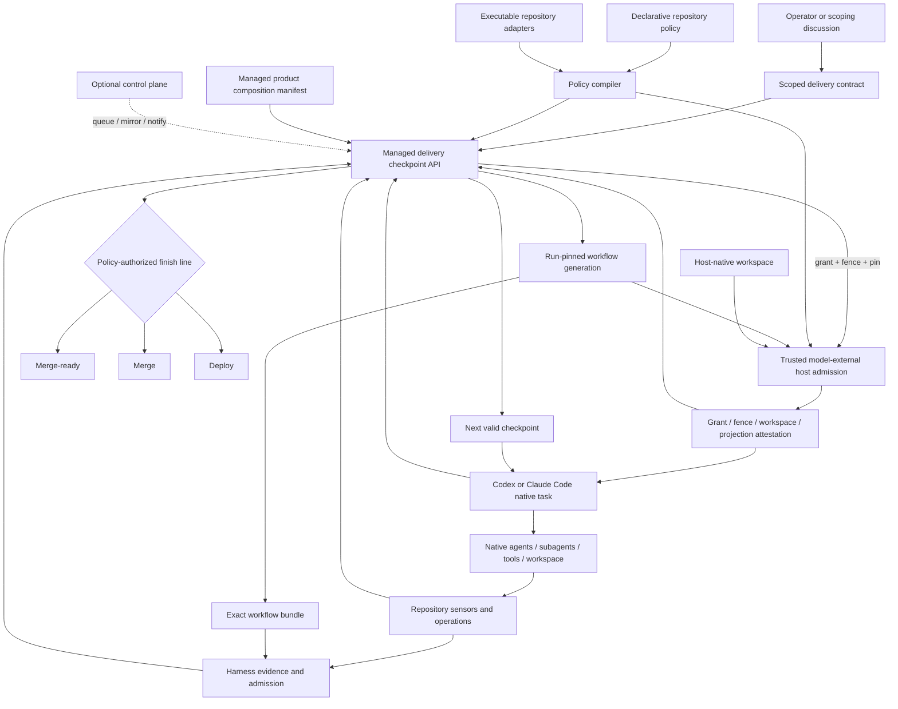
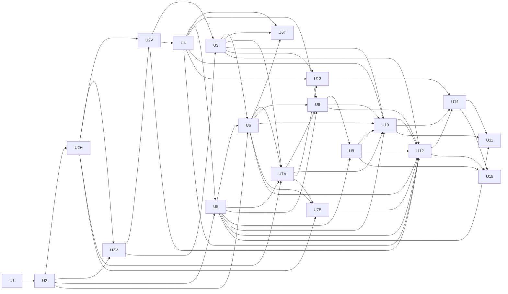

# feat: Compose the managed agent delivery system

## Summary

Turn the extracted `agent-skills` workflow system and `agent-delivery-harness` evidence kernel into one adopter-operated delivery product. The product will accept a scoped outcome, register durable delivery checkpoints, activate an exact qualified workflow bundle, execute repository-owned policy capabilities, retain candidate-bound evidence, and stop at the policy-authorized finish line. Codex and Claude Code remain responsible for orchestrating their own sessions, subagents, tools, permissions, and workspaces.

The adopter installs, runs, inspects, updates, and rolls back one managed system release. Internal modularity is mandatory: workflow semantics, checkpoint orchestration, evidence/admission, policy integration, host integration, local execution, and optional control-plane coordination retain explicit contracts and independent qualification. Athena supplies a layered policy overlay, repository-owned executable adapters, minimal product activation metadata, and product-generated host projections; it no longer selects or reconciles workflow and harness releases independently.

## Target Repositories and Ownership

| Repository | Role in this delivery | Owned plan surfaces |
| --- | --- | --- |
| `/Users/kwamina/agent-delivery-harness` | Adopter-facing managed product and durable delivery authority | Product composition, checkpoint contracts/state machine, policy compiler, host-integration and operation ports, CLI/MCP facade, release/update/rollback, evidence/admission integration, control-plane port |
| `/Users/kwamina/agent-skills` | Mandatory internal workflow module | Authenticated workflow bundle, machine-readable stage/result contracts, host-facing workflow sources and projection templates, default reviewer personas, provider adapter, independently qualified workflow/profile releases |
| `/Users/kwamina/athena` | Reference adopter and policy authority | Layered Athena policy, executable capability adapters, characterization/parity sensors, reversible migration from independently operated vendored skills and existing harness entry points |

No fourth repository or separately operated composition service is introduced in this plan. `agent-delivery-harness` becomes the managed product repository while preserving its existing packages as internal modules and composing an exact `agent-skills` release at the product release boundary.

## Approved Outcome

The authoritative requirements are in `docs/brainstorms/2026-08-27-managed-agent-delivery-system-requirements.md`. This plan implements the smallest local-first managed product that satisfies those requirements and leaves hosted fleet administration for a later delivery.

An operator either supplies already-scoped work or enters a product-owned intake discussion that durably retains questions, answers, and a draft contract until task, outcome, requested authority, and completion are explicit. Intake is not yet a delivery run and grants no mutation authority. The operator confirms the presented contract once; that handoff registers an accepted managed delivery. The managed system owns workflow semantics, durable checkpoints, evidence, policy evaluation, and finish-line decisions. The active Codex or Claude Code task owns execution orchestration through its native agent, subagent, tool, permission, and workspace model. If that host task ends, delivery pauses safely; a later supported task resumes from the last trustworthy checkpoint — at the Tier 1 host floor, that resume costs one typed operator confirmation at the session boundary (entered through a qualified host-owned, model-inaccessible producer before the agent session), continues from the last checkpoint commit, and leaves the prior workspace quarantined for operator cleanup. Operator interruption is reserved for a policy-required approval, genuine blocker, contradictory outcome, or authority outside the accepted contract.

## Superseded Product-Boundary Decisions

This plan supersedes only the adopter-facing product-boundary decisions in `docs/plans/2026-08-27-002-feat-cross-agent-delivery-rails-and-skills-plan.md` that described skills and harness as independently operated products and made harness integration optional to the delivery core.

It retains the qualified work produced by that plan:

- the portable Plan -> Work -> Review -> Compound workflow semantics;
- authenticated skills releases, immutable generations, rollback, and cross-host projections;
- the neutral provider rail and exact-version interoperability evidence;
- the standalone harness kernel, candidate identity, evidence records, admission evaluator, tracked delivery record, and conformance kit;
- Athena's characterization baseline, overlay classification, canary discipline, and authoritative merge-ready gates.

The new composition layer owns compatibility and lifecycle across those modules. Repositories never regain that responsibility through configuration knobs.

## Current-State Evidence

The repository identities below are historical planning baselines captured on 2026-08-29, not claims about the repositories' current heads. They remain the inputs U1 characterizes; later delivery commits do not rewrite the starting point the plan was approved against.

### `agent-delivery-harness`

- Historical planning baseline: main was at `47eca5780548153852799bb4c088c5371085809c`; `npm run check` passed 37 Vitest files and 1,206 tests.
- `@agent-delivery-harness/kernel` already separates candidate identity, preparation, records, validation, admission, and delivery-record verification from CLI, MCP, Action, and conformance surfaces.
- The provider rail already defines version negotiation, ordered events, idempotency, cancellation, and fail-closed terminal states.
- The ordinary gate can invoke one configured evidence provider, but it does not register pre-candidate work, persist delivery checkpoints, expose host-native SDLC progression, run repository operations, or execute a finish line.
- The exact `agent-skills` bridge exists only in an interoperability qualification script; ordinary product execution does not construct or own that bridge.
- Existing evidence remains L0, workspace-scoped process and freshness evidence. Product composition must not overstate provenance.

### `agent-skills`

- Historical planning baseline: main was at `0de253bc3c5a6837590602b42194b9a7de2b3296`; registry validation, 8 hostile mutation sensors, and 252 collected unit tests passed in CI (the `jsonschema` test extra is required locally).
- An authenticated profile archive already contains exact workflow bodies, lifecycle/runtime modules, host adapters, provider, schemas, provenance, and conformance inputs.
- The machine-readable workflow graph/result contract has already landed via the portable autonomous delivery tranche: `workflows/delivery-v1.json` (`workflow-graph/1`, ten stages), `schemas/workflow-graph.schema.json`, `schemas/workflow-stage-result.schema.json`, plus diagnosis and review-orchestration modules. D8 and U6 therefore pin and parity-qualify this contract rather than author it.
- Workflow reducers for planning, execution, review, and compounding are separate from release lifecycle, host projection, optional connectors, and evidence adaptation.
- Current provider output is intentionally limited to `review.green`; it does not own workflow selection, agent invocation, durable recovery, repository policy, or broader lifecycle evidence.
- Both hosts discover one immutable repository-local generation and require fresh sessions after projection activation.

### Athena

- Historical planning baseline: main was at `539ae232f022bb78aac421fd8b4defbf51efa7e7`; the qualified portable core was active for Codex and Claude Code through `.agent-skills/active.json` and generation `f8b39590bae786767cff1cfd849382884a0b66f12ef9978f752dbcb28c230f26`.
- Athena currently vendors the full workflow runtime and skill generation into the repository and separately retains its harness, `pr:athena`, telemetry, reporting, Graphify, Convex, PR, merge, and deployment machinery.
- `.agents/characterization-baseline.json` and `.agents/portable-overlay-map.json` already distinguish reusable workflow behavior, optional adapters, retained Athena policy, and excluded domain behavior.
- This is a proven migration baseline, not the desired steady state: Athena still carries system implementation bytes and their lifecycle in addition to repository policy.

## Execution Posture

Use **characterization-first** for the entire delivery.

The existing systems are live, qualified, and intentionally fail closed. Across every unit, bias toward the simplest approach that achieves the stated outcome and add machinery only when a named failure requires it; review lenses hold their findings to the same bar. Before changing a module boundary, capture the current accepted behavior and its rejection cases as executable compatibility fixtures. Each subsequent unit adds its new contract tests before implementation, but no unit may weaken or reinterpret an existing evidence, rollback, policy, or host-discovery guarantee without an explicit requirements decision.

### Current Athena MVP carve-out (2026-09-01)

The first product version productizes Athena's current delivery system as it exists today. It makes the portable workflow definitions, Athena repository-policy overlay, normalized candidate-bound evidence, review and validation records, and deterministic finish-line decisions reusable. It is a decision and evidence layer, not an orchestrator: the coding host continues to own sessions, subagents, tools, sequencing, worktrees, and remediation; `bun run pr:athena` remains Athena's repository-policy authority; and GitHub remains the merge authority.

The first three Athena shadows are manual, non-authoritative comparisons across one code, one documentation, and one operations delivery. Before manually recording a counted derived summary, the operator independently verifies and retains outside model grants the complete `projection-consumption-observation/1` artifact — `spec`, `deliveryId`, `fence`, `entry` `workflows/delivery-v1.json`, `canonicalProjectionPath`, `projectionDigest`, `hostInvocationId`, and `observedAt` — with immutable candidate and GitHub/`pr:athena` evidence. This is a manual admission condition and operator evidence assertion. Athena's M1 gate entry retains only a derived source/affirmative/digest/marker summary plus that candidate and GitHub evidence; the guard and scorer validate only those derived and candidate/GitHub inputs, not external artifact retention. A counted entry therefore means the operator asserted this manual precondition and the tools accepted the derived input; it neither proves nor preserves the complete envelope, trusted operator intent, delivery registration, takeover authority, model isolation, or any stronger provenance than the host and repository gates actually prove. V26-1527's opaque pre-registration confirmation capability is therefore deferred to a future higher-assurance trust tier and is not an MVP or M1 blocker.

The manual operator loop is intentionally small: materialize the pinned workflow projection; compose the qualified Claude PostToolUse adapter, which produces `projection-consumption-observation/1`; let the host complete and report the exact full Read observation; after final immutable delivery evidence, independently verify and retain the complete artifact outside the model grant, then manually record only its derived summary with immutable candidate and GitHub/`pr:athena` evidence before running the deterministic scorer. Retention is a manual admission condition and operator assertion: the guard and scorer do not inspect external artifact retention and cannot exclude a summary solely because its external artifact is later lost or unavailable. A future qualified Codex native adapter must emit that same normalized contract; Codex is excluded from counting now because it has no qualified binding or producer, and unqualified hosts remain excluded. This delivery adds no launcher, registry, scheduler, daemon, callback framework, control plane, session manager, automatic binding-side writer, or automated shadow scorer. Additional machinery requires an observed failure from these three deliveries.

## Product and Architecture Decisions

### D1. One product, mandatory internal modules

`agent-delivery-harness` publishes one managed product facade and one product release identity. Its internals remain separately testable modules with dependency-direction sensors. `agent-skills` remains a separately authored and qualified source module, but only an exact authenticated archive selected by the product release is exposed to an adopter.

### D2. The product release is the compatibility authority

A versioned composition manifest binds:

- managed product version and distribution digest;
- exact harness module versions and contract tokens;
- exact `agent-skills` archive, metadata, profile, provenance, and qualification identities;
- supported policy, scoped-work, run, workflow-result, event, and control-plane contract versions;
- supported host-native integrations and their qualification identities;
- supported repository operation adapter versions;
- compiled verifier/Action identity and honest attestation level.

No floating branches, independently selectable module versions, or repository-owned compatibility matrices are supported. V1 trust is deliberately local: there is no distribution boundary before the first external adopter, so the composition manifest is not cryptographically signed. Activation verifies full digest closure against the operator-pinned manifest, current local trust state, and an explicit no-downgrade policy backed by a persisted monotonic high-water mark. The high-water mark governs activation of compositions during install/update — an older archive can never silently replace the active generation — while explicit operator rollback to a retained, previously accepted, non-revoked generation is a distinct maintenance operation that neither advances nor violates it. The trust predicate is isolated behind one validation port: every trust check site defined in this plan stays in place, and a detached-signature predicate (pinned public key) replaces the digest predicate when the first external adopter or public distribution arrives — both already gated on the license/provenance audit. Signer rotation and a hosted revocation authority are introduced only with the control plane; neither is a V1 obligation. A product update validates the complete composition before mutation and retains the prior generation for source-independent rollback; rollback can select only a retained generation previously accepted under the local trust policy, never an arbitrary older archive. The manifest and every delivery record declare the trust level verbatim (`product-trust: local-digest / operator-pinned`), mirroring the existing L0 attestation discipline: they claim exactly what was verified and nothing more. Throughout this plan, "authenticated" applied to an archive or release means digest-chain integrity verification against pinned identities, and applied to a qualification lane means credential-protected access; neither claims cryptographic signing in V1.

V1 ships as one immutable private product archive produced by the harness release workflow; public publication is blocked while bundled workflow bytes remain `LicenseRef-Athena-internal`. It declares Node >=22 and Python >=3.11 as preflighted platform prerequisites rather than pretending to be a hermetic single binary. Supported qualification platforms are macOS, Linux, and Windows on the architectures already covered by the two source projects. The installer owns one product layout and command surface over both runtimes. A later public distribution requires an explicit license/provenance audit or relicensing and is not inferred from the Apache-2.0 status of the harness packages.

Every accepted delivery pins the complete product generation. A resumed native host task loads its workflow and binding projection from that delivery's read-only pinned generation root through the trusted admission layer — materialized per D7 as a receipted, grant-protected copy in the delivery worktree, never from one mutable repository-global `current` symlink. Missing, empty, incompatible, or failed loading of the pinned root blocks rather than falling forward to the active generation.

Generation pinning never overrides security revocation. V1 revocation authority is a local, operator-maintained revocation list carrying a monotonically increasing revocation epoch, stored — together with the operator-pinned manifest and the no-downgrade high-water mark — in the installation-scoped product trust store: a protected namespace owned by the product installation, distinct from the per-repository delivery namespace of D3, outside every candidate-writable path, and covered by D16's owner-only permission and protection lifecycle. Repository and worktree namespaces never hold trust state: every trust read resolves to the installation store, planted repository-local trust files are ignored, and a fresh clone or new worktree therefore cannot reset the high-water mark or revocation epoch. Revocation and epoch are installation-global by design — a revocation made from any repository applies to every repository under that installation, and a delivery is bound to its registering installation's identity, so a second installation's trust state can never serve it without the explicit rebinding migration. Install and reinstall must discover and adopt any existing trust store at the installation path before activating anything. The first-install discriminator does not rest on the store alone: the installer records an install receipt outside the store (in the platform's user-configuration location, keyed to the installation path), and the presence of any installation artifact — the receipt, generation roots, the update journal, or active/rollback pointers — implies a prior store, so a missing, deleted, or unreadable store or receipt alongside any of them fails closed rather than initializing epoch zero. The "initially empty" state exists only on a genuinely first installation with none of those artifacts present. The product persists the highest epoch ever observed and rejects epoch rollback. Editing the trust store is a maintenance-lane operation requiring the same user-originated, non-model-mintable assertion as update and rollback; candidate-controlled content and model-driven tasks cannot revoke, un-revoke, or roll the epoch back. There is no network authority and no metadata expiry, so local trust state is always current and there is no offline failure mode. An offline rollback may change the active pointer to retained bytes only if the target generation is not revoked.

Every canonical recheck site (enumerated in the State and Authority Model) rechecks the generation digest and revocation status against current local product-trust state, subject to the consumption substitutions defined there. Revoked bytes remain retained for audit but become execution-ineligible; the current invocation is fenced and the delivery enters `security_blocked`. Leaving `security_blocked` — however entered — always requires current local trust state, full re-preparation, and invalidation/reproduction of revoked-era candidate-bound evidence, and additionally an explicit compatible migration — a maintenance-lane operation consuming the D15 security-blocked migration assertion — when the generation changed or the delivery is being rebound to a different registering-installation identity; a rebinding migration requires the target installation's active profile to equal the delivery's recorded profile and is refused otherwise, and the consumed migration records the new registering-installation identity per the State and Authority Model. Rollback can never execute a now-revoked generation.

### D3. Durable local delivery state is authoritative; host tasks drive it

The first product release includes a durable local checkpoint reducer and an optional, versioned control-plane port. The reducer owns the scoped contract, checkpoint journal, workspace/candidate binding, policy snapshot, evidence references, operation outcomes, approvals, and final action. A supported coding-agent task invokes transitions and performs work through native host capabilities; no product daemon or agent supervisor runs in parallel. Pre-candidate authority lives in a path-contained product namespace rooted at `git rev-parse --git-common-dir`; candidate preparation and harness evidence remain under the active worktree's private Git paths. The control plane may mirror events, queue work, notify a supported host, and request actions, but its projection can never satisfy a local obligation or advance the local state by assertion alone.

Hosted control-plane implementation, fleet governance, and organization rollout policy are deferred. A deterministic simulator qualifies disconnect/reconnect and conflict behavior in this plan.

### D4. Run state and evidence state remain distinct

Durable delivery state records lifecycle and recovery. Intake, checkpoint journal, generation pins, and host-supplied workspace mapping live under the common-Git product namespace and bind immutable repository/delivery/worktree identities. The existing harness evidence store remains candidate-bound, content-addressed, git-private, and worktree-local under that worktree's `--git-dir`/`--git-path`. Workspace cleanup cannot delete common delivery authority, and no delivery may read another worktree's candidate evidence. Before submission, normalized provider output may exist only as a non-authoritative, digest-bound attempt artifact. After harness acceptance, the journal records the returned evidence identity and treats the harness store as the canonical evidence source; it does not copy an accepted result into a second authority. Preparation and admission continue to invalidate when the candidate or wiring changes.

### D5. Repository policy is layered and compiled before run acceptance

The repository provides:

1. a declarative policy document defining activation rules, required SDLC stages, named obligations, review lenses, approval boundaries, allowed finish lines, and granted authority — where a review-lens declaration names its category and references a reviewer persona by identity — resolving either to a persona shipped in the authenticated composition, whose digest the compiled snapshot binds from the pinned composition so that advancing the shipped set never edits an adopter's policy, or to an adopter-supplied persona at a protected path, referenced by identity and digest because those bytes are repository-owned — and never to inline prose, so policy remains a place where prose is unspellable; and
2. executable adapters exposing repository-owned sensors and operations through typed capability descriptors.

The product compiles both layers plus its portable defaults into one immutable normalized policy snapshot. Policy, executable adapters, and any adopter-supplied persona a lens references are loaded from a trusted pre-run base or owner-approved installed policy generation, copied into a read-only execution location, and digest-bound before a host may mutate the candidate workspace. Candidate edits to policy, adapters, sensors, personas, or trust metadata are proposals for a future delivery and cannot judge, authorize, or update the current delivery. Unknown fields, contradictory finish lines, duplicate obligations, unavailable required capabilities, an unresolvable persona reference, integration/version mismatches, or prose-only authority reject the delivery before mutation. Existing `HarnessConfig` becomes the admission projection of this policy, not the entire policy model.

The immutable snapshot preserves reproducibility, while a separate monotonic authority-revocation epoch provides an emergency ceiling. The checkpoint transition API checks the current trusted epoch at every canonical recheck site enumerated in the State and Authority Model. A revocation can narrow or stop authority immediately, including after the final candidate commit but before merge-ready completion; expanding authority requires a new owner-approved policy generation and never mutates an existing delivery's ceiling upward.

### D6. Scoped work precedes mutation

A versioned scoped-delivery contract binds the requested task, intended outcome, acceptance criteria, non-goals, repository/workspace request, requested finish line, requested authority, and unresolved decisions. It can request only a subset of the authority the compiled repository policy grants; policy always wins, and absence of a grant is denial. Product-owned intake retains an incomplete draft, asks only material clarification questions, presents the normalized contract for confirmation, and converts it to a managed run without asking the operator to author schema. Material ambiguity remains in intake and cannot begin mutation.

### D7. Coding-agent harnesses own execution orchestration

Codex and Claude Code already provide the agent runtime: sessions, subagents, permissions, tools/MCP servers, workspace handling, cancellation, and parallelism. The managed product must integrate through host-native skills, plugins, and tool contracts; it must not launch `codex exec`, `claude --print`, or any other subordinate agent process to recreate those capabilities. A host integration reads the next valid workflow checkpoint, supplies immutable delivery/policy/candidate context to the native task, and records typed outcomes through the checkpoint API. The active host owns how it delegates or sequences work, while the managed product owns whether a checkpoint is valid, what evidence is required, and whether the finish line is satisfied.

The compiled policy also emits a checkpoint-specific host execution grant: allowed native tools/MCP capabilities, writable paths, protected authority paths, credential availability, and forbidden external operations. A trusted model-external host-control binding applies that grant, the host-supplied workspace, and the run-pinned workflow root before a native task/turn/session exposes model tools. A model-external interceptor satisfies this requirement equivalently only if it evaluates every tool invocation against the grant contents for the life of the invocation, honors only an attestation bound to the current invocation fence, delivery, workspace, grant digest, and projection digest — never merely any existing attestation — and re-denies immediately on fence or product-trust revocation: the enforced property is that no tool ever executes outside the currently attested grant, not the mechanism's timing. The run-pinned workflow root is materialized by the binding into the host-created isolated worktree itself and digest-receipted, so no repository-global active pointer is consulted at run time and no host API for root selection is required. Discovery-scoping exclusivity — the ability to make ambient project-level skill discovery yield only the run-pinned projection — is a distinct graded host capability probed by U2H alongside Tier 1, with a declared downgrade position (U13) for hosts that can only add roots. The materialized projection is copied from the immutable generation root (plus the binding's per-run consumption marker) into a read-only subtree that the execution grant lists among its protected authority paths, kept untracked through a genuinely worktree-scoped exclusion: worktree-scoped `core.excludesFile` under `extensions.worktreeConfig`, whose enablement is the single permitted common-configuration write, preflighted (relocating `core.bare`/`core.worktree` per Git's requirements where needed) and preserving any pre-existing worktree `core.excludesFile` value — never the shared `info/exclude` pattern space and never a tracked ignore edit — torn down with the worktree, with that one write and its cross-worktree non-interference sensored in U5/U7A. The discovery-configuration set is a binding-exclusive artifact the host itself never mutates; host-writable settings (such as persisted permission decisions) live outside the digest-bound set. The delivery-owned exclusion from candidate identity, dirty-baseline classification, and review/record neutrality applies to exactly two closed, digest-bound path sets named in the attestation: the receipted projection subtree (generation content plus the binding's per-run consumption marker, digest-bound at materialization) and the binding-written host discovery-configuration set (per-delivery bytes, digest-bound at application). No other path may claim that classification, any byte inside either set not matching its digest fails closed, and any tracked, staged, or committed path inside either set fails closed as a protected-authority-path violation before checkpoint commit, with the U8 recording verifier independently rejecting candidate trees containing paths from either set. Both digests are re-verified at every canonical recheck site, subject to the consumption substitutions the State and Authority Model defines, so mid-run tampering fails closed at any stage, including `acting` and terminal success. For Claude Code, V1 targets a trusted plugin/hook/session-admission surface; for Codex, V1 targets its app-server/native desktop task-and-turn admission surface. The binding may request creation of one native delivery task and receive lifecycle events, but it never schedules stages, launches CLI agent subprocesses, manages subagents, or substitutes for the host runtime. Successful application yields a host attestation bound to the invocation fence; missing, empty, unsupported, or failed grant application yields no mutation-capable invocation token. U2H qualifies each host against a graded capability ladder rather than a binary check. Tier 0 (no enforceable grant) permits only read-only status and inspection operations; a Tier 0 host is not a supported delivery host in V1 — it may use the read-only status and inspection operations, but no read-only delivery lane is built or claimed as qualified. Tier 1 — deny-until-attested grant enforcement, worktree-materialized projection, binding attestation, a qualified host-owned operator-confirmation producer, fence-revocation cancellation, and fresh-worktree-only resume — is the V1 mutation floor and is deliberately composed of capabilities the host can enforce without exposing them to model-owned execution; the host- or OS-native approval-assertion source is probed alongside Tier 1 but gates only D15's sensitive approvals; D15's operator confirmations (contract confirmation, takeover) require that qualified host-owned producer and the kernel's host-neutral observation contract; the facade alone is not proof of operator origin, and a host without a qualified producer remains Tier 0. A host may still lack a host-native sensitive-approval assertion source when supported installations provide the OS-native source that U3 preflights. Tier 2 adds trusted graceful lifecycle events (honest `paused`, acknowledged cancellation). Tier 3 adds graceful termination provenance with verified descendant teardown and enables same-worktree resume. M0, U5, and the host integration units assume only Tier 1; higher tiers are per-host qualified conveniences, never prerequisites. A checkpoint-specific grant does not require a new host session per checkpoint: the binding applies a bounded session envelope at admission — the union of the grants for model-driven checkpoints reachable in that session, explicitly excluding the grants of checkpoints executed outside the model-driven grant (privileged actions per U15) and never exceeding the delivery's compiled ceiling — and the per-invocation interceptor narrows enforcement to the current checkpoint's grant, re-attesting on every grant change; if the interceptor becomes unavailable mid-session the invocation is fenced rather than falling back to the envelope. On a host whose admission surface cannot re-apply mid-session, the interceptor branch is mandatory for multi-stage sessions, and pre-tool application alone qualifies only single-stage lanes.

The supported host enforces the grant through its own permission system; the product does not implement a second sandbox. The host also owns any trusted operator-confirmation producer: it must present and receive the canonical challenge before registration or takeover through a channel that model-owned execution cannot invoke, observe, inherit, or interpose. The producer submits one host-neutral confirmation observation to the kernel, which alone evaluates the evidence and decides whether the transition is admitted. Claude and any future Codex adapter must produce that same contract; a host without a qualified producer remains Tier 0. Managed authority state is outside candidate-writable paths. Merge, deploy, update, rollback, and human approval credentials are never exposed to model-driven tasks and remain reachable only through bound adapters after authorization. A host unable to enforce the required grant is limited to read-only status and inspection operations; it cannot qualify for candidate mutation, privileged actions, or any delivery finish line. Host interruption sets an orthogonal durable host-activity marker to `paused` only when trusted lifecycle evidence exists; otherwise activity becomes `unknown`. Neither changes the underlying delivery checkpoint, and a returning host must satisfy the fencing and workspace rules in D13 before continuing.

### D8. Workflow text and runtime stages form one qualified module contract

The skills archive already carries a machine-readable workflow graph/result contract alongside the existing skill text and reducers; this plan pins it and closes any gaps the managed checkpoints expose rather than authoring it anew. The graph names stages, prerequisites, mutation class, expected outputs, retry/reconciliation behavior, and evidence adapters without encoding repository commands. Parity qualification proves that host-facing instructions and runtime reducers describe the same checkpoints. The archive also carries the default reviewer personas the policy layer references by identity — one per mandatory lens category plus the policy-activatable risk categories — each stating its charter, its bar for what counts as a finding rather than a note, its severity vocabulary, and its scope discipline. Personas are host-neutral: a host difference surfaces as a graded capability, never as a divergent persona rendering, so a persona carries charter prose and not host-specific tool or model bindings. Where a persona adapts existing permissively licensed reviewer prose, it retains that source's notice and attribution, and every persona declares its authorship provenance in the archive's existing license/provenance metadata, which U3's manifest closure and license sensors cover alongside every other shipped byte — a persona whose provenance would block the public distribution flip is rejected there rather than at the flip. Personas are content the product ships rather than behavior it executes, so a persona changes what a reviewer is told, never how the reducer interprets a result — the reducer compares its digest and never reads its content.

### D9. The harness composes lifecycle evidence

The skills provider continues to emit only review evidence. The managed runtime obtains other required claims from repository sensor/operation adapters and system lifecycle providers. It submits each through the existing harness validation/admission boundary and advances only when the compiled policy's activated obligations are satisfied. Provider rails stay internal and opaque; Athena never constructs their payloads.

### D10. Finish line is policy-selected and actioned locally

`merge-ready` is the product default. The scoped contract may request a narrower finish line but cannot expand the compiled policy grant. `merge` and `deploy` require explicit declarative policy authority, a matching contract request, a corresponding executable adapter, satisfied preconditions, and any required approval. The active host records a durable action intent before invoking the operation and records the observed result afterward. It never treats PR creation, merge, or deployment as implied by a green review.

### D11. Athena is a policy overlay, not a system distribution

Athena's steady-state tracked integration contains its policy, executable adapters, and minimal product activation metadata. Managed system implementation bytes, workflow source, provider implementation, and module selection are product-owned. Any repository-local projection required for host discovery is generated and receipted by the product, excluded from independent operator versioning, and qualified before the current tracked vendor generation can be removed.

### D12. Durable checkpoints do not imply background execution

No product-owned daemon, user service, socket, heartbeat, process supervisor, or worker registry is part of the delivery architecture. While a supported Codex or Claude Code task is active, it may advance valid transitions continuously without operator choreography. A trusted graceful lifecycle event marks host activity `paused`; a missing callback, crashed host, disconnected app, or an invocation-fence observation older than its U2-declared observation lifetime marks it `unknown` lazily on `status` or `resume`. Timeout or `unknown` never proves termination. Termination provenance has two distinct forms: graceful provenance — a trusted host lifecycle event at clean end, on a host whose descendant teardown behavior was verified in U2H — and crash provenance, which no supported host can supply and no daemon exists to observe; the product never waits for or infers crash provenance. In all cases the underlying delivery checkpoint does not change or progress. `status` and `resume` reconstruct the next trustworthy action from the checkpoint journal, pinned composition and policy, current authority epoch, workspace/candidate identity, invocation fence, host attestation, and accepted evidence. A host disappearance without trusted runtime termination provenance leaves the prior workspace explicitly unverified. It may be quarantined and its delivery authority superseded, but the product never claims that the old task or descendants terminated. This is autonomous delivery within an active coding-agent harness, with cross-session resumability—not unattended background compute.

### D13. The coding-agent harness owns workspace lifecycle; the product binds candidates

Every mutating delivery uses an isolated Git workspace created or adopted through the coding-agent harness's native workspace/worktree facilities. The managed product does not create, delete, or supervise worktrees. Before mutation it validates the host-supplied repository, base, branch, worktree, and clean/classified baseline against policy, then binds the delivery to those identities. Each host invocation acquires an atomic monotonically increasing fence bound to delivery, expected journal revision, host task, worktree, candidate, policy, and authority epoch. The host integration revalidates that fence at every canonical recheck site enumerated in the State and Authority Model; outputs from an older fence are permanently rejected.

A new invocation may reuse a workspace only after qualified graceful termination provenance: a trusted host-runtime lifecycle event—never a model-callable tool—at clean end, on a host whose descendant teardown was verified in U2H (Tier 3). After a crash or any ungraceful disappearance, crash provenance is structurally unavailable in V1, so the designed—not degraded—path is an operator-authorized takeover that quarantines the old workspace and uses a fresh isolated worktree reconstructed from the last trusted commit; on hosts qualified below Tier 3, fresh-worktree takeover is the only resume path. Takeover reconstructs onto a distinct takeover branch, and candidate identity binds the branch ref value as well as the commit, so a stale host that still writes the old branch ref through the shared common Git directory produces a detectable binding mismatch instead of silent adoption. Timeout alone is never proof of termination. The new fence supersedes the old invocation's delivery authority but does not assert that the old host stopped. After each mutation the host records changed paths and creates any policy-authorized checkpoint commit through its native Git tooling; the product recaptures candidate identity and invalidates stale evidence. Branch collision, dirty-root, unexpected-path, commit, promotion, workspace loss, and uncertain prior-host termination are checkpointed and fail closed. Root checkout and unrelated tracked/untracked work are never implicit delivery inputs.

### D14. Outcome completion is a candidate-bound obligation

Every accepted contract yields an outcome-verification claim. It maps each acceptance criterion to exact candidate-bound sensor, artifact, review, or operation evidence and one disposition: passed, amended-waived, or blocked. A waiver is not an evidence shortcut: an authorized repository role may propose it with actor identity, reason, and exact criterion, but it becomes valid only as a scoped-contract amendment. Every waiver amendment, outcome-changing or not, is consumed as a sensitive approval under D15; whether a waiver changes the intended outcome is decided by the original operator or the policy-declared outcome delegate, never by the proposing agent or any model-driven component. If it changes the intended outcome, the original operator or a policy-declared outcome delegate must confirm it; confirmation creates a new contract identity and forces policy, plan, candidate, review, and evidence re-evaluation. A blanket waiver cannot produce delivery success—at least one positive outcome criterion must pass, otherwise the intake/run is cancelled or returned for rescoping. Waivers after admission or under stale approval are rejected. At least one independent outcome/correctness reviewer and one independent testing/policy reviewer must complete under distinct attempt identities, where independence also requires distinct lens contracts and independently constructed contexts — re-invoking the same agent, prompt, and context under a fresh attempt identity does not qualify, attempt records bind a context digest to make that falsifiable, and U8's sensors reject same-context re-invocation under a fresh attempt identity; risk policy may add more lenses. An attempt record also binds the digest of the reviewer persona that was materialized for it, resolved by the trusted binding from the compiled policy's lens declaration and written into the attempt record by the product — never read back from an agent's submission or claim, since possessing a readable persona's bytes proves only read access and not that the charter reached the reviewer — from that persona's trusted pre-run materialization: the run-pinned projection for a persona shipped in the composition, the digest-bound read-only policy copy for an adopter-supplied one. Materializing a persona for an attempt is what supplies that charter to its reviewer, so a lens category is qualified by the charter its reviewer was given rather than asserted by its label; an attempt whose bound persona digest is not the one the compiled policy's lens declaration references does not satisfy that lens. Zero lenses, duplicated reviewer attempts, missing mandatory lenses, generic approval without criterion mapping, or an unverified criterion blocks admission. An agent cannot propose and approve a waiver or confirm an outcome amendment.

### D15. Control and approvals are authenticated capabilities

Read-only status, delivery control, maintenance, approval, operator confirmation, and external actions are separate capabilities. User-originated authorization comes in two classes, both non-model-mintable. **Sensitive approvals** require an assertion — host-native where the host provides one, or OS-native interactive authentication where it does not: a local biometric or password prompt evaluated only in the model-external maintenance/binding lane, requiring one fresh interactive evaluation per single-use nonce with OS credential-caching and reuse windows disabled or treated as invalid, whose prompt context discloses the exact target and action being approved, and whose repository-role mapping derives from the product's operator configuration, never from the OS unlock alone. Delivery-bound assertions bind origin, delivery, candidate, policy, both revocation epochs, the invocation fence, action, expiry, and a single-use nonce; maintenance-lane assertions (update, rollback, and trust-state maintenance) bind the target installation and generation identities in place of delivery/candidate/fence; a security-blocked migration assertion binds the target installation and generation identities (the target generation being non-revoked) plus the target delivery identity and its expected journal revision — rejecting consumption on any mismatch — in place of candidate/fence, and its prompt discloses the target installation, delivery, journal revision, and generation. The sensitive set comprises waiver validity and confirmation, update, rollback, trust-state maintenance, security-blocked migration, and the merge and deploy approvals where compiled policy requires one (policy-authorized unattended merge or deploy, granted through the Approval Handoffs owner process, proceeds through `acting` without a runtime approval). Assertion sources are evaluated per operator context, and an available interactive authentication context — host-native or OS-native — is an install-time platform prerequisite: U3 preflights it before activation and U10's status model reports it, so a platform without one is not a supported installation target. If the assertion source is lost after install, sensitive operations fail closed until an operator-performed interactive installer repair — the same operator act as first install, adopting and never editing the existing trust store, refused while a working assertion source exists, and carrying the confirmation channel's full mechanization by reference (grant exclusion, interceptor denial, host-rendered echo challenge, non-interactive refusal) — re-establishes the assertion provider, so the sensitive set is never permanently unavailable on a supported installation and R19's rollback path is preserved. A session without an assertion source (for example a non-interactive automation session) can still drive delivery — operator confirmations suffice when a qualified host-owned producer supplies the kernel observation outside the session — while sensitive approvals wait for an interactive context on the same installation. The genuinely first install-and-pin on a fresh installation is the operator's own interactive installer act and precedes assertion hardening (U3V); every subsequent trust-store edit requires the assertion. **Operator confirmations** — contract confirmation at intake handoff and operator-authorized workspace takeover — require no OS or host assertion, but they do require a qualified host-owned producer that runs before registration or takeover on a channel model-owned execution cannot invoke, observe, inherit, or interpose. The producer renders the canonical bound identity and short-lived single-use challenge, refuses non-interactive input, receives the exact echo on that same channel, and submits one host-neutral confirmation observation to the kernel. The kernel evaluates that observation and alone decides whether the transition is admitted; it does not trust a facade caller's assertion of human origin. Claude and any future Codex adapter produce the same observation contract, and an installation without a qualified producer remains Tier 0. Confirmation operations remain excluded from every compiled execution grant and the intake grant, denied by the D7 interceptor inside any grant, and unavailable through CLI, MCP, model tools, or shell-accessible product surfaces. Each confirmation binds origin, the intake draft or delivery identity, action, expiry, a single-use nonce, and both revocation epochs (the repository authority epoch exists and binds from `validating_acceptance` onward). A contract confirmation binds the exact normalized-contract digest presented to the operator; any draft mutation after presentation voids the nonce and returns intake to `awaiting_confirmation`. A takeover confirmation is minted before the new fence exists and binds the superseded invocation fence, the expected journal revision, and the target base commit, rejecting consumption on any mismatch. Candidate and fence otherwise bind only once they exist; pre-delivery confirmations record them explicitly absent-by-state. The operator-confirmation contract is part of the U2 spine; U3 owns the sensitive-assertion contract. Agents and subagents cannot request either on their own, and sensitive approvals are evaluated by their assertion provider, while confirmation observations are evaluated and consumed only by the host-neutral kernel; both records are minted outside the model-driven execution grant. Candidate-controlled content cannot mint capabilities. The product consumes the host or OS assertion but does not create a second local authentication service; OS-native authentication delegates credential evaluation entirely to the operating system.

### D16. Durable data has an explicit protection lifecycle

Intake, checkpoint journals, attempt artifacts, evidence, the installation-scoped product trust store, the maintenance/update journal, and the install receipt are created in path-contained non-symlink directories with owner-only directory/file permissions (`0700`/`0600` semantics or platform ACL equivalents). Schemas classify sensitive fields; secret-like values are rejected or redacted before append, and raw host environments/transcripts are never durable authority. Policy defines retention bounds for terminal delivery detail and for quarantined workspaces (operator-owned cleanup, surfaced in U10's status inventory), while the minimum candidate/policy/evidence/action audit record is retained according to repository obligations. Authenticated export and terminal-delivery deletion operate only on owned paths and report which audit records policy requires preserving. OS disk encryption is a documented platform assumption, not a product claim.

## System Flow



The prose decisions and contracts are authoritative if this diagram diverges.

## State and Authority Model

Intake and delivery are separate durable reducers. Intake states are `draft_scope -> awaiting_clarification -> awaiting_confirmation -> validating_acceptance -> accepted_contract`, `blocked`, or `abandoned`. Policy, capability, composition, or repository preflight failure enters `blocked` with typed remediation and may retry `validating_acceptance`; intake never owns repository mutation. Intake operates under the read and control capabilities only, and its enforcement is not aspirational: product-owned intake turns run under an applied, attested read-only intake grant through the same D7 admission binding, whose protected paths include the installation trust store, every product namespace, and every delivery journal. The intake grant is compiled from portable product defaults (no repository policy snapshot exists yet) and applied by the U2H binding; its attestation uses an intake binding profile frozen in U2's spine alongside the checkpoint-specific profile — bound to host version, the intake draft identity, grant digest, product-trust revocation epoch, and expiry, with fence, delivery, workspace, projection, and every delivery-scoped value — including the registering-installation identity and active profile — recorded explicitly absent-by-state. Intake's control capability is scoped to its own intake record (create, clarify, present, abandon) and cannot invoke delivery-control operations on any registered delivery. Only a host that cannot apply the intake grant falls back — the fallback is never an opt-out on a capable host: no product-owned intake turn runs on that path, the operator supplies an already-scoped contract directly through the facade, and the D15 operator confirmation is still required. Intake's durable writes are confined to the intake journal via facade operations, capability preflight is read-only discovery, and no execution grant beyond the intake grant, no invocation fence, and no workspace binding exists until the accepted contract registers the delivery. Confirming and validating an accepted contract creates the managed run and ends intake ownership; the confirmation is a D15 operator confirmation produced through the qualified host-owned channel and evaluated and consumed by the kernel, outside intake's read/control capability set.

The managed delivery has conditional transitions rather than one linear chain. Every active transition is requested by a supported host task. Current host activity is tracked separately as `active`, `paused`, `unknown`, or `cancellation_pending`; trusted runtime termination is immutable provenance attached to the prior invocation, not a current activity state. No host-activity marker changes the underlying delivery state:

| From | Condition | To |
| --- | --- | --- |
| `accepted` | Composition, policy, host integration, and workspace-binding preflight pass | `preparing` |
| `preparing` | Host-supplied isolated workspace and initial checkpoint are durable | `planning` |
| `planning` | Plan output is accepted | `implementing` |
| `implementing` | Versioned candidate checkpoint created | `validating` |
| `validating` | Required sensor fails or implementation repair is needed | `remediating` |
| `validating` | Required sensors pass on current candidate | `reviewing` |
| `reviewing` | Actionable finding exists | `remediating` |
| `remediating` | Any candidate mutation is checkpointed | `validating` |
| `reviewing` | Every selected lens approves the current candidate | `compounding` |
| `compounding` | No repository mutation | `admitting` |
| `compounding` | Candidate changes | `validating` |
| `admitting` | Current preparation and all activated obligations pass | `recording` |
| `recording` | Tracked record is checkpoint-committed and both-neutral verification passes | `ready` |
| `recording` | Any non-neutral byte or identity changes | `validating` |
| `ready` | Finish line is `merge-ready` and repository merge-ready obligations pass | `completed` |
| `ready` | Explicitly authorized merge/deploy action remains | `awaiting_approval` when policy requires an approval for that action, otherwise `acting` |
| `awaiting_approval` | Valid user-originated approval is consumed and all bindings remain current | `acting` |
| `awaiting_approval` | Approval denied, expired, revoked, or unavailable | `blocked` or `cancelled` according to policy |
| `awaiting_approval` | Candidate, base, policy, authority epoch, or invocation fence changes | `validating` or `blocked` according to the changed binding |
| `acting` | Action is reconciled and required post-action evidence passes | `completed` or the next authorized `acting` step |
| `acting` | External action succeeded but required verification failed | `action_succeeded_verification_failed` |

`blocked`, `security_blocked`, `cancellation_requested`, `awaiting_approval`, `action_succeeded_verification_failed`, `cancelled`, and `failed` are suspended or terminal delivery variants reachable only through typed transitions. Product-trust revocation immediately fences the invocation and enters `security_blocked`; leaving `security_blocked` — however entered — always requires current local trust state, full re-preparation, and invalidation of evidence produced while the generation stood revoked (un-revocation restores execution eligibility for new preparation, not retroactive trust), and additionally requires an explicit compatible migration — a maintenance-lane operation consuming the D15 security-blocked migration assertion — when the generation changed or the delivery is being rebound to a different registering-installation identity; a rebinding migration requires the target installation's active profile to equal the delivery's recorded profile and is refused otherwise, and the consumed migration's `approval.assertion.consumed` payload records the new registering-installation identity, with the recheck resolving the latest recorded binding. `cancellation_requested` immediately revokes the invocation fence and calls the host-native cancellation primitive. It reaches `cancelled` after either qualified graceful host-runtime termination provenance (Tier 3) plus workspace reconciliation, or permanent quarantine of the prior workspace and preservation of the last trusted candidate; the latter never claims process termination. Until one path completes, host activity remains `cancellation_pending` and prior-workspace mutation remains unverified. `action_succeeded_verification_failed` records that the irreversible action must never be repeated; policy selects containment, rollback where supported, or operator escalation, and only verification/containment may resume. Admission has no edge from `remediating`; an aligned final review bound to the current candidate is mandatory after every mutation. The canonical recheck sites are: host admission, every mutation-capable stage and transition, checkpoint commit, evidence submission and acceptance, approval and operator-confirmation consumption, transition to `ready`, external action, and terminal success. Product trust, the repository authority-revocation epoch, the invocation fence, the registering-installation identity and active profile, and the projection and discovery-configuration digests are all rechecked at every canonical site; D2, D5, D7, and D13 reference this list rather than restating it. Values recorded absent-by-state are not rechecked; takeover consumption rechecks the superseded fence, expected journal revision, and target base commit in place of the current fence and the prior worktree's projection and discovery-configuration digests; and rebinding-migration consumption rechecks the current installation's identity and active profile against the assertion's bound target installation and the delivery's recorded profile, in place of the recorded registering-installation identity, which that consumption replaces; migration consumption likewise evaluates product trust against the assertion's bound target generation — the candidate deliberately not bound by the assertion (the mandatory re-preparation recaptures it), with fence and the prior worktree's projection and discovery-configuration digests absent-by-state — in place of the delivery's recorded generation pin, which that consumption replaces. A changed value returns to policy evaluation, `blocked`, or `security_blocked` as appropriate. Vacuous satisfaction is excluded: policy compilation rejects a policy activating zero review lenses (D14), and admission rejects an empty activated-obligation set, so `reviewing` and `admitting` cannot be passed by absence. A pending waiver or contract-amendment approval is consumed within `reviewing`, `remediating`, or `admitting` without a dedicated wait state: the proposal and its pending marker are journaled as `approval.request.recorded`, the delivery remains in its current state, and the approval-consumption recheck anchors to the delivery's state at consumption. A pending marker carries forward across the review, remediation, compounding, and admission transitions, but if the candidate has changed since proposal the waiver's criterion binding is re-evaluated and a stale proposal voids with `blocker.recorded`, as does denial or expiry; `awaiting_approval` remains exclusive to post-`ready` external actions. A blocked or interrupted delivery resumes from its last trustworthy checkpoint and cannot skip missing evidence.

The product's durable event-kind vocabulary is closed and enumerated here; it is shared across the intake and delivery journals and the installation-scoped maintenance journal (D2's update journal, protected under D16 alongside the trust store and install receipt), each kind naming its home journal, and U2 freezes it verbatim. Active kinds, whose payloads U2 defines — intake journal: `intake.state.changed`, `operator.confirmation.recorded` for contract confirmations (referenced by the delivery journal at registration); delivery journal: `delivery.registered` (its payload includes the U2-frozen active-composition-profile and registering-installation-identity fields, first populated per U3V's manifest declaration and receipt), `workspace.bound`, `invocation.fenced`, `activity.observed`, `operator.confirmation.recorded` for takeover authorizations, `approval.request.recorded` (pending waiver/amendment proposals and their markers), `operation.result.recorded` (repository sensor/operation outcomes — the payload embeds the adapter's typed result per the capability descriptor contract, so capabilities extend adapter results without touching the envelope), `workspace.disposition.recorded` (quarantine, takeover, reconciliation outcomes, including `prior_host_termination_unverified`), `transition.committed`, `stage.result.recorded`, `attempt.artifact.recorded`, `evidence.reference.recorded`, `candidate.recaptured`, `policy.snapshot.bound`, `generation.pinned`, `trust.epoch.observed` (product-trust and repository-authority epochs), `blocker.recorded`, `finish.line.recorded`. U8's tracked-record path/digest journaling rides the `recording` transition's `transition.committed` payload. Reserved kinds, whose payloads their owning units define: `approval.assertion.consumed` (U3, delivery journal) and `maintenance.action.recorded` (U3, maintenance journal), `retention.action.recorded` (U5, maintenance journal — export and deletion operations survive their target's removal), `intake.clarification.recorded` and `intake.draft.recorded` (U6, intake journal), `termination.provenance.recorded` (U7A, delivery journal — trusted host-runtime lifecycle provenance from the trusted integration event, explicitly distinct from `activity.observed`), `contract.amended` (U8, delivery journal — a confirmed amendment or waiver creating a new contract identity), `action.intent.recorded` and `action.result.recorded` (U9, delivery journal, extended by U15), `control.plane.mirror.recorded` (U11, delivery journal). A reserved kind rejects unconditionally — with or without a payload — until its owning unit defines it, and a kind outside this enumeration rejects as unknown. Observation-only appends — `activity.observed`, `trust.epoch.observed`, and `control.plane.mirror.recorded` (by D3's construction a mirror record carries no local delivery fact; a contradictory remote claim is journaled as `blocker.recorded` under U11's coalescing bound, which does advance), exactly — never advance the expected journal revision that fences, assertions, and confirmations bind. Adding any kind, active or reserved, is a spine contract revision requiring contract-freeze owner approval. The intake and delivery state lists above are likewise frozen by U2 as discriminators; U6 owns only the payload schemas of the intake clarification and draft records, never new states.

| Decision or fact | Authority |
| --- | --- |
| Task/outcome and approved scope | Confirmed scoped delivery contract |
| Portable workflow semantics and stage outputs | Exact bundled `agent-skills` module |
| Repository obligations and maximum granted finish line | Compiled local policy snapshot |
| Requested finish line and authority subset | Scoped delivery contract, bounded by compiled policy |
| Source and candidate identity | Local Git/worktree observation |
| Sensor and operation result | Repository executable adapter result |
| Evidence acceptance and admission | Harness kernel |
| Delivery progression and recovery | Managed checkpoint journal/reducer, driven by an active supported host |
| Sessions, subagents, tools, permissions, cancellation, and workspace lifecycle | Active Codex or Claude Code harness |
| Permitted tool/path/credential envelope for a checkpoint | Compiled policy grant enforced by the qualified host-native permission system |
| Queue, scheduling, cross-repo visibility | Optional control-plane projection |
| Human approval | Explicit approval event bound to run, action, policy, and candidate |

## Scope

### In scope

- One managed product release and lifecycle over exact modular components.
- Versioned contracts for scoped work, normalized policy, workflow stages/results, durable checkpoints/events, finish-line actions, and optional control-plane messages.
- Durable local delivery state with safe host-task pause/resume, approval, reconciliation, and candidate invalidation.
- Product-owned activation of exact workflow bundles and host-native Codex/Claude Code projections.
- Repository capability adapters for sensors, PR/merge/deploy actions, and typed blockers.
- Existing harness evidence/admission integration and honest L0 delivery records.
- One product CLI/MCP surface for iterative scope handoff, start-or-resume, next-checkpoint, submit-result, status/watch, approve, request-cancellation, explain-blocker, update, rollback, trust-state maintenance (pin, revoke, un-revoke, high-water-mark advance), security-blocked migration, authenticated export, and terminal-delivery deletion.
- A deterministic no-secret conformance fixture plus authenticated host qualification lanes.
- Athena's layered policy adapter, shadow comparison, canary cutover, rollback rehearsal, and removal of independently operated skills/harness lifecycle responsibility.

### Out of scope

- A hosted control-plane service, fleet UI, organization-wide policy administration, or rollout waves.
- Fully remote execution that removes the local repository authority boundary.
- Agent hosts beyond Codex and Claude Code.
- General provenance stronger than the current L0 attestation model.
- A universal tracker, CI, PR, merge, deployment, or repository policy.
- Rewriting Athena's authoritative commands inside the product.
- Automatic promotion of repository learnings into a product release.
- Domain-specific workflow packs.
- A product-owned agent daemon, process supervisor, subagent scheduler, permission system, cancellation runtime, or workspace/worktree manager.
- Cryptographic release signing, signer rotation, or a hosted revocation authority before their explicit triggers: detached signing arrives with the first external adopter or public distribution (a documented manual key-replacement procedure stands in for rotation until then), and signer rotation and a hosted revocation authority arrive only with the deferred hosted control-plane service, not with U11's local connector port.
- Publishing the HTML rendering of this plan before the Markdown plan reaches unanimous review alignment.

## Implementation Units

Dependencies below are direct. Each unit begins by adding or freezing the named characterization and rejection scenarios; implementation follows only after those sensors fail for the intended missing behavior.

### U1. Freeze the three-repository composition baseline

**Goal:** Create one versioned, executable statement of the current qualified module identities, behaviors, and ownership boundaries before composition changes.

**Requirements:** R1-R4, R19-R20

**Dependencies:** None

**Ownership:** `agent-delivery-harness` conformance fixtures and `agent-skills` qualification metadata; Athena contributes read-only baseline inputs.

**Approach:** Capture current commits, package/profile/release identities, rail tokens, workflow checkpoints, harness evidence behavior, host discovery, update/rollback, Athena overlay classifications, and current independent-lifecycle burden. Record a quantitative manual-choreography baseline for M1, scored under the operator-intervention rubric this plan fixes in U2V's sensor text — the rubric is plan prose, fixed at approval, so U1 applies it without depending on U2V's implementation, and it is applied identically to both sides (baseline events are classified into the same intervention versus policy-required-interruption categories): operator-intervention counts and blocked-versus-progressing wall-clock shares on at least three Athena deliveries covering at least one code, one docs, and one operations change, executed with the current skills/harness choreography on the proving host. The baseline artifact freezes the specific deliveries and mix before M1 measures; the M1 comparison set must match that mix and count, and the baseline is re-recorded if U2H's grading moves the proving host or the rubric text is amended. Mark each assertion as retained, changed-by-this-plan, or excluded. Reuse existing conformance evidence rather than copying implementations.

**Representative scenarios:** Current skills archive installs and rolls back; both hosts discover the same workflow bytes; harness rejects stale or malformed evidence; Athena's `pr:athena` remains the merge-ready authority; ordinary harness execution cannot yet own a full delivery run.

**Sensors:** Harness `npm run check` plus standalone/provider qualifications; skills registry/unit/qualification suites; Athena portable baseline/shadow sensors; the recorded manual-choreography baseline artifact.

### U2. Freeze the M0-critical contract spine and dependency directions

**Goal:** Establish the versioned contracts the walking skeleton consumes, plus the complete state/event discriminator vocabulary and dependency directions, before creating the managed checkpoint implementation; defer every other contract family to its first consumer unit.

**Requirements:** R1-R9, R13, R16-R19

**Dependencies:** U1

**Ownership:** New contracts and pure validators/reducers in `agent-delivery-harness`; the workflow graph/result contracts already released by `agent-skills` are pinned, not re-authored.

**Approach:** Freeze only the contract families the walking skeleton consumes, as closed schemas: product composition and local product-trust state (operator-pinned manifest digests, local revocation list, monotonic revocation epoch, no-downgrade high-water mark), with the trust predicate isolated behind one validation port so a later detached-signature predicate replaces it without touching reducers or check sites; the accepted scoped-delivery contract, whose shape is identical whether produced by direct handoff or later iterative intake; a minimal normalized policy snapshot carrying both revocation epochs; outcome verification; delivery checkpoint/event; fenced host invocation/attempt; the checkpoint-specific and intake-scoped host execution grants and attestations (the intake profile binds identities absent-by-state per the State and Authority Model); the operator-confirmation contract (contract confirmation and takeover authorization, per D15's confirmation class); the minimal repository capability descriptor and sensor-result contract consumed by the skeleton's one trusted sensor (U4 broadens the capability taxonomy and adapter SDK without changing this frozen result shape); and the merge-ready finish-line result. Pin — do not re-author — the workflow graph/result and provider-rail schemas already released by `agent-skills`. Freeze the event-kind vocabulary and the intake/delivery state lists exactly as enumerated in the State and Authority Model, with the payload schemas of reserved kinds left to their owning units: a reserved kind rejects unconditionally — with or without a payload — until its owning unit defines it, and adding any kind requires contract-freeze approval, preserving unknown-field rejection without later churn to the spine. Deferred contract families are owned by their first consumer units — the sensitive-approval assertion by U3, retention/export/deletion by U5, iterative-intake payload schemas by U6 (the states themselves are frozen in U2's discriminator lists), post-action payloads by U9 (extended by U15), control-plane coordination by U11 — and each receives contract-freeze owner approval there before cross-repository or adopter-visible use. Specify stable identities, expected journal revisions, monotonic fences, invocation observation lifetimes, reviewer-attempt context and persona digests, idempotency keys, paused/unknown/cancellation-pending activity, security-blocked and terminal delivery states, candidate/policy/trusted-base binding, compatibility rules, authorization, and redaction. Add import-boundary sensors so host integrations depend on module ports while the evidence kernel and workflow reducers remain independent. Exclude implementations of process launch, session/subagent scheduling, permission enforcement, and workspace lifecycle already owned by coding-agent harnesses; retain the contracts the product uses to request and verify those native capabilities.

**Representative scenarios:** Unknown fields reject; unsupported contract combinations reject; a reserved event kind rejects with or without a payload; an event kind outside the enumerated vocabulary rejects; a module can be replaced by a conforming fixture; an agent result cannot grant authority; zero/duplicate review attempts reject; missing criterion disposition rejects; L0 attestation and product-trust label wording remain unchanged.

**Sensors:** Schema golden vectors, pure reducer transition matrices, dependency-direction sensor with planted violations, and cross-language canonicalization fixtures.

### U2H. Prove the trusted host-control admission topology

**Goal:** Demonstrate an enforceable native permission/workspace/projection boundary and grade each host against the D7 capability ladder before any unit claims host-driven mutation.

**Requirements:** R4, R7-R9, R15, R18-R19

**Dependencies:** U2

**Ownership:** Model-external host-control contract and attestation validator in `agent-delivery-harness`; host-specific binding modules use native Codex and Claude Code control surfaces; workflow projection sources remain in `agent-skills`.

**Approach:** Build a throwaway, no-business-work spike against exact supported host versions and grade each host on the D7 capability ladder rather than passing or failing it outright. For Claude Code, qualify the trusted plugin/hook/session-admission path that supplies permission settings, allowed tools/MCP capabilities, writable/protected paths, host-created worktree, and projection root. For Codex, qualify the app-server/native desktop thread/turn admission path that supplies sandbox/approval mode and the equivalent inputs. Grant application before tools become visible and a model-external deny-until-attested interceptor are equivalent qualification outcomes for single-stage admission; multi-stage sessions on a one-shot admission surface require the interceptor branch (D7), and the enforced property throughout is that no tool executes outside the currently attested grant. The projection root is materialized into the host-created worktree and digest-receipted, so no host API for root selection is required. The spike must answer the graceful-teardown question explicitly per host: does a background child survive a clean host end? Verified teardown qualifies Tier 3 graceful termination provenance; crash provenance is out of reach by design and is not a spike objective. The spike first proves whether each host supplies a native operator-confirmation producer before model/tool exposure that renders and receives the canonical challenge through an opaque channel model-owned execution cannot invoke, observe, inherit, or interpose; only a static host adapter holding an opaque native capability may submit that observation, no caller-supplied callback or provenance field qualifies, and absence, nil, empty, dismissal, error, expiry, replay, or failure keeps that host at Tier 0. It also probes each platform's approval-assertion source — host-native, or the U3 maintenance lane's OS-native provider — and records the result as the capability flag gating D15's sensitive operations, and probes discovery-scoping exclusivity: whether the host can be configured so ambient project-level skill discovery yields only the run-pinned projection, recording a host that can only add roots as exclusivity-ungraded (U13's downgrade position then applies). The trusted binding—not a skill or model-callable tool—returns an attestation bound to host version, delivery, invocation fence, product-trust revocation epoch, grant digest, workspace, and projection digest. U2H is an explicit discovery-spike exemption from the characterization-first posture: its deliverable is a graded capability record whose findings freeze into fixtures that the host integration units then treat as characterization baselines. A host failing Tier 1 supports only read-only status and inspection operations; an empty grant, failed application, mismatched attestation, or missing or revoked pinned generation blocks the mutation lane at any tier. If one host qualifies for Tier 1 before the other, the mutation lanes proceed on that host first. A binding may ask the host to create one native delivery task, but it never starts CLI agent subprocesses or controls native agents/subagents after admission.

**Representative scenarios:** Grant applies before tools become visible; direct shell/MCP/provider bypass rejects; common-Git authority path is not writable; wrong or missing per-run projection blocks; model forges an attestation; native admission fails; lifecycle callback is absent and activity becomes `unknown`; read-only status and inspection remain possible while mutation is unqualified; intake turns run under the attested read-only intake grant and cannot write the trust store, product namespaces, or any journal directly; a model-driven task attempts to confirm a contract or authorize its own takeover via CLI, tty write, MCP tool, or subprocess and is denied; a detached descendant of an ended invocation attempts a confirmation and cannot invoke or complete the qualified host-owned challenge; the producer is absent, model-callable, model-visible, inherited, or interposable and the host remains Tier 0; a product-owned intake turn on a grant-capable host cannot run without an applied, attested intake grant (direct already-scoped facade handoff remains available on every host); ambient discovery yields only the run-pinned projection on an exclusivity-graded host; a candidate-planted host settings file cannot widen the attested grant; a Tier 1 host mutates safely with fresh-worktree-only resume; a background child surviving a clean host end demotes that host below Tier 3; a tool invocation before attestation is denied; an attestation from a prior fence or a sibling delivery does not open tools; no approval-assertion source is available and sensitive operations disable while the merge-ready lane continues.

**Sensors:** Exact-version capability matrix, native admission integration tests, pre-tool grant attestation, per-invocation interceptor-scoping and stale-attestation rejection fixtures, post-admission projection re-verification fixtures, host- or OS-native approval-assertion probes, empty/nil/error fail-closed cases, protected-path and external-credential probes, per-run projection-load fixtures, qualified host-owned producer and host-neutral observation fixtures, including absent, model-callable, model-visible, inherited, interposable, and replay cases, lifecycle provenance fixtures, and process instrumentation proving no Codex/Claude CLI child is launched.

### U3V. Build the minimum local composition substrate

**Goal:** Give M0 one exact locally installable product generation without first building the broad release lifecycle.

**Requirements:** R1-R4, R19

**Dependencies:** U2, U2H

**Ownership:** Minimum composition manifest, local pack/install/activate path, and read-only generation layout in `agent-delivery-harness`; exact authenticated workflow input remains `agent-skills`-owned.

**Approach:** Produce one local immutable archive containing the managed facade, current harness modules, exact skills archive, U2 contracts, compiled verifier, and U2H host-binding contract. Bind every byte through one deterministic manifest/digest, install it into one read-only addressable generation root, activate it for new intake, and allow U2V to pin and reload that root. The operator-pinned local trust file is the real V1 trust mechanism, not a development stand-in; the walking skeleton uses it directly, and the installation-scoped trust store is created with D16 protections from the first install. U3V implements the D2 trust-check predicate and wires it into the canonical recheck sites that exist in the M0 skeleton — digest closure, the no-downgrade high-water mark, and revocation-status evaluation against an initialized (empty only on a genuinely first installation) revocation list and epoch — failing closed on absent or corrupt trust state; later units invoke the same predicate at the sites they introduce (approval consumption in U3, external actions in U9/U15) rather than reimplementing it. Its minimum manifest carries the verbatim `product-trust: local-digest / operator-pinned` declaration. Initial install and trust pinning are operator-performed interactive maintenance acts through the installer, outside any model-driven session; the U3V installer also writes D2's install receipt and mints the registering-installation identity at genuinely-first install, and U3 hardens their assertion binding. U3V's minimum manifest also declares the confirmation-fixture profile (valid only in disposable-repository qualification runs, production-rejected), which U3 later extends with the assertion-fixture half. Cross-platform packaging, update journaling, generation garbage collection, and source-independent rollback belong to U3 after M0 succeeds; U3 hardens trust data and lifecycle rather than retrofitting check sites.

**Representative scenarios:** Exact local archive installs and activates; a genuinely-first install writes the receipt and mints the registering-installation identity, both populated in `delivery.registered`; digest mismatch rejects; active pointer changes do not alter a pinned root; missing/empty pinned root blocks; a revoked generation or absent/corrupt trust state blocks the mutation lane; unrelated repository bytes remain unchanged.

**Sensors:** Deterministic manifest closure, local pack/install fixture, immutable pinned-root check, missing-generation failure, and source-checkout import rejection.

### U2V. Prove the thin one-handoff walking skeleton

**Goal:** Validate the central product bet before building the broad lifecycle and capability matrices.

**Requirements:** R1-R9, R13, R15-R18

**Dependencies:** U2H, U3V

**Ownership:** The first production slices of the same policy, checkpoint, workflow, first-host (Claude Code) binding, evidence/admission, finish-line, and facade modules later hardened by U4-U10; exact packed skills and harness modules plus one disposable repository policy.

**Approach:** Implement the narrowest end-to-end spine directly in the final module boundaries defined by U2: one fixed disposable policy and stage grant; one append-only checkpoint path; the existing bundled workflow graph; the U2H-qualified admission binding and in-session projection of the first Tier 1-qualified host (Claude Code is the default assumption; if Codex qualifies first, the U7A/U7B host order swaps without re-planning); one trusted sensor; the two mandatory D14 review lenses (independent outcome/correctness and testing/policy) obtained as distinct native-subagent attempts — the review floor is not lowered in the skeleton; one outcome obligation and the aligned review obligation through existing admission; one neutral tracked-record commit and external verification; one merge-ready result; and one typed status/resume path. Accept an already-scoped contract inside a task on the M0 host, end the task after an intermediate checkpoint, and resume in a fresh supported task without replaying accepted work — at the Tier 1 floor that resume is an operator-authorized takeover — a U2-spine operator confirmation through the qualified host-owned producer and host-neutral kernel observation — into a fresh isolated worktree reconstructed from the last trusted commit, and that single policy-required authorization does not count against the operator-intervention sensor. These are the official V-slices of U4-U6, U7A, and U8-U10, not temporary adapters; their schemas and ports remain in place while the later units add broad matrices, iterative intake, generalized capabilities, retention/export, cancellation races, and other hardening. Update, rollback, the second host (Codex under the default order), trackers, control plane, Athena, merge, and deploy remain outside this skeleton.

**Representative scenarios:** One active host task progresses without operator stage choreography; task termination leaves the delivery paused (Tier 2) or unknown (Tier 1) safely; a new task on the same host resumes from the last trustworthy checkpoint; unrelated green change fails criterion mapping; candidate rewrites its sensor but trusted-base sensor still governs; review finds a defect and remediation returns through validation/review; one typed blocker is visible without inspecting internal module commands.

**Sensors:** Single disposable-repository scenario with planted implementation/sensor/reviewer failures, host-task interruption/resume, exact-candidate mutation, a negative assertion that no product child-agent process or daemon is launched, a model-minted-confirmation rejection fixture, module-boundary assertions, and an operator-intervention counter that must remain zero while the active host can proceed — an intervention is any human input the delivery cannot proceed without while the host could otherwise continue (answering a product question, re-prompting or restarting the host, manual stage invocation, or a permission grant beyond the applied admission grant); host-native prompts already covered by the admission grant, D15 operator confirmations (the single contract confirmation and takeover authorizations), and policy-required D15 sensitive approvals are policy-required interruptions tracked separately, not interventions.

### U3. Harden the exact composition release and one-product lifecycle

**Goal:** Harden the proven local composition into an installable product release whose manifest owns all internal compatibility and whose lifecycle updates or rolls back atomically.

**Requirements:** R1-R4, R19

**Dependencies:** U2V, U3V

**Ownership:** Product release builder/validator/updater in `agent-delivery-harness`; authenticated input release remains owned and produced by `agent-skills`.

**Approach:** Harden U3V's local composition into the cross-platform installation, update, and rollback lifecycle and assemble private immutable archives with the managed facade, harness modules, exact skills archive, host-integration contract slots, compiled verifier, schemas, vectors, and only the host projections qualified at that point. Materialize every retained generation in a read-only addressable root that the trusted host admission binding can select per delivery; the repository-global active pointer is only the default for new intake. Preflight Node >=22, Python >=3.11, platform support, interactive assertion-source availability, and license/provenance before switching the active generation. Retain every generation referenced by the active pointer, rollback pointer, or any nonterminal delivery; garbage collection may remove only unreferenced generations. Recover interrupted updates from a journal and expose internal identities read-only without making them selectable. U3 also freezes the non-model-mintable approval assertion contract — its first consumer is this unit's maintenance-lane update/rollback authority — filling the reserved approval event kinds from U2; owns the trust-state maintenance operations (pin, revoke, un-revoke, high-water-mark advance) surfaced through U10's maintenance capability; and supplies the per-platform OS-native assertion provider — interactive authentication with credential caching disabled — where the host offers no native source. U3 extends U3V's confirmation-fixture profile with its assertion-fixture half — together the qualification fixture profile, valid only in disposable-repository qualification runs, declared as such in the composition manifest, and rejected by production activation — an activation is a qualification activation only when an explicit operator-supplied qualification flag was given at install time and recorded in the install receipt; the installer refuses to activate any manifest declaring the fixture profile otherwise, refuses to record the flag on an installation holding a prior non-qualification receipt or deliveries registered against that installation's identity (no cross-repository enumeration is required — the deliveries in question are those recorded against the receipt's own identity), and refuses an unflagged install or reinstall over an installation holding a qualification receipt or a fixture-declaring active generation (an installer repair, which asserts no profile and preserves the receipt's existing state, is not such an install; profile change requires a full decommission — removing every D2-enumerated artifact); the current installation's profile is the receipt-recorded flag. Fixture-profile validity is use-time bound, not merely install-time: the operator supplies the disposable repository identities together with the qualification flag itself — recorded in the same install receipt, D16-protected, outside every execution grant's writable paths, and never satisfiable by repository content, so a candidate- or model-written marker cannot make a repository eligible — and a qualification installation refuses to register or advance any delivery outside those receipt-listed repositories. `delivery.registered` records the active profile and the registering installation's identity — an identity minted at genuinely-first install and recorded in the receipt, not the installation path, so a decommission-and-reinstall mints a new one — and the registering-installation identity and active profile are canonical rechecked values (State and Authority Model), so any mismatch fences the delivery into `security_blocked` at the next canonical site — including evidence submission — and rebinding a delivery to a different installation is the security-blocked migration consuming the D15 sensitive approval defined there. So a fixture-profile delivery can never be admitted or completed by a production installation, a flagged installation can never serve a production repository in either temporal direction, and a second installation's trust state can never serve another installation's deliveries without the explicit, profile-matched rebinding migration. An unreadable or missing receipt alongside any other D2-enumerated installation artifact resolves no profile or installation identity and blocks registration and advancement rather than resolving to production. An installer repair preserves the receipt's existing flag state, disposable-repository set, and registering-installation identity, and a flagged installation activates only fixture-declaring manifests, so flag and active profile can never disagree. U7A/U7B later supply qualified host-binding modules; U12 is the first release gate allowed to claim both integrations in one final archive.

**Representative scenarios:** Fresh install on each supported platform; missing/wrong runtime rejection before mutation; tampered archive or manifest digest mismatch; forbidden downgrade; revocation-epoch rollback attempt; candidate or model-driven attempt to edit the revocation list, pinned manifest, or high-water mark; no-op reinstall; compatible update; incompatible, unlicensed, or tampered module rejection before mutation; interruption at each update phase; two updates while an older delivery is blocked; revoke a pinned generation before resume, during an active invocation, after final candidate commit, after neutral record commit, and immediately before admission/merge-ready completion; explicitly migrate a security-blocked delivery (generation-change and rebinding modes), consuming without re-fencing; a migration assertion naming a revoked target generation is refused; a rebinding migration whose target installation's active profile differs from the delivery's recorded profile is refused, and the delivery remains `security_blocked`; reject a formerly valid but now-revoked rollback target; offline pointer rollback to a non-revoked retained generation; stale or replayed maintenance approval rejects; a platform without any interactive authentication context fails install preflight; loss of the assertion source after install fails every sensitive operation closed until the operator-performed installer repair restores the source and re-enables the sensitive set; a reinstall over an unreadable, deleted, or missing prior store or receipt with surviving installation artifacts fails closed; an unflagged install over an installation holding a qualification receipt or fixture-declaring active generation refuses; a qualification flag is refused on an installation holding a prior non-qualification receipt; an installer repair on either profile preserves receipt state and restores the sensitive set; a receipt-less installation with surviving artifacts blocks registration and advancement; a delivery registered under another installation's identity fences into `security_blocked` at the next canonical site; a qualification installation refuses to register a delivery in a repository not listed in the receipt's disposable set, and a candidate-written disposable marker does not make a repository eligible; unrelated tracked/untracked repository bytes preserved.

**Sensors:** Pack/install tests on supported OS/runtime matrix, local trust-file/revocation-epoch/downgrade vectors, maintenance-authority tamper fixtures, manifest closure and license sensors, hostile archive fixtures, update fault injection, pinned-generation revocation races through terminal success, security-blocked migration/re-preparation/evidence invalidation, revoked-rollback rejection, and source-independent pointer rollback proof with execution gating.

### U4. Compile layered repository policy and executable capabilities

**Goal:** Normalize portable defaults, repository declarations, and repository adapters into one coherent policy snapshot before accepting a run.

**Requirements:** R9-R14, R16, R20

**Dependencies:** U2V

**Ownership:** Policy compiler and adapter SDK in `agent-delivery-harness`; repository policy and adapter implementations remain adopter-owned.

**Approach:** Define typed capabilities for read-only sensors, mutation stages, PR creation, merge, deploy, approval requests, tracker operations, and status reconciliation. Compile activation, obligations, review lenses, handoffs, finish lines, authority, and each checkpoint's allowed tools/MCP capabilities, writable paths, protected paths, credential availability, and forbidden operations into a digest-bound snapshot; derive the existing harness admission configuration from it. Capability discovery never grants authority, repository prose never satisfies a capability, and privileged action credentials are excluded from model-driven execution grants.

**Representative scenarios:** Missing required sensor blocks acceptance; optional tracker absence yields the declared fallback; contradictory merge/deploy authority rejects; adapter output cannot claim an ungranted action; candidate modifies policy/sensor/persona or attempts to write the authority store but the trusted pre-run copy remains authoritative; direct shell/MCP/provider bypass is denied; policy revocation after `ready` blocks action; policy expansion cannot raise an accepted delivery's ceiling.

**Sensors:** Policy schema/reducer vectors, trusted-base and candidate-tamper fixtures, adapter contract fakes, authority/revocation truth table, contradictory-policy corpus including an unresolvable persona reference, and deterministic policy digest across supported runtimes.

### U5. Add durable delivery checkpoints and host-driven recovery

**Goal:** Register scoped work before mutation and preserve trustworthy delivery state across coding-agent sessions without supervising those sessions.

**Requirements:** R5-R10, R17-R18

**Dependencies:** U2, U4

**Ownership:** New runtime core and local state store in `agent-delivery-harness`, separate from the harness evidence store.

**Approach:** Implement append-only delivery events and a pure state reducer, with atomic checkpoints, monotonically fenced delivery/invocation/attempt identities, host-supplied workspace/candidate lineage, policy and composition snapshots, both revocation epochs, approval records (the sensitive-approval kinds stay reserved and unwritable until U3 defines their payloads — U5 journals nothing under them and the `awaiting_approval`/`acting` reducer paths stay inert until U3's contract lands, without a U3-before-U5 build dependency; takeover authorizations and contract confirmations ride the U2-spine `operator.confirmation.recorded` kind), operation outcomes, and evidence references. Put intake, journal, generation pins, and workspace bindings in a protected path-contained product namespace under the repository common Git directory. Add the Git candidate-binding port: validate a branch/worktree created or adopted by the host, preserve dirty roots, classify delivery-owned changes, bind checkpoint commits, and never create or clean up host workspaces. Keep preparation and evidence in the selected worktree's private Git namespace and reject cross-worktree access. Require qualified graceful host-runtime termination provenance (U2H Tier 3) before same-worktree resume — its `termination.provenance.recorded` kind stays reserved and unwritable until U7A defines it, so same-worktree resume is simply unreachable before U7A, matching the Tier 1 default; otherwise allow only operator-authorized takeover into a fresh isolated worktree reconstructed from the last trusted commit while quarantining the old workspace — the designed default on hosts below Tier 3. Model `cancellation_requested` separately from terminal cancellation, revoke the fence immediately, request native host cancellation, and declare terminal cancellation only after trusted termination plus reconciliation or permanent workspace quarantine. Product-trust revocation fences active invocations into `security_blocked`; compatible migration must re-prepare and invalidate evidence. Reconcile indeterminate mutations before a later host retries, and invalidate candidate-bound stages when source or wiring changes. U5 also freezes the retention/export/deletion contract family, filling its reserved event kind from U2.

**Representative scenarios:** Register accepted contracts of the U2-frozen shape regardless of origin (the discussion path that produces them lands in U6); reject ambiguity before mutation; end and resume a host task at every stage; race two live native tasks; reject stale transition/evidence/action outputs; refuse same-worktree takeover without prior termination; authorize fresh-worktree takeover; cancel before/during/after mutation with late subagent activity; bind a host-created/adopted worktree; branch collision; dirty root; authority-store write attempt; unexpected path mutation; interrupted checkpoint commit; workspace missing on resume; candidate changes after review; a foreign journal entry of a reserved control-plane kind rejects (the full projection-conflict scenario lands in U11).

**Sensors:** State-machine model tests, append/crash fault injection, cross-session resume fixtures, monotonic fence and expected-revision races (including observation-only appends, which must never void a pending takeover confirmation), cancellation acknowledgement (Tier 2; fence-revocation-only at Tier 1) and late-mutation races, fresh-worktree takeover fixtures, no-daemon/no-child-agent-process assertions, protected common-Git authority-state tests, proof that product code never creates/deletes worktrees, cross-worktree evidence rejection, exclusion-mechanism cross-worktree non-interference (the single permitted `extensions.worktreeConfig` write per D7), candidate-change invalidation, restrictive-permission checks, secret-rejection/redaction corpus, retention/export/delete fixtures, and event redaction corpus.

### U6. Make workflow bundles executable by the managed runtime

**Goal:** Let a supported host select and advance the exact bundled workflow through managed checkpoints without parsing prose or moving repository policy into the skills module.

**Requirements:** R2-R8, R15

**Dependencies:** U2, U3, U5

**Ownership:** Workflow graph/result and default reviewer persona production and parity fixtures in `agent-skills`; checkpoint adapter in `agent-delivery-harness`; native execution orchestration remains host-owned.

**Approach:** Adopt the machine-readable stage definitions and normalized outputs already released in the authenticated skills archive (`workflow-graph/1` and its result schema), closing any stage or output gaps the managed checkpoints expose for scope, plan, work, review, remediation, and compound. A host-native intake entrypoint runs the product-owned scope workflow iteratively — executing only under the U2H-qualified read-only intake grant — durably retains clarification history, and hands the completed contract to the qualified host-owned producer for one operator confirmation; registration occurs only after kernel evaluation and consumption of the host-neutral observation, outside intake's capability set, without requiring schema authoring. The checkpoint reducer evaluates prerequisites and persists typed results submitted by the active host; host-facing skill text guides execution but cannot advance the reducer by itself. Workflow changes and runtime reducers remain independently qualified against the same scenario corpus. U6 also freezes the iterative-intake payload schemas (clarification history and draft retention records) for the intake states U2 froze as discriminators, extending — without altering — the accepted-contract schema and operator-confirmation contract frozen in U2.

**Representative scenarios:** Already-scoped work bypasses only clarification, never contract validation or the operator confirmation; the intake fallback lane runs no product-owned intake turn and still requires the operator confirmation; a draft mutated after presentation voids the pending confirmation; an outcome-only intake requires multiple clarifications, retains the draft, presents one contract, and registers after confirmation; plan precedes mutation; failed focused validation routes to remediation; review repeats until selected lenses approve or a bounded blocker is recorded; no reusable learning records an explicit no-compound result.

**Sensors:** Workflow graph validation, text/result checkpoint parity, trackerless and configured-capability scenarios, bounded-loop tests, and archive tamper rejection.

### U6T. Bundle and qualify the first tracker integration

**Goal:** Ship one real optional work-management capability without moving tracker semantics into the core or asking adopters to select its version.

**Requirements:** R2-R4, R8, R15, R19

**Dependencies:** U3, U4, U6

**Ownership:** Existing Linear MCP adapter/profile and live qualification remain in `agent-skills`; the product manifest and runtime capability bridge are owned by `agent-delivery-harness`.

**Approach:** Include the exact independently qualified Linear profile/adapter in the product composition, selected only when repository policy activates the neutral tracker capability. Preserve host-native MCP as the only transport, typed absent/degraded/available states, atomic dependency-aware work creation, idempotency, and reconcile-before-retry. The adopter selects policy behavior, never an adapter version. No direct Linear HTTP/SDK/OAuth fallback is added.

**Representative scenarios:** Tracker absent with actionable no-tracker outcome; configured Linear creates and links bounded work; ambiguous mutation reconciles before retry; credentials unavailable; adapter/profile qualification stale; repository policy does not activate the bundled connector.

**Sensors:** Existing no-secret adapter fixtures, packed profile closure, protected redacted Linear qualification, product-manifest binding, and a negative sensor forbidding direct Linear transports.

### U7A. Qualify the Claude Code-native delivery integration

**Goal:** Make the managed workflow native to a Claude Code session while leaving agents, subagents, permissions, tools, cancellation, and workspaces under Claude Code control.

**Requirements:** R4, R6-R8, R15, R18-R19

**Dependencies:** U2H, U3, U5, U6

**Ownership:** `agent-skills` owns Claude Code-facing workflow source/templates; the managed product owns the Claude Code binding module that renders, installs, receipts, and connects that projection to the host-neutral checkpoint port; Claude Code owns runtime execution.

**Approach:** Harden the two Claude Code integration layers first proven in U2V. If and only if U2H proves a native opaque confirmation capability, one static Claude adapter uses it to present and receive the canonical challenge and forwards the host-neutral observation to the kernel before registration; no generic callback or caller-supplied provenance field qualifies. Before admission, the trusted model-external Claude Code binding applies and attests the compiled execution grant, host workspace, invocation fence, and run-pinned projection root through the U2H-qualified trusted plugin/hook/session-admission surface. After admission, the in-session skill/plugin/tool projection only reads the next valid checkpoint, consumes immutable context, uses Claude Code's native orchestration, and submits normalized results; it may verify the attestation but cannot apply, expand, or replace its own grant. It never launches `claude --print` or a subordinate Claude Code runtime. Use Claude Code's existing subagent, workspace, cancellation, and session lifecycle, requiring qualified graceful runtime termination provenance (Tier 3) for same-workspace resume and falling back to fence revocation plus quarantine when it is absent. Reconcile uncertain mutations when a new or continued session resumes. Host-specific delegation and tool sequences remain non-normative; normalized checkpoint outcomes are the compatibility target.

**Representative scenarios:** Claude Code executes each stage fixture in the active session; native subagents may implement/review without product supervision; session ends before/after mutation; host cancellation races with checkpoint submission; required host capability unavailable; stale session cannot see a newly activated projection; a fresh session resumes from the checkpoint.

**Sensors:** Fake-host contract conformance, authenticated Claude Code session qualification, host capability/version fixture, native cancellation acknowledgement (Tier 2; fence-revocation-only at Tier 1) and permission-boundary scenarios, discovery-configuration rendering/digest/teardown, consumption-marker injection/read-back, and exclusion-write non-interference fixtures, direct shell/MCP/provider bypass attempts, protected-authority-path tampering, privileged-credential absence, stale-session/fresh-workspace races, opaque producer construction and absence, model-callable/visible/inherited/interposable/replay rejection, non-model-mintable approval assertions and operator confirmations, journal secret-leakage checks, normalized checkpoint comparison, and negative process instrumentation proving the integration never launches Claude Code or manages its agents/workspaces.

### U7B. Qualify the Codex-native delivery integration

**Goal:** Add a second host-native integration only after the Claude Code vertical slice proves the product journey.

**Requirements:** R4, R6-R8, R15, R18-R19

**Dependencies:** U2H, U6, U7A

**Ownership:** `agent-skills` owns Codex-facing workflow source/templates; the managed product owns the Codex binding module that renders, installs, receipts, and connects that projection to the unchanged host-neutral checkpoint port; Codex owns runtime execution.

**Approach:** Implement the same two-layer split for Codex. If and only if U2H proves a native opaque confirmation capability, one static Codex adapter produces the same host-neutral observation before registration; no generic callback or caller-supplied provenance field qualifies. Before admission, the trusted model-external Codex binding applies and attests the execution grant, host workspace, invocation fence, and run-pinned projection root through the U2H-qualified app-server/native desktop task-and-turn admission surface. After admission, the in-task projection only reads checkpoints, consumes immutable context, uses Codex's native agents/tools, and submits normalized results; it may verify but cannot apply or expand its grant. It never shells out to `codex exec` or launches a second Codex runtime. Require qualified graceful runtime termination provenance (Tier 3) for same-worktree resume, falling back to fence revocation plus quarantine when it is absent. Prove its checkpoint results and privilege restrictions against the same host-neutral fixtures used by Claude Code without normalizing away host capability differences.

**Representative scenarios:** Same stage checkpoints as Claude Code; unsupported host capability/version; permission denial; malformed checkpoint result; task interruption/resume; host cancellation races with checkpoint submission; fresh projection discovery; connector configured and absent; native subagent use remains host-owned.

**Sensors:** Fake-host contract conformance, authenticated Codex task qualification, host capability/version fixture, native cancellation acknowledgement (Tier 2; fence-revocation-only at Tier 1) and permission tests, direct shell/MCP/provider bypass attempts, protected-authority-path tampering, privileged-credential absence, stale-task/fresh-worktree races, opaque producer construction and absence, model-callable/visible/inherited/interposable/replay rejection, non-model-mintable approval assertions and operator confirmations, journal secret-leakage checks, cross-host normalized checkpoint comparison, and negative process instrumentation proving the integration never launches Codex or manages its subagents/worktrees.

### U8. Compose repository sensors, review evidence, and admission

**Goal:** Bind all required SDLC outcomes to the exact candidate and compiled policy without turning review evidence into a universal success claim.

**Requirements:** R9, R12-R18

**Dependencies:** U4, U5, U6, U7A

**Ownership:** Runtime provider adapters and admission projection in `agent-delivery-harness`; `review.green` adaptation remains in `agent-skills`; repository sensors remain repository-owned.

**Approach:** The active host invokes activated sensor capabilities, keeps pre-submission output only as non-authoritative attempt artifacts, and submits supported claims through the harness boundary. Produce the criterion-by-criterion outcome-verification claim. Policy selects the mandatory independent outcome/correctness and testing/policy lenses and any risk lenses; the host uses its native agent/subagent model to obtain distinct reviewer attempts, loops findings through remediation and revalidation, and submits the final exact-candidate review result to the skills provider. Each attempt record binds the persona digest alongside the lens category, reviewer identity, and context digest, written by the product from the compiled lens declaration and that persona's trusted pre-run materialization rather than taken from the submission, so an attempt carrying a persona the lens declaration does not reference fails to satisfy that lens whatever it claims. Stable delivery/attempt identities drive idempotent replay. V1 publishes one independently recoverable claim per obligation; after each acceptance the journal records the returned evidence identity before advancing, and recovery replays only missing obligations. After admission, enter `recording`: invoke the existing tracked delivery-record projection, journal its path/digest, stage only policy-declared review-neutral and record-neutral artifacts, checkpoint-commit them, recapture the candidate, and verify both-neutral identity with the compiled external verifier — which also independently rejects candidate trees containing projection or discovery-configuration paths (D7). Any non-neutral change returns to validation and final review.

**Representative scenarios:** Sensor pass/fail/error; missing capability; every criterion passed/amended-waived/blocked; unauthorized waiver; blanket waiver; stale waiver approval; outcome-changing waiver produces a newly confirmed contract identity and full re-evaluation; waiver after review/admission; unrelated green implementation; zero review lenses; duplicate reviewer identity; same-context re-invocation under a fresh attempt identity; missing mandatory lens; an attempt whose bound persona digest is not the one its lens declaration references; an agent-supplied persona claim in a submission is ignored and never sourced into the attempt record; a lens referencing a persona absent from the composition and from the adopter's protected path; unanimous final review; actionable finding remediation; candidate edit after final pass; revocation after final candidate commit but before admission/readiness/completion; duplicate submission; provider interruption; conflicting partial publication; neutral tracked-record commit; non-neutral record artifact; a candidate tree containing a projection or discovery-configuration path rejects; external verifier failure; agent waiver attempt; stale preparation after product update.

**Sensors:** Existing 89-vector evidence kit, provider rail vectors on both implementations, outcome-amendment/waiver and revocation truth tables, admission truth table, final-pass and candidate-mutation tests, crash/replay tests, and blocker/remediation inventory sensor.

### U9. Prove the safe merge-ready finish line

**Goal:** Convert an admitted, recorded, independently verified run into an evidenced merge-ready result and prove that no broader action is implied.

**Requirements:** R8, R12, R16-R18

**Dependencies:** U5, U8

**Ownership:** Finish-line reducer and operation port in `agent-delivery-harness`; concrete operations remain repository adapters.

**Approach:** Default to merge-ready and terminate successfully only after admission plus the tracked-record `recording` transition and repository merge-ready obligations pass. Model merge/deploy authority and forbidden-action transitions in the reducer, but do not invoke those external actions in the first useful product slice. U9 freezes the post-action state payloads (`awaiting_approval`, `acting`, `action_succeeded_verification_failed`), filling their reserved kinds from U2; U15 extends them for concrete external actions. Bind the result to run, post-record candidate, policy, requested finish line, completed obligations, record digest, external-verifier result, and the declared product-trust level.

**Representative scenarios:** Merge-ready policy stops without merge; a contract cannot request authority beyond policy; a green review alone cannot create a PR, merge, or deploy; base/candidate movement invalidates readiness; missing hosted or local merge-ready evidence blocks.

**Sensors:** Authority/request matrix, candidate/base movement tests, hosted/local evidence fixtures, and explicit forbidden-action assertions.

### U10. Expose one host-native managed-delivery facade

**Goal:** Make the product operable without manual choreography of skills, providers, evidence commands, or harness stages.

**Requirements:** R1, R5-R8, R15, R17-R19

**Dependencies:** U3, U4, U5, U6, U7A, U8, U9

**Ownership:** Product CLI and MCP facade in `agent-delivery-harness`; existing evidence commands remain an internal/advanced compatibility surface.

**Approach:** Provide cohesive host-native operations for iterative scope/handoff, start-or-resume, next-checkpoint, submit-result, status/watch, approve, request-cancellation, explain-blocker, update, rollback, trust-state maintenance (pin, revoke, un-revoke, high-water-mark advance), migrate a security-blocked delivery, authenticated export, and terminal-delivery deletion. The initial facade and M1 projection target the M0 host (Claude Code by default, swappable per the U2H host-order clause); the second host binding lands without changing the facade contract, and U12 proves both. The host integration may hand a normalized confirmation observation to the kernel, which alone evaluates and consumes it; that handoff is unavailable through CLI, MCP, model tools, and shell callers. CLI/MCP remain inspectable tool surfaces, not a competing orchestrator. Host-runtime termination provenance enters through a trusted integration event and is never a model-callable operation. Map each operation to read/control/maintenance/approval/confirmation/action capabilities, invocation fence, and expected journal revision; reject unauthorized, stale, or replayed requests, including model-minted confirmations. Sensitive approvals require a user-originated host- or OS-native assertion per D15, unavailable to models/subagents. Output one typed status model with intake or delivery state, active/paused/unknown/cancellation-pending host activity, completed obligations, declared product-trust level, assertion-source availability, quarantined-workspace inventory, exact candidate, pending decision, mutation verification, retry safety, and authorized next actions. A supported active host may drive until completion or an actionable interruption without operator stage choreography; a graceful lifecycle event reports paused, while disappearance without one reports unknown on the next status/resume observation.

**Representative scenarios:** One Claude Code session accepts a scoped contract and reaches merge-ready; an outcome-only intake conducts multiple clarification turns, presents a contract, and registers it after confirmation; host task ends and status reports paused (Tier 2) or unknown (Tier 1); fake model-supplied termination acknowledgement rejects; later host resume or fresh-worktree takeover; approval request; blocked sensor with remediation; an identity-mismatched, profile-matched delivery reports the rebinding migration as its authorized next action, while a profile-mismatched one reports a typed blocker with no migration path; update retains the generation of every paused delivery; rollback restores the prior product. U7B/U12 repeat the facade scenarios for Codex.

**Sensors:** Host-projection/CLI/MCP contract inventory, executable documentation examples, structured-output schemas, host-identity and unauthorized/replayed operation corpus, bounded output/redaction tests, retention/export/delete policy, pause/resume fixtures, and full happy/blocker paths.

### U11. Qualify optional control-plane coordination without moving authority

**Goal:** After the local product is qualified, prove it can coordinate with a future control plane while remaining complete and authoritative without one.

**Requirements:** R6-R10, R17-R18

**Dependencies:** U5, U10, U14

**Ownership:** Versioned coordination port and deterministic simulator in `agent-delivery-harness`; hosted service deferred.

**Approach:** Define enqueue, minimally redacted event mirror, host notification request, approval notification, and terminal projection messages; U11 owns the control-plane coordination contract family outright, which is deliberately absent from U2's spine. Require mutually authenticated transport or transport-level signed envelopes whose keys are provisioned with the connector and remain distinct from the D2 release-signing trust root (detached release signing arrives with the first external adopter or public distribution; signer rotation and the hosted revocation authority arrive only with the deferred hosted control-plane service, for which this unit defines only the coordination contract), plus repository/delivery-scoped authorization, nonce/sequence replay protection, and local validation of cancellation/approval authority. The control plane may request that a supported coding-agent host start or resume through an available native API, but it cannot create a product-owned agent runtime or claim execution occurred. Reconnect reconciles by local monotonic delivery history; contradictory remote advancement is journaled as `blocker.recorded` once until the local delivery records a superseding local fact — repeated or varied remote claims contradicting the same local history coalesce into that one blocker, their detail remaining in the non-advancing mirror records — never applied. Core local delivery has no dependency on connector availability.

**Representative scenarios:** No control plane; outage during each stage; duplicate/reordered messages; remote claims complete while local sensor failed; duplicate host-start requests; reconnect after local completion; a reconnect flush of mirror records does not void a pending takeover confirmation or migration assertion; remote cancellation without locally valid authority; host notification unavailable leaves activity paused when known or unknown when unobserved.

**Sensors:** Protocol/authentication vectors, forged/replayed/cross-repository message corpus, disclosure snapshot, partition/reordering simulator, active-host/no-control-plane end-to-end delivery, conflict truth table (appends of `control.plane.mirror.recorded` advance no expected journal revision and void no pending confirmation or assertion), and no-network core sensor.

### U12. Prove the composed product in disposable repositories

**Goal:** Establish release-level evidence that the exact local product composition autonomously delivers work and rolls back across repository policies without requiring a control plane.

**Requirements:** R1-R19

**Dependencies:** U2V, U3, U4, U5, U6, U7B, U8, U9, U10

**Ownership:** Product conformance/qualification package in `agent-delivery-harness`, consuming packed artifacts only.

**Approach:** Install the exact packed product into clean disposable repositories with two distinct policies. Drive scoped intake through plan, implementation, focused sensors, multi-lens review/remediation, outcome verification, harness admission, neutral tracked-record commit, compiled external verification, and merge-ready action. Run authenticated Codex/Claude Code host-native lanes separately and bind qualifications to exact composition inputs. Advance the real workflow bundle alone, advance the shipped persona set alone, and replace one real host integration alone; prove repository policy digest/semantics and unrelated module contracts remain unchanged, and plant a forbidden duplicated-workflow coupling that must fail. Pause a delivery, perform two contract-changing product updates, resume it through its pinned complete generation from a fresh native host task, then roll back the active generation without corrupting either delivery. Revoke a pinned generation before resume and during active work; prove immediate fencing, security-blocked state, explicit compatible migration, re-preparation/evidence invalidation, and revoked rollback rejection. Race stale and resumed host tasks, direct shell/MCP/provider action bypasses, authority-store tampering, model-minted approvals and confirmations, cancellation/cutover, and fresh-worktree takeover. Instrument both lanes to prove the product launches no agent process and owns no workspace lifecycle. Do not use source-checkout imports or candidate-supplied verifier code.

**Representative scenarios:** Full happy path; outcome-only iterative scoping; tracker absent with core delivery complete; candidate mutation; host task interruption and fresh-task resume; native subagent delegation; no control plane configured; sensor contradiction; merge/deploy forbidden in the local v1 release; update and offline rollback; second repository changes policy without forking workflows or harness semantics.

**Sensors:** Required product qualification gate, cross-platform pack/install, exact-composition digest check, compiled external verifier, hostile policy/bundle fixtures, rejection of the qualification fixture profile (confirmation and assertion halves) in production activation, receipt-listed-repository refusal at registration, installation identity-and-profile mismatch fencing at the canonical recheck sites, profile-mismatched rebinding-migration refusal, and anti-vacuity mutations for every claimed sensor.

### U13. Project Athena into the layered policy model

**Goal:** Express Athena's delivery authority as repository policy and leaf adapters without duplicating command graphs or making Athena-specific behavior portable.

**Requirements:** R11-R20

**Dependencies:** U4 for policy mapping and the pre-cutover oracle; U3 and U7A for the M1 shadow preconditions (only that sub-deliverable waits on them)

**Ownership:** Athena policy and adapters in `/Users/kwamina/athena`; product code remains outside Athena.

**Approach:** Map the existing source-backed baseline into declarative obligations and typed leaf adapters for focused tests, generated-artifact repair, harness preparation/admission, Graphify, Convex admission/audit, reporting, telemetry, hosted-check observation, PR, merge, and deployment. Do not register aggregate `pr:athena` as a leaf because it currently re-enters review, evidence, admission, and validation. Preserve activation/order and derived-artifact ownership. Freeze an independent pre-cutover oracle: immutable phase/activation/blocker vectors plus seeded failing candidates for Graphify, Convex, telemetry, reporting, review, admission, and hosted checks. Compile and compare read-only against current routing and this oracle; adjudicate any observed-only mismatch before it becomes blocking policy. U13 does not change `pr:athena` or active delivery authority. U13 owns only Athena's shadow activation metadata and the exactly-one-discovery guard; the coding host owns tasks, worktrees, and turns. The consolidated product supplies the host-neutral `projection-consumption-observation/1` contract, the Claude-qualified full direct canonical workflow Read producer, and the frozen first-report scorer; it supplies no MVP automatic binding-side writer. After final immutable delivery evidence, the operator independently verifies and retains the complete artifact outside model grants, then manually records only the derived source/affirmative/projection-digest/marker summary plus candidate and GitHub evidence in the M1 gate entry. This is a manual admission condition and operator evidence assertion. The gate entry does not itself prove or preserve the full envelope; the guard and scorer validate only the derived and candidate/GitHub input and cannot detect later loss or absence of the external artifact. The separately qualified 4dba generation is confirmation-fixture evidence only, not an Athena install. Claude Code 2.1.252 is the sole qualified exact-Read producer once an exact production-profile installation and policy-compilation receipt exist, but its discovery-scoping exclusivity is current-version-unverified: the exact-Read qualification must not be treated as a regrade. Ambient vendored discovery beside a managed projection therefore remains a non-blocking diagnostic observation during the authority-free shadow window; a later exact-version exclusivity regrade is required before it can become blocking. Unsupported hosts have no delivery lane or fallback. Agent-supplied derived claims are excluded by the guard; external-artifact retention remains operator procedure rather than a machine-enforced exclusion. The summary remains a measurement artifact outside each execution grant's writable paths. The empty blocker list means the landed product is ready for individual manual checks; it is not an Athena runtime observation, delivery, M1 score, or cutover claim. The current Athena-identity scratch observation is the exact source-checkout scorer only; its retained historical scope characterization is visibly pinned to its earlier product and cannot certify current runtime or policy compilation. No tracked byte changes to the vendored discovery layout before U14's removal gate. The discovery configuration is model-external and byte-neutral; the root and non-managed worktrees retain the vendored generation authority until U14. The discovery-scoping mechanism itself is product-owned (D7/U7A); U13 owns only its Athena activation metadata and fixtures. Any automatic writer is deferred to a future non-MVP tier.

`projection-consumption-observation/1` is the one host-neutral normalized contract for a counting shadow. The qualified Claude PostToolUse adapter produces it now. A future qualified Codex native adapter must emit that same contract; Codex is excluded from counting now because no qualified binding or producer exists, and unqualified hosts remain excluded. This names no second delivery lane, fallback, or new machinery.

**Representative scenarios:** Ordinary docs/code/script/Convex changes select the same authoritative gates in read-only comparison; each proposed leaf maps exactly once; missing telemetry blocks only when currently required; a run presents the expected projection path name without reading it and remains excluded; after final immutable delivery evidence the operator retains and independently verifies the complete observation artifact, then manually records its derived summary and candidate/GitHub evidence as the manual admission assertion; later loss of that external artifact is not machine-detectable or a guard/scorer exclusion by itself; generated artifacts remain generator-owned; merge-ready remains default; merge/deploy remain ungranted.

**Sensors:** Athena portable baseline and policy-compiler fixtures, exactly-one-discovery guard fixtures (including rejection of agent-supplied consumption claims and a planted non-consuming path-name observation that leaves the record and comparison set unchanged), manual operator evidence review of the retained full artifact before the derived gate summary is scored, immutable pre-cutover oracle with planted failures, focused adapter tests, harness blocker parity, generated-artifact admission tests, and unchanged legacy `bun run pr:athena` as the comparison authority. The operator review is a manual assertion, not an external-artifact retention sensor; automatic writer scenarios are deferred to a future non-MVP tier.

### U14. Cut Athena over through one reversible managed-system canary

**Goal:** Make Athena consume one managed product release plus its policy overlay, with no independent module orchestration and no weaker finish line.

**Requirements:** R1-R4, R19-R20

**Dependencies:** U10, U12, U13

**Ownership:** Athena activation metadata, migration sensor, and rollback record; product-owned generated state is materialized by the managed lifecycle.

**Approach:** Install the exact product in shadow mode, compile Athena policy, and compare full managed-delivery decisions with the immutable pre-cutover oracle and current execution on the same candidate. Rehearse source-independent rollback from root and linked worktree. At one explicit cutover, revoke/fence any active legacy invocation and request host-native cancellation. Reuse its workspace only after qualified graceful termination provenance (Tier 3) and candidate reconciliation; otherwise quarantine it and perform any authorized continuation in a fresh worktree from the last trusted candidate. Then stop the legacy aggregate path before enabling the managed checkpoint authority. Refactor `pr:athena` into the repository's stable compatibility entrypoint that a current Codex or Claude Code task invokes for one merge-ready delivery, and record the former phase entry points in the migration inventory; never permit dual checkpoint/evidence authority. A quarantined path proves stale-generation checkpoint, evidence, approval, and action submissions are rejected but never claims the old host terminated. Prove the new entrypoint against the independent oracle before disabling the legacy implementation. Remove tracked vendored system implementation and independent skills/harness version knobs only after every host integration the release claims as supported passes (both at Tier 1 for a both-host claim), oracle/policy parity, product qualification, hosted required checks, and the new `pr:athena` entrypoint pass; the M3 cutover itself is gated on every host Athena actively uses reaching Tier 1 — until then Athena remains entirely on the legacy authority (no dual authority, no partial cutover), so no host Athena actively uses is ever left without a delivery path.

**Representative scenarios:** One Athena delivery reaches merge-ready from a single handoff; calling `pr:athena` after cutover enters the managed run without recursive legacy review/admission; every Tier 1-qualified host discovers only the product-managed workflow generation; old and new path disagreement blocks cutover; rollback restores the prior qualified state; update changes the composed product once while Athena policy digest stays unchanged; unrelated work survives.

**Sensors:** Shadow parity, exactly-one-authority and exactly-one-discovery sensors (asserting the vendored generation's ambient discovery is gone; candidate-planted skill text inside a delivery worktree remains non-authorizing and surfaces as ordinary candidate change), root/worktree rollback rehearsal, stale-evidence invalidation, targeted Athena adapter tests, `bun run harness:test` for script changes, Graphify rebuild/check for code changes, and final `bun run pr:athena`.

### U15. Add separately authorized merge and deployment actions

**Goal:** Expand the settled merge-ready product only where repository policy explicitly grants external mutation authority.

**Requirements:** R8, R10, R12, R16-R18, R20

**Dependencies:** U9, U12, U14

**Ownership:** Finish-line action reducer and generic operation port in `agent-delivery-harness`; Athena merge/deploy leaf adapters and grants remain Athena-owned.

**Approach:** Bind each external action intent — and, where policy requires one, its non-model-mintable human approval — to verified actor, delivery, invocation fence, candidate, policy, current product-trust revocation epoch, current repository-authority epoch, requested finish line, adapter, and current hosted/local evidence. Persist intent before invocation; revalidate the fence, current local product trust, and repository authority immediately before the privileged adapter call; invoke once outside the model-driven execution grant; reconcile uncertain outcomes before retry; and record the observed result. The active agent task never receives Git-provider or deployment credentials. Add merge as one separately enabled release claim; add deploy only after merge reconciliation and repository-specific clean-main/provenance/preflight rules. Never reuse an approval after candidate, base, policy, either revocation epoch, fence, or action-chain change. If an irreversible action succeeds but verification fails, enter `action_succeeded_verification_failed`, prohibit action replay, and execute only policy-selected containment/rollback/escalation.

**Representative scenarios:** Policy grants merge but contract requests merge-ready; contract requests merge but policy denies; authority revoked after `ready`; unauthorized or replayed approval; merge succeeds but response is lost; hosted check changes before merge; deploy requested without grant; deploy requires clean merged `main`; deployment succeeds but smoke evidence fails and is never repeated; approval denied/expired/stale.

**Sensors:** External-operation authority matrix, fake adapter at every indeterminate boundary, approval binding, hosted-check/base movement, merge reconciliation, clean-main deployment mapping, provenance and post-action smoke fixtures. Athena's final enabled action still passes `bun run pr:athena` and its existing production approval path.

## Delivery Milestones

### M0. Thin disposable-repository walking skeleton

After U2H proves native admission and U3V provides one minimal local composition generation, U2V implements the official thin V-slices of U4-U6, U7A, and U8-U10 and proves the core product bet with one already-scoped contract, one disposable policy/sensor, a native task on the first Tier 1-qualified host (Claude Code by default), cross-session checkpoint resume, outcome/review evidence, and merge-ready status. U3, U4-U6, U7A, and U8-U10 then harden those same substrates and modules; they do not replace the slice or create duplicate paths. No broad release lifecycle, capability matrix, or Athena integration can substitute for this proof. If the operator must manually orchestrate a later stage while the host can proceed, a green-but-unrelated change passes, or a resumed task cannot reconstruct the next trustworthy checkpoint, horizontal expansion stops.

### M1. One-host Athena shadow vertical slice (read-only authority)

After U3, U4-U6, U7A, and U8-U10 are available with U13's read-only adapter and shadow preconditions, but before the second host integration (U7B), U11, U12, U14, or U15, run single-host Athena shadow deliveries on the M0 host (Claude Code by default), matching U1's baseline mix and count, each following:

`already-scoped handoff -> accepted delivery -> host-native isolated worktree -> managed next checkpoint -> plan -> implementation -> focused Athena leaf sensors -> outcome verification -> review/remediation -> harness admission -> neutral tracked record -> external verification -> merge-ready report`

This milestone cannot cut over Athena authority or merge. It must demonstrate that the active host task can progress without operator stage choreography, that ending the task leaves the delivery safely paused (Tier 2) or unknown (Tier 1) without checkpoint corruption, and that a fresh task on the same host resumes from durable state. It counts and reports operator interventions after acceptance in full (as defined in U2V), records and reports policy-required interruption counts alongside them in the gate record, and requires the operator, after final immutable delivery evidence, to retain and independently verify the complete qualified-host observation artifact outside model grants with immutable candidate and GitHub/`pr:athena` evidence before manually recording a counted derived summary. This is a manual admission condition and operator evidence assertion. The gate entry receives only its derived source/affirmative/digest/marker summary plus candidate/GitHub evidence; the guard and scorer validate only that recorded input, not external retention, so an accepted entry neither proves nor preserves the complete envelope and later loss or absence of the external artifact is not a machine-enforced exclusion by itself. Eventual merge and every post-report wait are outside the measured journey: the manual baseline must use the same endpoint, and if its transcripts cannot derive that boundary honestly the baseline is re-recorded under the current rubric and matched code/docs/operations mix before M1 can score. A planted timing fixture holds a delivery idle after its report and proves the wait cannot dilute blocked share or turn a failure into a pass. The frozen scorer/baseline window is now landed in [V26-1521](https://linear.app/v26-labs/issue/V26-1521/align-the-m1-blocked-share-window-at-the-merge-ready-report) and is applied only by the shipped explicit-input scorer. The intervention median is report-only: U1's recorded counts are `[2, 0, 0]`, so their median is already the non-negative metric's floor, and the baseline itself says those counts are lower bounds because transcripts omit silently granted host permission prompts. The sole M1 metric gate is that blocked-versus-progressing share must not regress against U1's like-for-like manual-choreography baseline; failing that gate stops second-host, control-plane, and action expansion until the product journey is corrected. Intervention reporting becomes gating again only after the baseline is re-recorded under a rubric with measurable headroom; policy-required interruptions remain separately reported and enter neither figure.

Athena's adopter-local `.agents/policy/shadow-milestone-gate-record.json` is the V26-1467 M1 comparison authority and owns the matched code/docs/operations set for this milestone. Its applied result is the adopter-local `.agents/policy/shadow-milestone-gate-verdict.json`. The harness repository's separate gate record and verdict are product self-dogfood evidence: they neither fill nor duplicate Athena's three delivery slots. The V26-1519 exact-read observation contract and V26-1521 frozen scorer are consolidated, so `openPreM1Blockers` is empty. Before manually recording a counted M1 entry, the operator independently verifies and retains the complete `projection-consumption-observation/1` artifact outside model grants with immutable candidate and GitHub/`pr:athena` evidence; this is a manual admission condition and operator assertion. The M1 entry records only the resulting source/affirmative/digest/marker summary and candidate/GitHub evidence. The guard and scorer validate that recorded input, not external artifact retention, so a counted entry means the operator asserted the precondition and the tools accepted the derived input; it does not independently prove the full envelope, registration authority, trusted intent, isolation, or writer provenance. The empty blocker list is product readiness, not delivery evidence: Athena remains incomplete until it records its own matched delivery set. This records preconditions rather than claiming runtime enforcement, a scored milestone, or cutover readiness.

The supported explicit-input scoring seam is consolidated in `agent-delivery-harness` commit `777311361120ff0717d957853144c57e1d0b912c` ([PR #65](https://github.com/kwam1na/agent-delivery-harness/pull/65)). That generation carries the host-neutral projection-consumption observation contract, a Claude-qualified full direct canonical Read producer, and the frozen first-merge-ready-report scoring window. The first adopter-authority check uses that one scorer without copying either input:

```sh
npm --prefix /Users/kwamina/delivery-harness run score:milestone -- \
  --baseline /Users/kwamina/delivery-harness/qualifications/manual-choreography-baseline.json \
  --gate-record /Users/kwamina/athena/.worktrees/codex/managed-agent-delivery-system-plan/.agents/policy/shadow-milestone-gate-record.json \
  --verdict /Users/kwamina/athena/.worktrees/codex/managed-agent-delivery-system-plan/.agents/policy/shadow-milestone-gate-verdict.json \
  --write
```

That invocation proves only that the frozen harness baseline and Athena's authority record reach the one shipped scorer and produce an Athena-local result. The recorded result is honestly `incomplete` with `no_observed_consumption`, an empty counted-id list, and no shadow figures: zero of the required three deliveries are counted because no qualifying manual shadow is recorded, no M1 criterion has been evaluated, and no M1 success is claimed. The removed blocker interlock is not evidence of a completed delivery. This scorer-path proof is not a qualifying shadow and fills no code, docs, or operations slot; future manual deliveries may enter the set only after the operator has independently verified and retained the complete host observation artifact, then manually asserted that condition in the derived M1 summary with immutable candidate and GitHub/`pr:athena` evidence. The scorer does not independently verify external retention. This comparison grants no registration authority.

`projection-consumption-observation/1` remains the only qualifying observation for this M1 set. The qualified Claude PostToolUse adapter produces it now; a future qualified Codex native adapter must emit the same normalized contract. Codex is excluded from counting until it has a qualified binding and producer, and unqualified hosts remain excluded.

### M2. Local managed product release

U7B and U12 target qualification of both supported hosts at Tier 1 or above, plus iterative scoping, two repository policies, exact composition, update/rollback, and the complete no-control-plane merge-ready path. M2's hard requirement is the proving host at Tier 1 with its full U12 lane green. If the second host grades below Tier 1, U7B completes by delivering that host's graded capability record with its mutation lane explicitly unqualified, U12 runs the second-host lane as capability verification only (not a qualified read-only delivery lane), and the release claims exactly one supported delivery host; the both-host claim moves to the first release in which the second host reaches Tier 1.

### M3. Athena merge-ready cutover

U14 replaces the legacy aggregate authority with the managed checkpoint/evidence authority while retaining Athena policy authority and rollback; the cutover is gated on every host Athena actively uses reaching Tier 1, so a single-host M2 release defers M3 for Athena rather than stranding a host; Athena may bound that wait by explicitly retiring a stalled host from active use — an Athena-owner decision recorded in U14's migration inventory, with the stated consequence that the retired host has no delivery lane after cutover. U11 and U15 are post-cutover expansions: optional control-plane support and explicit external merge/deploy authority cannot delay or silently enter the first useful local product.

### M4. Optional bundled Linear extension

After the trackerless core is released and Athena is cut over, U6T adds the first product-versioned Linear capability to a new exact composition. M4 reruns composition closure, install/update/rollback, the U12 paths for every claimed supported host and both policies with tracker absent and configured, and Athena shadow/update/rollback parity before Athena may activate that generation. M2/M3 do not depend on it, repositories without a tracker remain complete, and adopters never select its version independently. This plan is fully implemented only after the new M4 composition passes those gates, but the trackerless core is releasable at M2 and Athena-adoptable at M3.

## Dependency Graph



Parallelism is allowed only where the graph permits it. Cross-repository contract changes must land producer schemas/vectors before consumer implementation and must retain compatibility or coordinate an exact composition release.

## Acceptance Traceability

| Acceptance example | Plan coverage |
| --- | --- |
| AE1 — one qualified update, no module reconciliation | U1, U2, U3V, U3, U12, U14 |
| AE2 — discussion becomes bounded contract and autonomous run | U5, U6, U7A, U7B, U10, U12 |
| AE3 — ambiguity blocks before mutation | U2, U4, U5, U6, U10 |
| AE4 — interactive handoff survives originating session | U5, U7A-U7B, U10, U12 |
| AE5 — local failed sensor defeats remote success | U4-U5, U8, U11-U12 |
| AE6 — only executable Athena capability satisfies obligation | U4, U8, U13-U14 |
| AE7 — merge-ready policy stops before merge | U4, U9-U10, U12-U14 |
| AE8 — merge authority does not imply deploy | U4, U9, U15 |
| AE9 — resumed host rejects stale evidence | U5, U7A, U7B, U8, U12 |
| AE10 — incompatible Athena update preserves prior release | U3, U12-U14 |

All R1-R20 are named directly by at least one implementation unit; U12 qualifies the local merge-ready product, U13-U14 qualify Athena's merge-ready adoption, and U15 qualifies Athena's separately granted merge/deploy behavior under R20.

| Requirement group | Primary implementation | Integrated proof |
| --- | --- | --- |
| R1-R4 — one lifecycle, exact composition, mandatory modularity | U1, U2, U3V, U3 | U12, U14 |
| R5-R8 — intake, registration, durable ownership, autonomous progression | U2, U2H, U2V, U5, U6, U7A, U7B, U10 | M0, M1, U12, U14 |
| R9-R10 — local authority and optional coordination | U2, U2H, U4, U5, U11 | U12 local-offline proof, U11 coordination proof |
| R11-R14 — layered policy and executable capability authority | U2, U4, U13 | M1, U12, U14 |
| R15-R18 — autonomous SDLC, finish line, evidence, fail-closed recovery | U2V, U5, U6, U7A, U7B, U8, U9, U10, U15 | M0, M1, U12, U14-U15 |
| R19-R20 — managed lifecycle and Athena overlay adoption | U1, U2H, U3V, U3, U4, U6T, U7A, U7B, U12-U15 | U14 cutover and rollback |
| Optional first tracker integration without core coupling | U6T | M4 protected qualification after trackerless M2/M3 |

## Approval Handoffs

- **Contract freeze:** Product, harness, skills, and Athena owners approve the U2 M0-critical spine, the complete state/event discriminator lists, and dependency directions before U3-U10 implementation diverges. Each deferred contract family — approvals in U3, retention in U5, intake payload schemas in U6, post-action payloads in U9/U15, control-plane messages in U11 — receives the same owner approval inside its first consumer unit before any cross-repository or adopter-visible use.
- **Authenticated host qualification:** A maintainer supplies the protected Codex and Claude Code environments for U7A, U7B, and U12; unavailable credentials leave the affected host lane unqualified and block a release claiming that host.
- **Authority expansion:** Repository owner approval is required before a policy grants autonomous merge or deployment. The product never upgrades merge-ready authority on its own.
- **Substrate maintenance:** Product updates run in a maintenance lane outside candidate-controlled execution. An active run cannot update its own workflow/evidence substrate.
- **Athena cutover:** Athena owner approves the U14 cutover only after shadow parity, rollback rehearsal, exact product qualification, and `pr:athena` are green on the same candidate.
- **Production deployment:** If Athena policy authorizes deploy, existing production approval and clean-main rules remain controlling; managed orchestration does not replace them.

## Repository Sensors and Finish-Line Gates

| Surface | Iteration sensors | Release or cutover authority |
| --- | --- | --- |
| `agent-skills` | `python3 scripts/validate-registry.py`; `python3 tests/test_registry.py`; focused `python3 -m unittest` cases | Full `python3 -m unittest discover -s tests -p 'test_*.py'` plus fresh core/provider/selected connector and host qualification records |
| `agent-delivery-harness` | Focused Vitest; typecheck; import/CLI inventories; conformance vectors | `npm run check`, standalone pack/install, exact product composition qualification, compiled verifier/Action checks |
| Athena | Focused package/script tests; portable baseline/shadow/policy fixtures | Required Graphify/Convex gates by changed surface, then `bun run pr:athena`; tracked delivery telemetry after the final frozen candidate when repository policy requires it |

An unavailable optional control plane does not block local qualification. At runtime, an unavailable capability activated as required by the compiled policy blocks acceptance or progression of that run. At release time, an unavailable authenticated host or connector qualification lane limits only the product release claim that depends on that lane; the product must not advertise it as supported. Both cases are reported as typed actionable states, but they are not interchangeable.

## Rollout

1. Land U1-U2 contract and baseline work without changing current adopter behavior, then run U2H to prove the trusted native admission topology before any mutation claim.
2. Build U3V's minimum local composition substrate, then implement U2V/M0 as the official minimum V-slices across the U4-U6, U7A, and U8-U10 module boundaries. Stop if it does not prove one-handoff progression, enforceable grants, pinned-generation resume, and actionable interruptions.
3. Harden U3, U4-U6, U7A, and U8-U10; compile Athena policy read-only and stand up the M1 shadow preconditions in U13; and run M1's single-host Athena shadow slice on the M0 host without replacing the M0 path.
4. Add U7B and U12; make exact local composition, two-policy, update/rollback qualification plus per-host tier grading the M2 release gate (both-host delivery claims require both hosts at Tier 1).
5. Execute U14 shadow, rollback rehearsal, legacy-orchestrator decomposition, and one explicit no-dual-writer M3 cutover.
6. Remove Athena's independently operated vendored system bytes only after the managed generation is active, every host Athena actively uses is Tier 1-qualified (U14's cutover gate), and rollback evidence is retained.
7. Qualify the optional Linear capability in U6T, rerun M4's exact-composition/core/Athena gates, and prove optional coordination semantics in U11 without changing core release or local authority.
8. Add U15 merge and deployment actions only through separately approved repository policy grants.

## Rollback

- Product install/update retains every complete product generation referenced by active, rollback, or nonterminal-run state; rollback never fetches or reconstructs individual modules, and garbage collection deletes only unreferenced generations.
- A contract incompatibility rejects the new composition before activation; there is no protocol downgrade.
- A failed run resumes from its durable local checkpoint under the same product/policy snapshot unless maintenance explicitly migrates it.
- Evidence invalidated by candidate, policy, adapter, or product wiring changes is rerun, never translated forward.
- Athena's legacy authority remains inactive-but-recoverable through the canary period. Rollback first revokes and fences the active invocation, requests host-native cancellation, and either receives qualified graceful termination provenance (Tier 3) before reusing its workspace or quarantines that workspace and keeps `prior_host_termination_unverified`. It then restores the prior product/projections and authority, proves stale-generation checkpoint/evidence/approval/action submissions reject, verifies exactly-one active checkpoint authority, and leaves unrelated tracked/untracked work untouched.

## Risks and Mitigations

| Risk | Mitigation |
| --- | --- |
| One facade hides an internal monolith | Versioned module contracts, dependency sensors, conformance fixtures, and separate qualification gates are release requirements |
| Repositories still operate two products under a new name | Product manifest owns exact module selection; facade is the only supported install/run/update/rollback surface |
| Self-consistent malicious product archive passes digest checks | V1 has no distribution boundary — the archive is private and operator-built, so substitution requires local write access that would equally defeat a locally pinned signing key. Digest closure against the operator-pinned manifest, protected local trust state under maintenance-lane authority, and no-downgrade activation policy; detached signing with a pinned key is deferred behind the first external adopter or public flip |
| Candidate edits the policy or sensor that judges it | Trusted pre-run policy/adapter generation executes read-only; candidate changes apply only to future owner-approved runs |
| Runtime state competes with evidence authority | Separate stores and reducers; run journal references only harness-accepted evidence identities |
| Host integration becomes durable authority | Managed reducer and journal alone accept checkpoints, evidence, approvals, and final decisions |
| Product recreates coding-agent orchestration | Architecture forbids agent subprocesses and workspace ownership; both host lanes instrument and fail on product-launched agents or managed worktrees |
| Delivery does not progress while no host is active | This is explicit: trusted lifecycle evidence reports paused, missing evidence reports unknown, and status/resume names the safe takeover requirements without advancing the checkpoint |
| Green process does not prove the requested outcome | Criterion-by-criterion outcome claim plus mandatory independent outcome and testing/policy lenses |
| Skill prose and reducer semantics drift | Shared normalized checkpoint scenarios and release-blocking parity qualification |
| Update invalidates active evidence unexpectedly | Maintenance lane, composition/policy snapshots, explicit re-prepare, no mid-run substrate mutation |
| Suspended run outlives its executable generation | Nonterminal runs pin full product generations; reference-aware garbage collection |
| Dual Athena writers produce conflicting evidence | Read-only shadow followed by one atomic cutover and exactly-one-authority sensor |
| `pr:athena` re-enters managed review/admission | Decompose aggregate phases into leaf adapters and make `pr:athena` a thin managed entrypoint at cutover |
| Control plane overrules local facts | Coordination-only protocol, local monotonic history, conflict blocker, complete offline path |
| Review green is mistaken for full lifecycle proof | Separate providers/claims for sensors and actions; admission evaluates compiled obligation set |
| Automatic merge/deploy exceeds intent | Merge-ready default, explicit authority matrix, candidate-bound approval where policy requires one, immediate pre-action admission |
| Candidate content forges approval/control | User-originated non-model-mintable host- or OS-native assertions for the sensitive set; operator confirmations excluded from every execution grant, denied by the interceptor, and accepted only from a qualified host-owned, model-inaccessible producer through the host-neutral kernel contract; scoped action-bound approvals and confirmations, content-digest and journal-revision bindings, nonces, and replay rejection |
| Host-native task gains excessive external authority | Repository policy grants stage-specific capabilities; merge/deploy require separately bound approvals and immediate pre-action checks |
| Stale host keeps mutating after resume or cancellation | Monotonic invocation fence, qualified graceful termination provenance (Tier 3) for same-worktree reuse, quarantine plus fresh-worktree takeover as the designed default otherwise, and no claim that the stale process terminated |
| Host admission APIs fall short of full U2H fidelity | Graded capability ladder: the Tier 1 mutation floor is composed of host-enforced capabilities (deny-until-attested grants, worktree-materialized projection, binding attestation, a qualified model-inaccessible confirmation producer, fence-revocation cancellation, fresh-worktree resume, with approval-assertion sources probed alongside); richer host APIs unlock only Tier 2/3 conveniences, and mutation lanes proceed on whichever host clears Tier 1 first |
| Bundling overstates provenance | Preserve L0 wording and attestation; stronger provenance requires a separate future design |
| Product update damages adopter files | Preflight, owned-path receipt, journaled activation, hostile fixtures, retained generation, unrelated-byte assertions |

## Observable Finish Line

This plan's implementation is complete only when all of the following are true on exact released artifacts:

- one managed product install exposes a composition manifest with inspectable exact module identities but no adopter-selectable skills/harness version split;
- an operator can hand over an already-scoped contract or complete a scoping discussion, after which the managed product owns durable workflow/evidence state while the active coding-agent harness owns execution orchestration;
- while a supported Codex or Claude Code task is active, it drives Plan -> Work -> Review -> Compound, criterion-by-criterion outcome verification, repository sensors, evidence admission, and the policy-selected finish line without operator choreography between stages;
- every merge-ready claim includes a neutral tracked delivery-record commit and compiled external-verifier result without accepting non-neutral post-review changes;
- ending or losing a host task reports host activity honestly as paused or unknown; a later supported host task resumes in the same workspace only after qualified graceful termination provenance (Tier 3), or through authorized fresh-worktree takeover (one qualified host-owned operator confirmation evaluated and consumed by the kernel) — the designed default below Tier 3 — and monotonic fencing prevents stale checkpoint, evidence, approval, or external-action acceptance;
- Codex and Claude Code pass host-native qualification against the same normalized workflow/checkpoint contracts at a declared capability tier; each model-external admission binding proves the native grant, workspace, and run-pinned projection were enforced before any model tool executed and that no tool executed outside the currently attested grant, while instrumentation proves the product launches no agent subprocess, schedules no subagent, and creates or deletes no workspace;
- after the trackerless core reaches M2/M3, the separately non-blocking M4 Linear composition passes protected connector qualification plus composition closure/update/rollback, full trackerless and configured U12 paths, and Athena shadow/update/rollback parity before activation; it remains optional at runtime and introduces no adopter-selectable adapter version;
- merge-ready is the default, and merge/deploy occur only in explicit authority scenarios with candidate-bound approvals where policy requires one and reconciled operation results;
- two disposable repositories with different policies consume the same product release without forking product modules;
- digest-closed release trust with an operator-pinned manifest and a verbatim-declared local trust level, monotonic local product-trust and repository-authority revocation epochs, installation-bound delivery identities, protected local authority state, authenticated local/control-plane operations, trusted-base policy execution, stage-specific native host grants, privileged-credential isolation, non-model-mintable approvals, retention, and direct shell/MCP/provider hostile scenarios pass; revoked generations remain audit-retained but cannot resume, mutate, or serve as rollback targets;
- independently advancing the workflow module and replacing a host-native integration preserve repository policy semantics, while planted cross-module workflow duplication fails qualification;
- Athena contains and operates its policy/adapters plus product activation metadata, no longer independently reconciles skills and harness releases, preserves all current authoritative gates, and passes `bun run pr:athena` after an exact no-dual-writer cutover and rollback rehearsal;
- exact-composition qualification, compiled verifier evidence, product update/rollback proof, and honest L0 delivery records are retained and inspectable; and
- the Markdown plan has unanimous approval from every selected review lens before any same-basename HTML artifact is generated.

## Plan Review Status

**Amended 2026-09-01 — host-owned operator-confirmation producer.** Delivery-harness PR #67 and the V26-1527 security/architecture audit disproved the earlier premise that a product-binding-owned facade channel could establish operator origin. D7 and D15 now place the interactive producer in the coding host, before registration or takeover and outside anything model-owned execution can invoke, observe, inherit, or interpose. The producer renders and receives the existing canonical challenge and submits one host-neutral observation; the kernel remains the decision and evidence layer and alone evaluates and consumes that observation. Claude and any future Codex adapter must produce the same contract. A host without a qualified producer remains Tier 0. This correction adds no launcher, registry, callback framework, daemon, control plane, session/worktree manager, or orchestration behavior. The prior review-history descriptions remain historical and are superseded wherever they assigned producer ownership to the product facade. Review discharge: architecture, coherence, feasibility, and security re-reviewed the amended boundary on 2026-09-01 and returned aligned; the same-basename HTML may be regenerated from this revision.

Settled on 2026-08-29 after iterative review and unanimous approval from the coherence, feasibility, product, security, scope, and adversarial document lenses. The revised host-native orchestration boundary replaces the prior product-owned supervisor/worker model: coding-agent harnesses own native execution, while the managed product owns composition, checkpoints, policy, evidence, and finish-line decisions. The six lenses' 2026-08-30 unanimous alignment applies to the then-current architectural revision after the five named amendments and twenty rounds; it is not an approval of later Markdown digests. The subsequent reviewer-persona amendment was separately reviewed to security/adversarial alignment, and the 2026-08-31 M1 authority/scoring delta underwent its own six-lens review. The resulting adversarial and security corrections are incorporated here as explicit pre-M1 gaps; recording those findings and remedies does not claim that their implementation exists or that the corrected post-finding digest has already received one final six-lens approval. Each approval is scoped to its reviewed revision or delta; no claim is made that the six lenses approved one exact final digest spanning all later amendments. The same-basename HTML artifact is regenerated only after exact final-digest confirmation.

**Amended 2026-08-30 — product-trust rescope.** After confirming no second adopter exists before M3, D2's product-trust scope was reduced from signed manifests, pinned trust roots, signer rotation, and a hosted revocation feed with expiry semantics to digest-closed operator-pinned local trust: a local revocation list with a monotonic epoch under maintenance-lane authority, a persisted no-downgrade high-water mark, a verbatim-declared local trust level mirroring the L0 attestation discipline, and the trust predicate isolated behind one validation port. Every trust check site and all `security_blocked` semantics are retained unchanged; only feed-specific behavior (sequence/clock-skew/expiry/outage handling) was removed. Detached signing is deferred behind the first external adopter or public distribution; a hosted revocation authority is deferred behind control-plane adoption (U11). Amended surfaces: D2, the state model, U2, U3V, U3, U11, U15, out-of-scope, risks, the observable finish line, and requirement R19. This amendment has not been re-reviewed; the security and adversarial lenses must re-approve the amended sections before the same-basename HTML artifact is regenerated, and the existing HTML rendering is stale until then. (Discharged 2026-08-30: re-review rounds 1-20 below covered all five amendments across all six lenses; unanimous alignment was reached in round 20, and this discharge covers the identical obligation the four later amendment notes carry by reference.)

**Amended 2026-08-30 — U2H capability ladder and host-fallback posture.** U2H is reframed from a binary API validation into graded capability discovery with pre-agreed downgrade positions, so a partial host result cannot strand a lane. Tier 0: no enforceable grant, read-only lane only. Tier 1 (the V1 mutation floor, deliberately composed of binding-ownable capabilities): deny-until-attested grant enforcement — declared equivalent to pre-tool grant application, since the enforced property is that no tool executes outside the grant; projection roots materialized into the host-created worktree and digest-receipted, removing any dependency on a host root-selection API; binding attestation; an approval-assertion source probe recorded alongside Tier 1 (gating only D15 sensitive approvals); fence-revocation cancellation; fresh-worktree-only resume. Tier 2: trusted graceful lifecycle events. Tier 3: graceful termination provenance with spike-verified descendant teardown, enabling same-worktree resume. (The isolated operator-confirmation channel was added to the Tier 1 floor in re-review round 3 and superseded by the 2026-09-01 host-owned-producer correction above.) Termination provenance is split into graceful (attainable, spike-verified) and crash (structurally unavailable without a daemon, never inferred); quarantine plus fresh-worktree takeover is the designed default below Tier 3. D15 now accepts OS-native interactive authentication as an assertion source where the host provides none. M0/M1/U2V/U10 target the first Tier 1-qualified host, Codex as the default assumption (superseded by the proving-host amendment below), with the U7A/U7B order swappable without re-planning. Amended surfaces: D7, D12, D13, D15, U2H, U2V, U5, U7A, U7B, U10, M0, M1, risks, the observable finish line, and requirements R8, R19, and the host-capability assumption; the Tier 3 provenance qualifier also propagated to the state model, U14, and the Rollback section. Same re-review obligation as the prior amendment.

**Amended 2026-08-30 — U2 contract-freeze split.** U2 narrows from a big-bang freeze of every contract family to the M0-critical spine: composition/local trust, the accepted scoped-delivery contract, minimal policy snapshot with both epochs, outcome verification, checkpoint/event, fenced invocation, host execution grant/attestation, and the merge-ready finish-line result — plus pinning the workflow graph/result and provider-rail schemas already released by `agent-skills` (the only genuinely cross-repository contracts, which existed before this plan executed). U2 additionally freezes the complete event-kind and delivery-state discriminator lists with deferred payload kinds explicitly reserved (a reserved kind rejects unconditionally, with or without a payload), so late families cannot churn the spine. Five families move to their first consumer units: approval assertion → U3, retention/export/deletion → U5, iterative-intake payload schemas → U6 (the states are frozen in U2's discriminator lists), post-action payloads → U9/U15, and control-plane coordination → U11 — the last removing an outright duplication, since U11's approach already specified those messages. The contract-freeze approval handoff now runs per-tranche: spine and discriminators before U3-U10 diverge, each deferred family in its owning unit. The dependency graph later gained the U2→U5/U2→U6 edges in the round-1 review and the U3→U13/U7A→U13 edges in round 2; requirement traceability is preserved because every deferred family lands in a unit already mapped to its requirements. Rationale: M0 is the plan's kill-switch, and this pulls U2H → U3V → U2V → M0 forward while minimizing frozen-contract work wasted if M0 fails. Same re-review obligation as the prior amendments.

**Amended 2026-08-30 — baseline refresh.** The `agent-skills` Current-State Evidence is re-pinned from `f0a058d` to `0de253b`: the portable autonomous delivery tranche landed the machine-readable workflow graph/result contract after this plan was written, so D8 and U6 now pin and gap-fill that contract rather than author it, and the stale unit-test count is corrected. U1's baseline freeze executes against the re-pinned commit. Amended surfaces: Current-State Evidence, D8, U6, U1. Same re-review obligation as the prior amendments.

**Amended 2026-08-30 — Claude Code becomes the proving host.** The default first host flips from Codex to Claude Code at the operator's direction: Claude Code carries the operator's primary daily delivery volume, so M0/M1's "must beat manual choreography" measurement is taken where it matters most, and its trusted plugin/hook/session-admission surface is the U2H lane with the highest Tier 1 confidence. U7A is now the Claude Code-native integration and U7B the Codex-native integration; their contracts, scenarios, and sensors swapped hosts symmetrically, and the dependency graph is structurally unchanged. M0, M1, U2V, and U10 target the first Tier 1-qualified host with Claude Code as the default assumption, superseding the prior amendment's Codex default; the U2H host-order swap clause is retained, so if Codex clears Tier 1 first the order swaps back without re-planning. Amended surfaces: D7, U2H, U2V, U7A, U7B, U10, M0, M1, and the rollout narrative. Same re-review obligation as the prior amendments.

**Re-review round 1 — 2026-08-30.** All six lenses (coherence, feasibility, product, security, scope, adversarial document) reviewed the fully amended plan and requirements and returned changes-requested. Consolidated actionable findings and their remediations, applied in place: the U11 signing-trigger contradiction (U11 now provisions transport-level keys distinct from the deferred release-signing root); Tier 2 capabilities demanded by Tier 1-floor units (paused/acknowledgement sensors and scenarios are now tier-qualified in U5, U7A, U7B, U10, M1); missing M0 trust check sites (U3V now implements the trust predicate against initialized trust state, with the trust store D16-protected from first install — scoped in round 2 to the M0-era canonical sites, later units invoking the same predicate); the unprotected worktree-materialized projection (now a grant-protected read-only subtree, excluded from candidate identity and neutrality, receipt-digest re-verified at every mutation-capable transition); the event-kind vocabulary (now enumerated in the State and Authority Model with named reserved kinds that reject unconditionally, payload-less or not); the fence/repository-epoch recheck (now stated at every mutation-capable site per D5/D13, not `reviewing` onward); the U3→U5 approval seam (U5 leaves the approval kinds reserved and unwritable; reducer paths activate when U3's contract lands, no new graph edge); D14's waiver-classification hole (every waiver is a D15 sensitive approval; classification never by a model-driven component) and reviewer-independence definition; D15's OS-native assertion hardening (fresh evaluation per nonce, caching invalid, disclosing prompt context, operator-configured role mapping, model-external minting, both epochs and the fence in the binding, contract confirmation and takeover added to the sensitive set — reclassified to the operator-confirmation class in round 2); trust-store placement (installation-scoped, inherited — never reset — by repository namespaces, in D16's lifecycle); revocation and security-blocked migration added to U10's facade and the in-scope list with U3/U5 ownership; un-revocation no longer restores revoked-era evidence; ref-level takeover fencing in D13; the self-defeating finish-line enforcement clause; interceptor per-invocation scoping and current-fence attestation binding in D7/U2H; U2H approval-assertion probes and a characterization-posture exemption; M1's decidable gate against U1's newly recorded quantitative manual-choreography baseline, with the operator-intervention definition in U2V; U13-owned M1 shadow preconditions and exactly-one-discovery guard; M2's per-host tier rule; U2V's two-lens review floor and Tier 1 takeover resume; the capability-descriptor contract added to the U2 spine; milestone/traceability ranges enumerated to exclude U6T/U7B and include U2H/U3V/U2V/M0; the missing U2→U5/U2→U6 graph edges; the "authenticated" gloss; HWM-versus-rollback reconciliation; invocation observation lifetimes; product-trust label carried into U3V's manifest, U9's result binding, and U10's status model; and U7A/U7B sensor-vocabulary parity. Round 2 verifies these remediations and hunts regressions.

**Re-review round 2 — 2026-08-30.** All six lenses confirmed the round-1 remediations landed but returned changes-requested, converging on regressions the round-1 edits introduced. Remediations applied in place: D15 split user-originated authorization into two classes — sensitive approvals (assertion-backed, U3-owned: waivers, update, rollback, trust-state maintenance, security-blocked migration, merge, deploy, with delivery-bound versus maintenance-lane binding profiles) and operator confirmations (facade-interactive, model-external, U2-spine-owned: contract confirmation and takeover authorization, binding only identities that exist at their state) — dissolving the U2V↔U3 cycle, restoring the assertion-less-platform merge-ready lane, and adding the delivery-only platform rule that preserves R19 rollback; intake now runs under an applied, attested read-only intake grant through the D7 binding (or falls back to direct facade handoff), closing the pre-grant authority-write window; the canonical recheck-site list is defined once in the State and Authority Model and referenced by D2, D5, D7, and D13, with the projection receipt verified at every canonical site; the projection exclusion is bound to exactly the receipted, untracked, digest-bound subtree with tracked/staged/committed projection paths failing closed and the U8 verifier independently rejecting them; the event vocabulary gained `operator.confirmation.recorded`, `operation.result.recorded`, `workspace.disposition.recorded`, `termination.provenance.recorded`, and `contract.amended`, plus unknown-kind rejection and the U8 record-journaling mapping; waiver approvals consume in-state with a durable pending marker, `awaiting_approval` staying post-`ready`; the trust store forbids repository-local trust state outright, makes revocation installation-global, and requires reinstall adoption of an existing store; grant cadence is defined (session envelope plus per-checkpoint interceptor narrowing; interceptor mandatory for multi-stage sessions on one-shot admission surfaces); U13's suppression is model-external host-discovery scoping with no tracked-byte changes, and U13's dependency line and the graph gained U3/U7A edges for the shadow preconditions only; U1's baseline is scored under U2V's rubric with a matched mix and count, and M1 compares like-for-like sets; M2 defines the sub-Tier-1 second-host completion (graded record, read-only U12 lane, single-host release claim); Tier 0 wording is unified (read-only status/inspection only); U3V's check-site claim is scoped to M0-era sites with later units invoking the same predicate; intake-state ownership is stated uniformly (U2 freezes states, U6 owns payloads); D14 binds reviewer context digests; the qualification assertion-fixture profile is U3-defined and production-rejected; traceability rows and V-slice ranges are enumerated (U3V/U1/U6T included, ranges de-ambiguated); the amendment notes' stale claims were corrected (Tier 1 membership, reserved-kind rule, dependency-graph claim, tier-qualifier propagation to U14/Rollback); and the operator-facing texts disclose the Tier 1 per-resume confirmation. Round 3 verifies these remediations and hunts regressions.

**Re-review round 3 — 2026-08-30.** All six lenses confirmed the round-2 remediations landed but returned changes-requested on residual seams in the round-2 text, converging on six clusters. Remediations applied in place: the operator-confirmation channel is mechanized, not asserted — confirmation operations are excluded from every compiled execution grant and the intake grant, denied by the D7 interceptor inside any grant, then specified as served on a binding-owned facade path outside the model-visible tool/shell surface with non-interactive input refused; that producer ownership was superseded by the 2026-09-01 host-owned-producer correction above, added to the Tier 1 floor and D15's capability taxonomy, owned by U10 as the `confirm` operation, and covered by model-minted-confirmation rejection sensors in U2H/U2V/U7A/U7B/U10/U12; confirmations gained hard bindings (contract confirmations bind the presented normalized-contract digest with post-presentation mutation voiding the nonce; takeover confirmations bind the superseded fence, expected journal revision, and target base commit); the circular delivery-only-platform category is dissolved — an interactive assertion source is an install-time prerequisite preflighted by U3 and reported in U10's status, assertion-less *sessions* still deliver via confirmations, first install-and-pin is the operator's installer act, and merge/deploy sensitivity attaches to their policy-required approvals; the intake grant gained a spine-frozen absent-by-state binding profile, portable-defaults compilation, an intake-record-scoped control capability, and a governed non-opt-out fallback that still requires confirmation; the event vocabulary is journal-scoped (intake/delivery/maintenance) with `approval.request.recorded` added active, `intake.draft.recorded`, `termination.provenance.recorded` (U7A), and `contract.amended` (U8) reserved, the epoch kind covering both epochs, and adapter-typed operation results; the pending-approval marker has its kind and a carry-forward/void rule; D7's exclusion is now two named digest-bound path sets (projection + discovery configuration) kept untracked via genuinely worktree-scoped configuration (never the shared `info/exclude`), with U8 carrying the verifier rejection and U13 referencing the discovery-configuration set; the session envelope is bounded with interceptor-loss fencing; the reinstall discriminator gained an out-of-store install receipt and artifact-presence rule with a U3 scenario; M2's single-host path propagated to U14's removal gate (tiered, vendored generation retained for a sub-Tier-1 host Athena still uses) and M4's host wording; U1's baseline freezes deliveries and mix (per-category minimums) before M1 measures, re-records on host or rubric change, and M1 reports policy-required interruption counts alongside interventions; and the remaining wording defects (handoff bullet's intake payload schemas, U6's confirmation-records claim, the duplicate recheck enumeration, canonical-list confirmation coverage, in-scope facade parity, quarantined-workspace inventory and disclosure, Tier 1 risk-row membership, stale note claims) were corrected. Round 4 — the final round within the declared bound — verifies these remediations and hunts regressions.

**Re-review round 4 — 2026-08-30.** Feasibility returned aligned (all round-3 items closed; the 20-unit graph re-derived acyclic; the M0 path closes on nothing post-U2V). The other five lenses confirmed the round-3 remediations but returned changes-requested on small, convergent residues, remediated in place: the operator-confirmation channel gained a binding-rendered, single-use echo challenge closing the detached-descendant vector (chosen over reclassifying takeover as a sensitive approval to avoid re-coupling M0 to U3's assertion machinery; the descendant scenario is now a U2H fixture); the canonical recheck list gained the absent-by-state carve-out and the takeover-consumption substitution (superseded fence, expected journal revision, target base commit); security-blocked migration got its own delivery-bound assertion profile (clarified in round 14: an extension of the maintenance-lane profile, not standalone); the session envelope excludes non-model-driven checkpoint grants; the qualification fixture profile's production/qualification discriminator is the install-receipt-recorded operator flag; post-install assertion-source loss now has the operator installer repair path preserving R19; the M3 cutover is gated on every host Athena actively uses reaching Tier 1, replacing the contradictory per-host vendored-lane deferral; discovery-scoping exclusivity is a distinct graded host capability probed by U2H, with U13's declared downgrade (an Athena-owner-approved repository change removing the tracked vendored skill symlinks from the managed base before M1 — superseded in round 5 by the observed-only guard) — grounded in the reference adopter's actual tracked-symlink discovery layout; the worktree-scoped exclusion names its single permitted common-config write with preflight and preservation rules, and the discovery-configuration set is binding-exclusive with host-writable settings outside the digest; the maintenance journal is located (installation-scoped, D2's update journal) and D16-protected along with the install receipt; the six unhomed reserved kinds name their journals; the security-blocked exit is stated identically in D2 and the state model (re-preparation and revoked-era invalidation always; migration approval only on generation change); merge/deploy approvals read "where policy requires one" in the finish line, risk row, and U15; the channel-versus-operation ownership split is explicit; intake-fallback and cross-worktree sensors landed in U2H/U6/U5/U7A; and the U12 fixture sensor, pending-marker carry-forward, registration wording, rollout step 6, and stale note phrases were corrected. The four-round bound is extended by one round at the operator's standing instruction to review until unanimous alignment; round 5 verifies these remediations.

**Re-review round 5 — 2026-08-30.** Coherence, feasibility, security, scope, and adversarial returned aligned — the echo-challenge mechanism withstood adversarial probing of four escape routes, the 20-unit graph re-derived clean, and every round-4 remediation verified at its landing site and its restating passages. Product returned changes-requested on two findings, remediated in place: the exclusivity downgrade no longer removes tracked symlinks before M1 — during the read-only M1 shadow window the exactly-one-discovery guard runs observed-only (shadow holds no authority, so coexisting ambient discovery corrupts nothing) and hard exclusivity arrives at the M3 cutover where U14's gated removal ends ambient discovery repository-wide, eliminating the unbounded no-discovery window and the base-branch ambiguity; and U2H's intake-fallback scenario now names the enforced act (a product-owned intake turn on a grant-capable host cannot run without an applied, attested intake grant; direct already-scoped facade handoff remains available on every host), no longer colliding with the M0 already-scoped path. Cross-lens P3s applied in the same pass: the installer-repair success scenario in U3, the qualification-flag guard (no flag on an installation with a prior non-qualification receipt or registered deliveries; repair preserves flag state), the echo challenge's output-side and return-path properties, U2H's confirmation-channel fixtures, the Approved Outcome's channel disclosure, M3's host-retirement lever, and the round-4 record's unit-count correction. Round 6 is a delta round verifying these final remediations across all six lenses.

**Re-review round 6 — 2026-08-30.** Coherence, product, feasibility, and scope returned aligned, verifying the round-5 remediations at every restating passage. Security and adversarial returned changes-requested, converging independently on one defect — the qualification fixture flag was enforced only in the production→qualification direction, so a flagged installation could later serve real deliveries with both non-mintable authorization classes stubbed — plus adversarial's finding that the observed-only guard's consumption assertion was consumed by no gate. Remediated in place: fixture-profile validity is now use-time bound (a qualification installation refuses to register or advance any delivery outside a repository explicitly marked disposable for that run (superseded in round 7 by receipt-listed identities); `delivery.registered` records the active profile; admission and the finish line reject fixture-profile deliveries (scoped in round 7 to installation-profile mismatch); U12's sensor extends to registration/admission; U3 gains the refusal scenario); the U13 guard's assertions are split (exclusivity non-blocking during shadow, the binding-sourced consumption record mandatory and consumed by M1's gate record, deliveries lacking it excluded from the comparison set — refined in round 7 to require an affirmative record); the suppression sentence is conditioned on the exclusivity grade; hard exclusivity is timed to U14's removal gate inside M3; the installer repair is refused while a working assertion source exists and refuses non-interactive invocation; the challenge rendering displays the confirmation's bound identity; the M3 retirement lever names its decider, record, and consequence; U14's exactly-one-discovery sensor states its scope (vendored ambient discovery; candidate-planted skill text stays non-authorizing candidate change); U2H gains the candidate-planted-settings fixture; and the round-4 record's superseded downgrade phrase is marked. Round 7 is a delta round verifying these remediations across all six lenses.

**Re-review round 7 — 2026-08-30.** Scope returned aligned. The other five lenses converged on one paragraph cluster in the round-6 text: the fixture-rejection conjunct was unconditional (voiding the profile's declared validity and blocking M0/U12's own qualification lanes), the disposable marking had no custody, and the consumption-record predicate keyed on presence rather than affirmation with no named carrier or provenance. Remediated in place under the operator's simplicity constraint (now recorded in the Execution Posture: simplest approach that achieves the stated outcome, machinery only when a named failure requires it, reviewers held to the same bar), riding existing artifacts only: the disposable repository identities are operator-supplied with the qualification flag and recorded in the same install receipt (D16-protected, outside every grant's writable paths, never satisfiable by repository content — a candidate-written marker is a named U3 rejection scenario); admission and the finish line reject on installation-profile mismatch rather than on the profile itself, so qualification lanes complete in receipt-listed repositories while a production installation can never admit or complete a fixture-profile delivery; the consumption assertion applies on every host, requires an affirmative binding-sourced record (produced by the binding's injected projection marker read back from fence-bound facade submissions, written into M1's gate-record artifact — a measurement artifact like U1's baseline, not a journal event), rejects agent-supplied claims, and excludes non-affirming deliveries from M1's comparison set; `delivery.registered`'s active-profile field is named as U2-frozen; U14's no-stranded-host claim is scoped to hosts Athena actively uses; the takeover challenge rendering gained its canonical summary; and the installer repair carries the confirmation channel's full mechanization by reference. Round 8 is a delta round verifying these remediations across all six lenses, with the simplicity constraint binding on findings.

**Re-review round 8 — 2026-08-30.** Coherence, feasibility, product, security, and scope returned aligned: the round-7 fixture scoping verified sound in both temporal directions with every residual chain terminating on an existing clause, the consumption assertion verified host- and branch-independent, and boundary, journey, and traceability checks all held. Adversarial returned changes-requested on three single-clause residues in the round-7 sentences, remediated in place: the per-run consumption marker is disclosed only inside the materialized projection content (never the attestation, status output, or any model-visible surface), is classified as the per-delivery content of the projection path set digest-bound at materialization (resolving the collision with D7's generation-content characterization), and the gate-record artifact it feeds is binding-written outside every execution grant's writable paths; the installer repair now preserves the receipt's disposable-repository set alongside the flag, and a flagged installation activates only fixture-declaring manifests so flag and active profile can never disagree; the record's semantic is scoped to consumption ("consumed as the run's workflow source"), leaving exclusivity to the grade. The five-lens U12 sensor relabel landed (receipt-listed-repository refusal at registration; installation-profile-mismatch rejection at admission and the finish line), the U7A consumption-marker fixture was added, and the round-6 record's superseded phrases carry inline markers per convention. Round 9 is a delta round verifying these remediations across all six lenses, with the simplicity constraint binding on findings.

**Superseded 2026-09-01 — current MVP evidence carve-out.** The historical binding-writer descriptions in rounds 7 and 8 are not the current Athena MVP. The current carve-out above makes independent verification and retention of the complete `projection-consumption-observation/1` artifact outside model grants a manual operator admission condition before recording the derived M1 summary with candidate and GitHub evidence. The guard and scorer do not independently verify external retention. No automatic binding-side writer or registered-delivery assumption is part of this MVP.

**Re-review round 9 — 2026-08-30.** Coherence, feasibility, product, and scope returned aligned, each verifying the round-8 edits at their landing sites and restating passages with no open nits. Security and adversarial returned changes-requested, converging on one residual defect: the install receipt had become the sole custodian of the qualification flag and disposable-repository set, yet only the trust store carried a fail-closed absence rule, so a lost receipt vacuously satisfied the flip guard — and the flag rule was asymmetric (production→qualification refused; qualification→production unnamed) with "the current installation's profile" unpinned. Remediated in place with minimal extensions of existing sentences: D2's artifact-corroboration rule and U3's reinstall scenario now fail closed on a missing store or receipt; the installer refusal is symmetric (an unflagged install or reinstall is refused over an installation holding a qualification receipt, registered deliveries, or a fixture-declaring active generation — landing the round-5 record's registered-deliveries disjunct (relocated in round 10 to the flag-recording clause)); the installation's profile is pinned to the receipt-recorded flag; and D7's copy clause names the per-run marker inline. Both lenses verified the round-8 marker/gate-record/repair closures as sound under hostile probing (the marker's possession asymmetry is non-circular; the digest predicate covers marker and generation bytes with one rule). Round 10 is a delta round verifying these remediations across all six lenses.

**Re-review round 10 — 2026-08-30.** Scope returned aligned. The other five lenses converged on a single defect inside the round-9 symmetry edit: the round-5 registered-deliveries disjunct had been attached to the unflagged-refusal clause — where it is profile-neutral and undecidable — instead of the flag-recording clause, which refused every ordinary production reinstall and, critically, D15's installer repair, permanently disabling the sensitive set (including revocation and rollback) after assertion-source loss. Remediated with word-level edits: the disjunct is relocated to the flag-recording clause per round 5's recorded intent, the unflagged refusal keeps its two qualification-specific disjuncts with an explicit carve-out (an installer repair asserts no profile and is not such an install; profile change requires full decommission), and the sibling scenario landed in U3. Adversarial's second finding — the receipt, now sole custodian of the installation profile, was recorded per-user rather than per-installation — is closed by keying the receipt to the installation path in D2. Adversarial also verified by hand that the round-9 receipt-loss flip is closed (generation roots and the active pointer always survive activation, so D2's corroboration fires first) and that the decommission residual is acceptable (D16 owner-only paths, no model-reachable wipe, post-wipe deliveries rejected by the profile-match rule — extended in round 11 to installation-identity match); the double-fault stranding (assertion loss plus unreadable receipt) is recorded as accepted residual rather than papered over. Round 11 is a delta round verifying these remediations across all six lenses.

**Re-review round 11 — 2026-08-30.** Coherence, scope, product, and feasibility returned aligned, closing the round-10 P2 at every restating site (feasibility additionally proved the relocated disjunct decidable by case analysis, and adversarial verified the repair carve-out yields no masquerade loophole). Security and adversarial each returned one P2, remediated in place: the receipt's run-time reads now fail closed like every other trust artifact — an unreadable or missing receipt alongside surviving installation artifacts resolves no profile and blocks registration and advancement rather than resolving to production; and deliveries now bind to a registering-installation identity minted at genuinely-first install and recorded in the receipt (a U2-frozen `delivery.registered` field beside the profile), with advancement, admission, and the finish line rejecting identity/profile mismatch (superseded in round 12 by the canonical recheck sites) and rebinding routed through the existing security-blocked migration assertion — closing the second-installation revocation-ceiling reset (a genuinely-first install at another path can no longer serve another installation's deliveries with a fresh epoch and high-water mark), and making the flag-recording disjunct decidable ("deliveries registered against that installation's identity"). Cross-lens P3s applied: the flag-recording and repair-success sibling scenarios, the receipt-less run-time scenario, the round-9 record's relocation marker, and the round-10 note's identity-match extension. Round 12 is a delta round verifying these remediations across all six lenses.

**Re-review round 12 — 2026-08-30.** Security, feasibility, and coherence returned aligned — security swept the receipt/identity/decommission interaction space with every branch terminating on an existing clause, and feasibility re-derived the identity chain as non-circular with receipt portability as the primary legitimate migration path. Product, scope, and adversarial converged on one textual gap in the round-11 clause: the identity binding lived in U3 while the canonical rechecked-value list, the typed-transition enumeration, and the `security_blocked` exit conditional were untouched — leaving no typed entry for an identity mismatch, an assertion-free exit in the different-path second-installation case (content-identical generation, so "when the generation changed" never fired), and non-advancing journal writes uncovered. Remediated with adversarial's minimal remedy: the registering-installation identity and active profile are now canonical rechecked values (the existing changed-value sentence supplies the typed entry into `security_blocked` and covers evidence submission), the migration-approval conditional extends to rebinding in both D2 and the state model, D2's absolute is scoped by the explicit rebinding migration, and U3/U12/scenarios reference the canonical sites instead of a divergent enumeration. Cross-lens P3s applied: the receipt clause resolves no identity either; U3V explicitly writes the receipt and mints the identity; repair preserves the identity as a named third field; the flag disjunct notes no cross-repository enumeration is required; U10 gained the mismatch next-action scenario. Two accepted residuals recorded per adversarial and product: an operator-approved rebinding migration necessarily moves a delivery into a trust domain that cannot see the prior installation's revocations or no-downgrade high-water mark (inherent to installation-scoped local trust; cross-installation propagation would exceed the simplicity constraint), and single-fault receipt loss on an installation with a working assertion source strands registration/advancement until decommission-and-reinstall plus rebinding migration — an extension of round 10's double-fault residual. Round 13 is a delta round verifying these remediations across all six lenses.

**Re-review round 13 — 2026-08-30.** Coherence, product, scope, feasibility, and security returned aligned — the round-12 chain (mismatch → typed `security_blocked` entry → rebinding migration) verified closed at every restating site, with security probing four hostile paths and feasibility confirming site-by-site evaluability. Adversarial returned one P2 in the round-12 seam: the recheck was widened to identity *and* active profile while the migration conditional covered identity only, leaving the profile undefined at the migration boundary — a fresh flagged installation could receipt-list a repository holding production deliveries and mint a fixture-half rebinding assertion — and U3's third-conjunct absolute was unscoped against D2's. Remediated word-level: a rebinding migration requires the target installation's active profile to equal the delivery's recorded profile and is refused otherwise (both D2 and the state model); U3's absolute is scoped by the profile-matched rebinding migration; and the four-lens carrier P3 landed (the consumed migration's `approval.assertion.consumed` payload records the new identity, the recheck resolving the latest recorded binding). Cross-lens P3s applied: the `security_blocked` exit antecedent reads "however entered"; the intake absent-by-state enumeration covers all delivery-scoped values; takeover substitution names both prior digests; U3V gained its receipt/identity scenario; the accepted-residual record names the high-water mark; the finish line names installation-bound delivery identities; the flag parenthetical's rationale is exact; and record supersession markers landed. Round 14 is a delta round verifying these remediations across all six lenses.

**Re-review round 14 — 2026-08-30.** Coherence, product, scope, feasibility, and security returned aligned — feasibility additionally proved the carrier's delivery-journal placement load-bearing (an installation-scoped record could not survive the rebinding it describes) and the absence of a profile carrier justified by the equality precondition; security probed the forged-latest-binding path clean. Adversarial returned two word-level P2s, remediated in place: the profile-match guard — the sole closure of round 13's exploit — gained its rejection scenario in U3 ("a rebinding migration whose target installation's active profile differs from the delivery's recorded profile is refused, and the delivery remains `security_blocked`") and the matching U12 sensor ("profile-mismatched rebinding-migration refusal"); and D15's migration-assertion profile is now stated once — the maintenance-lane parenthetical includes security-blocked migration (superseded in round 15: migration's binding list is stated in its own clause), the migration clause adds delivery identity and expected journal revision, and the prompt discloses the target installation, delivery, journal revision, and generation, so the trust-domain move the accepted residual describes is an informed, destination-bound approval. Cross-lens P3s applied: D2 carries the carrier clause for exit parity with the state model, U10's scenario is profile-qualified (a profile-mismatched delivery reports a typed blocker with no migration path), and the round-4 record's assertion-profile phrase carries its clarification marker. Round 15 is a delta round verifying these remediations across all six lenses.

**Re-review round 15 — 2026-08-30.** Coherence, feasibility, product, scope, and security returned aligned — security re-derived the migration-consumption chain non-circular and confirmed the unified assertion profile a strengthening; product verified the profile-mismatched dead-end escapable under R18. Adversarial confirmed both round-14 P2s and all three P3s closed, and returned one final-seam P2: round 14's move of the migration assertion into delivery scope made its consumption unambiguously a canonical recheck site, and the substitution carve-out existed for takeover only — so a literal implementation re-fenced the delivery at the very consumption that exits `security_blocked`, setting U12's fencing sensor and U3's migration scenario green and red under the same build. Remediated with the takeover-pattern clause: rebinding-migration consumption rechecks the current installation's identity and active profile against the assertion's bound target and the delivery's recorded profile, in place of the recorded registering-installation identity, which that consumption replaces. The four word-level P3s landed in the same pass: D15's parenthetical no longer places migration under "in place of delivery" (its binding list is stated fully and once, with "rejecting consumption on any mismatch" and the observation-append revision rule (superseded in round 16: that rule is now a journal-level property in the State and Authority Model, not a D15 clause)); U3 defers to D15's definition instead of enumerating half its profile; and D2's migration label drops the now-inaccurate "to a trusted generation" qualifier for exit parity. Round 16 is a delta round verifying these remediations across all six lenses.

**Re-review round 16 — 2026-08-30.** Coherence, scope, product, and security returned aligned — security probed the substitution against six hostile paths (wrong-installation consumption, profile crossing in both directions, forged bindings, replay, live-invocation races), every branch terminating on an existing clause. Adversarial and feasibility converged on the round-15 wording's two residues, remediated in place with the lenses' own shapes: the observation-append rule is generalized from D15's assertion-local clause to a single journal-level property in the State and Authority Model — observation-only appends (`activity.observed` and `trust.epoch.observed`, exactly (superseded in round 17: `control.plane.mirror.recorded` joins the exempt set)) never advance the expected journal revision that fences, assertions, and confirmations bind — closing the Tier 1 takeover livelock and naming the exempt partition exhaustively over the closed vocabulary; and migration consumption gained its generation-axis substitution (product trust evaluated against the assertion's bound non-revoked target generation, with candidate, fence, and prior-workspace digests absent-by-state, in place of the delivery's recorded generation pin, which that consumption replaces), so the generation-change migration no longer self-defeats at its own consumption. The word-level P3s landed in the same pass: the non-revoked-target guarantee that round 15's parity edit had silently dropped is restored in D15's binding list; both exit-conditional homes name "the D15 security-blocked migration assertion" rather than a profile-ambiguous label; D2 regained "however entered" and "current local trust state" for exact exit parity; U3's migration scenario names both modes and the no-re-fence property; and the round-14 record carries its supersession marker. Round 17 is a delta round verifying these remediations across all six lenses.

**Re-review round 17 — 2026-08-30.** Coherence, feasibility, product, scope, and security returned aligned — feasibility walked the takeover window append-by-append over the closed vocabulary and re-derived the 20-unit graph; product re-traced the three journeys (Tier 1 resume under a concurrent status, revocation-recovery migration, rebinding) to termination; security confirmed the epoch exemption safe for all three binders because each re-reads epoch/trust state directly rather than through the revision. Adversarial confirmed every round-16 item closed and both directed questions favorable (the two-axis substitution is complete — the repository authority epoch is the only unsubstituted canonical value and does not self-defeat), and returned one P2 by sweeping the partition the other direction: `control.plane.mirror.recorded` is observational in substance (D3: a mirror can never satisfy a local obligation or advance local state by assertion) yet the two-kind "exactly" made it revision-advancing by fiat, so a reconnecting or chatty connector flushing mirror records could void a freshly minted takeover confirmation or migration assertion — the round-16 livelock re-entering through the one remaining observational kind, with a remote party denying a local operator operation, unfixable inside U11 because the partition and journal homes are spine-frozen; security independently flagged the same seam as a forward-looking P3. Remediated with the adversarial lens's own word-level remedy: the exempt partition is three kinds — `control.plane.mirror.recorded` joins `activity.observed` and `trust.epoch.observed`, grounded in D3's construction, with contradictory remote claims journaled as the revision-advancing `blocker.recorded`. Cross-lens P3s applied in the same pass: D2's local restatement of the trust recheck gained "subject to the consumption substitutions defined there" (adversarial and security converged on the clause); the migration substitution names the candidate deliberately unbound (mandatory re-preparation recaptures it) rather than absent-by-state, and unifies on "worktree"; U5's expected-revision-races sensor names observation-only appends that must never void a pending takeover confirmation (feasibility and product); U3 gained the revoked-target-migration refusal scenario for parity with the rollback side (scope); and the round-15 and round-16 records carry supersession markers. P3s declined under the simplicity constraint: U10's generation-change scenario naming (covered by the facade list, U3, and U12), the substitution list's connector punctuation (coherence declined to spend a round), and migration-target provenance parity wording (security: parity wording, not an exploit). Round 18 is a delta round verifying these remediations across all six lenses.

**Re-review round 18 — 2026-08-30.** Coherence, feasibility, product, scope, and security returned aligned — feasibility confirmed the three-kind exempt predicate decidable on kind alone and the latent-exemption sequencing the already-proven U5→U3 reserved-kind pattern; security swept every payload class U11 legitimately defines against all three revision binders and found the exemption hides nothing a binder needs, with masking closed by `invocation.fenced` and D13's ref-value binding; coherence confirmed the fix does not reopen the livelock as a contradiction (a `blocker.recorded` advance is a genuine local fact, distinct from a mirror flush). Adversarial confirmed every round-17 item closed and returned one P2 in the seam between the new parenthetical and U11's own prose: line 250 mandates the advancing `blocker.recorded` for contradictory remote claims while U11 read "recorded as a blocker/diagnostic, never applied" — and "diagnostic", absent from the closed vocabulary, resolves only to the exempt mirror kind (hiding a live conflict from every binder and from the takeover prompt's canonical summary) or to nothing durable (defeating AE5's audit trace); coherence had flagged the same wording adjectivally. Remediated with the adversarial lens's own clause: U11 now reads "journaled as `blocker.recorded` once per unresolved conflict, never applied" (superseded in round 19: the bound is locally owned — one blocker until a superseding local fact) — the "once per unresolved conflict" bound folding in its P3 (distinct contradictory claims may not repeatedly void freshly minted takeover confirmations; security independently judged conflict coalescing the correct U11-local bound). Cross-lens P3s applied in the same pass: the migration substitution reads "the candidate deliberately not bound by the assertion", foreclosing the state-mutation mis-parse the neighbouring "which that consumption replaces" clauses invited (adversarial); U11 gained the reconnect-flush scenario and the conflict-truth-table sensor naming mirror-append revision-neutrality — the property's proof site at the only unit that can write the kind (adversarial, feasibility, product, scope, and security converged); and D7's digest restatement gained the same substitution qualifier D2 received in round 17 (security and scope converged on the analog). P3 declined under the simplicity constraint: D13's fence restatement parity (one lens, cosmetic — the sentence already defers to the enumerated list, which carries the substitutions). Round 19 is a delta round verifying these remediations across all six lenses.

**Re-review round 19 — 2026-08-30.** Coherence, feasibility, product, scope, and security returned aligned — security confirmed the coalescing bound under-journals nothing AE5 needs (the trace is the first advancing blocker per distinct conflict plus non-advancement; repetition frequency is a connector-behavior fact carried by U11's existing corpora) and the candidate transitively protected via the revision-advancing `candidate.recaptured`; feasibility proved the bound buildable as a projection over the existing journal fold with no conflict state machine; product walked all three connected-operator journeys to termination; coherence and scope confirmed routing/qualifier parity at every restating site with "diagnostic" grep-confirmed gone. Adversarial confirmed all four round-18 items closed and returned one P2 against the round-18 bound itself: "once per unresolved conflict" named no local resolution authority — the closed vocabulary has no blocker-clearing kind and the facade no connector control, so the reset was either undefined or remote-controlled (assert → cease → re-assert legally loops) — and varied claims are distinct conflicts, each advancing, so the clause failed its own recorded intent and a hostile connector could still starve the migration assertion that is the sole exit from `security_blocked`, burning an OS-native assertion per attempt. Remediated with the adversarial lens's own locally-owned bound: contradictory remote advancement is journaled as `blocker.recorded` once until the local delivery records a superseding local fact — repeated or varied remote claims contradicting the same local history coalesce into that one blocker, their detail remaining in the non-advancing mirror records — never applied; the reset is journal-decidable, remote behaviour cannot re-arm it, and AE5's audit trace rides the mirror kind. The line-250 parenthetical gained the matching qualifier ("under U11's coalescing bound" — the same restatement-qualifier pattern D2/D7 took), the U11 sensor parenthetical is kind-scoped ("appends of `control.plane.mirror.recorded`" — its P3, closing the conflict-row dual reading), and the round-18 record carries a supersession marker. P3s declined under the simplicity constraint: line-250/U11 cardinality restatement parity beyond the qualifier (coherence and scope both recommended declining), a named sensor arm for the coalescing cardinality itself (feasibility and scope judged the conflict truth table's name to cover it). Round 20 is a delta round verifying these remediations across all six lenses.

**Re-review round 20 — 2026-08-30 — UNANIMOUS ALIGNMENT.** All six lenses returned aligned with no actionable findings. Security proved the `security_blocked` exit terminates under the coalescing bound (minting writes nothing durable, so the bound stays armed across a re-mint and consumption's own append re-arms only after the exit — at most one voided mint); feasibility proved the reducer one integer comparison over the existing fold with the blocker-self-supersession reading self-excluded (it would render the coalescing clause dead text); product bounded the hostile-connector migration journey at one voiding, one re-mint, one consumption, with the audit split (one typed blocker at `explain-blocker`, varied-claim detail in mirror records reachable via D16 export) proportionate; coherence and scope confirmed the spine/unit ownership split (kind and advancement spine-frozen; cadence U11-owned) and boundary/traceability integrity with zero P3s from scope. Adversarial — attacking its own landed remedy along the three directed axes — found the self-supersession and fine-grained-key readings each excluded twice over and the one-voiding bound stated without over-promise at every site that speaks. Remaining P3 nits were declined on the record under the simplicity constraint, each requiring compounding strained implementer choices or falling in restatement-parity families declined in rounds 17-19: the reset predicate's textual (versus inferential) closure and the rejected-remote-message landing kind (adversarial), the line-250 relative-clause adjacency (coherence), and the reconnect-flush scenario label (product). The plan and requirements documents are settled at this revision: the five amendment notes' re-review obligations are discharged, and the same-basename HTML artifact may be regenerated from this exact revision.

**Amended 2026-08-30 — reviewer personas enter the evidence chain.** Post-settlement, at the operator's direction, review quality stops being asserted by a lens label and becomes qualified evidence. Two changes. First, an attempt record binds the digest of the reviewer persona materialized for it, alongside the lens category, reviewer identity, and context digest it already bound; the product resolves that digest from the compiled lens declaration and the persona's trusted pre-run materialization and writes it into the record itself, never reading it back from an agent's submission — a deliberate departure from the projection-consumption record's echo mechanism, which proves possession of a per-run secret, whereas every persona in the set is equally readable and an echoed persona digest would prove only read access. An attempt whose bound persona is not the one the compiled policy's lens declaration references does not satisfy that lens. Second, the authenticated composition ships a default persona set — one per mandatory lens category plus the policy-activatable risk categories — each carrying its charter, its finding-versus-note bar, its severity vocabulary, and its scope discipline; a lens declaration may resolve to a shipped persona or to an adopter-supplied one at a protected path. The motivating gap: two attempts both labeled `adversarial`, one charter-driven and one prompted in a line, are today indistinguishable to admission, and the reviewer constraints that make a lens useful have been supplied by hand per invocation rather than by the product. Constraints held: the policy document stays prose-free (lenses reference personas by identity, so prose remains unspellable in policy); shipped personas ride the digest-closed archive and materialize through the run-pinned projection with digest receipts, while an adopter-supplied persona is digest-bound in the trusted pre-run policy copy and joins policy, adapters, and sensors in the proposal-only rule, so a candidate cannot rewrite the charter that judges it; an unresolvable persona reference rejects at compile time rather than at first review; personas are host-neutral, so host differences continue to surface as graded capabilities rather than divergent contracts; and every persona declares its authorship provenance in the archive's license metadata under the existing license sensors, retaining the notice and attribution of any permissively licensed prose it adapts, so nothing whose provenance would block the public distribution flip can ship unnoticed. The facade boundary is unchanged: shipping an opinion about review is the same kind of act as shipping an opinion about workflow stages, and the CLI/MCP surface remains inspectable rather than an orchestrator. Amended surfaces: the `agent-skills` owned-surfaces row, D5, D8, D14, U2, U4, U6, U8, and U12. Re-review obligation: the security and adversarial lenses must approve these amended sections before the same-basename HTML artifact is regenerated; the round-20 discharge above does not cover this amendment, and the existing HTML rendering is stale until then. (Round 1 — 2026-08-30: both lenses returned changes-requested and converged on the sourcing rule. Security showed that the original "sourced from the run-pinned projection exactly as the projection-consumption record is" wording pointed at an echo mechanism a reviewing agent could satisfy by reading any persona's bytes, reopening the very gap the amendment closes; adversarial showed the adopter-supplied branch was dead on arrival, since the projection subtree is a closed set that cannot hold non-generation content. Both remedies landed as written, together with the compile-time rejection of an unresolvable persona reference, personas joining the proposal-only rule, U6 taking persona production and the surfaces row naming it, and D8's reducer claim narrowed to what it can defend. The clean-room requirement was replaced at the operator's direction with adaptation-plus-attribution under the existing license sensors, after the adopter's reviewer corpus was found to be third-party MIT-licensed rather than internally authored. Round 2 verifies these remediations and hunts regressions. Round 2 — 2026-08-30: adversarial confirmed all seven round-1 remedies landed with no document defect and returned one further finding, applied here — pinning a shipped persona's digest inside the adopter's policy document made U12's advance-the-persona-set-alone proof unpassable, since advancing the set would change the digest, turn every referencing policy into an unresolvable reference, and force a policy edit that the same qualification requires to stay unchanged; it also gave the repository a compatibility pin on a product-internal byte, against D2's no-repository-owned-compatibility-matrices rule and D11's minimal-activation-metadata scope. Shipped personas are now referenced by identity alone with the compiled snapshot binding their digest from the pinned composition, while adopter-supplied personas keep identity-and-digest because those bytes are repository-owned. Adversarial declined the U8-versus-U4 placement of the unresolvable-reference scenario on the record as adjacency under the rounds 17-19 precedent. Security verified all seven round-1 remedies closed — including that the echo sequence it named now reaches no field the product consults — and returned three findings of omission rather than misstatement, all applied here: the persona digest had no frozen contract home, so U2's attempt-payload enumeration now covers reviewer-attempt context and persona digests, without which the record would either reject on unknown fields or push the digest outside the frozen record alongside the agent's own submission; the compiler that executes both new persona mechanisms was unsensored for them, so U4's candidate-tamper scenario now names the persona and its contradictory-policy corpus carries an unresolvable reference, giving the proposal-only protection an actual fixture; and a U8 scenario still pointed at the removed echo mechanism, now reworded so an agent-supplied persona claim is ignored rather than compared against the projection. Round 3 — 2026-08-30: both lenses independently converged on one remaining defect and nothing else. D8 still described the archive's personas as referenced by digest, the form round 2 had just removed, which would have led an implementer to put a shipped persona's digest back into the adopter's policy and re-break the advance-the-set-alone proof; it now reads by identity, with D5 carrying the compiled-snapshot binding. Both lenses verified every other persona-bearing sentence and found no other stale site. Security additionally traced identity-to-bytes for the shipped branch and found no security regression from the identity-only reference: the pinned composition, the immutable compiled snapshot, and the projection re-verified at every canonical recheck site together mean an identity cannot resolve to different bytes across a delivery's life, a paused delivery keeps its pinned generation, and a generation-change migration strands old-digest attempts by requiring reviews to be redone rather than by admitting them. Persona shadowing is closed structurally rather than by a precedence rule: the two branches are distinguishable by reference form, so an adopter file cannot intercept an identity-only reference, and an adopter persona sharing a shipped identity is selected only by an owner-approved policy naming its digest. Round 4 — 2026-08-30 — ALIGNED. Both lenses confirmed the D8 remedy landed, enumerated every persona-bearing site, and found no residue of the superseded reference form and no regression from the edit. They independently traced one consistent resolution chain — policy declares identity, the compiled snapshot binds the digest, the trusted pre-run materialization supplies the bytes, and the product writes the digest into the attempt record — and confirmed the round-3 record states its identity-to-bytes, generation-change, and shadowing claims within what the amended text supports rather than beyond it. The amended-surfaces list is complete: no unnamed section acquired persona content, the event vocabulary being untouched because the digest rides the attempt-artifact record whose payload the spine already freezes. This amendment's re-review obligation is discharged, and the same-basename HTML artifact may be regenerated from this revision.)
