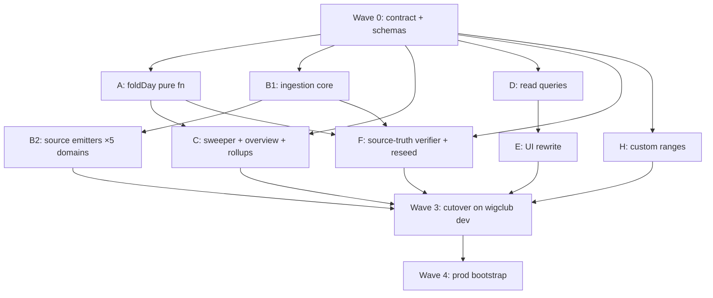

# Athena reporting rebuild — implementation plan (clean slate)

**Date:** 2026-07-28 (rev 2 — no backward-compatibility constraints)
**Design:** [athena-reporting-read-optimized-redesign-2026-07-28.md](athena-reporting-read-optimized-redesign-2026-07-28.md)
**Posture:** greenfield replacement. The new layer is built in a clean `convex/reports/` namespace, the legacy `convex/reporting/` code and all its tables are **deleted at cutover**, and both dev and prod reporting state are **re-ingested from source-of-truth domain tables** (POS transactions, online orders, service cases, daily closes, payments, stock ops). No fingerprint version shims, no identity-continuity constraints, no UI flags, no diff-against-legacy. This is safe because no operator depends on the current reports surfaces (proven broken in review: most surfaces render "Unavailable"), and the wigclub dev store is the proving ground before prod.

## What clean-slate buys (vs. rev 1)

- **Structural identity, no string keys.** Fact identity becomes separate indexed fields `(storeId, sourceDomain, sourceId, lineId, factKind)` — the escaping/forgery class of bugs is designed out, not mitigated.
- **One fact model from day one:** enum'd `factKind`, business-time `occurredAt` on every source, one fingerprint module (versioned JSON), no substring classification, no vestigial adapter layer.
- **Verification against truth, not against legacy:** the harness recomputes day totals independently from domain tables and compares to the fold. The legacy projections (known double-count/truncation bugs) are not a reference for anything.
- **Backfill = ingestion:** historical facts are derived by running the same ingestion code over historical domain rows. One code path for live, backfill, and prod bootstrap — nothing to drift.

## Problem

The rebuild replaced a layer touching every commerce domain — POS,
storefront, service, daily close, payments, stock — and deleted ~119 files
and 62 tables. Sequencing that as one long edit risks two failures: an
integration surprise discovered only at the end, and a half-migrated tree
where the old and new layers both partially work.

## Solution

Freeze the contract first, then fan the work out.

- **Wave 0 defines and freezes** the metric vocabulary, table schemas, and
  every cross-slice signature, plus compiling stubs. Nothing downstream can
  drift, because each slice compiles against the frozen shapes from its first
  minute.
- **Waves 1–2 run in parallel** on disjoint file ownership: fold, ingestion,
  sweeper, queries, UI, ranges, then five domain emitters and the verifier.
- **Wave 3 is a clean cutover, not a migration.** Legacy code and tables are
  deleted outright and the store is reseeded from domain sources, because no
  operator depended on the old surfaces.
- **Verification gates the cutover:** an independent verifier recomputes each
  day from domain tables; the diff must be adjudicated before prod.

## Prevention

- **Freeze the seam before parallelising.** Parallel work fails when slices
  negotiate interfaces mid-flight. A frozen contract plus stubs converts that
  negotiation into a compile step.
- **Give every slice disjoint file ownership**, and let it escalate rather
  than edit a shared contract. Every genuine conflict in this rebuild
  surfaced as an escalation, not a merge conflict.
- **Build the adversarial check as its own slice.** The verifier was written
  independently of the emitters and reseed mappers; sharing their code would
  have made it agree with them by construction.
- **Treat "build beside" versus "replace" as an explicit decision.** Here,
  clean replacement was available only because nothing depended on the old
  surfaces — that fact is what licensed deleting instead of migrating.

## Follow-on report-surface guidance

The rebuilt query layer remains the authority for report-period activity, while
the inventory search layer remains the authority for catalog discovery. A
Reports lookup should reuse the generic, store-scoped SKU search and navigate
to the existing SKU detail route with the exact `productSkuId`; it must not
filter a report snapshot or add a Reports-specific search backend.

Period context is route state. When a lookup begins from Overview or Items,
translate the visible period into the SKU-detail date range and retain the
origin tab and period for the return route. Catalog items without activity in
that range stay selectable: the detail route's empty state is the truthful
result.

Keep the list query's read budget explicit. Pagination, canonical product-name
resolution, and freshness disclosure belong at its existing query and UI seams;
they should not widen the report fact or rollup contracts.

## Ground rules for delegated slices

- **Namespaces:** `packages/athena-webapp/shared/reportsContract.ts` (Wave 0, frozen after) · `packages/athena-webapp/convex/schemas/reports/` (Wave 0, frozen after) · `packages/athena-webapp/convex/reports/` (all backend slices, one module per slice) · `src/components/reports/` + reports routes (slice E rewrites them outright — legacy report components are deleted, not branched).
- **Interfaces over imports:** slices depend only on the Wave 0 contract and the frozen signatures below. Contract change requests escalate; slices never edit the contract.
- **Each slice ships its own vitest tests.** The full run flakes 2–3 unrelated `waitFor` tests under load — judge slices on their own files.
- **Legacy code is read-only reference until Wave 3** (sign conventions, access checks, time authority). The only legacy modules that survive, moved into `convex/reports/`, are: store access gating (from `reporting/access.ts`) and the operating-day/timezone resolution logic (from `reporting/operatingPeriods.ts` + `storeTimeAuthority.ts`, simplified). Everything else in `convex/reporting/` is deleted at cutover.
- **Deploy blocker note:** dev deploys currently fail schema validation on the unrelated in-progress `inventoryImportReviewVersion.rawContent` change. Waves 0–2 are code + unit tests (unblocked); Wave 3 needs it resolved.

## Dependency graph



A, B1, C, D, F, H are mutually independent after Wave 0. B2 fans out into five parallel sub-slices once B1's API lands. E starts immediately against D's frozen query names.

---

## Wave 0 — contracts and schemas (serial, first, then frozen) — 1 slice, S/M

**Files:** `shared/reportsContract.ts`, `convex/schemas/reports/facts.ts`, `convex/schemas/reports/derived.ts`, registration in `convex/schema.ts`.

### Fact ledger (clean)

```ts
// schemas/reports/facts.ts
export const reportFactSchema = v.object({
  storeId: v.id("store"),
  // Structural identity — uniqueness enforced on the composite index, no string keys.
  sourceDomain: v.union(v.literal("pos"), v.literal("storefront"),
    v.literal("service"), v.literal("payments"), v.literal("inventory"),
    v.literal("daily_close")),
  sourceId: v.string(),          // domain document id (transaction, order, case, close…)
  lineId: v.string(),            // line discriminator; "" for header-level facts
  factKind: v.union(             // closed enum — no substring classification
    v.literal("sale"), v.literal("refund"), v.literal("void"),
    v.literal("correction"), v.literal("return"), v.literal("payment"),
    v.literal("payment_refund"), v.literal("close_snapshot"),
    v.literal("inventory_issue"), v.literal("procurement_receipt")),
  // Content integrity (replay/conflict detection), versioned from day one.
  fingerprint: v.string(),       // JSON-array hash, built ONLY by reports/fingerprint.ts
  fingerprintVersion: v.number(),
  // Business time is authoritative; sync/arrival time is metadata.
  occurredAt: v.number(),        // when the business event happened
  recordedAt: v.number(),        // when Athena learned of it
  operatingDate: v.string(),     // store-local operating day, resolved at ingest
  // Measures
  currency: v.string(),
  grossAmountMinor: v.number(),
  netAmountMinor: v.number(),
  taxAmountMinor: v.number(),    // captured, not dropped (legacy dropped line tax)
  discountAmountMinor: v.number(),
  quantity: v.number(),
  productSkuId: v.optional(v.id("productSku")),
  unitCostMinor: v.optional(v.number()),  // cost snapshot when known at source
  quarantine: v.optional(v.object({       // conflict parking, one place
    reason: v.string(), detectedAt: v.number(),
  })),
});
// .index("by_identity", ["storeId","sourceDomain","sourceId","lineId","factKind"]) // uniqueness
// .index("by_storeId_operatingDate", ["storeId","operatingDate"])                  // the fold's read
// .index("by_storeId_productSkuId_operatingDate", ["storeId","productSkuId","operatingDate"])
```

No separate ingress staging table, no source-reference table, no processing-attempt table: emitters write facts directly inside the domain transaction (Convex mutations are transactional — if the sale commits, its facts committed with it). Replay = same identity + same fingerprint → no-op; same identity + different fingerprint → overwrite-with-quarantine-note is **not** allowed — the fact is replaced only via an explicit correction fact; mismatch parks a `quarantine` marker on the existing row and dirties the day.

### Derived tables

Exactly the design doc's five tables — `reportDay`, `reportSkuDay`, `reportOverview`, `reportPeriodSkuRollup`, `reportDirtyDay`, plus `reportRangeResult` — schemas and indexes as specified there, metric-as-field, `FOLD_VERSION = 1`.

### Contract module

Metric field names/types, `DayStatus`, `FoldFact`/`DayFoldResult`, `PeriodSnapshot`/`OverviewDoc`, period-key + sort-key helpers, `RecordFactsInput` (B1's API type), query result types (D), and a parity test asserting validator ↔ TS type agreement (kills the key-namespace bug class at compile time).

**Acceptance:** `tsc --noEmit` + codegen + parity test green.

---

## Wave 1 — parallel backend slices

### Slice A — `foldDay` pure function (M)
**Files:** `convex/reports/foldDay.ts`, `foldDay.test.ts`. Zero Convex imports.
**Signature:** `foldDay(facts: FoldFact[], close?: CloseRef): DayFoldResult`.
**Behavior:** sort `(occurredAt, sourceId, lineId)`; per-kind fold (legacy `factContributions.ts` is sign-convention *reference only* — where review found its behavior wrong, fold to truth, and document each deliberate divergence in the test file); quarantined facts excluded from metrics, counted in a `quarantinedCount` flag; `grossProfitMinor` from `unitCostMinor` facts only, else accumulate `uncostedRevenueMinor`; status derivation (`provisional`/`reconciled` + variance/`amended` + deltas) per design doc; `mixedCurrency` flag, store-currency facts only in totals.
**Tests:** golden per kind; determinism; order-independence; close variance/amendment; quarantine exclusion.

### Slice B1 — ingestion core (M)
**Files:** `convex/reports/ingest.ts`, `fingerprint.ts`, `operatingDay.ts` (ports + simplifies the timezone/operating-day resolver from legacy `operatingPeriods.ts`/`storeTimeAuthority.ts`), tests.
**API (frozen):** `recordFacts(ctx, input: RecordFactsInput): Promise<void>` — called inside domain mutations. Resolves `operatingDate` from `occurredAt` via store time authority; upserts by structural identity (replay no-op / conflict → quarantine marker + dirty day); patches open-day docs incrementally (additive `reportDay` + `reportSkuDay` upserts) or dirties closed days; never throws into the caller (contains failures by dirtying the day — the fold repairs).
**Tests:** identity upsert semantics, replay/conflict, open vs closed day routing, error containment, operating-day resolution incl. non-UTC boundaries.

### Slice B2 — source emitters, five parallel sub-slices (each S)
Rewrite each domain's reporting emission to call `recordFacts` with typed, enum'd facts and **business-time `occurredAt`**. Legacy `appendReportingIngressWithCtx` calls are replaced (call sites from review): 
- **B2-pos:** `pos/application/commands/completeTransaction.ts`, `adjustTransactionItems.ts`, `correctTransaction.ts`, `pos/infrastructure/repositories/localSyncRepository.ts` — offline sync passes the original sale timestamp, not sync time.
- **B2-storefront:** `storeFront/onlineOrder.ts` (3 sites) — line-level facts incl. `pendingCheckoutItemId`-free clean SKU attribution.
- **B2-service:** `serviceOps/serviceCases.ts` — currency always set from store.
- **B2-ops:** `operations/dailyClose.ts`, `operations/paymentAllocations.ts` — close snapshots and payment facts.
- **B2-stock:** `stockOps/receiving.ts`, `stockOps/purchaseOrders.ts` — procurement/inventory facts with `unitCostMinor`.
Each sub-slice owns its domain files + updates that domain's existing tests. **Acceptance per sub-slice:** domain tests green; every emitted fact validates against the contract; no references to legacy `reporting/ingress` remain in the domain.

### Slice C — sweeper, overview, rollups (L)
**Files:** `convex/reports/sweeper.ts`, `overview.ts`, `rollups.ts`, cron registration; tests.
As per design doc: 5-min cron, bounded dirty-day batches in `markedAt` order, refold (facts via `by_storeId_operatingDate` — a plain index read now, no window math), replace day + sku-day docs, upsert `d:`/`w:`/`m:` rollups from sku-day docs, rebuild overview (≤ ~65 doc reads), clear marks, re-mark open day, compute pending `reportRangeResult` work (H's `computeRange`), expire per `expiresAt`, enforce retention. Store allowlist gate for dev rollout (wigclub first).
**Tests:** fold-replaces-incremental; overview vs hand-built days; rollup idempotence; mark lifecycle; range pickup; expiry.

### Slice D — read queries (M)
**Files:** `convex/reports/queries.ts`, `access.ts` (ported `requireReportingStoreAccess`), tests.
**Frozen names:** `reports.queries.getOverview` (1 doc) · `listDays({range})` (≤ 92 docs) · `listPeriodSkus({periodKey, sortBy, cursor})` (10-doc index page, context-bound opaque cursor) · `getSkuDetail({productSkuId, range})` (≤ 92 docs) · `getRangeResult({requestKey})` · `requestRange` mutation lives in H but its result shape is contract-frozen here.
**Acceptance:** tests incl. access denial + cursor rejection; per-query worst-case read ledger in comments.

### Slice F — source-truth verifier + reseed (M/L)
**Files:** `convex/reports/verify.ts`, `reseed.ts`, tests.
- `reseedStoreReporting(storeId)` (internal): delete all `reportFact` + derived docs for the store, then walk historical domain tables (completed POS transactions, fulfilled online orders, service completions, accepted daily closes, payment allocations, receipts/POs) in pages, invoking **the same B2 emitter functions** per historical row (emitters are factored so the fact-construction step is callable outside the live mutation), dirty all touched days. This is prod bootstrap, dev reseed, and disaster recovery — one path.
- `verifyDayAgainstSources(storeId, operatingDate)` (internal): recompute the day's totals **directly from domain tables** (independent implementation — deliberately not sharing the emitters' code) and diff against the folded `reportDay`. `verifyStoreSummary` aggregates.
**Tests:** seeded domain rows → reseed → fold → verify agrees; verifier catches an injected wrong fact.

### Slice H — custom ranges (S)
**Files:** `convex/reports/customRange.ts`, tests. `requestRange` mutation (≤ 366 days, requestKey dedupe, 7-day expiry) + `computeRange(ctx, req)` reading only day/sku-day docs (test-asserted), invoked by C's sweeper.

---

## Wave 2 — UI rewrite (parallel with Wave 1; D's names are frozen above)

### Slice E — reports UI (L)
**Files:** `src/components/reports/**` rewritten, the four report routes rewritten (`validateSearch` wired with real schemas), legacy report components and the legacy `reportDestinations` mapping deleted.
Overview subscribes to `getOverview` **only** (KPIs, `dailyTrend` chart, trust strip); Items = `listPeriodSkus` with revenue/units sort + real pagination; SKU detail = `getSkuDetail`; day drill-down = `listDays`; custom range = `requestRange` + subscribe `getRangeResult` (no polling). All metric access via `shared/reportsContract.ts` — no string literals. Only computable classifications get UI affordances.
**Acceptance:** typecheck + component tests; zero imports from `convex/reporting/*` (legacy) or `convex/_generated` references to deleted functions.

---

## Wave 3 — cutover on wigclub dev (serial, one agent + human adjudication)

1. Resolve the unrelated `inventoryImportReviewVersion.rawContent` deploy blocker (coordinate with in-progress work).
2. **Delete legacy:** remove `convex/reporting/` (all of it — ingress, projections, readModels, maintenance, inventory valuation reporting, evidence/SKU-attribution*, coverage/health/activation/scheduling), the ~40 legacy `reporting*` tables from `convex/schema.ts`, legacy report UI remnants, and the legacy reporting cron. Full-repo reference sweep; POS/storefront/service compile via their B2 rewrites. (*Pre-check: confirm `evidence.ts` SKU-attribution has no non-reporting consumers; review indicated POS pending-checkout flows touch it — if real consumers exist, that machinery moves to the POS domain, not deleted.)
3. Deploy to dev. Legacy reporting tables drop from the schema; their data is abandoned (clean slate — no migration).
4. Run `reseedStoreReporting(wigclub)` — re-ingests from domain sources (~64 days), sweeper folds all days.
5. Run `verifyStoreSummary(wigclub)`; adjudicate mismatches against raw domain rows (human step). Record adjudications — this is the prod-readiness evidence.
6. Enable sweeper allowlist for wigclub; land live POS test transactions; watch open-day incremental → fold-at-close lifecycle.
7. Walk all four UI surfaces; confirm no "—"/"Unavailable" anywhere and numbers match verified folds.
8. **Measure one week** of Convex dashboard read/bandwidth on report functions; confirm the read budgets (overview ≤ 1 doc/execution, ≤ sweep-cadence re-runs).

## Wave 4 — prod

Deploy (drops legacy tables in prod schema), `reseedStoreReporting` for wigclub prod from prod domain data, `verifyStoreSummary`, enable sweeper + UI. Same sequence as dev, no shortcuts. Rollback story: reporting is fully derived — rollback = redeploy prior code; source domain tables are never written by this system.

## Delegation summary

| Slice | Depends on | Size | Parallel group |
| --- | --- | --- | --- |
| W0 contracts/schemas | — | S/M | solo, first |
| A fold | W0 | M | 1 |
| B1 ingestion core | W0 | M | 1 |
| B2 ×5 domain emitters | B1 API | S each | 2 (5-way parallel) |
| C sweeper/overview | W0 (+A to integrate) | L | 1 |
| D queries | W0 | M | 1 |
| E UI | D names (frozen) | L | 1 |
| F verifier/reseed | W0, B1 emit fn, A | M/L | 2 |
| H ranges | W0 | S | 1 |

Suggested run: Wave 0 solo → launch A, B1, C, D, E, H concurrently (6 agents, worktrees) → when B1 lands, launch the five B2 sub-slices + F (6 more, parallel) → Wave 3 single-threaded with human adjudication at steps 5 and 7.
